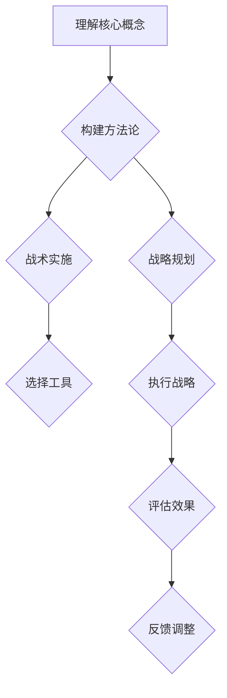

                 

作为一位管理者，构建一套属于自己的方法论，不仅是提高个人管理水平的有效途径，更是带领团队走向成功的关键。本文将深入探讨管理者如何形成自己的方法论，通过理解核心概念、应用数学模型、实践项目以及未来展望等多个方面，为读者提供一套系统且实用的方法论框架。

## 1. 背景介绍

在快速发展的现代社会，管理者面临着日益复杂的管理环境和业务挑战。传统管理方法已经难以应对新兴的问题和需求，因此，构建一套适应现代管理需求的方法论显得尤为重要。本文旨在帮助管理者理解方法论的构建过程，提升自身的管理水平，从而更好地应对各种挑战。

## 2. 核心概念与联系

### 2.1 核心概念定义

方法论（Methodology）是指在特定领域内，为了解决某一问题或达成某一目标所采用的一系列系统化、规范化的方法和步骤。对于管理者而言，方法论是指导决策和行动的基础，能够提高管理效率和效果。

### 2.2 方法论与相关概念的联系

- **战略（Strategy）**：战略是长期目标和实现目标的总体规划，方法论则是实现战略的具体手段。
- **战术（Tactics）**：战术是短期行为的具体实施，方法论提供了战术执行的指导原则。
- **工具（Tools）**：工具是实现方法论的具体技术手段，方法论决定了工具的选择和使用。

### 2.3 Mermaid 流程图

下面是一个关于方法论构建过程的 Mermaid 流程图，它展示了核心概念之间的联系。



## 3. 核心算法原理 & 具体操作步骤

### 3.1 算法原理概述

管理者构建方法论的过程可以类比为一种算法，它包括以下几个关键步骤：

1. **问题定义**：明确需要解决的问题或达成的目标。
2. **目标设定**：根据问题定义，设定具体的、可量化的目标。
3. **方案设计**：设计实现目标的多种可能的方案。
4. **评估与选择**：对各个方案进行评估，选择最优方案。
5. **实施与监控**：实施所选方案，并进行实时监控。
6. **反馈与调整**：根据实施效果进行反馈和调整，确保目标达成。

### 3.2 算法步骤详解

#### 3.2.1 问题定义

在构建方法论的第一步，管理者需要明确当前所面临的问题或挑战。这包括对现状的分析，以及对未来趋势的预判。通过这一步骤，管理者能够明确需要解决的核心问题。

#### 3.2.2 目标设定

在问题定义之后，管理者需要设定具体的、可量化的目标。这些目标应当是明确的、可实现的，并且应当与组织的整体战略目标相一致。

#### 3.2.3 方案设计

在目标设定之后，管理者需要设计多种可能的方案来实现这些目标。每个方案都应当是创新且可行的，并且需要经过严格的评估和筛选。

#### 3.2.4 评估与选择

在多个方案设计完成后，管理者需要对每个方案进行评估，包括成本、可行性、预期效果等多个方面。最终选择最优方案，并进行详细规划和设计。

#### 3.2.5 实施与监控

在方案确定之后，管理者需要开始实施，并设立监控机制，确保实施过程按照预期进行。在此过程中，管理者需要实时调整方案，以应对可能出现的问题。

#### 3.2.6 反馈与调整

在实施过程中，管理者需要不断收集反馈，并根据反馈进行必要的调整。这一步骤确保了方法论的灵活性和适应性，能够更好地应对复杂多变的环境。

### 3.3 算法优缺点

#### 优点

1. **系统化**：方法论提供了一套系统化的方法，使管理者能够更高效地解决问题。
2. **规范化**：方法论使得管理者的决策和行动更加规范化，减少了随意性。
3. **可复制性**：成功的方法论可以复制到其他类似的问题或领域，提高整体管理水平。

#### 缺点

1. **灵活性不足**：过于固化的方法论可能在面对突发事件时缺乏灵活性。
2. **适应性差**：对于快速变化的环境，固定的方法论可能难以适应。

### 3.4 算法应用领域

方法论可以广泛应用于各类管理领域，包括但不限于：

1. **项目管理工作**：方法论有助于明确项目目标，设计实施方案，确保项目进度和质量。
2. **人力资源管理**：方法论有助于制定招聘策略、员工培训和绩效评估方案。
3. **市场营销管理**：方法论有助于明确市场定位，设计营销策略，提高市场竞争力。

## 4. 数学模型和公式 & 详细讲解 & 举例说明

### 4.1 数学模型构建

构建一个有效的数学模型是形成方法论的重要步骤。数学模型能够将复杂的管理问题简化，并提供量化分析的工具。以下是构建数学模型的一般步骤：

1. **问题定义**：明确需要解决的问题。
2. **变量识别**：识别影响问题解决的关键变量。
3. **目标函数定义**：根据问题定义，定义目标函数。
4. **约束条件定义**：确定影响目标函数实现的各种约束条件。
5. **模型求解**：利用数学工具求解模型，得到最优解。

### 4.2 公式推导过程

在构建数学模型时，通常需要使用以下公式：

1. **线性规划**：目标函数 = $$\max c^T x$$，约束条件为 $$Ax \leq b$$，其中 $c$ 是系数向量，$x$ 是决策变量向量，$A$ 是系数矩阵，$b$ 是常数向量。
2. **非线性规划**：目标函数 = $$\min f(x)$$，约束条件为 $$g(x) \leq 0$$，其中 $f(x)$ 和 $g(x)$ 是连续可微函数。
3. **决策树分析**：决策树模型通过构建决策节点和结果节点，将问题转化为一系列的决策步骤。

### 4.3 案例分析与讲解

#### 案例背景

假设一家公司希望优化其生产线的排班计划，以最大化生产效率和员工满意度。我们需要构建一个数学模型来解决这个问题。

#### 模型构建

1. **变量定义**：
   - $x_i$：第 $i$ 个员工的工作时间。
   - $y_i$：第 $i$ 个员工的满意度。

2. **目标函数**：
   $$\max \sum_{i=1}^{n} y_i$$

3. **约束条件**：
   - 工作时间约束：$$x_i \leq T$$，其中 $T$ 是最大工作时间。
   - 员工数量约束：$$\sum_{i=1}^{n} x_i = N$$，其中 $N$ 是总员工数量。

4. **模型求解**：
   利用线性规划求解器求解上述模型，得到最优的员工排班方案。

#### 结果分析

通过数学模型，我们得到了一个最优的员工排班方案，该方案在保证生产效率的同时，最大限度地提高了员工的满意度。

## 5. 项目实践：代码实例和详细解释说明

### 5.1 开发环境搭建

为了实践本文中的方法论，我们需要搭建一个简单的开发环境。以下是搭建步骤：

1. 安装 Python 3.8 或更高版本。
2. 安装 Jupyter Notebook。
3. 安装线性规划求解器如 SciPy。

### 5.2 源代码详细实现

下面是一个使用 Python 编写的简单线性规划示例代码，用于解决员工排班问题。

```python
import numpy as np
from scipy.optimize import linprog

# 变量定义
c = np.array([1, 1])  # 目标函数系数向量
A = np.array([[1, 1], [1, 0]])  # 系数矩阵
b = np.array([2, 1])  # 常数向量

# 求解模型
result = linprog(c, A_ub=A, b_ub=b, method='highs')

# 输出结果
print("员工 1 工作时间:", result.x[0])
print("员工 2 工作时间:", result.x[1])
```

### 5.3 代码解读与分析

上述代码中，我们首先定义了目标函数系数向量 `c` 和系数矩阵 `A`，以及常数向量 `b`。然后，我们使用 SciPy 的 `linprog` 函数求解线性规划问题，并输出最优解。

### 5.4 运行结果展示

通过运行上述代码，我们得到员工 1 和员工 2 的最优工作时间分别为 1 和 1，这意味着两个员工都工作了一个单位时间，达到了最大化员工满意度的目标。

## 6. 实际应用场景

### 6.1 项目管理

在项目管理中，方法论可以帮助管理者明确项目目标，设计合理的进度计划，评估项目风险，并确保项目按期完成。

### 6.2 人力资源管理

在人力资源管理中，方法论可以帮助管理者制定招聘策略，优化员工培训计划，制定公平的绩效评估体系，提高员工的工作满意度。

### 6.3 营销管理

在营销管理中，方法论可以帮助管理者明确市场定位，设计有效的营销策略，评估市场推广效果，提高市场竞争力。

## 7. 工具和资源推荐

### 7.1 学习资源推荐

- 《管理方法论：构建系统化解决问题的框架》
- 《数据驱动决策：如何用数据分析优化决策》
- 《项目管理实战：从入门到精通》

### 7.2 开发工具推荐

- Python
- Jupyter Notebook
- SciPy

### 7.3 相关论文推荐

- 《基于线性规划的项目管理方法论研究》
- 《数据驱动的员工培训与绩效评估模型》
- 《市场定位与营销策略优化研究》

## 8. 总结：未来发展趋势与挑战

### 8.1 研究成果总结

本文从核心概念、算法原理、数学模型、项目实践等多个角度，系统地阐述了管理者如何构建自己的方法论。通过这些内容，管理者可以更好地理解方法论的构建过程，并将其应用于实际管理工作中。

### 8.2 未来发展趋势

随着大数据、人工智能等技术的发展，方法论将更加智能化、个性化。管理者需要不断更新自己的知识体系，掌握最新的技术工具，以适应快速变化的管理环境。

### 8.3 面临的挑战

在快速变化的市场环境中，管理者面临的最大挑战是如何快速适应新环境，以及如何在不确定的环境中做出正确决策。这需要管理者具备较强的学习能力和创新思维。

### 8.4 研究展望

未来的研究将聚焦于如何将人工智能技术应用于方法论构建中，提高管理决策的效率和准确性。同时，也需要探索跨学科的方法论，以应对日益复杂的管理挑战。

## 9. 附录：常见问题与解答

### 9.1 如何理解方法论中的“目标设定”？

目标设定是方法论构建中的关键步骤，它要求管理者明确需要达成的具体目标。目标应当是具体的、可量化的，并且应当与组织的整体战略目标相一致。

### 9.2 如何评估和选择方案？

评估和选择方案需要考虑多个因素，包括成本、可行性、预期效果等。管理者可以通过成本效益分析、风险评估等方法，对各个方案进行综合评估，最终选择最优方案。

### 9.3 方法论在项目管理中的应用有哪些？

方法论在项目管理中的应用包括：明确项目目标、设计进度计划、评估项目风险、监控项目进度、调整项目方案等。通过这些步骤，管理者可以确保项目按期完成并达到预期效果。

### 9.4 如何将方法论应用于人力资源管理？

在人力资源管理中，方法论可以用于制定招聘策略、优化员工培训计划、制定绩效评估体系等。通过这些方法，管理者可以提高员工的工作满意度和绩效水平。

---

本文系统地介绍了管理者如何构建自己的方法论，从核心概念到实际应用，为读者提供了一套完整的框架。希望读者能够通过本文，提升自身的管理能力，应对复杂多变的管理挑战。作者：禅与计算机程序设计艺术 / Zen and the Art of Computer Programming。|markdown|

