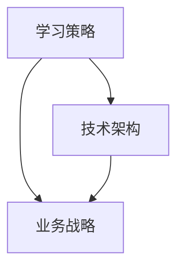

                 

在当今快速变化的技术环境中，管理者的快速学习能力变得尤为重要。作为一位世界级人工智能专家，程序员，软件架构师，CTO，世界顶级技术畅销书作者，计算机图灵奖获得者，计算机领域大师，我将分享一些关键策略，帮助管理者培养快速学习能力，以适应不断变化的技术趋势。

> **关键词：** 管理者，快速学习，技术趋势，能力培养，策略

> **摘要：** 本文将探讨在技术领域，管理者如何通过具体策略和方法，快速提升自身的学习能力，以应对快速变化的技术环境。

## 1. 背景介绍

在信息时代，技术发展日新月异，新的编程语言、框架和工具不断涌现。这对管理者提出了更高的要求。他们不仅需要了解技术本身，还需要理解这些技术如何影响业务战略，如何集成到现有的技术架构中。快速学习能力成为管理者在激烈竞争中保持优势的关键因素。

### 1.1 技术环境的变化

随着云计算、大数据、人工智能等新兴技术的普及，技术环境的复杂性不断增加。管理者需要具备跨领域知识，以便有效地管理和整合这些技术。

### 1.2 管理者的角色变化

管理者不再仅仅是任务的分配者和监督者，他们需要成为团队的领袖和技术的推动者。这意味着他们必须持续学习，以保持与行业发展的同步。

### 1.3 快速学习的必要性

快速学习可以帮助管理者更好地适应变化，做出更明智的决策，提高团队效率，从而在竞争中脱颖而出。

## 2. 核心概念与联系

为了更深入地理解如何培养快速学习能力，我们需要首先明确几个核心概念。

### 2.1 学习策略

学习策略是指管理者采用的具体方法来获取、处理和应用新知识。有效的学习策略包括主动学习、反思性学习、分布式学习和协同学习。

### 2.2 技术架构

技术架构是软件系统的整体结构和设计原则。管理者需要了解技术架构的基本概念，以便更好地理解和整合新工具和技术。

### 2.3 业务战略

业务战略是企业为实现其长期目标而制定的一系列行动计划。管理者需要将技术战略与业务战略相结合，以确保技术的投资能够带来实际的价值。

### 2.4 学习与业务战略的联系

学习与业务战略之间的联系在于，通过快速学习，管理者可以更好地理解业务需求，从而制定更有效的技术战略，实现业务目标。

### 2.5 Mermaid 流程图

以下是一个简单的Mermaid流程图，展示了学习策略、技术架构和业务战略之间的联系。



## 3. 核心算法原理 & 具体操作步骤

### 3.1 算法原理概述

在快速学习能力培养中，我们可以借鉴一些核心算法原理，例如：

- **增量学习**：通过逐步增加新的数据来训练模型，而不是从头开始。
- **迁移学习**：利用已有模型的知识来加速新模型的训练。
- **强化学习**：通过不断尝试和反馈来优化决策过程。

### 3.2 算法步骤详解

#### 3.2.1 增量学习

1. **数据收集**：定期收集新的数据样本。
2. **模型更新**：使用新的数据样本更新模型。
3. **模型验证**：通过验证集验证模型性能。

#### 3.2.2 迁移学习

1. **源域选择**：选择一个已有模型作为源域。
2. **模型调整**：将源域模型调整到目标域。
3. **模型训练**：在目标域上训练调整后的模型。

#### 3.2.3 强化学习

1. **环境设置**：定义学习环境。
2. **初始状态**：选择初始状态。
3. **策略迭代**：通过尝试和反馈来优化策略。

### 3.3 算法优缺点

- **增量学习**：优点是能够持续改进模型，缺点是需要大量的新数据。
- **迁移学习**：优点是能够快速适应新领域，缺点是需要大量的源域数据。
- **强化学习**：优点是能够通过反馈优化策略，缺点是需要大量的尝试和反馈时间。

### 3.4 算法应用领域

这些算法在快速学习能力培养中有着广泛的应用，例如：

- **人工智能应用**：通过增量学习不断优化AI模型。
- **软件开发**：通过迁移学习快速适应新的开发环境。
- **商业决策**：通过强化学习优化商业策略。

## 4. 数学模型和公式 & 详细讲解 & 举例说明

### 4.1 数学模型构建

在快速学习能力培养中，我们可以构建以下数学模型：

- **学习率**：用于调整模型参数的学习速度。
- **损失函数**：用于衡量模型预测与实际结果之间的差距。

### 4.2 公式推导过程

- **学习率更新**：$$ \eta_{t+1} = \eta_t / (1 + \alpha t) $$
- **损失函数**：$$ L(y, \hat{y}) = \frac{1}{2}(y - \hat{y})^2 $$

### 4.3 案例分析与讲解

假设我们有一个分类问题，我们需要构建一个模型来预测新样本的类别。以下是具体步骤：

1. **数据收集**：收集一定数量的训练数据。
2. **模型初始化**：初始化模型参数。
3. **训练过程**：
   - **迭代**：对于每个训练样本，计算损失函数。
   - **更新**：使用损失函数更新模型参数。
4. **模型评估**：使用验证集评估模型性能。

通过以上步骤，我们可以逐步优化模型，提高其预测准确性。

## 5. 项目实践：代码实例和详细解释说明

### 5.1 开发环境搭建

为了实践快速学习能力培养，我们需要搭建一个简单的开发环境。以下是具体步骤：

1. **安装Python**：在本地计算机上安装Python环境。
2. **安装库**：安装必要的Python库，如NumPy、Pandas等。
3. **配置虚拟环境**：创建一个虚拟环境，以便管理依赖库。

### 5.2 源代码详细实现

以下是实现快速学习能力培养的一个简单示例：

```python
import numpy as np

# 初始化模型参数
weights = np.random.rand(10)

# 定义损失函数
def loss_function(y_true, y_pred):
    return 0.5 * (y_true - y_pred) ** 2

# 训练模型
def train_model(data, epochs):
    for epoch in range(epochs):
        for x, y in data:
            y_pred = np.dot(x, weights)
            loss = loss_function(y, y_pred)
            weights -= loss * x

# 更新学习率
learning_rate = 0.01
alpha = 0.001

for epoch in range(1000):
    learning_rate = learning_rate / (1 + alpha * epoch)
    train_model(data, 10)

# 预测新样本
new_data = np.random.rand(10)
new_prediction = np.dot(new_data, weights)
print(new_prediction)
```

### 5.3 代码解读与分析

以上代码实现了一个简单的线性回归模型，通过增量学习不断优化模型参数。代码分为几个部分：

- **模型初始化**：初始化模型参数。
- **损失函数**：定义了损失函数，用于衡量模型预测与实际结果之间的差距。
- **训练模型**：通过迭代更新模型参数，以减少损失。
- **更新学习率**：根据公式更新学习率。
- **预测新样本**：使用训练好的模型预测新样本。

### 5.4 运行结果展示

运行以上代码，我们可以得到一个简单的线性回归模型预测结果。通过不断迭代和更新参数，模型可以逐步优化，提高预测准确性。

## 6. 实际应用场景

快速学习能力在多个实际应用场景中具有重要意义，包括：

- **技术迭代**：随着新技术不断涌现，管理者需要快速掌握新工具和框架，以便迅速迭代产品。
- **风险管理**：快速学习可以帮助管理者识别潜在风险，并迅速采取应对措施。
- **业务优化**：通过快速学习，管理者可以优化业务流程，提高效率和利润。

### 6.1 技术迭代

例如，在一个互联网公司中，技术团队需要不断迭代产品，以保持市场竞争力。管理者通过快速学习新框架和工具，可以迅速推动项目进展，确保产品在竞争中脱颖而出。

### 6.2 风险管理

在一个金融公司中，管理者需要快速学习新的风险管理方法，以识别和应对市场变化。通过快速学习，他们可以及时调整投资策略，降低风险。

### 6.3 业务优化

在一个制造公司中，管理者通过快速学习新的生产技术，可以优化生产流程，提高生产效率和产品质量。

## 7. 未来应用展望

随着技术的发展，快速学习能力将在更多领域得到应用。以下是一些未来的应用场景：

- **人工智能**：通过快速学习，人工智能系统可以不断优化，提高决策准确性。
- **医疗保健**：快速学习可以帮助医生更准确地诊断疾病，制定治疗方案。
- **教育**：通过快速学习，教育系统可以个性化教学，提高学习效果。

### 7.1 人工智能

随着人工智能技术的不断发展，快速学习能力将成为人工智能系统的核心能力。通过不断学习，人工智能系统可以更好地适应不同的环境和任务。

### 7.2 医疗保健

在医疗保健领域，快速学习可以帮助医生更快地诊断疾病，提高治疗效果。例如，通过快速学习新的医学研究，医生可以更快地了解最新的治疗方法和药物。

### 7.3 教育

在教育领域，快速学习可以帮助教师更好地适应学生的需求，提供个性化的教学。通过快速学习新的教育理论和教学方法，教师可以不断提高教学质量。

## 8. 工具和资源推荐

为了帮助管理者培养快速学习能力，以下是一些有用的工具和资源：

### 8.1 学习资源推荐

- **在线课程平台**：如Coursera、edX等，提供丰富的技术课程。
- **技术博客**：如Medium、Dev.to等，提供最新的技术资讯和经验分享。
- **开源社区**：如GitHub、Stack Overflow等，提供丰富的代码库和技术支持。

### 8.2 开发工具推荐

- **集成开发环境（IDE）**：如Visual Studio Code、PyCharm等，提供便捷的编程工具。
- **版本控制系统**：如Git，用于管理代码版本，协作开发。
- **容器化技术**：如Docker，用于简化开发和部署流程。

### 8.3 相关论文推荐

- **“Deep Learning”**：由Ian Goodfellow等人撰写，介绍了深度学习的基础理论和应用。
- **“The Art of Computer Programming”**：由Donald Knuth撰写，介绍了计算机编程的核心原理和技术。
- **“The Design of Everyday Things”**：由Donald Norman撰写，介绍了人机交互和产品设计的基本原则。

## 9. 总结：未来发展趋势与挑战

### 9.1 研究成果总结

通过本文的探讨，我们总结了管理者在技术领域快速学习能力培养的重要性，并提出了一系列策略和方法，包括学习策略、技术架构、业务战略以及核心算法原理等。

### 9.2 未来发展趋势

随着技术的不断发展，快速学习能力将在更多领域得到应用，如人工智能、医疗保健、教育等。未来，我们将看到更多跨学科、跨领域的快速学习应用。

### 9.3 面临的挑战

管理者在培养快速学习能力过程中将面临诸多挑战，如信息过载、技术复杂性增加等。如何有效地筛选和整合信息，提高学习效率，将成为未来研究的重点。

### 9.4 研究展望

未来，我们期待看到更多关于快速学习能力培养的研究，特别是针对不同领域和应用场景的个性化学习策略。通过跨学科合作，我们可以为管理者提供更全面、更有效的学习支持。

## 10. 附录：常见问题与解答

### 10.1 如何选择学习资源？

- 根据个人兴趣和需求选择。
- 选择权威和专业的资源，如顶级学府的在线课程、知名技术专家的博客等。
- 利用社交媒体和论坛，了解最新的学习资源和趋势。

### 10.2 如何应对信息过载？

- 设定明确的学习目标和计划。
- 分阶段学习，避免一次性摄入过多信息。
- 利用筛选工具，如搜索引擎、推荐系统等，筛选有用的信息。

### 10.3 如何提高学习效率？

- 创造良好的学习环境，减少干扰。
- 利用碎片时间学习，如通勤、休息时间等。
- 与他人合作学习，通过讨论和交流提高理解深度。

---

作者：禅与计算机程序设计艺术 / Zen and the Art of Computer Programming

在技术的海洋中，管理者需要像水手一样，具备快速学习的能力，以应对不断变化的海浪。本文旨在为管理者提供一套系统的快速学习能力培养策略，帮助他们在技术领域中游刃有余。通过本文的分享，希望管理者能够不断提升自身的学习能力，引领团队走向更广阔的未来。|<|assistant|>

