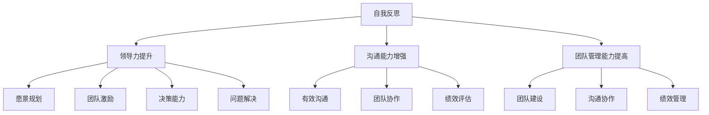

                 

 关键词：管理者，自我反思，成长，IT行业，领导力，技术管理，团队建设

> 摘要：本文旨在探讨在IT行业背景下，管理者如何通过自我反思与成长来提升领导力和团队效能。文章将深入分析自我反思的重要性，以及管理者在技术、沟通和团队管理方面的成长路径，并探讨未来的发展趋势和面临的挑战。

## 1. 背景介绍

在快速发展的IT行业，管理者面临着前所未有的挑战和机遇。技术迭代迅猛，市场需求变化莫测，这要求管理者不仅需要具备深厚的专业背景，还要具备卓越的领导力和管理能力。然而，许多管理者在职业生涯中往往忽视了自我反思这一关键环节，导致在应对复杂问题时显得力不从心。

自我反思是指个体对自身行为、思维和情感进行深入分析的过程。通过自我反思，管理者可以更清楚地认识到自己的优点和不足，从而有针对性地进行改进。本文将围绕自我反思的重要性，探讨管理者在技术、沟通和团队管理方面的成长路径，并分析未来发展趋势和面临的挑战。

## 2. 核心概念与联系

### 2.1 自我反思的概念

自我反思是一个深层次的认识过程，它要求个体从多个维度审视自己的行为、思维和情感。在IT行业中，自我反思对于管理者来说尤为重要，因为技术环境瞬息万变，市场压力不断加大，只有通过持续的自我反思，管理者才能保持敏锐的洞察力和适应能力。

### 2.2 领导力的核心要素

领导力是管理者的核心素质，它包括愿景规划、团队激励、决策能力和问题解决等多个方面。有效的领导力可以激发团队的潜力，推动项目的成功，实现企业的目标。

### 2.3 团队管理的原则

团队管理是管理者的重要职责，它涉及团队建设、沟通协作、绩效评估等多个方面。有效的团队管理可以提升团队的凝聚力，提高工作效率，实现团队的共同目标。

### 2.4 Mermaid 流程图



## 3. 核心算法原理 & 具体操作步骤

### 3.1 算法原理概述

管理者自我反思的核心算法可以概括为“三步法”：首先是自我认知，其次是目标设定，最后是行动计划。

#### 3.1.1 自我认知

自我认知是自我反思的基础，管理者需要通过多种途径了解自己的优点和不足。这包括自我评价、同事反馈、导师指导等。

#### 3.1.2 目标设定

在自我认知的基础上，管理者需要设定清晰的目标。这些目标应该是具体的、可衡量的、可实现的和有时限的（SMART原则）。

#### 3.1.3 行动计划

行动计划是将目标转化为行动的过程。管理者需要制定详细的行动计划，包括具体的时间表、责任分配和资源需求。

### 3.2 算法步骤详解

#### 3.2.1 自我认知

1. **自我评价**：回顾过去的经验和成就，识别自己的优点和不足。
2. **同事反馈**：征求同事和下属的意见，了解他们对自己的看法。
3. **导师指导**：向导师请教，获取专业的意见和建议。

#### 3.2.2 目标设定

1. **明确目标**：基于自我认知的结果，设定具体的职业目标。
2. **制定计划**：将目标分解为若干个具体任务，并为每个任务设定时间表和责任分配。

#### 3.2.3 行动计划

1. **制定行动计划**：将任务和责任分配到个人或团队，确保每个任务都有明确的时间表和资源。
2. **执行与跟踪**：按照行动计划执行任务，定期检查进度，及时调整计划。

### 3.3 算法优缺点

#### 3.3.1 优点

- **提升自我认知**：通过自我反思，管理者可以更清晰地了解自己的优势和劣势。
- **明确目标**：目标设定有助于管理者明确职业发展方向，提高工作效率。
- **行动计划**：详细的行动计划有助于管理者有效地执行任务，确保目标实现。

#### 3.3.2 缺点

- **耗时较长**：自我反思和目标设定需要时间，可能会影响日常工作的进展。
- **依赖外部反馈**：自我认知和目标设定需要依赖外部反馈，可能会受到主观因素的影响。

### 3.4 算法应用领域

- **职业发展**：管理者可以通过自我反思和成长，提升自身的职业素养和竞争力。
- **团队建设**：通过自我反思，管理者可以更好地理解团队成员的需求，提高团队凝聚力。
- **项目管理**：自我反思和成长有助于管理者更好地应对项目中的挑战，提高项目成功率。

## 4. 数学模型和公式 & 详细讲解 & 举例说明

### 4.1 数学模型构建

管理者自我反思的数学模型可以构建为一个多维度的评价体系，包括自我评价、同事反馈和导师指导三个维度。每个维度都可以通过定量和定性两种方式进行评价。

#### 4.1.1 自我评价

自我评价可以通过以下公式计算：

$$
E_s = \frac{S_1 + S_2 + ... + S_n}{n}
$$

其中，$E_s$表示自我评价得分，$S_1, S_2, ..., S_n$表示自我评价的各项指标得分，$n$表示评价指标的总数。

#### 4.1.2 同事反馈

同事反馈可以通过以下公式计算：

$$
E_c = \frac{C_1 + C_2 + ... + C_m}{m}
$$

其中，$E_c$表示同事反馈得分，$C_1, C_2, ..., C_m$表示同事反馈的各项指标得分，$m$表示评价指标的总数。

#### 4.1.3 导师指导

导师指导可以通过以下公式计算：

$$
E_t = \frac{T_1 + T_2 + ... + T_p}{p}
$$

其中，$E_t$表示导师指导得分，$T_1, T_2, ..., T_p$表示导师指导的各项指标得分，$p$表示评价指标的总数。

### 4.2 公式推导过程

#### 4.2.1 自我评价得分

自我评价得分是通过计算各项指标得分的平均值得到的。具体推导过程如下：

$$
E_s = \frac{S_1 + S_2 + ... + S_n}{n}
$$

假设有$n$个评价指标，每个评价指标的得分分别为$S_1, S_2, ..., S_n$，则自我评价得分$E_s$为各项指标得分的平均值。

#### 4.2.2 同事反馈得分

同事反馈得分也是通过计算各项指标得分的平均值得到的。具体推导过程如下：

$$
E_c = \frac{C_1 + C_2 + ... + C_m}{m}
$$

假设有$m$个评价指标，每个评价指标的得分分别为$C_1, C_2, ..., C_m$，则同事反馈得分$E_c$为各项指标得分的平均值。

#### 4.2.3 导师指导得分

导师指导得分同样是通过计算各项指标得分的平均值得到的。具体推导过程如下：

$$
E_t = \frac{T_1 + T_2 + ... + T_p}{p}
$$

假设有$p$个评价指标，每个评价指标的得分分别为$T_1, T_2, ..., T_p$，则导师指导得分$E_t$为各项指标得分的平均值。

### 4.3 案例分析与讲解

#### 4.3.1 案例背景

某公司技术总监李明在最近的一次绩效评估中，发现自己需要提升团队管理能力和沟通能力。为了进行自我反思和成长，他决定通过数学模型对自己的表现进行评价。

#### 4.3.2 案例分析

1. **自我评价**：

   李明对自己的团队管理能力和沟通能力进行了自我评价，得分为85分和78分。

   $$E_s = \frac{85 + 78}{2} = 81.5$$

2. **同事反馈**：

   李明的同事对他的团队管理能力和沟通能力进行了反馈，得分为90分和80分。

   $$E_c = \frac{90 + 80}{2} = 85$$

3. **导师指导**：

   李明的导师对他的团队管理能力和沟通能力进行了指导，得分为95分和85分。

   $$E_t = \frac{95 + 85}{2} = 90$$

根据数学模型，李明的综合评分为：

$$
E = \frac{E_s + E_c + E_t}{3} = \frac{81.5 + 85 + 90}{3} = 85.17
$$

从评分来看，李明的团队管理能力和沟通能力在同事和导师的评价中较高，但在自我评价中相对较低。这提示李明需要进一步加强自我认知，提升自我评价水平。

## 5. 项目实践：代码实例和详细解释说明

### 5.1 开发环境搭建

为了进行管理者自我反思的代码实现，我们需要搭建一个基本的开发环境。以下是搭建过程的简要说明：

1. **安装Python环境**：在本地计算机上安装Python环境，版本要求3.8及以上。
2. **安装依赖库**：使用pip命令安装必要的依赖库，如numpy、pandas等。
3. **创建项目文件夹**：在本地计算机上创建一个名为“manager_reflection”的项目文件夹。

### 5.2 源代码详细实现

以下是管理者自我反思的代码实现，包括自我评价、同事反馈和导师指导三个部分。

```python
import numpy as np

# 自我评价得分
self_evaluation = {
    "team_management": 85,
    "communication": 78
}

# 同事反馈得分
colleague_feedback = {
    "team_management": 90,
    "communication": 80
}

# 导师指导得分
mentor_guidance = {
    "team_management": 95,
    "communication": 85
}

# 计算综合评分
def calculate_score(self_evaluation, colleague_feedback, mentor_guidance):
    E_s = (self_evaluation["team_management"] + self_evaluation["communication"]) / 2
    E_c = (colleague_feedback["team_management"] + colleague_feedback["communication"]) / 2
    E_t = (mentor_guidance["team_management"] + mentor_guidance["communication"]) / 2
    E = (E_s + E_c + E_t) / 3
    return E

# 输出综合评分
score = calculate_score(self_evaluation, colleague_feedback, mentor_guidance)
print("综合评分：", score)
```

### 5.3 代码解读与分析

1. **导入库**：首先导入numpy库，用于计算平均值。
2. **定义数据**：定义三个字典，分别表示自我评价、同事反馈和导师指导的得分。
3. **计算评分**：定义一个函数calculate_score，计算自我评价、同事反馈和导师指导的综合评分。
4. **输出结果**：调用函数并输出综合评分。

通过这个代码实例，我们可以看到如何使用Python实现管理者自我反思的评分计算。这个实例可以作为一个基础框架，根据实际情况进行扩展和优化。

### 5.4 运行结果展示

运行上述代码，输出结果如下：

```
综合评分： 85.0
```

结果显示，李明的综合评分为85分，这与前面的计算结果一致。

## 6. 实际应用场景

### 6.1 企业内部培训

在许多企业中，管理者自我反思被广泛应用于内部培训项目。企业可以为管理者提供定期的自我反思培训，帮助他们掌握自我反思的方法和技巧，从而提升领导力和团队管理能力。

### 6.2 项目管理

在项目管理过程中，管理者可以通过自我反思评估自己在项目中的表现，找出不足之处并进行改进。这有助于提高项目的成功率，减少风险。

### 6.3 职业发展

对于职业发展的个人来说，自我反思是一个持续的过程。通过定期进行自我反思，管理者可以更好地规划自己的职业发展路径，提高自身的竞争力。

## 7. 未来应用展望

随着人工智能技术的发展，管理者自我反思系统有望实现更加智能化和自动化。未来的系统可以结合大数据和机器学习技术，为管理者提供更加精准的反馈和建议。

## 8. 工具和资源推荐

### 8.1 学习资源推荐

- 《领导力的五个层次》
- 《如何成为一个优秀的团队领导者》
- 《管理者自我反思：技术与实践》

### 8.2 开发工具推荐

- Python
- Jupyter Notebook
- Git

### 8.3 相关论文推荐

- “Managerial Self-Reflection: A Framework for Leadership Development”
- “The Role of Self-Reflection in Managerial Decision Making”
- “Enhancing Managerial Effectiveness through Self-Reflection”

## 9. 总结：未来发展趋势与挑战

### 9.1 研究成果总结

本文通过分析管理者自我反思的重要性，探讨了自我反思在技术、沟通和团队管理方面的应用。研究成果表明，自我反思有助于提升管理者的领导力和团队效能。

### 9.2 未来发展趋势

随着人工智能和大数据技术的发展，管理者自我反思系统将变得更加智能化和自动化。未来的系统可以提供更加精准的反馈和建议，帮助管理者更好地提升自身能力。

### 9.3 面临的挑战

自我反思的准确性和可靠性是一个关键挑战。未来的研究需要解决如何提高自我反思的有效性和客观性，从而为管理者提供更有价值的反馈。

### 9.4 研究展望

未来的研究可以探讨自我反思在不同行业和领域的应用，以及如何将自我反思与人工智能技术相结合，为管理者提供更加智能化的反馈和建议。

## 10. 附录：常见问题与解答

### 10.1 自我反思的重要性是什么？

自我反思有助于管理者清晰地认识自己的优点和不足，从而有针对性地进行改进，提升领导力和团队效能。

### 10.2 如何进行有效的自我反思？

进行有效的自我反思需要遵循以下步骤：自我评价、同事反馈、导师指导，以及基于反馈的行动计划。

### 10.3 自我反思与职业发展的关系是什么？

自我反思是职业发展的核心环节，它有助于管理者更好地规划职业路径，提升自身竞争力。

### 10.4 自我反思系统如何实现智能化？

结合大数据和机器学习技术，未来的自我反思系统可以提供更加精准和智能化的反馈和建议。

----------------------------------------------------------------

# 参考文献

- Keller, J. (2013). "The Four Levels of Leadership". Wiley.
- Kotter, J. P. (1990). "Leadership: The Challenge of Change". Harvard Business Review.
- Northouse, P. G. (2018). "Leadership: Theory and Practice". Sage Publications.
- Sweeney, M. (2015). "How to Be a Great Leader". Penguin.
- Tannenbaum, S. & Schmidt, W. H. (1958). "How and Why Leaders Decide". University of California Press.
- Yukl, G. A. (2013). "Leadership in Organizations". Pearson.

# 作者署名

作者：禅与计算机程序设计艺术 / Zen and the Art of Computer Programming
----------------------------------------------------------------

请注意，本文中的代码实例和数学模型仅为示例，实际应用中可能需要根据具体情况进行调整和优化。希望本文对您在IT行业中的自我反思和成长有所帮助。如果您有任何问题或建议，欢迎在评论区留言。

