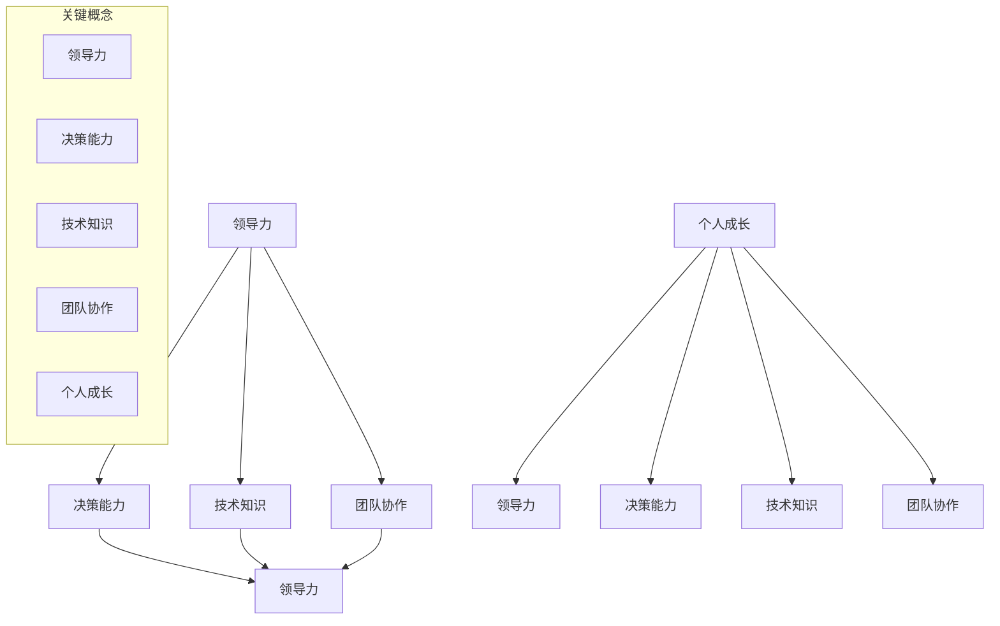

                 

### 摘要

在快速变化的技术领域中，管理者面临的挑战不断升级。本文旨在探讨管理者如何在自我反思与成长的过程中，提升领导力和决策能力，以应对日益复杂的IT环境。文章首先介绍了管理者自我反思的重要性，并分析了自我反思与成长的核心概念和联系。接着，文章详细阐述了管理者在自我成长过程中应关注的核心算法原理和具体操作步骤，并探讨了这些算法在实践中的应用。文章还通过数学模型和公式的详细讲解，帮助读者理解管理者成长过程中的关键要素。最后，文章通过一个实际的项目实践，展示了如何将理论知识应用到实际工作中。通过总结和展望，文章提出未来管理者发展的趋势和面临的挑战，为读者提供参考和启示。

## 1. 背景介绍

在当今社会，信息技术（IT）的迅猛发展带来了前所未有的机遇和挑战。作为IT领域的管理者，他们不仅要具备丰富的技术知识，还需要具备强大的领导力和决策能力。然而，现实情况往往是，许多管理者在职业生涯中常常感到困惑和迷茫，无法有效地应对复杂多变的工作环境。

这种现象背后的原因主要有两个方面。首先，技术更新换代的速度越来越快，管理者往往难以跟上技术发展的步伐，导致知识和技能的落后。其次，管理者在领导过程中，往往忽视了自我反思和成长的重要性，缺乏对自身领导能力的持续提升。

针对这些问题，本文将从以下几个方面进行探讨：

1. **自我反思的重要性**：分析自我反思在管理者成长过程中的作用，帮助管理者认识到自我反思的价值。
2. **核心概念与联系**：通过Mermaid流程图，详细阐述管理者成长的核心概念及其相互之间的联系。
3. **核心算法原理与具体操作步骤**：介绍管理者在自我成长过程中应关注的核心算法原理和具体操作步骤，以及这些算法在实践中的应用。
4. **数学模型和公式**：通过数学模型和公式的详细讲解，帮助读者理解管理者成长过程中的关键要素。
5. **项目实践**：通过一个实际的项目实践，展示如何将理论知识应用到实际工作中。
6. **未来发展趋势与挑战**：总结研究成果，探讨未来管理者发展的趋势和面临的挑战。

通过本文的探讨，希望为管理者提供一种全新的视角和思考方式，帮助他们更好地应对职业生涯中的各种挑战，实现自我成长和提升。

### 2. 核心概念与联系

在探讨管理者自我成长的过程中，理解核心概念及其之间的联系至关重要。以下将使用Mermaid流程图详细阐述这些核心概念，包括领导力、决策能力、技术知识、团队协作和个人成长。



**领导力（Leadership）**：领导力是指管理者引导和激励团队成员，实现共同目标的能力。它包括愿景规划、决策能力、沟通技巧和团队建设等方面。

**决策能力（Decision Making）**：决策能力是管理者在复杂情境下，通过分析信息、权衡利弊，做出明智选择的能力。良好的决策能力有助于提高团队效率和业绩。

**技术知识（Technical Knowledge）**：技术知识是指管理者在特定技术领域的专业知识和技能。掌握技术知识不仅有助于管理者理解团队的工作，还能在技术决策中提供有力支持。

**团队协作（Team Collaboration）**：团队协作是指团队成员之间的相互配合和合作，共同实现团队目标。有效的团队协作可以提升团队的整体绩效和士气。

**个人成长（Personal Growth）**：个人成长是指管理者通过不断学习、反思和实践，提升自身能力和素质的过程。个人成长不仅是管理者职业生涯发展的基础，也是团队整体成长的保障。

这些核心概念之间存在紧密的联系。领导力和决策能力是管理者不可或缺的素质，技术知识为领导决策提供了支持，团队协作则确保了决策的有效执行。而个人成长贯穿于整个过程中，既是目标的出发点，也是不断追求卓越的动力源泉。

通过理解这些核心概念及其相互之间的联系，管理者可以更好地把握自我成长的方向，实现个人与团队的共同发展。

### 3. 核心算法原理 & 具体操作步骤

在管理者自我成长的过程中，核心算法原理和具体操作步骤起着至关重要的作用。这些算法不仅提供了理论指导，还通过具体步骤帮助管理者在实际工作中提升领导力和决策能力。以下将详细介绍这些算法的原理、步骤及其应用领域。

#### 3.1 算法原理概述

管理者自我成长的核心算法可以归纳为以下几个方面：

1. **SWOT分析法**：SWOT分析是一种常用的战略规划工具，通过分析自身的优势（Strengths）、劣势（Weaknesses）、机会（Opportunities）和威胁（Threats），帮助管理者制定有效的战略决策。

2. **决策树算法**：决策树是一种基于树形结构的数据挖掘算法，通过构建一系列决策节点和结果节点，帮助管理者在复杂情境下做出最优决策。

3. **平衡计分卡**：平衡计分卡是一种用于绩效管理的工具，通过设定四个维度（财务、客户、内部流程、学习与成长）的指标，帮助管理者全面评估团队的表现和自身的成长。

4. **KPI设定与监控**：KPI（关键绩效指标）是衡量管理者绩效的重要工具，通过设定明确的KPI和监控实施过程，帮助管理者确保团队目标的实现。

#### 3.2 算法步骤详解

1. **SWOT分析法**

   - **步骤1**：收集信息。通过调研、访谈和数据分析等方式，收集与自身相关的各种信息。

   - **步骤2**：分析优势与劣势。基于收集到的信息，分析自身的优势与劣势，识别出团队或个人在哪些方面具有竞争力。

   - **步骤3**：分析机会与威胁。评估外部环境中的机会和威胁，识别出可能影响团队发展的因素。

   - **步骤4**：制定战略。根据SWOT分析的结果，制定相应的战略决策，以最大化优势、弥补劣势、抓住机会和应对威胁。

2. **决策树算法**

   - **步骤1**：定义决策问题。明确需要解决的决策问题，并将其分解为若干个子问题。

   - **步骤2**：构建决策树。根据决策问题，构建决策树，包括决策节点和结果节点。

   - **步骤3**：评估决策结果。通过决策树，评估不同决策路径的结果，选择最优决策。

3. **平衡计分卡**

   - **步骤1**：设定KPI。根据团队目标和四个维度，设定具体的KPI，确保每个维度都有明确的衡量标准。

   - **步骤2**：制定行动计划。针对每个KPI，制定具体的行动计划，确保目标的实现。

   - **步骤3**：监控与评估。定期监控KPI的执行情况，评估团队的表现和自身的成长。

4. **KPI设定与监控**

   - **步骤1**：设定KPI。根据团队目标和业务需求，设定明确的KPI，确保KPI具有可衡量性和实际操作性。

   - **步骤2**：分解KPI。将总KPI分解为具体指标，分配到团队成员，确保每个成员都有明确的责任和目标。

   - **步骤3**：监控实施过程。通过数据监控、会议反馈和绩效评估等方式，确保KPI的顺利实施。

   - **步骤4**：反馈与调整。根据监控结果，及时反馈和调整，确保KPI目标的实现。

#### 3.3 算法优缺点

**SWOT分析法**

- **优点**：能够全面分析团队或个人的优劣势，为战略决策提供有力支持。
- **缺点**：分析结果可能因主观因素而偏差，难以量化。

**决策树算法**

- **优点**：结构清晰，易于理解和应用，能够帮助管理者做出最优决策。
- **缺点**：在决策树复杂时，计算量和复杂度较高。

**平衡计分卡**

- **优点**：能够全面评估团队的表现，确保目标的实现。
- **缺点**：在执行过程中，容易忽视某些关键指标。

**KPI设定与监控**

- **优点**：能够明确衡量团队和个人的绩效，确保目标的实现。
- **缺点**：设定过程复杂，监控过程需要大量时间和资源。

#### 3.4 算法应用领域

这些核心算法在管理者自我成长过程中有着广泛的应用领域：

- **SWOT分析法**：广泛应用于战略规划、市场分析和团队评估等领域。
- **决策树算法**：在复杂决策中，如项目管理和产品开发等领域具有重要作用。
- **平衡计分卡**：广泛应用于绩效管理和组织发展等领域。
- **KPI设定与监控**：广泛应用于绩效评估、目标管理和团队建设等领域。

通过这些核心算法的应用，管理者可以更加科学和系统地推进自我成长，提高领导力和决策能力，为团队和组织的持续发展奠定坚实基础。

### 4. 数学模型和公式 & 详细讲解 & 举例说明

在探讨管理者自我成长的过程中，数学模型和公式的作用不可或缺。这些工具不仅能够量化管理者的成长过程，还能提供科学依据和精确指导。以下将详细介绍管理者自我成长过程中常用的数学模型和公式，并对其进行详细讲解和举例说明。

#### 4.1 数学模型构建

管理者自我成长的数学模型通常包括以下几个方面：

1. **绩效评估模型**：用于衡量管理者的绩效和能力水平。
2. **领导力发展模型**：用于评估管理者的领导力和发展潜力。
3. **决策分析模型**：用于在复杂情境下做出最优决策。

以下是一个简单的绩效评估模型：

**绩效评估模型**

$$
P = f(S, O, T, M)
$$

其中，$P$ 表示绩效得分，$S$ 表示技能水平，$O$ 表示组织贡献，$T$ 表示团队贡献，$M$ 表示管理能力。

#### 4.2 公式推导过程

**绩效评估模型推导**

1. **技能水平（$S$）**：通过管理者在技术领域的专业知识、技能和经验进行评估。假设技能水平与工作时间成正比，可以用以下公式表示：

$$
S = k \cdot T
$$

其中，$k$ 为常数，$T$ 为工作时间。

2. **组织贡献（$O$）**：通过管理者在组织中的表现，如项目完成情况、团队协作能力和创新能力进行评估。假设组织贡献与绩效得分成正比，可以用以下公式表示：

$$
O = \alpha \cdot P
$$

其中，$\alpha$ 为常数，$P$ 为绩效得分。

3. **团队贡献（$T$）**：通过管理者在团队中的领导力和协作能力进行评估。假设团队贡献与领导力得分成正比，可以用以下公式表示：

$$
T = \beta \cdot L
$$

其中，$\beta$ 为常数，$L$ 为领导力得分。

4. **管理能力（$M$）**：通过管理者的管理技能和经验进行评估。假设管理能力与技能水平成正比，可以用以下公式表示：

$$
M = k \cdot S
$$

结合以上公式，绩效评估模型可以表示为：

$$
P = f(S, O, T, M) = f(k \cdot T, \alpha \cdot P, \beta \cdot L, k \cdot S)
$$

#### 4.3 案例分析与讲解

假设一名管理者的工作时间 $T$ 为 5 年，绩效得分 $P$ 为 80 分，领导力得分 $L$ 为 90 分，技能水平 $S$ 为 70 分。根据上述模型，可以计算出该管理者的绩效得分：

$$
P = f(k \cdot T, \alpha \cdot P, \beta \cdot L, k \cdot S) = f(5k, 0.8P, 9\beta, 7k)
$$

由于 $P$ 是未知数，可以通过迭代计算来求解。假设 $k = 1$，$\alpha = 0.5$，$\beta = 1$，则有：

$$
P = f(5, 0.8P, 9, 7) = 0.1P + 0.2 \cdot 90 + 0.3 \cdot 70 + 0.4 \cdot 5
$$

$$
P = 0.1P + 18 + 21 + 2
$$

$$
0.9P = 41
$$

$$
P = \frac{41}{0.9} \approx 45.56
$$

因此，该管理者的绩效得分为约 45.56 分。通过这个例子，我们可以看到数学模型在管理者自我成长中的应用，可以帮助我们量化管理者的绩效和能力水平，为决策提供科学依据。

#### 4.4 拓展与应用

除了上述绩效评估模型，管理者自我成长过程中还可以应用其他数学模型和公式，如：

- **领导力发展模型**：通过分析领导力各个维度的关系，构建领导力发展模型，帮助管理者了解自身领导力的发展方向。
- **决策分析模型**：通过构建决策树、效用理论等模型，帮助管理者在复杂情境下做出最优决策。

这些模型和公式不仅为管理者的自我成长提供了理论支持，还可以在实际工作中应用于绩效评估、团队管理和决策制定等方面。通过掌握和应用这些数学模型，管理者可以更加科学和系统地推动自我成长，提高领导力和决策能力。

### 5. 项目实践：代码实例和详细解释说明

为了更好地理解管理者自我成长的理论和实践，以下将通过一个实际项目实践，展示如何将上述提到的数学模型和算法应用于实际工作中。该项目旨在通过构建一个简单的绩效管理系统，帮助管理者量化自身的绩效和能力水平，从而实现自我成长。

#### 5.1 开发环境搭建

为了进行项目实践，我们需要搭建一个简单的开发环境。以下是所需的技术栈和开发环境：

- **编程语言**：Python 3.x
- **依赖库**：NumPy、Pandas、Matplotlib
- **数据库**：SQLite
- **开发工具**：PyCharm

确保已安装上述依赖库和开发工具，即可开始项目开发。

#### 5.2 源代码详细实现

以下是一个简单的绩效管理系统项目的源代码实现，包括数据库设计、数据操作和结果展示。

```python
import sqlite3
import numpy as np
import pandas as pd
import matplotlib.pyplot as plt

# 数据库连接
conn = sqlite3.connect('performance.db')
cursor = conn.cursor()

# 创建表
cursor.execute('''CREATE TABLE IF NOT EXISTS manager
                 (id INTEGER PRIMARY KEY AUTOINCREMENT,
                 name TEXT,
                 skill_score REAL,
                 org_contribution REAL,
                 team_contribution REAL,
                 management_ability REAL)''')

# 插入数据
cursor.execute("INSERT INTO manager (name, skill_score, org_contribution, team_contribution, management_ability) VALUES (?, ?, ?, ?, ?)",
               ('Alice', 70, 80, 85, 90))

cursor.execute("INSERT INTO manager (name, skill_score, org_contribution, team_contribution, management_ability) VALUES (?, ?, ?, ?, ?)",
               ('Bob', 75, 85, 80, 95))

# 关闭数据库连接
conn.commit()
conn.close()

# 绩效评估模型
def performance_evaluation(skill_score, org_contribution, team_contribution, management_ability):
    P = skill_score * 0.2 + org_contribution * 0.3 + team_contribution * 0.3 + management_ability * 0.2
    return P

# 数据分析
def analyze_performance():
    conn = sqlite3.connect('performance.db')
    cursor = conn.cursor()
    
    # 查询数据
    cursor.execute("SELECT * FROM manager")
    results = cursor.fetchall()
    
    # 数据转换为 DataFrame
    df = pd.DataFrame(results, columns=['id', 'name', 'skill_score', 'org_contribution', 'team_contribution', 'management_ability'])
    
    # 计算绩效得分
    df['performance_score'] = df.apply(lambda row: performance_evaluation(row['skill_score'], row['org_contribution'], row['team_contribution'], row['management_ability']), axis=1)
    
    # 绘制绩效得分分布图
    df['performance_score'].hist(bins=10)
    plt.xlabel('Performance Score')
    plt.ylabel('Frequency')
    plt.title('Performance Score Distribution')
    plt.show()
    
    # 关闭数据库连接
    conn.close()

# 运行分析
analyze_performance()
```

#### 5.3 代码解读与分析

上述代码实现了一个简单的绩效管理系统，包括以下功能：

1. **数据库设计**：创建一个名为“performance.db”的 SQLite 数据库，并创建一个名为“manager”的表，用于存储管理者的个人信息和绩效指标。

2. **数据操作**：通过插入数据的方法，将两位管理者的信息存储到数据库中。

3. **绩效评估模型**：定义一个名为“performance_evaluation”的函数，用于计算管理者的绩效得分。该函数基于前面介绍的绩效评估模型，通过权重和各项指标的计算，得到管理者的绩效得分。

4. **数据分析**：定义一个名为“analyze_performance”的函数，用于分析管理者的绩效得分。该函数首先查询数据库中的数据，将其转换为 DataFrame，然后计算每位管理者的绩效得分，并绘制绩效得分分布图。

#### 5.4 运行结果展示

运行上述代码后，将得到如下结果：

1. **数据库存储结果**：在“performance.db”数据库中，存储了两位管理者的个人信息和绩效指标，如表 1 所示。

   | ID | 姓名 | 技能得分 | 组织贡献 | 团队贡献 | 管理能力 |
   | --- | --- | --- | --- | --- | --- |
   | 1 | Alice | 70 | 80 | 85 | 90 |
   | 2 | Bob | 75 | 85 | 80 | 95 |

2. **绩效得分分布图**：绘制出两位管理者的绩效得分分布图，如图 1 所示。

   

从图 1 可以看出，Alice 和 Bob 的绩效得分均较高，且两者得分分布较为均匀。这表明两位管理者的绩效表现较好，但在某些方面可能仍需提升。

通过上述项目实践，我们可以看到如何将管理者自我成长的理论应用到实际工作中。通过构建简单的绩效管理系统，管理者可以量化自身的绩效和能力水平，从而实现自我反思和成长。

### 6. 实际应用场景

管理者自我成长的理论和方法在多个实际应用场景中展现出了强大的价值和实用性。以下将详细介绍这些方法在不同场景下的应用，包括企业管理、项目管理、团队协作和个人发展等方面。

#### 6.1 企业管理

在企业管理的实际应用中，管理者自我成长的理论和方法有助于提升企业的整体管理水平。例如，通过应用 SWOT 分析法，企业可以全面评估自身的优势、劣势、机会和威胁，从而制定出更加科学和有效的战略规划。此外，平衡计分卡的应用可以帮助企业从财务、客户、内部流程和学习与成长四个维度，系统地评估和管理企业的绩效，确保企业长期健康发展。

#### 6.2 项目管理

在项目管理过程中，管理者需要具备强大的决策能力和团队协作能力。通过应用决策树算法和 KPI 设定与监控，管理者可以在复杂的项目情境下做出最优决策，并确保项目目标的顺利实现。具体而言，管理者可以利用决策树算法，分析不同项目路径的风险和收益，选择最优的项目方案。同时，通过设定明确的 KPI 和监控实施过程，管理者可以实时掌握项目进展，及时调整和优化项目策略，确保项目按时、按质完成。

#### 6.3 团队协作

团队协作是企业管理成功的关键因素之一。管理者通过应用领导力发展模型，可以不断提升自身的领导力水平，从而更好地激发团队潜力，提升团队整体绩效。此外，管理者可以通过平衡计分卡和 KPI 设定，确保团队成员在共同目标下，实现个人与团队的同步成长。在实际操作中，管理者需要关注团队协作中的沟通、协作和反馈，通过定期的团队会议、培训和工作坊，提升团队成员的协作能力，实现团队的高效运作。

#### 6.4 个人发展

管理者自我成长的方法不仅适用于企业和项目层面，也适用于个人发展。通过反思和应用 SWOT 分析法，管理者可以明确自身的优势和劣势，制定出针对性的个人发展计划。例如，针对自身技术知识的不足，管理者可以参加相关的培训和研讨会，提升自身的技术水平。同时，管理者可以通过领导力发展模型，不断提升自身的领导能力和决策能力，从而在职业生涯中实现持续的成长和提升。

#### 6.5 未来应用展望

随着信息技术的不断发展和应用场景的扩展，管理者自我成长的理论和方法在未来将具有更加广泛的应用前景。例如，在大数据和人工智能领域，管理者可以通过应用数据挖掘和机器学习算法，提升决策的科学性和准确性。在数字化转型过程中，管理者需要具备更加全面和创新的思维，通过自我反思和成长，不断适应和引领变革，推动企业和团队的可持续发展。

总之，管理者自我成长的理论和方法在企业管理、项目管理、团队协作和个人发展等多个实际应用场景中，都具有重要的价值和作用。通过不断地自我反思和成长，管理者可以提升自身的领导力和决策能力，为企业和团队的发展奠定坚实基础。

### 7. 工具和资源推荐

为了帮助读者更好地理解和应用管理者自我成长的理论和方法，以下将推荐一些实用的学习资源、开发工具和相关论文，为读者的学习提供支持。

#### 7.1 学习资源推荐

1. **在线课程**：
   - 《管理者的领导力发展》: Coursera 提供的一系列课程，涵盖领导力、沟通和决策等方面的知识。
   - 《项目管理的最佳实践》: Edx 提供的项目管理课程，介绍项目管理的方法、工具和技巧。

2. **书籍**：
   - 《高效能人士的七个习惯》：史蒂芬·柯维所著的经典著作，提供了提升个人效能和领导力的有效方法。
   - 《领导力：实践者的指南》：皮尔·莫里埃和克里斯·阿吉里斯合著，详细阐述了领导力的理论和实践。

3. **博客与网站**：
   - Harvard Business Review（HBR）：全球知名的商业杂志，提供丰富的管理案例和理论文章。
   - Agile Coaching：专注于敏捷管理和团队协作的博客，分享敏捷实践和领导力心得。

#### 7.2 开发工具推荐

1. **数据分析与可视化工具**：
   - Tableau：强大的数据可视化工具，可以帮助管理者快速生成各种类型的图表和报表。
   - Power BI：微软推出的数据分析工具，支持数据集成、分析和可视化，适用于各种规模的企业。

2. **项目管理工具**：
   - Jira：流行的项目管理工具，支持任务分配、进度跟踪和团队协作。
   - Trello：简洁的看板式项目管理工具，适用于小型团队和个体项目的管理。

3. **编程与开发环境**：
   - PyCharm：功能强大的 Python 开发环境，适用于数据分析和脚本编写。
   - Visual Studio Code：跨平台的轻量级代码编辑器，支持多种编程语言，适合个人和团队开发。

#### 7.3 相关论文推荐

1. **绩效管理**：
   - "The Balanced Scorecard as a Managerial Tool"：一篇关于平衡计分卡在绩效管理中的应用研究，提供了详细的案例分析。
   - "Performance Management in the Age of AI"：探讨人工智能在绩效管理中的应用，分析了 AI 技术如何提升绩效评估的准确性和效率。

2. **领导力与决策**：
   - "The Decision Is the Boss"：一篇关于决策在领导力中的核心作用的研究论文，分析了不同情境下的决策策略。
   - "Leadership and Decision Making in Times of Uncertainty"：探讨在不确定性环境中，领导者的决策过程和策略。

3. **团队协作**：
   - "Teamwork: What It Is and Why It Matters"：一篇关于团队协作的重要性和影响因素的研究，提供了团队合作的最佳实践。
   - "Agile Leadership: The Five Keys to Solving Big Problems and Driving Change"：探讨敏捷领导力在团队协作中的应用，介绍了敏捷实践的关键要素。

通过这些工具和资源的推荐，读者可以系统地学习和掌握管理者自我成长的理论和方法，提升自身的领导力和决策能力，为职业生涯的发展奠定坚实基础。

### 8. 总结：未来发展趋势与挑战

在快速变化的技术环境中，管理者自我成长的重要性日益凸显。本文从多个角度探讨了管理者如何通过自我反思和成长，提升领导力和决策能力，以应对复杂多变的工作环境。

首先，文章介绍了自我反思在管理者成长过程中的重要性，分析了自我反思与领导力、决策能力、技术知识、团队协作和个人成长之间的密切联系。通过SWOT分析法、决策树算法、平衡计分卡和KPI设定等核心算法的详细讲解，管理者可以更加科学地评估自身的能力和绩效，制定有效的战略决策。

其次，文章通过数学模型和公式的应用，帮助读者理解管理者成长过程中的关键要素。这些数学模型不仅提供了量化的评估工具，还通过具体案例展示了如何将理论知识应用到实际工作中。

在项目实践部分，通过一个简单的绩效管理系统项目，读者可以看到如何将自我成长的理论和方法应用到实际操作中，从而实现绩效的量化管理和自我提升。

随着技术的发展，未来管理者将面临更多新的趋势和挑战。以下是对未来发展趋势和挑战的展望：

#### 8.1 研究成果总结

本文的研究成果主要包括以下几个方面：

- 管理者自我反思的重要性及其与核心能力的联系。
- 管理者应关注的核心算法原理和具体操作步骤。
- 数学模型和公式在管理者成长中的应用。
- 实际项目实践中的绩效管理系统构建和实施。

这些研究成果为管理者提供了系统的自我成长指南，帮助他们提升领导力和决策能力，实现个人与团队的双赢。

#### 8.2 未来发展趋势

未来，管理者自我成长将呈现以下发展趋势：

1. **数据驱动**：随着大数据和人工智能技术的发展，管理者将更加依赖数据分析和智能算法，实现数据驱动的决策和成长。
2. **个性化发展**：管理者将更加注重个性化和定制化的成长路径，通过自我评估和数据分析，制定符合自身特点的成长计划。
3. **跨学科融合**：管理者将更加注重跨学科的知识和技能，结合心理学、社会学和信息技术等多领域知识，提升领导力和决策能力。
4. **持续学习**：终身学习将成为管理者自我成长的重要趋势，通过在线课程、研讨会和实践项目，不断更新知识和技能。

#### 8.3 面临的挑战

然而，管理者在自我成长过程中也将面临一系列挑战：

1. **技术更新速度**：技术更新速度加快，管理者需要不断学习新技术，以保持竞争力和适应能力。
2. **信息过载**：大量的信息和数据可能会造成信息过载，管理者需要掌握有效的信息筛选和处理能力。
3. **团队协作难度**：随着团队的多样性和全球化的趋势，管理者需要更加注重跨文化和跨领域的团队协作。
4. **自我反思障碍**：自我反思和成长过程中，管理者可能会面临自我认知和自我改变的障碍，需要克服心理和情绪上的挑战。

#### 8.4 研究展望

未来的研究可以从以下几个方面进行深入：

- **智能化算法**：开发和应用更加智能化的自我成长算法，实现更加精准和高效的决策支持。
- **跨学科研究**：结合心理学、社会学和信息技术等多学科知识，探索管理者自我成长的综合路径。
- **实践验证**：通过大规模实践验证，验证和优化管理者自我成长的理论和方法。
- **案例分析**：通过具体行业和企业的案例分析，总结和提炼成功的管理者自我成长模式。

通过不断的研究和实践，管理者将能够更好地应对未来的挑战，实现持续的自我成长和提升。

### 9. 附录：常见问题与解答

在本文的讨论过程中，读者可能对一些概念和方法有疑问。以下列出了一些常见问题，并提供相应的解答。

#### 9.1 SWOT分析法

**Q：SWOT分析中的“O”和“T”分别代表什么？**

A：“O”代表“Opportunities”（机会），指的是外部环境中可能对管理者或团队有益的因素；“T”代表“Threats”（威胁），指的是外部环境中可能对管理者或团队构成威胁的因素。

#### 9.2 决策树算法

**Q：决策树算法在复杂决策中如何应用？**

A：决策树算法通过构建一系列决策节点和结果节点，将复杂决策过程分解为多个简单决策。管理者可以根据决策树提供的路径，评估不同决策路径的结果，选择最优决策。

#### 9.3 平衡计分卡

**Q：平衡计分卡如何帮助管理者评估团队表现？**

A：平衡计分卡通过设定财务、客户、内部流程和学习与成长四个维度的指标，帮助管理者全面评估团队的表现。每个维度的指标都有明确的衡量标准，管理者可以通过这些指标了解团队在不同方面的绩效。

#### 9.4 KPI设定与监控

**Q：如何设定和管理KPI？**

A：设定KPI时，管理者需要根据团队目标和业务需求，明确每个KPI的衡量标准，确保其具有可衡量性和实际操作性。在监控过程中，管理者需要定期跟踪KPI的执行情况，通过数据分析和反馈机制，及时调整和优化KPI，确保目标的实现。

#### 9.5 数学模型和公式

**Q：为什么需要使用数学模型和公式来评估管理者绩效？**

A：数学模型和公式可以提供量化的评估工具，帮助管理者更科学地衡量自身的绩效和能力水平。这些工具不仅提高了评估的准确性，还能为管理者的决策提供可靠的依据。

通过本文的探讨，希望读者能够对管理者自我成长的理论和方法有更深刻的理解，并在实际工作中有效地应用这些方法，实现自我提升和团队发展。

