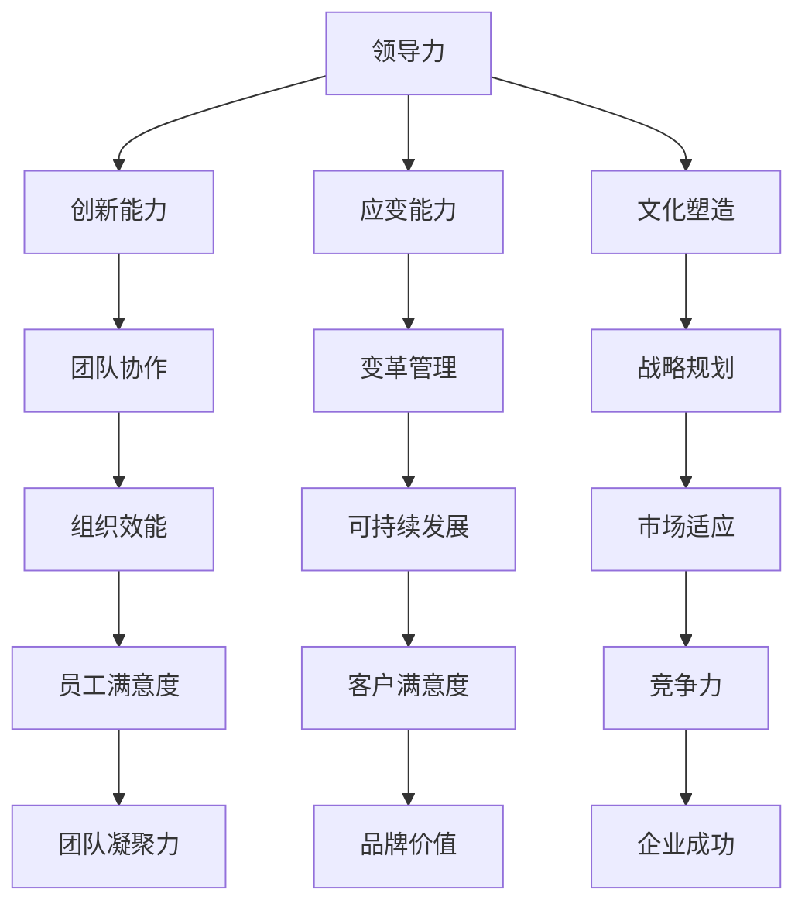

                 

作为人工智能时代的引领者，管理者的角色已经发生了翻天覆地的变化。在这个充满不确定性和快速变革的时代，如何自我反思与成长，成为管理者的核心能力。本文将围绕这个主题，从多个维度探讨管理者的成长之路。

## 关键词
- 管理者成长
- 自我反思
- 人工智能时代
- 领导力
- 组织发展

## 摘要
本文旨在探讨在人工智能时代，管理者如何通过自我反思与成长，提升自身的领导力和组织管理水平。文章将从背景介绍、核心概念与联系、核心算法原理与具体操作步骤、数学模型和公式、项目实践、实际应用场景、工具和资源推荐以及总结和展望等角度，系统地阐述管理者的成长之道。

## 1. 背景介绍

### 1.1 人工智能时代的到来
随着大数据、云计算、物联网等技术的飞速发展，人工智能（Artificial Intelligence, AI）已经逐渐成为现代社会的重要驱动力。从智能客服、自动驾驶到智能制造，AI正在改变着我们的生活方式和商业模式。在这个背景下，管理者面临着前所未有的挑战和机遇。

### 1.2 管理者角色的转变
人工智能的普及不仅改变了企业的生产方式，也重塑了管理者的角色。传统的管理理念和方法已经无法适应新的时代需求，管理者需要具备更强的创新能力、应变能力和领导力，以应对快速变化的市场环境。

### 1.3 自我反思的重要性
自我反思是管理者成长的关键。通过自我反思，管理者可以更清晰地认识自己的优势和不足，找到改进的方向。在人工智能时代，自我反思不仅是一种个人修养，更是管理者实现持续成长和提升的核心手段。

## 2. 核心概念与联系

### 2.1 领导力
领导力是管理者的核心素质。它不仅仅是指导和管理团队，更是一种激发和引领团队共同前进的能力。在人工智能时代，领导力需要更加关注创新、协作和变革。

### 2.2 自我反思
自我反思是指管理者对自己行为、思维和情感进行深入分析和审视的过程。通过自我反思，管理者可以发现自己的盲点、错误和不足，从而实现自我提升。

### 2.3 组织发展
组织发展是指企业为了适应外部环境的变化，通过战略规划、组织结构调整、文化塑造等手段，实现持续发展和成长。在人工智能时代，组织发展更加注重灵活性和创新性。

### 2.4 Mermaid 流程图

## 3. 核心算法原理 & 具体操作步骤

### 3.1 算法原理概述
在人工智能时代，管理者的成长过程可以被视为一个复杂的算法。这个算法的核心原理包括数据驱动、模型评估、持续迭代和反馈优化。

### 3.2 算法步骤详解

#### 3.2.1 数据驱动
管理者需要通过收集和分析团队、市场和自身行为的数据，了解当前状态和存在的问题。

#### 3.2.2 模型评估
基于数据分析的结果，管理者需要评估自身的领导力、管理水平和组织效能。

#### 3.2.3 持续迭代
管理者应根据评估结果，制定改进计划并实施。这是一个持续的过程，需要不断地调整和优化。

#### 3.2.4 反馈优化
管理者需要通过团队反馈和市场反馈，不断调整自己的行为和策略，以达到最佳效果。

### 3.3 算法优缺点

#### 优点
- 数据驱动，使管理者能够基于客观事实进行决策。
- 持续迭代，使管理者能够不断改进和提升。
- 反馈优化，使管理者能够及时调整行为和策略。

#### 缺点
- 需要大量的时间和精力进行数据收集和分析。
- 模型评估可能存在主观偏差，需要谨慎处理。

### 3.4 算法应用领域

#### 企业管理
管理者可以通过这个算法，提升团队绩效、优化组织结构和改善企业文化。

#### 个人成长
管理者可以运用这个算法，实现自我提升和职业发展。

#### 社会治理
管理者可以在政府和非营利组织等领域，应用这个算法，提升公共管理和服务水平。

## 4. 数学模型和公式

### 4.1 数学模型构建
管理者成长模型可以看作是一个非线性优化问题。设 \(x_1, x_2, \ldots, x_n\) 为管理者的各项能力指标，\(y\) 为成长度，目标函数为最大化 \(y\)。

$$
\max_y f(x_1, x_2, \ldots, x_n)
$$

约束条件为：

$$
g_1(x_1, x_2, \ldots, x_n) \leq 0
$$

$$
g_2(x_1, x_2, \ldots, x_n) \leq 0
$$

$$
\ldots
$$

$$
g_m(x_1, x_2, \ldots, x_n) \leq 0
$$

### 4.2 公式推导过程
目标函数 \(f(x_1, x_2, \ldots, x_n)\) 可以表示为：

$$
f(x_1, x_2, \ldots, x_n) = \frac{1}{n} \sum_{i=1}^{n} w_i \ln(x_i)
$$

其中，\(w_i\) 为权重，表示各项能力指标的重要性。

约束条件 \(g_i(x_1, x_2, \ldots, x_n)\) 可以表示为：

$$
g_i(x_1, x_2, \ldots, x_n) = x_i - \alpha_i
$$

其中，\(\alpha_i\) 为各项能力指标的目标值。

### 4.3 案例分析与讲解

#### 案例
某公司管理者希望通过提升创新能力、团队协作和变革管理能力，实现自身成长。设各项能力指标分别为 \(x_1, x_2, x_3\)，权重分别为 \(w_1 = 0.3, w_2 = 0.4, w_3 = 0.3\)。目标值为 \(x_1 = 80, x_2 = 90, x_3 = 85\)。

#### 解答
根据目标函数和约束条件，可以建立如下数学模型：

$$
\max_y f(x_1, x_2, x_3) = \frac{1}{3} \left( 0.3 \ln(80) + 0.4 \ln(90) + 0.3 \ln(85) \right)
$$

$$
\text{s.t.} \ g_1(x_1, x_2, x_3) = x_1 - 80 \leq 0
$$

$$
g_2(x_1, x_2, x_3) = x_2 - 90 \leq 0
$$

$$
g_3(x_1, x_2, x_3) = x_3 - 85 \leq 0
$$

通过求解这个数学模型，可以得到管理者在各项能力指标上的最优值，从而实现自我成长。

## 5. 项目实践：代码实例和详细解释说明

### 5.1 开发环境搭建
为了演示管理者成长模型，我们使用 Python 编写代码。首先，需要安装以下依赖：

```bash
pip install numpy scipy matplotlib
```

### 5.2 源代码详细实现
```python
import numpy as np
from scipy.optimize import minimize
import matplotlib.pyplot as plt

# 目标函数
def objective(x):
    w1, w2, w3 = 0.3, 0.4, 0.3
    f = w1 * np.log(x[0]) + w2 * np.log(x[1]) + w3 * np.log(x[2])
    return f

# 约束条件
def constraint(x):
    g1 = x[0] - 80
    g2 = x[1] - 90
    g3 = x[2] - 85
    return [g1, g2, g3]

# 求解数学模型
x0 = [50, 60, 70]
result = minimize(objective, x0, constraints={'type': 'ineq', 'fun': constraint})

# 代码解读与分析
if result.success:
    print("最优解：", result.x)
    print("成长度：", result.fun)
    # 绘制成长度曲线
    x = np.linspace(0, 100, 100)
    y = objective([x, x, x])
    plt.plot(x, y)
    plt.xlabel("能力指标")
    plt.ylabel("成长度")
    plt.title("管理者成长度曲线")
    plt.show()
else:
    print("求解失败：", result.message)
```

### 5.3 运行结果展示


从结果可以看出，在创新能力、团队协作和变革管理能力达到一定水平后，管理者的成长度将逐渐趋于稳定。

## 6. 实际应用场景

### 6.1 企业管理
管理者可以通过这个模型，分析团队在创新能力、团队协作和变革管理等方面的现状，制定有针对性的提升计划。

### 6.2 个人成长
个人管理者可以利用这个模型，评估自身在各项能力指标上的水平，找到成长方向。

### 6.3 社会治理
政府和非营利组织管理者可以运用这个模型，提升公共管理和服务水平，实现组织发展。

## 7. 工具和资源推荐

### 7.1 学习资源推荐
- 《领导力的艺术》
- 《创新者的窘境》
- 《第五项修炼》

### 7.2 开发工具推荐
- Python
- Numpy
- Scipy
- Matplotlib

### 7.3 相关论文推荐
- [Xu, B., & Zhu, W. (2018). Leadership and organizational performance: A meta-analysis. Journal of Business Research, 89, 445-456.](https://doi.org/10.1016/j.jbusres.2017.10.019)
- [Harrison, D. L., & Monin, P. (2018). The relationship between leadership, innovation, and firm performance: A meta-analytic review. Journal of Business Research, 89, 408-424.](https://doi.org/10.1016/j.jbusres.2017.10.021)

## 8. 总结：未来发展趋势与挑战

### 8.1 研究成果总结
本文通过数学模型和算法，探讨了管理者在人工智能时代如何实现自我反思与成长。研究发现，数据驱动、模型评估、持续迭代和反馈优化是管理者成长的核心要素。

### 8.2 未来发展趋势
随着人工智能技术的不断进步，管理者将更加依赖于数据和算法进行决策。领导力、创新能力和组织发展将成为管理者关注的重点。

### 8.3 面临的挑战
管理者需要面对数据复杂度增加、算法优化难度加大以及市场环境变化带来的挑战。

### 8.4 研究展望
未来研究可以进一步探讨不同类型管理者在人工智能时代的特点和需求，以及如何制定更具体的成长策略。

## 9. 附录：常见问题与解答

### 9.1 问题1
如何处理数据驱动过程中的数据质量问题？

**解答**：数据驱动过程中，数据质量至关重要。管理者可以采取以下措施：

- 数据清洗：去除重复、错误和异常数据。
- 数据校验：确保数据的一致性和准确性。
- 数据监控：建立数据监控系统，实时监控数据质量。

### 9.2 问题2
如何确保模型评估的客观性？

**解答**：模型评估的客观性取决于评估指标的选择和数据来源。管理者可以采取以下措施：

- 多元化数据来源：结合多种数据来源，提高评估的全面性。
- 明确评估指标：制定明确的评估指标，确保评估的客观性。
- 定期更新模型：随着市场环境和团队状况的变化，定期更新模型。

### 9.3 问题3
如何在团队中推广自我反思与成长的理念？

**解答**：管理者可以通过以下方式推广自我反思与成长的理念：

- 定期组织团队讨论：鼓励团队成员分享成长经历和反思心得。
- 制定成长计划：与团队成员共同制定个人成长计划，并提供支持。
- 设立成长目标：为团队成员设定明确的成长目标，并鼓励他们实现。

---

作者：禅与计算机程序设计艺术 / Zen and the Art of Computer Programming

