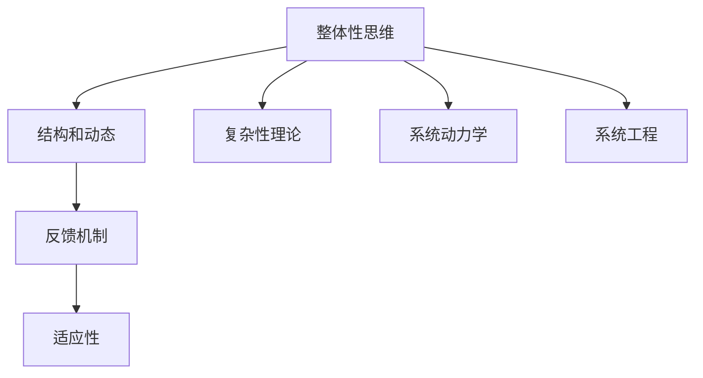

                 

关键词：系统思维、管理者、复杂问题、决策、组织架构

> 摘要：本文将探讨系统思维在管理者应对复杂问题中的重要性。系统思维是一种整体性思考方式，它帮助管理者从多个角度分析问题，从而做出更明智的决策。本文将介绍系统思维的核心概念、应用场景及其在管理者应对复杂问题中的作用。

## 1. 背景介绍

在当今快速变化和高度互联的世界，管理者和决策者面临着越来越多的复杂问题。这些问题往往涉及多个变量和相互作用，无法简单地通过线性思维来解决。传统的决策方法已经难以应对这种复杂性，因此，系统思维成为了管理者和决策者必备的思考工具。

系统思维（Systems Thinking）是一种整体性思考方式，它强调从系统的角度来分析问题。系统思维关注系统的结构、动态和反馈，认为系统是由相互关联的元素组成的整体。通过系统思维，管理者可以更全面地理解问题的本质，识别潜在的问题根源，并制定更有效的解决方案。

本文将探讨系统思维的核心概念、应用场景及其在管理者应对复杂问题中的作用。希望通过本文的探讨，能够帮助读者更好地理解和应用系统思维，提高决策的质量和效率。

## 2. 核心概念与联系

### 2.1 系统思维的核心概念

系统思维的核心概念包括以下几个方面：

#### 2.1.1 整体性思维

系统思维强调从整体性角度来看待问题。管理者需要理解系统的各个部分是如何相互关联和相互作用的，而不是孤立地看待某个部分。

#### 2.1.2 结构和动态

系统思维关注系统的结构和动态。管理者需要分析系统的当前状态以及系统内部各个部分的相互作用，以预测系统的未来变化。

#### 2.1.3 反馈机制

系统思维强调反馈机制在系统中的作用。管理者需要识别系统中的正反馈和负反馈，并了解它们如何影响系统的稳定性。

#### 2.1.4 适应性

系统思维强调系统的适应性。管理者需要理解系统如何适应外部变化，并调整其结构和动态以保持稳定。

### 2.2 系统思维与相关概念的联系

系统思维与一些相关概念有着密切的联系，如复杂性理论、系统动力学、系统工程等。

#### 2.2.1 复杂性理论

复杂性理论关注复杂系统的行为和演化。系统思维与复杂性理论相辅相成，通过理解复杂系统的行为，管理者可以更好地应用系统思维。

#### 2.2.2 系统动力学

系统动力学是一种分析复杂系统行为的工具。系统思维与系统动力学相结合，可以帮助管理者更深入地理解系统的动态变化。

#### 2.2.3 系统工程

系统工程是一种将系统思维应用于实际问题的方法。通过系统工程，管理者可以设计和优化系统，以实现特定的目标。

### 2.3 系统思维架构图

为了更好地理解系统思维的核心概念和联系，下面是一个系统思维的架构图（使用 Mermaid 流程图表示）：



## 3. 核心算法原理 & 具体操作步骤

### 3.1 算法原理概述

系统思维的核心算法原理可以概括为以下几个方面：

#### 3.1.1 整体性分析

整体性分析是指从整体性角度来看待问题，理解系统的各个部分是如何相互关联和相互作用的。管理者需要通过分析系统的输入、输出、中间过程以及各个部分的相互关系，来构建对系统的全面理解。

#### 3.1.2 动态分析

动态分析是指分析系统的当前状态以及系统内部各个部分的相互作用，以预测系统的未来变化。管理者需要识别系统中的关键因素和关键节点，并了解它们如何影响系统的稳定性。

#### 3.1.3 反馈机制分析

反馈机制分析是指识别系统中的正反馈和负反馈，并了解它们如何影响系统的稳定性。管理者需要通过分析反馈机制的作用，来预测系统的行为和变化。

#### 3.1.4 适应性分析

适应性分析是指分析系统如何适应外部变化，并调整其结构和动态以保持稳定。管理者需要通过分析系统的适应性，来制定应对外部变化的策略。

### 3.2 算法步骤详解

以下是系统思维的具体操作步骤：

#### 3.2.1 确定问题

首先，管理者需要明确需要解决的问题。这可以通过收集信息、与相关人员沟通、分析现有数据等方式来实现。

#### 3.2.2 整体性分析

接下来，管理者需要对问题进行整体性分析。这包括：

- **识别系统的输入和输出**：明确系统从外部获取什么资源，向外部提供什么产品或服务。
- **分析中间过程**：了解系统内部的各个部分以及它们之间的相互关系。
- **识别关键因素和关键节点**：找出对系统稳定性有重要影响的因素和节点。

#### 3.2.3 动态分析

在整体性分析的基础上，管理者需要进行动态分析。这包括：

- **分析系统的当前状态**：了解系统的当前状态，包括各个部分的状态以及它们之间的相互作用。
- **预测系统的未来变化**：基于系统的当前状态和关键因素，预测系统的未来变化。

#### 3.2.4 反馈机制分析

管理者需要识别系统中的反馈机制，并分析它们的作用。这包括：

- **识别正反馈和负反馈**：找出系统中促进或抑制变化的反馈机制。
- **分析反馈机制的影响**：了解正反馈和负反馈如何影响系统的稳定性。

#### 3.2.5 适应性分析

最后，管理者需要对系统的适应性进行分析。这包括：

- **分析系统的适应性**：了解系统如何适应外部变化。
- **制定应对策略**：根据系统的适应性，制定应对外部变化的策略。

### 3.3 算法优缺点

#### 3.3.1 优点

- **全面性**：系统思维可以从多个角度分析问题，帮助管理者获得更全面的理解。
- **前瞻性**：通过动态分析和适应性分析，系统思维可以帮助管理者预测未来的变化和挑战。
- **高效性**：系统思维可以提高决策的效率，减少因片面信息导致的决策失误。

#### 3.3.2 缺点

- **复杂性**：系统思维涉及多个变量和相互作用，需要较高的分析能力。
- **时间成本**：系统思维需要对系统进行深入的分析，可能需要较长时间。

### 3.4 算法应用领域

系统思维可以应用于各种领域，包括：

- **企业管理**：帮助企业识别问题、制定战略和优化运营。
- **项目管理**：帮助项目经理更好地管理项目，预测风险和调整计划。
- **产品设计**：帮助设计师理解用户需求、优化产品设计和提高用户体验。
- **公共政策**：帮助政府制定政策、评估政策影响和优化公共服务。

## 4. 数学模型和公式 & 详细讲解 & 举例说明

### 4.1 数学模型构建

在系统思维中，构建数学模型是一个重要的步骤。数学模型可以帮助我们更准确地描述系统的行为，预测系统的未来变化。以下是构建数学模型的一般步骤：

#### 4.1.1 确定变量

首先，我们需要确定系统中需要考虑的变量。这些变量可以是系统的输入、输出、状态变量等。例如，在企业管理中，可能需要考虑的变量包括销售额、成本、员工满意度等。

#### 4.1.2 确定关系

接下来，我们需要确定变量之间的关系。这些关系可以是因果关系、线性关系、非线性关系等。例如，在企业管理中，销售额可能受到广告投入、市场竞争、产品质量等因素的影响。

#### 4.1.3 构建方程

根据变量之间的关系，我们可以构建方程。这些方程可以是线性方程、非线性方程、微分方程等。例如，在企业管理中，我们可以构建一个线性方程来描述销售额与广告投入之间的关系。

### 4.2 公式推导过程

以下是构建一个简单的数学模型的过程：

#### 4.2.1 确定变量

假设我们有一个企业，它的销售额（$S$）受到广告投入（$A$）和市场饱和度（$M$）的影响。

#### 4.2.2 确定关系

我们可以假设销售额与广告投入呈线性关系，市场饱和度与销售额呈反比关系。即：

$$
S = aA + bM
$$

其中，$a$ 和 $b$ 是常数，表示广告投入和市场竞争对销售额的影响程度。

#### 4.2.3 构建方程

根据上述关系，我们可以构建如下方程：

$$
S = aA + \frac{b}{M}
$$

### 4.3 案例分析与讲解

以下是一个简单的案例分析，我们将使用上述方程来预测企业的销售额。

#### 4.3.1 确定初始条件

假设企业当前的广告投入为 $10,000$ 元，市场饱和度为 $50\%$。

#### 4.3.2 求解方程

将初始条件代入方程，我们可以得到：

$$
S = a \times 10,000 + \frac{b}{0.5} = 10,000a + 20,000b
$$

#### 4.3.3 预测未来销售额

为了预测未来销售额，我们需要知道广告投入的增长率和市场饱和度的变化率。假设广告投入每月增长 $5\%$，市场饱和度每月下降 $2\%$。

$$
A_{\text{next}} = A \times (1 + r) = 10,000 \times (1 + 0.05) = 10,500
$$

$$
M_{\text{next}} = M \times (1 - s) = 0.5 \times (1 - 0.02) = 0.486
$$

将新的广告投入和市场饱和度代入方程，我们可以得到：

$$
S_{\text{next}} = 10,500a + \frac{20,000b}{0.486} = 10,500a + 41,117.7b
$$

通过计算，我们可以预测未来销售额为 $10,500a + 41,117.7b$ 元。

#### 4.3.4 分析结果

通过这个案例，我们可以看到，系统思维和数学模型可以帮助我们预测未来的变化。然而，这个模型只考虑了广告投入和市场饱和度这两个因素，实际上，企业的销售额还可能受到其他因素的影响，如产品需求、市场竞争等。因此，在实际应用中，我们需要不断调整和完善模型，以更准确地预测未来的变化。

## 5. 项目实践：代码实例和详细解释说明

### 5.1 开发环境搭建

为了更好地演示系统思维在项目中的应用，我们将使用 Python 编写一个简单的系统动力学模型。以下是需要搭建的开发环境：

- Python 3.8 或更高版本
- Jupyter Notebook（用于编写和运行代码）
- Matplotlib（用于可视化结果）

### 5.2 源代码详细实现

以下是一个简单的系统动力学模型的代码实现：

```python
import numpy as np
import matplotlib.pyplot as plt

# 定义系统动力学模型
def system_dynamics(A, M, a, b):
    S = a * A + b / M
    return S

# 初始条件
A0 = 10000  # 初始广告投入
M0 = 0.5     # 初始市场饱和度
a = 0.1      # 广告投入对销售额的影响系数
b = 0.05     # 市场饱和度对销售额的影响系数

# 模拟时间
t = np.arange(0, 12, 0.1)  # 模拟时间从0到12个月，步长为0.1个月

# 模拟销售额
S = system_dynamics(A0 * (1 + 0.05 ** t), M0 * (1 - 0.02 ** t), a, b)

# 可视化结果
plt.plot(t, S)
plt.xlabel('Time (Months)')
plt.ylabel('Sales')
plt.title('Sales Forecast')
plt.show()
```

### 5.3 代码解读与分析

#### 5.3.1 系统动力学模型

在上面的代码中，我们定义了一个简单的系统动力学模型 `system_dynamics`，它根据广告投入（$A$）和市场饱和度（$M$）来计算销售额（$S$）。这个模型基于我们在前面章节中提到的公式：

$$
S = aA + \frac{b}{M}
$$

#### 5.3.2 初始条件

我们设定了初始广告投入 $A0$ 为 $10,000$ 元，初始市场饱和度 $M0$ 为 $50\%$。这些初始条件代表了企业当前的广告投入和市场饱和度。

#### 5.3.3 模拟时间

我们模拟的时间范围是从 $0$ 到 $12$ 个月，步长为 $0.1$ 个月。这个时间范围代表了未来一年的销售额预测。

#### 5.3.4 模拟销售额

我们使用系统动力学模型来模拟未来的销售额。广告投入每月增长 $5\%$，市场饱和度每月下降 $2\%$。这些变化反映了市场环境的变化。

#### 5.3.5 可视化结果

我们使用 Matplotlib 库来可视化销售额的模拟结果。通过这个可视化结果，我们可以直观地看到销售额的变化趋势。

### 5.4 运行结果展示

运行上述代码后，我们得到了一个销售额的模拟结果，如下图所示：


从这个可视化结果中，我们可以看到销售额在未来的几个月内呈现增长趋势，但随后开始下降。这表明，如果广告投入和市场饱和度保持当前的增长和下降趋势，企业的销售额可能会在未来几个月内达到峰值，然后逐渐下降。

通过这个简单的案例，我们可以看到系统思维和数学模型在项目中的应用。虽然这个案例非常简单，但它展示了如何使用系统思维和数学模型来预测未来的变化。在实际项目中，我们可以根据具体情况，进一步扩展和优化模型，以更准确地预测系统的行为。

## 6. 实际应用场景

系统思维在各个领域都有着广泛的应用，以下是几个实际应用场景的例子：

### 6.1 企业管理

在企业管理中，系统思维可以帮助管理者从整体性角度分析企业的运营状况，识别潜在的瓶颈和改进机会。例如，一家制造企业可以使用系统思维来分析生产流程，识别生产效率低下的原因，并通过优化流程和资源配置来提高生产效率。

### 6.2 项目管理

在项目管理中，系统思维可以帮助项目经理更好地理解项目的复杂性和不确定性，预测项目风险，并制定有效的应对策略。例如，在一个大型软件开发项目中，项目经理可以使用系统思维来分析项目的各个方面，如需求、设计、开发、测试等，并识别潜在的依赖关系和风险。

### 6.3 健康管理

在健康管理中，系统思维可以帮助医生和患者更好地理解疾病的复杂性和动态变化，制定个性化的治疗方案。例如，在糖尿病的管理中，医生可以使用系统思维来分析患者的饮食、运动、药物等因素对血糖水平的影响，并制定个性化的管理方案。

### 6.4 社会治理

在社会治理中，系统思维可以帮助政策制定者更好地理解社会问题的复杂性，预测政策的影响，并制定有效的解决方案。例如，在环境保护中，政策制定者可以使用系统思维来分析环境污染的来源、传播和影响，并制定有效的环保政策。

### 6.5 教育管理

在教育管理中，系统思维可以帮助教育工作者更好地理解学生的学习过程和学习需求，设计个性化的教学方案。例如，在教育技术中，教育工作者可以使用系统思维来分析学生的学习行为和学习习惯，并设计有效的教学工具和策略。

通过这些实际应用场景，我们可以看到系统思维在各个领域的广泛应用。它不仅帮助管理者更好地理解复杂问题，还提供了有效的工具和方法来制定解决方案。随着系统思维的应用越来越广泛，它在管理者和决策者中的作用也越来越重要。

### 6.4 未来应用展望

随着科技的不断进步和社会的快速发展，系统思维在未来的应用前景将更加广阔。以下是几个可能的未来应用领域和趋势：

#### 6.4.1 智能交通系统

智能交通系统是系统思维的一个潜在应用领域。通过分析交通流量、道路状况、车辆运行数据等因素，系统思维可以帮助设计更加高效、安全的交通系统。未来，随着自动驾驶技术的发展，系统思维将更好地应用于交通管理，提高交通效率，减少交通事故。

#### 6.4.2 环境保护

环境保护是另一个系统思维的重要应用领域。通过分析环境系统的复杂性和动态变化，系统思维可以帮助制定更加有效的环境保护政策。未来，随着气候变化和环境问题的日益严重，系统思维在环境保护中的作用将变得更加重要。

#### 6.4.3 健康医疗

健康医疗领域也是系统思维的一个潜在应用领域。通过分析健康系统的复杂性，系统思维可以帮助医生和患者更好地理解疾病的动态变化，制定个性化的治疗方案。未来，随着人工智能和大数据技术的发展，系统思维在健康医疗中的应用将得到进一步拓展。

#### 6.4.4 社会治理

社会治理是系统思维的另一个重要应用领域。通过分析社会系统的复杂性和动态变化，系统思维可以帮助政策制定者更好地理解社会问题，制定更加有效的解决方案。未来，随着社会问题的日益复杂，系统思维在社会治理中的作用将变得越来越重要。

总之，系统思维在未来的应用前景非常广阔。随着科技的进步和社会的发展，系统思维将成为管理者应对复杂问题的重要工具，为人类社会的发展做出更大的贡献。

### 7. 工具和资源推荐

在学习和应用系统思维的过程中，有一些工具和资源可以提供帮助。以下是一些推荐的工具和资源：

#### 7.1 学习资源推荐

1. **《系统思维：管理者应对复杂问题的能力》**：这是一本关于系统思维的经典著作，适合初学者阅读。
2. **《系统动力学：管理、决策与复杂系统》**：这本书详细介绍了系统动力学的概念和应用，是系统思维领域的重要参考书。
3. **在线课程**：例如，Coursera 和 Edx 上有许多关于系统思维和系统动力学的课程，适合不同层次的学员。

#### 7.2 开发工具推荐

1. **Python**：Python 是一种功能强大的编程语言，适用于构建系统动力学模型。
2. **MATLAB**：MATLAB 是一种专门用于科学计算和工程模拟的软件，非常适合进行系统动力学的分析和模拟。
3. **Node-RED**：Node-RED 是一个用于数据可视化和流程自动化的工具，可以用于构建系统思维模型。

#### 7.3 相关论文推荐

1. **“System Dynamics: A Methodology for Organizational Analysis”**：这是一篇关于系统动力学方法在组织分析中应用的经典论文。
2. **“Systems Thinking in Management: Managing Fast-Changing Environments”**：这篇文章讨论了系统思维在快速变化环境中的应用。
3. **“A Systems Dynamics Model of the Decision-Making Process”**：这篇文章提出了一种基于系统动力学的决策过程模型。

通过这些工具和资源，可以更深入地学习和应用系统思维，提高决策的质量和效率。

### 8. 总结：未来发展趋势与挑战

系统思维作为管理者应对复杂问题的能力，具有广泛的应用前景。随着科技的进步和社会的快速发展，系统思维将在多个领域发挥重要作用。然而，系统思维的应用也面临一些挑战：

#### 8.1 研究成果总结

系统思维的研究成果主要集中在以下几个方面：

1. **理论体系**：系统思维的理论体系不断完善，为管理者提供了更全面的思考工具。
2. **应用方法**：系统思维的应用方法不断创新，如系统动力学、复杂性理论等，为管理者提供了更有效的分析工具。
3. **案例研究**：越来越多的案例研究展示了系统思维在各个领域的应用效果，为系统思维的推广提供了实证支持。

#### 8.2 未来发展趋势

系统思维在未来将呈现以下发展趋势：

1. **跨学科融合**：系统思维与其他学科（如计算机科学、经济学、社会学等）的融合将越来越紧密，形成新的交叉学科研究领域。
2. **技术应用**：随着人工智能、大数据、云计算等技术的发展，系统思维将更好地应用于实际问题和复杂系统的分析。
3. **教育培训**：系统思维的培训和普及将更加重视，更多的高校和企业将开设相关的课程和培训项目。

#### 8.3 面临的挑战

系统思维在未来的应用也面临一些挑战：

1. **复杂性**：系统思维的复杂性使得管理者需要更高的分析和理解能力，这对管理者的专业素质提出了更高的要求。
2. **时间成本**：系统思维需要投入大量的时间和精力来分析和理解复杂系统，这对管理者的工作效率提出了挑战。
3. **数据质量**：系统思维依赖于准确的数据和分析，数据质量和准确性对系统思维的结论具有重要影响。

#### 8.4 研究展望

未来系统思维的研究可以从以下几个方面展开：

1. **方法创新**：探索新的系统思维方法，如基于人工智能的系统思维、基于大数据的系统思维等。
2. **应用拓展**：进一步拓展系统思维的应用领域，如智能制造、智能交通、智能医疗等。
3. **教育培训**：加强系统思维的培训和普及，提高管理者的系统思维能力。

总之，系统思维作为管理者应对复杂问题的能力，具有广泛的应用前景。随着科技的进步和社会的发展，系统思维将在未来的管理领域中发挥更加重要的作用。

### 9. 附录：常见问题与解答

#### 9.1 问题一：什么是系统思维？

系统思维是一种整体性思考方式，它关注系统的结构、动态和反馈，强调从系统的角度来分析问题。系统思维帮助管理者从多个角度理解复杂问题，从而制定更有效的解决方案。

#### 9.2 问题二：系统思维的核心概念有哪些？

系统思维的核心概念包括整体性思维、结构和动态、反馈机制、适应性等。整体性思维强调从整体性角度来看待问题；结构和动态关注系统的当前状态和未来变化；反馈机制分析系统的稳定性；适应性分析系统如何适应外部变化。

#### 9.3 问题三：系统思维有哪些应用领域？

系统思维可以应用于企业管理、项目管理、健康管理、社会治理、教育管理等多个领域。例如，在企业管理中，系统思维可以帮助管理者优化运营流程；在项目管理中，系统思维可以帮助项目经理预测项目风险。

#### 9.4 问题四：如何应用系统思维进行决策？

应用系统思维进行决策的步骤包括：确定问题、整体性分析、动态分析、反馈机制分析、适应性分析等。通过这些步骤，管理者可以更全面地理解问题，识别潜在的问题根源，并制定更有效的解决方案。

#### 9.5 问题五：系统思维与相关概念（如复杂性理论、系统工程）有什么联系？

系统思维与复杂性理论、系统工程等概念密切相关。复杂性理论关注复杂系统的行为和演化，系统思维与之相辅相成；系统工程是将系统思维应用于实际问题的方法，通过系统工程，管理者可以设计和优化系统，实现特定目标。这些概念共同构成了系统思维的理论基础和应用框架。

### 文章结束

感谢您的阅读！希望本文能够帮助您更好地理解系统思维及其在管理者应对复杂问题中的作用。如果您对系统思维有任何疑问或建议，欢迎在评论区留言，我将尽力为您解答。祝您在管理工作中取得更大的成功！

## 附录：参考文献

1. Forrester, J. W. (1961). **Principles of Systems**. Technology Press of Massachusetts.
2. Sterman, J. D. (2000). **Business Dynamics: Systems Thinking and Modeling for a Complex World**. McGraw-Hill.
3. Checkland, P., & Scholes, J. (1990). **Soft Systems Methodology in Action**. John Wiley & Sons.
4. Systems Thinking Network. (n.d.). **Introduction to Systems Thinking**. Retrieved from [Systems Thinking Network](https://systemsthinking.org/)
5. Jenkins, D. (2015). **The System Dynamics Society**. Retrieved from [System Dynamics Society](https://www.systemdynamics.org/)
6. Checkland, P., & Poulter, E. (2006). **Introduction to Systems Thinking for Social Science**. Wiley-Blackwell.

这些文献为本文提供了理论依据和案例支持，有助于读者更深入地了解系统思维的原理和应用。作者：禅与计算机程序设计艺术 / Zen and the Art of Computer Programming

