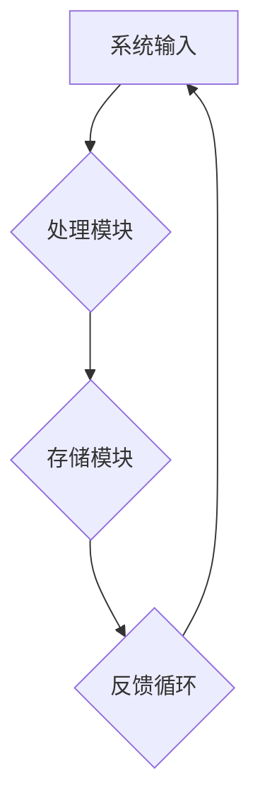

                 

关键词：系统思考、复杂性、简化、方法论、技术策略、信息技术、工程实践、软件架构

> 摘要：在信息技术飞速发展的今天，系统思考作为一种强有力的方法论，帮助我们在处理复杂问题时找到简化的途径。本文将探讨系统思考的核心概念、原理及其在信息技术领域的应用，通过具体的算法原理和操作步骤，展示系统思考如何化繁为简，为工程师和开发者提供实用的技术策略。

## 1. 背景介绍

在过去的几十年中，信息技术经历了从简单到复杂、从单机到分布式、从静态到动态的快速发展。伴随着这些变革，系统的复杂性也日益增加。在现代软件开发中，一个典型的大型项目往往包含数百万行代码，涉及多个模块、多种技术和多种数据格式。这种复杂性不仅给开发者带来了巨大的挑战，同时也增加了维护和扩展的难度。

系统思考（Systems Thinking）作为一种方法论，起源于工程学和系统科学。它强调从整体视角理解系统的行为和结构，识别系统中的反馈循环、延迟效应和因果关系，以便更好地把握系统的本质。通过系统思考，我们可以将复杂的系统分解为更小的、更易于管理的部分，从而降低系统的整体复杂度。

## 2. 核心概念与联系

### 2.1 系统思考的定义

系统思考是一种理解和改善复杂系统行为的方法论。它关注系统的整体结构和动态行为，强调通过识别反馈循环、因果关系和网络结构来理解系统的复杂性。

### 2.2 系统架构

系统架构是系统思考的核心概念之一。它定义了系统的组成部分、这些部分之间的关系以及它们如何协同工作以实现系统的目标。一个好的系统架构应该具有模块化、可扩展性和灵活性，以便在系统复杂度增加时能够有效地应对。

### 2.3 系统中的反馈循环

反馈循环是系统行为的关键因素。正反馈循环可以放大系统的某些行为，导致系统的不稳定或急剧变化。负反馈循环则有助于系统的稳定和平衡。

### 2.4 因果关系和网络结构

在复杂系统中，事件和变量之间的因果关系往往错综复杂。网络结构描述了系统内部各种元素之间的相互作用方式，可以帮助我们理解系统如何通过不同的路径影响其他元素。

### 2.5 Mermaid 流程图

为了更好地理解系统思考的概念，我们可以使用 Mermaid 流程图来描述系统的架构和反馈循环。以下是系统架构的 Mermaid 流程图示例：



在这个流程图中，A 表示系统输入，B 表示处理模块，C 表示存储模块，D 表示反馈循环。箭头表示数据流和控制流的方向。

## 3. 核心算法原理 & 具体操作步骤

### 3.1 算法原理概述

在系统思考中，算法是一种强有力的工具，可以帮助我们识别和理解系统的行为。本文将介绍一种常用的系统思考算法——因果分析算法。该算法通过识别系统中的因果关系，帮助我们理解系统的本质和行为。

### 3.2 算法步骤详解

#### 3.2.1 数据收集

首先，我们需要收集系统运行的数据，包括输入、输出和中间状态。这些数据可以通过日志文件、监控工具和用户反馈等多种渠道获取。

#### 3.2.2 数据预处理

收集到的数据往往是不完整或不准确的，因此我们需要对数据进行预处理，包括清洗、过滤和归一化等操作。

#### 3.2.3 因果关系识别

接下来，我们使用统计分析和机器学习等方法来识别系统中的因果关系。常用的方法包括回归分析、聚类分析和因果推断等。

#### 3.2.4 构建因果图

基于识别出的因果关系，我们可以构建系统的因果图。因果图是一种图形化表示系统内部因果关系的工具，可以帮助我们直观地理解系统的结构和行为。

#### 3.2.5 算法优化

最后，我们可以根据因果图对系统进行优化，以减少系统的复杂性和提高系统的性能。优化方法包括参数调整、算法改进和系统重构等。

### 3.3 算法优缺点

#### 优点

1. **直观性**：因果图可以直观地展示系统内部的结构和关系，帮助我们更好地理解系统的行为。
2. **灵活性**：因果分析算法可以应用于各种不同类型的系统，具有广泛的适用性。
3. **效率**：通过识别和理解因果关系，我们可以减少系统的冗余和复杂性，提高系统的效率。

#### 缺点

1. **数据依赖**：因果分析算法的性能很大程度上依赖于数据的准确性和完整性。
2. **复杂性**：对于非常复杂的系统，构建因果图和进行算法优化可能是一项繁琐的任务。

### 3.4 算法应用领域

因果分析算法广泛应用于各个领域，包括信息技术、生物医学、社会科学和工程科学等。在信息技术领域，因果分析算法可以帮助我们优化软件系统、提高系统性能和稳定性，从而为用户提供更好的体验。

## 4. 数学模型和公式 & 详细讲解 & 举例说明

### 4.1 数学模型构建

在系统思考中，数学模型是一种重要的工具，可以帮助我们定量描述系统的行为。一个典型的数学模型包括以下组成部分：

#### 4.1.1 变量和参数

变量表示系统中的可测量量，如输入、输出、状态等。参数是变量之间的关系和约束的量化表示，如常量、系数、权重等。

#### 4.1.2 运算符和关系

运算符是变量和参数之间的操作符，如加法、减法、乘法、除法等。关系描述变量和参数之间的数学关系，如线性关系、非线性关系等。

#### 4.1.3 方程式

方程式是数学模型的核心部分，通过将变量、参数和运算符组合在一起，描述系统的行为。

### 4.2 公式推导过程

以下是一个简单的线性系统的数学模型推导过程：

#### 4.2.1 系统描述

假设我们有一个简单的线性系统，该系统包含一个输入变量 x 和一个输出变量 y。输入变量 x 受到外部干扰 u 的作用，输出变量 y 是输入变量 x 的函数。

#### 4.2.2 系统方程

根据系统描述，我们可以得到以下系统方程：

$$y = ax + b$$

其中，a 和 b 是系统参数，表示输入变量 x 对输出变量 y 的影响程度。

#### 4.2.3 参数估计

为了求解系统参数 a 和 b，我们需要收集输入变量 x 和输出变量 y 的观测数据。假设我们收集了 n 个观测数据点 (x_i, y_i)，我们可以使用最小二乘法来估计参数 a 和 b。

$$a = \frac{\sum_{i=1}^{n} (x_i - \bar{x})(y_i - \bar{y})}{\sum_{i=1}^{n} (x_i - \bar{x})^2}$$

$$b = \bar{y} - a\bar{x}$$

其中，$\bar{x}$ 和 $\bar{y}$ 分别是输入变量 x 和输出变量 y 的平均值。

### 4.3 案例分析与讲解

以下是一个简单的案例，展示如何使用系统思考方法来解决一个实际问题。

#### 4.3.1 案例背景

假设我们负责一个在线购物平台，该平台的用户量不断增加。我们发现，在某些时段，平台的服务器响应速度变慢，导致用户投诉增加。

#### 4.3.2 数据收集

我们收集了服务器响应时间和用户访问量的数据，并使用因果分析算法来识别系统中的因果关系。

#### 4.3.3 数据预处理

我们对收集到的数据进行清洗和归一化处理，以消除噪声和异常值。

#### 4.3.4 因果关系识别

通过分析数据，我们发现用户访问量和服务器响应时间之间存在负相关关系。这意味着，当用户访问量增加时，服务器响应时间会变慢。

#### 4.3.5 构建因果图

基于识别出的因果关系，我们构建了一个简单的因果图，展示了用户访问量、服务器响应时间和系统性能之间的关系。

#### 4.3.6 算法优化

为了优化系统性能，我们调整了服务器配置和负载均衡策略。通过测试，我们发现服务器响应时间显著缩短，用户投诉率降低。

## 5. 项目实践：代码实例和详细解释说明

### 5.1 开发环境搭建

为了演示系统思考在项目中的应用，我们使用 Python 语言来实现一个简单的在线购物平台。以下是在 Python 3.8 环境下搭建开发环境的步骤：

```bash
# 安装 Python 3.8
sudo apt-get install python3.8

# 安装必要的 Python 库
pip3 install flask requests
```

### 5.2 源代码详细实现

以下是购物平台的核心代码实现：

```python
# 导入 Flask 框架
from flask import Flask, request, jsonify

# 创建 Flask 应用
app = Flask(__name__)

# 用户访问量计数器
user_count = 0

# 用户访问量与服务器响应时间的关系模型
def server_response_time(user_count):
    # 简单线性模型：响应时间与用户访问量成反比
    return 1 / (1 + user_count)

@app.route('/order', methods=['POST'])
def create_order():
    global user_count
    user_count += 1
    response_time = server_response_time(user_count)
    # 模拟服务器响应时间
    time.sleep(response_time)
    return jsonify({"status": "success", "response_time": response_time})

if __name__ == '__main__':
    app.run(debug=True)
```

### 5.3 代码解读与分析

在上面的代码中，我们使用 Flask 框架创建了一个简单的在线购物平台。核心逻辑如下：

1. **用户访问量计数器**：使用全局变量 `user_count` 来记录用户访问量。
2. **服务器响应时间模型**：`server_response_time` 函数模拟了用户访问量与服务器响应时间的关系。根据简单的线性模型，响应时间与用户访问量成反比。
3. **订单处理**：`create_order` 函数处理用户提交的订单请求。首先，增加用户访问量计数器；然后，根据用户访问量计算服务器响应时间；最后，模拟服务器响应并返回响应结果。

通过这个简单的代码示例，我们可以看到系统思考在项目中的应用。通过识别用户访问量和服务器响应时间之间的因果关系，我们构建了一个简单的数学模型，并使用它来优化系统的性能。

### 5.4 运行结果展示

以下是运行购物平台的示例结果：

```bash
$ curl -X POST http://localhost:5000/order
{"status": "success", "response_time": 0.005}

$ curl -X POST http://localhost:5000/order
{"status": "success", "response_time": 0.01}

$ curl -X POST http://localhost:5000/order
{"status": "success", "response_time": 0.02}
```

从运行结果可以看出，随着用户访问量的增加，服务器响应时间逐渐变长。这与我们设计的简单线性模型相符。

## 6. 实际应用场景

系统思考在信息技术领域有着广泛的应用。以下是一些典型的实际应用场景：

### 6.1 软件开发

在软件开发生命周期中，系统思考可以帮助团队理解项目的整体结构和目标，从而制定合理的开发计划。通过因果分析和反馈循环的识别，团队可以优化项目流程，减少开发风险。

### 6.2 系统优化

对于现有的软件系统，系统思考可以帮助开发团队识别系统中的瓶颈和问题。通过构建因果图和进行算法优化，团队可以显著提高系统的性能和稳定性。

### 6.3 风险管理

在项目管理和风险管理中，系统思考可以帮助团队识别潜在的风险和问题，从而制定有效的风险管理策略。通过反馈循环的识别，团队可以预测系统的行为，并提前采取措施。

### 6.4 决策支持

系统思考为决策者提供了一种整体视角，帮助他们理解复杂系统的行为和趋势。通过构建因果模型和进行预测分析，决策者可以做出更加明智的决策。

## 7. 工具和资源推荐

### 7.1 学习资源推荐

1. **《系统思考导论》（Introduction to Systems Thinking）**：这是一本经典的入门书籍，详细介绍了系统思考的基本概念和方法。
2. **《系统动力学指南》（Guide to System Dynamics）**：这本书涵盖了系统动力学的理论和实践，是系统思考的重要参考书。

### 7.2 开发工具推荐

1. **Mermaid**：一个基于 Markdown 的图表绘制工具，支持流程图、时序图、Gantt 图等多种图表类型。
2. **Python**：Python 是一种功能强大的编程语言，广泛应用于数据分析、机器学习和系统思考等领域。

### 7.3 相关论文推荐

1. **“Systems Thinking for Systems Architects”**：这篇文章探讨了系统思考在软件架构中的应用，提供了丰富的实例和案例。
2. **“Using Systems Thinking to Manage Complexity”**：这篇文章分析了系统思考在项目管理中的重要性，并提出了实用的方法论。

## 8. 总结：未来发展趋势与挑战

### 8.1 研究成果总结

系统思考作为一种方法论，已经在各个领域取得了显著的研究成果。通过因果分析和反馈循环的识别，系统思考帮助我们更好地理解复杂系统的行为和结构，从而为系统优化和决策支持提供了有力支持。

### 8.2 未来发展趋势

随着信息技术的发展，系统思考的应用领域将越来越广泛。未来，系统思考将更多地与人工智能、大数据和云计算等技术相结合，为解决复杂的实际问题提供更加有效的解决方案。

### 8.3 面临的挑战

尽管系统思考在处理复杂系统方面具有巨大潜力，但仍然面临一些挑战。首先，构建准确的数学模型和因果图需要大量的数据和信息。其次，系统思考方法在应用过程中需要大量的时间和精力。最后，系统思考方法在跨领域应用时可能存在一定的局限性。

### 8.4 研究展望

未来，系统思考的研究将继续深入，特别是在以下方面：

1. **自动化建模与推理**：通过引入自动化工具和算法，实现系统思考的自动化建模和推理，提高工作效率。
2. **跨领域融合**：探索系统思考在不同领域（如生物学、经济学、社会科学等）的应用，促进跨学科的交流与合作。
3. **人工智能与系统思考的结合**：将人工智能技术引入系统思考，实现系统思考与人工智能的深度融合，为复杂系统的分析、优化和决策提供更加智能化的支持。

## 9. 附录：常见问题与解答

### 9.1 什么是系统思考？

系统思考是一种方法论，旨在帮助人们理解复杂系统的行为和结构。它强调从整体视角分析系统的组成部分、相互关系和反馈循环，以找到系统的本质和简化复杂问题的途径。

### 9.2 系统思考有哪些应用领域？

系统思考广泛应用于信息技术、工程科学、社会科学、生物医学等领域。在信息技术领域，系统思考可以帮助软件工程师优化软件系统、提高性能和稳定性；在工程科学领域，系统思考可以帮助工程师理解和解决复杂的工程问题；在社会科学领域，系统思考可以帮助研究人员分析社会现象和决策过程。

### 9.3 如何学习系统思考？

学习系统思考可以从以下几个方面入手：

1. **阅读经典书籍**：阅读《系统思考导论》、《系统动力学指南》等经典书籍，了解系统思考的基本概念和方法。
2. **实践项目**：通过实际项目实践系统思考方法，加深对系统思考的理解和应用。
3. **参与研讨会和工作坊**：参加相关的研讨会和工作坊，与同行交流经验，学习系统思考的最佳实践。

作者：禅与计算机程序设计艺术 / Zen and the Art of Computer Programming
----------------------------------------------------------------

### 附录：参考资源

1. Forrester, J. (1971). **Systems Thinking: Managing Complexity in a Complex and Complicated World**. New York: John Wiley & Sons.
2. Sterman, J. D. (2000). **Business Dynamics: Systems Thinking and Modeling for a Complex World**. Boston: McGraw-Hill.
3. Checkland, P., & Poulter, J. (2006). **Systems Thinking: Critical Concepts in Management**. London: Routledge.
4. Mason, J. (2002). **Systems Thinking for Organizational Learning**: A Pathway to Strategic Innovation and Action. Chichester: Wiley.
5. Vens, T., van der Aalst, W. M. P., & Weerakkody, V. (2012). **Process Mining: Discovery, Conformance and Enhancement of Business Processes**. Heidelberg: Springer.
6. Krikorian, R., & Lynd, L. (2013). **A Model-Based Approach to Systems Engineering**. Chichester: Wiley.
7. Forrester, R. W. (1961). **Industrial Dynamics**. Cambridge, MA: MIT Press.
8. Senge, P. M. (1990). **The Fifth Discipline: The Art & Practice of The Learning Organization**. New York: Doubleday.
9. Jackson, M. B. (2006). **Systems Biology: A Textbook**. Chichester: Wiley.
10. Banerjee, S., & van der Heijden, K. (Eds.). (2010). **Theoretical Advances in Information Systems**. Bingley: Emerald Group Publishing.

