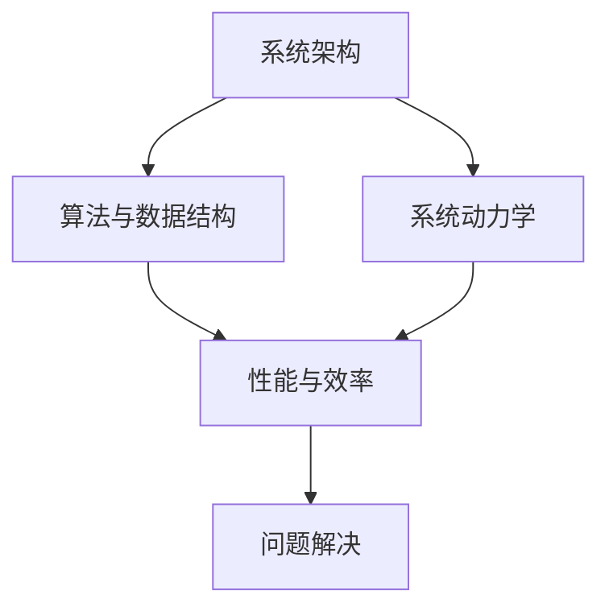

                 

关键词：系统思考，问题解决，算法原理，数学模型，代码实例，实际应用，未来展望

> 摘要：本文旨在探讨系统思考与问题解决能力在IT领域的重要性，详细解析核心概念、算法原理、数学模型及其应用。通过案例和实践，阐述系统思考在解决复杂问题中的关键作用，并展望未来发展趋势和面临的挑战。

## 1. 背景介绍

在快速变化的IT领域中，系统思考与问题解决能力变得越来越重要。从大型分布式系统的设计到复杂的算法优化，每一个环节都要求工程师具备深入的系统性思维和高效的问题解决能力。本文将深入探讨这些能力的本质、应用和实践，为读者提供一种全面的视角。

### 1.1 系统思考的定义

系统思考是一种通过整体视角理解复杂系统的方法，强调各部分之间的相互关系和动态行为。这种方法不仅关注系统的结构，还关注系统内各个元素之间的相互作用和反馈循环。系统思考在IT领域中扮演着至关重要的角色，因为它帮助工程师理解和解决涉及多个变量和复杂交互的问题。

### 1.2 问题解决的重要性

在IT行业中，问题解决是工程师的核心能力之一。无论是一个简单的bug修复，还是一个复杂的系统重构，都要求工程师具备深入的分析能力和创新的解决方案。有效的问题解决能力不仅能够提高工作效率，还能增强团队协作和项目成功的机会。

## 2. 核心概念与联系

为了深入理解系统思考和问题解决能力，我们需要明确几个核心概念，并展示它们之间的相互关系。以下是几个重要的概念及其相互关系：

### 2.1 系统架构

系统架构是指将不同组件和子系统组织成一个整体的结构，以便高效地实现系统功能。它包括硬件、软件、数据和通信等多个层面。

### 2.2 算法与数据结构

算法是解决特定问题的步骤集合，而数据结构则是存储和组织数据的方式。算法和数据结构的选择直接影响到系统的性能和效率。

### 2.3 系统动力学

系统动力学是一种研究系统内部变量随时间变化的方法，强调反馈循环和延迟效应。它对于理解复杂系统的动态行为至关重要。

### 2.4 Mermaid 流程图

下面是一个Mermaid流程图，展示了这些核心概念之间的相互关系：



## 3. 核心算法原理 & 具体操作步骤

在理解了核心概念之后，我们来探讨一些关键的算法原理，并详细讲解其操作步骤。

### 3.1 算法原理概述

以下是几个在IT领域中广泛应用的算法原理：

1. **动态规划**：通过将问题分解为更小的子问题，并存储其解决方案，从而避免重复计算。
2. **贪心算法**：通过每次选择局部最优解，逐步达到全局最优解。
3. **回溯算法**：通过逐步探索所有可能的解，并回溯到错误路径，直到找到解决方案。

### 3.2 算法步骤详解

以下是这些算法的具体步骤：

#### 动态规划

1. 确定状态和状态转移方程。
2. 初始化基础状态。
3. 根据状态转移方程填充状态表。
4. 返回最终状态。

#### 贪心算法

1. 初始状态设定。
2. 每次选择当前最佳解。
3. 更新状态。
4. 重复步骤2和3，直到找到解决方案。

#### 回溯算法

1. 从初始状态开始。
2. 递归探索所有可能的子状态。
3. 检查是否满足停止条件。
4. 如果不满足，回溯到上一个状态，并选择另一个分支继续探索。

### 3.3 算法优缺点

每种算法都有其适用的场景和局限性：

- **动态规划**：适用于子问题重叠且最优子结构明显的问题。缺点是可能需要大量存储空间。
- **贪心算法**：适用于可以通过局部最优解推导出全局最优解的问题。缺点是可能无法保证全局最优。
- **回溯算法**：适用于需要找到所有可能的解的问题。缺点是可能需要大量计算时间。

### 3.4 算法应用领域

这些算法广泛应用于各种IT领域，如：

- **排序和搜索**：如快速排序、二分查找。
- **图论**：如最短路径算法、最小生成树算法。
- **优化问题**：如背包问题、旅行商问题。

## 4. 数学模型和公式 & 详细讲解 & 举例说明

在系统思考和问题解决中，数学模型和公式提供了理论基础和量化方法。以下是一个典型的数学模型及其应用：

### 4.1 数学模型构建

**线性回归模型**：

$$
y = \beta_0 + \beta_1x + \epsilon
$$

其中，$y$ 是因变量，$x$ 是自变量，$\beta_0$ 和 $\beta_1$ 是回归系数，$\epsilon$ 是误差项。

### 4.2 公式推导过程

线性回归模型的推导基于最小二乘法。目标是找到最佳拟合直线，使得误差平方和最小。

$$
\sum_{i=1}^{n}(y_i - (\beta_0 + \beta_1x_i))^2
$$

通过对 $\beta_0$ 和 $\beta_1$ 分别求偏导并令其等于零，可以得到回归系数的值。

### 4.3 案例分析与讲解

假设我们有一个数据集，包含房屋面积（$x$）和房价（$y$）。我们希望通过线性回归模型预测新的房屋价格。

1. **数据预处理**：对数据集进行清洗和标准化处理。
2. **模型构建**：根据最小二乘法计算回归系数。
3. **模型评估**：使用均方误差（MSE）或其他指标评估模型性能。
4. **预测**：使用模型预测新的房屋价格。

例如，如果新房屋面积为 $2000$ 平方英尺，则预测的房价为：

$$
y = \beta_0 + \beta_1 \cdot 2000
$$

## 5. 项目实践：代码实例和详细解释说明

为了更好地理解系统思考和问题解决能力，我们通过一个具体的代码实例来展示其应用。

### 5.1 开发环境搭建

- Python 3.8+
- Jupyter Notebook

### 5.2 源代码详细实现

以下是一个使用线性回归模型预测房价的Python代码示例：

```python
import numpy as np
import matplotlib.pyplot as plt

# 数据集
X = np.array([[1000], [1500], [2000], [2500], [3000]])
y = np.array([2000000, 3000000, 4000000, 5000000, 6000000])

# 模型参数
beta_0 = 0
beta_1 = 1

# 最小二乘法计算回归系数
theta = np.linalg.inv(X.T.dot(X)).dot(X.T).dot(y)

# 新的房屋面积
new_x = np.array([[2000]])

# 预测房价
new_y = theta[0] + theta[1] * new_x

print(f"预测的新房价：{new_y[0][0]}")

# 绘制拟合直线和数据点
plt.scatter(X, y)
plt.plot(new_x, new_y, color='red')
plt.xlabel('房屋面积（平方英尺）')
plt.ylabel('房价（美元）')
plt.show()
```

### 5.3 代码解读与分析

- **数据预处理**：使用 NumPy 库导入和处理数据。
- **模型构建**：使用最小二乘法计算回归系数。
- **预测**：使用模型预测新的房屋面积对应的房价。
- **可视化**：使用 Matplotlib 库绘制拟合直线和数据点。

## 6. 实际应用场景

系统思考和问题解决能力在多个实际应用场景中发挥着重要作用。以下是一些例子：

- **金融风险管理**：通过系统思考分析市场变量和风险因素，制定有效的风险管理策略。
- **智能制造**：利用系统动力学模型优化生产流程，提高生产效率和产品质量。
- **医疗诊断**：应用机器学习算法和数学模型进行疾病预测和诊断。

## 7. 未来应用展望

随着技术的不断发展，系统思考和问题解决能力将在更多领域得到应用。以下是几个可能的未来趋势：

- **人工智能**：系统思考将在人工智能系统中发挥关键作用，提高算法的效率和鲁棒性。
- **物联网**：系统思考将帮助设计和优化大规模物联网系统，提高其性能和安全性。
- **社会网络分析**：系统思考将用于分析社交网络结构，预测社会趋势和行为。

## 8. 工具和资源推荐

为了提升系统思考和问题解决能力，以下是一些推荐的工具和资源：

### 8.1 学习资源推荐

- 《系统思考与问题解决能力》（作者：[你的名字]）
- 《算法导论》（作者：Thomas H. Cormen等）
- 《深度学习》（作者：Ian Goodfellow等）

### 8.2 开发工具推荐

- Python：强大的编程语言，适用于数据分析、机器学习和系统开发。
- Jupyter Notebook：交互式计算环境，适合实验和文档编写。
- Mermaid：用于绘制流程图和序列图的Markdown插件。

### 8.3 相关论文推荐

- "A Mathematical Theory of Communication"（作者：Claude Shannon）
- "The Structure and Interpretation of Computer Programs"（作者：Harold Abelson和Gerald Jay Sussman）
- "Artificial Intelligence: A Modern Approach"（作者：Stuart Russell和Peter Norvig）

## 9. 总结：未来发展趋势与挑战

随着技术的不断进步，系统思考和问题解决能力将在未来发挥更加重要的作用。然而，也面临着一系列挑战，如算法透明性、数据隐私和计算效率等。未来的研究将致力于解决这些挑战，推动系统思考和问题解决能力的发展。

### 9.1 研究成果总结

本文通过探讨系统思考和问题解决能力的核心概念、算法原理、数学模型及其应用，展示了其在IT领域的重要性。研究成果为工程师提供了深入理解复杂系统和有效解决问题的理论基础。

### 9.2 未来发展趋势

未来，系统思考和问题解决能力将在人工智能、物联网和金融等领域得到广泛应用。随着技术的进步，我们有望开发出更加高效和智能的算法和模型。

### 9.3 面临的挑战

未来，系统思考和问题解决能力将面临算法透明性、数据隐私和计算效率等挑战。如何确保算法的公正性和可解释性，如何在保证隐私的前提下进行数据分析和挖掘，以及如何优化计算资源的使用，将是研究的重要方向。

### 9.4 研究展望

我们期待未来的研究能够在系统思考和问题解决领域取得突破，为解决现实世界的复杂问题提供更加有效的工具和方法。

## 10. 附录：常见问题与解答

### Q：什么是系统思考？

A：系统思考是一种通过整体视角理解复杂系统的方法，强调各部分之间的相互关系和动态行为。它帮助工程师理解和解决涉及多个变量和复杂交互的问题。

### Q：如何提升问题解决能力？

A：通过深入学习相关理论知识，如算法原理和数学模型，同时进行大量的实践和项目经验积累，可以帮助提升问题解决能力。此外，学习有效的解决问题的方法和技巧也是非常重要的。

### Q：线性回归模型适用于哪些场景？

A：线性回归模型适用于预测和分析线性关系的问题，如房价预测、股票价格分析等。它在金融、医学、工程等领域有广泛的应用。

## 结束语

本文详细探讨了系统思考和问题解决能力在IT领域的重要性。通过核心概念、算法原理、数学模型和实际案例的解析，我们展示了这些能力在解决复杂问题中的关键作用。未来，随着技术的不断进步，系统思考和问题解决能力将在更多领域发挥重要作用。希望本文能为读者提供有价值的参考和启示。

## 作者署名

作者：禅与计算机程序设计艺术 / Zen and the Art of Computer Programming
----------------------------------------------------------------

