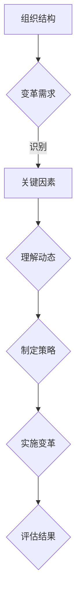

                 

在当今快速变化的商业环境中，组织变革已成为企业保持竞争力的关键因素。然而，有效的组织变革并不容易实现。这需要深入了解组织的内部运作机制，识别变革中的关键因素，并制定有效的策略来推动变革。系统思考作为一种理解复杂系统动态的方法，提供了洞悉组织变革深层次问题的工具。本文将探讨系统思考在组织变革中的应用，帮助组织领导者更好地应对变革挑战。

## 关键词

- 系统思考
- 组织变革
- 复杂系统
- 变革策略
- 组织行为

## 摘要

本文旨在介绍系统思考在组织变革中的应用，通过系统思考的方法论，帮助组织领导者识别变革中的关键因素，理解组织内部的动态互动，并制定有效的变革策略。文章将首先回顾系统思考的基本原理，然后探讨其在组织变革中的具体应用，并结合实际案例进行分析，最后提出未来研究和实践的方向。

### 1. 背景介绍

### 1.1 系统思考的基本概念

系统思考（Systems Thinking）是一种理解复杂系统动态的方法，它强调从整体而非局部的角度来分析问题。系统思考认为，系统是由相互关联的组成部分组成的，这些部分通过反馈循环相互影响，从而形成复杂的动态行为。系统思考的核心在于识别系统中的关键反馈循环和延迟动态，以及理解这些动态如何影响系统的长期行为。

系统思考的起源可以追溯到20世纪中叶，由管理学家彼得·德鲁克（Peter Drucker）和系统理论家亨利·拉斯韦尔（Henry Lasswell）等人提出。后来，系统思考得到了进一步的发展，特别是在系统动力学（System Dynamics）领域，由杰伊·福瑞斯特（Jay Forrester）等人进行了深入研究。

### 1.2 组织变革的定义与重要性

组织变革是指组织为了适应外部环境的变化或内部发展的需要，对现有结构和流程进行的一系列调整和改进。组织变革可能涉及组织结构、文化、技术、流程等多个方面。成功的组织变革不仅能够提升组织的适应能力，还能够提高组织的绩效和竞争力。

组织变革的重要性体现在以下几个方面：

- **适应外部环境**：随着市场和技术的发展，外部环境不断变化。组织需要通过变革来适应这些变化，以保持竞争力。
- **提升内部效率**：通过改进流程和优化资源分配，组织可以提高运营效率，降低成本。
- **增强创新能力**：变革可以激发员工的创新思维，推动组织持续创新，保持领先地位。
- **提升组织文化**：通过变革，组织可以塑造更加积极、开放和协作的文化，提高员工的满意度和忠诚度。

### 1.3 系统思考在组织变革中的应用

系统思考在组织变革中的应用主要体现在以下几个方面：

- **识别变革的关键因素**：通过系统思考，组织领导者可以识别影响变革成功的关键因素，从而制定更有效的变革策略。
- **理解变革的动态过程**：系统思考帮助领导者理解变革的动态过程，识别变革中的延迟和反馈循环，避免变革过程中的常见陷阱。
- **制定变革策略**：基于系统思考，组织可以制定更加全面和灵活的变革策略，确保变革能够顺利推进并取得预期效果。

### 1.4 文章结构

本文将按照以下结构展开：

- **第2章**：介绍系统思考的核心概念和基本原理。
- **第3章**：探讨系统思考在组织变革中的具体应用，包括识别关键因素、理解变革动态、制定变革策略等。
- **第4章**：结合实际案例，分析系统思考在组织变革中的应用效果。
- **第5章**：讨论系统思考在组织变革中的挑战和局限性。
- **第6章**：总结系统思考在组织变革中的应用，并提出未来研究方向。

### 2. 核心概念与联系

#### 2.1 系统思考的基本原理

系统思考的核心在于理解复杂系统的动态行为，特别是那些由相互关联的组成部分组成的系统。以下是系统思考的一些基本原理：

- **整体性**：系统思考强调从整体而非局部的角度来分析问题。这意味着需要关注系统内部各个部分之间的相互作用和反馈循环。
- **反馈循环**：反馈循环是系统思考的一个重要概念，它描述了系统内部各个部分之间的相互作用如何形成循环。反馈循环可以是正反馈，也可以是负反馈，它们分别导致系统行为的增强或减弱。
- **延迟**：延迟是系统行为中的一个重要特征，它描述了系统响应外部变化所需的时间。延迟可能导致系统行为的不稳定和不可预测性。
- **结构**：系统思考强调系统结构对系统行为的影响。系统的设计、组织和流程等因素都会影响系统的动态行为。

#### 2.2 系统思考的应用场景

系统思考可以应用于各种复杂系统，包括组织、生态系统、经济系统等。以下是系统思考在组织变革中的具体应用场景：

- **识别变革的关键因素**：通过系统思考，组织领导者可以识别影响变革成功的关键因素，例如文化、结构、流程等。
- **理解变革的动态过程**：系统思考帮助领导者理解变革的动态过程，识别变革中的延迟和反馈循环，避免变革过程中的常见陷阱。
- **制定变革策略**：基于系统思考，组织可以制定更加全面和灵活的变革策略，确保变革能够顺利推进并取得预期效果。

#### 2.3 Mermaid 流程图

以下是系统思考在组织变革中的 Mermaid 流程图：



### 3. 核心算法原理 & 具体操作步骤

#### 3.1 算法原理概述

系统思考在组织变革中的应用可以看作是一种算法，它通过识别关键因素、理解动态过程、制定变革策略等步骤，帮助组织实现有效的变革。以下是这个算法的基本原理：

- **识别关键因素**：通过系统思考的方法，组织领导者可以识别影响变革成功的关键因素，如组织文化、结构、流程等。这一步骤的关键是全面、深入地了解组织现状，识别出那些对变革有重大影响的因素。
- **理解动态过程**：系统思考帮助领导者理解变革的动态过程，识别变革中的延迟和反馈循环，避免变革过程中的常见陷阱。这一步骤需要领导者具备系统思考的能力，能够从整体和长远的角度看待变革。
- **制定变革策略**：基于系统思考的结果，组织可以制定更加全面和灵活的变革策略，确保变革能够顺利推进并取得预期效果。这一步骤需要领导者具备战略思维和决策能力。

#### 3.2 算法步骤详解

以下是系统思考在组织变革中的具体操作步骤：

##### 3.2.1 识别关键因素

1. **收集信息**：通过访谈、问卷调查、数据分析等方法，收集组织内部和外部的信息。
2. **识别因素**：根据收集的信息，识别影响变革的关键因素，如组织文化、结构、流程等。
3. **优先排序**：根据关键因素的重要性和影响力，对其进行优先排序，确定哪些因素需要优先考虑。

##### 3.2.2 理解动态过程

1. **构建模型**：使用系统动态模型，如系统动力学模型，模拟变革过程中的各种可能情况。
2. **分析反馈循环**：识别变革过程中的正反馈和负反馈循环，理解它们如何影响系统的行为。
3. **识别延迟**：分析变革过程中的延迟现象，理解它们如何影响变革的进程和效果。

##### 3.2.3 制定变革策略

1. **制定目标**：根据识别的关键因素和动态过程，制定明确的变革目标。
2. **设计策略**：设计具体的变革策略，如组织结构调整、流程优化、文化建设等。
3. **制定计划**：制定详细的变革计划，包括时间表、资源分配、责任分工等。

##### 3.2.4 实施变革

1. **动员员工**：通过沟通、培训等方式，动员员工参与变革，提高他们的认同感和积极性。
2. **推进变革**：按照变革计划，逐步推进变革，确保变革的顺利进行。
3. **调整策略**：在实施过程中，根据实际情况调整变革策略，确保变革目标能够实现。

##### 3.2.5 评估结果

1. **收集数据**：收集变革实施后的数据，如组织绩效、员工满意度等。
2. **分析效果**：根据收集的数据，分析变革的效果，评估变革目标的实现情况。
3. **总结经验**：总结变革过程中的经验教训，为未来的变革提供参考。

#### 3.3 算法优缺点

**优点**：

- **全面性**：系统思考方法能够全面考虑组织变革的各个因素，避免片面地看待问题。
- **前瞻性**：通过分析反馈循环和延迟现象，系统能够预见变革可能带来的长期影响。
- **灵活性**：系统思考方法能够根据实际情况灵活调整变革策略，提高变革的适应性。

**缺点**：

- **复杂性**：系统思考方法需要领导者具备一定的专业知识和思维能力，否则可能难以理解复杂的系统动态。
- **实施难度**：系统思考方法的实施过程较为复杂，需要花费较长的时间和精力。

#### 3.4 算法应用领域

系统思考在组织变革中的应用非常广泛，可以应用于各种类型和规模的组织。以下是一些具体的领域：

- **企业变革**：在企业变革中，系统思考可以帮助企业识别关键因素，理解变革动态，制定有效的变革策略。
- **政府机构**：在政府机构的改革中，系统思考可以帮助政府更好地理解改革中的关键因素和动态过程，制定科学的改革方案。
- **社会变革**：在社会变革中，系统思考可以帮助社会领导者更好地理解社会系统的动态，制定有效的改革方案，促进社会的可持续发展。

### 4. 数学模型和公式 & 详细讲解 & 举例说明

#### 4.1 数学模型构建

系统思考中的数学模型通常基于系统动力学（System Dynamics）的方法，它通过因果关系图（Causal Loop Diagram, CLD）和股票流图（Stock and Flow Diagram, SFD）来描述系统的动态行为。

##### 4.1.1 因果关系图

因果关系图是一种图形化的表示方法，用于展示系统内部各个变量之间的因果关系。以下是因果关系图的基本符号和表示方法：

- **反馈环**：表示变量之间的因果关系，可以是正反馈环或负反馈环。
- **延迟**：表示变量之间的时间延迟，可以是时间延迟或因果延迟。
- **因果关系**：表示变量之间的因果关系，可以是正向或反向。

##### 4.1.2 股票流图

股票流图是一种用于描述系统内部变量动态变化的图形化方法。以下是股票流图的基本符号和表示方法：

- **股票**：表示系统的状态变量，可以是存量或流量。
- **流**：表示系统状态变量的变化率，可以是流入或流出。
- **反馈流**：表示系统内部变量之间的反馈关系。

#### 4.2 公式推导过程

系统思考中的数学模型通常基于微分方程或差分方程。以下是系统动力学模型的基本推导过程：

##### 4.2.1 存量方程

存量方程描述了系统状态变量随时间的变化率。以下是一个简单的存量方程：

$$ \frac{dS}{dt} = F(S, t) $$

其中，\( S \) 表示存量，\( t \) 表示时间，\( F(S, t) \) 表示存量随时间的变化率。

##### 4.2.2 流量方程

流量方程描述了系统状态变量之间的流量关系。以下是一个简单的流量方程：

$$ \frac{dS_1}{dt} = -F_1(S_1, t) + F_2(S_2, t) $$

其中，\( S_1 \) 和 \( S_2 \) 表示两个不同的存量，\( F_1(S_1, t) \) 和 \( F_2(S_2, t) \) 分别表示 \( S_1 \) 和 \( S_2 \) 的流量。

##### 4.2.3 反馈方程

反馈方程描述了系统内部变量之间的反馈关系。以下是一个简单的反馈方程：

$$ F(S, t) = k \cdot S \cdot (1 - \frac{S}{K}) $$

其中，\( k \) 和 \( K \) 分别是反馈增益和反馈极限。

#### 4.3 案例分析与讲解

##### 4.3.1 组织变革中的反馈循环

以下是一个组织变革中的反馈循环案例：

假设一个企业面临市场需求下降的问题，为了应对这一挑战，企业决定进行组织变革。变革措施包括优化产品线、提高生产效率和改进客户服务。

首先，市场需求下降导致企业的销售收入减少，进而导致企业的利润下降。为了提高利润，企业决定增加研发投入，开发新产品，以扩大市场份额。

然而，新产品开发需要时间，因此在短期内，销售收入仍然会下降。这种负反馈循环导致企业在短期内面临更大的压力。

随着新产品的推出，市场份额逐渐增加，销售收入开始回升。当利润达到一定程度时，企业会继续增加研发投入，进一步优化产品线，形成正反馈循环。

通过这个案例，我们可以看到，组织变革中的反馈循环会影响企业的长期发展。负反馈循环可能导致企业面临短期压力，但正反馈循环有助于企业实现长期增长。

##### 4.3.2 延迟现象

以下是一个组织变革中的延迟现象案例：

一个企业决定进行组织结构优化，以提升企业的运营效率。变革措施包括减少管理层级、合并部门、优化流程等。

然而，由于变革需要时间来实施，企业在短期内可能会面临运营效率下降的问题。这是因为，部门合并和流程优化需要时间来协调和磨合，而减少管理层级可能会导致员工不满和动荡。

随着时间的推移，企业逐渐适应新的组织结构，运营效率逐渐提高。然而，这个变革过程可能需要数月甚至数年时间，因此企业在变革初期可能会面临一定的延迟现象。

### 5. 项目实践：代码实例和详细解释说明

#### 5.1 开发环境搭建

在本项目中，我们将使用Python语言和Vensim软件进行系统思考模型的构建和模拟。首先，需要安装Python环境和Vensim软件。以下是具体的步骤：

1. **安装Python环境**：

   - 访问Python官方网站（https://www.python.org/），下载并安装Python。
   - 安装完成后，打开命令行窗口，输入`python --version`，确认Python环境安装成功。

2. **安装Vensim软件**：

   - 访问Vensim官方网站（https://www.vensim.com/），下载并安装Vensim软件。
   - 安装完成后，打开Vensim软件，确认软件安装成功。

3. **安装Python Vensim库**：

   - 在命令行窗口中，输入以下命令安装Python Vensim库：

     ```python
     pip install vensim
     ```

   - 安装完成后，确认Python Vensim库安装成功。

#### 5.2 源代码详细实现

在本项目中，我们将使用Python Vensim库构建一个简单的组织变革系统模型，模拟组织变革过程中的反馈循环和延迟现象。以下是具体的代码实现：

```python
import vensim

# 定义系统变量
s = vensim.DeclareVariable('s', 'system variable')
i = vensim.DeclareVariable('i', 'input variable')

# 定义因果关系
s因果关系 = vensim.DeclareCause('s因果关系', 's', 'i')
i因果关系 = vensim.DeclareCause('i因果关系', 'i', 's')

# 定义反馈循环
s反馈循环 = vensim.DeclareFeedbackLoop('s反馈循环', ['s因果关系', 'i因果关系'])

# 定义延迟
s延迟 = vensim.DeclareTimeDelay('s延迟', 's', 1)

# 定义模型方程
s方程 = vensim.DeclareEquation('s方程', 's', 's延迟')
i方程 = vensim.DeclareEquation('i方程', 'i', 's')

# 构建模型
model = vensim.Model()
model.DeclareVariables([s, i])
model.DeclareCauses([s因果关系, i因果关系])
model.DeclareFeedbackLoops([s反馈循环])
model.DeclareTimeDelays([s延迟])
model.DeclareEquations([s方程, i方程])

# 模拟模型
simulator = vensim.Simulator(model)
simulator.Run(100)

# 输出结果
print(simulator.GetVariableValues('s'))
```

#### 5.3 代码解读与分析

以下是代码的详细解读：

1. **导入库**：首先，我们导入Python Vensim库，用于构建和模拟系统模型。
2. **定义变量**：我们定义了两个系统变量`s`（系统变量）和`i`（输入变量）。这些变量表示组织变革中的关键因素。
3. **定义因果关系**：我们定义了`s因果关系`和`i因果关系`，分别表示`s`和`i`之间的因果关系。
4. **定义反馈循环**：我们定义了`s反馈循环`，表示`s`和`i`之间的反馈循环。这个反馈循环会导致系统的动态变化。
5. **定义延迟**：我们定义了`s延迟`，表示`s`的变化率受到延迟的影响。
6. **定义模型方程**：我们定义了`s方程`和`i方程`，分别表示`s`和`i`的变化率。
7. **构建模型**：我们使用Vensim库构建了一个简单的系统模型，包括变量、因果关系、反馈循环和延迟。
8. **模拟模型**：我们使用Vensim库模拟了系统模型的动态行为，并运行了100个时间单位。
9. **输出结果**：我们输出了系统变量`s`的值，以观察系统动态变化。

通过这个简单的代码实例，我们可以看到系统思考在组织变革中的应用。代码模拟了组织变革中的反馈循环和延迟现象，帮助我们理解组织变革的动态过程。

### 6. 实际应用场景

系统思考在组织变革中的实际应用场景非常广泛，以下是一些典型的应用场景：

#### 6.1 企业组织变革

在企业组织变革中，系统思考可以帮助企业识别关键因素，理解变革的动态过程，并制定有效的变革策略。以下是一个具体的案例：

某大型制造企业面临市场竞争加剧和成本上升的挑战，决定进行组织变革以提高竞争力。企业领导者通过系统思考的方法，识别了以下几个关键因素：

1. **市场需求**：市场需求的变化是影响企业竞争力的重要因素。
2. **生产效率**：提高生产效率是降低成本的关键。
3. **组织结构**：组织结构的不合理是导致生产效率低下的主要原因。

通过系统思考，企业领导者理解了这些因素之间的因果关系和反馈循环。他们发现，市场需求的变化会影响生产计划，进而影响生产效率。而生产效率低下又会影响企业的盈利能力，形成负反馈循环。

基于这些分析，企业领导者制定了以下变革策略：

1. **优化生产计划**：通过改进生产计划，提高生产效率。
2. **调整组织结构**：合并部门，减少管理层级，优化组织结构。
3. **加强员工培训**：提高员工的技能和素质，提高生产效率。

通过实施这些变革策略，企业成功提高了生产效率和竞争力，实现了盈利能力的提升。

#### 6.2 政府机构改革

在政府机构改革中，系统思考可以帮助政府识别关键因素，理解改革的动态过程，并制定有效的改革方案。以下是一个具体的案例：

某市政府面临公共服务效率低下的问题，决定进行机构改革以提高公共服务水平。政府领导者通过系统思考的方法，识别了以下几个关键因素：

1. **组织结构**：组织结构的不合理是导致公共服务效率低下的主要原因。
2. **流程管理**：流程管理的不规范是导致公共服务效率低下的关键因素。
3. **人力资源**：人力资源的配置不合理是影响公共服务效率的重要因素。

通过系统思考，政府领导者理解了这些因素之间的因果关系和反馈循环。他们发现，组织结构的不合理会导致流程管理的不规范，进而影响公共服务效率。而公共服务效率低下又会影响政府形象和公信力，形成负反馈循环。

基于这些分析，政府领导者制定了以下改革方案：

1. **优化组织结构**：调整组织结构，减少管理层级，提高决策效率。
2. **规范流程管理**：制定和实施规范的流程管理标准，提高公共服务效率。
3. **优化人力资源**：加强员工培训，优化人力资源配置，提高员工素质。

通过实施这些改革方案，市政府成功提高了公共服务效率，提升了政府形象和公信力。

#### 6.3 社会变革

在社会变革中，系统思考可以帮助社会领导者识别关键因素，理解变革的动态过程，并制定有效的改革方案。以下是一个具体的案例：

某城市面临环境污染和交通拥堵的问题，决定进行社会变革以改善环境质量。社会领导者通过系统思考的方法，识别了以下几个关键因素：

1. **能源消耗**：能源消耗是导致环境污染的主要原因。
2. **交通方式**：交通方式的改变是缓解交通拥堵的关键。
3. **城市规划**：城市规划的合理性是影响环境质量和交通拥堵的重要因素。

通过系统思考，社会领导者理解了这些因素之间的因果关系和反馈循环。他们发现，能源消耗的增加会导致环境污染的加剧，进而影响城市居民的生活质量。而交通拥堵又会加重环境污染，形成负反馈循环。

基于这些分析，社会领导者制定了以下变革方案：

1. **推广清洁能源**：鼓励使用清洁能源，减少能源消耗。
2. **改善交通方式**：推广公共交通和非机动车出行，减少私家车使用。
3. **优化城市规划**：调整城市规划，增加绿地和公共设施，改善城市环境。

通过实施这些变革方案，城市成功改善了环境质量，缓解了交通拥堵，提升了居民的生活质量。

### 7. 工具和资源推荐

#### 7.1 学习资源推荐

为了更好地掌握系统思考在组织变革中的应用，以下是一些建议的学习资源：

- **书籍**：
  - 《系统思考》：由彼得·舍恩贝格（Peter Senge）著，是系统思考领域的经典著作。
  - 《第五项修炼》：同上，介绍了系统思考的五项核心技能。
  - 《系统动力学的实践》：由杰伊·福瑞斯特著，详细介绍了系统动力学的方法和应用。

- **在线课程**：
  - Coursera上的“系统思考与领导力”课程，由麻省理工学院提供。
  - edX上的“系统动力学与决策分析”课程，由卡内基梅隆大学提供。

- **网站和论坛**：
  - Systems Thinking World（https://www.systemsthinkingworld.com/），提供系统思考的资源、工具和社区。
  - System Dynamics Society（https://www.systemdynamics.org/），系统动力学领域的专业组织，提供会议、论文和研究报告。

#### 7.2 开发工具推荐

在构建和模拟系统思考模型时，以下开发工具可能非常有用：

- **Vensim**：是一款功能强大的系统动力学建模和仿真软件，适用于构建复杂的系统模型。
- **Stella**：另一款流行的系统动力学建模工具，具有直观的用户界面和强大的建模功能。
- **PowerSystem**：一款基于MATLAB的系统动力学建模工具，适用于进行高级的模拟和分析。

#### 7.3 相关论文推荐

以下是一些建议的学术论文，这些论文探讨了系统思考在组织变革中的应用：

- **“Systems Thinking in Organizational Change: A Review of the Literature”**：本文对系统思考在组织变革中的应用进行了全面的综述。
- **“Using System Dynamics to Support Organizational Change”**：本文探讨了系统动力学在组织变革中的具体应用，包括模型的构建和模拟。
- **“The Role of Systems Thinking in Managing Complex Organizations”**：本文分析了系统思考在复杂组织管理中的重要性，提出了系统思考的应用框架。

### 8. 总结：未来发展趋势与挑战

#### 8.1 研究成果总结

系统思考在组织变革中的应用已经取得了显著的研究成果。通过系统思考的方法，组织领导者可以更好地识别变革的关键因素，理解变革的动态过程，并制定有效的变革策略。实际案例表明，系统思考有助于提高组织变革的成功率，提升组织的适应能力和竞争力。

#### 8.2 未来发展趋势

未来，系统思考在组织变革中的应用有望在以下几个方面取得进一步的发展：

- **模型构建与模拟**：随着计算机技术和数学模型的进步，系统思考模型将变得更加复杂和精确，能够更准确地模拟组织变革的动态过程。
- **智能化与自动化**：结合人工智能技术，系统思考模型可以实现自动化建模和模拟，提高变革策略的制定和调整效率。
- **跨学科整合**：系统思考将与其他学科，如心理学、社会学、经济学等相结合，形成更加综合和全面的研究方法。

#### 8.3 面临的挑战

尽管系统思考在组织变革中的应用前景广阔，但也面临着一些挑战：

- **知识门槛**：系统思考需要领导者具备一定的专业知识和思维能力，这对许多组织来说是一个挑战。
- **实施难度**：系统思考模型的构建和模拟需要大量的时间和资源，实施过程较为复杂。
- **适应性**：组织变革的情境多样，系统思考模型需要具备良好的适应性和灵活性，以满足不同组织的需要。

#### 8.4 研究展望

未来，系统思考在组织变革中的应用研究可以从以下几个方面展开：

- **模型优化**：进一步优化系统思考模型，提高模型的精度和适用性。
- **工具开发**：开发更加便捷和智能的系统思考工具，降低知识门槛，提高实施效率。
- **案例分析**：通过更多的实际案例研究，总结系统思考在组织变革中的应用经验，为实践提供指导。

### 9. 附录：常见问题与解答

以下是一些关于系统思考在组织变革中的应用的常见问题及其解答：

**Q1. 系统思考如何帮助组织领导者识别变革的关键因素？**

A1. 系统思考通过构建因果关系图和反馈循环图，帮助组织领导者识别系统内部各个变量之间的相互关系和因果关系，从而识别出影响变革的关键因素。

**Q2. 系统思考在组织变革中如何应用？**

A2. 系统思考在组织变革中的应用主要包括：1）识别关键因素；2）理解动态过程；3）制定变革策略；4）实施变革；5）评估结果。通过这些步骤，组织领导者可以更好地推进组织变革。

**Q3. 系统思考在组织变革中有什么局限性？**

A3. 系统思考在组织变革中主要面临以下局限性：1）知识门槛较高，需要领导者具备一定的专业知识和思维能力；2）实施过程复杂，需要投入大量的时间和资源；3）适应性有限，需要根据不同组织的实际情况进行调整。

**Q4. 系统思考在组织变革中的应用前景如何？**

A4. 系统思考在组织变革中的应用前景非常广阔。随着计算机技术和数学模型的发展，系统思考将变得更加精确和智能，能够为组织变革提供更加有效的支持和指导。同时，跨学科整合也将进一步推动系统思考在组织变革中的应用。

