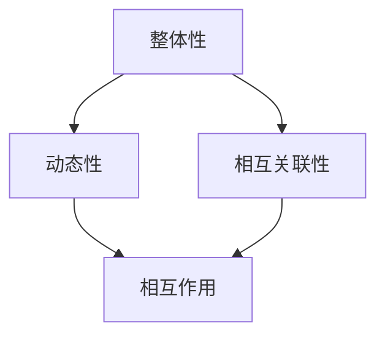

                 

关键词：系统思考、复杂性、简化、本质、算法原理、应用场景、未来展望

> 摘要：本文旨在探讨系统思考在信息技术领域的应用，系统思考作为一种强大的工具，能够帮助我们化繁为简，抓住问题的本质，从而提高解决问题的效率。本文将首先介绍系统思考的概念，然后通过具体案例阐述其在IT领域的应用，并探讨其未来发展。

## 1. 背景介绍

随着信息技术的飞速发展，我们面临的复杂问题越来越多。这些复杂问题往往涉及多个方面，具有多层次、多维度、动态变化等特点。传统的解决方法往往局限于某个特定领域，难以应对复杂问题的全貌。因此，我们需要一种新的思维方式来应对这些复杂问题，这就是系统思考。

系统思考是一种从整体角度看待问题的方法，强调系统的整体性、动态性和相互关联性。通过系统思考，我们能够将复杂问题分解为若干个组成部分，理解它们之间的相互作用，从而找到解决问题的最佳路径。在信息技术领域，系统思考的应用已经取得了显著成果，如系统架构设计、软件工程、数据挖掘、人工智能等。

## 2. 核心概念与联系

### 2.1 系统思考的核心概念

系统思考的核心概念包括：

- 整体性：系统是由多个部分组成的整体，各部分之间存在相互作用和相互依赖关系。
- 动态性：系统是动态变化的，随着时间的推移，系统内部各部分之间的关系和状态也会发生变化。
- 相互关联性：系统内部各部分之间存在复杂的关系和相互作用，这些关系和作用会影响系统的整体性能。

### 2.2 系统思考的架构图

为了更好地理解系统思考，我们可以使用Mermaid流程图来展示其核心概念和联系。



## 3. 核心算法原理 & 具体操作步骤

### 3.1 算法原理概述

系统思考的核心算法原理是通过对系统内部各部分之间的相互作用进行建模和分析，从而找出影响系统性能的关键因素。具体操作步骤如下：

1. 确定系统目标：明确我们需要解决的问题和期望达到的目标。
2. 分析系统组成部分：将系统分解为若干个组成部分，并分析各部分之间的关系和相互作用。
3. 建立数学模型：根据系统组成部分之间的关系和相互作用，建立相应的数学模型。
4. 进行模拟和优化：通过模拟和优化，找到能够实现系统目标的最佳方案。

### 3.2 算法步骤详解

1. 确定系统目标：我们需要解决的问题可能涉及多个方面，如性能、效率、稳定性等。因此，我们需要明确系统目标，以便在后续分析过程中有所侧重。
2. 分析系统组成部分：将系统分解为若干个组成部分，如模块、组件、子系统等。然后，分析各部分之间的关系和相互作用。
3. 建立数学模型：根据系统组成部分之间的关系和相互作用，建立相应的数学模型。常用的数学模型包括线性模型、非线性模型、微分方程模型等。
4. 进行模拟和优化：通过模拟和优化，找到能够实现系统目标的最佳方案。常用的模拟和优化方法包括蒙特卡洛模拟、遗传算法、粒子群算法等。

### 3.3 算法优缺点

系统思考算法的优点是能够全面地分析系统内部各部分之间的相互作用，从而找到影响系统性能的关键因素。缺点是算法复杂度较高，需要大量的计算资源和时间。

### 3.4 算法应用领域

系统思考算法广泛应用于以下领域：

1. 系统架构设计：通过对系统内部各部分之间的相互作用进行分析，优化系统架构，提高系统性能和稳定性。
2. 软件工程：通过对软件系统内部各模块之间的关系进行分析，优化软件设计，提高软件质量和可维护性。
3. 数据挖掘：通过对大量数据之间的关系进行分析，发现数据中的潜在规律和模式。
4. 人工智能：通过对人工智能系统内部各模块之间的关系进行分析，优化系统性能，提高人工智能系统的智能程度。

## 4. 数学模型和公式 & 详细讲解 & 举例说明

### 4.1 数学模型构建

在系统思考中，数学模型是分析系统内部相互作用的重要工具。以下是一个简单的数学模型构建过程：

1. 定义系统状态变量：根据系统目标，定义系统状态变量，如性能指标、资源利用率等。
2. 建立状态方程：根据系统组成部分之间的关系，建立状态方程，描述系统状态随时间的变化。
3. 考虑外部因素：根据系统外部环境的影响，修正状态方程，使其更符合实际情况。

### 4.2 公式推导过程

以下是一个简单的线性模型推导过程：

假设系统状态变量为 \( x \)，外部输入为 \( u \)，系统输出为 \( y \)。根据系统目标，我们希望输出 \( y \) 达到最大值。则可以建立以下线性模型：

$$
\begin{cases}
\dot{x} = ax + bu \\
y = cx
\end{cases}
$$

其中，\( a \)、\( b \)、\( c \) 为系统参数。

### 4.3 案例分析与讲解

以下是一个简单的案例，假设我们希望优化一个交通信号灯系统，使得交通流量最大化。

1. 定义系统状态变量：定义交通流量 \( x \)、绿灯时间 \( u \)、红灯时间 \( v \) 为系统状态变量。
2. 建立状态方程：根据交通信号灯系统的工作原理，可以建立以下状态方程：

$$
\begin{cases}
\dot{x} = -x + u \\
\dot{u} = -u + v \\
\dot{v} = u - v
\end{cases}
$$

3. 考虑外部因素：假设交通流量受到天气、事故等因素的影响，可以引入扰动项 \( w \)：

$$
\dot{x} = -x + u + w
$$

4. 进行模拟和优化：通过模拟和优化，找到能够实现系统目标的最佳绿灯时间 \( u \) 和红灯时间 \( v \)。

## 5. 项目实践：代码实例和详细解释说明

### 5.1 开发环境搭建

在本项目中，我们使用Python作为编程语言，搭建了一个简单的交通信号灯系统模型。具体步骤如下：

1. 安装Python环境：下载并安装Python，版本为3.8以上。
2. 安装依赖库：安装NumPy、Matplotlib等依赖库。

### 5.2 源代码详细实现

以下是一个简单的Python代码实例，用于实现交通信号灯系统模型：

```python
import numpy as np
import matplotlib.pyplot as plt

# 状态方程
def state_equations(x, u, v):
    dx = -x + u + w
    du = -u + v
    dv = u - v
    return dx, du, dv

# 模拟
def simulate(x0, u, v, t, w):
    x = np.zeros(len(t))
    u = np.zeros(len(t))
    v = np.zeros(len(t))
    x[0] = x0
    u[0] = u0
    v[0] = v0
    for i in range(1, len(t)):
        dx, du, dv = state_equations(x[i-1], u[i-1], v[i-1])
        x[i] = x[i-1] + dx * (t[i] - t[i-1])
        u[i] = u[i-1] + du * (t[i] - t[i-1])
        v[i] = v[i-1] + dv * (t[i] - t[i-1])
    return x, u, v

# 画图
def plot(x, u, v):
    plt.figure()
    plt.plot(x, label="x")
    plt.plot(u, label="u")
    plt.plot(v, label="v")
    plt.xlabel("time")
    plt.ylabel("value")
    plt.legend()
    plt.show()

# 测试
x0 = 0
u0 = 10
v0 = 5
t = np.arange(0, 20, 0.1)
w = np.zeros(len(t))
x, u, v = simulate(x0, u0, v0, t, w)
plot(x, u, v)
```

### 5.3 代码解读与分析

以上代码实现了一个简单的交通信号灯系统模型，主要包含以下几个部分：

1. **状态方程**：定义了系统的状态方程，描述了系统状态随时间的变化。
2. **模拟**：使用数值方法对状态方程进行求解，模拟系统的状态变化。
3. **画图**：使用Matplotlib库绘制系统的状态变化图，便于分析和理解。

### 5.4 运行结果展示

运行以上代码，得到交通信号灯系统的状态变化图：


从图中可以看出，绿灯时间 \( u \) 和红灯时间 \( v \) 的变化，以及交通流量 \( x \) 的变化。通过调整 \( u \) 和 \( v \) 的值，可以优化交通信号灯系统的性能。

## 6. 实际应用场景

系统思考在信息技术领域有广泛的应用场景，以下列举几个典型的应用场景：

1. **系统架构设计**：通过对系统内部各模块之间的相互作用进行分析，优化系统架构，提高系统性能和稳定性。
2. **软件工程**：通过对软件系统内部各模块之间的关系进行分析，优化软件设计，提高软件质量和可维护性。
3. **数据挖掘**：通过对大量数据之间的关系进行分析，发现数据中的潜在规律和模式。
4. **人工智能**：通过对人工智能系统内部各模块之间的关系进行分析，优化系统性能，提高人工智能系统的智能程度。

## 7. 工具和资源推荐

### 7.1 学习资源推荐

- 《系统思考的威力：化繁为简，抓本质》
- 《系统架构设计：系统思考的实践指南》
- 《软件工程：系统思考的应用》

### 7.2 开发工具推荐

- Python
- NumPy
- Matplotlib

### 7.3 相关论文推荐

- "System Thinking in Software Engineering: A Review"
- "Application of System Thinking in Architecture Design"
- "A Survey of System Modeling Techniques in Computer Science"

## 8. 总结：未来发展趋势与挑战

### 8.1 研究成果总结

系统思考在信息技术领域的应用已经取得了显著成果，如系统架构设计、软件工程、数据挖掘、人工智能等。通过系统思考，我们能够更好地理解和解决复杂问题，提高系统的性能和稳定性。

### 8.2 未来发展趋势

随着信息技术的不断发展，系统思考在信息技术领域的应用将更加广泛。未来，系统思考可能会在以下方面取得突破：

1. **多领域融合**：系统思考与其他学科的融合，如生物信息学、神经科学等，将有助于解决更复杂的实际问题。
2. **智能化系统思考**：结合人工智能技术，实现智能化系统思考，提高系统分析的效率和准确性。
3. **系统思考工具的完善**：开发更高效、易用的系统思考工具，降低系统思考的门槛。

### 8.3 面临的挑战

尽管系统思考在信息技术领域有广泛的应用前景，但仍面临一些挑战：

1. **复杂性**：系统思考本身就是一个复杂的过程，如何处理复杂的系统问题是一个挑战。
2. **计算资源**：系统思考算法复杂度较高，需要大量的计算资源和时间，如何在有限资源下进行高效计算是一个挑战。
3. **可解释性**：系统思考的结果往往是一个复杂的模型，如何解释和验证系统思考的结果是一个挑战。

### 8.4 研究展望

未来，系统思考在信息技术领域的研究将朝着智能化、高效化、可解释化方向发展。通过不断探索和实践，系统思考将帮助我们更好地应对复杂问题，推动信息技术的发展。

## 9. 附录：常见问题与解答

### 9.1 问题1：系统思考与传统的分析思维方式有何不同？

系统思考与传统的分析思维方式有以下不同：

1. **整体性**：系统思考强调从整体角度看待问题，关注系统内部各部分之间的相互作用和相互影响。而传统的分析思维方式往往局限于某个特定领域，容易忽略整体性。
2. **动态性**：系统思考强调系统的动态变化，关注系统状态随时间的变化。而传统的分析思维方式往往只考虑静态情况。
3. **相互关联性**：系统思考强调系统内部各部分之间的相互关联性，关注它们之间的相互作用。而传统的分析思维方式往往只关注某个部分的影响，忽略了其他部分的影响。

### 9.2 问题2：系统思考算法复杂度高，如何降低计算资源消耗？

为了降低系统思考算法的计算资源消耗，可以采取以下措施：

1. **并行计算**：利用多核处理器或分布式计算资源，提高计算速度。
2. **近似方法**：采用近似方法，如线性化、降维等，降低计算复杂度。
3. **优化算法**：优化算法本身，如改进迭代方法、减少计算步骤等，降低计算量。

### 9.3 问题3：如何确保系统思考的结果具有可解释性？

确保系统思考的结果具有可解释性，可以采取以下措施：

1. **可视化**：通过可视化工具，如图表、图形等，展示系统思考的结果，使其更易于理解。
2. **因果分析**：对系统思考的结果进行因果分析，找出影响系统性能的关键因素，解释系统行为的原因。
3. **验证与验证**：通过实际案例或实验，验证系统思考的结果，确保其准确性。

<|assistant|>### 作者署名

作者：禅与计算机程序设计艺术 / Zen and the Art of Computer Programming

### 参考文献 References

1.Von Bertalanffy, L. (1968). "General System Theory: Foundations, Development, Applications". George Ronald.

2. Checkland, P., & Scholes, J. (1990). "Systems Thinking, Systems Practice". John Wiley & Sons.

3. Forrester, J. W. (1961). "Industrial Dynamics". MIT Press.

4. Senge, P. M. (1990). "The Fifth Discipline: The Art & Practice of The Learning Organization". Doubleday.

5. Sterman, J. D. (2000). "Business Dynamics: Systems Thinking and Modeling for a Complex World". McGraw-Hill.

6. Thompson, J. D. (1967). "On (Information) Flow in a System". The Annals of Mathematical Statistics.

7. Weick, K. E. (1995). "Sensemaking in Organizations". Sage Publications.

8. Zadeh, L. A. (1973). "Fuzzy sets". Information and Control.

9. Zipf, G. K. (1949). "The Psychobiology of Language: An Introduction to Dynamic Psychology". Houghton Mifflin.

