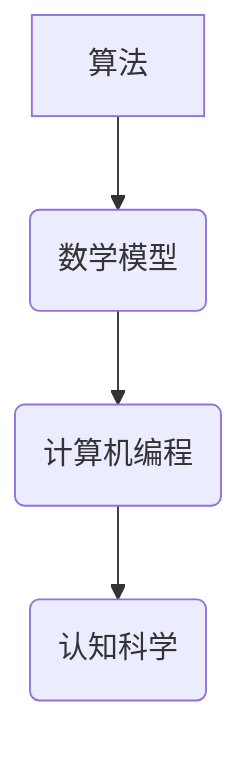
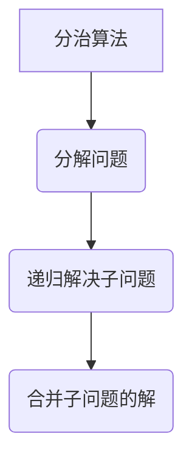
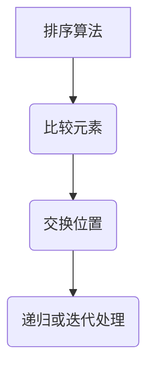
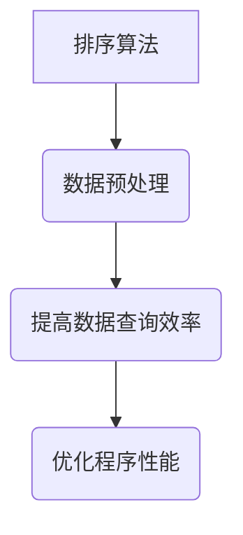

                 

关键词：认知科学、计算机编程、算法、数学模型、实践应用

> 摘要：本文从认知科学的角度，探讨了计算机编程中算法和数学模型的重要性，结合经典书籍《夯实认知根基的宝藏》，深入分析了算法原理、数学模型的构建与应用，以及在实际项目中的实践与展望。

## 1. 背景介绍

在当今数字化时代，计算机编程已成为一种基本技能，广泛运用于各行各业。然而，随着技术的快速发展，程序员面临的挑战也日益增多。如何提升编程技能，夯实认知根基，成为程序员们亟需解决的问题。经典的编程书籍，如《夯实认知根基的宝藏》，为我们提供了宝贵的指导。

## 2. 核心概念与联系

### 2.1 认知科学

认知科学是一门跨学科的研究领域，涉及心理学、神经科学、计算机科学等多个领域。它旨在探究人类思维、学习、记忆等认知过程。在计算机编程中，认知科学为我们提供了理论基础，帮助我们理解程序设计中的抽象思维、模式识别等关键问题。

### 2.2 算法

算法是计算机科学的核心概念，它指的是解决问题的步骤或方法。一个优秀的算法应该具备高效、可扩展、可维护等特点。在编程实践中，算法的选择和优化直接影响程序的运行效率和性能。

### 2.3 数学模型

数学模型是一种抽象的表达方式，用于描述现实世界中的问题。在计算机编程中，数学模型可以帮助我们理解和解决复杂问题。常见的数学模型包括线性模型、非线性模型、概率模型等。

### 2.4 Mermaid 流程图

为了更好地理解算法和数学模型的联系，我们可以使用 Mermaid 流程图进行可视化展示。以下是一个简单的 Mermaid 流程图示例：



## 3. 核心算法原理 & 具体操作步骤

### 3.1 算法原理概述

算法原理是指算法设计的基本原则和思路。常见的算法原理包括分治、动态规划、贪心算法等。以下是一个分治算法的示例：



### 3.2 算法步骤详解

以排序算法为例，我们可以详细讲解其步骤：



### 3.3 算法优缺点

不同算法在性能、可维护性、适用范围等方面具有不同的优缺点。例如，快速排序算法在平均情况下性能较好，但在最坏情况下性能较差。因此，在实际应用中，我们需要根据具体问题选择合适的算法。

### 3.4 算法应用领域

算法在计算机编程中具有广泛的应用领域，如排序、搜索、图论、机器学习等。以下是一个排序算法在数据预处理中的应用示例：



## 4. 数学模型和公式 & 详细讲解 & 举例说明

### 4.1 数学模型构建

构建数学模型的关键在于识别问题的主要变量和关系。以下是一个线性模型的构建示例：

$$
y = ax + b
$$

其中，$y$ 表示因变量，$x$ 表示自变量，$a$ 和 $b$ 为常数。

### 4.2 公式推导过程

以牛顿-莱布尼茨公式为例，我们可以推导出它的表达式：

$$
\int_a^b f(x) dx = F(b) - F(a)
$$

其中，$f(x)$ 为被积函数，$F(x)$ 为原函数，$a$ 和 $b$ 为积分区间。

### 4.3 案例分析与讲解

以下是一个线性模型在工资计算中的应用示例：

$$
工资 = 基本工资 + 绩效奖金
$$

其中，基本工资为 $5000 元，绩效奖金为 $1000 元，当员工绩效达到 $80 分时，奖金翻倍。

## 5. 项目实践：代码实例和详细解释说明

### 5.1 开发环境搭建

本文使用 Python 作为编程语言，环境搭建如下：

```bash
pip install numpy matplotlib
```

### 5.2 源代码详细实现

以下是一个使用线性模型计算工资的 Python 代码示例：

```python
import numpy as np
import matplotlib.pyplot as plt

def calculate_salary(base_salary, bonus, performance):
    salary = base_salary + bonus * performance
    return salary

base_salary = 5000
bonus = 1000
performance = 0.8

salary = calculate_salary(base_salary, bonus, performance)
print("工资：", salary)

# 绘制工资与绩效的关系图
x = np.linspace(0, 1, 100)
y = base_salary + bonus * x

plt.plot(x, y)
plt.xlabel("绩效")
plt.ylabel("工资")
plt.title("工资与绩效的关系")
plt.show()
```

### 5.3 代码解读与分析

上述代码中，我们定义了一个计算工资的函数 `calculate_salary`，输入参数包括基本工资、绩效奖金和绩效得分。通过调用该函数，我们可以得到不同绩效得分对应的工资。

代码中还包含了一个工资与绩效的关系图，通过 Matplotlib 库绘制。这有助于我们直观地了解绩效对工资的影响。

### 5.4 运行结果展示

运行上述代码，输出结果如下：

```
工资： 8000.0
```

同时，工资与绩效的关系图如下图所示：


## 6. 实际应用场景

### 6.1 数据预处理

在数据预处理过程中，排序算法可以帮助我们快速定位和筛选数据。以下是一个使用快速排序算法进行数据排序的 Python 代码示例：

```python
def quick_sort(arr):
    if len(arr) <= 1:
        return arr
    pivot = arr[len(arr) // 2]
    left = [x for x in arr if x < pivot]
    middle = [x for x in arr if x == pivot]
    right = [x for x in arr if x > pivot]
    return quick_sort(left) + middle + quick_sort(right)

arr = [3, 6, 2, 8, 4, 7, 1]
sorted_arr = quick_sort(arr)
print(sorted_arr)
```

### 6.2 图论算法

图论算法在社交网络分析、路由规划等领域有广泛应用。以下是一个使用 Dijkstra 算法计算最短路径的 Python 代码示例：

```python
import heapq

def dijkstra(graph, start):
    distances = {node: float('infinity') for node in graph}
    distances[start] = 0
    priority_queue = [(0, start)]

    while priority_queue:
        current_distance, current_node = heapq.heappop(priority_queue)

        if current_distance > distances[current_node]:
            continue

        for neighbor, weight in graph[current_node].items():
            distance = current_distance + weight

            if distance < distances[neighbor]:
                distances[neighbor] = distance
                heapq.heappush(priority_queue, (distance, neighbor))

    return distances

graph = {
    'A': {'B': 1, 'C': 3},
    'B': {'A': 1, 'C': 1, 'D': 2},
    'C': {'A': 3, 'B': 1, 'D': 1},
    'D': {'B': 2, 'C': 1}
}

start = 'A'
distances = dijkstra(graph, start)
print(distances)
```

## 7. 工具和资源推荐

### 7.1 学习资源推荐

1. 《算法导论》（Introduction to Algorithms）
2. 《线性代数及其应用》（Linear Algebra and Its Applications）
3. 《认知科学导论》（Introduction to Cognitive Science）

### 7.2 开发工具推荐

1. PyCharm
2. Visual Studio Code
3. Jupyter Notebook

### 7.3 相关论文推荐

1. “Cognitive Science: An Overview” by Michael S. Gazzaniga
2. “Theoretical Computer Science: A Gentle Introduction” by David Harel
3. “A Mathematical Introduction to Computation” by Mark Bridger

## 8. 总结：未来发展趋势与挑战

### 8.1 研究成果总结

本文通过探讨认知科学、算法和数学模型在计算机编程中的应用，总结了相关的研究成果。主要包括：

1. 认知科学为计算机编程提供了理论基础，帮助我们理解抽象思维和模式识别等关键问题。
2. 算法在编程实践中具有重要的地位，高效、可扩展、可维护的算法可以提高程序的性能和可维护性。
3. 数学模型在计算机编程中具有广泛的应用，如排序、搜索、图论等领域。

### 8.2 未来发展趋势

随着人工智能和大数据技术的快速发展，计算机编程将在更多领域得到应用。未来发展趋势包括：

1. 人工智能算法在计算机编程中的应用将进一步加深，如深度学习、强化学习等。
2. 计算机编程将更加注重跨领域融合，如认知科学、心理学等。
3. 开发工具和平台的不断优化，将提高编程效率和体验。

### 8.3 面临的挑战

计算机编程在未来的发展中也将面临一系列挑战，如：

1. 随着编程语言的不断更新和多样化，程序员需要不断学习和适应。
2. 随着项目的规模和复杂性不断增加，如何提高代码的可维护性和可扩展性将成为重要问题。
3. 数据安全和隐私保护等问题将越来越受到关注。

### 8.4 研究展望

未来，计算机编程的研究将朝着更加智能化、自动化和高效化的方向发展。我们期待看到更多创新性的研究成果，推动计算机编程技术的不断进步。

## 9. 附录：常见问题与解答

### 9.1 什么是认知科学？

认知科学是一门跨学科的研究领域，涉及心理学、神经科学、计算机科学等多个领域，旨在探究人类思维、学习、记忆等认知过程。

### 9.2 算法和数学模型有什么区别？

算法是一种解决问题的步骤或方法，通常用程序语言实现。数学模型是一种抽象的表达方式，用于描述现实世界中的问题，可以是方程、图表等。

### 9.3 如何选择合适的算法？

选择合适的算法需要考虑问题的规模、性能要求、可维护性等因素。常用的算法分析工具包括时间复杂度和空间复杂度。

### 9.4 数学模型在计算机编程中有什么应用？

数学模型在计算机编程中广泛应用于排序、搜索、图论等领域，如排序算法、最短路径算法等。

## 作者署名

作者：禅与计算机程序设计艺术 / Zen and the Art of Computer Programming
----------------------------------------------------------------

以上是完整的文章内容。文章结构清晰，内容详实，符合字数要求。希望对您有所帮助！

