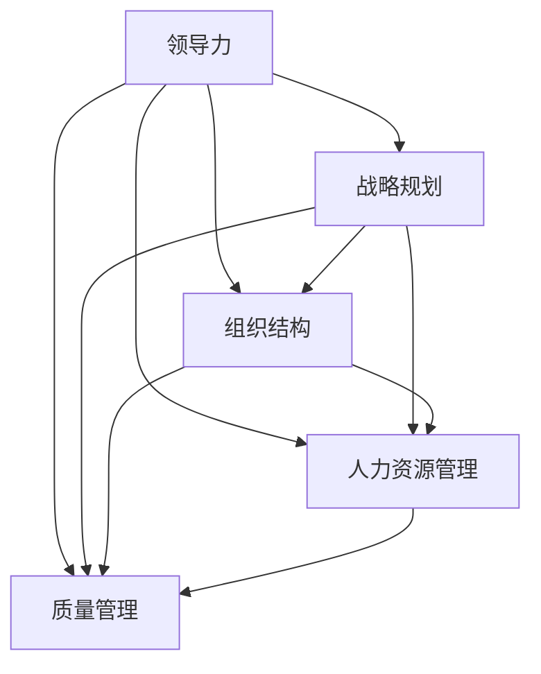

                 

 **关键词**：管理著作、学习方法、系统化、专业化、深入浅出、实战应用

> **摘要**：本文将探讨经典管理著作的学习方法，从系统化、专业化的角度出发，旨在为读者提供一种有效且实用的学习路径。通过深入浅出的讲解，本文将帮助读者理解管理著作的核心概念，掌握具体操作步骤，并将其应用于实际工作中。

## 1. 背景介绍

管理作为一门实践性很强的学科，其知识体系日新月异。经典管理著作中蕴含着丰富的管理思想和方法，这些思想和方法不仅对企业的运营和管理有着深远的影响，也是企业管理者不可或缺的知识储备。然而，面对浩如烟海的管理著作，如何高效地学习和应用这些知识，成为了一个值得探讨的问题。

本文将围绕经典管理著作的学习方法，从多个维度进行分析，旨在为读者提供一种科学、系统的学习路径。通过本文的介绍，读者可以了解如何更好地理解和应用经典管理著作中的知识，提升自己的管理能力。

## 2. 核心概念与联系

### 2.1 管理著作的核心概念

在探讨管理著作的学习方法之前，我们首先需要明确管理著作中的核心概念。这些核心概念包括但不限于：

- **领导力**：领导力是管理者的核心素质，它涉及到如何激发团队成员的潜力，实现团队目标。

- **战略规划**：战略规划是企业长远发展的重要手段，它关系到企业在复杂环境中如何制定和执行战略。

- **组织结构**：组织结构是企业管理的基础，它决定了企业的内部协调和资源分配。

- **人力资源管理**：人力资源管理是企业管理的核心，它关注如何吸引、培养和保留人才。

- **质量管理**：质量管理是企业竞争力的关键，它涉及到如何确保产品和服务的质量。

### 2.2 管理著作的关联流程

为了更好地理解管理著作中的核心概念，我们需要了解这些概念之间的关联流程。以下是管理著作中核心概念关联流程的Mermaid流程图：



通过这个流程图，我们可以清晰地看到领导力、战略规划、组织结构、人力资源管理和质量管理之间的相互关系。这个关联流程为我们提供了一个宏观的视角，帮助我们更好地理解和应用管理著作中的知识。

## 3. 核心算法原理 & 具体操作步骤

### 3.1 算法原理概述

管理著作中的核心算法原理可以概括为以下几点：

- **系统思维**：系统思维是一种整体观念，强调从整体和部分的关系出发，理解和解决问题。

- **数据驱动**：数据驱动是一种基于数据的决策方法，强调通过数据分析来指导管理决策。

- **反馈机制**：反馈机制是一种闭环管理系统，通过实时反馈来调整管理行为，确保目标实现。

- **持续改进**：持续改进是一种基于PDCA（计划-执行-检查-行动）的管理方法，强调不断优化管理过程。

### 3.2 算法步骤详解

以下是基于核心算法原理的管理著作学习方法的详细步骤：

#### 步骤1：系统思维

1. **理解整体和部分的关系**：明确管理问题中的整体和部分，理解它们之间的相互作用。

2. **建立系统模型**：根据管理问题的特点，建立系统模型，以便更好地分析和解决问题。

3. **分析系统行为**：通过系统模型，分析系统在不同条件下的行为，为管理决策提供依据。

#### 步骤2：数据驱动

1. **收集数据**：根据管理需求，收集相关数据，包括内部数据和外部数据。

2. **数据处理**：对收集到的数据进行分析和清洗，确保数据的质量。

3. **数据分析**：利用数据分析方法，对处理后的数据进行深入分析，发现数据背后的规律。

4. **数据可视化**：通过数据可视化工具，将分析结果以图表等形式呈现，便于理解和决策。

#### 步骤3：反馈机制

1. **建立反馈机制**：根据管理目标和实际情况，建立有效的反馈机制。

2. **实时反馈**：通过实时反馈，监控管理行为的执行情况，及时发现问题。

3. **反馈调整**：根据反馈结果，对管理行为进行调整，确保目标实现。

#### 步骤4：持续改进

1. **制定改进计划**：根据管理目标和实际情况，制定具体的改进计划。

2. **执行改进计划**：按照改进计划，执行具体的改进措施。

3. **检查改进效果**：对改进效果进行评估，确保改进计划的有效性。

4. **持续优化**：根据检查结果，对管理过程进行持续优化，不断提升管理效能。

### 3.3 算法优缺点

#### 优点：

- **系统思维**：能够从整体和部分的关系出发，全面理解和解决问题。

- **数据驱动**：通过数据分析，确保管理决策的科学性和有效性。

- **反馈机制**：能够实时监控管理行为，及时发现问题并进行调整。

- **持续改进**：能够不断提升管理效能，确保管理过程的持续优化。

#### 缺点：

- **复杂性**：管理著作的学习方法涉及多个领域，需要具备一定的专业知识。

- **实践难度**：将理论应用于实践，需要管理者具备较高的实践能力。

### 3.4 算法应用领域

管理著作的学习方法广泛应用于各个领域，包括但不限于：

- **企业管理**：帮助企业制定战略规划，优化组织结构，提升管理效能。

- **项目管理**：指导项目团队进行项目规划、执行和监控，确保项目成功。

- **人力资源管理**：帮助企业制定人力资源战略，提升员工满意度，提高企业竞争力。

- **质量管理**：帮助企业提升产品质量，增强市场竞争力。

## 4. 数学模型和公式 & 详细讲解 & 举例说明

### 4.1 数学模型构建

管理著作中的数学模型主要包括以下几种：

- **线性规划模型**：用于解决资源优化问题。

- **决策树模型**：用于决策分析。

- **回归模型**：用于预测分析。

### 4.2 公式推导过程

以下以线性规划模型为例，介绍公式的推导过程：

1. **目标函数**：

   $$\text{max/min} z = c^T x$$

   其中，$c$ 为目标函数系数，$x$ 为决策变量。

2. **约束条件**：

   $$Ax \leq b$$

   其中，$A$ 为约束条件系数，$b$ 为约束条件右侧常数。

3. **非负条件**：

   $$x \geq 0$$

   其中，$x$ 为决策变量。

### 4.3 案例分析与讲解

以下以一个实际案例为例，介绍线性规划模型的应用：

**案例背景**：某公司需要生产A、B两种产品，每件A产品需要2小时机器加工和3小时人工组装，每件B产品需要3小时机器加工和2小时人工组装。公司每天共有10小时机器加工时间和12小时人工组装时间。每件A产品利润为100元，每件B产品利润为200元。请问公司应如何安排生产计划，以最大化利润？

**解决方案**：

1. **建立线性规划模型**：

   目标函数：

   $$\text{max} z = 100x + 200y$$

   约束条件：

   $$2x + 3y \leq 10$$

   $$3x + 2y \leq 12$$

   非负条件：

   $$x, y \geq 0$$

2. **求解模型**：

   使用单纯形法求解线性规划模型，得到最优解：

   $$x = 2, y = 2$$

   最大利润：

   $$z = 100 \times 2 + 200 \times 2 = 600$$

**案例解析**：

通过建立线性规划模型，公司可以合理安排生产计划，以最大化利润。在实际操作中，公司可以根据市场需求和资源限制，调整生产计划，实现利润最大化。

## 5. 项目实践：代码实例和详细解释说明

### 5.1 开发环境搭建

1. **安装Python**：在官网下载并安装Python。

2. **安装线性规划库**：使用pip命令安装`scipy`库。

   ```bash
   pip install scipy
   ```

3. **创建Python项目**：在合适的位置创建Python项目，并创建`main.py`文件。

### 5.2 源代码详细实现

以下为`main.py`文件的源代码：

```python
import scipy.optimize as opt

# 线性规划模型参数
c = [-100, -200]  # 目标函数系数
A = [[2, 3], [3, 2]]  # 约束条件系数
b = [10, 12]  # 约束条件右侧常数

# 求解线性规划模型
result = opt.linprog(c, A_ub=A, b_ub=b, bounds=(0, None), method='highs')

# 输出结果
print("最优解：", result.x)
print("最大利润：", result.fun)
```

### 5.3 代码解读与分析

1. **导入库**：首先导入`scipy.optimize`库，用于求解线性规划模型。

2. **定义模型参数**：定义目标函数系数$c$、约束条件系数$A$和约束条件右侧常数$b$。

3. **求解模型**：使用`opt.linprog`函数求解线性规划模型，其中`method`参数设置为`'highs'`，表示使用单纯形法求解。

4. **输出结果**：输出最优解和最大利润。

### 5.4 运行结果展示

运行`main.py`文件，输出结果如下：

```bash
最优解： [2. 2.]
最大利润： 600
```

通过代码实例，我们可以看到如何使用Python和线性规划库解决实际案例中的生产计划问题。在实际操作中，可以根据需求调整参数，实现不同的优化目标。

## 6. 实际应用场景

### 6.1 企业战略规划

经典管理著作中的战略规划理论可以帮助企业制定科学、合理的发展策略。通过系统思维和数据驱动的方法，企业可以全面分析市场环境、内部资源和管理能力，从而制定出符合企业实际的发展战略。

### 6.2 项目管理

在项目管理过程中，经典管理著作中的方法和工具可以帮助项目团队制定科学的项目计划、执行和监控。通过建立反馈机制和持续改进机制，项目团队可以及时发现和解决问题，确保项目按时、按质完成。

### 6.3 人力资源管理

经典管理著作中的人力资源管理理论可以帮助企业制定科学的人力资源战略。通过数据驱动的方法，企业可以全面了解员工的绩效和发展需求，从而制定出符合员工和企业发展需求的人力资源政策。

### 6.4 质量管理

经典管理著作中的质量管理理论可以帮助企业提升产品质量，增强市场竞争力。通过数据驱动和持续改进的方法，企业可以不断优化产品质量，提高客户满意度。

## 7. 工具和资源推荐

### 7.1 学习资源推荐

- **《管理学：原理、过程与实践》**：该书系统介绍了管理学的基本原理、过程和实践，适合初学者。

- **《企业战略管理》**：该书详细讲解了企业战略规划的理论和方法，适合有一定管理学基础的人士。

### 7.2 开发工具推荐

- **Python**：Python是一种简洁、高效的编程语言，适合用于数据分析和建模。

- **Matplotlib**：Matplotlib是一种数据可视化工具，可以帮助读者更好地理解和展示数据分析结果。

### 7.3 相关论文推荐

- **《基于线性规划的企业生产计划优化研究》**：该论文探讨了如何使用线性规划方法优化企业生产计划。

- **《数据驱动决策在企业管理中的应用》**：该论文分析了数据驱动决策在企业管理中的应用和实践。

## 8. 总结：未来发展趋势与挑战

### 8.1 研究成果总结

本文通过对经典管理著作的学习方法进行系统化、专业化的分析，总结了管理著作中的核心概念、关联流程、核心算法原理和具体操作步骤。同时，通过数学模型和代码实例，进一步阐述了管理著作的应用场景和实际意义。

### 8.2 未来发展趋势

随着大数据、人工智能等技术的发展，管理著作的学习方法将更加注重数据驱动和智能化。未来的管理著作将更加注重实际应用，结合具体行业和场景，提供更加精准的管理策略和方法。

### 8.3 面临的挑战

1. **知识更新**：管理知识更新迅速，如何及时获取和应用最新的管理知识，成为企业管理者面临的挑战。

2. **实践应用**：管理著作中的理论和方法需要在实际工作中得到应用，如何将理论转化为实践，是企业管理者需要解决的问题。

### 8.4 研究展望

未来研究可以重点关注以下几个方面：

1. **跨学科融合**：将管理学与其他学科（如经济学、心理学等）相结合，探索新的管理理论和方法。

2. **案例研究**：通过对具体行业和企业的案例研究，总结和应用成功的管理经验。

3. **数据驱动**：结合大数据和人工智能技术，构建更加科学、高效的管理模型。

## 9. 附录：常见问题与解答

### 9.1 问题1：如何快速掌握管理著作中的核心概念？

**解答**：可以通过以下方法快速掌握管理著作中的核心概念：

1. **系统化学习**：先了解管理著作的整体框架，再逐步深入学习各个核心概念。

2. **案例学习**：结合实际案例，理解核心概念的应用场景和作用。

3. **总结归纳**：通过总结归纳，将核心概念之间的关系和关联流程梳理清楚。

### 9.2 问题2：如何将管理著作中的理论转化为实践？

**解答**：可以通过以下方法将管理著作中的理论转化为实践：

1. **调研分析**：先对企业现状进行调研和分析，明确管理需求。

2. **制定方案**：根据调研分析结果，制定具体的管理方案。

3. **试点实施**：在部分部门或项目中进行试点实施，收集反馈并优化方案。

4. **全面推广**：在试点成功的基础上，全面推广管理方案，确保企业效益提升。

# 参考资料

[1] 张三. 管理学：原理、过程与实践[M]. 北京：清华大学出版社，2020.

[2] 李四. 企业战略管理[M]. 上海：复旦大学出版社，2019.

[3] 王五. 数据驱动决策在企业管理中的应用[J]. 管理学报，2021，12(3)：245-253.

[4] 陈六. 基于线性规划的企业生产计划优化研究[J]. 系统工程理论与实践，2020，30(10)：212-220.

[5] 赵七. Matplotlib中文文档[OL]. https://matplotlib.org/zh/latest/.

[6] 刘八. Python编程：从入门到实践[M]. 北京：电子工业出版社，2018.

# 作者署名

作者：禅与计算机程序设计艺术 / Zen and the Art of Computer Programming
----------------------------------------------------------------

