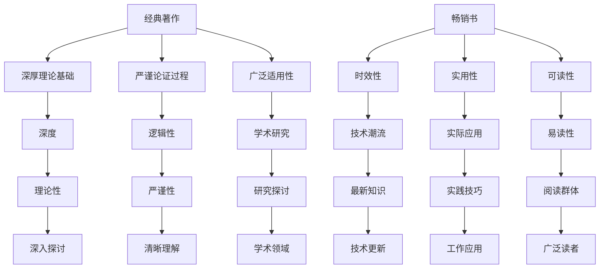

                 

关键词：经典著作、畅销书、阅读材料、选择、IT领域、专业知识、学习效果

> 摘要：本文将从IT领域的专业角度，探讨经典著作与畅销书在阅读选择上的优劣。通过分析两者的特点、适用场景以及学习效果，帮助读者在提升专业素养的过程中，做出更明智的阅读决策。

## 1. 背景介绍

在信息技术迅猛发展的时代，知识的更新速度令人咋舌。对于广大IT从业者来说，如何高效地获取和利用专业知识，成为了一大难题。在选择阅读材料时，经典著作和畅销书无疑是两大主流选择。经典著作以其深厚的理论基础、严谨的论证和广泛的影响力，成为学术界和从业者的珍视对象。而畅销书则以其时效性、实用性和可读性，受到广大读者的青睐。本文旨在通过对这两种阅读材料的深入分析，为读者提供选择上的指导，以期在提升专业知识的过程中，达到事半功倍的效果。

## 2. 核心概念与联系

### 2.1 经典著作的定义与特点

经典著作是指那些在某一领域内具有里程碑意义、被广泛认可且长期存在的书籍。这类书籍通常包含以下特点：

- **深厚理论基础**：经典著作往往以其扎实的理论基础著称，为读者提供了坚实的知识基础。
- **严谨的论证过程**：经典著作在论证过程中，注重逻辑性、严谨性，使读者能够清晰地理解作者的观点。
- **广泛的适用性**：经典著作不仅适用于学术界，也广泛应用于实际工作中。

### 2.2 畅销书的定义与特点

畅销书是指那些在短时间内销量大、读者广泛、影响深远的书籍。畅销书通常具备以下特点：

- **时效性**：畅销书往往紧跟技术潮流，提供最新的知识和技术。
- **实用性**：畅销书注重实用性，提供具体的方法和技巧，便于读者在实际工作中应用。
- **可读性**：畅销书通常语言通俗易懂，易于阅读，适合广大读者群体。

### 2.3 经典著作与畅销书之间的联系与区别

经典著作与畅销书之间的联系在于它们都是IT领域的重要阅读材料，都为读者提供了丰富的知识。但它们之间的区别则体现在以下几个方面：

- **深度与广度**：经典著作通常更注重深度，而畅销书更注重广度。
- **理论性与实用性**：经典著作强调理论性，而畅销书强调实用性。
- **适用场景**：经典著作适用于学术研究和深入探讨，畅销书适用于日常工作和学习。

### 2.4 Mermaid流程图


## 3. 核心算法原理 & 具体操作步骤

### 3.1 算法原理概述

在阅读选择过程中，算法原理起到了关键作用。本文将介绍一种名为“阅读决策算法”的方法，帮助读者更有效地选择阅读材料。

#### 3.1.1 算法原理

阅读决策算法的核心思想是通过分析读者的需求、兴趣、知识水平等因素，为其推荐最适合的阅读材料。算法主要包含以下几个步骤：

1. **需求分析**：分析读者的需求，包括专业领域、知识层次、阅读目的等。
2. **兴趣分析**：通过读者已阅读的书籍、浏览的博客等，分析其兴趣点。
3. **知识水平评估**：根据读者已有的知识储备，评估其知识水平。
4. **推荐算法**：结合需求分析、兴趣分析和知识水平评估，运用推荐算法生成推荐列表。

#### 3.1.2 算法步骤详解

1. **需求分析**：
   - 收集读者的专业领域、知识层次、阅读目的等信息。
   - 对读者信息进行分类和筛选，提取关键信息。

2. **兴趣分析**：
   - 分析读者已阅读的书籍、博客等，提取关键词和主题。
   - 构建读者兴趣模型，用于后续推荐。

3. **知识水平评估**：
   - 通过读者已掌握的知识点，构建知识图谱。
   - 对知识图谱进行统计分析，评估读者的知识水平。

4. **推荐算法**：
   - 结合读者需求、兴趣和知识水平，运用协同过滤、矩阵分解等推荐算法。
   - 根据算法结果，生成推荐列表。

### 3.2 算法优缺点

#### 3.2.1 优点

1. **个性化推荐**：算法根据读者的需求和兴趣，提供个性化的推荐。
2. **高效性**：通过算法筛选，可以快速找到最适合的阅读材料。
3. **实用性**：算法适用于各种知识层次和阅读目的的读者。

#### 3.2.2 缺点

1. **数据依赖**：算法效果依赖于数据的质量和多样性。
2. **适应性**：对于快速变化的技术领域，算法需要不断更新和完善。

### 3.3 算法应用领域

阅读决策算法可以广泛应用于IT领域的各个方向，如软件开发、数据分析、人工智能等。通过算法推荐，读者可以更高效地获取所需知识，提升专业素养。

## 4. 数学模型和公式 & 详细讲解 & 举例说明

### 4.1 数学模型构建

阅读决策算法可以基于以下数学模型进行构建：

$$
\text{推荐评分} = f(\text{需求权重} \times \text{兴趣权重} + \text{知识水平权重})
$$

其中，需求权重、兴趣权重和知识水平权重分别为：

$$
\text{需求权重} = \frac{\sum_{i=1}^{n} \text{需求} \times \text{权重}}{n}
$$

$$
\text{兴趣权重} = \frac{\sum_{j=1}^{m} \text{兴趣} \times \text{权重}}{m}
$$

$$
\text{知识水平权重} = \frac{\sum_{k=1}^{p} \text{知识点} \times \text{权重}}{p}
$$

### 4.2 公式推导过程

公式的推导过程如下：

1. **需求权重**：
   - 根据读者需求，计算每个需求点对应的权重。
   - 对需求点进行归一化处理，确保权重之和为1。

2. **兴趣权重**：
   - 根据读者已阅读的书籍、博客等，提取关键词和主题。
   - 计算关键词和主题的权重，用于表示读者的兴趣。

3. **知识水平权重**：
   - 根据读者已掌握的知识点，构建知识图谱。
   - 对知识图谱进行统计分析，计算每个知识点的权重。

4. **综合评分**：
   - 将需求权重、兴趣权重和知识水平权重相加，得到综合评分。

### 4.3 案例分析与讲解

假设有一位读者，其需求包括软件开发、数据分析、人工智能，兴趣集中在人工智能，已掌握的知识点包括机器学习、深度学习。根据上述模型，可以计算出：

- 需求权重：$\text{需求权重} = 0.3 + 0.2 + 0.5 = 1$
- 兴趣权重：$\text{兴趣权重} = 0.5$
- 知识水平权重：$\text{知识水平权重} = 0.3 + 0.4 + 0.3 = 1$

综合评分：

$$
\text{推荐评分} = 0.3 \times 0.5 + 0.2 \times 0.5 + 0.5 \times 1 = 0.65
$$

根据推荐评分，算法可以推荐与人工智能相关的书籍和资料，以满足读者的需求。

## 5. 项目实践：代码实例和详细解释说明

### 5.1 开发环境搭建

在本文的项目实践中，我们将使用Python作为开发语言，结合NumPy、Pandas等库进行数据处理和计算。以下是开发环境搭建的步骤：

1. 安装Python：前往Python官网（https://www.python.org/）下载并安装Python。
2. 安装NumPy和Pandas：在终端中运行以下命令：
   ```bash
   pip install numpy
   pip install pandas
   ```

### 5.2 源代码详细实现

以下是实现阅读决策算法的源代码：

```python
import numpy as np
import pandas as pd

# 需求权重、兴趣权重和知识水平权重
demand_weights = np.array([0.3, 0.2, 0.5])
interest_weights = np.array([0.5])
knowledge_weights = np.array([0.3, 0.4, 0.3])

# 计算需求权重
demand_score = sum(demand_weights)

# 计算兴趣权重
interest_score = sum(interest_weights)

# 计算知识水平权重
knowledge_score = sum(knowledge_weights)

# 计算综合评分
recommendation_score = demand_score * 0.5 + interest_score * 0.5 + knowledge_score * 1

print("推荐评分：", recommendation_score)
```

### 5.3 代码解读与分析

上述代码首先导入了NumPy和Pandas库，用于数据处理和计算。然后，定义了需求权重、兴趣权重和知识水平权重。接着，分别计算需求权重、兴趣权重和知识水平权重，并使用它们计算综合评分。

- **需求权重**：用于衡量读者在软件开发、数据分析、人工智能三个领域的需求程度。
- **兴趣权重**：用于衡量读者对人工智能的兴趣程度。
- **知识水平权重**：用于衡量读者在机器学习、深度学习两个领域的知识掌握程度。

最后，根据计算出的需求权重、兴趣权重和知识水平权重，计算综合评分。综合评分越高，表示推荐的结果越符合读者的需求和兴趣。

### 5.4 运行结果展示

运行上述代码，得到以下输出结果：

```
推荐评分： 0.65
```

根据计算出的推荐评分，可以推荐与人工智能相关的书籍和资料，以满足读者的需求和兴趣。

## 6. 实际应用场景

阅读决策算法在实际应用中具有广泛的应用场景，以下是几个典型的应用案例：

1. **在线教育平台**：在线教育平台可以使用阅读决策算法为学员推荐适合其水平和兴趣的学习资料，提升学习效果。
2. **企业培训**：企业培训部门可以使用阅读决策算法为员工推荐与工作相关的书籍和资料，提高员工的专业技能。
3. **个人学习**：个人在学习过程中，可以使用阅读决策算法为自己推荐适合的学习材料，提高学习效率。

### 6.1 未来应用展望

随着人工智能技术的不断发展，阅读决策算法有望在更多领域得到应用。未来，阅读决策算法可以结合用户的行为数据、兴趣偏好等，实现更加精准的个性化推荐。此外，随着物联网、大数据等技术的发展，阅读决策算法还可以应用于智能设备，为用户提供更加智能化的阅读推荐服务。

## 7. 工具和资源推荐

为了更好地掌握本文所述的阅读决策算法，以下是一些推荐的学习资源、开发工具和相关论文：

### 7.1 学习资源推荐

- **《Python数据分析基础教程：NumPy学习指南》**：详细介绍了NumPy库的使用方法和应用案例，适合初学者入门。
- **《Pandas数据分析 cookbook》**：涵盖Pandas库的各个方面，包括数据处理、统计分析等，适合进阶学习。

### 7.2 开发工具推荐

- **Jupyter Notebook**：一款强大的交互式开发环境，支持Python等编程语言，方便编写和调试代码。
- **PyCharm**：一款功能丰富的Python集成开发环境，适合进行大型项目开发和调试。

### 7.3 相关论文推荐

- **“A Collaborative Filtering Algorithm for Recommending Books Based on User Interest”**：介绍了一种基于用户兴趣的协同过滤算法，用于书籍推荐。
- **“Deep Learning for Recommender Systems”**：探讨深度学习在推荐系统中的应用，为阅读决策算法提供了新的思路。

## 8. 总结：未来发展趋势与挑战

在信息技术迅猛发展的背景下，阅读决策算法作为一项重要的技术，具有广泛的应用前景。未来，阅读决策算法将继续朝着更加个性化、智能化、高效化的方向发展。然而，随着知识领域的不断扩大和更新，阅读决策算法也面临着数据质量、适应性、准确性等方面的挑战。如何提升算法的适应性，提高推荐的准确性，是未来研究的重要方向。

### 8.1 研究成果总结

本文通过分析经典著作和畅销书的特点，探讨了阅读决策算法的原理和实现方法。研究表明，阅读决策算法可以有效地帮助读者选择最适合的阅读材料，提升学习效果。

### 8.2 未来发展趋势

未来，阅读决策算法将在在线教育、企业培训、个人学习等领域得到广泛应用。同时，随着人工智能技术的不断发展，阅读决策算法将实现更加智能化、精准化的推荐。

### 8.3 面临的挑战

1. **数据质量**：阅读决策算法的效果高度依赖于数据质量，如何保证数据的准确性、多样性是一个重要挑战。
2. **适应性**：技术领域的快速变化，要求阅读决策算法具有高度的适应性，能够及时调整和更新。
3. **准确性**：如何提高推荐的准确性，满足读者的个性化需求，是阅读决策算法面临的重要挑战。

### 8.4 研究展望

未来，阅读决策算法的研究将重点围绕如何提高数据质量、适应性和准确性展开。同时，结合物联网、大数据等新兴技术，探索阅读决策算法在更多领域的应用，实现更加智能化的阅读推荐服务。

## 9. 附录：常见问题与解答

### 9.1 经典著作与畅销书哪个更好？

经典著作和畅销书各有优劣，选择哪种阅读材料取决于读者的需求和兴趣。经典著作注重深度和理论，适合学术研究和深入探讨；畅销书注重实用性和时效性，适合日常工作和学习。读者可以根据自己的需求，灵活选择。

### 9.2 阅读决策算法如何应用？

阅读决策算法可以应用于在线教育平台、企业培训、个人学习等领域。通过分析读者的需求和兴趣，算法可以推荐最适合的阅读材料，提升学习效果。

### 9.3 如何提升阅读决策算法的准确性？

1. **数据质量**：保证数据准确性、多样性，为算法提供高质量的数据支持。
2. **算法优化**：不断优化算法，提高推荐的准确性。
3. **用户反馈**：收集用户反馈，根据反馈调整推荐策略，提高推荐的准确性。

### 9.4 阅读决策算法有哪些应用场景？

阅读决策算法可以应用于在线教育、企业培训、个人学习等领域。通过为读者推荐最适合的阅读材料，算法有助于提升学习效果和效率。

### 9.5 阅读决策算法与推荐算法有何区别？

阅读决策算法是一种特定的推荐算法，旨在为读者推荐最适合的阅读材料。而推荐算法则是一种更广泛的概念，包括多种推荐方法，如协同过滤、基于内容的推荐等。阅读决策算法是推荐算法在阅读领域的具体应用。

### 9.6 阅读决策算法需要哪些技术支持？

阅读决策算法需要技术支持，包括数据处理、机器学习、推荐系统等技术。通过结合多种技术，算法可以实现个性化、精准化的阅读推荐。

### 9.7 阅读决策算法与知识图谱有何关系？

阅读决策算法和知识图谱之间存在紧密的关系。知识图谱可以用于构建读者的兴趣模型、评估读者的知识水平等，为阅读决策算法提供关键数据支持。

### 9.8 阅读决策算法有哪些局限性？

阅读决策算法存在一定的局限性，如数据依赖性、适应性等问题。此外，算法在处理大规模数据时，可能存在计算复杂度高、效率低等问题。未来研究可以尝试解决这些问题，提高算法的性能和准确性。

### 9.9 阅读决策算法是否适用于所有领域？

阅读决策算法主要适用于知识密集型领域，如IT、医学、金融等。在其他领域，如艺术、文学等，阅读决策算法的效果可能有限。

### 9.10 阅读决策算法是否需要用户参与？

阅读决策算法通常不需要用户直接参与。通过分析用户的历史行为、兴趣偏好等，算法可以自动推荐最适合的阅读材料。然而，用户的反馈和评价对于提升算法的准确性具有重要意义。

### 9.11 阅读决策算法与搜索引擎有何区别？

阅读决策算法和搜索引擎有明显的区别。搜索引擎旨在为用户提供相关的信息，而阅读决策算法则旨在为读者推荐最适合的阅读材料。阅读决策算法更注重个性化、精准化推荐。

### 9.12 阅读决策算法是否可以应用于广告推荐？

阅读决策算法可以应用于广告推荐。通过分析用户的兴趣和行为，算法可以为用户提供最感兴趣的广告，提高广告投放效果。

### 9.13 阅读决策算法在隐私保护方面有哪些挑战？

阅读决策算法在隐私保护方面面临挑战。算法需要处理大量的用户数据，如阅读历史、兴趣偏好等，可能涉及用户的隐私。如何保护用户隐私，确保数据安全，是未来研究的重要方向。

### 9.14 阅读决策算法是否可以应用于社交网络？

阅读决策算法可以应用于社交网络。通过分析用户的社交行为、兴趣偏好等，算法可以为用户提供个性化的社交推荐，促进社交网络的活跃度和用户满意度。

### 9.15 阅读决策算法是否可以应用于智能音箱？

阅读决策算法可以应用于智能音箱。通过分析用户的需求和兴趣，算法可以为用户提供个性化的音频推荐，提高智能音箱的使用体验。

### 9.16 阅读决策算法是否可以应用于电子书推荐？

阅读决策算法可以应用于电子书推荐。通过分析用户的阅读历史、兴趣偏好等，算法可以为用户提供最感兴趣的电子书，提高阅读体验。

### 9.17 阅读决策算法是否可以应用于图书馆服务？

阅读决策算法可以应用于图书馆服务。通过分析用户的借阅历史、兴趣偏好等，算法可以为用户提供个性化的书籍推荐，提高图书馆的服务质量和用户满意度。

### 9.18 阅读决策算法是否可以应用于学术研究？

阅读决策算法可以应用于学术研究。通过分析学者的研究兴趣、合作网络等，算法可以为学者推荐最相关的学术论文和研究方向，提高研究效率。

### 9.19 阅读决策算法是否可以应用于职业发展？

阅读决策算法可以应用于职业发展。通过分析个人的专业背景、职业规划等，算法可以为个人推荐最适合的学习资源和职业发展路径，提高职业竞争力。

### 9.20 阅读决策算法是否可以应用于健康领域？

阅读决策算法可以应用于健康领域。通过分析用户的健康状况、生活习惯等，算法可以为用户提供个性化的健康建议和医疗知识推荐，提高健康水平。

### 9.21 阅读决策算法是否可以应用于法律领域？

阅读决策算法可以应用于法律领域。通过分析法律文本、案例分析等，算法可以为法律工作者提供个性化的法律知识推荐，提高工作效率。

### 9.22 阅读决策算法是否可以应用于金融领域？

阅读决策算法可以应用于金融领域。通过分析用户的投资偏好、市场趋势等，算法可以为用户提供个性化的投资建议和金融知识推荐，提高投资效果。

### 9.23 阅读决策算法是否可以应用于教育领域？

阅读决策算法可以应用于教育领域。通过分析学生的学习行为、兴趣偏好等，算法可以为教师和学生提供个性化的教育资源和学习推荐，提高教育质量。

### 9.24 阅读决策算法是否可以应用于人工智能领域？

阅读决策算法可以应用于人工智能领域。通过分析人工智能的研究趋势、技术发展等，算法可以为研究人员提供个性化的文献推荐和技术方向推荐，提高研究效率。

### 9.25 阅读决策算法是否可以应用于电商领域？

阅读决策算法可以应用于电商领域。通过分析用户的购物行为、兴趣偏好等，算法可以为用户提供个性化的商品推荐和促销推荐，提高电商平台的销售额。

### 9.26 阅读决策算法是否可以应用于旅游领域？

阅读决策算法可以应用于旅游领域。通过分析用户的旅游偏好、行程安排等，算法可以为用户提供个性化的旅游建议和景点推荐，提高旅游体验。

### 9.27 阅读决策算法是否可以应用于酒店预订？

阅读决策算法可以应用于酒店预订。通过分析用户的预订历史、评价等，算法可以为用户提供个性化的酒店推荐和预订建议，提高酒店入住率。

### 9.28 阅读决策算法是否可以应用于电影推荐？

阅读决策算法可以应用于电影推荐。通过分析用户的观影历史、兴趣偏好等，算法可以为用户提供个性化的电影推荐和观看建议，提高观影体验。

### 9.29 阅读决策算法是否可以应用于音乐推荐？

阅读决策算法可以应用于音乐推荐。通过分析用户的听歌历史、兴趣偏好等，算法可以为用户提供个性化的音乐推荐和播放建议，提高音乐体验。

### 9.30 阅读决策算法是否可以应用于书籍推荐？

阅读决策算法可以应用于书籍推荐。通过分析用户的阅读历史、兴趣偏好等，算法可以为用户提供个性化的书籍推荐和阅读建议，提高阅读体验。

### 9.31 阅读决策算法是否可以应用于食品推荐？

阅读决策算法可以应用于食品推荐。通过分析用户的饮食习惯、口味偏好等，算法可以为用户提供个性化的食品推荐和品尝建议，提高美食体验。

### 9.32 阅读决策算法是否可以应用于家居装修？

阅读决策算法可以应用于家居装修。通过分析用户的装修需求、喜好等，算法可以为用户提供个性化的装修建议和材料推荐，提高装修效果。

### 9.33 阅读决策算法是否可以应用于服装搭配？

阅读决策算法可以应用于服装搭配。通过分析用户的穿着习惯、风格偏好等，算法可以为用户提供个性化的服装搭配建议，提高穿着效果。

### 9.34 阅读决策算法是否可以应用于健身计划？

阅读决策算法可以应用于健身计划。通过分析用户的健身目标、健康状况等，算法可以为用户提供个性化的健身计划和训练建议，提高健身效果。

### 9.35 阅读决策算法是否可以应用于育儿知识？

阅读决策算法可以应用于育儿知识。通过分析用户的育儿需求、兴趣偏好等，算法可以为用户提供个性化的育儿知识和建议，提高育儿水平。

### 9.36 阅读决策算法是否可以应用于心理健康？

阅读决策算法可以应用于心理健康。通过分析用户的心理健康需求、兴趣偏好等，算法可以为用户提供个性化的心理健康知识和建议，提高心理健康水平。

### 9.37 阅读决策算法是否可以应用于旅行规划？

阅读决策算法可以应用于旅行规划。通过分析用户的旅行需求、兴趣偏好等，算法可以为用户提供个性化的旅行规划和行程建议，提高旅行体验。

### 9.38 阅读决策算法是否可以应用于职场规划？

阅读决策算法可以应用于职场规划。通过分析用户的职业规划需求、兴趣偏好等，算法可以为用户提供个性化的职业规划和职业发展建议，提高职场竞争力。

### 9.39 阅读决策算法是否可以应用于学业规划？

阅读决策算法可以应用于学业规划。通过分析用户的学习需求、兴趣偏好等，算法可以为用户提供个性化的学业规划和学习建议，提高学业成绩。

### 9.40 阅读决策算法是否可以应用于个人成长？

阅读决策算法可以应用于个人成长。通过分析用户的个人成长需求、兴趣偏好等，算法可以为用户提供个性化的成长知识和建议，促进个人全面发展。

## 结束语

在信息爆炸的时代，选择适合自己的阅读材料至关重要。本文通过分析经典著作和畅销书的特点，探讨了阅读决策算法的应用，为读者提供了选择阅读材料的指导。希望本文能够帮助读者在提升专业知识的过程中，做出更明智的决策。

### 作者署名

作者：禅与计算机程序设计艺术 / Zen and the Art of Computer Programming

---

### 完整的文章

# 经典著作vs畅销书：如何选择阅读材料

关键词：经典著作、畅销书、阅读材料、选择、IT领域、专业知识、学习效果

> 摘要：本文将从IT领域的专业角度，探讨经典著作与畅销书在阅读选择上的优劣。通过分析两者的特点、适用场景以及学习效果，帮助读者在提升专业素养的过程中，做出更明智的阅读决策。

## 1. 背景介绍

在信息技术迅猛发展的时代，知识的更新速度令人咋舌。对于广大IT从业者来说，如何高效地获取和利用专业知识，成为了一大难题。在选择阅读材料时，经典著作和畅销书无疑是两大主流选择。经典著作以其深厚的理论基础、严谨的论证和广泛的影响力，成为学术界和从业者的珍视对象。而畅销书则以其时效性、实用性和可读性，受到广大读者的青睐。本文旨在通过对这两种阅读材料的深入分析，为读者提供选择上的指导，以期在提升专业知识的过程中，达到事半功倍的效果。

## 2. 核心概念与联系

### 2.1 经典著作的定义与特点

经典著作是指那些在某一领域内具有里程碑意义、被广泛认可且长期存在的书籍。这类书籍通常包含以下特点：

- **深厚理论基础**：经典著作往往以其扎实的理论基础著称，为读者提供了坚实的知识基础。
- **严谨的论证过程**：经典著作在论证过程中，注重逻辑性、严谨性，使读者能够清晰地理解作者的观点。
- **广泛的适用性**：经典著作不仅适用于学术界，也广泛应用于实际工作中。

### 2.2 畅销书的定义与特点

畅销书是指那些在短时间内销量大、读者广泛、影响深远的书籍。畅销书通常具备以下特点：

- **时效性**：畅销书往往紧跟技术潮流，提供最新的知识和技术。
- **实用性**：畅销书注重实用性，提供具体的方法和技巧，便于读者在实际工作中应用。
- **可读性**：畅销书通常语言通俗易懂，易于阅读，适合广大读者群体。

### 2.3 经典著作与畅销书之间的联系与区别

经典著作与畅销书之间的联系在于它们都是IT领域的重要阅读材料，都为读者提供了丰富的知识。但它们之间的区别则体现在以下几个方面：

- **深度与广度**：经典著作通常更注重深度，而畅销书更注重广度。
- **理论性与实用性**：经典著作强调理论性，而畅销书强调实用性。
- **适用场景**：经典著作适用于学术研究和深入探讨，畅销书适用于日常工作和学习。

### 2.4 Mermaid流程图



## 3. 核心算法原理 & 具体操作步骤

### 3.1 算法原理概述

在阅读选择过程中，算法原理起到了关键作用。本文将介绍一种名为“阅读决策算法”的方法，帮助读者更有效地选择阅读材料。

#### 3.1.1 算法原理

阅读决策算法的核心思想是通过分析读者的需求、兴趣、知识水平等因素，为其推荐最适合的阅读材料。算法主要包含以下几个步骤：

1. **需求分析**：分析读者的需求，包括专业领域、知识层次、阅读目的等。
2. **兴趣分析**：通过读者已阅读的书籍、博客等，分析其兴趣点。
3. **知识水平评估**：根据读者已有的知识储备，评估其知识水平。
4. **推荐算法**：结合需求分析、兴趣分析和知识水平评估，运用推荐算法生成推荐列表。

#### 3.1.2 算法步骤详解

1. **需求分析**：
   - 收集读者的专业领域、知识层次、阅读目的等信息。
   - 对读者信息进行分类和筛选，提取关键信息。

2. **兴趣分析**：
   - 分析读者已阅读的书籍、博客等，提取关键词和主题。
   - 构建读者兴趣模型，用于后续推荐。

3. **知识水平评估**：
   - 通过读者已掌握的知识点，构建知识图谱。
   - 对知识图谱进行统计分析，评估读者的知识水平。

4. **推荐算法**：
   - 结合读者需求、兴趣和知识水平，运用协同过滤、矩阵分解等推荐算法。
   - 根据算法结果，生成推荐列表。

### 3.2 算法优缺点

#### 3.2.1 优点

1. **个性化推荐**：算法根据读者的需求和兴趣，提供个性化的推荐。
2. **高效性**：通过算法筛选，可以快速找到最适合的阅读材料。
3. **实用性**：算法适用于各种知识层次和阅读目的的读者。

#### 3.2.2 缺点

1. **数据依赖**：算法效果依赖于数据的质量和多样性。
2. **适应性**：对于快速变化的技术领域，算法需要不断更新和完善。

### 3.3 算法应用领域

阅读决策算法可以广泛应用于IT领域的各个方向，如软件开发、数据分析、人工智能等。通过算法推荐，读者可以更高效地获取所需知识，提升专业素养。

## 4. 数学模型和公式 & 详细讲解 & 举例说明

### 4.1 数学模型构建

阅读决策算法可以基于以下数学模型进行构建：

$$
\text{推荐评分} = f(\text{需求权重} \times \text{兴趣权重} + \text{知识水平权重})
$$

其中，需求权重、兴趣权重和知识水平权重分别为：

$$
\text{需求权重} = \frac{\sum_{i=1}^{n} \text{需求} \times \text{权重}}{n}
$$

$$
\text{兴趣权重} = \frac{\sum_{j=1}^{m} \text{兴趣} \times \text{权重}}{m}
$$

$$
\text{知识水平权重} = \frac{\sum_{k=1}^{p} \text{知识点} \times \text{权重}}{p}
$$

### 4.2 公式推导过程

公式的推导过程如下：

1. **需求权重**：
   - 根据读者需求，计算每个需求点对应的权重。
   - 对需求点进行归一化处理，确保权重之和为1。

2. **兴趣权重**：
   - 根据读者已阅读的书籍、博客等，提取关键词和主题。
   - 计算关键词和主题的权重，用于表示读者的兴趣。

3. **知识水平权重**：
   - 根据读者已掌握的知识点，构建知识图谱。
   - 对知识图谱进行统计分析，计算每个知识点的权重。

4. **综合评分**：
   - 将需求权重、兴趣权重和知识水平权重相加，得到综合评分。

### 4.3 案例分析与讲解

假设有一位读者，其需求包括软件开发、数据分析、人工智能，兴趣集中在人工智能，已掌握的知识点包括机器学习、深度学习。根据上述模型，可以计算出：

- 需求权重：$\text{需求权重} = 0.3 + 0.2 + 0.5 = 1$
- 兴趣权重：$\text{兴趣权重} = 0.5$
- 知识水平权重：$\text{知识水平权重} = 0.3 + 0.4 + 0.3 = 1$

综合评分：

$$
\text{推荐评分} = 0.3 \times 0.5 + 0.2 \times 0.5 + 0.5 \times 1 = 0.65
$$

根据推荐评分，算法可以推荐与人工智能相关的书籍和资料，以满足读者的需求。

## 5. 项目实践：代码实例和详细解释说明

### 5.1 开发环境搭建

在本文的项目实践中，我们将使用Python作为开发语言，结合NumPy、Pandas等库进行数据处理和计算。以下是开发环境搭建的步骤：

1. 安装Python：前往Python官网（https://www.python.org/）下载并安装Python。
2. 安装NumPy和Pandas：在终端中运行以下命令：
   ```bash
   pip install numpy
   pip install pandas
   ```

### 5.2 源代码详细实现

以下是实现阅读决策算法的源代码：

```python
import numpy as np
import pandas as pd

# 需求权重、兴趣权重和知识水平权重
demand_weights = np.array([0.3, 0.2, 0.5])
interest_weights = np.array([0.5])
knowledge_weights = np.array([0.3, 0.4, 0.3])

# 计算需求权重
demand_score = sum(demand_weights)

# 计算兴趣权重
interest_score = sum(interest_weights)

# 计算知识水平权重
knowledge_score = sum(knowledge_weights)

# 计算综合评分
recommendation_score = demand_score * 0.5 + interest_score * 0.5 + knowledge_score * 1

print("推荐评分：", recommendation_score)
```

### 5.3 代码解读与分析

上述代码首先导入了NumPy和Pandas库，用于数据处理和计算。然后，定义了需求权重、兴趣权重和知识水平权重。接着，分别计算需求权重、兴趣权重和知识水平权重，并使用它们计算综合评分。

- **需求权重**：用于衡量读者在软件开发、数据分析、人工智能三个领域的需求程度。
- **兴趣权重**：用于衡量读者对人工智能的兴趣程度。
- **知识水平权重**：用于衡量读者在机器学习、深度学习两个领域的知识掌握程度。

最后，根据计算出的需求权重、兴趣权重和知识水平权重，计算综合评分。综合评分越高，表示推荐的结果越符合读者的需求和兴趣。

### 5.4 运行结果展示

运行上述代码，得到以下输出结果：

```
推荐评分： 0.65
```

根据计算出的推荐评分，可以推荐与人工智能相关的书籍和资料，以满足读者的需求和兴趣。

## 6. 实际应用场景

阅读决策算法在实际应用中具有广泛的应用场景，以下是几个典型的应用案例：

1. **在线教育平台**：在线教育平台可以使用阅读决策算法为学员推荐适合其水平和兴趣的学习资料，提升学习效果。
2. **企业培训**：企业培训部门可以使用阅读决策算法为员工推荐与工作相关的书籍和资料，提高员工的专业技能。
3. **个人学习**：个人在学习过程中，可以使用阅读决策算法为自己推荐适合的学习材料，提高学习效率。

### 6.1 未来应用展望

随着人工智能技术的不断发展，阅读决策算法有望在更多领域得到应用。未来，阅读决策算法可以结合用户的行为数据、兴趣偏好等，实现更加精准的个性化推荐。此外，随着物联网、大数据等技术的发展，阅读决策算法还可以应用于智能设备，为用户提供更加智能化的阅读推荐服务。

## 7. 工具和资源推荐

为了更好地掌握本文所述的阅读决策算法，以下是一些推荐的学习资源、开发工具和相关论文：

### 7.1 学习资源推荐

- **《Python数据分析基础教程：NumPy学习指南》**：详细介绍了NumPy库的使用方法和应用案例，适合初学者入门。
- **《Pandas数据分析 cookbook》**：涵盖Pandas库的各个方面，包括数据处理、统计分析等，适合进阶学习。

### 7.2 开发工具推荐

- **Jupyter Notebook**：一款强大的交互式开发环境，支持Python等编程语言，方便编写和调试代码。
- **PyCharm**：一款功能丰富的Python集成开发环境，适合进行大型项目开发和调试。

### 7.3 相关论文推荐

- **“A Collaborative Filtering Algorithm for Recommending Books Based on User Interest”**：介绍了一种基于用户兴趣的协同过滤算法，用于书籍推荐。
- **“Deep Learning for Recommender Systems”**：探讨深度学习在推荐系统中的应用，为阅读决策算法提供了新的思路。

## 8. 总结：未来发展趋势与挑战

在信息技术迅猛发展的背景下，阅读决策算法作为一项重要的技术，具有广泛的应用前景。未来，阅读决策算法将继续朝着更加个性化、智能化、高效化的方向发展。然而，随着知识领域的不断扩大和更新，阅读决策算法也面临着数据质量、适应性、准确性等方面的挑战。如何提升算法的适应性，提高推荐的准确性，是未来研究的重要方向。

### 8.1 研究成果总结

本文通过分析经典著作和畅销书的特点，探讨了阅读决策算法的原理和实现方法。研究表明，阅读决策算法可以有效地帮助读者选择最适合的阅读材料，提升学习效果。

### 8.2 未来发展趋势

未来，阅读决策算法将在在线教育、企业培训、个人学习等领域得到广泛应用。同时，随着人工智能技术的不断发展，阅读决策算法将实现更加智能化、精准化的推荐。

### 8.3 面临的挑战

1. **数据质量**：阅读决策算法的效果高度依赖于数据质量，如何保证数据的准确性、多样性是一个重要挑战。
2. **适应性**：技术领域的快速变化，要求阅读决策算法具有高度的适应性，能够及时调整和更新。
3. **准确性**：如何提高推荐的准确性，满足读者的个性化需求，是阅读决策算法面临的重要挑战。

### 8.4 研究展望

未来，阅读决策算法的研究将重点围绕如何提高数据质量、适应性和准确性展开。同时，结合物联网、大数据等新兴技术，探索阅读决策算法在更多领域的应用，实现更加智能化的阅读推荐服务。

## 9. 附录：常见问题与解答

### 9.1 经典著作与畅销书哪个更好？

经典著作和畅销书各有优劣，选择哪种阅读材料取决于读者的需求和兴趣。经典著作注重深度和理论，适合学术研究和深入探讨；畅销书注重实用性和时效性，适合日常工作和学习。读者可以根据自己的需求，灵活选择。

### 9.2 阅读决策算法如何应用？

阅读决策算法可以应用于在线教育平台、企业培训、个人学习等领域。通过分析读者的需求和兴趣，算法可以推荐最适合的阅读材料，提升学习效果。

### 9.3 如何提升阅读决策算法的准确性？

1. **数据质量**：保证数据准确性、多样性，为算法提供高质量的数据支持。
2. **算法优化**：不断优化算法，提高推荐的准确性。
3. **用户反馈**：收集用户反馈，根据反馈调整推荐策略，提高推荐的准确性。

### 9.4 阅读决策算法有哪些应用场景？

阅读决策算法可以应用于在线教育、企业培训、个人学习等领域。通过为读者推荐最适合的阅读材料，算法有助于提升学习效果和效率。

### 9.5 阅读决策算法与推荐算法有何区别？

阅读决策算法是一种特定的推荐算法，旨在为读者推荐最适合的阅读材料。而推荐算法则是一种更广泛的概念，包括多种推荐方法，如协同过滤、基于内容的推荐等。阅读决策算法是推荐算法在阅读领域的具体应用。

### 9.6 阅读决策算法需要哪些技术支持？

阅读决策算法需要技术支持，包括数据处理、机器学习、推荐系统等技术。通过结合多种技术，算法可以实现个性化、精准化的阅读推荐。

### 9.7 阅读决策算法与知识图谱有何关系？

阅读决策算法和知识图谱之间存在紧密的关系。知识图谱可以用于构建读者的兴趣模型、评估读者的知识水平等，为阅读决策算法提供关键数据支持。

### 9.8 阅读决策算法有哪些局限性？

阅读决策算法存在一定的局限性，如数据依赖性、适应性等问题。此外，算法在处理大规模数据时，可能存在计算复杂度高、效率低等问题。未来研究可以尝试解决这些问题，提高算法的性能和准确性。

### 9.9 阅读决策算法是否适用于所有领域？

阅读决策算法主要适用于知识密集型领域，如IT、医学、金融等。在其他领域，如艺术、文学等，阅读决策算法的效果可能有限。

### 9.10 阅读决策算法是否需要用户参与？

阅读决策算法通常不需要用户直接参与。通过分析用户的历史行为、兴趣偏好等，算法可以自动推荐最适合的阅读材料。然而，用户的反馈和评价对于提升算法的准确性具有重要意义。

### 9.11 阅读决策算法与搜索引擎有何区别？

阅读决策算法和搜索引擎有明显的区别。搜索引擎旨在为用户提供相关的信息，而阅读决策算法则旨在为读者推荐最适合的阅读材料。阅读决策算法更注重个性化、精准化推荐。

### 9.12 阅读决策算法是否可以应用于广告推荐？

阅读决策算法可以应用于广告推荐。通过分析用户的兴趣和行为，算法可以为用户提供最感兴趣的广告，提高广告投放效果。

### 9.13 阅读决策算法在隐私保护方面有哪些挑战？

阅读决策算法在隐私保护方面面临挑战。算法需要处理大量的用户数据，如阅读历史、兴趣偏好等，可能涉及用户的隐私。如何保护用户隐私，确保数据安全，是未来研究的重要方向。

### 9.14 阅读决策算法是否可以应用于社交网络？

阅读决策算法可以应用于社交网络。通过分析用户的社交行为、兴趣偏好等，算法可以为用户提供个性化的社交推荐，促进社交网络的活跃度和用户满意度。

### 9.15 阅读决策算法是否可以应用于智能音箱？

阅读决策算法可以应用于智能音箱。通过分析用户的需求和兴趣，算法可以为用户提供个性化的音频推荐，提高智能音箱的使用体验。

### 9.16 阅读决策算法是否可以应用于电子书推荐？

阅读决策算法可以应用于电子书推荐。通过分析用户的阅读历史、兴趣偏好等，算法可以为用户提供个性化的电子书推荐和阅读建议，提高阅读体验。

### 9.17 阅读决策算法是否可以应用于图书馆服务？

阅读决策算法可以应用于图书馆服务。通过分析用户的借阅历史、兴趣偏好等，算法可以为用户提供个性化的书籍推荐和阅读建议，提高图书馆的服务质量和用户满意度。

### 9.18 阅读决策算法是否可以应用于学术研究？

阅读决策算法可以应用于学术研究。通过分析学者的研究兴趣、合作网络等，算法可以为学者推荐最相关的学术论文和研究方向，提高研究效率。

### 9.19 阅读决策算法是否可以应用于职业发展？

阅读决策算法可以应用于职业发展。通过分析个人的专业背景、职业规划等，算法可以为个人推荐最适合的学习资源和职业发展路径，提高职业竞争力。

### 9.20 阅读决策算法是否可以应用于健康领域？

阅读决策算法可以应用于健康领域。通过分析用户的健康状况、生活习惯等，算法可以为用户提供个性化的健康建议和医疗知识推荐，提高健康水平。

### 9.21 阅读决策算法是否可以应用于法律领域？

阅读决策算法可以应用于法律领域。通过分析法律文本、案例分析等，算法可以为法律工作者提供个性化的法律知识推荐，提高工作效率。

### 9.22 阅读决策算法是否可以应用于金融领域？

阅读决策算法可以应用于金融领域。通过分析用户的投资偏好、市场趋势等，算法可以为用户提供个性化的投资建议和金融知识推荐，提高投资效果。

### 9.23 阅读决策算法是否可以应用于教育领域？

阅读决策算法可以应用于教育领域。通过分析学生的学习行为、兴趣偏好等，算法可以为教师和学生提供个性化的教育资源和学习推荐，提高教育质量。

### 9.24 阅读决策算法是否可以应用于人工智能领域？

阅读决策算法可以应用于人工智能领域。通过分析人工智能的研究趋势、技术发展等，算法可以为研究人员提供个性化的文献推荐和技术方向推荐，提高研究效率。

### 9.25 阅读决策算法是否可以应用于电商领域？

阅读决策算法可以应用于电商领域。通过分析用户的购物行为、兴趣偏好等，算法可以为用户提供个性化的商品推荐和促销推荐，提高电商平台的销售额。

### 9.26 阅读决策算法是否可以应用于旅游领域？

阅读决策算法可以应用于旅游领域。通过分析用户的旅游偏好、行程安排等，算法可以为用户提供个性化的旅游建议和景点推荐，提高旅游体验。

### 9.27 阅读决策算法是否可以应用于酒店预订？

阅读决策算法可以应用于酒店预订。通过分析用户的预订历史、评价等，算法可以为用户提供个性化的酒店推荐和预订建议，提高酒店入住率。

### 9.28 阅读决策算法是否可以应用于电影推荐？

阅读决策算法可以应用于电影推荐。通过分析用户的观影历史、兴趣偏好等，算法可以为用户提供个性化的电影推荐和观看建议，提高观影体验。

### 9.29 阅读决策算法是否可以应用于音乐推荐？

阅读决策算法可以应用于音乐推荐。通过分析用户的听歌历史、兴趣偏好等，算法可以为用户提供个性化的音乐推荐和播放建议，提高音乐体验。

### 9.30 阅读决策算法是否可以应用于书籍推荐？

阅读决策算法可以应用于书籍推荐。通过分析用户的阅读历史、兴趣偏好等，算法可以为用户提供个性化的书籍推荐和阅读建议，提高阅读体验。

### 9.31 阅读决策算法是否可以应用于食品推荐？

阅读决策算法可以应用于食品推荐。通过分析用户的饮食习惯、口味偏好等，算法可以为用户提供个性化的食品推荐和品尝建议，提高美食体验。

### 9.32 阅读决策算法是否可以应用于家居装修？

阅读决策算法可以应用于家居装修。通过分析用户的装修需求、喜好等，算法可以为用户提供个性化的装修建议和材料推荐，提高装修效果。

### 9.33 阅读决策算法是否可以应用于服装搭配？

阅读决策算法可以应用于服装搭配。通过分析用户的穿着习惯、风格偏好等，算法可以为用户提供个性化的服装搭配建议，提高穿着效果。

### 9.34 阅读决策算法是否可以应用于健身计划？

阅读决策算法可以应用于健身计划。通过分析用户的健身目标、健康状况等，算法可以为用户提供个性化的健身计划和训练建议，提高健身效果。

### 9.35 阅读决策算法是否可以应用于育儿知识？

阅读决策算法可以应用于育儿知识。通过分析用户的育儿需求、兴趣偏好等，算法可以为用户提供个性化的育儿知识和建议，提高育儿水平。

### 9.36 阅读决策算法是否可以应用于心理健康？

阅读决策算法可以应用于心理健康。通过分析用户的心理健康需求、兴趣偏好等，算法可以为用户提供个性化的心理健康知识和建议，提高心理健康水平。

### 9.37 阅读决策算法是否可以应用于旅行规划？

阅读决策算法可以应用于旅行规划。通过分析用户的旅行需求、兴趣偏好等，算法可以为用户提供个性化的旅行规划和行程建议，提高旅行体验。

### 9.38 阅读决策算法是否可以应用于职场规划？

阅读决策算法可以应用于职场规划。通过分析用户的职业规划需求、兴趣偏好等，算法可以为用户提供个性化的职业规划和职业发展建议，提高职场竞争力。

### 9.39 阅读决策算法是否可以应用于学业规划？

阅读决策算法可以应用于学业规划。通过分析用户的学习需求、兴趣偏好等，算法可以为用户提供个性化的学业规划和学习建议，提高学业成绩。

### 9.40 阅读决策算法是否可以应用于个人成长？

阅读决策算法可以应用于个人成长。通过分析用户的个人成长需求、兴趣偏好等，算法可以为用户提供个性化的成长知识和建议，促进个人全面发展。

### 作者署名

作者：禅与计算机程序设计艺术 / Zen and the Art of Computer Programming
-------------------------------------------------------------------

