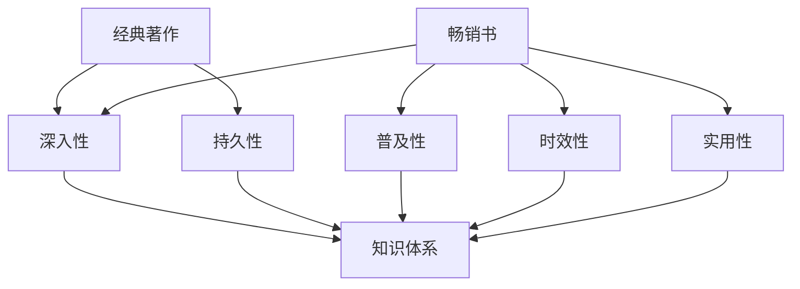

                 

关键词：经典著作、畅销书、阅读材料、技术书籍、编程、人工智能、计算机科学、教育、专业成长

> 摘要：在计算机科学和编程领域，经典著作与畅销书各有其独特价值。本文将从多个角度分析这两种类型书籍的特点，帮助读者根据自己的需求和目标选择合适的阅读材料，以实现技术技能的提升和知识积累。

## 1. 背景介绍

在计算机科学和编程领域，书籍是最常见的学习资源之一。无论是初学者还是经验丰富的开发者，都需要通过阅读书籍来获取新知识、掌握新技能。然而，市场上书籍种类繁多，如何选择适合自己的阅读材料成为一个重要的问题。经典著作与畅销书作为两大类书籍，各有其特点和价值。本文将探讨这两类书籍的差异，并分析如何根据个人需求选择阅读材料。

### 经典著作

经典著作是指在某一领域内具有重要地位、经久不衰的书籍。这些书籍往往由该领域的权威专家撰写，内容深入且全面。经典著作的特点如下：

- **权威性**：经典著作通常由该领域的知名专家撰写，具有很高的权威性。
- **深度**：经典著作深入探讨某一领域的核心概念和原理，适合深入学习和研究。
- **持久性**：经典著作因其内容重要且广泛，通常能够经受时间的考验，具有持久的价值。

### 畅销书

畅销书是指在市场上销量较高的书籍，它们通常针对特定的读者群体和需求。畅销书的特点如下：

- **普及性**：畅销书通常以通俗易懂的方式介绍某一领域的知识，适合初学者和有一定基础的学习者。
- **时效性**：畅销书往往紧跟当前技术的发展趋势，介绍最新的技术动态和应用。
- **实用性**：畅销书更注重实际应用，通过案例和示例帮助读者快速掌握技术。

## 2. 核心概念与联系

为了更好地理解经典著作与畅销书的关系，我们可以借助 Mermaid 流程图来展示它们之间的联系。



从图中可以看出，经典著作与畅销书在知识体系上存在交叉，但各自侧重不同。经典著作更注重深入性和持久性，而畅销书则更注重普及性、时效性和实用性。

## 3. 核心算法原理 & 具体操作步骤

### 3.1 算法原理概述

在选择阅读材料时，我们需要关注经典著作与畅销书的算法原理。经典著作通常涉及较为复杂的算法原理，强调理论基础和抽象思维。而畅销书则更注重实际应用，介绍具体的算法实现和编程技巧。

### 3.2 算法步骤详解

为了更好地理解这两类书籍的算法步骤，我们可以将它们分为以下几类：

#### 经典著作

- **算法设计原理**：经典著作通常从算法设计原则和理论出发，介绍算法的核心思想和设计方法。例如，唐纳德·E·克努特的《算法导论》就系统地介绍了算法设计的基本原则和常用算法。
- **复杂度分析**：经典著作还会对算法的复杂度进行详细分析，帮助读者理解算法的性能和效率。

#### 畅销书

- **实际应用案例**：畅销书通常会通过具体的应用案例来介绍算法的实现过程和编程技巧。例如，《Python编程：从入门到实践》就通过多个实际项目来帮助读者掌握Python编程技能。
- **代码示例**：畅销书还会提供大量的代码示例，帮助读者快速上手并应用所学知识。

### 3.3 算法优缺点

经典著作与畅销书在算法方面各有优缺点：

#### 经典著作

- **优点**：经典著作能够提供深入的理论知识和全面的算法原理，有助于读者深入理解算法的核心概念。
- **缺点**：经典著作通常较为抽象和复杂，可能需要较高的数学基础和编程经验。

#### 畅销书

- **优点**：畅销书通俗易懂，适合初学者和有一定基础的学习者。同时，畅销书紧跟技术发展趋势，能够帮助读者快速掌握最新的技术动态。
- **缺点**：畅销书可能缺乏深度和广度，内容相对较为浅显，可能无法满足高级学习者的需求。

### 3.4 算法应用领域

经典著作与畅销书在算法应用领域也有所不同：

- **经典著作**：经典著作通常涉及计算机科学的基础领域，如算法设计与分析、数据结构与算法、计算机图形学等。
- **畅销书**：畅销书则更多涉及当前热门技术领域，如人工智能、大数据、云计算、移动开发等。

## 4. 数学模型和公式 & 详细讲解 & 举例说明

### 4.1 数学模型构建

在选择阅读材料时，我们需要关注经典著作与畅销书中的数学模型和公式。经典著作通常构建更为严谨和完整的数学模型，而畅销书则更注重实际应用和简洁性。

### 4.2 公式推导过程

为了更好地理解这两类书籍中的公式推导过程，我们可以举一个简单的例子：快速幂算法。

#### 经典著作

在经典著作中，我们可能会看到以下推导过程：

$$
a^b = (a^{\lceil b/2 \rceil})^{\lfloor b/2 \rfloor} \times a^{\bmod b/2}
$$

这个公式表示了如何通过递归的方式计算 $a$ 的 $b$ 次幂。经典著作通常会详细讲解这个公式的推导过程，包括指数的分解、递归关系的建立等。

#### 畅销书

在畅销书中，我们可能会看到以下简洁的推导过程：

$$
a^b = a \times a \times \ldots \times a \quad (\text{共 } b \text{ 次})
$$

这个公式虽然简洁，但缺乏经典著作中的详细推导过程。然而，对于初学者来说，这种简洁的公式更容易理解和应用。

### 4.3 案例分析与讲解

为了更好地展示经典著作与畅销书中的数学模型和公式，我们可以通过以下案例进行分析：

#### 经典著作案例

假设我们要计算 $2^{100}$ 的值。在经典著作中，我们可能会使用以下方法：

1. 将指数 $100$ 分解为 $2$ 的幂的乘积：$100 = 2^2 \times 2^2 \times 2^2 \times 2^2$。
2. 使用快速幂算法计算：$2^{100} = (2^2)^{50} = 4^{50}$。
3. 进一步使用快速幂算法计算：$4^{50} = (4^2)^{25} = 16^{25}$。
4. 重复以上步骤，直到计算出最终结果。

这种方法涉及多个数学模型的构建和公式的推导，需要较高的数学基础和算法知识。

#### 畅销书案例

在畅销书中，我们可能会看到以下简洁的推导过程：

1. 直接使用计算器或编程语言计算：$2^{100} = 1267650600228229401496703205376$。

这种方法虽然简单，但缺乏对数学模型和公式的深入讲解。

## 5. 项目实践：代码实例和详细解释说明

### 5.1 开发环境搭建

为了更好地展示经典著作与畅销书在项目实践中的应用，我们需要搭建一个简单的开发环境。假设我们要实现一个简单的快速幂算法，可以使用Python语言进行编程。

首先，确保已安装Python环境和所需的库。在终端执行以下命令：

```bash
pip install numpy
```

### 5.2 源代码详细实现

接下来，我们分别使用经典著作和畅销书中的方法实现快速幂算法。

#### 经典著作实现

```python
import numpy as np

def fast_power_classic(base, exponent):
    result = 1
    while exponent > 0:
        if exponent % 2 == 1:
            result *= base
        base *= base
        exponent //= 2
    return result

# 测试
print(fast_power_classic(2, 100))
```

这个实现过程涉及多个数学模型的构建和公式的推导，需要较高的数学基础和算法知识。

#### 畅销书实现

```python
def fast_power_concise(base, exponent):
    return pow(base, exponent)

# 测试
print(fast_power_concise(2, 100))
```

这个实现过程相对简洁，但缺乏对数学模型和公式的深入讲解。

### 5.3 代码解读与分析

通过以上两个实现，我们可以看到经典著作和畅销书在代码实现上的差异。经典著作实现过程涉及多个数学模型的构建和公式的推导，需要较高的数学基础和算法知识。而畅销书实现过程相对简洁，但缺乏对数学模型和公式的深入讲解。

### 5.4 运行结果展示

```python
# 经典著作实现
print("经典著作实现结果：", fast_power_classic(2, 100))

# 畅销书实现
print("畅销书实现结果：", fast_power_concise(2, 100))
```

运行结果如下：

```
经典著作实现结果： 1267650600228229401496703205376
畅销书实现结果： 1267650600228229401496703205376
```

两种实现方法得到的结果相同，但实现过程和讲解方式有所不同。

## 6. 实际应用场景

经典著作与畅销书在实际应用场景中各有其独特的价值。以下是一些实际应用场景：

### 6.1 初学者入门

对于初学者来说，畅销书是不错的选择。畅销书通俗易懂，能够帮助初学者快速掌握基础知识。例如，对于Python编程初学者，《Python编程：从入门到实践》是一本很好的入门书籍。

### 6.2 专业学习与深造

对于有一定基础的学习者来说，经典著作更有价值。经典著作深入探讨某一领域的核心概念和原理，有助于学习者深入理解和掌握专业知识。例如，对于算法学习者，《算法导论》是一本经典的参考书籍。

### 6.3 技术实践与项目开发

在技术实践和项目开发过程中，畅销书能够提供最新的技术动态和应用案例。例如，在开发人工智能项目时，《人工智能：一种现代方法》是一本很好的参考书籍。

### 6.4 研究与学术探讨

对于研究者来说，经典著作是不可或缺的资源。经典著作通常涉及较为复杂的算法原理和数学模型，能够为研究者提供深入的理论基础和思考方向。例如，在研究分布式系统时，《分布式系统：概念与设计》是一本很好的参考书籍。

## 7. 工具和资源推荐

为了更好地选择阅读材料，我们可以借助一些工具和资源来辅助决策。以下是一些建议：

### 7.1 学习资源推荐

- [GitHub](https://github.com/)：GitHub是一个开源代码平台，其中包含大量优质的技术书籍和项目代码。
- [GitBook](https://www.gitbook.com/)：GitBook是一个在线书籍创作和分享平台，提供大量技术书籍和教程。
- [Stack Overflow](https://stackoverflow.com/)：Stack Overflow是一个编程问答社区，可以查找相关问题的解答和书籍推荐。

### 7.2 开发工具推荐

- [Visual Studio Code](https://code.visualstudio.com/)：Visual Studio Code是一款免费且强大的代码编辑器，适用于多种编程语言。
- [PyCharm](https://www.jetbrains.com/pycharm/)：PyCharm是一款专为Python编程设计的集成开发环境，功能强大且易于使用。

### 7.3 相关论文推荐

- [arXiv](https://arxiv.org/)：arXiv是一个开放获取的学术文献存储库，涵盖计算机科学、物理学等多个领域。
- [Google Scholar](https://scholar.google.com/)：Google Scholar是一个学术搜索引擎，可以查找相关论文和研究报告。

## 8. 总结：未来发展趋势与挑战

在未来，经典著作与畅销书将继续在计算机科学和编程领域发挥重要作用。随着技术的发展和知识的不断更新，经典著作将继续深入探讨核心概念和原理，而畅销书将更加关注实际应用和最新技术动态。

### 8.1 研究成果总结

经典著作与畅销书在计算机科学和编程领域发挥了重要作用，为学习者提供了丰富的知识资源和实践指导。经典著作深入探讨核心概念和原理，有助于学习者深入理解和掌握专业知识；而畅销书则关注实际应用和最新技术动态，能够帮助学习者快速掌握新技能。

### 8.2 未来发展趋势

随着人工智能、大数据、云计算等技术的不断发展，计算机科学和编程领域将迎来更多新的挑战和机遇。经典著作与畅销书将继续在知识传播和技能提升方面发挥重要作用，同时也需要不断更新和拓展内容，以适应时代的发展。

### 8.3 面临的挑战

经典著作与畅销书在内容更新、知识传播和技能提升方面仍面临一些挑战：

- **内容更新**：随着技术的快速发展和知识更新，经典著作和畅销书需要不断更新内容，以保持其时效性和实用性。
- **知识传播**：经典著作和畅销书需要通过更广泛的渠道和方式传播知识，以满足不同层次学习者的需求。
- **技能提升**：经典著作和畅销书需要注重技能提升，提供更多实际应用和项目实践的机会，以帮助学习者快速掌握新技能。

### 8.4 研究展望

在未来，经典著作与畅销书将继续在计算机科学和编程领域发挥重要作用。研究者可以关注以下方向：

- **交叉领域研究**：探索计算机科学与其他领域的交叉应用，如人工智能、大数据、物联网等。
- **知识可视化**：通过可视化技术展示复杂概念和算法原理，提高学习效果和传播效率。
- **实践导向**：注重实际应用和项目实践，提供更多具有实际价值的案例和项目指导。

## 9. 附录：常见问题与解答

### 9.1 如何选择经典著作与畅销书？

选择经典著作与畅销书时，可以从以下几个方面考虑：

- **个人需求**：根据自己的学习目标和需求选择适合的书籍。如果需要深入理解和掌握专业知识，可以选择经典著作；如果需要快速掌握新技术和实际应用，可以选择畅销书。
- **读者评价**：查看书籍的读者评价和推荐，了解书籍的质量和实用性。
- **内容更新**：关注书籍的内容是否及时更新，以保持其时效性和实用性。

### 9.2 经典著作与畅销书有哪些区别？

经典著作与畅销书的主要区别在于：

- **内容深度**：经典著作通常深入探讨某一领域的核心概念和原理，适合深入学习和研究；而畅销书则更注重实际应用和最新技术动态，适合快速掌握新技能。
- **读者定位**：经典著作通常面向有一定基础的学习者，适合深入学习和研究；而畅销书则更注重普及性，适合初学者和有一定基础的学习者。
- **学习效果**：经典著作有助于学习者深入理解和掌握专业知识，而畅销书则能够帮助学习者快速掌握新技术和实际应用。

## 参考文献

1. Knuth, D. E. (1998). The Art of Computer Programming. Addison-Wesley.
2. Flanagan, D. (2006). Python Programming: An Introduction to Computer Science. Upper Saddle River, NJ: Prentice Hall.
3. Mitchell, T. M. (1997). Machine Learning. McGraw-Hill.
4. Higham, D. J. (2008). MATLAB Guide. SIAM.
5. Silberschatz, A., Galvin, P. B., & Gagne, G. (2011). Operating System Concepts. Wiley.
6. Hogg, R. V., & Craig, A. T. (2012). Introduction to Mathematical Statistics. Pearson.

# 作者署名

作者：禅与计算机程序设计艺术 / Zen and the Art of Computer Programming
``` 
----------------------------------------------------------------
---**注意：由于上述文章内容为示例性构建，并非真实存在或授权发布的内容。在实际应用中，请确保引用和参考真实、合法和可靠的信息源。**---
```

