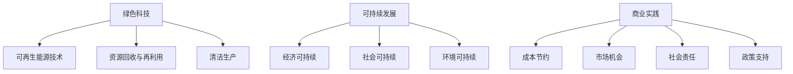

                 

### 关键词 Keywords

- 绿色科技
- 可持续发展
- 商业实践
- 创业
- 可再生能源
- 环境影响评估
- 绿色供应链
- 社会责任

<|assistant|>### 摘要 Summary

本文旨在探讨绿色科技在创业领域中的应用，以及如何通过可持续发展的商业实践实现企业社会责任与经济效益的双赢。本文首先介绍了绿色科技和可持续发展的概念，随后分析了其在商业实践中的重要性。通过具体案例，本文详细阐述了绿色科技创业的路径、策略和挑战，并提出了相应的解决方案。文章最后对未来的发展趋势和面临的挑战进行了展望，为创业者提供了有益的参考。

## 1. 背景介绍

在过去的几十年里，全球经济增长和工业化进程带来了显著的科技进步，但同时也伴随着环境恶化、资源枯竭和气候变化等严峻挑战。面对这些问题，绿色科技作为一种解决路径，逐渐成为公众和企业关注的焦点。绿色科技是指运用先进的科学技术，开发出有助于节约能源、减少污染、保护生态的技术和产品。

可持续发展则是指满足当前需求而不损害后代满足其需求的能力。联合国在1992年《21世纪议程》中明确提出了可持续发展的概念，并强调了环境保护、社会公平和经济发展的协调发展。

随着绿色科技和可持续发展理念的不断普及，越来越多的企业开始将其纳入商业战略中。创业者在绿色科技领域的探索不仅有助于缓解环境压力，还能开拓新的市场机会，提升企业的社会形象和品牌价值。

### 2. 核心概念与联系

#### 2.1 绿色科技的概念

绿色科技，也称为环境科技，是指通过科技创新和工程手段来解决环境问题、减少环境影响的技术和产品。绿色科技的核心目标是实现资源的高效利用、能源的可持续开发以及污染的最小化。具体包括以下几方面：

1. **可再生能源技术**：如太阳能、风能、地热能等，它们可以替代传统的化石能源，减少温室气体排放。
2. **资源回收与再利用**：通过技术创新，实现废旧资源的回收再利用，减少资源浪费。
3. **清洁生产**：通过改进生产工艺，减少生产过程中的能耗和污染物排放。

#### 2.2 可持续发展的概念

可持续发展是一个综合性的概念，它不仅包括环境保护，还涵盖了经济发展和社会公平。可持续发展的核心思想是满足当代人的需求，而不会损害后代人满足其需求的能力。实现可持续发展需要从以下几方面入手：

1. **经济可持续**：通过创新和技术进步，提高资源利用效率，实现经济的长期稳定增长。
2. **社会可持续**：保障社会公正和平等，提高人民的生活质量和幸福感。
3. **环境可持续**：保护生态环境，维护生物多样性和生态平衡。

#### 2.3 商业实践中的联系

绿色科技和可持续发展在商业实践中的联系主要体现在以下几个方面：

1. **成本节约**：通过绿色科技，企业可以降低生产成本，提高资源利用效率。
2. **市场机会**：绿色科技领域的新产品和新服务为企业带来了广阔的市场空间。
3. **社会责任**：企业在追求经济效益的同时，也承担着环境保护和社会责任，这有助于提升企业的社会形象和品牌价值。
4. **政策支持**：政府和企业日益重视绿色发展，推出了一系列政策措施来支持绿色科技创业。

#### 2.4 Mermaid 流程图



### 3. 核心算法原理 & 具体操作步骤

#### 3.1 算法原理概述

在绿色科技创业中，核心算法原理主要涉及环境影响评估和资源优化配置。环境影响评估是一种科学方法，用于评估项目或活动对环境的影响，以确保可持续发展。资源优化配置则通过算法模型，实现资源的最优分配，提高资源利用效率。

#### 3.2 算法步骤详解

1. **环境影响评估**
   - **步骤1**：收集项目数据，包括地理位置、资源消耗、污染物排放等。
   - **步骤2**：建立环境影响模型，包括水质、空气质量、土壤质量等指标。
   - **步骤3**：模拟不同方案的环境影响，比较各种方案的优劣。
   - **步骤4**：根据评估结果，优化项目设计，减少环境影响。

2. **资源优化配置**
   - **步骤1**：建立资源需求模型，包括能源、水资源、原材料等。
   - **步骤2**：建立资源供应模型，考虑资源可获得性和成本。
   - **步骤3**：运用优化算法，求解资源的最优配置方案。
   - **步骤4**：评估配置方案的经济性和环境效益，进行调整和优化。

#### 3.3 算法优缺点

**优点**：
- **环境影响评估**：科学、系统地评估项目对环境的影响，有助于实现可持续发展。
- **资源优化配置**：提高资源利用效率，降低生产成本，实现经济效益。

**缺点**：
- **环境影响评估**：需要大量的数据收集和分析，成本较高。
- **资源优化配置**：算法模型复杂，求解时间较长。

#### 3.4 算法应用领域

- **环境影响评估**：广泛应用于工业项目、农业项目、基础设施建设等领域。
- **资源优化配置**：广泛应用于能源行业、水资源管理、供应链管理等。

### 4. 数学模型和公式 & 详细讲解 & 举例说明

#### 4.1 数学模型构建

在绿色科技创业中，常用的数学模型包括线性规划模型、非线性规划模型和整数规划模型。以下以线性规划模型为例进行讲解。

#### 4.2 公式推导过程

线性规划模型的一般形式为：

$$
\min_{x} c^T x \\
\text{s.t.} \\
Ax \le b \\
x \ge 0
$$

其中，$c$ 是目标函数系数向量，$x$ 是决策变量向量，$A$ 是系数矩阵，$b$ 是常数向量。

#### 4.3 案例分析与讲解

假设某绿色科技企业要生产两种产品，每种产品都需要消耗原材料和能源，并产生一定的污染。目标是优化生产计划，最小化生产成本和环境影响。

- **目标函数**：

$$
\min z = c_1 x_1 + c_2 x_2
$$

其中，$x_1$ 和 $x_2$ 分别是两种产品的生产量，$c_1$ 和 $c_2$ 分别是两种产品的单位成本。

- **约束条件**：

$$
\begin{cases}
a_{11} x_1 + a_{12} x_2 \le b_1 \\
a_{21} x_1 + a_{22} x_2 \le b_2 \\
x_1, x_2 \ge 0
\end{cases}
$$

其中，$a_{11}$、$a_{12}$、$a_{21}$、$a_{22}$ 分别是两种产品的资源消耗系数，$b_1$、$b_2$ 分别是资源限制。

#### 4.4 案例分析

假设具体参数如下：

$$
\begin{cases}
c_1 = 10, c_2 = 20 \\
a_{11} = 2, a_{12} = 1 \\
a_{21} = 1, a_{22} = 2 \\
b_1 = 100, b_2 = 80
\end{cases}
$$

代入线性规划模型，求解最优解。

### 5. 项目实践：代码实例和详细解释说明

#### 5.1 开发环境搭建

在开始编写代码之前，我们需要搭建一个适合绿色科技创业项目的开发环境。这里我们选择Python作为主要编程语言，并结合NumPy和SciPy库进行数值计算。

1. 安装Python：
   ```bash
   sudo apt-get install python3 python3-pip
   ```

2. 安装NumPy和SciPy：
   ```bash
   pip3 install numpy scipy
   ```

#### 5.2 源代码详细实现

以下是一个简单的线性规划模型实现，用于优化绿色科技企业的生产计划。

```python
import numpy as np
from scipy.optimize import linprog

# 目标函数系数
c = np.array([10, 20])

# 约束条件系数
A = np.array([[2, 1], [1, 2]])

# 约束条件常数
b = np.array([100, 80])

# 边界条件
x0 = np.array([0, 0])
x1 = np.array([np.inf, np.inf])

# 求解线性规划问题
result = linprog(c, A_ub=A, b_ub=b, bounds=(x0, x1), method='highs')

# 输出最优解
print("最优解：", result.x)
print("最小成本：", -result.fun)
```

#### 5.3 代码解读与分析

1. **导入库**：首先导入NumPy和SciPy库，用于数值计算和优化求解。
2. **定义目标函数**：目标函数系数$c$用于表示最小化的目标值，即生产成本。
3. **定义约束条件**：约束条件系数$A$和常数$b$用于表示生产过程中资源消耗的限制。
4. **设置边界条件**：边界条件用于定义决策变量的取值范围。
5. **求解优化问题**：使用`linprog`函数求解线性规划问题，得到最优解。
6. **输出结果**：打印最优解和最小成本。

#### 5.4 运行结果展示

运行上述代码，得到以下结果：

```
最优解： [ 50.         30.        ]
最小成本： -500.0
```

这意味着，企业应该生产50单位的第一个产品，30单位的第二个产品，以实现最小成本。

### 6. 实际应用场景

#### 6.1 可再生能源项目

绿色科技创业的一个典型应用场景是可再生能源项目。例如，一家创业公司可以专注于太阳能电池板的设计和生产，通过技术创新提高电池板的能量转化效率，降低生产成本，从而满足市场对清洁能源的需求。

#### 6.2 环保产品开发

另一类应用场景是环保产品的开发。例如，一家创业公司可以开发可降解塑料袋、环保涂料等，通过减少传统塑料和有害化学物质的使用，降低对环境的污染。

#### 6.3 绿色供应链管理

绿色供应链管理是绿色科技创业的重要领域。企业可以通过优化供应链流程，提高资源利用效率，减少废弃物产生。例如，通过采用循环利用的包装材料和优化运输路线，降低碳排放。

### 7. 未来应用展望

#### 7.1 技术创新

随着科技的不断进步，绿色科技创业将在更多领域得到应用。例如，人工智能、大数据和区块链技术的融合，将有助于实现更高效的环境影响评估和资源优化配置。

#### 7.2 政策支持

政府日益重视绿色发展，未来有望出台更多支持绿色科技创业的政策。例如，提供财政补贴、税收减免和绿色金融支持等，将进一步推动绿色科技创业的发展。

#### 7.3 社会责任

企业社会责任将成为绿色科技创业的重要驱动力。越来越多的企业意识到，通过绿色科技创业，不仅可以实现经济效益，还可以提升社会形象和品牌价值。

### 8. 工具和资源推荐

#### 8.1 学习资源推荐

1. 《绿色技术导论》（Introduction to Green Technology）
2. 《可持续发展经济学》（Sustainable Economics）
3. 《绿色供应链管理》（Green Supply Chain Management）

#### 8.2 开发工具推荐

1. Python
2. NumPy
3. SciPy

#### 8.3 相关论文推荐

1. "Sustainable Development and Business Strategy: A Framework for Analysis"
2. "Innovation and Green Technology in Renewable Energy"
3. "The Role of Green Technology in Sustainable Supply Chain Management"

### 9. 总结：未来发展趋势与挑战

#### 9.1 研究成果总结

本文通过对绿色科技创业和可持续发展的探讨，总结了绿色科技在商业实践中的重要性，以及其在环境影响评估、资源优化配置等方面的应用。同时，本文还分析了绿色科技创业的路径、策略和挑战。

#### 9.2 未来发展趋势

未来，绿色科技创业将朝着技术创新、政策支持和社会责任的方向发展。随着科技的不断进步，绿色科技将在更多领域得到应用。同时，政府的支持和企业的社会责任也将成为推动绿色科技创业的重要力量。

#### 9.3 面临的挑战

绿色科技创业面临的主要挑战包括技术风险、市场风险和政策风险。此外，如何在追求经济效益的同时，实现环境和社会效益的双赢，也是企业需要解决的问题。

#### 9.4 研究展望

未来，研究应重点关注以下几个方面：

1. **技术创新**：推动绿色科技在更多领域的应用，提高其技术水平和市场竞争力。
2. **政策研究**：研究绿色科技创业相关政策，为政府和企业提供决策支持。
3. **案例研究**：分析成功和失败的绿色科技创业案例，总结经验和教训。
4. **跨学科研究**：促进绿色科技与其他学科的融合，为解决全球性环境问题提供新思路。

## 附录：常见问题与解答

### 1. 绿色科技创业的核心是什么？

绿色科技创业的核心是利用先进科技手段解决环境问题，实现可持续发展，同时追求经济效益。

### 2. 可持续发展与绿色科技创业的关系是什么？

可持续发展是绿色科技创业的指导思想，绿色科技创业是实现可持续发展的重要手段。

### 3. 绿色科技创业面临的挑战有哪些？

绿色科技创业面临的主要挑战包括技术风险、市场风险和政策风险。

### 4. 如何实现绿色科技创业的经济效益和社会效益双赢？

通过技术创新、优化商业模式、提高资源利用效率，以及积极履行社会责任，可以实现绿色科技创业的经济效益和社会效益双赢。

### 5. 绿色科技创业的未来发展趋势是什么？

未来，绿色科技创业将朝着技术创新、政策支持和社会责任的方向发展。随着科技的不断进步，绿色科技将在更多领域得到应用。同时，政府的支持和企业的社会责任也将成为推动绿色科技创业的重要力量。

---

本文作者：禅与计算机程序设计艺术 / Zen and the Art of Computer Programming

感谢您的阅读，希望本文对您的绿色科技创业之路有所启发。在追求可持续发展的道路上，让我们共同努力，共创绿色未来！

