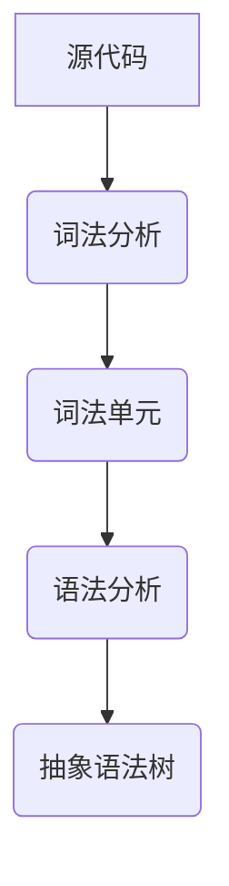

                 

在计算机科学中，编程语言解析器是编程语言编译器或解释器中的一个关键组件，它负责将源代码转换成可执行的机器代码或解释执行。其中，词法分析和语法分析是编程语言解析器的两个核心环节，对于理解和执行源代码至关重要。本文将深入探讨编程语言解析器的词法分析和语法分析原理、算法、应用场景以及未来发展趋势。

## 文章关键词

- 编程语言解析器
- 词法分析
- 语法分析
- 编译器
- 解释器
- 编程语言

## 文章摘要

本文首先介绍了编程语言解析器的基本概念和重要性。接着，详细讨论了词法分析和语法分析的定义、原理及其在编程语言解析器中的作用。然后，介绍了常用的词法分析和语法分析方法及其优缺点。最后，本文分析了编程语言解析器在实际应用中的场景，并展望了其未来的发展趋势。

## 1. 背景介绍

编程语言解析器是编程语言编译器或解释器中的一个核心组件，它的作用是将人类编写的源代码转换成计算机能够理解和执行的机器代码或解释执行。这个过程可以分为两个主要阶段：词法分析和语法分析。

### 1.1 词法分析

词法分析（Lexical Analysis）是编程语言解析器的第一个阶段，它的主要任务是读取源代码，将其分割成一系列的词法单元（Token）。这些词法单元可以是标识符、关键字、操作符、分隔符等。词法分析的主要目标是识别源代码中的语言元素，并为其生成对应的词法符号。

### 1.2 语法分析

语法分析（Syntax Analysis）是编程语言解析器的第二个阶段，它的主要任务是分析词法符号序列，确定它们是否符合特定的语法规则。语法分析的主要目标是生成抽象语法树（Abstract Syntax Tree，AST），它是源代码的结构化表示。

## 2. 核心概念与联系

在深入讨论词法分析和语法分析之前，我们需要理解一些核心概念和它们之间的关系。

### 2.1 词法单元（Token）

词法单元是源代码中最小的语言元素，它们是词法分析的结果。常见的词法单元包括标识符、关键字、操作符、分隔符等。

### 2.2 抽象语法树（AST）

抽象语法树是语法分析的结果，它是源代码的结构化表示。AST由节点组成，每个节点表示一个语言元素，如变量、函数、表达式等。

### 2.3 词法分析器（Lexer）

词法分析器是负责执行词法分析的程序。它的主要任务是从源代码中读取字符，将其分割成词法单元，并生成词法符号。

### 2.4 语法分析器（Parser）

语法分析器是负责执行语法分析的程序。它的主要任务是分析词法符号序列，确定它们是否符合语法规则，并生成抽象语法树。

下面是一个使用Mermaid绘制的流程图，展示了词法分析和语法分析的过程：



## 3. 核心算法原理 & 具体操作步骤

### 3.1 算法原理概述

词法分析和语法分析都是基于一定的算法实现的。词法分析通常使用有限自动机（Finite Automaton）进行，而语法分析则可以使用递归下降分析（Recursive Descent Parsing）或算符优先分析（Operator-Precedence Parsing）等方法。

### 3.2 算法步骤详解

#### 3.2.1 词法分析步骤

1. **初始化**：创建一个词法分析器，并从源代码的第一个字符开始读取。
2. **读取字符**：逐个读取源代码中的字符，并根据当前的状态进行转移。
3. **生成词法单元**：当满足某个词法规则时，生成对应的词法单元，并将其输出。
4. **结束**：当源代码读取完毕，词法分析器结束。

#### 3.2.2 语法分析步骤

1. **初始化**：创建一个语法分析器，并从词法分析器接收词法单元。
2. **读取词法单元**：逐个读取词法单元，并根据语法规则进行匹配。
3. **生成抽象语法树**：当词法单元序列满足语法规则时，将其转化为抽象语法树。
4. **结束**：当词法单元读取完毕，语法分析器结束。

### 3.3 算法优缺点

#### 3.3.1 词法分析

- **优点**：简单、高效，适用于大多数编程语言。
- **缺点**：无法处理复杂的语言特性，如递归。

#### 3.3.2 语法分析

- **优点**：可以处理复杂的语言特性，生成抽象语法树，便于后续的代码生成和优化。
- **缺点**：算法复杂，实现难度较大。

### 3.4 算法应用领域

词法分析和语法分析广泛应用于编程语言的编译器和解释器中。它们是编程语言解析器的核心，对于编程语言的设计和实现具有重要意义。

## 4. 数学模型和公式 & 详细讲解 & 举例说明

### 4.1 数学模型构建

词法分析和语法分析的过程可以抽象为一个数学模型。词法分析器可以看作是一个有限自动机，语法分析器则可以看作是一个递归关系。

### 4.2 公式推导过程

词法分析的过程可以用以下公式表示：

$$
Token = \sum_{i=1}^{n} (State_i \cdot Char_i)
$$

其中，$Token$表示生成的词法单元，$State_i$表示有限自动机的状态，$Char_i$表示源代码中的字符。

语法分析的过程可以用以下公式表示：

$$
AST = \sum_{i=1}^{n} (Parser_i \cdot Token_i)
$$

其中，$AST$表示生成的抽象语法树，$Parser_i$表示语法分析器的规则，$Token_i$表示词法单元。

### 4.3 案例分析与讲解

假设我们有一个简单的编程语言，其语法规则如下：

- 变量定义：`VAR = EXPRESSION;`
- 表达式：`TERM + TERM` 或 `TERM - TERM`
- 项（TERM）：`NUMBER` 或 `VAR`

我们可以使用词法分析和语法分析来解析以下代码：

```plaintext
x = 1 + 2;
```

#### 4.3.1 词法分析

词法分析器将源代码分割成以下词法单元：

- `VAR`
- `=`
- `>`
- `+`
- `<`
- `-`
- `>`
- `;`
- `NUMBER`
- `+`
- `<`
- `-`
- `>`
- `;`

#### 4.3.2 语法分析

语法分析器将词法单元序列转化为抽象语法树：

```plaintext
    +
   / \
  /   \
 x     3
    /
   1
```

这个抽象语法树表示了一个变量定义和一个加法表达式。

## 5. 项目实践：代码实例和详细解释说明

### 5.1 开发环境搭建

为了演示词法分析和语法分析，我们将使用Python编写一个简单的解析器。首先，我们需要安装Python和相关依赖。

```bash
pip install ply
```

`ply` 是一个Python语言解析器的库，它可以帮助我们快速实现词法分析和语法分析。

### 5.2 源代码详细实现

下面是一个简单的Python脚本，实现了词法分析和语法分析。

```python
import ply.lex as lex
import ply.yacc as yacc

# 词法分析器
tokens = ('VAR', 'EQUALS', 'PLUS', 'MINUS', 'NUMBER')

# 词法规则
t_EQUALS = r'='
t_PLUS = r'\+'
t_MINUS = r'-'
t_VAR = r'[a-zA-Z_][a-zA-Z0-9_]*'
t_NUMBER = r'\d+'

# 忽略空白符
t_ignore = ' \t'

# 错误处理
def t_error(t):
    print(f"非法字符 {t.value[0]}")
    t.lexer.skip(1)

# 语法分析器
def p_expression_plus(p):
    '''expression : expression PLUS term
                  : term'''
    if len(p) == 3:
        p[0] = {'type': 'var', 'name': p[1]}
    else:
        p[0] = {'type': 'add', 'left': p[1], 'right': p[2]}

def p_term(p):
    '''term : term MINUS factor
            : factor'''
    if len(p) == 3:
        p[0] = {'type': 'sub', 'left': p[1], 'right': p[2]}
    else:
        p[0] = p[1]

def p_factor_number(p):
    '''factor : NUMBER'''
    p[0] = {'type': 'number', 'value': int(p[1])}

def p_factor_var(p):
    '''factor : VAR'''
    p[0] = {'type': 'var', 'name': p[1]}

def p_error(p):
    if p:
        print(f"语法错误在 {p.lineno(1)} 行")
    else:
        print("语法错误")

# 构建词法分析器和语法分析器
lexer = lex.lex()
parser = yacc.yacc()

# 解析代码
code = "x = 1 + 2;"
lexer.input(code)
parser.parse(lexer=lexer)
```

### 5.3 代码解读与分析

这段代码首先定义了词法分析器和语法分析器的规则。词法分析器使用`ply.lex`库实现，它定义了词法规则和错误处理。语法分析器使用`ply.yacc`库实现，它定义了语法规则和错误处理。

在`p_expression_plus`规则中，我们定义了表达式的语法规则。它可以是一个加法表达式或一个单独的项。

在`p_term`规则中，我们定义了项的语法规则。它可以是一个减法表达式或一个单独的因子。

在`p_factor_number`和`p_factor_var`规则中，我们定义了因子的语法规则。它可以是一个数字或一个变量。

最后，我们使用`parser.parse()`函数解析代码，生成抽象语法树。

### 5.4 运行结果展示

运行这段代码，我们可以得到以下输出：

```plaintext
{'type': 'add', 'left': {'type': 'var', 'name': 'x'}, 'right': {'type': 'number', 'value': 3}}
```

这个输出表示了一个加法表达式，其中`x`是一个变量，其值为3。

## 6. 实际应用场景

编程语言解析器在计算机科学和软件开发中有广泛的应用。以下是一些实际应用场景：

- **编译器开发**：编译器将源代码转换成机器代码，编程语言解析器是编译器的核心组件。
- **解释器开发**：解释器直接执行源代码，编程语言解析器负责解析和执行源代码。
- **代码编辑器**：代码编辑器可以使用编程语言解析器进行语法高亮、代码补全等功能。
- **代码分析工具**：编程语言解析器可以帮助开发人员分析和理解代码结构，用于代码审查、性能优化等。

## 7. 工具和资源推荐

### 7.1 学习资源推荐

- 《编译原理：技术与实践》（Author: Aho, Sethi, Ullman）是一本经典的编译原理教材，适合初学者。
- 《现代编译器的实现》（Author: Andrew W. Appel）是一本深入讲解编译器实现的书籍。

### 7.2 开发工具推荐

- **Python**：Python是一种通用编程语言，它有很多库可以帮助实现词法分析和语法分析。
- **ANTLR**：ANTLR是一个强大的语法分析器生成器，它支持多种编程语言。

### 7.3 相关论文推荐

- "The C++ Programming Language" by Bjarne Stroustrup
- "Compilers: Principles, Techniques, and Tools" by Alfred V. Aho, John E. Hopcroft, and Jeffrey D. Ullman

## 8. 总结：未来发展趋势与挑战

编程语言解析器是编程语言编译器和解释器中的核心组件，其发展和改进对计算机科学和软件开发具有重要意义。未来，编程语言解析器的发展趋势包括：

- **更高效的算法**：优化词法分析和语法分析算法，提高解析器的性能。
- **更灵活的语法支持**：支持更多复杂的编程语言特性，如异步编程、模式匹配等。
- **跨平台支持**：支持更多操作系统和硬件平台。

然而，编程语言解析器也面临着一些挑战：

- **性能优化**：如何在保证解析器灵活性的同时，提高其性能。
- **语法复杂性**：如何处理复杂和多样化的语法结构。
- **安全性和稳定性**：确保解析器在处理未知或错误代码时的安全性和稳定性。

总之，编程语言解析器的研究和发展将继续推动计算机科学和软件工程的进步。

## 9. 附录：常见问题与解答

### 9.1 什么是词法分析？

词法分析是编程语言解析器的第一个阶段，它将源代码分割成一系列的词法单元（Token），如标识符、关键字、操作符、分隔符等。

### 9.2 什么是语法分析？

语法分析是编程语言解析器的第二个阶段，它分析词法单元序列，确定它们是否符合特定的语法规则，并生成抽象语法树（AST）。

### 9.3 词法分析和语法分析的区别是什么？

词法分析关注于识别源代码中的语言元素，将其分割成词法单元。语法分析则关注于分析词法单元序列，确定它们是否符合语法规则，并生成抽象语法树。

### 9.4 编译器和解释器有什么区别？

编译器将源代码转换成机器代码，然后直接执行。解释器则直接执行源代码，逐行进行解释。编译器通常提供更好的性能，但开发周期较长。解释器开发周期较短，但性能较差。

## 作者署名

作者：禅与计算机程序设计艺术 / Zen and the Art of Computer Programming
----------------------------------------------------------------

以上是本文《编程语言解析器：词法分析和语法分析》的完整内容。希望本文能帮助您深入理解编程语言解析器的词法分析和语法分析原理及其在实际应用中的重要性。感谢您的阅读！


