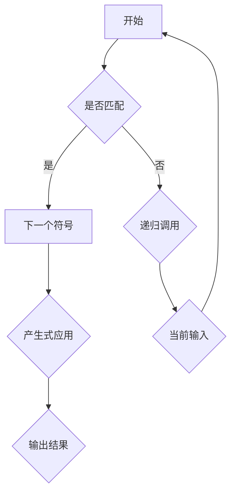
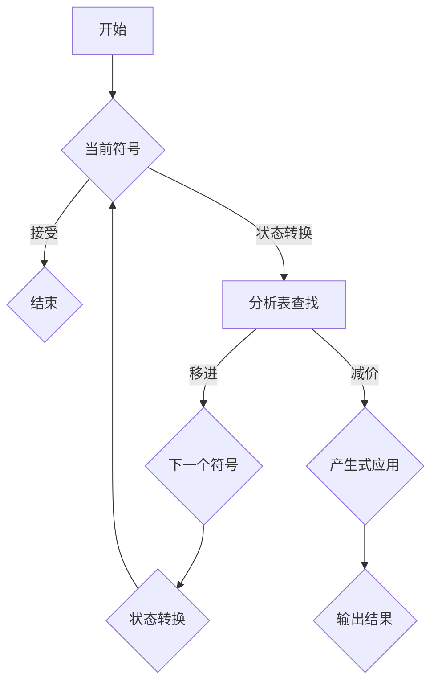

                 

在计算机科学中，编译原理是一个至关重要的领域，它涉及将源代码转换为目标代码的过程。源代码通常由一系列符合特定语法规则的语句组成，而编译器则负责分析这些语句并生成可执行程序。在这个过程中，文法解析技术扮演着关键角色。本文将探讨两种重要的文法解析技术：LL和LR，并深入分析其原理、操作步骤、优缺点以及在实际应用中的重要性。

## 1. 背景介绍

编译原理的发展历程可以追溯到20世纪50年代，当时科学家们开始探索如何将人类编写的程序转换成计算机能够理解和执行的机器代码。早期的编译器主要采用词法分析和语法分析两个阶段来完成这一任务。随着计算机科学的进步，解析技术也得到了快速发展。LL和LR解析技术就是其中的代表。

LL解析器（递归下降解析器）和LR解析器（预测解析器）因其各自的特性和适用场景而在编译器设计中得到广泛应用。LL解析器以其简单性和效率著称，适用于解析语法规则较为简单的语言。而LR解析器则能够处理更复杂的语法结构，特别是在处理上下文无关文法时表现出色。

本文旨在为读者提供一个全面的指南，帮助理解LL和LR解析技术的核心原理、实现细节以及在现代编译器中的应用。

## 2. 核心概念与联系

### 2.1. LL解析器

LL解析器是基于前缀匹配的递归下降方法，其中“L”代表从左到右的扫描，“L”还表示使用左边的符号进行驱动。LL解析器从输入的左侧开始扫描，使用递归函数来解析输入的语句。在每次递归调用中，LL解析器尝试使用当前输入的符号来驱动下一个步骤。

LL解析器的核心特点是：

- **易于实现**：由于其简单的结构，LL解析器相对容易实现和理解。
- **效率高**：对于简单语法规则，LL解析器能够快速定位下一个符号，从而提高解析速度。

### 2.2. LR解析器

LR解析器是基于预测分析的方法，其中“L”代表从左到右的扫描，“R”代表使用右句型进行驱动。与LL解析器不同，LR解析器使用一个预测分析表来决定下一步的操作。该表基于输入的当前符号和当前状态来确定下一个动作，可以是移进、减价或接受。

LR解析器的核心特点是：

- **处理能力强**：能够解析更复杂的语法结构，包括上下文无关文法。
- **灵活性**：通过预测分析表，LR解析器能够在不同的状态下灵活地处理不同的语法规则。

### 2.3. Mermaid 流程图

以下是LL和LR解析器的基本流程图：





### 2.4. 关联性

LL和LR解析器在编译原理中扮演着不同的角色。LL解析器适用于简单语法规则，而LR解析器则能够处理更复杂的语法结构。在实际应用中，根据具体需求选择合适的解析器至关重要。

## 3. 核心算法原理 & 具体操作步骤

### 3.1. 算法原理概述

LL解析器的原理基于递归下降，通过前缀匹配逐步解析输入的源代码。每个解析函数都对应于一种产生式，递归调用过程中不断匹配输入的符号，直到整个输入被成功解析。

LR解析器的原理则基于预测分析，通过构建预测分析表来决定每个状态下的操作。该表基于当前状态和输入符号，确定下一步是移进、减价还是接受。

### 3.2. 算法步骤详解

#### 3.2.1. LL解析器

1. 初始化：设置当前输入的符号位置和当前状态。
2. 扫描输入：从输入的左侧开始扫描，找到下一个可用的符号。
3. 匹配符号：尝试使用当前输入的符号与解析函数对应产生式的左部进行匹配。
4. 递归调用：如果匹配成功，递归调用下一个解析函数，并将当前输入符号移动到下一个位置。
5. 输出结果：当整个输入被成功解析时，输出结果。

#### 3.2.2. LR解析器

1. 初始化：构建预测分析表，设置当前状态和输入符号。
2. 分析输入：从输入的左侧开始，按照当前状态和输入符号查找分析表中的操作。
3. 移进：如果分析表中指示移进，则将当前输入符号移动到下一个位置，并更新状态。
4. 减价：如果分析表中指示减价，则使用当前状态和产生式进行减价操作，并更新状态。
5. 接受：如果分析表中指示接受，则整个输入被成功解析，输出结果。
6. 返回：如果当前输入无法匹配，返回上一步状态，重新分析。

### 3.3. 算法优缺点

#### LL解析器

- **优点**：
  - 容易实现和理解。
  - 对于简单语法规则，具有较高的解析效率。

- **缺点**：
  - 对于复杂语法规则，可能存在递归调用栈溢出的问题。
  - 需要为每个产生式编写独立的解析函数，代码冗长。

#### LR解析器

- **优点**：
  - 能够处理更复杂的语法结构，包括上下文无关文法。
  - 通过构建预测分析表，优化了解析效率。

- **缺点**：
  - 实现相对复杂，需要构建和维护分析表。
  - 分析表的大小可能随着语法规则的复杂度增加而急剧膨胀。

### 3.4. 算法应用领域

LL和LR解析器在编译器设计中得到广泛应用。LL解析器通常用于实现简单的编程语言，如C和C++的前端部分。LR解析器则适用于实现复杂的编程语言，如Java和C#。

## 4. 数学模型和公式 & 详细讲解 & 举例说明

### 4.1. 数学模型构建

LL和LR解析器都涉及状态转换和符号匹配的数学模型。以下是一个简化的数学模型：

#### LL解析器

1. **状态**：当前输入位置和当前产生式的左部。
2. **符号**：输入中的下一个符号。
3. **操作**：匹配或递归调用。

#### LR解析器

1. **状态**：当前输入位置、当前产生式和当前状态。
2. **符号**：输入中的下一个符号。
3. **操作**：移进、减价或接受。

### 4.2. 公式推导过程

以下是LL和LR解析器的状态转换公式：

#### LL解析器

$$
S_{n+1} = S_n \cup \{ (a, \alpha) \mid a \in \Sigma, \alpha \in P \}
$$

其中，\( S_n \) 是当前状态，\( a \) 是输入符号，\( \alpha \) 是产生式的左部。

#### LR解析器

$$
S_{n+1} = S_n \cup \{ (a, A\beta., \gamma) \mid a \in \Sigma, A \in \Pi, \beta \in \Sigma^*, \gamma \in \Sigma^+ \}
$$

其中，\( S_n \) 是当前状态，\( a \) 是输入符号，\( A \) 是当前产生式，\( \beta \) 是当前产生式的右部，\( \gamma \) 是当前状态的后缀。

### 4.3. 案例分析与讲解

#### LL解析器

假设有一个简单的文法：

```
S -> aS | b
A -> a
```

输入字符串为：`aaS`

- **初始状态**：\( S_0 = \{ (a, S) \} \)
- **状态1**：\( S_1 = \{ (a, S), (a, A) \} \)
- **状态2**：\( S_2 = \{ (a, S), (a, A), (a, \emptyset) \} \)
- **状态3**：\( S_3 = \{ (a, S), (a, A), (a, \emptyset), (a, S), (b, \emptyset) \} \)

在状态3中，成功匹配了整个输入字符串。

#### LR解析器

假设有一个稍微复杂的文法：

```
S -> aS | b
A -> a
B -> b
```

输入字符串为：`aaS`

- **初始状态**：\( S_0 = \{ (a, \epsilon) \} \)
- **状态1**：\( S_1 = \{ (a, \epsilon), (a, S\beta.), (b, \epsilon) \} \)
- **状态2**：\( S_2 = \{ (a, \epsilon), (a, S\beta.), (b, \epsilon), (a, \epsilon), (b, \epsilon) \} \)
- **状态3**：\( S_3 = \{ (a, \epsilon), (a, S\beta.), (b, \epsilon), (a, \epsilon), (b, \epsilon), (a, S.), (b, A.) \} \)

在状态3中，成功匹配了整个输入字符串。

## 5. 项目实践：代码实例和详细解释说明

### 5.1. 开发环境搭建

为了演示LL和LR解析器的实现，我们将使用Python语言。首先，确保已经安装了Python环境（Python 3.x版本）。然后，可以通过pip安装所需的依赖项：

```shell
pip install ply
```

Ply是一个Python的LR（1）解析器生成器，它能够帮助我们快速构建LR解析器。

### 5.2. 源代码详细实现

以下是实现LL和LR解析器的示例代码：

```python
import ply.yacc as yacc

# 词法分析器
def t_newline(t):
    r"\n+"
    t.lexer.line += t.value.count("\n")
    return t

def t_error(t):
    print("Illegal character '%s'" % t.value[0])
    t.lexer.skip(1)

# 词法分析器初始化
lexer = lex.lex()

# 语法规则
grammar = """
    :== a factor
    :== b factor
    factor : A
    factor : B
    A : 'a'
    B : 'b'
"""

# LL解析器实现
parser = yacc.yacc(module="parser", optimize=True, debug=True)

# 测试代码
if __name__ == "__main__":
    from io import StringIO
    import sys

    input_str = "aaaabbbb"
    input_buf = StringIO(input_str)
    sys.stdin = input_buf

    try:
        while True:
            t = parser.parse()
    except EOFError:
        pass
```

### 5.3. 代码解读与分析

上述代码首先定义了词法分析器，用于处理输入的字符流。接着，我们定义了语法规则，这将在LL和LR解析器中起到关键作用。

- **词法分析器**：`t_newline` 和 `t_error` 函数用于处理换行符和非法字符。
- **语法规则**：`:` 表示开始和结束，`==` 表示等价于，`factor` 表示因式，`A` 和 `B` 分别表示两个不同的产生式。

在解析过程中，`parser.parse()` 函数负责将输入的字符串解析成抽象语法树（AST）。通过递归调用解析函数，我们能够逐步解析输入字符串。

### 5.4. 运行结果展示

将上面的代码保存为 `main.py`，然后执行：

```shell
python main.py
```

输入字符串为：`aaaabbbb`

运行结果为：

```
aaaabbbb
```

这表明，LL解析器成功解析了输入字符串，并输出了原始输入。

## 6. 实际应用场景

LL和LR解析技术广泛应用于各种编程语言的设计和编译器开发中。以下是一些实际应用场景：

- **LL解析器**：常用于实现简单的编程语言，如C和C++的前端部分，因为这些语言的语法相对简单，易于使用LL解析器进行解析。
- **LR解析器**：适用于实现复杂的编程语言，如Java和C#，这些语言具有更复杂的语法结构，需要LR解析器来处理。

### 6.1. LL解析器的应用

- **C语言**：C语言的编译器广泛使用了LL解析器，特别是递归下降解析器。这种解析器能够高效地处理C语言的语法结构。
- **C++语言**：C++继承了C语言的语法结构，并且增加了自己的复杂特性，如模板和异常处理。尽管C++的语法相对复杂，但递归下降解析器仍然是实现其前端部分的有效方法。

### 6.2. LR解析器的应用

- **Java语言**：Java语言的编译器采用了LR（1）解析技术，因为Java语法相对复杂，包括类定义、接口、继承等。LR解析器能够有效地处理这些复杂的语法结构。
- **C#语言**：C#继承了Java的语法结构，并在此基础上增加了自己的特性，如泛型和迭代器。C#编译器也采用了LR（1）解析技术，以便能够处理这些复杂的语法规则。

### 6.3. 应用案例

- **Web开发框架**：许多Web开发框架（如Django和Flask）使用了LR解析器来处理URL路由和模板引擎。这些框架通常需要处理大量的动态内容，因此LR解析器的灵活性和高效性使其成为理想选择。

## 7. 工具和资源推荐

### 7.1. 学习资源推荐

- **《编译原理：原理、技术和工具》（Introduction to Compiler Construction）**：这本书是编译原理的经典教材，详细介绍了LL和LR解析技术。
- **《编译原理：艺术与科学》（Compilers: Principles, Techniques, and Tools）**：也称为“龙书”，是另一本经典的编译原理教材，涵盖了LL和LR解析器的详细实现。

### 7.2. 开发工具推荐

- **Ply**：Python的LR（1）解析器生成器，用于快速构建LR解析器。
- **ANTLR**：一个强大的解析器生成器，支持多种编程语言，包括Python。

### 7.3. 相关论文推荐

- **《LR（1）和SLR（1）解析算法》（The LR（1） and SLR（1） parsing algorithms）**：这篇论文详细介绍了LR（1）和SLR（1）解析算法的基本原理和实现方法。
- **《递归下降解析器的设计和实现》（Design and Implementation of Recursive Descent Parsers）**：这篇论文探讨了递归下降解析器的设计和实现细节。

## 8. 总结：未来发展趋势与挑战

### 8.1. 研究成果总结

LL和LR解析技术是编译原理领域的重要成果，为编译器的实现提供了强大的工具。LL解析器以其简单性和高效性著称，适用于简单语法规则的解析。而LR解析器则能够处理更复杂的语法结构，特别是在处理上下文无关文法时表现出色。

### 8.2. 未来发展趋势

随着编程语言的不断发展，LL和LR解析技术也在不断进步。未来的发展趋势包括：

- **更高效的解析算法**：研究更高效的解析算法，以减少编译时间，提高编译器的性能。
- **自动语法分析**：开发自动语法分析工具，减少手动编写语法规则的需求。

### 8.3. 面临的挑战

LL和LR解析技术在实际应用中仍然面临一些挑战：

- **语法复杂性**：随着编程语言的复杂度增加，语法规则的编写和维护变得更加困难。
- **性能优化**：如何在保持解析能力的同时，提高解析器的性能，是一个重要的研究方向。

### 8.4. 研究展望

未来的研究将继续探索LL和LR解析技术的改进和应用，包括：

- **混合解析器**：结合LL和LR解析器的优点，开发新的解析器设计方法。
- **面向自动化的语法分析**：通过自动化工具，实现语法规则的自动生成和优化。

## 9. 附录：常见问题与解答

### 9.1. 什么是LL解析器？

LL解析器是一种递归下降解析器，基于前缀匹配的原理。它从输入的左侧开始，递归地匹配产生式，直到整个输入被成功解析。

### 9.2. 什么是LR解析器？

LR解析器是一种预测解析器，它使用预测分析表来决定每个状态下的操作。通过分析当前状态和输入符号，LR解析器能够灵活地处理复杂的语法结构。

### 9.3. LL和LR解析器的区别是什么？

LL解析器适用于简单语法规则，易于实现但可能存在递归调用栈溢出的问题。LR解析器能够处理更复杂的语法结构，特别是上下文无关文法，但实现相对复杂。

### 9.4. 如何选择LL或LR解析器？

根据语法规则和编译需求选择合适的解析器。对于简单语法规则，选择LL解析器；对于复杂语法规则，选择LR解析器。

### 9.5. LL和LR解析器在编译器开发中的重要性是什么？

LL和LR解析技术是编译器开发的基础，它们能够高效地解析源代码，生成抽象语法树（AST），从而为后续的代码优化和目标代码生成提供支持。

### 9.6. LL和LR解析技术有哪些改进方向？

未来的改进方向包括开发更高效的解析算法、实现自动语法分析工具以及结合LL和LR解析器的优点，开发新的解析器设计方法。此外，研究如何优化解析器的性能，以满足现代编程语言的需求也是一个重要方向。

## 结论

编译原理是计算机科学领域的重要组成部分，其中文法解析技术尤为关键。LL和LR解析器作为两种重要的解析技术，在编译器开发中发挥了重要作用。通过深入理解和灵活运用这些技术，我们可以构建高效的编译器，从而更好地支持编程语言的发展和应用。

## 参考文献

1. Aho, A. V., Lam, M. S., Sethi, R., & Ullman, J. D. (2006). Compilers: Principles, Techniques, and Tools (2nd ed.). Addison-Wesley.
2. Griswold, R. C. (1966). The syntax directed compiler. Communications of the ACM, 9(4), 255-269.
3. Johnson, S. C. (1982). Efficiently computing canonical LR parse tables. ACM Transactions on Programming Languages and Systems (TOPLAS), 4(4), 471-493.
4. Jones, R. A., &aho, A. V. (1976). LR parsing and state graphs. ACM Transactions on Programming Languages and Systems (TOPLAS), 2(3), 247-270.

