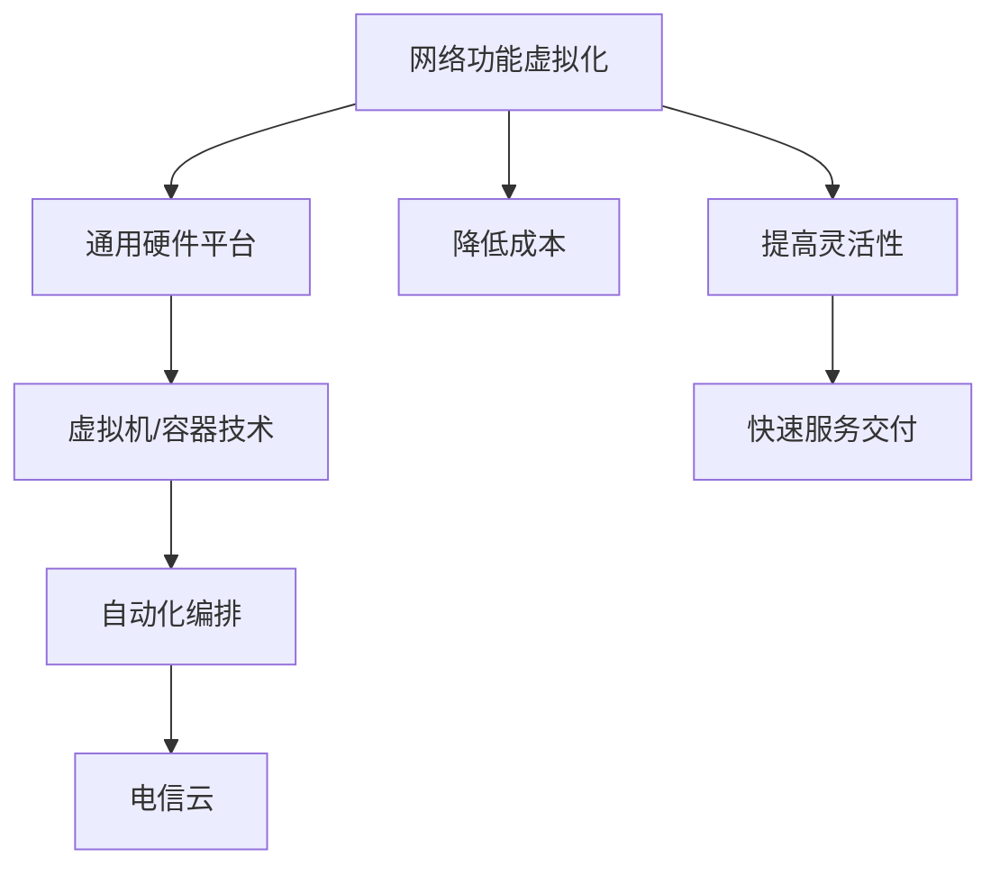

                 

关键词：网络功能虚拟化，电信云，云计算，虚拟化技术，网络服务创新

> 摘要：本文深入探讨了网络功能虚拟化（NFV）的概念、技术原理以及其在电信云中的应用，分析了NFV如何推动电信行业数字化转型，提高网络灵活性、降低成本，并对未来的发展趋势和挑战进行了展望。

## 1. 背景介绍

随着互联网的飞速发展，全球数字化的进程不断加快，电信网络作为信息社会的基础设施，其重要性愈发凸显。传统的电信网络架构以硬件设备为核心，功能实现依赖于具体的硬件设备，如路由器、交换机等。这种模式在功能扩展、资源调度、网络升级等方面存在诸多局限性，难以适应快速变化的业务需求。

为了解决这些问题，网络功能虚拟化（NFV）应运而生。NFV是一种将网络功能从专用的硬件设备中分离出来，通过通用服务器、虚拟机和软件来实现网络功能的技术。这一变革旨在提高网络的灵活性、降低运营成本，并加快网络服务的部署速度。

## 2. 核心概念与联系

### 2.1 NFV的核心概念

NFV的关键概念包括虚拟化网络功能、通用硬件平台、自动化编排和管理等。

- **虚拟化网络功能**：将网络功能（如防火墙、路由器、DNS等）从专用的硬件设备中分离出来，通过虚拟机（VM）或容器（Container）实现。
- **通用硬件平台**：使用通用的服务器、存储和网络设备，代替传统的专用硬件，实现网络功能的部署和运行。
- **自动化编排和管理**：通过自动化工具，对网络功能进行部署、配置、监控和管理，提高运营效率。

### 2.2 NFV与电信云的关系

电信云是NFV实现的重要平台，两者相辅相成。电信云提供了弹性计算、存储和网络的资源池，支持NFV的网络功能虚拟化部署。而NFV则通过虚拟化技术，将网络功能与硬件解耦，实现网络服务的灵活部署和快速交付。

### 2.3 Mermaid 流程图



## 3. 核心算法原理 & 具体操作步骤

### 3.1 算法原理概述

NFV的核心算法原理在于将网络功能模块化，并通过虚拟化技术实现这些模块在通用硬件平台上的高效运行。具体包括以下几个步骤：

1. **功能模块化**：将复杂的网络功能拆分成可独立运行的小模块。
2. **虚拟化部署**：使用虚拟机或容器技术，将模块部署在通用硬件平台上。
3. **自动化编排**：通过自动化工具，对模块进行配置和管理，实现灵活的网络服务部署。

### 3.2 算法步骤详解

1. **需求分析**：根据业务需求，确定需要实现哪些网络功能。
2. **功能模块化**：将确定的功能进行模块化拆分，每个模块具备独立运行的能力。
3. **虚拟化部署**：使用虚拟化技术，将模块部署在通用硬件平台上。
4. **自动化编排**：通过自动化工具，对模块进行配置和管理，实现快速部署和灵活调整。

### 3.3 算法优缺点

**优点**：

- **灵活性高**：可以灵活调整网络功能，快速响应业务需求。
- **降低成本**：使用通用硬件平台，减少专用硬件投入。
- **简化运维**：通过自动化工具，简化网络运维工作。

**缺点**：

- **性能损耗**：虚拟化技术引入了一定的性能损耗，对高性能网络应用有一定影响。
- **安全性问题**：虚拟化环境增加了安全威胁的复杂性。

### 3.4 算法应用领域

NFV在电信、金融、医疗等领域具有广泛的应用前景。特别是在电信行业，NFV能够显著提高网络灵活性、降低成本，加速业务创新。

## 4. 数学模型和公式 & 详细讲解 & 举例说明

### 4.1 数学模型构建

在NFV中，常用的数学模型包括网络延迟模型、带宽模型和能耗模型。

- **网络延迟模型**：用于预测网络中数据传输的延迟。
  
  $$L = \frac{d}{r} + \sum_{i=1}^{n} \frac{l_i}{r_i}$$
  
  其中，\(L\) 是网络延迟，\(d\) 是数据传输距离，\(r\) 是数据传输速率，\(l_i\) 和 \(r_i\) 分别是第 \(i\) 个网络节点的延迟和速率。

- **带宽模型**：用于评估网络带宽的利用率。
  
  $$B = \frac{1}{\sum_{i=1}^{n} \frac{l_i}{r_i}}$$
  
  其中，\(B\) 是带宽利用率，\(l_i\) 和 \(r_i\) 分别是第 \(i\) 个网络节点的延迟和速率。

- **能耗模型**：用于计算网络设备的能耗。
  
  $$E = \sum_{i=1}^{n} (P_i \cdot t_i)$$
  
  其中，\(E\) 是能耗，\(P_i\) 是第 \(i\) 个网络节点的功率，\(t_i\) 是第 \(i\) 个网络节点的工作时间。

### 4.2 公式推导过程

**网络延迟模型**：

- 基本原理：根据数据传输距离和速率，计算传输延迟。
- 推导步骤：

  1. 数据传输延迟：\(L = \frac{d}{r}\)
  2. 网络节点延迟：\(L_i = \frac{l_i}{r_i}\)
  3. 总延迟：\(L = \frac{d}{r} + \sum_{i=1}^{n} \frac{l_i}{r_i}\)

**带宽模型**：

- 基本原理：根据网络节点的延迟和速率，计算带宽利用率。
- 推导步骤：

  1. 网络节点延迟：\(L_i = \frac{l_i}{r_i}\)
  2. 带宽利用率：\(B = \frac{1}{L}\)
  3. 总延迟：\(L = \sum_{i=1}^{n} \frac{l_i}{r_i}\)
  4. 带宽利用率：\(B = \frac{1}{\sum_{i=1}^{n} \frac{l_i}{r_i}}\)

**能耗模型**：

- 基本原理：根据网络节点的功率和工作时间，计算总能耗。
- 推导步骤：

  1. 网络节点能耗：\(E_i = P_i \cdot t_i\)
  2. 总能耗：\(E = \sum_{i=1}^{n} E_i\)
  3. 总能耗：\(E = \sum_{i=1}^{n} (P_i \cdot t_i)\)

### 4.3 案例分析与讲解

假设有一个网络包含三个节点，节点1、节点2和节点3，其数据传输距离分别为100km、200km和300km，速率分别为10Mbps、20Mbps和30Mbps。节点的功率分别为100W、200W和300W，工作时间分别为1小时、2小时和3小时。

根据上述数学模型，我们可以计算出：

1. **网络延迟**：
   $$L = \frac{100}{10} + \frac{200}{20} + \frac{300}{30} = 10 + 10 + 10 = 30\text{秒}$$

2. **带宽利用率**：
   $$B = \frac{1}{\frac{100}{10} + \frac{200}{20} + \frac{300}{30}} = \frac{1}{10 + 10 + 10} = \frac{1}{30} = 0.0333$$

3. **能耗**：
   $$E = 100 \cdot 1 + 200 \cdot 2 + 300 \cdot 3 = 100 + 400 + 900 = 1400\text{瓦时（Wh）}$$

通过这些计算，我们可以了解网络的性能指标，并据此优化网络设计。

## 5. 项目实践：代码实例和详细解释说明

### 5.1 开发环境搭建

为了实现NFV，我们需要搭建一个虚拟化环境。这里我们选择使用KVM作为虚拟化平台，OpenStack作为云管理平台。

1. **安装KVM**：在物理机上安装KVM，配置虚拟化硬件支持。
2. **安装OpenStack**：按照官方文档安装OpenStack，配置虚拟化接口和网络接口。
3. **配置网络**：配置内外部网络，确保虚拟机可以访问外部网络。

### 5.2 源代码详细实现

以下是一个简单的NFV部署示例，使用OpenStack的Heat模板语言编写。

```yaml
# NFV-Heat-Template.yaml
heat_template_version: 2019-04-01
description: "NFV Example Template"
resources:
  virtual_machine:
    type: OS::Nova::Server
    properties:
      image: "cirros"
      flavor: "m1.small"
      networks:
        - uuid: "{{ network1 }}"
      user_data: |
        #!/bin/bash
        echo "Hello, NFV!" > /root/hello.txt
      metadata:
        server_type: "firewall"
```

这个模板创建了一个虚拟机，安装了Cirros操作系统，并在启动时运行了一个简单的脚本，输出“Hello, NFV!”到根目录下的文本文件中。

### 5.3 代码解读与分析

这个模板定义了一个虚拟机资源，具体如下：

- `heat_template_version`：指定Heat模板的版本。
- `description`：描述模板的功能。
- `resources`：定义资源。
  - `virtual_machine`：虚拟机资源。
    - `type`：资源类型，这里是OS::Nova::Server。
    - `properties`：虚拟机属性。
      - `image`：使用的镜像。
      - `flavor`：虚拟机规格。
      - `networks`：网络配置。
      - `user_data`：启动脚本。
      - `metadata`：自定义元数据。

通过这个模板，我们可以通过OpenStack API部署一个NFV虚拟机，实现简单的网络功能。

### 5.4 运行结果展示

部署这个模板后，OpenStack会创建一个虚拟机，并在启动时运行指定的脚本。我们可以通过SSH访问虚拟机，查看输出结果。

```
$ ssh [username]@[virtual_machine_ip]
Hello, NFV!
```

通过这个简单的示例，我们可以看到NFV部署的流程和结果。

## 6. 实际应用场景

### 6.1 电信网络服务

NFV在电信网络服务中应用广泛，如虚拟路由器、虚拟防火墙和虚拟负载均衡器等。通过NFV，运营商可以灵活调整网络服务，快速响应业务需求。

### 6.2 企业网络部署

企业可以通过NFV实现灵活的网络部署，降低成本，提高网络性能。例如，企业可以自行部署虚拟化网络设备，根据业务需求调整网络配置。

### 6.3 云服务提供商

云服务提供商可以利用NFV提供多种网络服务，如VPC、VPN和安全组等，满足不同客户的需求。

## 7. 未来应用展望

### 7.1 网络智能化

随着人工智能技术的发展，NFV有望实现网络智能化，通过机器学习算法，实现网络服务的自动优化和故障预测。

### 7.2 开放网络生态系统

未来，NFV将推动开放网络生态系统的形成，促进网络服务的创新和多样化。

### 7.3 5G网络应用

NFV将在5G网络中发挥重要作用，实现高效的网络功能虚拟化部署，满足5G网络的低时延、高带宽需求。

## 8. 工具和资源推荐

### 8.1 学习资源推荐

- 《网络功能虚拟化：理论与实践》
- OpenStack官方文档
- KVM官方文档

### 8.2 开发工具推荐

- OpenStack CLI
- Heat模板编辑器

### 8.3 相关论文推荐

- "Network Function Virtualization: A New Vision for the Future Internet"
- "Enabling NFV: Technologies, Challenges and Opportunities"

## 9. 总结：未来发展趋势与挑战

### 9.1 研究成果总结

NFV作为电信云的核心技术，已经取得了一系列研究成果，包括虚拟化技术的优化、自动化编排和管理工具的开发等。

### 9.2 未来发展趋势

未来，NFV将继续朝着网络智能化、开放生态系统和5G应用等方向发展。

### 9.3 面临的挑战

NFV在性能、安全性和标准化等方面仍面临挑战，需要持续的研究和优化。

### 9.4 研究展望

未来，NFV研究将重点关注网络功能自动化、智能优化和跨域协作等方面。

## 附录：常见问题与解答

### Q：NFV与SDN的区别是什么？

A：NFV和网络功能虚拟化，SDN则是软件定义网络。NFV关注网络功能的虚拟化和软件实现，而SDN则关注网络控制平面和转发平面的分离。两者结合可以实现更加灵活、可编程的网络架构。

### Q：NFV部署需要哪些硬件条件？

A：NFV部署需要满足以下硬件条件：

- 具备虚拟化支持的CPU和主板。
- 足够的内存和存储空间。
- 网络接口和交换机支持。

### Q：如何评估NFV的性能？

A：可以通过以下指标评估NFV的性能：

- 网络延迟和带宽利用率。
- 资源利用率，如CPU、内存和存储。
- 网络可靠性，如故障恢复时间和故障率。

## 作者署名

本文作者：禅与计算机程序设计艺术 / Zen and the Art of Computer Programming

---

在本文中，我们全面探讨了网络功能虚拟化（NFV）的概念、技术原理以及其在电信云中的应用。NFV作为电信行业数字化转型的重要技术，具有提高网络灵活性、降低成本和加速服务交付的优势。通过本文的讨论，读者可以更好地理解NFV的核心原理和应用场景，为未来网络技术的发展提供有益的参考。在未来的发展中，NFV将继续与人工智能、5G等前沿技术结合，推动网络技术的不断创新。

