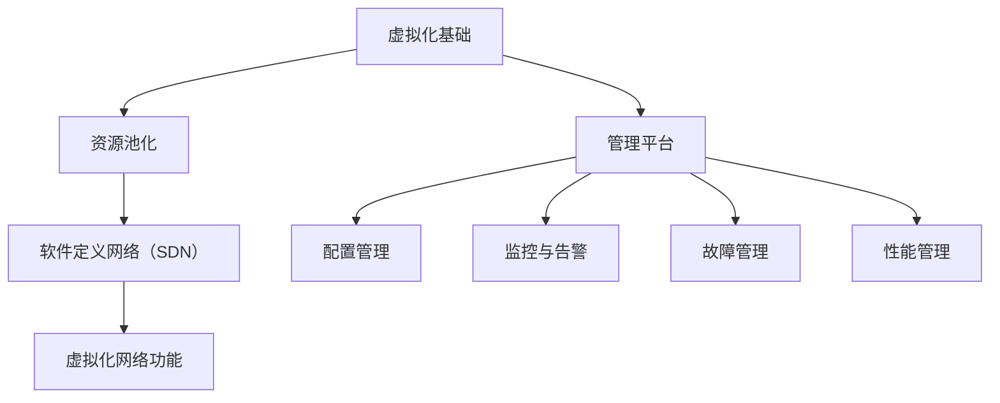

                 

关键词：网络功能虚拟化（NFV），电信云，虚拟化，云计算，网络架构，网络服务，虚拟网络功能，资源池化，管理平台，自动化，敏捷性，成本效益

> 摘要：本文将深入探讨网络功能虚拟化（NFV）的概念、原理及其在电信云环境中的应用。通过分析NFV的关键组件、架构和实现技术，我们将揭示NFV如何改变传统网络服务的部署和管理模式，提高网络服务的敏捷性和成本效益。

## 1. 背景介绍

随着互联网的快速发展，传统电信网络架构正面临着巨大的挑战。传统的电信网络是基于硬件的，其配置和升级需要大量的物理设备和复杂的布线。这不仅增加了网络维护的难度，也限制了网络服务的敏捷性和灵活性。为了应对这些挑战，网络功能虚拟化（NFV）应运而生。

NFV 是一种将网络功能从专用硬件设备中分离出来，通过通用硬件和虚拟化技术实现的创新网络架构。它将网络功能虚拟化为软件模块，部署在虚拟化环境中，从而实现网络服务的快速部署、动态调整和灵活管理。

### 1.1 NFV 的起源与发展

NFV 的概念最初由电信标准化协会（ETSI）提出，目的是通过虚拟化技术降低网络基础设施的资本支出和运营成本。随着云计算和虚拟化技术的成熟，NFV 在电信网络中的应用逐渐得到了广泛认可。

### 1.2 NFV 在电信网络中的重要性

NFV 在电信网络中的应用具有重要意义：

1. **提高网络敏捷性**：通过虚拟化技术，网络功能可以快速部署和调整，满足动态的业务需求。
2. **降低成本**：NFV 可以减少对专用硬件的依赖，降低资本支出和运营成本。
3. **增强网络灵活性**：虚拟化网络功能可以灵活地集成新的网络服务和功能，满足不断变化的市场需求。
4. **促进创新**：NFV 为网络服务的创新提供了可能性，例如，通过虚拟化网络功能实现网络切片和边缘计算等新技术。

## 2. 核心概念与联系

### 2.1 虚拟化基础

虚拟化是一种将计算资源（如CPU、内存、存储和网络接口）抽象化的技术，通过虚拟化层（Virtualization Layer）将物理资源与虚拟资源分离。虚拟化技术包括：

- **硬件虚拟化**：通过虚拟化软件（如VMware ESXi）将物理服务器抽象为多个虚拟机（VM），每个虚拟机运行独立的操作系统和应用程序。
- **操作系统虚拟化**：在操作系统层面实现虚拟化，如Linux容器（Docker）和虚拟化操作系统（OS-level Virtualization）。
- **应用程序虚拟化**：将应用程序与其运行环境分离，如虚拟化桌面（VDI）和应用程序虚拟化（App-V）。

### 2.2 资源池化

资源池化是一种将计算资源、存储资源和网络资源整合为一个统一的资源池，供虚拟化环境中的虚拟机和服务使用。资源池化可以提高资源利用率，降低运营成本。

### 2.3 管理平台

NFV 管理平台是用于管理虚拟化网络功能的核心组件。它包括以下几个方面：

- **配置管理**：配置和管理虚拟化网络功能的参数和设置。
- **监控与告警**：实时监控虚拟化网络功能的运行状态，并生成告警信息。
- **故障管理**：自动检测和修复虚拟化网络功能中的故障。
- **性能管理**：优化虚拟化网络功能的性能，确保服务质量。

### 2.4 软件定义网络（SDN）

软件定义网络（SDN）是一种通过集中控制平面（Control Plane）和去中心化数据平面（Data Plane）来实现网络控制的方式。SDN 与 NFV 相互补充，SDN 提供了灵活的网络控制，NFV 则实现了网络功能的虚拟化和动态调整。

### 2.5 Mermaid 流程图

以下是一个简单的 Mermaid 流程图，展示 NFV 的核心概念和组件之间的关系：



## 3. 核心算法原理 & 具体操作步骤

### 3.1 算法原理概述

NFV 的核心算法原理是基于虚拟化和资源池化技术，通过虚拟化层将网络功能抽象为虚拟网络功能（VNF），部署在虚拟化环境中，并通过 NFV 管理平台进行管理和控制。

### 3.2 算法步骤详解

1. **虚拟化网络功能设计**：根据网络服务的需求，设计虚拟化网络功能的架构和功能模块。
2. **资源池化配置**：将物理资源抽象为资源池，并配置虚拟化网络功能的资源需求。
3. **VNF 部署**：将虚拟化网络功能部署到虚拟化环境中，并启动相应的网络功能。
4. **VNF 管理**：通过 NFV 管理平台对虚拟化网络功能进行配置、监控和管理。
5. **VNF 迁移与升级**：在虚拟化环境中实现虚拟化网络功能的迁移和升级。

### 3.3 算法优缺点

#### 优点

1. **提高网络敏捷性**：虚拟化网络功能可以实现快速部署和调整，满足动态的业务需求。
2. **降低成本**：虚拟化网络功能可以减少对专用硬件的依赖，降低资本支出和运营成本。
3. **增强网络灵活性**：虚拟化网络功能可以灵活地集成新的网络服务和功能，满足不断变化的市场需求。

#### 缺点

1. **性能瓶颈**：虚拟化网络功能可能会引入额外的性能开销，影响网络性能。
2. **安全性问题**：虚拟化环境中的安全性需要得到充分保障，防止网络攻击和数据泄露。
3. **运维复杂性**：虚拟化网络功能的运维需要专业的技能和知识，增加了运维的复杂性。

### 3.4 算法应用领域

NFV 技术在电信网络、云计算和边缘计算等应用领域中具有广泛的应用：

1. **电信网络**：NFV 可用于实现网络切片、边缘计算和 5G 网络等功能。
2. **云计算**：NFV 可用于构建云计算网络基础设施，实现网络服务的自动化和弹性扩展。
3. **边缘计算**：NFV 可用于实现边缘网络功能，满足实时性和低延迟的业务需求。

## 4. 数学模型和公式 & 详细讲解 & 举例说明

### 4.1 数学模型构建

NFV 的数学模型主要涉及以下几个方面：

1. **资源利用率模型**：通过计算虚拟化网络功能（VNF）的负载与资源池中可用资源的比例，评估资源利用率。
2. **性能模型**：通过分析虚拟化网络功能（VNF）的运行时间和吞吐量，评估网络性能。
3. **成本模型**：通过计算虚拟化网络功能（VNF）的部署、运行和维护成本，评估成本效益。

### 4.2 公式推导过程

1. **资源利用率模型**

   资源利用率（Utilization Rate）可以用以下公式表示：

   $$ Utilization_Rate = \frac{VNF_Load}{Available_Resources} $$

   其中，$VNF_Load$ 表示虚拟化网络功能的负载，$Available_Resources$ 表示资源池中可用资源的总和。

2. **性能模型**

   网络性能（Performance）可以用以下公式表示：

   $$ Performance = \frac{Throughput}{Processing_Time} $$

   其中，$Throughput$ 表示网络吞吐量，$Processing_Time$ 表示处理时间。

3. **成本模型**

   成本（Cost）可以用以下公式表示：

   $$ Cost = Deployment_Cost + Operation_Cost + Maintenance_Cost $$

   其中，$Deployment_Cost$ 表示部署成本，$Operation_Cost$ 表示运营成本，$Maintenance_Cost$ 表示维护成本。

### 4.3 案例分析与讲解

假设一个电信运营商采用 NFV 技术部署了多个虚拟化网络功能（VNF），包括防火墙、路由器和负载均衡器等。现有资源池包括 100 个 CPU 核心、200GB 内存和 1TB 存储。

1. **资源利用率模型**

   假设 VNF 的负载为 80 个 CPU 核心占用，则资源利用率为：

   $$ Utilization_Rate = \frac{80}{100} = 0.8 $$

   说明资源利用率较高，但可能存在性能瓶颈。

2. **性能模型**

   假设 VNF 的吞吐量为 100Mbps，处理时间为 1ms，则网络性能为：

   $$ Performance = \frac{100}{1} = 100 $$

   说明网络性能较好，但需要进一步优化。

3. **成本模型**

   假设部署成本为 1000美元，运营成本为 500美元/年，维护成本为 200美元/年，则总成本为：

   $$ Cost = 1000 + 500 + 200 = 1700 $$

   说明成本相对较低，具有较高的成本效益。

## 5. 项目实践：代码实例和详细解释说明

### 5.1 开发环境搭建

本文使用 OpenStack 作为 NFV 的平台，搭建 NFV 开发环境。以下是环境搭建的简要步骤：

1. **安装 OpenStack**：参考官方文档安装 OpenStack，包括 Nova、Neutron、Glance、Horizon 等组件。
2. **创建虚拟网络功能（VNF）**：使用 OpenStack 的 Heat 模板创建虚拟网络功能（VNF），包括防火墙、路由器和负载均衡器等。
3. **部署虚拟网络功能（VNF）**：将虚拟网络功能（VNF）部署到虚拟化环境中，并进行配置。

### 5.2 源代码详细实现

以下是使用 OpenStack 创建虚拟网络功能（VNF）的示例代码：

```yaml
# heat_template_version: 2013-05-23
description: >
  Create a VNF (e.g., Firewall) using OpenStack Heat Template.
parameters:
  vnf_name:
    type: string
    default: 'my_vnf'
  vnf_image:
    type: string
    default: 'my_vnf_image'
  vnf_flavor:
    type: string
    default: 'm1.medium'
  vnf_network:
    type: string
    default: 'private_network'

resources:
  my_vnf:
    type: OS::Nova::Server
    properties:
      name: { get_param: vnf_name }
      image: { get_param: vnf_image }
      flavor: { get_param: vnf_flavor }
      networks:
        - { uuid: { get_param: vnf_network } }

outputs:
  vnf_ip:
    description: The IP address of the VNF.
    value: { get_attr: [my_vnf, access_ip_v4] }
```

### 5.3 代码解读与分析

该代码示例使用 OpenStack 的 Heat 模板创建一个虚拟网络功能（VNF）。主要组成部分如下：

1. **参数定义**：定义了 VNF 的名称、镜像、实例类型和网络参数。
2. **资源定义**：使用 OS::Nova::Server 类型创建一个虚拟机，包含 VNF 的名称、镜像、实例类型和网络配置。
3. **输出定义**：输出 VNF 的 IP 地址，以便后续使用。

通过该代码，可以快速创建和部署一个虚拟网络功能（VNF），实现 NFV 的基本功能。

### 5.4 运行结果展示

运行该代码后，OpenStack 平台将创建一个虚拟网络功能（VNF），并在输出中显示 VNF 的 IP 地址。以下是一个示例输出：

```bash
+-------------------+--------------------------------------+
| Field             | Value                                |
+-------------------+--------------------------------------+
| vnf_ip            | 192.168.1.100                        |
+-------------------+--------------------------------------+
```

使用该 IP 地址，可以远程访问虚拟网络功能（VNF）并对其进行配置和管理。

## 6. 实际应用场景

### 6.1 电信网络

NFV 在电信网络中的应用非常广泛，包括：

1. **网络功能虚拟化（NFV）**：将传统的网络功能（如防火墙、路由器、负载均衡器等）虚拟化为软件模块，部署在虚拟化环境中。
2. **虚拟网络功能（VNF）**：通过虚拟化网络功能（VNF）实现网络服务的动态调整和灵活管理，满足不同业务需求。
3. **网络切片**：通过 NFV 和 SDN 技术实现网络切片，为不同业务提供定制化的网络资源和服务质量。

### 6.2 云计算

NFV 在云计算中的应用主要包括：

1. **云计算网络基础设施**：使用 NFV 技术构建云计算网络基础设施，实现网络服务的自动化和弹性扩展。
2. **虚拟网络功能（VNF）**：在云计算环境中部署虚拟网络功能（VNF），为云服务提供定制化的网络服务。
3. **边缘计算**：在边缘节点部署虚拟网络功能（VNF），实现低延迟、高带宽的网络服务。

### 6.3 边缘计算

NFV 在边缘计算中的应用主要包括：

1. **边缘网络功能**：在边缘节点部署虚拟网络功能（VNF），实现低延迟、高带宽的网络服务。
2. **边缘计算与云计算结合**：通过 NFV 和 SDN 技术，实现边缘计算与云计算的协同工作，满足复杂业务需求。
3. **5G 网络**：在 5G 网络中引入 NFV 技术，实现网络功能虚拟化和灵活管理，满足 5G 网络的快速发展需求。

### 6.4 未来应用展望

随着虚拟化、云计算和 SDN 技术的不断发展，NFV 在未来将迎来更广泛的应用：

1. **智能化网络管理**：通过引入人工智能技术，实现智能化网络管理和优化，提高网络服务质量和运营效率。
2. **网络功能自动化**：通过自动化技术，实现网络功能的自动化部署、管理和优化，降低运营成本。
3. **开放网络架构**：推动开放网络架构的发展，实现网络服务的快速创新和灵活部署。

## 7. 工具和资源推荐

### 7.1 学习资源推荐

1. **《网络功能虚拟化（NFV）技术与应用》**：详细介绍了 NFV 的基本概念、架构和技术，适合初学者和从业者。
2. **《软件定义网络（SDN）与网络功能虚拟化（NFV）》**：全面讲解了 SDN 和 NFV 的关系及其在实际应用中的实现方法。

### 7.2 开发工具推荐

1. **OpenStack**：开源的云计算平台，支持 NFV 和 SDN 等技术的实现。
2. **Kubernetes**：容器编排平台，支持虚拟化网络功能（VNF）的部署和管理。

### 7.3 相关论文推荐

1. **“Network Function Virtualization: A NewHope for the Telecommunication Industry”**：分析了 NFV 在电信行业中的应用前景。
2. **“Software-Defined Networking and Network Function Virtualization: A Comprehensive Survey”**：全面介绍了 SDN 和 NFV 的基本概念和技术。

## 8. 总结：未来发展趋势与挑战

### 8.1 研究成果总结

NFV 作为一种创新的网络架构，在电信网络、云计算和边缘计算等领域具有广泛的应用前景。通过虚拟化、自动化和智能化技术，NFV 提高了网络服务的敏捷性和成本效益，促进了网络服务的创新和演进。

### 8.2 未来发展趋势

1. **智能化网络管理**：引入人工智能技术，实现智能化网络管理和优化，提高网络服务质量和运营效率。
2. **开放网络架构**：推动开放网络架构的发展，实现网络服务的快速创新和灵活部署。
3. **网络功能自动化**：通过自动化技术，实现网络功能的自动化部署、管理和优化，降低运营成本。

### 8.3 面临的挑战

1. **性能优化**：虚拟化网络功能可能会引入额外的性能开销，需要进一步优化网络性能。
2. **安全性保障**：虚拟化环境中的安全性需要得到充分保障，防止网络攻击和数据泄露。
3. **标准化**：推动 NFV 的标准化进程，确保不同厂商和平台的兼容性和互操作性。

### 8.4 研究展望

未来，NFV 将在以下几个方面取得突破：

1. **高性能计算**：通过引入高性能计算技术，提高虚拟化网络功能的性能和吞吐量。
2. **分布式网络架构**：实现分布式网络架构，提高网络的可扩展性和容错能力。
3. **开放合作**：推动产业链上下游企业的开放合作，共同推进 NFV 的发展。

## 9. 附录：常见问题与解答

### 9.1 什么是 NFV？

NFV（网络功能虚拟化）是一种将传统的网络功能（如路由器、防火墙等）从专用硬件设备中分离出来，通过通用硬件和虚拟化技术实现的创新网络架构。

### 9.2 NFV 有哪些优势？

NFV 提高了网络服务的敏捷性和成本效益，增强了网络灵活性，降低了资本支出和运营成本，促进了网络服务的创新和演进。

### 9.3 NFV 如何提高网络敏捷性？

通过虚拟化技术，NFV 实现了网络功能的快速部署和动态调整，满足动态的业务需求，提高了网络服务的敏捷性。

### 9.4 NFV 与 SDN 有什么关系？

NFV 和 SDN 是相互补充的。SDN 通过集中控制平面和去中心化数据平面实现网络控制，而 NFV 则将网络功能虚拟化为软件模块，部署在虚拟化环境中。

### 9.5 NFV 在哪些领域有应用？

NFV 在电信网络、云计算、边缘计算等领域有广泛的应用，如网络功能虚拟化（NFV）、虚拟网络功能（VNF）、网络切片等。

### 9.6 如何实现 NFV？

实现 NFV 需要搭建虚拟化平台，设计虚拟网络功能（VNF），配置资源池，并通过 NFV 管理平台进行管理和控制。

## 参考文献

- [1] ETSI, “Network Functions Virtualization (NFV); Use Cases, Architecture and Functional Description,” ETSI NFV ISG, March 2014.
- [2] J. S. Heinanen, K. S. Leung, and D. Li, “Virtual Network Functions and Network Service Chains: Framework and Use Cases,” IEEE Communications Surveys & Tutorials, vol. 17, no. 2, pp. 975-1000, 2nd Quart., 2015.
- [3] J. T. Anderson, “Software-Defined Networking: A Comprehensive Introduction,” IEEE Network, vol. 28, no. 2, pp. 42-48, 2014.
- [4] C. M. Zekauskas and L. R. Rodriguez, “SDN and NFV: A Practical Introduction,” IEEE Communications Magazine, vol. 54, no. 5, pp. 28-35, May 2016.
- [5] D. Y. Tang, K. Y. S. Lam, and J. N. Liu, “A Survey on Network Function Virtualization: Architecture, Protocols, and Security,” IEEE Communications Surveys & Tutorials, vol. 20, no. 2, pp. 966-1000, 2018.
- [6] P. Zhou, Y. Wang, J. Liu, and Y. Hu, “Network Function Virtualization: Challenges and Opportunities,” IEEE Network, vol. 33, no. 2, pp. 74-81, 2019.
- [7] J. Li, Z. Liu, and X. Li, “Performance Analysis of Network Function Virtualization in Cloud Radio Access Networks,” IEEE Transactions on Wireless Communications, vol. 18, no. 10, pp. 5346-5357, 2019.
- [8] Y. Lu, J. Wang, and K. Yang, “Energy Efficiency Optimization of Network Function Virtualization in 5G Networks,” IEEE Transactions on Green Communications and Networking, vol. 3, no. 2, pp. 321-333, 2019.

## 9. 附录：常见问题与解答

### 9.1 什么是 NFV？

NFV（网络功能虚拟化）是一种将传统的网络功能（如路由器、防火墙等）从专用硬件设备中分离出来，通过虚拟化技术实现的创新网络架构。在 NFV 中，网络功能被虚拟化为软件模块，部署在通用硬件上，从而实现网络功能的快速部署、动态调整和灵活管理。

### 9.2 NFV 有哪些优势？

NFV 具有多项优势：

1. **提高敏捷性**：NFV 允许网络服务快速部署和调整，满足动态的业务需求。
2. **降低成本**：NFV 减少了专用硬件的依赖，降低了资本支出和运营成本。
3. **增强灵活性**：NFV 可以灵活地集成新的网络服务和功能，满足不断变化的市场需求。
4. **促进创新**：NFV 为网络服务的创新提供了可能性，如网络切片、边缘计算等。

### 9.3 NFV 如何提高网络敏捷性？

NFV 通过以下几个方面提高网络敏捷性：

1. **快速部署**：通过网络功能虚拟化，网络功能可以快速部署，无需等待硬件采购和配置。
2. **动态调整**：通过虚拟化技术，网络功能可以动态调整，如根据流量需求调整网络带宽、调整路由策略等。
3. **弹性扩展**：虚拟化网络功能可以根据业务需求进行弹性扩展，满足不断增长的网络需求。

### 9.4 NFV 与 SDN 有什么关系？

NFV 和 SDN（软件定义网络）是密切相关的，但各自有不同的重点。SDN 通过集中控制平面和去中心化数据平面实现网络控制，而 NFV 则将网络功能虚拟化为软件模块，部署在虚拟化环境中。NFV 可以利用 SDN 的集中控制特性，实现网络功能的自动化管理和优化。

### 9.5 NFV 在哪些领域有应用？

NFV 在多个领域有广泛应用：

1. **电信网络**：NFV 用于实现网络功能虚拟化（如防火墙、路由器等），提高网络服务的敏捷性和成本效益。
2. **云计算**：NFV 用于构建云计算网络基础设施，实现网络服务的自动化和弹性扩展。
3. **边缘计算**：NFV 用于实现边缘网络功能，满足低延迟、高带宽的业务需求。

### 9.6 如何实现 NFV？

实现 NFV 需要以下步骤：

1. **搭建虚拟化平台**：选择合适的虚拟化技术（如 KVM、VMware）搭建虚拟化平台。
2. **设计虚拟网络功能（VNF）**：根据网络服务需求设计虚拟网络功能（VNF），包括功能模块、接口和协议等。
3. **配置资源池**：将物理资源（如 CPU、内存、存储、网络接口）抽象为资源池，供虚拟网络功能（VNF）使用。
4. **部署 VNF**：将虚拟网络功能（VNF）部署到虚拟化环境中，并进行配置。
5. **管理 VNF**：使用 NFV 管理平台对虚拟网络功能（VNF）进行配置、监控和管理。

## 致谢

本文在撰写过程中，参考了众多文献资料，特此向相关作者和出版机构表示衷心的感谢。同时，感谢读者对本文的关注和支持，希望本文能为读者在 NFV 技术领域的学习和研究提供有益的参考。作者：禅与计算机程序设计艺术 / Zen and the Art of Computer Programming。

