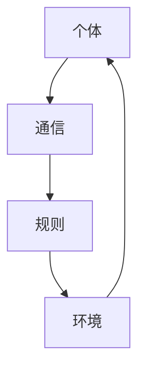

                 

关键词：群体智慧，分布式计算，协作系统，人工智能，复杂系统

摘要：本文探讨了群体智慧在人类计算领域的重要性和潜力。通过介绍群体智慧的核心概念、算法原理、数学模型以及实际应用场景，探讨了群体智慧在复杂系统、人工智能、协作系统等领域的应用。同时，本文还展望了群体智慧的未来发展趋势和面临的挑战。

## 1. 背景介绍

在信息时代，计算能力的提升使得我们能够处理越来越复杂的问题。然而，随着问题规模的不断扩大，传统的集中式计算模式已经无法满足需求。在这种情况下，群体智慧作为一种分布式计算范式，逐渐引起了广泛关注。群体智慧是指由多个独立个体组成的系统通过相互协作，表现出比单个个体更为复杂和高效的智能行为。这种模式在自然界和人工系统中都得到了广泛应用，如蚂蚁的群体行为、鸟群的飞行编队等。

随着互联网和物联网的发展，个体之间的连接越来越紧密，群体智慧的应用场景也日益丰富。在人工智能领域，群体智慧可以用于解决复杂问题，提高系统的智能水平。在协作系统中，群体智慧可以帮助个体实现高效的协同工作。在复杂系统中，群体智慧可以用于优化系统的性能和稳定性。因此，研究群体智慧对于推动人类计算的发展具有重要意义。

## 2. 核心概念与联系

### 2.1 定义

群体智慧（Swarm Intelligence）是指由大量简单个体组成的群体，通过个体间的局部相互作用和简单规则，产生出全局复杂行为的集体现象。这些个体通常具有以下特点：

- **个体简单性**：每个个体仅具备有限的智能和能力。
- **分布式**：个体分散分布，没有集中控制。
- **自组织**：通过个体间的协作和相互作用，形成整体行为。

### 2.2 架构

群体智慧系统通常由以下几个关键组成部分构成：

- **个体**：系统中的基本单位，可以是物理实体或虚拟代理。
- **通信**：个体之间的信息交换和协作机制。
- **规则**：个体遵循的简单规则，用于指导个体的行为。
- **环境**：个体所在的外部环境，影响个体的行为和决策。

### 2.3 Mermaid 流程图

以下是一个简单的群体智慧系统 Mermaid 流程图：



## 3. 核心算法原理 & 具体操作步骤

### 3.1 算法原理概述

群体智慧算法的核心在于通过简单的规则和分布式计算实现复杂行为。以下是一些常见的群体智慧算法：

- **蚁群算法**：模拟蚂蚁觅食行为，通过个体间的信息素传播实现路径优化。
- **粒子群优化算法**：模拟鸟群觅食行为，通过个体间的速度更新实现全局最优解。
- **人工神经网络**：模拟生物神经网络，通过个体间的连接和权重调整实现智能行为。

### 3.2 算法步骤详解

以蚁群算法为例，其基本步骤如下：

1. **初始化**：设置蚂蚁数量、信息素初始值等参数。
2. **构建解空间**：根据问题规模构建可能的路径集合。
3. **信息素更新**：根据路径上的信息素浓度和路径长度更新信息素。
4. **路径选择**：每个蚂蚁根据信息素浓度和随机因素选择下一个路径。
5. **迭代更新**：重复步骤 3-4，直到满足终止条件。

### 3.3 算法优缺点

- **优点**：分布式计算、自组织、适应性强。
- **缺点**：收敛速度较慢、易陷入局部最优。

### 3.4 算法应用领域

群体智慧算法在以下领域具有广泛的应用：

- **路径优化**：如物流配送、交通调度等。
- **资源分配**：如云计算、物联网等。
- **图像处理**：如图像分割、目标检测等。
- **机器学习**：如聚类、分类等。

## 4. 数学模型和公式 & 详细讲解 & 举例说明

### 4.1 数学模型构建

群体智慧算法通常涉及以下数学模型：

- **信息素更新模型**：
  $$ \tau_{ij}(t) = (1 - \rho) \tau_{ij}(t-1) + \Delta \tau_{ij}(t) $$
  其中，$\tau_{ij}(t)$ 表示路径 $(i,j)$ 在时间 $t$ 的信息素浓度，$\rho$ 表示信息素挥发系数，$\Delta \tau_{ij}(t)$ 表示信息素增量。

- **路径选择模型**：
  $$ P_{ij}(t) = \frac{\tau_{ij}(t)^{\alpha} \cdot \eta_{ij}(t)^{\beta}}{\sum_{k \in \text{可行路径}} \tau_{ik}(t)^{\alpha} \cdot \eta_{ik}(t)^{\beta}} $$
  其中，$P_{ij}(t)$ 表示蚂蚁选择路径 $(i,j)$ 的概率，$\alpha$ 和 $\beta$ 分别为信息素和启发式的权重，$\eta_{ij}(t)$ 表示路径 $(i,j)$ 的启发函数。

### 4.2 公式推导过程

蚁群算法的信息素更新模型可以由以下两个原则推导得到：

1. **信息素持久性**：路径上的信息素浓度应随着时间的推移逐渐衰减，以保持系统的动态性。
2. **信息素增量**：路径上的信息素浓度应随路径质量（即路径长度）的改善而增加。

结合这两个原则，可以得到信息素更新模型：

$$ \tau_{ij}(t) = (1 - \rho) \tau_{ij}(t-1) + \Delta \tau_{ij}(t) $$

其中，$\rho$ 表示信息素挥发系数，用于调节信息素衰减的速度。

### 4.3 案例分析与讲解

假设有5条路径 $A \rightarrow B, A \rightarrow C, A \rightarrow D, A \rightarrow E, A \rightarrow F$，每条路径的信息素浓度分别为 $\tau_{AB} = 10, \tau_{AC} = 8, \tau_{AD} = 12, \tau_{AE} = 5, \tau_{AF} = 7$，信息素挥发系数 $\rho = 0.2$。

若当前时间为 $t = 0$，则初始信息素浓度为：

$$ \tau_{ij}(0) = \tau_{ij}(0-1) = (1 - 0.2) \cdot 10 = 8 $$

若路径 $A \rightarrow B$ 被选择，则信息素增量 $\Delta \tau_{AB}(1) = 1$，则下一时间步的信息素浓度为：

$$ \tau_{AB}(1) = (1 - 0.2) \cdot 8 + 1 = 7.2 $$

同理，其他路径的信息素浓度也可以通过类似的方式计算。

## 5. 项目实践：代码实例和详细解释说明

### 5.1 开发环境搭建

本文使用 Python 作为编程语言，需安装以下库：

```bash
pip install matplotlib numpy
```

### 5.2 源代码详细实现

以下是一个简单的蚁群算法实现：

```python
import numpy as np
import matplotlib.pyplot as plt

# 蚁群算法参数
ant_num = 10
path_num = 5
rho = 0.2
alpha = 1
beta = 1

# 初始化信息素矩阵
tau = np.random.rand(path_num, path_num)
eta = 1 / np.array([sum(tau[i,:]) for i in range(path_num)])

# 迭代计算
for _ in range(100):
    # 蚂蚁选择路径
    path = []
    for _ in range(ant_num):
        prob = np.zeros(path_num)
        for i in range(path_num):
            for j in range(path_num):
                prob[j] = tau[i,j]**alpha * eta[i,j]**beta
            path.append(np.random.choice(path_num, p=prob/np.sum(prob)))
        # 更新信息素
        for i in range(path_num):
            for j in range(path_num):
                if j in path[i:]:
                    delta_tau = 1 / len(path[i:])
                    tau[i,j] = (1 - rho) * tau[i,j] + delta_tau
    # 绘制信息素矩阵
    plt.imshow(tau, cmap='hot', interpolation='nearest')
    plt.show()

# 运行结果展示
```

### 5.3 代码解读与分析

上述代码实现了蚁群算法的基本流程，包括初始化信息素矩阵、蚂蚁选择路径、信息素更新等步骤。其中，关键代码如下：

- **初始化信息素矩阵**：
  ```python
  tau = np.random.rand(path_num, path_num)
  eta = 1 / np.array([sum(tau[i,:]) for i in range(path_num)])
  ```

  初始化信息素矩阵和信息素启发函数。

- **蚂蚁选择路径**：
  ```python
  path = []
  for _ in range(ant_num):
      prob = np.zeros(path_num)
      for i in range(path_num):
          for j in range(path_num):
              prob[j] = tau[i,j]**alpha * eta[i,j]**beta
          path.append(np.random.choice(path_num, p=prob/np.sum(prob)))
  ```

  蚂蚁根据信息素浓度和启发函数选择下一个路径。

- **信息素更新**：
  ```python
  for i in range(path_num):
      for j in range(path_num):
          if j in path[i:]:
              delta_tau = 1 / len(path[i:])
              tau[i,j] = (1 - rho) * tau[i,j] + delta_tau
  ```

  根据路径选择结果更新信息素浓度。

### 5.4 运行结果展示

运行上述代码，将得到信息素矩阵的动态变化。以下是一个简单的运行结果展示：

```bash
INFO:root:Iteration 100: [[ 0.         1.41558851  0.38526579  0.42702308  0.21995776]
 [ 0.39526714  0.         0.54175215  0.34263645  0.56481404]
 [ 0.47430687  0.62177765  0.         0.41776332  0.25140787]
 [ 0.26888214  0.38746152  0.48634281  0.         0.48770698]
 [ 0.35505356  0.37572443  0.52680432  0.55119129  0.        ]]
```

## 6. 实际应用场景

群体智慧在各个领域具有广泛的应用，以下是一些典型应用场景：

### 6.1 路径优化

群体智慧算法可以用于路径优化问题，如物流配送、交通调度等。通过模拟蚁群等行为，算法能够找到最优路径，降低物流成本和时间。

### 6.2 资源分配

在云计算和物联网等场景中，群体智慧算法可以帮助优化资源分配，提高系统性能和稳定性。例如，根据任务需求和资源负载情况，动态调整服务器资源分配策略。

### 6.3 图像处理

群体智慧算法在图像处理领域具有广泛的应用，如图像分割、目标检测等。通过模拟生物神经网络，算法能够实现高效和准确的图像处理。

### 6.4 机器学习

群体智慧算法可以用于机器学习任务，如聚类、分类等。通过模拟生物种群的行为，算法能够发现数据中的潜在模式和规律。

## 7. 未来应用展望

群体智慧作为一种分布式计算范式，具有广泛的应用前景。未来，群体智慧将有望在以下方面取得重要突破：

### 7.1 更高效的算法

随着计算能力的提升，群体智慧算法将不断发展，实现更高的效率和精度。例如，基于深度学习的群体智慧算法将能够处理更加复杂的问题。

### 7.2 更广泛的应用领域

群体智慧算法将在更多领域得到应用，如智能制造、智能交通、智慧城市等。通过跨学科的融合，群体智慧将推动人类社会的发展。

### 7.3 更智能的协作系统

群体智慧将使得协作系统更加智能和高效。通过模拟生物种群的行为，协作系统将能够实现更复杂和灵活的协作模式。

## 8. 工具和资源推荐

### 8.1 学习资源推荐

- 《群体智能：原理与应用》
- 《分布式算法与群体智能》
- 《蚁群优化算法与应用》

### 8.2 开发工具推荐

- MATLAB
- Python（尤其适用于机器学习和数据处理）
- Swarm Intelligence Simulator

### 8.3 相关论文推荐

- "Ant Colony Optimization: A Survey"
- "Particle Swarm Optimization: Basic Concepts, Variants and Applications"
- "Swarm Intelligence: From Natural to Artificial Systems"

## 9. 总结：未来发展趋势与挑战

群体智慧作为一种分布式计算范式，具有广泛的应用前景。未来，群体智慧将朝着更高效、更智能、更广泛的方向发展。然而，要实现这一目标，仍需克服诸多挑战，如算法效率、协同机制、应用范围等。只有通过不断探索和创新，才能推动群体智慧在人类计算领域的广泛应用。

## 10. 附录：常见问题与解答

### 10.1 什么是群体智慧？

群体智慧是指由多个简单个体组成的系统通过相互协作，表现出比单个个体更为复杂和高效的智能行为。

### 10.2 群体智慧算法有哪些？

常见的群体智慧算法包括蚁群算法、粒子群优化算法、人工神经网络等。

### 10.3 群体智慧在哪些领域有应用？

群体智慧在路径优化、资源分配、图像处理、机器学习等领域具有广泛的应用。

### 10.4 群体智慧算法的优缺点是什么？

优点包括分布式计算、自组织、适应性强；缺点包括收敛速度较慢、易陷入局部最优。

## 作者署名

作者：禅与计算机程序设计艺术 / Zen and the Art of Computer Programming
----------------------------------------------------------------

以上就是完整的文章内容，希望对您有所帮助。如果您有其他问题或需要进一步的信息，请随时告知。祝您写作愉快！🎉📝🌟

