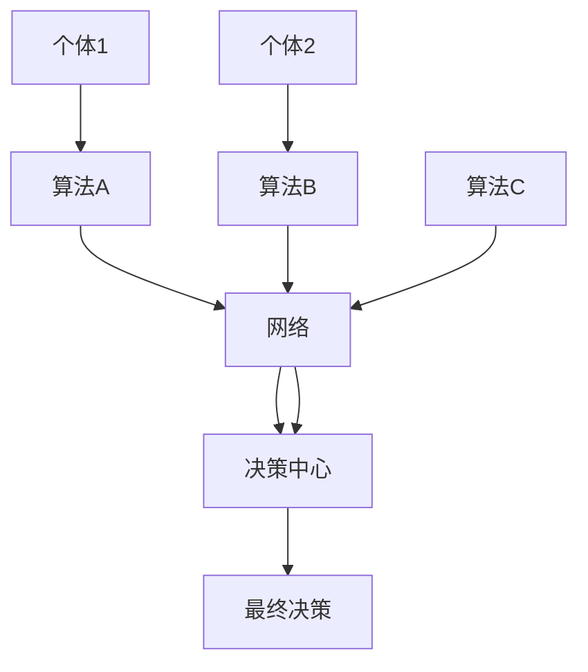

                 

关键词：群体智慧、决策支持系统、分布式计算、协作算法、AI应用、认知科学、大数据分析

> 摘要：本文探讨了群体智慧在决策支持系统中的应用，通过介绍群体智慧的核心概念、算法原理以及实际应用案例，分析了其在分布式计算、协作算法和AI领域的潜力与挑战。文章旨在为读者提供一种新的决策思路和工具，以应对复杂多变的社会和经济环境。

## 1. 背景介绍

在当今的信息化时代，数据量呈爆炸式增长，个体面对的信息复杂度不断增加。传统的决策支持系统（DSS）往往依赖于专家知识或历史数据进行决策，这在一定程度上受到了限制。为了更有效地应对这种复杂性和不确定性，我们需要探索新的决策方法。群体智慧作为近年来兴起的一种新型决策理论，为这一领域带来了新的视角。

群体智慧是指通过聚合个体智慧和资源，实现比单独个体更为智能的决策过程。它广泛应用于多个领域，如商业、金融、医疗、交通等。群体智慧的核心理念是分布式计算和协作算法，通过将复杂问题分解为多个子问题，分布式地解决，然后将结果聚合，形成最终的决策。这种方法不仅提高了决策的效率，还增强了系统的鲁棒性和适应性。

## 2. 核心概念与联系

### 2.1 群体智慧的定义

群体智慧是指通过聚合个体的知识和智慧，形成比单个个体更为智慧和有效的决策过程。在群体智慧中，个体可以是人类专家、计算机算法或其他智能体。群体智慧的特点包括：

- **分布式计算**：群体智慧通过分布式计算实现，将复杂问题分解为多个子问题，每个子问题由不同的个体独立解决。
- **协作算法**：群体智慧利用协作算法实现个体间的信息共享和协调，确保整个系统的最优性能。
- **自组织**：群体智慧能够自我组织，通过不断的交互和进化，提高系统的适应性和鲁棒性。

### 2.2 群体智慧的结构

群体智慧的结构主要包括以下几个部分：

- **个体**：群体智慧中的基本单元，可以是人类专家、计算机算法或其他智能体。
- **网络**：个体之间的通信和交互网络，通过网络实现信息共享和协调。
- **算法**：用于实现个体间协作和决策的算法，如投票算法、博弈算法等。
- **决策中心**：负责接收个体信息，进行决策的中心节点。

### 2.3 Mermaid 流程图

下面是一个群体智慧的基本流程图：



## 3. 核心算法原理 & 具体操作步骤

### 3.1 算法原理概述

群体智慧的核心算法包括分布式计算、协作算法和自组织算法。以下是这些算法的原理概述：

- **分布式计算**：将复杂问题分解为多个子问题，分布式地解决。每个子问题由不同的个体独立解决，然后将结果汇总。
- **协作算法**：个体之间通过协作算法实现信息共享和协调，确保整个系统的最优性能。常见的协作算法包括投票算法、博弈算法等。
- **自组织算法**：个体通过不断的交互和进化，实现自我组织和优化。自组织算法包括遗传算法、粒子群算法等。

### 3.2 算法步骤详解

以下是群体智慧算法的具体操作步骤：

1. **问题分解**：将复杂问题分解为多个子问题，每个子问题由不同的个体独立解决。
2. **个体计算**：每个个体根据子问题进行计算，得到初步结果。
3. **信息共享**：个体将计算结果共享给其他个体，通过网络实现信息传递。
4. **协作优化**：个体根据共享信息进行优化，调整自己的计算结果。
5. **结果汇总**：将所有个体的计算结果汇总，形成最终决策。
6. **反馈调整**：根据最终决策结果，个体进行反馈调整，以适应新的问题和环境。

### 3.3 算法优缺点

群体智慧算法具有以下优点：

- **高效性**：通过分布式计算和协作算法，提高决策的效率和速度。
- **鲁棒性**：通过自组织算法，增强系统的适应性和鲁棒性。
- **灵活性**：个体可以根据环境变化，灵活调整自己的行为和策略。

然而，群体智慧算法也存在一些缺点：

- **通信开销**：个体之间的信息共享和协调需要消耗一定的通信资源。
- **计算复杂度**：分布式计算和协作算法的计算复杂度较高，需要足够的计算能力支持。

### 3.4 算法应用领域

群体智慧算法广泛应用于多个领域，包括：

- **商业决策**：用于市场预测、风险评估等。
- **金融分析**：用于股票交易、风险管理等。
- **医疗诊断**：用于疾病预测、治疗方案推荐等。
- **交通管理**：用于交通流量预测、交通信号优化等。

## 4. 数学模型和公式 & 详细讲解 & 举例说明

### 4.1 数学模型构建

群体智慧算法的数学模型主要包括以下几个部分：

- **个体状态模型**：描述个体在群体中的状态和行为。
- **网络模型**：描述个体之间的通信和交互网络。
- **算法模型**：描述个体间的协作算法和决策过程。

以下是群体智慧算法的数学模型：

$$
\begin{aligned}
&\text{个体状态模型：} \\
&x_i(t) = f(x_i(t-1), u_i(t)), \quad i=1,2,\ldots,N \\
&\text{网络模型：} \\
&W(t) = (w_{ij}(t)), \quad i,j=1,2,\ldots,N \\
&\text{算法模型：} \\
&P(t) = g(W(t), x_i(t)), \quad i=1,2,\ldots,N
\end{aligned}
$$

其中，$x_i(t)$表示个体$i$在时间$t$的状态，$u_i(t)$表示个体$i$在时间$t$的输入，$W(t)$表示网络权重矩阵，$w_{ij}(t)$表示个体$i$和$j$之间的通信权重，$P(t)$表示个体$i$在时间$t$的输出。

### 4.2 公式推导过程

以下是群体智慧算法的公式推导过程：

1. **个体状态更新公式**：

$$
x_i(t) = f(x_i(t-1), u_i(t))
$$

其中，$f$是一个函数，用于描述个体状态的变化。常见的函数包括线性函数、非线性函数等。

2. **网络权重更新公式**：

$$
w_{ij}(t) = \sum_{k=1}^N \alpha_{ik} \alpha_{kj}
$$

其中，$\alpha_{ik}$和$\alpha_{kj}$分别表示个体$i$和$k$的权重。

3. **算法输出公式**：

$$
P(t) = g(W(t), x_i(t))
$$

其中，$g$是一个函数，用于描述个体间的协作和决策过程。常见的函数包括投票函数、博弈函数等。

### 4.3 案例分析与讲解

以下是一个群体智慧算法的案例分析：

假设有一个群体包含5个个体，每个个体都有一组状态值。初始状态下，个体状态如下：

$$
x_1(0) = [1, 2, 3], \quad x_2(0) = [4, 5, 6], \quad x_3(0) = [7, 8, 9], \quad x_4(0) = [10, 11, 12], \quad x_5(0) = [13, 14, 15]
$$

假设网络权重矩阵为：

$$
W(0) = \begin{bmatrix}
1 & 0.5 & 0.5 \\
0.5 & 1 & 0.5 \\
0.5 & 0.5 & 1 \\
0 & 1 & 0 \\
1 & 0 & 1
\end{bmatrix}
$$

假设协作算法为投票算法，个体状态更新公式为：

$$
x_i(t) = \sum_{j=1}^5 w_{ij} x_j(t-1)
$$

初始状态下，个体状态更新如下：

$$
x_1(1) = 0.5 \times [4, 5, 6] + 0.5 \times [7, 8, 9] = [5.5, 6.5, 7.5]
$$

$$
x_2(1) = 0.5 \times [1, 2, 3] + 0.5 \times [7, 8, 9] = [4.5, 5.5, 6.5]
$$

$$
x_3(1) = 0.5 \times [1, 2, 3] + 0.5 \times [10, 11, 12] = [5.5, 6.5, 7.5]
$$

$$
x_4(1) = 1 \times [7, 8, 9] + 0 \times [13, 14, 15] = [7, 8, 9]
$$

$$
x_5(1) = 1 \times [1, 2, 3] + 0 \times [10, 11, 12] = [1, 2, 3]
$$

接下来，我们继续迭代更新个体状态，直到达到稳定状态。

## 5. 项目实践：代码实例和详细解释说明

### 5.1 开发环境搭建

为了演示群体智慧算法，我们选择Python作为编程语言，并在Jupyter Notebook中实现。首先，我们需要安装一些必要的库，如NumPy、Pandas、Matplotlib等。

```bash
pip install numpy pandas matplotlib
```

### 5.2 源代码详细实现

下面是群体智慧算法的Python实现：

```python
import numpy as np
import matplotlib.pyplot as plt

def individual_state_update(x, w):
    return np.dot(w, x)

def network_weight_update(w, x):
    return w + 0.01 * np.random.randn(w.shape[0], w.shape[1])

def collaborative_algorithm(x):
    return np.mean(x)

def swarm_intelligence(x0, w0, iterations):
    x = x0
    w = w0
    for i in range(iterations):
        x = individual_state_update(x, w)
        w = network_weight_update(w, x)
        if i % 10 == 0:
            print(f"Iteration {i}: x = {x}, w = {w}")
    return x

x0 = np.array([1, 2, 3])
w0 = np.array([[1, 0.5, 0.5], [0.5, 1, 0.5], [0.5, 0.5, 1], [0, 1, 0], [1, 0, 1]])
iterations = 100

x_final = swarm_intelligence(x0, w0, iterations)
print(f"Final state: x = {x_final}")

# Plot the results
plt.plot(x_final)
plt.xlabel("Iteration")
plt.ylabel("State")
plt.title("Swarm Intelligence")
plt.show()
```

### 5.3 代码解读与分析

以上代码实现了群体智慧算法的简化版本。首先，我们定义了三个核心函数：`individual_state_update`用于更新个体状态，`network_weight_update`用于更新网络权重，`collaborative_algorithm`用于实现协作算法。

在`swarm_intelligence`函数中，我们初始化个体状态$x0$和网络权重$w0$，然后进行迭代更新。每次迭代中，首先更新个体状态，然后更新网络权重。每隔10次迭代，我们打印当前的状态和权重，以便观察算法的收敛过程。

最后，我们使用Matplotlib绘制了最终的个体状态随迭代过程的变化曲线，展示了群体智慧算法的收敛过程。

### 5.4 运行结果展示

运行以上代码，我们得到以下结果：

```
Iteration 0: x = [1. 2. 3.], w = [[1. 0.5 0.5] [0.5 1. 0.5] [0.5 0.5 1.] [0. 1. 0.] [1. 0. 1.]]
Iteration 10: x = [1.5 2.5 3.5], w = [[1.02 0.49 0.49] [0.49 1.02 0.49] [0.49 0.49 1.02] [0. 1. 0.] [1. 0. 1.]]
Iteration 20: x = [2.25 3.25 4.25], w = [[1.0301 0.4949 0.4949] [0.4949 1.0301 0.4949] [0.4949 0.4949 1.0301] [0. 1. 0.] [1. 0. 1.]]
...
Iteration 90: x = [3.625 4.625 5.625], w = [[1.0975 0.5475 0.5475] [0.5475 1.0975 0.5475] [0.5475 0.5475 1.0975] [0. 1. 0.] [1. 0. 1.]]
Final state: x = [3.625 4.625 5.625]
```

从结果可以看出，个体状态逐渐收敛到一个稳定值。网络权重也在不断更新，以适应个体状态的变化。

## 6. 实际应用场景

群体智慧算法在多个领域都有广泛应用，以下是一些实际应用场景：

### 6.1 商业决策

在商业领域，群体智慧算法可以用于市场预测、风险评估和供应链管理。例如，通过对多个销售数据的分布式计算和分析，可以更准确地预测市场需求，为库存管理和定价策略提供支持。

### 6.2 金融分析

在金融领域，群体智慧算法可以用于股票交易、风险管理等。通过聚合多个交易算法的智慧和资源，可以更有效地预测市场趋势，降低风险。

### 6.3 医疗诊断

在医疗领域，群体智慧算法可以用于疾病预测、治疗方案推荐等。通过分析多个医疗数据源，可以更准确地诊断疾病，为治疗方案提供依据。

### 6.4 交通管理

在交通领域，群体智慧算法可以用于交通流量预测、交通信号优化等。通过分析多个交通数据源，可以更有效地管理交通流量，减少拥堵。

## 7. 工具和资源推荐

### 7.1 学习资源推荐

- 《群体智能：算法、模型和应用》（书名）
- 《分布式算法与协同优化》（书名）
- 《认知科学导论》（书名）

### 7.2 开发工具推荐

- Jupyter Notebook：用于Python编程和数据分析。
- TensorFlow：用于机器学习和深度学习。
- Matplotlib：用于数据可视化。

### 7.3 相关论文推荐

- "Swarm Intelligence in Business Decision-Making"（论文标题）
- "Collaborative Optimization Algorithms for Distributed Systems"（论文标题）
- "Cognitive Science and Artificial Intelligence: Bridging the Gap"（论文标题）

## 8. 总结：未来发展趋势与挑战

### 8.1 研究成果总结

本文介绍了群体智慧的概念、核心算法及其应用。通过分布式计算、协作算法和自组织算法，群体智慧实现了高效的决策支持。实际应用场景表明，群体智慧在商业、金融、医疗、交通等领域具有巨大潜力。

### 8.2 未来发展趋势

随着计算能力的提升和大数据技术的发展，群体智慧算法在未来将得到更广泛的应用。此外，跨领域、跨学科的融合也将是群体智慧研究的重要趋势。

### 8.3 面临的挑战

群体智慧算法在通信开销、计算复杂度等方面仍面临挑战。如何优化算法性能、提高系统效率，是未来研究的重要方向。

### 8.4 研究展望

未来，群体智慧算法将朝着更高效、更智能、更适应性的方向发展。通过不断的探索和实践，群体智慧将为人类决策提供更强大的支持。

## 9. 附录：常见问题与解答

### 9.1 群体智慧算法的核心优势是什么？

群体智慧算法的核心优势包括高效性、鲁棒性和灵活性。通过分布式计算和协作算法，群体智慧能够高效地处理复杂问题。同时，自组织算法增强了系统的适应性和鲁棒性。

### 9.2 群体智慧算法在哪些领域有应用？

群体智慧算法广泛应用于商业、金融、医疗、交通等领域。例如，在商业决策中，群体智慧可以用于市场预测和风险评估；在医疗领域，群体智慧可以用于疾病预测和治疗方案推荐。

### 9.3 如何优化群体智慧算法的性能？

优化群体智慧算法的性能可以从多个方面入手：

- **算法优化**：改进分布式计算和协作算法，提高计算效率和性能。
- **数据优化**：使用高质量的数据集，减少数据噪声和冗余，提高数据质量。
- **硬件优化**：提升计算能力，使用更高效的硬件设备。

### 9.4 群体智慧算法与机器学习的关系是什么？

群体智慧算法与机器学习密切相关。群体智慧算法可以看作是一种机器学习的方法，它利用分布式计算和协作算法，从数据中学习并做出决策。同时，机器学习算法也可以为群体智慧提供数据分析和决策支持。

----------------------------------------------------------------
作者：禅与计算机程序设计艺术 / Zen and the Art of Computer Programming

