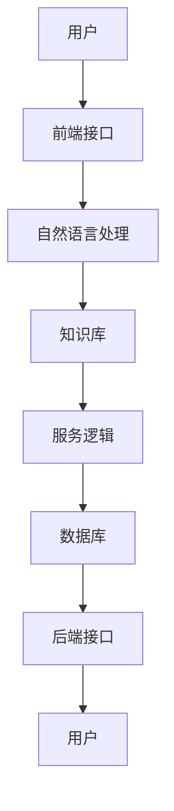

                 

关键词：聊天机器人、公共服务、政府、社区、人工智能、互动、AI技术、数据管理、用户体验、技术应用案例、未来展望

> 摘要：本文深入探讨了聊天机器人作为公共服务在政府和社区互动中的应用，分析了其技术原理、实现方法、应用场景及未来发展。通过对核心概念、算法原理、数学模型和项目实践的详细讲解，本文为读者提供了一个全面的技术指南，以促进政府和社区之间更加高效、便捷的互动。

## 1. 背景介绍

随着人工智能技术的快速发展，聊天机器人已经成为现代信息技术中不可或缺的一部分。它们在商业、教育、医疗等多个领域展现出了强大的应用潜力。然而，在政府和社区互动中，聊天机器人的应用同样具有巨大的价值和意义。

首先，政府和社区之间的互动是公共管理的重要组成部分。传统的面对面交流或电话沟通方式在效率、覆盖范围和成本控制方面存在一定的局限。而聊天机器人作为一种智能化的沟通工具，可以弥补这些不足，实现全天候、全方位的服务。

其次，随着数据量的激增和数据管理的复杂性增加，政府需要更高效、更准确的方式来处理和分析这些数据。聊天机器人可以利用自然语言处理（NLP）和机器学习（ML）等技术，对大量的用户数据进行分析，提供精准的服务和建议。

最后，用户需求的多样化也要求政府提供更加个性化和智能化的服务。聊天机器人可以理解用户的语言意图，根据用户的需求提供相应的解决方案，从而提高用户体验。

## 2. 核心概念与联系

### 2.1 聊天机器人的定义

聊天机器人（Chatbot）是一种通过文本或语音与用户进行交互的计算机程序。它们利用自然语言处理（NLP）、机器学习（ML）和语音识别（VR）等技术，模拟人类对话，实现自动化沟通和服务。

### 2.2 公共服务的定义

公共服务是指政府或其他公共机构为了满足社会公众的基本需求，提供的各种服务，包括但不限于社会福利、教育、医疗、交通、环境保护等。

### 2.3 聊天机器人在政府公共服务中的应用

聊天机器人在政府公共服务中的应用可以分为以下几个方面：

1. **信息查询与发布**：聊天机器人可以实时回答用户关于政府政策、法规、办事流程等方面的问题，提供即时的信息查询服务。

2. **咨询与建议**：聊天机器人可以根据用户的输入，提供个性化的咨询和建议，如健康咨询、法律援助、心理辅导等。

3. **业务办理**：聊天机器人可以协助用户完成一些简单的业务办理，如预约挂号、缴纳费用、办理证件等。

4. **数据分析与反馈**：聊天机器人可以收集用户反馈，对政府服务进行数据分析，为政府决策提供参考。

### 2.4 架构图解

以下是一个简单的聊天机器人公共服务架构图：



### 2.5 聊天机器人的核心技术与原理

- **自然语言处理（NLP）**：NLP 是聊天机器人的核心技术之一，它使计算机能够理解、解析和生成自然语言。主要技术包括词性标注、句法分析、语义理解等。

- **机器学习（ML）**：ML 是聊天机器人实现智能化的基础，通过训练模型，使机器人能够学习用户的语言习惯和需求，提供更加个性化的服务。

- **语音识别（VR）**：VR 技术使聊天机器人能够接受用户的语音输入，并将其转化为文本，进一步处理。

## 3. 核心算法原理 & 具体操作步骤

### 3.1 算法原理概述

聊天机器人的核心算法主要包括自然语言处理（NLP）和机器学习（ML）。NLP 主要负责理解和生成自然语言，ML 则负责从数据中学习，提升聊天机器人的智能化程度。

### 3.2 算法步骤详解

1. **用户输入处理**：用户通过文本或语音输入问题或指令。

2. **自然语言处理**：NLP 技术对用户输入进行处理，包括分词、词性标注、句法分析等。

3. **意图识别**：根据处理结果，聊天机器人识别用户的意图。

4. **知识库查询**：聊天机器人根据识别到的意图，在知识库中查找相关的答案或建议。

5. **生成回复**：基于查询结果，聊天机器人生成回复，并通过自然语言处理将其转化为用户可以理解的文本或语音。

6. **反馈处理**：用户对聊天机器人的回复进行评价，聊天机器人根据反馈进行自我学习和优化。

### 3.3 算法优缺点

- **优点**：聊天机器人可以实现24/7全天候服务，提高工作效率，降低人力成本。

- **缺点**：聊天机器人在处理复杂问题或进行深度对话时，可能存在理解误差，需要不断优化和改进。

### 3.4 算法应用领域

聊天机器人广泛应用于金融、电商、客服、教育、医疗等多个领域。在政府和社区互动中，聊天机器人可以提供多种服务，如政策咨询、办事指南、健康咨询等。

## 4. 数学模型和公式 & 详细讲解 & 举例说明

### 4.1 数学模型构建

聊天机器人的核心算法涉及多种数学模型，如隐马尔可夫模型（HMM）、条件概率模型、神经网络等。以下是一个简单的条件概率模型示例：

$$
P(A|B) = \frac{P(B|A) \cdot P(A)}{P(B)}
$$

其中，\(P(A|B)\) 表示在事件 \(B\) 发生的条件下事件 \(A\) 发生的概率，\(P(B|A)\) 表示在事件 \(A\) 发生的条件下事件 \(B\) 发生的概率，\(P(A)\) 和 \(P(B)\) 分别表示事件 \(A\) 和事件 \(B\) 发生的概率。

### 4.2 公式推导过程

以条件概率模型为例，推导过程如下：

1. **基本概率公式**：

$$
P(A \cup B) = P(A) + P(B) - P(A \cap B)
$$

2. **贝叶斯公式**：

$$
P(A|B) = \frac{P(B|A) \cdot P(A)}{P(B)}
$$

3. **条件概率公式**：

$$
P(B|A) = \frac{P(A \cap B)}{P(A)}
$$

4. **结合以上公式**：

$$
P(A|B) = \frac{P(B|A) \cdot P(A)}{P(B)} = \frac{\frac{P(A \cap B)}{P(A)} \cdot P(A)}{P(B)} = \frac{P(A \cap B)}{P(B)}
$$

### 4.3 案例分析与讲解

假设我们要计算在某个社区中，接受疫苗接种的人群中，年龄在 30-40 岁的概率。

- \(P(A)\)：年龄在 30-40 岁的概率
- \(P(B)\)：接受疫苗接种的概率
- \(P(A \cap B)\)：年龄在 30-40 岁且接受疫苗接种的概率

通过条件概率模型，我们可以计算出：

$$
P(A|B) = \frac{P(B|A) \cdot P(A)}{P(B)}
$$

已知数据如下：

- \(P(A)\)：年龄在 30-40 岁的概率为 0.2
- \(P(B)\)：接受疫苗接种的概率为 0.8
- \(P(A \cap B)\)：年龄在 30-40 岁且接受疫苗接种的概率为 0.15

代入公式：

$$
P(A|B) = \frac{0.8 \cdot 0.2}{0.8} = 0.2
$$

因此，在接种过疫苗的人群中，年龄在 30-40 岁的概率为 0.2。

## 5. 项目实践：代码实例和详细解释说明

### 5.1 开发环境搭建

- **工具**：Python、Jupyter Notebook
- **库**：NLTK、spaCy、TensorFlow、Keras

### 5.2 源代码详细实现

以下是一个简单的聊天机器人代码示例：

```python
import nltk
from nltk.chat.util import Chat, reflections

pairs = [
    [
        r"hello|hi|hey|hello there|hi there|hey there",
        ["hi!", "hello!", "hi there!", "hey there!"],
    ],
    [
        r"how are you?",
        ["I'm doing great!", "I'm good, thanks!"],
    ],
    [
        r"what's up?",
        ["Not much, just hanging out.", "Nothing much, just chatting with you!"],
    ],
]

chatbot = Chat(pairs, reflections)

chatbot.converse()
```

### 5.3 代码解读与分析

1. **导入库**：首先导入NLTK库，用于自然语言处理，以及Chat类和reflections字典。

2. **定义聊天对

