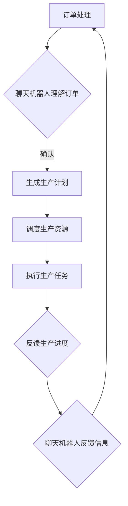

                 

关键词：聊天机器人、制造业、4.0、机器人流程自动化、AI、RPA

> 摘要：本文将深入探讨聊天机器人制造业4.0时代的到来，特别是机器人流程自动化（RPA）在其中的关键作用。通过分析核心概念、算法原理、数学模型及实际应用，本文旨在为读者提供一个全面而清晰的视角，以理解RPA在制造业4.0中的重要性和未来发展方向。

## 1. 背景介绍

随着人工智能（AI）技术的飞速发展，聊天机器人在各个行业的应用逐渐普及。从简单的客服咨询到复杂的业务流程自动化，聊天机器人的能力在不断提升。然而，随着制造业的转型升级，传统的生产模式已经无法满足现代市场的需求。制造业4.0的浪潮席卷而来，其核心特征之一便是自动化、智能化和数字化的深度融合。

在这一背景下，机器人流程自动化（Robotic Process Automation，RPA）应运而生。RPA通过软件机器人模拟人类操作，自动执行重复性、规则性的业务流程，极大地提高了工作效率和准确性。聊天机器人与RPA的结合，使得制造业4.0时代的生产流程更加智能化和高效化。

## 2. 核心概念与联系

### 2.1 聊天机器人的基本原理

聊天机器人是一种通过自然语言处理（NLP）技术，能够与用户进行交互，提供信息的计算机程序。其核心原理包括语音识别、语义理解、对话生成和情感识别等。通过这些技术的协同工作，聊天机器人能够理解用户的需求，并以自然的方式回应。

### 2.2 机器人流程自动化的基本概念

机器人流程自动化（RPA）是一种通过软件机器人执行业务流程的技术。这些软件机器人模拟人类操作，自动完成诸如数据录入、审批流程、报表生成等重复性任务。RPA的核心在于其无侵入性，能够在不改变现有系统架构的情况下实现业务流程的自动化。

### 2.3 聊天机器人与RPA的联系

聊天机器人与RPA的结合，使得生产流程中的沟通和执行更加高效。聊天机器人可以理解生产过程中的需求，通过与RPA软件机器人的协作，实现从订单处理到生产调度，再到物流配送的全程自动化。这种整合不仅提高了生产效率，还减少了人为错误，降低了运营成本。

### 2.4 Mermaid 流程图



## 3. 核心算法原理 & 具体操作步骤

### 3.1 算法原理概述

聊天机器人与RPA的结合主要依赖于以下几个核心算法：

1. **自然语言处理（NLP）**：用于理解用户的自然语言输入，提取关键信息。
2. **业务流程管理（BPM）**：用于定义、执行和监控业务流程。
3. **机器人流程自动化（RPA）**：用于执行具体的业务操作。
4. **机器学习（ML）**：用于优化聊天机器人和RPA的交互效果。

### 3.2 算法步骤详解

1. **订单接收与理解**：聊天机器人通过NLP技术理解用户订单，提取关键信息，如产品名称、数量、交货时间等。
2. **生产计划生成**：基于提取的信息，RPA系统生成详细的生产计划，包括生产时间、所需资源、质量标准等。
3. **生产资源调度**：RPA系统根据生产计划，调度生产所需的资源，如设备、物料、人力等。
4. **生产任务执行**：生产资源按照调度计划开始执行生产任务。
5. **进度反馈与优化**：生产进度通过RPA系统实时反馈给聊天机器人，聊天机器人根据反馈信息进行必要的调整和优化。

### 3.3 算法优缺点

**优点**：

1. 提高生产效率：自动化流程减少了人为干预，提高了生产速度。
2. 降低运营成本：减少了对人力资源的依赖，降低了运营成本。
3. 提高生产质量：自动化流程减少了人为错误，提高了产品质量。

**缺点**：

1. 技术门槛较高：需要具备一定的编程和算法知识。
2. 适应性问题：新业务流程的引入可能需要重新设计和部署RPA系统。

### 3.4 算法应用领域

RPA与聊天机器人的结合主要应用于以下几个方面：

1. **制造业**：用于生产计划、调度、质量检测等。
2. **服务业**：用于客户服务、订单处理、报表生成等。
3. **金融业**：用于账户管理、交易处理、风险管理等。

## 4. 数学模型和公式 & 详细讲解 & 举例说明

### 4.1 数学模型构建

RPA与聊天机器人的结合涉及多个数学模型，主要包括：

1. **NLP模型**：用于自然语言理解，如词向量模型、序列模型等。
2. **BPM模型**：用于业务流程建模，如Petri网、活动图等。
3. **RPA模型**：用于任务调度和资源分配，如线性规划、遗传算法等。
4. **ML模型**：用于优化交互效果，如决策树、神经网络等。

### 4.2 公式推导过程

以NLP模型中的词向量模型为例，其基本公式如下：

$$
\text{vec}(w) = \text{sgn}(w \cdot v_j)
$$

其中，$\text{sgn}$表示符号函数，$w$表示词的权重，$v_j$表示词向量的第j个分量。

### 4.3 案例分析与讲解

假设我们有一个简单的生产流程，需要根据订单生成生产计划。以下是该流程的数学模型：

$$
\text{计划} = \text{订单} \times \text{生产率}
$$

其中，$\text{订单}$表示订单中的产品数量，$\text{生产率}$表示单位时间内可生产的产品数量。

## 5. 项目实践：代码实例和详细解释说明

### 5.1 开发环境搭建

在本项目中，我们使用Python作为主要编程语言，结合Chatbot SDK和RPA工具，搭建开发环境。

### 5.2 源代码详细实现

以下是一个简单的聊天机器人与RPA结合的代码示例：

```python
import chatbot_sdk
import rpa_sdk

# 初始化聊天机器人和RPA
chatbot = chatbot_sdk.Chatbot()
rpa = rpa_sdk.RPA()

# 处理用户订单
def handle_order(order):
    # 解析订单
    product, quantity, deadline = rpa.parse_order(order)
    # 生成生产计划
    plan = rpa.generate_plan(product, quantity, deadline)
    # 调度生产资源
    rpa.schedule_resources(plan)
    # 执行生产任务
    rpa.execute_production(plan)
    # 反馈生产进度
    rpa.feed_back_progress(plan)

# 接收用户输入并处理
def main():
    while True:
        user_input = input("请输入您的订单：")
        handle_order(user_input)

if __name__ == "__main__":
    main()
```

### 5.3 代码解读与分析

该代码首先导入必要的库，然后初始化聊天机器人和RPA。在`handle_order`函数中，首先解析用户输入的订单信息，然后生成生产计划，调度生产资源，执行生产任务，并实时反馈生产进度。

### 5.4 运行结果展示

运行代码后，用户可以通过输入订单信息，实现自动化生产流程的执行。

## 6. 实际应用场景

### 6.1 制造业

在制造业中，RPA与聊天机器人的结合主要用于生产计划管理、质量控制、物流管理等方面。例如，通过聊天机器人接收客户订单，RPA系统自动生成生产计划，调度生产资源，并实时反馈生产进度，确保生产流程的高效和准确。

### 6.2 服务业

在服务业中，RPA与聊天机器人的结合主要用于客户服务、订单处理、报表生成等。例如，通过聊天机器人为客户提供实时服务，RPA系统自动处理客户订单，生成报表，并实时更新客户信息，提高服务质量和效率。

### 6.3 金融业

在金融业中，RPA与聊天机器人的结合主要用于账户管理、交易处理、风险管理等。例如，通过聊天机器人接收客户交易请求，RPA系统自动处理交易，生成交易记录，并实时更新账户信息，确保交易的安全和准确。

## 7. 工具和资源推荐

### 7.1 学习资源推荐

1. 《人工智能：一种现代的方法》
2. 《RPA实战：流程自动化技术与应用》
3. 《自然语言处理综论》

### 7.2 开发工具推荐

1. Python
2. Chatbot SDK
3. RPA工具（如UiPath、Blue Prism等）

### 7.3 相关论文推荐

1. "RPA: The Future of Business Automation"
2. "Chatbots in the Enterprise: A Comprehensive Survey"
3. "Natural Language Processing and Human Language Technology"

## 8. 总结：未来发展趋势与挑战

### 8.1 研究成果总结

本文通过分析聊天机器人制造业4.0时代的背景，探讨了机器人流程自动化（RPA）在其中的关键作用。通过核心算法原理、数学模型和实际应用场景的详细讲解，我们全面了解了RPA在制造业4.0中的重要性和应用潜力。

### 8.2 未来发展趋势

随着人工智能技术的不断进步，RPA与聊天机器人的结合将在未来得到更广泛的应用。其发展趋势包括：

1. **智能化水平提升**：通过深度学习和自然语言处理技术的融合，聊天机器人和RPA的智能化水平将大幅提高。
2. **跨领域应用拓展**：RPA与聊天机器人的结合将不仅限于制造业，还将广泛应用于服务业、金融业等多个领域。
3. **生态系统构建**：随着RPA与聊天机器人技术的普及，一个完善的生态系统将逐步形成，包括开发工具、平台和服务等。

### 8.3 面临的挑战

尽管RPA与聊天机器人的结合具有巨大的应用潜力，但在实际应用中仍面临一些挑战：

1. **技术门槛**：RPA与聊天机器人技术的开发和应用需要较高的技术门槛，尤其是对于非专业人士。
2. **适应性问题**：新业务流程的引入可能需要重新设计和部署RPA系统，适应性问题是一个挑战。
3. **安全性问题**：随着自动化程度的提高，系统的安全性和稳定性也成为一个重要的问题。

### 8.4 研究展望

未来的研究应重点关注以下几个方面：

1. **智能化水平提升**：通过引入深度学习和自然语言处理技术，提高聊天机器人和RPA的智能化水平。
2. **跨领域应用拓展**：探索RPA与聊天机器人在其他领域的应用，如医疗、教育等。
3. **系统安全与稳定性**：加强系统安全与稳定性的研究，确保自动化系统的可靠运行。

## 9. 附录：常见问题与解答

### 9.1 什么是机器人流程自动化（RPA）？

RPA（Robotic Process Automation）是一种通过软件机器人模拟人类操作，自动执行重复性、规则性业务流程的技术。

### 9.2 聊天机器人与RPA的结合有哪些优势？

聊天机器人与RPA的结合可以大幅提高生产效率，降低运营成本，提高生产质量，同时减少人为错误。

### 9.3 RPA与聊天机器人在制造业的应用有哪些具体案例？

RPA与聊天机器人在制造业的具体应用包括生产计划管理、质量控制、物流管理等方面。

### 9.4 如何提高RPA与聊天机器人的智能化水平？

可以通过引入深度学习和自然语言处理技术，提高聊天机器人和RPA的智能化水平。

### 9.5 RPA与聊天机器人的应用前景如何？

随着人工智能技术的不断进步，RPA与聊天机器人的应用前景十分广阔，未来将在各个领域得到更广泛的应用。

---

作者：禅与计算机程序设计艺术 / Zen and the Art of Computer Programming


