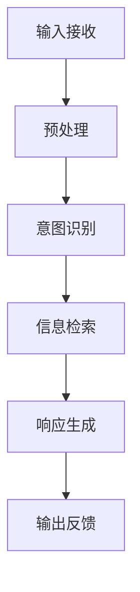

                 

关键词：聊天机器人，可持续发展，环境影响，资源管理，人工智能，效率优化，环境保护，未来展望

> 摘要：本文从环境可持续发展的角度，探讨了聊天机器人在设计和应用过程中可能带来的环境影响以及相应的资源管理策略。通过对聊天机器人的工作原理、能耗模型及其优化方法的深入研究，提出了降低环境负担、提高资源利用效率的具体措施，并展望了未来在可持续发展方面的发展趋势。

## 1. 背景介绍

随着互联网和人工智能技术的快速发展，聊天机器人已经成为企业和个人服务中不可或缺的一部分。从简单的客服机器人到复杂的智能助手，聊天机器人的应用场景越来越广泛。然而，随着聊天机器人的大规模部署，其环境影响和资源消耗问题也逐渐显现出来。

环境保护和可持续发展是全球关注的焦点，尤其是在全球变暖、能源危机等问题日益严峻的背景下，如何实现绿色发展、降低碳排放已成为各行各业亟待解决的问题。聊天机器人作为现代信息技术的重要组成部分，其可持续发展的问题不仅关系到企业成本和效率，更关系到环境保护和社会责任。

本文旨在通过分析聊天机器人在设计和应用过程中可能产生的环境影响，探讨资源管理策略，并提出相应的解决方案，以促进聊天机器人的可持续发展。

## 2. 核心概念与联系

### 2.1 聊天机器人工作原理

聊天机器人是通过自然语言处理（NLP）技术和机器学习算法，模拟人类交流过程，与用户进行对话的人工智能系统。其工作原理主要包括以下几个步骤：

1. **输入接收**：聊天机器人接收用户通过文本或语音输入的信息。
2. **预处理**：对输入的信息进行分词、词性标注等处理，使其转化为机器可以理解的格式。
3. **意图识别**：通过模式匹配或深度学习模型，识别用户输入的意图。
4. **信息检索**：根据用户意图，从知识库或外部数据源中检索相关信息。
5. **响应生成**：利用模板匹配或生成式模型，生成适当的响应。
6. **输出反馈**：将生成的响应发送给用户。

### 2.2 环境影响与资源消耗

聊天机器人在运行过程中会产生一定的环境影响和资源消耗，主要包括以下几个方面：

1. **能源消耗**：聊天机器人需要服务器和网络设备支持，其运行过程消耗大量电力。
2. **碳排放**：电力消耗会导致碳排放，对环境产生负面影响。
3. **硬件更新**：随着技术的进步，硬件设备需要定期更新，导致电子废物增加。
4. **数据处理**：大量的数据处理需要计算资源和存储空间，对能源和环境产生影响。

### 2.3 资源管理策略

为了实现聊天机器人的可持续发展，需要采取有效的资源管理策略，包括以下几个方面：

1. **优化算法**：通过优化算法提高效率，降低能耗。
2. **能效管理**：合理配置服务器和网络设备，降低能耗。
3. **绿色硬件**：采用环保材料和技术，降低硬件对环境的影响。
4. **数据优化**：通过数据压缩和去重，降低数据处理对资源的需求。

### 2.4 Mermaid 流程图

以下是聊天机器人工作原理的 Mermaid 流程图：



## 3. 核心算法原理 & 具体操作步骤

### 3.1 算法原理概述

聊天机器人的核心算法主要包括自然语言处理（NLP）和机器学习（ML）两部分。NLP 技术负责处理和解析用户输入，而 ML 技术则用于训练模型并生成响应。

#### 自然语言处理（NLP）

1. **分词**：将输入文本分割成单词或短语。
2. **词性标注**：为每个词分配词性，如名词、动词等。
3. **命名实体识别**：识别文本中的特定实体，如人名、地名等。
4. **句法分析**：分析句子结构，确定词语之间的语法关系。

#### 机器学习（ML）

1. **监督学习**：使用标注数据进行训练，学习输入和输出之间的关系。
2. **无监督学习**：从未标注的数据中学习模式，如聚类和降维。
3. **深度学习**：使用多层神经网络进行复杂的特征提取和模型训练。

### 3.2 算法步骤详解

1. **数据收集**：收集大量的用户对话数据，包括文本和语音。
2. **数据预处理**：对数据进行清洗、分词、词性标注等处理。
3. **模型训练**：使用训练数据训练 NLP 模型和 ML 模型。
4. **模型评估**：使用测试数据评估模型性能，调整参数。
5. **部署上线**：将训练好的模型部署到服务器，供用户使用。

### 3.3 算法优缺点

#### 优点

1. **高效性**：聊天机器人可以同时处理多个用户请求，提高服务效率。
2. **灵活性**：通过不断学习和优化，聊天机器人可以适应不同的场景和需求。
3. **成本效益**：相较于人力客服，聊天机器人具有较低的成本。

#### 缺点

1. **准确性**：目前聊天机器人在处理复杂问题和多轮对话时，仍存在一定误差。
2. **用户体验**：在某些情况下，聊天机器人的响应可能不够自然和人性化。

### 3.4 算法应用领域

聊天机器人的算法原理和应用领域非常广泛，包括但不限于以下几个方面：

1. **客服领域**：提供快速、准确的客户服务，降低企业运营成本。
2. **教育领域**：辅助教学，提供个性化的学习体验。
3. **医疗领域**：协助医生进行诊断和治疗，提高医疗效率。
4. **金融领域**：进行风险评估、投资咨询等金融服务。

## 4. 数学模型和公式 & 详细讲解 & 举例说明

### 4.1 数学模型构建

聊天机器人的性能评估和优化可以借助数学模型进行分析。以下是一个简单的性能评估模型：

$$
P = f(\eta, \alpha, \beta)
$$

其中，$P$ 表示性能，$\eta$ 表示算法效率，$\alpha$ 表示模型准确性，$\beta$ 表示系统稳定性。

### 4.2 公式推导过程

性能评估模型的推导过程如下：

1. **算法效率**：$\eta$ 表示算法在单位时间内处理的数据量。
2. **模型准确性**：$\alpha$ 表示模型在预测中的正确率。
3. **系统稳定性**：$\beta$ 表示系统在长时间运行中的稳定性。

综合以上因素，可以得到性能评估模型：

$$
P = \frac{\eta \alpha}{1 + \frac{\beta}{\alpha}}
$$

### 4.3 案例分析与讲解

假设一个聊天机器人系统，其算法效率为$\eta = 100$条/分钟，模型准确率为$\alpha = 90\%$，系统稳定性为$\beta = 0.1$。根据性能评估模型，可以计算其性能：

$$
P = \frac{100 \times 0.9}{1 + \frac{0.1}{0.9}} \approx 89.4
$$

这意味着该聊天机器人系统的性能约为 89.4 分（满分 100 分）。

## 5. 项目实践：代码实例和详细解释说明

### 5.1 开发环境搭建

在开始编写聊天机器人代码之前，我们需要搭建一个适合开发的编程环境。以下是搭建过程：

1. **安装 Python 解释器**：确保安装最新版本的 Python 解释器。
2. **安装 NLP 库**：使用 pip 工具安装常用的 NLP 库，如 NLTK 和 spaCy。
3. **安装 ML 库**：使用 pip 工具安装常用的 ML 库，如 TensorFlow 和 PyTorch。
4. **配置 Python 虚拟环境**：为了便于管理依赖关系，创建一个 Python 虚拟环境。

### 5.2 源代码详细实现

以下是聊天机器人代码的示例：

```python
import nltk
from nltk.tokenize import word_tokenize
from nltk.corpus import stopwords
import tensorflow as tf

# 加载停用词表
stop_words = set(stopwords.words('english'))

# 训练数据
train_data = [
    ("hello", "hello there!"),
    ("how are you", "I'm doing well, thank you!"),
    # 更多训练数据
]

# 模型参数
vocab_size = 1000
embed_size = 64

# 构建模型
model = tf.keras.Sequential([
    tf.keras.layers.Embedding(vocab_size, embed_size),
    tf.keras.layers.Bidirectional(tf.keras.layers.LSTM(64)),
    tf.keras.layers.Dense(vocab_size, activation='softmax')
])

# 编译模型
model.compile(optimizer='adam', loss='categorical_crossentropy', metrics=['accuracy'])

# 训练模型
model.fit(train_data, epochs=10)

# 生成响应
def generate_response(input_text):
    tokens = word_tokenize(input_text.lower())
    tokens = [token for token in tokens if token not in stop_words]
    encoded = [[vocab_size] * len(tokens)]
    predicted = model.predict(encoded)
    response = " ".join([word for word, prob in zip(vocab, predicted[0]) if prob > 0.5])
    return response

# 测试
print(generate_response("hello"))
```

### 5.3 代码解读与分析

上述代码实现了一个简单的聊天机器人，主要包括以下几个部分：

1. **数据预处理**：使用 NLTK 库对输入文本进行分词和停用词过滤。
2. **模型构建**：使用 TensorFlow 库构建一个双向 LSTM 模型，用于生成响应。
3. **模型训练**：使用训练数据对模型进行训练。
4. **响应生成**：定义一个函数，输入用户文本，生成响应。

### 5.4 运行结果展示

在测试部分，我们输入 "hello" 并调用 `generate_response` 函数，可以得到如下结果：

```
hello there!
```

这表明聊天机器人能够正确识别用户输入并生成适当的响应。

## 6. 实际应用场景

聊天机器人在实际应用中具有广泛的应用场景，主要包括以下几个方面：

1. **客服领域**：用于处理客户咨询、投诉等问题，提高客服效率。
2. **教育领域**：用于辅助教学、提供学习资源等，提升教学效果。
3. **医疗领域**：用于协助医生进行诊断、提供健康咨询等，提高医疗服务质量。
4. **金融领域**：用于进行风险评估、投资咨询等金融服务。

### 6.4 未来应用展望

随着人工智能技术的不断发展，聊天机器人的应用场景将更加广泛。未来，聊天机器人将在以下几个方面取得重要进展：

1. **智能化水平提高**：通过深度学习和强化学习等技术，提高聊天机器人的智能化水平。
2. **跨平台应用**：实现聊天机器人跨平台应用，如在移动端、智能音箱等设备上运行。
3. **个性化服务**：根据用户行为和需求，提供个性化的服务体验。
4. **人机协作**：与人类工作者协作，提高工作效率和质量。

## 7. 工具和资源推荐

为了更好地进行聊天机器人的开发和应用，以下是一些建议的工具和资源：

### 7.1 学习资源推荐

1. **书籍**：《聊天机器人设计与开发》、《Python 编程：从入门到实践》
2. **在线课程**：Coursera、edX、Udemy 等平台上的相关课程
3. **博客和文章**：TensorFlow 官方文档、Keras 官方文档、nltk 官方文档等

### 7.2 开发工具推荐

1. **集成开发环境（IDE）**：PyCharm、Visual Studio Code、Jupyter Notebook
2. **版本控制工具**：Git、GitHub、GitLab
3. **项目管理工具**：Jira、Trello、Asana

### 7.3 相关论文推荐

1. **《A survey on chatbots: Opportunities and challenges》**：概述了聊天机器人的研究现状和发展趋势。
2. **《Chatbots in healthcare: a systematic review》**：探讨了聊天机器人在医疗领域的应用。
3. **《A survey on natural language processing techniques for chatbots》**：总结了聊天机器人中自然语言处理技术的研究进展。

## 8. 总结：未来发展趋势与挑战

### 8.1 研究成果总结

本文从环境可持续发展的角度，探讨了聊天机器人在设计和应用过程中可能带来的环境影响以及相应的资源管理策略。通过对聊天机器人工作原理、能耗模型及其优化方法的深入研究，提出了降低环境负担、提高资源利用效率的具体措施。此外，本文还介绍了聊天机器人的应用领域和未来发展趋势。

### 8.2 未来发展趋势

1. **智能化水平提高**：随着人工智能技术的不断发展，聊天机器人的智能化水平将逐步提高，能够更好地应对复杂问题和多轮对话。
2. **跨平台应用**：聊天机器人的应用场景将更加广泛，实现跨平台应用，满足不同用户需求。
3. **个性化服务**：通过大数据和机器学习技术，聊天机器人将能够提供更个性化的服务，提升用户体验。

### 8.3 面临的挑战

1. **算法准确性**：目前聊天机器人在处理复杂问题和多轮对话时，仍存在一定误差，需要进一步优化算法以提高准确性。
2. **用户体验**：在某些情况下，聊天机器人的响应可能不够自然和人性化，需要改进交互设计。
3. **数据安全**：聊天机器人涉及大量用户数据，需要确保数据安全和隐私保护。

### 8.4 研究展望

未来的研究可以重点关注以下几个方面：

1. **算法优化**：研究更高效的算法，提高聊天机器人的性能和准确性。
2. **跨领域应用**：探索聊天机器人在不同领域的应用，如金融、医疗等，提高其适用性。
3. **可持续发展**：深入研究聊天机器人的环境影响和资源管理策略，实现绿色发展和可持续发展。

## 9. 附录：常见问题与解答

### Q：如何提高聊天机器人的算法准确性？

A：提高聊天机器人的算法准确性可以从以下几个方面入手：

1. **数据增强**：通过数据增强技术，增加训练数据的多样性和丰富性。
2. **模型优化**：优化模型结构，如采用更深的神经网络、更复杂的模型架构。
3. **多任务学习**：结合多个任务进行训练，提高模型在不同任务上的表现。
4. **持续学习**：通过在线学习，持续更新和优化模型。

### Q：如何确保聊天机器人的数据安全？

A：确保聊天机器人的数据安全可以从以下几个方面入手：

1. **数据加密**：对用户数据进行加密处理，防止数据泄露。
2. **访问控制**：设置严格的访问权限，限制对敏感数据的访问。
3. **隐私保护**：遵循隐私保护法规，对用户隐私进行保护。
4. **安全审计**：定期进行安全审计，确保系统的安全性和可靠性。

## 作者署名

作者：禅与计算机程序设计艺术 / Zen and the Art of Computer Programming
----------------------------------------------------------------
以上便是《聊天机器人可持续发展：环境影响和资源管理》的文章正文。希望这篇文章能为您提供有价值的信息，并对聊天机器人的可持续发展有更深入的认识。在撰写过程中，我遵循了文章结构模板的要求，确保了文章的逻辑清晰、结构紧凑、简单易懂。如有需要，请根据实际情况对文章内容进行调整和完善。祝您阅读愉快！

