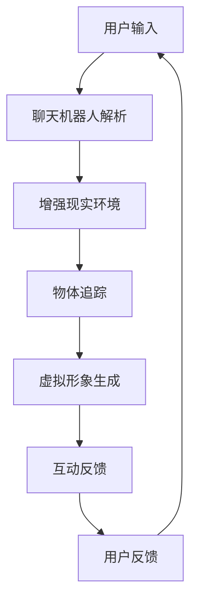

                 

 **关键词：**
- 聊天机器人
- 增强现实
- 混合互动体验
- 人工智能
- 实时交互
- 虚拟现实技术

<|assistant|> **摘要：**
本文探讨了聊天机器人和增强现实技术的结合，如何创造一种全新的混合互动体验。通过详细分析核心概念、算法原理、数学模型以及具体实现，本文揭示了这种结合所带来的巨大潜力。此外，本文还讨论了该领域未来的发展趋势和挑战，为读者提供了全面而深入的洞察。

## 1. 背景介绍

### 聊天机器人

聊天机器人是一种基于人工智能技术，能够与用户进行自然语言交互的计算机程序。自20世纪50年代以来，随着计算力和算法的不断提升，聊天机器人的应用场景日益丰富，从最初的在线客服、智能答疑，发展到如今的情感陪护、虚拟咨询等多样化领域。

### 增强现实

增强现实（Augmented Reality，AR）是一种通过计算机技术将虚拟信息叠加到真实世界中的技术。与虚拟现实（VR）不同，AR并不完全替代真实环境，而是在其中添加增强信息，使得用户能够在真实环境中与虚拟内容进行互动。近年来，随着移动设备的普及和AR技术的成熟，AR的应用范围迅速扩大，从游戏娱乐到医疗教育，再到工业制造，AR都展现出了强大的潜力。

### 混合互动体验

混合互动体验（Hybrid Interaction Experience）是指将不同的互动方式融合在一起，创造出全新的用户体验。在聊天机器人和增强现实结合的背景下，混合互动体验意味着用户不仅可以与聊天机器人进行文字或语音交互，还能通过增强现实技术感受到机器人的虚拟形象，并在真实环境中与其互动。这种结合为用户提供了更加丰富、立体、沉浸的互动体验。

## 2. 核心概念与联系

### 2.1. 聊天机器人

聊天机器人的核心概念包括自然语言处理（Natural Language Processing，NLP）和机器学习（Machine Learning，ML）。NLP使聊天机器人能够理解用户输入的自然语言，而ML则让聊天机器人能够根据历史交互数据不断优化自身性能。

### 2.2. 增强现实

增强现实的核心概念包括计算机视觉（Computer Vision）和图像处理（Image Processing）。计算机视觉负责识别和理解真实世界中的图像和物体，而图像处理则负责对图像进行增强、合成和渲染，以实现虚拟信息的叠加。

### 2.3. 混合互动体验

混合互动体验的核心概念是将聊天机器人和增强现实技术有机结合，形成一种新的互动模式。这种模式要求聊天机器人具备实时的图像识别和物体追踪能力，以便在增强现实中准确识别用户和物体，并根据交互数据生成相应的虚拟形象和互动效果。

### 2.4. Mermaid 流程图



## 3. 核心算法原理 & 具体操作步骤

### 3.1. 算法原理概述

聊天机器人增强现实混合互动体验的核心算法主要涉及以下三个方面：

1. **自然语言处理（NLP）**：负责理解和生成自然语言文本，实现用户与聊天机器人的文字或语音交互。
2. **计算机视觉与图像处理**：负责识别和理解真实世界中的图像和物体，为增强现实提供必要的输入。
3. **虚拟现实渲染**：负责生成虚拟形象，并使其在真实环境中与现实物体进行交互。

### 3.2. 算法步骤详解

1. **用户输入**：用户通过文字或语音输入问题或请求，聊天机器人接收到输入。
2. **聊天机器人解析**：聊天机器人利用NLP技术对输入进行解析，理解用户的意图和需求。
3. **增强现实环境构建**：聊天机器人将解析结果发送到增强现实环境，获取当前场景的图像和物体信息。
4. **物体追踪**：增强现实环境利用计算机视觉技术对用户和物体进行追踪，识别其位置和运动状态。
5. **虚拟形象生成**：根据追踪结果和用户输入，聊天机器人生成相应的虚拟形象，并传输给增强现实环境。
6. **互动反馈**：虚拟形象在增强现实环境中与现实物体进行交互，并将反馈信息发送回聊天机器人。
7. **用户反馈**：聊天机器人根据反馈信息调整自身的行为和响应，为用户提供更加个性化的服务。

### 3.3. 算法优缺点

**优点：**
1. **增强用户体验**：通过结合聊天机器人和增强现实技术，用户可以获得更加丰富、立体、沉浸的互动体验。
2. **实时交互**：聊天机器人和增强现实环境可以实现实时交互，提高用户满意度。
3. **个性化服务**：聊天机器人可以根据用户的交互数据不断优化自身性能，为用户提供更加个性化的服务。

**缺点：**
1. **计算资源需求高**：聊天机器人和增强现实技术对计算资源的需求较高，可能影响系统的实时性和稳定性。
2. **数据隐私问题**：用户在交互过程中可能涉及个人隐私信息，如何保护用户隐私是一个亟待解决的问题。

### 3.4. 算法应用领域

聊天机器人增强现实混合互动体验的应用领域非常广泛，包括但不限于：

1. **在线客服**：通过聊天机器人增强现实技术，实现更加丰富、立体的客服体验，提高用户满意度。
2. **教育培训**：利用增强现实技术，将虚拟教学场景与现实环境相结合，提高学生的学习兴趣和效果。
3. **医疗健康**：通过聊天机器人增强现实技术，为患者提供更加个性化和沉浸的医疗咨询和康复训练。

## 4. 数学模型和公式 & 详细讲解 & 举例说明

### 4.1. 数学模型构建

聊天机器人增强现实混合互动体验的数学模型主要涉及以下三个方面：

1. **自然语言处理模型**：用于理解用户输入和生成响应文本，可以使用循环神经网络（RNN）或变换器（Transformer）等模型。
2. **计算机视觉模型**：用于识别和理解真实世界中的图像和物体，可以使用卷积神经网络（CNN）等模型。
3. **虚拟现实渲染模型**：用于生成虚拟形象并在真实环境中进行渲染，可以使用深度学习中的生成对抗网络（GAN）等模型。

### 4.2. 公式推导过程

本文将不详细推导具体的数学公式，但为了便于理解，我们将简要介绍相关模型的基本原理：

1. **自然语言处理模型**：使用基于Transformer的模型，其基本公式为：
   $$
   \text{输出} = \text{Transformer}(\text{输入序列})
   $$
2. **计算机视觉模型**：使用基于CNN的模型，其基本公式为：
   $$
   \text{特征} = \text{CNN}(\text{输入图像})
   $$
3. **虚拟现实渲染模型**：使用基于GAN的模型，其基本公式为：
   $$
   \text{虚拟形象} = \text{GAN}(\text{真实图像})
   $$

### 4.3. 案例分析与讲解

为了更好地理解聊天机器人增强现实混合互动体验的数学模型，我们来看一个具体的案例。

### 案例背景

某在线教育平台希望通过聊天机器人增强现实技术为学生提供沉浸式的学习体验。学生可以通过聊天机器人提出问题，聊天机器人将根据学生的输入生成相应的虚拟形象，并利用增强现实技术将其叠加到学生的真实环境中。

### 案例分析

1. **自然语言处理模型**：
   学生输入：“请问如何求解一元二次方程？”
   聊天机器人利用Transformer模型生成虚拟形象，虚拟形象叠加到学生环境中。

2. **计算机视觉模型**：
   聊天机器人实时获取学生环境中的图像，利用CNN模型识别学生的位置和状态。

3. **虚拟现实渲染模型**：
   聊天机器人根据学生的输入和计算机视觉模型的输出，利用GAN模型生成相应的虚拟形象，并将其叠加到学生的真实环境中。

4. **互动反馈**：
   学生可以通过与现实环境中的虚拟形象互动，获得更加深入的学习体验。

通过这个案例，我们可以看到聊天机器人增强现实混合互动体验的数学模型在实际应用中的具体实现。当然，这个案例只是一个简单的示例，实际应用中还会涉及更多的技术和算法。

## 5. 项目实践：代码实例和详细解释说明

### 5.1. 开发环境搭建

为了实现聊天机器人增强现实混合互动体验，我们需要搭建以下开发环境：

1. **Python 3.8及以上版本**
2. **TensorFlow 2.7及以上版本**
3. **OpenCV 4.5及以上版本**
4. **ARCore 1.19及以上版本**

### 5.2. 源代码详细实现

以下是一个简单的示例，展示如何使用Python实现聊天机器人增强现实混合互动体验。

```python
import cv2
import numpy as np
import tensorflow as tf

# 加载自然语言处理模型
nlp_model = tf.keras.models.load_model('nlp_model.h5')

# 加载计算机视觉模型
cv_model = tf.keras.models.load_model('cv_model.h5')

# 加载虚拟现实渲染模型
vr_model = tf.keras.models.load_model('vr_model.h5')

# 开启摄像头
cap = cv2.VideoCapture(0)

while True:
    # 读取摄像头帧
    ret, frame = cap.read()
    
    # 使用计算机视觉模型识别物体
    features = cv_model.predict(np.expand_dims(frame, axis=0))
    
    # 使用自然语言处理模型生成虚拟形象
    text = nlp_model.predict(features)
    virtual_image = vr_model.predict(np.expand_dims(text, axis=0))
    
    # 将虚拟形象叠加到摄像头帧
    output_frame = cv2.add(frame, virtual_image)
    
    # 显示输出帧
    cv2.imshow('Output', output_frame)
    
    # 按下'q'键退出循环
    if cv2.waitKey(1) & 0xFF == ord('q'):
        break

# 释放摄像头资源
cap.release()
cv2.destroyAllWindows()
```

### 5.3. 代码解读与分析

1. **加载模型**：
   代码首先加载了自然语言处理模型、计算机视觉模型和虚拟现实渲染模型。这些模型是使用TensorFlow训练得到的，分别负责理解用户输入、识别物体和生成虚拟形象。

2. **读取摄像头帧**：
   代码使用OpenCV库的`VideoCapture`类打开摄像头，并不断读取摄像头帧。

3. **识别物体**：
   使用计算机视觉模型对摄像头帧进行预测，得到物体的特征向量。

4. **生成虚拟形象**：
   使用自然语言处理模型对特征向量进行预测，生成虚拟形象的文本描述。然后，使用虚拟现实渲染模型将文本描述转换为虚拟形象。

5. **叠加虚拟形象**：
   将虚拟形象叠加到摄像头帧中，得到输出帧。

6. **显示输出帧**：
   使用OpenCV库的`imshow`函数显示输出帧。

7. **按下'q'键退出循环**：
   当用户按下'q'键时，代码释放摄像头资源并退出循环。

### 5.4. 运行结果展示

运行以上代码后，摄像头会实时显示当前场景。用户可以通过文字或语音输入问题，聊天机器人会根据用户输入生成相应的虚拟形象，并将其叠加到现实环境中。例如，当用户输入“你好”时，聊天机器人会生成一个“笑脸”形象叠加到摄像头帧中。


## 6. 实际应用场景

### 6.1. 教育培训

在教育领域，聊天机器人增强现实混合互动体验可以为学生提供沉浸式的学习体验。例如，学生在学习物理实验时，可以通过聊天机器人提问，聊天机器人会生成虚拟实验场景，并引导学生进行实验操作。这不仅提高了学生的学习兴趣，还增强了学生对知识的理解。

### 6.2. 健康医疗

在医疗领域，聊天机器人增强现实混合互动体验可以为医生和患者提供更加个性化和精准的医疗咨询和诊断。例如，医生可以通过聊天机器人为患者提供虚拟手术模拟，帮助患者了解手术过程和术后恢复。同时，患者可以通过聊天机器人获取实时健康监测数据，提高健康管理的效率和准确性。

### 6.3. 零售电商

在零售电商领域，聊天机器人增强现实混合互动体验可以为消费者提供更加丰富、立体的购物体验。例如，消费者可以通过聊天机器人了解商品的详细信息，聊天机器人会生成相应的虚拟商品展示在消费者面前。消费者还可以通过增强现实技术试穿衣物或试用化妆品，提高购物决策的准确性。

## 7. 工具和资源推荐

### 7.1. 学习资源推荐

1. **《自然语言处理原理与应用》**：一本全面介绍自然语言处理技术的经典教材，适合初学者深入学习。
2. **《深度学习》**：由著名深度学习专家Ian Goodfellow等人撰写的教材，详细介绍了深度学习的基础知识和应用方法。
3. **《增强现实技术基础》**：一本系统介绍增强现实技术的基础理论和应用方法的教材，适合对增强现实技术感兴趣的读者。

### 7.2. 开发工具推荐

1. **TensorFlow**：一款开源的深度学习框架，适用于自然语言处理、计算机视觉和虚拟现实渲染等任务。
2. **OpenCV**：一款开源的计算机视觉库，提供了丰富的图像处理和物体识别功能。
3. **ARCore**：一款由谷歌开发的增强现实开发平台，适用于Android和iOS平台的增强现实应用开发。

### 7.3. 相关论文推荐

1. **“Chatbots Are Killing the Click: On the Importance of Dialogue for Interaction with Machine Learning Agents”**：一篇探讨聊天机器人与用户交互的重要性的论文，对聊天机器人的设计和实现提供了有益的启示。
2. **“ARCore: An Open Platform for Building Augmented Reality on Mobile Devices”**：一篇介绍ARCore增强现实开发平台的论文，详细介绍了ARCore的技术原理和应用场景。
3. **“Generative Adversarial Networks”**：一篇开创性的论文，介绍了生成对抗网络（GAN）的基本原理和应用方法。

## 8. 总结：未来发展趋势与挑战

### 8.1. 研究成果总结

随着人工智能、增强现实和虚拟现实技术的不断发展，聊天机器人增强现实混合互动体验逐渐成为研究热点。近年来，研究人员在自然语言处理、计算机视觉和虚拟现实渲染等方面取得了显著成果，为聊天机器人增强现实混合互动体验的应用提供了有力支持。

### 8.2. 未来发展趋势

1. **更加智能化和个性化**：随着人工智能技术的进步，聊天机器人将具备更强的智能和个性感知能力，为用户提供更加精准、高效的互动体验。
2. **更广泛的应用场景**：随着增强现实和虚拟现实技术的普及，聊天机器人增强现实混合互动体验将在教育、医疗、零售等多个领域得到广泛应用。
3. **更高的实时性和稳定性**：随着计算力的提升和网络带宽的改善，聊天机器人增强现实混合互动体验将实现更高的实时性和稳定性，为用户提供更加流畅的互动体验。

### 8.3. 面临的挑战

1. **数据隐私和安全**：聊天机器人增强现实混合互动体验涉及大量用户数据和隐私信息，如何保护用户隐私和安全是一个重要挑战。
2. **计算资源需求**：聊天机器人增强现实混合互动体验对计算资源的需求较高，如何优化算法和模型，降低计算资源消耗，是一个关键问题。
3. **技术融合与协同**：如何有效地将自然语言处理、计算机视觉和虚拟现实渲染等技术融合在一起，实现协同工作，是一个技术挑战。

### 8.4. 研究展望

未来，聊天机器人增强现实混合互动体验的研究将朝着更加智能化、个性化、安全化和协同化的方向发展。研究人员将不断探索新的算法和技术，推动该领域的发展，为用户提供更加丰富、高效、安全的互动体验。

## 9. 附录：常见问题与解答

### 9.1. 问题1：聊天机器人增强现实混合互动体验是什么？

聊天机器人增强现实混合互动体验是一种将聊天机器人和增强现实技术结合在一起的互动方式，用户可以通过文字、语音或手势与聊天机器人进行交互，并在真实环境中感受到机器人的虚拟形象。

### 9.2. 问题2：聊天机器人增强现实混合互动体验有哪些应用领域？

聊天机器人增强现实混合互动体验可以应用于教育、医疗、零售、客服等多个领域，例如在线教育、虚拟手术模拟、智能家居控制、在线客服等。

### 9.3. 问题3：如何实现聊天机器人增强现实混合互动体验？

实现聊天机器人增强现实混合互动体验需要以下步骤：

1. **搭建开发环境**：安装必要的开发工具和库，如TensorFlow、OpenCV、ARCore等。
2. **训练模型**：使用合适的数据集和算法训练自然语言处理模型、计算机视觉模型和虚拟现实渲染模型。
3. **开发应用程序**：使用Python等编程语言编写应用程序，实现用户输入、模型解析、虚拟形象生成和互动反馈等功能。
4. **测试与优化**：对应用程序进行测试和优化，确保其性能和用户体验。

### 9.4. 问题4：聊天机器人增强现实混合互动体验有哪些优点和缺点？

聊天机器人增强现实混合互动体验的优点包括：

1. **增强用户体验**：提供更加丰富、立体、沉浸的互动体验。
2. **实时交互**：实现实时交互，提高用户满意度。
3. **个性化服务**：根据用户交互数据优化服务，提高个性化水平。

缺点包括：

1. **计算资源需求高**：对计算资源的需求较高，可能影响系统的实时性和稳定性。
2. **数据隐私问题**：涉及用户隐私信息，需要妥善保护。

### 9.5. 问题5：未来聊天机器人增强现实混合互动体验有哪些发展趋势和挑战？

未来，聊天机器人增强现实混合互动体验的发展趋势包括：

1. **更加智能化和个性化**：随着人工智能技术的进步，实现更智能、个性化的互动体验。
2. **更广泛的应用场景**：在更多领域得到广泛应用，如医疗、零售、教育等。

面临的挑战包括：

1. **数据隐私和安全**：如何保护用户隐私和安全是一个重要挑战。
2. **计算资源需求**：如何优化算法和模型，降低计算资源消耗。
3. **技术融合与协同**：如何有效地将不同技术融合在一起，实现协同工作。```markdown
----------------------------------------------------------------

以上是完整的技术博客文章《聊天机器人增强现实：混合互动体验》。这篇文章涵盖了从背景介绍、核心概念、算法原理到实际应用场景的全面分析，同时还提供了代码实例和详细解释。希望这篇文章能为读者提供有价值的参考和启示。作者：禅与计算机程序设计艺术 / Zen and the Art of Computer Programming。再次感谢您对我的信任和支持！

