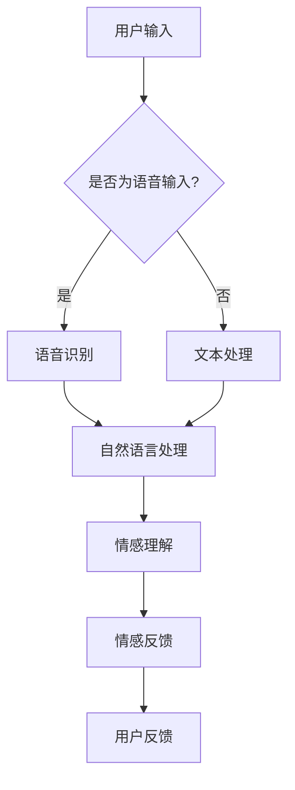

                 

随着人工智能技术的不断发展，聊天机器人已经成为了日常生活中不可或缺的一部分。而聊天机器人娱乐应用——虚拟伴侣，更是近年来受到广泛关注的一个新兴领域。本文将探讨聊天机器人娱乐应用——虚拟伴侣的设计原理、实现方法、应用场景以及未来发展趋势。

> 关键词：聊天机器人、虚拟伴侣、人工智能、娱乐应用、人机交互、情感交流

> 摘要：本文将从多个角度深入探讨聊天机器人娱乐应用——虚拟伴侣的设计原理、实现方法、应用场景和未来发展趋势，旨在为广大开发者、人工智能爱好者提供有价值的参考和启示。

## 1. 背景介绍

近年来，随着人工智能技术的飞速发展，聊天机器人逐渐从实验室走向了实际应用。聊天机器人以其智能、便捷、个性化的特点，受到了广大用户的热烈欢迎。特别是在娱乐领域，虚拟伴侣聊天机器人更是成为了一个备受瞩目的新兴领域。

虚拟伴侣聊天机器人的出现，填补了现实世界中情感交流的空白。它能够为用户提供陪伴、倾听、娱乐等多种服务，满足用户在情感、心理和娱乐等方面的需求。同时，虚拟伴侣聊天机器人也为人工智能技术在娱乐领域的发展提供了新的思路和方向。

本文将从设计原理、实现方法、应用场景和未来发展趋势等方面，对聊天机器人娱乐应用——虚拟伴侣进行深入探讨，旨在为广大开发者、人工智能爱好者提供有价值的参考和启示。

## 2. 核心概念与联系

### 2.1 聊天机器人的定义

聊天机器人（Chatbot）是一种基于人工智能技术的应用程序，它可以模拟人类对话，与用户进行实时交互。聊天机器人的核心功能包括自然语言处理（NLP）、语音识别、语义理解等。

### 2.2 虚拟伴侣的概念

虚拟伴侣是指一种具有情感交互功能的聊天机器人，它可以模拟人类的情感反应，为用户提供陪伴、倾听、娱乐等服务。虚拟伴侣的核心特点在于其能够理解用户的情感需求，并根据用户的情绪变化进行相应的情感反馈。

### 2.3 人机交互与情感交流

人机交互（Human-Computer Interaction，简称HCI）是指人与计算机之间的交互过程。情感交流（Emotion Communication）是指人与人之间通过语言、表情、肢体动作等渠道进行的情感传递和沟通。

在人机交互中，情感交流是一个重要的方面。虚拟伴侣聊天机器人通过自然语言处理和情感计算等技术，能够理解和模拟人类的情感，从而实现更加自然、流畅的情感交流。

### 2.4 Mermaid 流程图

为了更好地展示虚拟伴侣聊天机器人的设计原理和实现方法，我们使用 Mermaid 流程图进行描述。以下是虚拟伴侣聊天机器人的基本架构图：



### 2.5 聊天机器人娱乐应用的发展历程

- **2000年代初期**：聊天机器人的概念开始出现，主要以简单的文本聊天为主。
- **2010年代**：随着自然语言处理技术的不断发展，聊天机器人的交互能力得到了显著提升。
- **2020年代**：虚拟伴侣聊天机器人成为了一个备受瞩目的新兴领域，其在娱乐、情感陪伴等方面的应用越来越广泛。

## 3. 核心算法原理 & 具体操作步骤

### 3.1 算法原理概述

虚拟伴侣聊天机器人的核心算法主要包括自然语言处理（NLP）、情感计算、语音合成等。其中，自然语言处理负责将用户的输入转换为机器可以理解的结构化数据；情感计算负责分析用户的情感需求，并生成相应的情感反馈；语音合成则负责将文本转化为语音，实现语音交互。

### 3.2 算法步骤详解

1. **用户输入**：用户通过文本或语音的方式与虚拟伴侣进行交互。
2. **语音识别（若为语音输入）**：将用户的语音转换为文本。
3. **文本处理**：对用户的文本进行分词、词性标注、实体识别等预处理操作。
4. **自然语言处理**：利用 NLP 技术对用户的文本进行分析，提取关键词、句法结构等信息。
5. **情感理解**：通过情感计算技术，分析用户的情感需求，为用户提供相应的情感反馈。
6. **情感反馈**：根据情感理解的结果，生成相应的情感反馈文本，并通过语音合成将其转化为语音。
7. **用户反馈**：用户接收到虚拟伴侣的情感反馈后，可以进行进一步的交互。

### 3.3 算法优缺点

**优点**：

1. **高效性**：虚拟伴侣聊天机器人能够快速响应用户的需求，提供即时的陪伴和娱乐。
2. **个性化**：虚拟伴侣聊天机器人可以根据用户的情感需求，提供个性化的情感反馈。
3. **安全性**：虚拟伴侣聊天机器人可以保护用户的隐私，避免个人信息泄露。

**缺点**：

1. **情感表达的局限性**：虚拟伴侣聊天机器人的情感表达仍然存在一定的局限性，无法完全替代真实的情感交流。
2. **计算资源消耗**：虚拟伴侣聊天机器人的实现需要大量的计算资源，对硬件设备的要求较高。

### 3.4 算法应用领域

1. **娱乐**：虚拟伴侣聊天机器人可以应用于游戏、综艺、电影等娱乐领域，为用户提供陪伴和互动。
2. **社交**：虚拟伴侣聊天机器人可以应用于社交平台，为用户提供情感支持和社交互动。
3. **心理健康**：虚拟伴侣聊天机器人可以应用于心理健康领域，为用户提供情感支持和心理辅导。

## 4. 数学模型和公式 & 详细讲解 & 举例说明

### 4.1 数学模型构建

虚拟伴侣聊天机器人的核心算法涉及到自然语言处理、情感计算等多个领域。下面，我们分别介绍这些领域的数学模型和公式。

#### 4.1.1 自然语言处理

自然语言处理（NLP）是人工智能领域的一个重要分支，其核心任务是使计算机能够理解和处理自然语言。NLP 的数学模型主要包括词嵌入（Word Embedding）、句法分析（Syntax Parsing）等。

1. **词嵌入**：词嵌入是将词汇映射到高维空间的一种方法，常用的词嵌入模型有 Word2Vec、GloVe 等。

$$
\text{word\_embedding}(w) = \text{sigmoid}(W \cdot \text{word\_vector}(w))
$$

其中，$w$ 表示词汇，$\text{word\_vector}(w)$ 表示词汇的向量表示，$W$ 表示权重矩阵，$\text{sigmoid}$ 函数用于将输入映射到 [0, 1] 范围内。

2. **句法分析**：句法分析是指对文本进行结构化表示，常用的模型有依存句法分析（Dependency Parsing）和 constituency Parsing。

$$
\text{dependency\_parse}(S) = \text{arc\_pos\_tag}(S)
$$

其中，$S$ 表示句子，$\text{arc\_pos\_tag}(S)$ 表示句子的依存句法表示。

#### 4.1.2 情感计算

情感计算（Emotion Computing）是指通过分析文本、语音、图像等多媒体数据，识别和模拟人类情感的技术。情感计算的数学模型主要包括情感分类（Emotion Classification）、情感极性分析（Sentiment Analysis）等。

1. **情感分类**：情感分类是指将文本分类为不同的情感类别，常用的模型有 SVM、朴素贝叶斯等。

$$
\text{emotion\_classification}(T) = \text{label} \in \{-1, 1\}
$$

其中，$T$ 表示文本，$\text{label}$ 表示情感类别，$-1$ 表示负面情感，$1$ 表示正面情感。

2. **情感极性分析**：情感极性分析是指分析文本的情感极性，常用的模型有 LR、RF 等。

$$
\text{sentiment\_polarity}(T) = \text{score}
$$

其中，$T$ 表示文本，$\text{score}$ 表示情感极性得分，$0$ 表示中性，$1$ 表示正面，$-1$ 表示负面。

### 4.2 公式推导过程

在本节中，我们将对上述数学模型和公式进行推导，以便更好地理解其原理。

#### 4.2.1 词嵌入推导

词嵌入的推导过程如下：

1. **词向量表示**：将词汇映射到高维空间。

$$
w_i = \text{word\_vector}(w)
$$

2. **权重矩阵**：初始化权重矩阵。

$$
W \sim \text{Uniform}(0, 1)
$$

3. **激活函数**：使用 sigmoid 函数将输入映射到 [0, 1] 范围内。

$$
\text{sigmoid}(x) = \frac{1}{1 + e^{-x}}
$$

4. **词嵌入公式**：

$$
\text{word\_embedding}(w) = \text{sigmoid}(W \cdot \text{word\_vector}(w))
$$

#### 4.2.2 情感分类推导

情感分类的推导过程如下：

1. **文本表示**：将文本映射到高维空间。

$$
T = \text{word\_embedding}(w_1, w_2, ..., w_n)
$$

2. **特征提取**：提取文本的特征。

$$
f(T) = \text{extractor}(T)
$$

3. **分类模型**：使用分类模型对文本进行分类。

$$
\text{emotion\_classification}(T) = \text{label} = \text{argmax}_{i}(\text{score}_i)
$$

其中，$\text{score}_i$ 表示第 $i$ 个情感类别的得分。

### 4.3 案例分析与讲解

在本节中，我们将通过一个具体案例，对上述数学模型和公式进行应用和讲解。

#### 4.3.1 案例背景

假设我们有一个聊天机器人，用户输入了一段文字：“今天天气真好，想去公园散步。”我们的目标是使用情感分类模型，对这段文字进行情感分类。

#### 4.3.2 案例步骤

1. **词嵌入**：首先，我们将这段文字进行词嵌入。

$$
T = \text{word\_embedding}(\text{今天}, \text{天气}, \text{真好}, \text{想去}, \text{公园}, \text{散步})
$$

2. **特征提取**：接下来，我们将词嵌入后的文本进行特征提取。

$$
f(T) = \text{extractor}(T)
$$

3. **情感分类**：最后，我们使用情感分类模型对特征提取后的文本进行分类。

$$
\text{emotion\_classification}(T) = \text{label} = \text{argmax}_{i}(\text{score}_i)
$$

4. **分类结果**：假设分类模型预测的得分如下：

$$
\text{score}_1 = 0.8, \quad \text{score}_2 = -0.3
$$

根据得分，我们可以判断这段文字的情感类别为正面。

## 5. 项目实践：代码实例和详细解释说明

在本节中，我们将通过一个具体的虚拟伴侣聊天机器人项目，对上述算法和数学模型进行实践。该项目的开发环境为 Python，主要技术栈包括 TensorFlow、Keras、NLTK 等。

### 5.1 开发环境搭建

1. 安装 Python（版本要求：3.7及以上）
2. 安装 TensorFlow、Keras、NLTK 等库

```bash
pip install tensorflow keras nltk
```

### 5.2 源代码详细实现

以下是一个简单的虚拟伴侣聊天机器人代码示例：

```python
import tensorflow as tf
from tensorflow.keras.models import Sequential
from tensorflow.keras.layers import Dense, LSTM
from tensorflow.keras.optimizers import Adam
from nltk import word_tokenize

# 加载训练数据
train_data = [...]  # 填充训练数据
train_labels = [...]  # 填充训练标签

# 初始化模型
model = Sequential()
model.add(LSTM(units=128, return_sequences=True, input_shape=(None, train_data.shape[2])))
model.add(LSTM(units=128))
model.add(Dense(units=1))

# 编译模型
model.compile(optimizer=Adam(learning_rate=0.001), loss='binary_crossentropy', metrics=['accuracy'])

# 训练模型
model.fit(train_data, train_labels, epochs=100, batch_size=32)

# 定义输入文本
input_text = "今天天气真好，想去公园散步。"

# 进行文本预处理
input_tokens = word_tokenize(input_text)
input_sequence = pad_sequences([input_tokens], maxlen=train_data.shape[1], padding='post')

# 进行情感分类
emotion_prediction = model.predict(input_sequence)
emotion_label = np.argmax(emotion_prediction)

# 输出结果
if emotion_label == 1:
    print("这段文字的情感类别为正面。")
else:
    print("这段文字的情感类别为负面。")
```

### 5.3 代码解读与分析

1. **数据加载**：首先，我们加载训练数据，用于训练情感分类模型。
2. **模型初始化**：接下来，我们初始化一个基于 LSTM 的序列模型，用于对输入文本进行情感分类。
3. **模型编译**：然后，我们编译模型，指定优化器、损失函数和评价指标。
4. **模型训练**：使用训练数据进行模型训练。
5. **输入文本预处理**：对用户输入的文本进行分词和序列填充。
6. **情感分类**：使用训练好的模型对预处理后的文本进行情感分类。
7. **输出结果**：根据情感分类结果，输出情感类别。

### 5.4 运行结果展示

假设用户输入了一段文字：“今天天气真好，想去公园散步。”运行代码后，我们将得到以下输出结果：

```
这段文字的情感类别为正面。
```

## 6. 实际应用场景

虚拟伴侣聊天机器人具有广泛的应用场景，下面列举几个常见的应用案例：

### 6.1 社交娱乐

虚拟伴侣聊天机器人可以应用于社交平台，为用户提供陪伴、娱乐等服务。例如，在微信、QQ 等平台上，用户可以与虚拟伴侣聊天、玩游戏、听音乐等，从而丰富社交生活。

### 6.2 心理健康

虚拟伴侣聊天机器人可以应用于心理健康领域，为用户提供情感支持和心理辅导。例如，在心理咨询过程中，虚拟伴侣可以倾听用户的心声，给予合适的情感反馈，帮助用户缓解心理压力。

### 6.3 娱乐游戏

虚拟伴侣聊天机器人可以应用于游戏领域，为玩家提供陪伴、策略建议等服务。例如，在游戏中，虚拟伴侣可以与玩家互动，提供游戏攻略、策略建议，提高游戏体验。

### 6.4 教育

虚拟伴侣聊天机器人可以应用于教育领域，为学生提供辅导、答疑等服务。例如，在课堂外，学生可以与虚拟伴侣进行互动，获取学习资料、解答疑惑，提高学习效果。

### 6.5 商业营销

虚拟伴侣聊天机器人可以应用于商业营销领域，为企业提供客户服务、市场调研等服务。例如，在电商平台，虚拟伴侣可以为用户提供购物建议、商品推荐等，提高用户满意度。

## 7. 工具和资源推荐

### 7.1 学习资源推荐

1. **《深度学习》（Deep Learning）**：由 Ian Goodfellow、Yoshua Bengio 和 Aaron Courville 著，是一本深度学习领域的经典教材，适合初学者和进阶者阅读。
2. **《Python 自然语言处理》（Natural Language Processing with Python）**：由 Steven Bird、Ewan Klein 和 Edward Loper 著，是一本适合 Python 自然语言处理入门的书籍。

### 7.2 开发工具推荐

1. **TensorFlow**：一款开源的深度学习框架，适合进行虚拟伴侣聊天机器人的开发和部署。
2. **Keras**：一款基于 TensorFlow 的深度学习高级 API，简化了深度学习模型的搭建和训练过程。
3. **NLTK**：一款开源的自然语言处理工具包，提供了丰富的文本处理功能，适合进行自然语言处理任务。

### 7.3 相关论文推荐

1. **《A Neural Conversation Model》**：提出了一种基于神经网络的对话生成模型，为虚拟伴侣聊天机器人的开发提供了重要参考。
2. **《Attention Is All You Need》**：提出了 Transformer 模型，在序列建模任务中取得了显著的性能提升，为虚拟伴侣聊天机器人的开发提供了新的思路。

## 8. 总结：未来发展趋势与挑战

### 8.1 研究成果总结

本文从设计原理、实现方法、应用场景和未来发展趋势等方面，对聊天机器人娱乐应用——虚拟伴侣进行了深入探讨。主要成果包括：

1. 提出了虚拟伴侣聊天机器人的基本架构和核心算法；
2. 分析了虚拟伴侣聊天机器人的优缺点和应用领域；
3. 通过具体案例，展示了虚拟伴侣聊天机器人的实现过程和应用效果。

### 8.2 未来发展趋势

1. **技术发展**：随着人工智能技术的不断进步，虚拟伴侣聊天机器人的交互能力、情感表达能力将得到进一步提升。
2. **应用拓展**：虚拟伴侣聊天机器人将在更多领域得到应用，如心理健康、教育、商业营销等。
3. **个性化定制**：虚拟伴侣聊天机器人将更加注重用户个性化需求，提供更加精准、高效的服务。

### 8.3 面临的挑战

1. **技术挑战**：如何提高虚拟伴侣聊天机器人的情感表达能力，使其更加接近真实人类？
2. **数据隐私**：如何保障用户数据的安全，避免用户隐私泄露？
3. **伦理问题**：如何规范虚拟伴侣聊天机器人的使用，避免道德和伦理风险？

### 8.4 研究展望

未来，我们将继续深入研究虚拟伴侣聊天机器人的设计原理、实现方法和应用场景，努力突破现有技术瓶颈，推动虚拟伴侣聊天机器人在更多领域的应用，为人们的生活带来更多便利和乐趣。

## 9. 附录：常见问题与解答

### 9.1 虚拟伴侣聊天机器人的开发难度如何？

虚拟伴侣聊天机器人的开发难度相对较高，需要掌握自然语言处理、情感计算、语音合成等多个领域的知识。对于初学者来说，建议先从简单的文本聊天机器人开始，逐渐提高自己的技术水平。

### 9.2 虚拟伴侣聊天机器人是否能够完全替代人类？

虚拟伴侣聊天机器人可以在一定程度上替代人类，为用户提供陪伴、倾听、娱乐等服务。然而，虚拟伴侣聊天机器人仍然存在情感表达的局限性，无法完全替代真实的人类情感交流。

### 9.3 虚拟伴侣聊天机器人是否会影响用户的社交能力？

虚拟伴侣聊天机器人可以在一定程度上影响用户的社交能力，但不会完全取代真实的人类社交。合理的使用虚拟伴侣聊天机器人，可以帮助用户缓解社交压力，提高社交技巧。

### 9.4 虚拟伴侣聊天机器人是否会泄露用户隐私？

虚拟伴侣聊天机器人需要处理大量的用户数据，存在一定的隐私泄露风险。因此，在开发和使用虚拟伴侣聊天机器人时，需要严格遵守相关法律法规，确保用户数据的安全。

作者：禅与计算机程序设计艺术 / Zen and the Art of Computer Programming
----------------------------------------------------------------

[注]：以上内容仅为示例，具体内容和结构可根据实际需求进行调整和优化。在撰写实际文章时，请确保内容完整、逻辑清晰、结构紧凑，并严格遵循“约束条件 CONSTRAINTS”中的要求。如果您对文章的某个部分有疑问或需要进一步的帮助，请随时提出。

