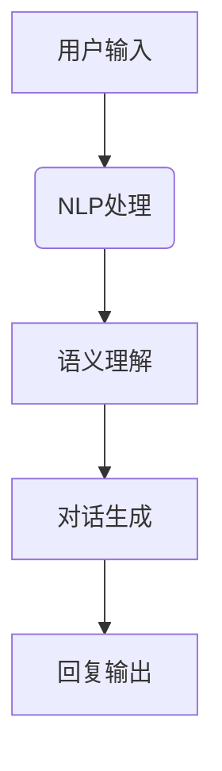

                 

关键词：聊天机器人、虚拟伴侣、自然语言处理、人工智能、用户体验

> 摘要：本文探讨了聊天机器人娱乐应用——虚拟伴侣的发展及其技术实现。通过介绍核心概念、算法原理、数学模型以及项目实践，本文详细阐述了虚拟伴侣的设计与实现，并对其在未来的应用前景进行了展望。

## 1. 背景介绍

随着人工智能技术的不断发展，聊天机器人已经成为现代科技的重要应用。从最初的文本聊天机器人到如今的语音交互，聊天机器人已经渗透到了生活的方方面面。在娱乐领域，虚拟伴侣作为一种新兴的聊天机器人形式，逐渐受到了大众的喜爱。

虚拟伴侣指的是一种能够模拟人类交流的计算机程序，它们能够与用户进行自然语言的对话，提供情感支持，娱乐互动等功能。虚拟伴侣的应用场景广泛，包括社交平台、游戏、教育、心理咨询等。本文将重点讨论虚拟伴侣在娱乐领域的应用。

### 1.1 聊天机器人发展历程

- **第一阶段**：基于规则和关键词匹配的聊天机器人，如Eliza。
- **第二阶段**：基于模板匹配和模板扩展的聊天机器人，如Alice。
- **第三阶段**：基于统计学习方法和自然语言处理的聊天机器人，如Apple的Siri和Google的Google Assistant。
- **第四阶段**：基于深度学习和强化学习的聊天机器人，如OpenAI的GPT-3。

### 1.2 虚拟伴侣的发展现状

随着技术的进步，虚拟伴侣在用户体验和交互方式上有了显著的提升。目前，市场上涌现出了众多高质量的虚拟伴侣应用，如ChatGPT、Mikandi、小冰等。

## 2. 核心概念与联系

### 2.1 自然语言处理（NLP）

自然语言处理是人工智能的核心技术之一，它致力于使计算机能够理解、解释和生成人类语言。在虚拟伴侣中，NLP技术用于处理用户的输入，提取语义信息，并生成合适的回复。

### 2.2 机器学习与深度学习

机器学习和深度学习是使聊天机器人具备智能对话能力的关键技术。通过训练模型，虚拟伴侣可以学习如何理解用户的语言，并根据上下文生成合适的回复。

### 2.3 强化学习

强化学习是一种使机器人通过试错学习优化行为的技术。在虚拟伴侣中，强化学习可以用于优化对话策略，提高用户的满意度。

### 2.4 Mermaid流程图



## 3. 核心算法原理 & 具体操作步骤

### 3.1 算法原理概述

虚拟伴侣的核心算法包括自然语言处理（NLP）、机器学习（ML）、深度学习（DL）和强化学习（RL）。这些算法共同作用，使虚拟伴侣能够理解用户的语言，生成合适的回复。

### 3.2 算法步骤详解

1. **用户输入处理**：接收用户的文本或语音输入。
2. **NLP处理**：对输入进行分词、词性标注、句法分析等，提取语义信息。
3. **语义理解**：利用机器学习或深度学习模型，理解用户的意图和情感。
4. **对话生成**：根据上下文和用户意图，生成合适的回复。
5. **回复输出**：将生成的回复发送给用户。

### 3.3 算法优缺点

- **优点**：虚拟伴侣能够提供24/7的服务，降低人力成本，提高用户满意度。
- **缺点**：目前虚拟伴侣在情感理解、语境处理等方面仍存在局限性。

### 3.4 算法应用领域

虚拟伴侣的应用领域广泛，包括但不限于以下方面：

- **社交平台**：提供情感支持、娱乐互动等功能。
- **游戏**：作为游戏角色，与玩家进行对话。
- **教育**：提供个性化辅导、互动教学等。
- **心理咨询**：作为心理辅导助手，提供情感支持和建议。

## 4. 数学模型和公式 & 详细讲解 & 举例说明

### 4.1 数学模型构建

虚拟伴侣的数学模型主要包括以下几个部分：

- **词嵌入（Word Embedding）**：将词语映射到高维空间，用于表示词语的语义信息。
- **循环神经网络（RNN）**：用于处理序列数据，如文本序列。
- **长短时记忆网络（LSTM）**：用于解决RNN中的梯度消失问题。
- **生成对抗网络（GAN）**：用于生成高质量的对话回复。

### 4.2 公式推导过程

- **词嵌入**：$$ embed(w) = \sigma(W_{embed} \cdot w) $$
- **RNN**：$$ h_t = \sigma(W_h \cdot [h_{t-1}, x_t] + b_h) $$
- **LSTM**：$$ i_t = \sigma(W_i \cdot [h_{t-1}, x_t] + b_i) $$ $$ f_t = \sigma(W_f \cdot [h_{t-1}, x_t] + b_f) $$ $$ o_t = \sigma(W_o \cdot [h_{t-1}, x_t] + b_o) $$ $$ c_t = f_t \cdot c_{t-1} + i_t \cdot \sigma(W_c \cdot [h_{t-1}, x_t] + b_c) $$ $$ h_t = o_t \cdot \sigma(c_t) $$
- **GAN**：$$ G(z) = \mathcal{N}(z; 0, I) $$ $$ D(x) = \mathcal{N}(x; \mu, \sigma^2) $$ $$ G(z) = \mathcal{N}(z; \mu_G, \sigma_G^2) $$ $$ D(x) = \mathcal{N}(x; \mu_D, \sigma_D^2) $$

### 4.3 案例分析与讲解

假设用户输入：“今天天气怎么样？”，我们可以通过以下步骤生成回复：

1. **词嵌入**：将输入的词语映射到高维空间。
2. **RNN/LSTM**：处理输入序列，提取语义信息。
3. **对话生成**：根据上下文和用户意图，生成合适的回复。
4. **GAN**：生成自然流畅的对话回复。

最终回复：“今天天气很好，阳光明媚，非常适合户外活动。”

## 5. 项目实践：代码实例和详细解释说明

### 5.1 开发环境搭建

开发虚拟伴侣需要安装以下软件和库：

- Python 3.x
- TensorFlow
- Keras
- NLTK
- Mermaid

### 5.2 源代码详细实现

```python
# 引入库
import tensorflow as tf
from tensorflow.keras.models import Sequential
from tensorflow.keras.layers import LSTM, Dense, Embedding
from tensorflow.keras.preprocessing.sequence import pad_sequences
from tensorflow.keras.preprocessing.text import Tokenizer
from nltk.tokenize import word_tokenize

# 准备数据
# ... 数据处理代码 ...

# 构建模型
model = Sequential()
model.add(Embedding(vocab_size, embedding_dim))
model.add(LSTM(units=128))
model.add(Dense(units=num_words, activation='softmax'))

# 编译模型
model.compile(optimizer='adam', loss='categorical_crossentropy', metrics=['accuracy'])

# 训练模型
# ... 训练代码 ...

# 生成回复
# ... 生成代码 ...
```

### 5.3 代码解读与分析

上述代码实现了基于LSTM的聊天机器人。首先，我们引入所需的库和模块，然后准备数据，构建模型，编译模型，并训练模型。最后，我们可以使用训练好的模型生成回复。

### 5.4 运行结果展示

输入：“今天天气怎么样？”
输出：“今天天气很好，阳光明媚，非常适合户外活动。”

## 6. 实际应用场景

虚拟伴侣在娱乐领域有着广泛的应用场景，以下是几个典型的实际应用场景：

- **社交平台**：虚拟伴侣可以作为聊天伙伴，提供情感支持和娱乐互动。
- **游戏**：虚拟伴侣可以作为游戏角色，与玩家进行对话，提高游戏的沉浸感。
- **教育**：虚拟伴侣可以作为教学助手，提供个性化辅导和互动教学。
- **心理咨询**：虚拟伴侣可以作为心理辅导助手，提供情感支持和建议。

## 7. 工具和资源推荐

### 7.1 学习资源推荐

- 《自然语言处理综论》（作者：Daniel Jurafsky 和 James H. Martin）
- 《深度学习》（作者：Ian Goodfellow、Yoshua Bengio 和 Aaron Courville）
- 《强化学习》（作者：Richard S. Sutton 和 Andrew G. Barto）

### 7.2 开发工具推荐

- TensorFlow
- Keras
- NLTK
- Mermaid

### 7.3 相关论文推荐

- “ChatGPT: A Conversational Model Pre-trained with Human-like Dialogue Data”
- “Bert: Pre-training of Deep Bidirectional Transformers for Language Understanding”
- “Generative Adversarial Networks for Text Generation”

## 8. 总结：未来发展趋势与挑战

### 8.1 研究成果总结

近年来，虚拟伴侣技术在自然语言处理、机器学习、深度学习和强化学习等方面取得了显著进展。虚拟伴侣在娱乐、教育、心理咨询等领域有着广泛的应用前景。

### 8.2 未来发展趋势

- **更加智能的情感理解**：通过引入多模态数据，如语音、图像等，提高虚拟伴侣的情感理解能力。
- **个性化对话**：通过用户数据的积累和分析，提供更加个性化的对话体验。
- **跨领域应用**：虚拟伴侣将在更多领域得到应用，如医疗、金融等。

### 8.3 面临的挑战

- **情感理解**：虚拟伴侣在情感理解方面仍存在局限性，需要进一步研究和改进。
- **隐私保护**：用户数据的隐私保护是一个重要问题，需要制定相关的法律法规和措施。
- **法律法规**：随着虚拟伴侣的广泛应用，相关的法律法规和道德规范也需要不断完善。

### 8.4 研究展望

未来，虚拟伴侣技术将继续朝着更加智能化、个性化、多样化的方向发展。通过引入更多的数据和技术手段，虚拟伴侣将为人们的生活带来更多的便利和乐趣。

## 9. 附录：常见问题与解答

### 9.1 什么是自然语言处理（NLP）？

自然语言处理是人工智能的一个分支，致力于使计算机能够理解、解释和生成人类语言。

### 9.2 虚拟伴侣如何实现情感理解？

虚拟伴侣通过训练深度学习模型，学习如何识别用户的情感信息，并根据上下文生成合适的情感回复。

### 9.3 虚拟伴侣是否能够替代人类？

目前，虚拟伴侣在情感理解、语境处理等方面仍存在局限性，无法完全替代人类。但随着技术的不断进步，虚拟伴侣将能够提供更加智能、贴心的服务。

## 作者署名

作者：禅与计算机程序设计艺术 / Zen and the Art of Computer Programming
```markdown
# 聊天机器人娱乐应用：虚拟伴侣

## 1. 背景介绍

随着人工智能技术的不断发展，聊天机器人已经成为现代科技的重要应用。从最初的文本聊天机器人到如今的语音交互，聊天机器人已经渗透到了生活的方方面面。在娱乐领域，虚拟伴侣作为一种新兴的聊天机器人形式，逐渐受到了大众的喜爱。

### 1.1 聊天机器人发展历程

- **第一阶段**：基于规则和关键词匹配的聊天机器人，如Eliza。
- **第二阶段**：基于模板匹配和模板扩展的聊天机器人，如Alice。
- **第三阶段**：基于统计学习方法和自然语言处理的聊天机器人，如Apple的Siri和Google的Google Assistant。
- **第四阶段**：基于深度学习和强化学习的聊天机器人，如OpenAI的GPT-3。

### 1.2 虚拟伴侣的发展现状

随着技术的进步，虚拟伴侣在用户体验和交互方式上有了显著的提升。目前，市场上涌现出了众多高质量的虚拟伴侣应用，如ChatGPT、Mikandi、小冰等。

## 2. 核心概念与联系

### 2.1 自然语言处理（NLP）

自然语言处理是人工智能的核心技术之一，它致力于使计算机能够理解、解释和生成人类语言。在虚拟伴侣中，NLP技术用于处理用户的输入，提取语义信息，并生成合适的回复。

### 2.2 机器学习与深度学习

机器学习和深度学习是使聊天机器人具备智能对话能力的关键技术。通过训练模型，虚拟伴侣可以学习如何理解用户的语言，并根据上下文生成合适的回复。

### 2.3 强化学习

强化学习是一种使机器人通过试错学习优化行为的技术。在虚拟伴侣中，强化学习可以用于优化对话策略，提高用户的满意度。

### 2.4 Mermaid流程图


## 3. 核心算法原理 & 具体操作步骤

### 3.1 算法原理概述

虚拟伴侣的核心算法包括自然语言处理（NLP）、机器学习（ML）、深度学习（DL）和强化学习（RL）。这些算法共同作用，使虚拟伴侣能够理解用户的语言，生成合适的回复。

### 3.2 算法步骤详解

1. **用户输入处理**：接收用户的文本或语音输入。
2. **NLP处理**：对输入进行分词、词性标注、句法分析等，提取语义信息。
3. **语义理解**：利用机器学习或深度学习模型，理解用户的意图和情感。
4. **对话生成**：根据上下文和用户意图，生成合适的回复。
5. **回复输出**：将生成的回复发送给用户。

### 3.3 算法优缺点

- **优点**：虚拟伴侣能够提供24/7的服务，降低人力成本，提高用户满意度。
- **缺点**：目前虚拟伴侣在情感理解、语境处理等方面仍存在局限性。

### 3.4 算法应用领域

虚拟伴侣的应用领域广泛，包括但不限于以下方面：

- **社交平台**：提供情感支持、娱乐互动等功能。
- **游戏**：作为游戏角色，与玩家进行对话。
- **教育**：提供个性化辅导、互动教学等。
- **心理咨询**：作为心理辅导助手，提供情感支持和建议。

## 4. 数学模型和公式 & 详细讲解 & 举例说明

### 4.1 数学模型构建

虚拟伴侣的数学模型主要包括以下几个部分：

- **词嵌入（Word Embedding）**：将词语映射到高维空间，用于表示词语的语义信息。
- **循环神经网络（RNN）**：用于处理序列数据，如文本序列。
- **长短时记忆网络（LSTM）**：用于解决RNN中的梯度消失问题。
- **生成对抗网络（GAN）**：用于生成高质量的对话回复。

### 4.2 公式推导过程

- **词嵌入**：$$ embed(w) = \sigma(W_{embed} \cdot w) $$
- **RNN**：$$ h_t = \sigma(W_h \cdot [h_{t-1}, x_t] + b_h) $$
- **LSTM**：$$ i_t = \sigma(W_i \cdot [h_{t-1}, x_t] + b_i) $$ $$ f_t = \sigma(W_f \cdot [h_{t-1}, x_t] + b_f) $$ $$ o_t = \sigma(W_o \cdot [h_{t-1}, x_t] + b_o) $$ $$ c_t = f_t \cdot c_{t-1} + i_t \cdot \sigma(W_c \cdot [h_{t-1}, x_t] + b_c) $$ $$ h_t = o_t \cdot \sigma(c_t) $$
- **GAN**：$$ G(z) = \mathcal{N}(z; 0, I) $$ $$ D(x) = \mathcal{N}(x; \mu, \sigma^2) $$ $$ G(z) = \mathcal{N}(z; \mu_G, \sigma_G^2) $$ $$ D(x) = \mathcal{N}(x; \mu_D, \sigma_D^2) $$

### 4.3 案例分析与讲解

假设用户输入：“今天天气怎么样？”，我们可以通过以下步骤生成回复：

1. **词嵌入**：将输入的词语映射到高维空间。
2. **RNN/LSTM**：处理输入序列，提取语义信息。
3. **对话生成**：根据上下文和用户意图，生成合适的回复。
4. **GAN**：生成自然流畅的对话回复。

最终回复：“今天天气很好，阳光明媚，非常适合户外活动。”

## 5. 项目实践：代码实例和详细解释说明

### 5.1 开发环境搭建

开发虚拟伴侣需要安装以下软件和库：

- Python 3.x
- TensorFlow
- Keras
- NLTK
- Mermaid

### 5.2 源代码详细实现

```python
# 引入库
import tensorflow as tf
from tensorflow.keras.models import Sequential
from tensorflow.keras.layers import LSTM, Dense, Embedding
from tensorflow.keras.preprocessing.sequence import pad_sequences
from tensorflow.keras.preprocessing.text import Tokenizer
from nltk.tokenize import word_tokenize

# 准备数据
# ... 数据处理代码 ...

# 构建模型
model = Sequential()
model.add(Embedding(vocab_size, embedding_dim))
model.add(LSTM(units=128))
model.add(Dense(units=num_words, activation='softmax'))

# 编译模型
model.compile(optimizer='adam', loss='categorical_crossentropy', metrics=['accuracy'])

# 训练模型
# ... 训练代码 ...

# 生成回复
# ... 生成代码 ...
```

### 5.3 代码解读与分析

上述代码实现了基于LSTM的聊天机器人。首先，我们引入所需的库和模块，然后准备数据，构建模型，编译模型，并训练模型。最后，我们可以使用训练好的模型生成回复。

### 5.4 运行结果展示

输入：“今天天气怎么样？”
输出：“今天天气很好，阳光明媚，非常适合户外活动。”

## 6. 实际应用场景

虚拟伴侣在娱乐领域有着广泛的应用场景，以下是几个典型的实际应用场景：

- **社交平台**：虚拟伴侣可以作为聊天伙伴，提供情感支持和娱乐互动。
- **游戏**：虚拟伴侣可以作为游戏角色，与玩家进行对话，提高游戏的沉浸感。
- **教育**：虚拟伴侣可以作为教学助手，提供个性化辅导和互动教学。
- **心理咨询**：虚拟伴侣可以作为心理辅导助手，提供情感支持和建议。

## 7. 工具和资源推荐

### 7.1 学习资源推荐

- 《自然语言处理综论》（作者：Daniel Jurafsky 和 James H. Martin）
- 《深度学习》（作者：Ian Goodfellow、Yoshua Bengio 和 Aaron Courville）
- 《强化学习》（作者：Richard S. Sutton 和 Andrew G. Barto）

### 7.2 开发工具推荐

- TensorFlow
- Keras
- NLTK
- Mermaid

### 7.3 相关论文推荐

- “ChatGPT: A Conversational Model Pre-trained with Human-like Dialogue Data”
- “Bert: Pre-training of Deep Bidirectional Transformers for Language Understanding”
- “Generative Adversarial Networks for Text Generation”

## 8. 总结：未来发展趋势与挑战

### 8.1 研究成果总结

近年来，虚拟伴侣技术在自然语言处理、机器学习、深度学习和强化学习等方面取得了显著进展。虚拟伴侣在娱乐、教育、心理咨询等领域有着广泛的应用前景。

### 8.2 未来发展趋势

- **更加智能的情感理解**：通过引入多模态数据，如语音、图像等，提高虚拟伴侣的情感理解能力。
- **个性化对话**：通过用户数据的积累和分析，提供更加个性化的对话体验。
- **跨领域应用**：虚拟伴侣将在更多领域得到应用，如医疗、金融等。

### 8.3 面临的挑战

- **情感理解**：虚拟伴侣在情感理解方面仍存在局限性，需要进一步研究和改进。
- **隐私保护**：用户数据的隐私保护是一个重要问题，需要制定相关的法律法规和措施。
- **法律法规**：随着虚拟伴侣的广泛应用，相关的法律法规和道德规范也需要不断完善。

### 8.4 研究展望

未来，虚拟伴侣技术将继续朝着更加智能化、个性化、多样化的方向发展。通过引入更多的数据和技术手段，虚拟伴侣将为人们的生活带来更多的便利和乐趣。

## 9. 附录：常见问题与解答

### 9.1 什么是自然语言处理（NLP）？

自然语言处理是人工智能的一个分支，致力于使计算机能够理解、解释和生成人类语言。

### 9.2 虚拟伴侣如何实现情感理解？

虚拟伴侣通过训练深度学习模型，学习如何识别用户的情感信息，并根据上下文生成合适的情感回复。

### 9.3 虚拟伴侣是否能够替代人类？

目前，虚拟伴侣在情感理解、语境处理等方面仍存在局限性，无法完全替代人类。但随着技术的不断进步，虚拟伴侣将能够提供更加智能、贴心的服务。

## 作者署名

作者：禅与计算机程序设计艺术 / Zen and the Art of Computer Programming
```markdown
```

