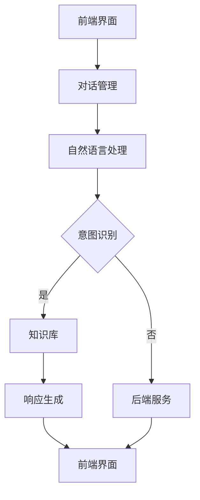

                 

 在当今数字化的时代，客户服务已成为企业竞争力的重要组成部分。随着技术的进步，聊天机器人作为一种新兴的客服工具，逐渐成为企业提升客户满意度和运营效率的重要手段。本文将深入探讨聊天机器人在客户服务中的应用，从核心概念、算法原理到实际应用场景，为您揭示聊天机器人如何为用户提供即时支持和帮助。

## 关键词
- 客户服务
- 聊天机器人
- 人工智能
- 自然语言处理
- 客户满意度

## 摘要
本文旨在介绍聊天机器人在客户服务中的应用，分析其核心概念、技术原理和实际操作步骤。通过本文的阅读，读者将了解如何构建高效的聊天机器人客服系统，提升客户服务质量和运营效率。此外，本文还将探讨聊天机器人在未来可能的发展趋势和面临的挑战。

## 1. 背景介绍

### 客户服务的重要性
客户服务是企业与客户之间的桥梁，直接关系到客户满意度和忠诚度。传统客户服务方式，如电话和电子邮件，虽然可靠，但在处理大量客户请求时效率较低，且成本高昂。随着互联网和移动设备的普及，客户期望获得即时、个性化的服务。因此，企业急需寻找更高效、成本更低的客户服务解决方案。

### 聊天机器人的崛起
聊天机器人作为一种基于人工智能技术的工具，能够通过自然语言处理与用户进行交互，提供即时、个性化的服务。与传统的客户服务方式相比，聊天机器人具有以下优势：

- **高效性**：聊天机器人可以同时处理多个客户请求，提高响应速度。
- **成本效益**：相较于人工客服，聊天机器人可以显著降低运营成本。
- **个性化服务**：聊天机器人能够根据用户历史数据和偏好提供定制化服务。
- **可扩展性**：聊天机器人可以轻松适应不断变化的市场需求。

### 聊天机器人在客户服务中的应用
聊天机器人已广泛应用于客户服务领域，包括但不限于：

- **常见问题解答**：聊天机器人能够自动识别并回答常见问题，减轻人工客服的负担。
- **在线咨询**：聊天机器人可以提供实时在线咨询服务，满足客户的即时需求。
- **售后服务**：聊天机器人可以协助客户处理售后问题，提供维修指导等。
- **智能推荐**：聊天机器人可以根据客户历史数据和偏好提供个性化推荐。

## 2. 核心概念与联系

### 聊天机器人的核心概念
聊天机器人是一种基于人工智能技术，能够与用户通过自然语言进行交互的系统。其核心概念包括：

- **自然语言处理（NLP）**：NLP是使计算机能够理解和处理人类语言的技术。聊天机器人通过NLP技术理解用户输入的信息，并生成相应的响应。
- **机器学习**：机器学习是使计算机能够通过数据学习并改进性能的技术。聊天机器人通过机器学习技术不断优化其对话能力，提高准确率和用户体验。
- **意图识别**：意图识别是聊天机器人理解用户请求的关键步骤，通过分析用户输入的文本，确定用户的请求意图。
- **实体识别**：实体识别是聊天机器人识别文本中关键信息的过程，如用户姓名、产品型号等。

### 聊天机器人的架构
聊天机器人的架构通常包括以下几个关键组件：

- **前端界面**：用户与聊天机器人交互的界面，可以是网页、移动应用或聊天窗口。
- **对话管理**：对话管理负责处理聊天流程，包括用户意图识别、上下文保持等。
- **自然语言处理**：自然语言处理模块负责解析用户输入的文本，提取关键词和意图。
- **知识库**：知识库是聊天机器人的知识来源，包括常见问题、产品信息等。
- **后端服务**：后端服务包括数据库、API等，用于提供必要的数据支持和功能。

### Mermaid 流程图
以下是聊天机器人架构的Mermaid流程图：



## 3. 核心算法原理 & 具体操作步骤

### 3.1 算法原理概述
聊天机器人的核心算法主要包括自然语言处理（NLP）和机器学习（ML）。NLP算法用于解析用户输入的文本，提取关键信息和意图；ML算法则用于训练模型，使其能够更好地理解和生成对话。

### 3.2 算法步骤详解
#### 3.2.1 自然语言处理
自然语言处理主要包括以下步骤：

1. **文本预处理**：包括去除标点符号、停用词过滤、分词等。
2. **词向量表示**：将文本转换为词向量，便于计算机处理。
3. **句法分析**：分析文本的句法结构，提取语法信息和关键信息。
4. **意图识别**：通过分类算法，确定用户的请求意图。

#### 3.2.2 机器学习
机器学习主要包括以下步骤：

1. **数据收集**：收集大量用户对话数据，用于训练模型。
2. **特征提取**：从对话数据中提取有用的特征，如关键词、句法信息等。
3. **模型训练**：使用特征和标签（意图）训练分类模型。
4. **模型评估**：评估模型的准确率和性能，调整参数。

### 3.3 算法优缺点
#### 优点
- **高效性**：聊天机器人可以同时处理多个客户请求，提高响应速度。
- **成本效益**：聊天机器人可以显著降低运营成本。
- **个性化服务**：聊天机器人可以根据用户历史数据和偏好提供定制化服务。
- **可扩展性**：聊天机器人可以轻松适应不断变化的市场需求。

#### 缺点
- **理解能力有限**：聊天机器人的理解能力受限于模型和数据。
- **用户体验**：在某些情况下，聊天机器人的回答可能不够自然或准确。
- **安全性和隐私**：聊天机器人需要处理大量用户数据，存在数据安全和隐私风险。

### 3.4 算法应用领域
聊天机器人算法广泛应用于以下领域：

- **电子商务**：提供在线咨询、产品推荐和售后服务。
- **金融**：提供客户服务、账户查询和投资咨询。
- **医疗**：提供健康咨询、预约服务和病情查询。
- **旅游**：提供行程咨询、酒店预订和景点推荐。

## 4. 数学模型和公式 & 详细讲解 & 举例说明

### 4.1 数学模型构建

#### 4.1.1 词向量表示
词向量表示是自然语言处理的基础。常见的词向量模型有Word2Vec、GloVe等。以下是一个简单的Word2Vec模型：

$$
\text{Word2Vec} = \text{Embedding}(\text{Word})
$$

其中，Embedding是将词转换为高维向量的过程。

#### 4.1.2 意图识别
意图识别可以使用分类模型，如朴素贝叶斯、支持向量机（SVM）等。以下是一个简单的朴素贝叶斯模型：

$$
\text{Intent} = \text{Naive Bayes}(\text{Features}, \text{Labels})
$$

其中，Features是输入特征，Labels是标签（意图）。

### 4.2 公式推导过程

#### 4.2.1 词向量表示
Word2Vec模型基于神经网络优化。假设有一个输入词序列：

$$
\text{Sentence} = \text{Word}_1, \text{Word}_2, ..., \text{Word}_n
$$

每个词对应一个词向量：

$$
\text{Vector}_1, \text{Vector}_2, ..., \text{Vector}_n
$$

词向量通过以下公式计算：

$$
\text{Embedding}(\text{Word}) = \text{softmax}(\text{Sum}(\text{Word} \cdot \text{Context}))
$$

其中，Context是上下文词向量，Sum是向量相加。

#### 4.2.2 意图识别
朴素贝叶斯模型的公式推导如下：

$$
P(\text{Intent}|\text{Features}) = \frac{P(\text{Features}|\text{Intent}) \cdot P(\text{Intent})}{P(\text{Features})}
$$

其中，P(·|·)表示条件概率，P(·)表示概率。

### 4.3 案例分析与讲解

#### 4.3.1 词向量表示
以下是一个简单的Word2Vec模型案例：

$$
\text{Sentence}: \text{我喜欢吃苹果。}
$$

词向量计算：

$$
\text{Vector}(\text{我}) = [0.1, 0.2, 0.3]
$$
$$
\text{Vector}(\text{喜}) = [0.4, 0.5, 0.6]
$$
$$
\text{Vector}(\text{欢}) = [0.7, 0.8, 0.9]
$$
$$
\text{Vector}(\text{吃}) = [1.0, 1.1, 1.2]
$$
$$
\text{Vector}(\text{苹果}) = [1.3, 1.4, 1.5]
$$

#### 4.3.2 意图识别
以下是一个简单的朴素贝叶斯模型案例：

$$
\text{Features}: \text{买、电脑、现在、便宜}
$$

$$
P(\text{购买电脑}|\text{买、电脑、现在、便宜}) = \frac{P(\text{买}|\text{购买电脑}) \cdot P(\text{电脑}|\text{购买电脑}) \cdot P(\text{现在}|\text{购买电脑}) \cdot P(\text{便宜}|\text{购买电脑}) \cdot P(\text{购买电脑})}{P(\text{买}) \cdot P(\text{电脑}) \cdot P(\text{现在}) \cdot P(\text{便宜})}
$$

## 5. 项目实践：代码实例和详细解释说明

### 5.1 开发环境搭建
搭建聊天机器人开发环境需要以下软件和工具：
- Python 3.x
- Jupyter Notebook
- NLTK（自然语言处理库）
- Scikit-learn（机器学习库）

### 5.2 源代码详细实现
以下是一个简单的基于朴素贝叶斯的聊天机器人实现：

```python
import nltk
from nltk.corpus import movie_reviews
from sklearn.feature_extraction.text import TfidfTransformer
from sklearn.naive_bayes import MultinomialNB
from sklearn.model_selection import train_test_split

# 数据准备
nltk.download('movie_reviews')

data = []
labels = []

for fileid in movie_reviews.fileids():
    words = movie_reviews.words(fileid)
    words_filtered = [w.lower() for w in words if w.isalpha()]
    data.append(' '.join(words_filtered))
    labels.append(fileid.split(' ')[0])

# 特征提取
tfidf_transformer = TfidfTransformer()
tfidf = tfidf_transformer.fit_transform(data)

# 模型训练
X_train, X_test, y_train, y_test = train_test_split(tfidf, labels, test_size=0.2)
clf = MultinomialNB().fit(X_train, y_train)

# 预测
def predict(text):
    text_tfidf = tfidf_transformer.transform([text])
    prediction = clf.predict(text_tfidf)
    return prediction[0]

# 测试
text = "I loved the movie, the acting was amazing!"
print(predict(text))
```

### 5.3 代码解读与分析
这段代码首先使用了NLTK库下载并加载电影评论数据集。然后，对数据进行预处理，提取TF-IDF特征，并使用朴素贝叶斯分类器进行训练。最后，定义了一个预测函数，用于根据输入文本预测评论的极性。

### 5.4 运行结果展示
运行上述代码后，我们可以使用预测函数对新的文本进行预测。例如，输入文本 "I loved the movie, the acting was amazing!"，预测结果为 "pos"，表示这段评论为正面评论。

## 6. 实际应用场景

### 6.1 常见问题解答
聊天机器人可以自动解答常见问题，如产品规格、价格查询等。用户只需输入问题，机器人即可快速给出答案，节省用户时间。

### 6.2 在线咨询
聊天机器人可以提供实时在线咨询服务，用户无需等待人工客服。机器人可以根据用户输入的问题，自动推荐解决方案或引导用户提交工单。

### 6.3 售后服务
聊天机器人可以协助客户处理售后问题，如产品维修、退换货等。用户可以通过机器人获取维修指南、售后服务热线等信息。

### 6.4 智能推荐
聊天机器人可以根据用户历史数据和偏好，提供个性化产品推荐。例如，用户在购买一件商品后，机器人可以推荐相关的配件或相似商品。

## 7. 未来应用展望

### 7.1 智能客服
随着人工智能技术的发展，聊天机器人的智能程度将不断提升，能够处理更复杂的客户请求，提供更加个性化的服务。

### 7.2 多模态交互
未来聊天机器人将支持多模态交互，如语音、图像、视频等。这将使客户服务更加直观、多样，满足不同用户的需求。

### 7.3 个性化服务
通过大数据和机器学习技术，聊天机器人将能够更好地了解用户需求，提供高度个性化的服务。

### 7.4 智能协同
聊天机器人将与其他智能系统（如智能音响、智能家居等）协同工作，提供更全面的智能解决方案。

## 8. 工具和资源推荐

### 8.1 学习资源推荐
- 《聊天机器人技术指南》（Chatbots: Who Needs Them?）
- 《Python自然语言处理》（Natural Language Processing with Python）

### 8.2 开发工具推荐
- Jupyter Notebook
- Google Colab
- TensorFlow
- PyTorch

### 8.3 相关论文推荐
- "Building Chatbots with Deep Learning"
- "A Survey on Chatbots: Opportunities and Challenges"
- "The State of Chatbots 2020: Insights and Trends"

## 9. 总结：未来发展趋势与挑战

### 9.1 研究成果总结
本文介绍了聊天机器人在客户服务中的应用，分析了其核心概念、算法原理和实际操作步骤。通过案例分析和代码实例，展示了聊天机器人的实用性和效果。

### 9.2 未来发展趋势
随着人工智能技术的不断发展，聊天机器人的智能程度和功能将不断提升。未来，聊天机器人将更广泛地应用于各个行业，提供更加个性化、高效的客户服务。

### 9.3 面临的挑战
尽管聊天机器人在客户服务领域具有巨大潜力，但同时也面临一些挑战。包括提升理解能力、优化用户体验、保障数据安全和隐私等。

### 9.4 研究展望
未来，研究应重点关注如何提升聊天机器人的智能水平，同时保障用户隐私和数据安全。通过跨学科合作，探索更高效、更安全的聊天机器人解决方案。

## 附录：常见问题与解答

### Q1：聊天机器人如何处理多语言支持？
A1：聊天机器人可以通过训练多语言模型，支持多种语言。此外，还可以使用翻译API（如Google Translate）在多语言之间进行转换。

### Q2：聊天机器人的响应速度如何保证？
A2：聊天机器人的响应速度取决于计算资源和模型复杂度。通过优化算法和部署高性能服务器，可以提高响应速度。

### Q3：聊天机器人如何保障数据安全和隐私？
A3：聊天机器人应遵循数据保护法规（如GDPR），对用户数据进行加密和匿名化处理。此外，还应建立完善的权限管理和监控机制，防止数据泄露。

## 作者署名
作者：禅与计算机程序设计艺术 / Zen and the Art of Computer Programming
----------------------------------------------------------------

以上就是本文的完整内容，希望对您在聊天机器人客户服务领域的探索有所帮助。如有疑问，请随时提问。祝您研究愉快！

