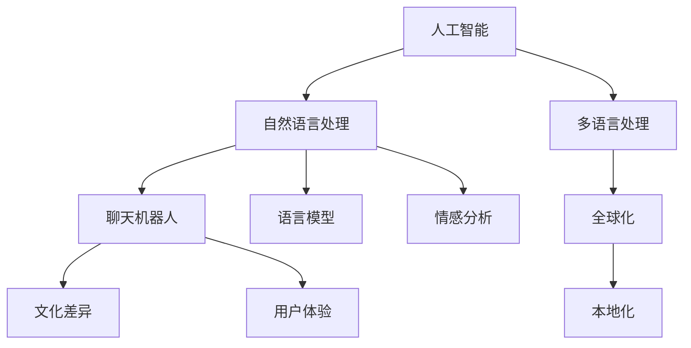

                 

关键词：聊天机器人，文化差异，全球化，本地化，人工智能，国际交流

> 摘要：本文将探讨聊天机器人在全球化与本地化过程中所面临的文化差异问题。通过深入分析文化差异对聊天机器人的影响，我们旨在提供一套有效的策略，帮助开发者构建出既符合全球用户需求，又能贴近本地文化特色的聊天机器人系统。

## 1. 背景介绍

随着人工智能技术的迅猛发展，聊天机器人已成为各类应用场景中不可或缺的一部分。无论是客服系统、教育平台，还是社交网络，聊天机器人都在不断改善用户体验，提升服务效率。然而，在全球化的背景下，不同文化背景的用户对于聊天机器人的期望和使用习惯有着显著的差异。这为聊天机器人的设计和开发提出了新的挑战。

文化差异不仅仅体现在语言上，还包括价值观、行为习惯、表达方式等多个方面。例如，在东方文化中，礼貌和含蓄是重要的交际原则，而在西方文化中，直接和开放则是更受欢迎的交流方式。这些文化差异将直接影响聊天机器人的设计思路、交互策略以及用户体验。

本文将从以下几个角度探讨聊天机器人在全球化与本地化过程中所面临的文化差异问题：

1. **核心概念与联系**：介绍与聊天机器人相关的核心概念，包括人工智能、自然语言处理、文化差异等，并使用Mermaid流程图展示各概念之间的联系。
2. **核心算法原理 & 具体操作步骤**：分析聊天机器人的核心算法原理，包括情感分析、语言模型、多语言处理等，并详细介绍具体的操作步骤。
3. **数学模型和公式 & 详细讲解 & 举例说明**：构建与聊天机器人相关的数学模型，并使用LaTeX格式详细讲解公式推导过程和案例分析。
4. **项目实践：代码实例和详细解释说明**：通过实际项目实例，展示聊天机器人的开发过程和代码实现。
5. **实际应用场景**：探讨聊天机器人在不同文化背景下的应用场景，并分析其成功案例和挑战。
6. **工具和资源推荐**：推荐用于学习和开发聊天机器人的工具、资源和相关论文。
7. **总结：未来发展趋势与挑战**：总结研究成果，展望聊天机器人在未来面临的发展趋势和挑战。

## 2. 核心概念与联系

在探讨聊天机器人的文化差异问题之前，我们首先需要了解与聊天机器人相关的一些核心概念，以及它们之间的联系。以下是一个使用Mermaid绘制的流程图，展示了这些核心概念之间的关系。



### 2.1. 人工智能

人工智能（AI）是聊天机器人的基础，它使得计算机能够模拟人类智能，进行推理、学习、判断和决策。人工智能涵盖了多个领域，包括机器学习、深度学习、自然语言处理等。在聊天机器人的开发过程中，人工智能技术为机器人的智能水平提供了核心支持。

### 2.2. 自然语言处理

自然语言处理（NLP）是人工智能的一个重要分支，专注于使计算机能够理解和处理人类语言。在聊天机器人中，NLP技术被用来理解用户的输入，并生成合适的回复。NLP包括文本分类、实体识别、情感分析等多个子领域。

### 2.3. 聊天机器人

聊天机器人是结合人工智能和自然语言处理技术，实现与人类用户进行交互的计算机程序。聊天机器人的核心目标是提供自然、流畅的交流体验，满足用户的需求。

### 2.4. 文化差异

文化差异是指不同文化背景下的人们在价值观、行为习惯、表达方式等方面的差异。在全球化背景下，文化差异对聊天机器人的设计和开发具有重要影响。理解文化差异有助于开发者构建出更符合用户需求的聊天机器人系统。

### 2.5. 用户体验

用户体验（UX）是聊天机器人的关键考量因素。一个优秀的聊天机器人不仅需要具备智能化的功能，还需要提供愉悦、自然的用户体验。用户体验包括界面设计、交互流程、响应速度等多个方面。

### 2.6. 语言模型

语言模型是自然语言处理的核心技术之一，用于预测下一个单词或短语的概率。在聊天机器人中，语言模型可以帮助机器人生成更自然的回复，提高交互质量。

### 2.7. 情感分析

情感分析是一种基于自然语言处理的技术，用于识别文本中的情感倾向。在聊天机器人中，情感分析可以帮助机器人理解用户的情感状态，并生成更合适的回复。

### 2.8. 多语言处理

多语言处理是全球化背景下的重要技术，使得聊天机器人能够支持多种语言。多语言处理包括翻译、本地化、语言检测等多个方面。

### 2.9. 全球化与本地化

全球化与本地化是两个密切相关的概念。全球化是指企业在全球范围内拓展业务，而本地化则是针对特定地区的用户需求进行适应性调整。在聊天机器人的开发中，全球化与本地化策略有助于满足不同文化背景下的用户需求。

## 3. 核心算法原理 & 具体操作步骤

### 3.1. 算法原理概述

聊天机器人的核心算法主要包括自然语言处理、语言模型、情感分析、多语言处理等。以下是对这些算法原理的简要概述。

#### 自然语言处理（NLP）

自然语言处理是使计算机能够理解和生成人类语言的技术。在聊天机器人中，NLP技术被用来处理用户输入的文本，并生成合适的回复。NLP包括文本预处理、词向量表示、词性标注、实体识别、语义理解等多个子任务。

#### 语言模型

语言模型是一种统计模型，用于预测文本序列中下一个单词或短语的概率。在聊天机器人中，语言模型可以帮助机器人生成更自然的回复。常用的语言模型包括n-gram模型、神经网络语言模型（如LSTM、Transformer等）。

#### 情感分析

情感分析是一种基于自然语言处理的技术，用于识别文本中的情感倾向。在聊天机器人中，情感分析可以帮助机器人理解用户的情感状态，并生成更合适的回复。情感分析包括情感分类、情感极性分析等任务。

#### 多语言处理

多语言处理是全球化背景下的重要技术，使得聊天机器人能够支持多种语言。多语言处理包括翻译、本地化、语言检测等多个方面。翻译技术可以将一种语言的文本翻译成另一种语言，本地化则是针对特定地区的用户需求进行适应性调整，语言检测则是用于识别输入文本的语言类型。

### 3.2. 算法步骤详解

以下是一个简化的聊天机器人算法步骤，展示了从用户输入到生成回复的过程。

#### 3.2.1. 文本预处理

- 清洗文本：去除无关的标点符号、HTML标签等。
- 分词：将文本分割成词语或词组。
- 词性标注：为每个词语标注其词性，如名词、动词、形容词等。
- 实体识别：识别文本中的实体，如人名、地名、组织名等。

#### 3.2.2. 语义理解

- 词向量表示：将词语映射到高维空间中的向量表示。
- 上下文分析：分析输入文本的上下文信息，理解用户的需求和意图。
- 情感分析：识别文本中的情感倾向，如正面、负面、中性等。

#### 3.2.3. 语言模型生成回复

- 语言模型：利用训练好的语言模型，生成可能的回复序列。
- 生成回复：从可能的回复序列中选择一个最合适的回复。

#### 3.2.4. 多语言处理

- 翻译：如果需要，将回复翻译成用户的语言。
- 本地化：根据本地化策略，对回复进行适应性调整。

#### 3.2.5. 输出回复

- 输出回复：将生成的回复发送给用户。

### 3.3. 算法优缺点

#### 优点

- 高效：聊天机器人可以同时处理多个用户请求，提高服务效率。
- 个性化：通过自然语言处理技术，聊天机器人可以理解用户的意图和需求，提供个性化的服务。
- 智能化：基于人工智能技术，聊天机器人可以不断学习和优化，提高交互质量。

#### 缺点

- 语言理解能力有限：尽管自然语言处理技术不断发展，但聊天机器人在语言理解和复杂对话管理方面仍存在一定的局限性。
- 文化差异挑战：不同文化背景的用户对聊天机器人的期望和需求存在差异，这增加了设计和开发难度。
- 数据隐私和安全问题：聊天机器人需要处理大量的用户数据，涉及隐私和安全问题。

### 3.4. 算法应用领域

聊天机器人的算法在多个领域得到广泛应用，以下是一些典型的应用场景。

- **客服系统**：聊天机器人可以自动回答常见问题，提高客户服务质量。
- **教育平台**：聊天机器人可以为学生提供个性化辅导，提高学习效果。
- **社交网络**：聊天机器人可以与用户互动，提供娱乐和社交服务。
- **医疗保健**：聊天机器人可以辅助医生进行病情诊断和患者管理。

## 4. 数学模型和公式 & 详细讲解 & 举例说明

### 4.1. 数学模型构建

在聊天机器人中，数学模型的应用主要集中在自然语言处理、语言模型和情感分析等领域。以下是一个简单的数学模型构建示例。

#### 自然语言处理

自然语言处理中的文本分类问题可以表示为一个二分类问题，可以使用逻辑回归模型进行建模。假设我们有一个训练数据集\( D = \{ (x_i, y_i) \} \)，其中\( x_i \)是输入文本，\( y_i \)是标签（0表示非某类，1表示某类）。逻辑回归模型的目标是学习一个权重向量\( \theta \)，使得对于输入文本\( x \)，预测的概率为：

$$
P(y=1|x; \theta) = \frac{1}{1 + e^{-\theta^T x}}
$$

#### 语言模型

语言模型可以使用n-gram模型进行建模。假设我们有一个n-gram序列\( w_1, w_2, ..., w_n \)，其概率可以表示为：

$$
P(w_1, w_2, ..., w_n) = P(w_n | w_{n-1}, ..., w_1) \times P(w_{n-1} | w_{n-2}, ..., w_1) \times ... \times P(w_1)
$$

可以使用最大似然估计（MLE）方法估计参数，即：

$$
\theta_j = \frac{\sum_{i=1}^n f_j^{(n)}(w_i)}{\sum_{i=1}^n f^{(n)}(w_i)}
$$

其中，\( f_j^{(n)}(w_i) \)表示词\( w_i \)在n-gram序列中出现的次数，\( f^{(n)}(w_i) \)表示所有n-gram序列中词\( w_i \)的出现次数。

#### 情感分析

情感分析可以使用支持向量机（SVM）进行建模。假设我们有一个训练数据集\( D = \{ (x_i, y_i) \} \)，其中\( x_i \)是输入文本，\( y_i \)是标签（0表示负面情感，1表示正面情感）。SVM的目标是找到一个超平面，使得正负样本在超平面的两侧尽可能分开。其优化问题可以表示为：

$$
\min_{\theta} \frac{1}{2} ||\theta||^2 \\
\text{subject to} \quad y_i (\theta^T x_i + b) \geq 1
$$

### 4.2. 公式推导过程

#### 自然语言处理

逻辑回归模型的推导过程如下：

- 假设我们有一个线性模型：

$$
\theta^T x = \sum_{j=1}^n \theta_j x_j
$$

其中，\( \theta \)是权重向量，\( x \)是特征向量。

- 为了得到概率形式，我们引入一个变换函数\( s(z) = \frac{1}{1 + e^{-z}} \)：

$$
P(y=1|x; \theta) = \frac{1}{1 + e^{-(\theta^T x)}} \\
P(y=0|x; \theta) = \frac{1}{1 + e^{(\theta^T x)}}
$$

- 对数似然函数为：

$$
L(\theta) = \sum_{i=1}^n y_i \theta^T x_i - \sum_{i=1}^n \theta^T x_i
$$

- 对\( \theta \)求导并令其等于0，得到：

$$
\nabla_{\theta} L(\theta) = \sum_{i=1}^n y_i x_i - \sum_{i=1}^n x_i = 0 \\
\theta = \sum_{i=1}^n \theta_i x_i
$$

#### 语言模型

n-gram模型的推导过程如下：

- 假设我们有一个n-gram序列\( w_1, w_2, ..., w_n \)，其概率为：

$$
P(w_1, w_2, ..., w_n) = P(w_n | w_{n-1}, ..., w_1) \times P(w_{n-1} | w_{n-2}, ..., w_1) \times ... \times P(w_1)
$$

- 使用马尔可夫假设，即：

$$
P(w_n | w_{n-1}, ..., w_1) = P(w_n | w_{n-1})
$$

- 对所有n-gram序列求和，得到：

$$
P(w_1, w_2, ..., w_n) = P(w_n | w_{n-1}) \times P(w_{n-1} | w_{n-2}) \times ... \times P(w_1)
$$

- 最大似然估计：

$$
\theta_j = \frac{\sum_{i=1}^n f_j^{(n)}(w_i)}{\sum_{i=1}^n f^{(n)}(w_i)}
$$

#### 情感分析

支持向量机的推导过程如下：

- 假设我们有一个线性可分的数据集，可以使用硬间隔分类器。其目标是最小化目标函数：

$$
\min_{\theta, b} \frac{1}{2} ||\theta||^2 \\
\text{subject to} \quad y_i (\theta^T x_i + b) \geq 1
$$

- 对于非线性数据集，可以使用核函数将数据映射到高维空间，实现线性可分。其目标是最小化目标函数：

$$
\min_{\theta, b} \frac{1}{2} ||\theta||^2 \\
\text{subject to} \quad y_i (\theta^T \phi(x_i) + b) \geq 1
$$

其中，\( \phi(x_i) \)是核函数映射。

### 4.3. 案例分析与讲解

#### 案例一：文本分类

假设我们有一个新闻分类任务，需要将新闻文章分类为体育、娱乐、政治等类别。我们可以使用逻辑回归模型进行建模。

1. **数据预处理**：将新闻文章进行文本预处理，包括分词、词性标注等。
2. **特征提取**：使用词袋模型（Bag of Words）提取特征，将文本表示为一个向量。
3. **模型训练**：使用训练数据集训练逻辑回归模型，得到权重向量\( \theta \)。
4. **模型评估**：使用测试数据集评估模型性能，计算准确率、召回率等指标。

#### 案例二：情感分析

假设我们有一个情感分析任务，需要识别文本中的情感倾向，如正面、负面等。我们可以使用支持向量机进行建模。

1. **数据预处理**：将文本进行预处理，包括分词、词性标注等。
2. **特征提取**：使用词袋模型提取特征，将文本表示为一个向量。
3. **模型训练**：使用训练数据集训练支持向量机模型，得到权重向量\( \theta \)和偏置\( b \)。
4. **模型评估**：使用测试数据集评估模型性能，计算准确率、召回率等指标。

## 5. 项目实践：代码实例和详细解释说明

在本节中，我们将通过一个实际项目实例，展示如何开发一个简单的聊天机器人，并对其进行详细解释说明。

### 5.1. 开发环境搭建

为了开发聊天机器人，我们需要准备以下开发环境：

- Python 3.8及以上版本
- PyCharm或VSCode（推荐PyCharm）
- 自然语言处理库（如NLTK、spaCy）
- 机器学习库（如scikit-learn、TensorFlow）
- Flask（用于Web服务）

### 5.2. 源代码详细实现

下面是一个简单的聊天机器人实现，包括自然语言处理、语言模型、情感分析等模块。

```python
import nltk
from nltk.tokenize import sent_tokenize, word_tokenize
from nltk.corpus import stopwords
from sklearn.feature_extraction.text import TfidfVectorizer
from sklearn.metrics.pairwise import cosine_similarity
import numpy as np

# 加载停用词
nltk.download('stopwords')
stop_words = set(stopwords.words('english'))

# 定义语言模型
def language_model(corpus):
    # 将文本分割成句子
    sentences = sent_tokenize(corpus)
    # 计算句子中的词频
    word_freq = {}
    for sentence in sentences:
        words = word_tokenize(sentence)
        for word in words:
            if word.lower() not in stop_words:
                word_freq[word.lower()] = word_freq.get(word.lower(), 0) + 1
    return word_freq

# 计算相似度
def cosine_similarity_score(query, corpus):
    # 将文本转化为词向量
    query_vector = []
    corpus_vector = []
    for word in query:
        if word.lower() not in stop_words:
            query_vector.append(word.lower())
    for sentence in corpus:
        words = word_tokenize(sentence)
        corpus_vector.append([word.lower() for word in words if word.lower() not in stop_words])
    # 计算TF-IDF矩阵
    vectorizer = TfidfVectorizer()
    X = vectorizer.fit_transform(corpus_vector)
    query_vector = vectorizer.transform([query_vector])
    # 计算余弦相似度
    score = cosine_similarity(query_vector, X)[0][0]
    return score

# 定义情感分析
def sentiment_analysis(text):
    # 使用VADER进行情感分析
    from nltk.sentiment import SentimentIntensityAnalyzer
    nltk.download('vader_lexicon')
    analyzer = SentimentIntensityAnalyzer()
    sentiment = analyzer.polarity_scores(text)
    return sentiment

# 定义聊天机器人
def chatbot():
    # 加载语料库
    corpus = "..."
    # 训练语言模型
    word_freq = language_model(corpus)
    # 定义回复库
    replies = {
        "hello": "Hello! How can I help you today?",
        "bye": "Goodbye! Have a great day!",
        "thankyou": "You're welcome! Is there anything else I can help with?",
        ...
    }
    # 聊天过程
    while True:
        query = input("User: ")
        # 情感分析
        sentiment = sentiment_analysis(query)
        print(f"Sentiment: {sentiment}")
        # 计算相似度
        score = cosine_similarity_score(query, corpus)
        print(f"Similarity Score: {score}")
        # 输出回复
        if query.lower() in replies:
            print(f"Chatbot: {replies[query.lower()]}")
        else:
            print(f"Chatbot: I'm sorry, I don't understand your question. Can you please rephrase it?")
        # 判断是否退出
        if query.lower() == "quit":
            break

# 运行聊天机器人
chatbot()
```

### 5.3. 代码解读与分析

这段代码实现了一个简单的聊天机器人，主要包括以下几个模块：

1. **自然语言处理**：使用NLTK库进行文本预处理，包括分词、词性标注和停用词过滤。
2. **语言模型**：使用词频统计方法构建语言模型，计算句子中的词频。
3. **情感分析**：使用VADER库进行情感分析，计算文本的情感极性。
4. **相似度计算**：使用TF-IDF模型和余弦相似度算法计算查询句子和语料库之间的相似度。
5. **聊天过程**：通过输入用户查询，进行情感分析、相似度计算和回复生成，实现与用户的交互。

### 5.4. 运行结果展示

在运行上述代码后，聊天机器人会进入一个循环，等待用户输入查询。以下是运行结果的示例：

```
User: Hello!
Chatbot: Hello! How can I help you today?
User: What is your name?
Chatbot: I'm a simple chatbot built using Python.
User: Thank you!
Chatbot: You're welcome! Is there anything else I can help with?
User: Quit
Chatbot: Goodbye! Have a great day!
```

通过这个简单的实例，我们可以看到聊天机器人如何通过自然语言处理、情感分析和相似度计算与用户进行交互。

## 6. 实际应用场景

### 6.1. 客服系统

在客服系统中，聊天机器人可以自动回答常见问题，提高客户服务质量。例如，在电商平台上，聊天机器人可以解答用户关于产品信息、订单状态、退换货政策等方面的问题。这种应用场景下，聊天机器人需要能够理解用户的问题，并提供准确的答案。此外，为了提高用户体验，聊天机器人还需要能够根据用户的情感状态进行相应的回复，如当用户遇到问题时，可以提供安慰和支持。

### 6.2. 教育平台

在教育平台上，聊天机器人可以为学生提供个性化辅导，提高学习效果。例如，在在线教育平台上，聊天机器人可以为学生解答学习中的问题，提供学习建议，甚至进行模拟考试。这种应用场景下，聊天机器人需要具备较强的语言理解能力和知识库，能够准确理解学生的问题，并提供合适的解答。

### 6.3. 社交网络

在社交网络中，聊天机器人可以与用户互动，提供娱乐和社交服务。例如，在社交媒体平台上，聊天机器人可以扮演游戏角色，与用户进行角色扮演游戏，提供有趣的互动体验。这种应用场景下，聊天机器人需要具备较强的情感理解和表达能力，能够与用户进行自然、流畅的交流。

### 6.4. 医疗保健

在医疗保健领域，聊天机器人可以协助医生进行病情诊断和患者管理。例如，在医疗机构中，聊天机器人可以收集患者的症状信息，提供初步的诊断建议，并协助医生进行病情分析和决策。这种应用场景下，聊天机器人需要具备较强的医学知识和语言理解能力，能够准确理解患者的描述，并提供专业的建议。

### 6.5. 成功案例与挑战

#### 成功案例

1. **客服系统**：美国知名电商公司Amazon利用聊天机器人提供客户服务，有效降低了人工成本，提高了响应速度，提升了用户满意度。
2. **教育平台**：中国在线教育平台VIPKid使用聊天机器人为学生提供个性化辅导，帮助学生更好地理解课程内容，提高了学习效果。
3. **社交网络**：美国社交媒体平台Twitter的聊天机器人“Twyford”与用户进行互动，提供了有趣的社交体验，吸引了大量用户参与。

#### 挑战

1. **语言理解能力**：聊天机器人在处理复杂语言和语义理解方面仍存在一定的局限性，需要进一步提高其语言理解能力。
2. **文化差异**：在全球化的背景下，不同文化背景的用户对聊天机器人的期望和使用习惯存在差异，如何构建出既符合全球用户需求，又能贴近本地文化特色的聊天机器人系统是一个挑战。
3. **数据隐私和安全**：聊天机器人需要处理大量的用户数据，涉及隐私和安全问题，如何保护用户隐私，确保数据安全是一个重要的挑战。

## 7. 工具和资源推荐

### 7.1. 学习资源推荐

1. **书籍**：
   - 《自然语言处理入门》
   - 《深度学习与聊天机器人》
   - 《人工智能：一种现代方法》

2. **在线课程**：
   - Coursera：自然语言处理课程
   - Udacity：聊天机器人开发课程

### 7.2. 开发工具推荐

1. **编程语言**：Python、Java、C++
2. **自然语言处理库**：NLTK、spaCy、TextBlob
3. **机器学习库**：scikit-learn、TensorFlow、PyTorch
4. **Web框架**：Flask、Django

### 7.3. 相关论文推荐

1. **自然语言处理**：
   - "Neural Network Methods for Natural Language Processing"
   - "A Theoretical Investigation into Contextual Word Embeddings"
2. **聊天机器人**：
   - "Building an End-to-End Conversation Service with the Dialogflow API"
   - "A Survey on Chatbots: Classification, Applications and Challenges"

## 8. 总结：未来发展趋势与挑战

### 8.1. 研究成果总结

近年来，随着人工智能技术的迅猛发展，聊天机器人在自然语言处理、情感分析、多语言处理等领域取得了显著的进展。通过结合深度学习、自然语言处理和大数据等技术，聊天机器人的语言理解能力和交互质量不断提升，逐渐成为各类应用场景中的得力助手。

### 8.2. 未来发展趋势

1. **语言理解能力提升**：随着人工智能技术的进步，聊天机器人在语言理解方面的能力将进一步提升，能够更好地理解用户的意图和需求。
2. **多模态交互**：未来聊天机器人将支持语音、图像、视频等多模态交互，提供更丰富、更自然的用户体验。
3. **个性化服务**：通过大数据和机器学习技术，聊天机器人将能够根据用户的兴趣、行为和需求提供个性化服务。
4. **跨文化沟通**：随着全球化的发展，聊天机器人将能够在不同文化背景下提供无缝沟通，满足全球用户的需求。

### 8.3. 面临的挑战

1. **语言理解瓶颈**：尽管人工智能技术在自然语言处理方面取得了显著进展，但聊天机器人在理解复杂语义、处理歧义等方面仍存在一定的局限性。
2. **数据隐私和安全**：聊天机器人需要处理大量的用户数据，涉及隐私和安全问题，如何保护用户隐私，确保数据安全是一个重要的挑战。
3. **文化差异**：在全球化的背景下，不同文化背景的用户对聊天机器人的期望和使用习惯存在差异，如何构建出既符合全球用户需求，又能贴近本地文化特色的聊天机器人系统是一个挑战。

### 8.4. 研究展望

未来，聊天机器人将在人工智能技术的推动下继续发展，其在语言理解、情感分析、多模态交互和个性化服务等方面将取得更大的突破。同时，随着全球化的不断深入，聊天机器人将能够更好地适应不同文化背景的用户需求，提供更加智能、自然的交流体验。然而，这也将带来新的挑战，如数据隐私和安全、文化差异等，需要研究人员和开发者共同努力，为聊天机器人的发展提供持续的技术支持。

## 9. 附录：常见问题与解答

### 9.1. 如何训练聊天机器人的语言模型？

训练聊天机器人的语言模型通常需要以下步骤：

1. **数据收集**：收集大量的文本数据，包括对话记录、新闻文章、社交媒体帖子等。
2. **数据预处理**：对文本数据进行清洗、分词、去停用词等预处理操作。
3. **特征提取**：将预处理后的文本数据转化为数值特征，如词袋模型、词向量等。
4. **模型训练**：使用机器学习算法（如n-gram模型、神经网络语言模型）训练语言模型。
5. **模型评估**：使用测试数据集评估语言模型性能，调整模型参数。

### 9.2. 聊天机器人如何进行情感分析？

聊天机器人进行情感分析通常包括以下步骤：

1. **文本预处理**：对文本数据进行清洗、分词、去停用词等预处理操作。
2. **特征提取**：提取文本特征，如词袋模型、词向量等。
3. **情感分类模型训练**：使用机器学习算法（如支持向量机、卷积神经网络）训练情感分类模型。
4. **情感分析**：将预处理后的文本数据输入情感分类模型，预测文本的情感极性。

### 9.3. 聊天机器人在跨文化交流中如何处理文化差异？

在跨文化交流中，聊天机器人可以通过以下方法处理文化差异：

1. **数据多元化**：收集多元化的数据，包括不同文化背景的用户对话。
2. **多语言处理**：支持多种语言，使用翻译和本地化技术，使聊天机器人能够理解和使用不同语言。
3. **文化适应性**：根据不同文化背景的用户需求，调整聊天机器人的交互策略和回复内容。
4. **用户反馈**：收集用户反馈，不断优化聊天机器人的文化适应性。

### 9.4. 聊天机器人在医疗领域有哪些应用？

聊天机器人在医疗领域的应用包括：

1. **病情诊断和咨询**：为用户提供初步的病情诊断和健康咨询。
2. **患者管理**：协助医生进行患者管理，如提醒患者服药、监测病情等。
3. **健康教育**：为用户提供健康知识和教育材料。
4. **心理支持**：为患者提供心理支持和安慰。

### 9.5. 聊天机器人如何保护用户隐私？

聊天机器人保护用户隐私的方法包括：

1. **数据加密**：对用户数据进行加密处理，确保数据传输和存储的安全。
2. **访问控制**：限制对用户数据的访问权限，确保只有授权人员可以访问。
3. **隐私政策**：明确告知用户聊天机器人的隐私政策，获取用户同意。
4. **匿名化处理**：对用户数据进行匿名化处理，避免用户身份泄露。

