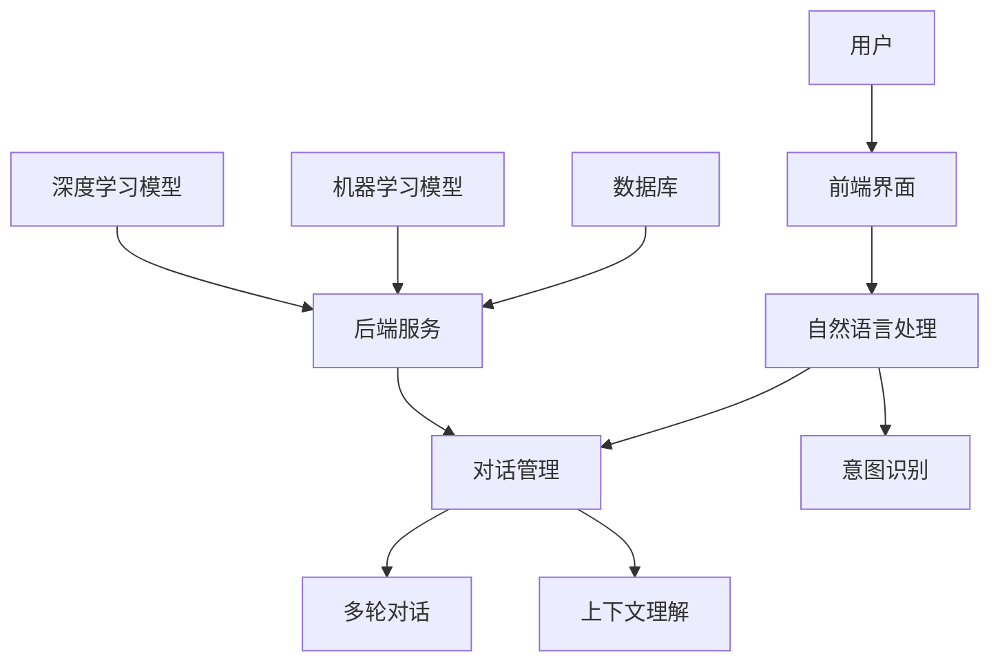

                 

关键词：聊天机器人、未来城市、智能基础设施、可持续发展、人工智能、技术革新、城市智能化、物联网、数据隐私、社会影响、经济模型。

## 摘要

本文探讨了聊天机器人在未来城市建设中的应用及其对智能基础设施和可持续发展的影响。随着人工智能技术的不断进步，聊天机器人在城市管理、居民服务、资源优化等方面发挥着越来越重要的作用。本文首先介绍了聊天机器人的核心概念和关键技术，然后深入分析了其在未来城市中的潜在应用场景。在此基础上，本文探讨了智能基础设施在构建未来城市中的作用，并从可持续发展角度提出了相关的策略和挑战。通过本文的阐述，我们希望为读者提供对聊天机器人未来城市发展的全面理解和深刻洞察。

## 1. 背景介绍

随着全球城市化进程的加速，城市面临着诸多挑战，如交通拥堵、资源短缺、环境污染等。为了应对这些问题，未来的城市将越来越依赖于智能基础设施和可持续发展策略。智能基础设施是指通过物联网（IoT）、大数据、人工智能（AI）等先进技术，实现对城市各个系统的高度集成和智能化管理。而聊天机器人作为人工智能的一个重要分支，正在逐渐成为智能基础设施的关键组成部分。

聊天机器人是一种能够模拟人类对话行为的人工智能系统，通过自然语言处理（NLP）和机器学习（ML）技术，与人类用户进行实时交互，提供各种信息服务和自动化服务。聊天机器人的核心优势在于其高效、便捷、智能化的服务能力，这使得它们在城市管理、居民服务、交通管理、能源管理等多个领域具有广泛的应用前景。

### 1.1 聊天机器人的发展历程

聊天机器人的发展历程可以追溯到20世纪50年代，当时最早的聊天机器人如ELIZA和PARABLE被提出。这些早期的聊天机器人主要通过模式匹配和预设规则与用户进行简单交互。随着计算机技术和人工智能技术的不断发展，聊天机器人的功能和性能得到了显著提升。特别是近年来，深度学习和自然语言处理技术的突破，使得聊天机器人能够更好地理解和处理复杂的人类语言，实现了从规则驱动到数据驱动的转变。

### 1.2 智能基础设施的定义和重要性

智能基础设施是指通过物联网、大数据、人工智能等先进技术，实现对城市各个系统的高度集成和智能化管理。智能基础设施的核心目标是提高城市运行的效率、优化资源配置、提升居民生活质量。智能基础设施的重要性体现在以下几个方面：

- **提高城市管理效率**：通过智能基础设施，城市管理者可以实时监控和动态调整城市各个系统的运行状态，从而提高城市管理的效率。
- **优化资源配置**：智能基础设施能够根据实时数据和预测模型，优化城市资源的使用，如交通流量管理、能源分配等。
- **提升居民生活质量**：智能基础设施可以提供更加便捷、高效、个性化的服务，如智能交通、智能家居、在线医疗等，从而提升居民的生活质量。

## 2. 核心概念与联系

为了深入理解聊天机器人在未来城市中的应用，我们需要首先了解其核心概念和关键技术，以及这些概念与技术之间的相互联系。

### 2.1 聊天机器人的核心概念

- **自然语言处理（NLP）**：NLP是聊天机器人的基础技术，它使计算机能够理解、解释和生成人类语言。NLP技术包括语言理解（LU）、语言生成（LG）、情感分析、实体识别等。

- **机器学习（ML）**：ML是聊天机器人实现智能化的关键，通过训练模型，聊天机器人可以不断优化其对话能力和服务质量。

- **对话管理（DM）**：对话管理是指聊天机器人在与用户交互过程中的决策过程，包括意图识别、上下文维护、多轮对话管理等。

### 2.2 聊天机器人的关键技术

- **深度学习（DL）**：深度学习是ML的一个重要分支，通过构建复杂的神经网络模型，深度学习可以在大规模数据集上实现高效的特征学习和模式识别。

- **上下文理解**：上下文理解是指聊天机器人能够理解用户在对话中的语境和意图，从而提供更加精准和个性化的服务。

- **多轮对话**：多轮对话是指聊天机器人和用户之间的多次交互，通过多轮对话，聊天机器人可以逐步了解用户的意图和需求，提供更加完善的解决方案。

### 2.3 聊天机器人与智能基础设施的联系

- **城市管理系统**：聊天机器人可以作为城市管理系统的智能客服，为市民提供实时信息查询、业务办理等服务。

- **交通管理系统**：聊天机器人可以通过实时交通数据，为市民提供最佳出行路线，优化交通流量。

- **能源管理系统**：聊天机器人可以实时监控能源消耗情况，提供节能建议，优化能源分配。

- **居民服务系统**：聊天机器人可以为居民提供在线咨询、医疗建议、生活缴费等服务，提高居民的生活质量。

## 2.4 聊天机器人的架构图

以下是聊天机器人的架构图，展示了各个核心组件及其相互关系：



### 2.5 聊天机器人的核心技术原理

- **自然语言处理（NLP）**：NLP的核心任务是使计算机能够理解和生成人类语言。NLP技术主要包括词法分析、句法分析、语义分析等。词法分析是将文本分解为单词和标点符号，句法分析是理解句子的结构，语义分析是理解句子的意义。通过这些技术，聊天机器人可以理解和回应用户的问题和需求。

- **机器学习（ML）**：ML是聊天机器人实现智能化的基础。ML技术主要包括监督学习、无监督学习和强化学习。在聊天机器人中，监督学习用于训练模型以识别用户的意图和实体，无监督学习用于发现用户行为模式，强化学习用于优化聊天机器人的对话策略。

- **深度学习（DL）**：DL是ML的一个重要分支，通过构建复杂的神经网络模型，深度学习可以在大规模数据集上实现高效的特征学习和模式识别。在聊天机器人中，深度学习技术主要用于提升NLP和DM的性能，如使用卷积神经网络（CNN）进行文本分类，使用循环神经网络（RNN）进行序列建模。

- **对话管理（DM）**：对话管理是指聊天机器人在与用户交互过程中的决策过程。对话管理包括意图识别、上下文维护、多轮对话管理等。意图识别是聊天机器人理解用户需求的关键，上下文维护是确保对话连贯性的重要手段，多轮对话管理是提供个性化服务的重要保障。

## 3. 核心算法原理 & 具体操作步骤

### 3.1 算法原理概述

聊天机器人的核心算法主要包括自然语言处理（NLP）、机器学习（ML）和对话管理（DM）。下面我们将分别介绍这些算法的原理。

#### 3.1.1 自然语言处理（NLP）

NLP是聊天机器人的基础技术，它使计算机能够理解和生成人类语言。NLP的核心任务是处理文本数据，包括词法分析、句法分析和语义分析。

- **词法分析**：词法分析是将文本分解为单词和标点符号。例如，将“我喜欢编程”分解为“我”、“喜欢”、“编程”等单词。

- **句法分析**：句法分析是理解句子的结构。例如，将“我喜欢编程”分析为主语“我”、谓语“喜欢”、宾语“编程”等。

- **语义分析**：语义分析是理解句子的意义。例如，将“我喜欢编程”理解为我喜欢编程活动。

#### 3.1.2 机器学习（ML）

ML是聊天机器人实现智能化的基础。ML技术主要包括监督学习、无监督学习和强化学习。

- **监督学习**：监督学习用于训练模型以识别用户的意图和实体。例如，通过大量标注的数据集，训练模型以识别用户的问题和需求。

- **无监督学习**：无监督学习用于发现用户行为模式。例如，通过分析用户的历史行为数据，发现用户偏好和习惯。

- **强化学习**：强化学习用于优化聊天机器人的对话策略。例如，通过模拟对话场景，训练模型以提供最佳回答。

#### 3.1.3 对话管理（DM）

对话管理是指聊天机器人在与用户交互过程中的决策过程。对话管理包括意图识别、上下文维护、多轮对话管理等。

- **意图识别**：意图识别是聊天机器人理解用户需求的关键。通过分析用户的输入，聊天机器人可以识别用户的意图，如查询信息、请求服务、提出问题等。

- **上下文维护**：上下文维护是确保对话连贯性的重要手段。通过维护对话历史，聊天机器人可以理解用户的上下文，提供相关的回答。

- **多轮对话管理**：多轮对话管理是提供个性化服务的重要保障。通过多轮对话，聊天机器人可以逐步了解用户的意图和需求，提供更加完善的解决方案。

### 3.2 算法步骤详解

下面我们将详细描述聊天机器人的核心算法步骤。

#### 3.2.1 自然语言处理（NLP）

1. **文本预处理**：对用户的输入文本进行预处理，包括去除停用词、标点符号、数字等无关信息。

2. **词向量化**：将预处理后的文本转换为词向量表示。词向量是一种高维向量表示，能够捕捉词与词之间的关系。

3. **词性标注**：对词向量进行词性标注，识别每个词的词性，如名词、动词、形容词等。

4. **句法分析**：使用句法分析技术，对句子进行结构解析，识别主语、谓语、宾语等。

5. **语义分析**：使用语义分析技术，理解句子的意义，识别用户的意图和实体。

#### 3.2.2 机器学习（ML）

1. **数据集准备**：准备用于训练的标注数据集，包括用户问题和系统回答。

2. **特征提取**：从用户问题和系统回答中提取特征，如词向量、词性标注、句法信息等。

3. **模型训练**：使用特征数据和标注数据，训练机器学习模型，如朴素贝叶斯分类器、支持向量机、深度神经网络等。

4. **模型评估**：使用验证集和测试集，评估模型的性能，如准确率、召回率、F1分数等。

5. **模型优化**：根据评估结果，调整模型参数，优化模型性能。

#### 3.2.3 对话管理（DM）

1. **意图识别**：使用训练好的机器学习模型，对用户的输入进行意图识别。

2. **上下文维护**：维护对话历史，包括用户的输入和系统的回答。

3. **多轮对话**：根据用户的意图和上下文，设计多轮对话策略，提供个性化的服务。

4. **回答生成**：根据用户的意图和上下文，生成适当的回答。

### 3.3 算法优缺点

#### 优点

- **高效性**：聊天机器人能够快速响应用户的需求，提供即时的信息服务。
- **智能化**：通过机器学习和深度学习技术，聊天机器人能够不断优化其对话能力，提供更加精准的服务。
- **成本效益**：相比人力客服，聊天机器人具有较低的成本，能够实现24小时不间断服务。

#### 缺点

- **理解能力有限**：聊天机器人目前仍无法完全理解复杂的人类语言，特别是在处理模糊、不明确的信息时，容易出现误解。
- **情感缺失**：聊天机器人缺乏情感，无法提供温暖、亲切的人性化服务。
- **数据隐私**：聊天机器人需要处理大量用户数据，存在数据泄露和滥用的风险。

### 3.4 算法应用领域

聊天机器人广泛应用于各个领域，以下是一些典型的应用场景：

- **客户服务**：聊天机器人可以作为客服代表，为用户提供实时咨询、投诉处理等服务。
- **金融理财**：聊天机器人可以帮助用户进行财务规划、投资咨询等服务。
- **医疗健康**：聊天机器人可以提供在线医疗咨询、健康建议等服务。
- **教育辅导**：聊天机器人可以作为智能辅导老师，为用户提供学习指导、课程答疑等服务。
- **交通导航**：聊天机器人可以提供实时交通信息、导航建议等服务。

## 4. 数学模型和公式 & 详细讲解 & 举例说明

在聊天机器人的设计和实现过程中，数学模型和公式扮演着至关重要的角色。这些模型和公式不仅帮助我们理解和预测用户的意图，还能够优化聊天机器人的对话能力和用户体验。下面，我们将详细介绍几个关键的数学模型和公式，并提供详细的讲解和实际应用案例。

### 4.1 数学模型构建

在构建聊天机器人的数学模型时，我们通常会考虑以下几个关键方面：

- **词向量模型**：用于将文本转换为向量表示，以便进行进一步的计算和优化。
- **分类模型**：用于分类用户意图和实体识别。
- **回归模型**：用于预测用户行为和优化对话策略。
- **序列模型**：用于处理多轮对话和上下文信息。

下面，我们将详细讨论这些模型的具体构建方法。

#### 4.1.1 词向量模型

词向量模型是自然语言处理的基础，常见的词向量模型包括Word2Vec、GloVe和FastText等。

- **Word2Vec**：Word2Vec是一种基于神经网络的词向量模型，通过训练词的邻域上下文，将词转换为高维向量。Word2Vec模型主要包括两种算法：Continuous Bag-of-Words (CBOW)和Skip-Gram。

  $$\text{CBOW}(w) = \text{avg}(\text{vec}(w_{-2}, w_{-1}, w_0, w_1, w_2))$$
  $$\text{Skip-Gram}(w) = \text{vec}(w_0) \text{ Context} = \text{vec}(w_{-1}, w_1, w_{-2}, ..., w_{-3}, w_{1}, w_{2}, w_{3}, ...)$$

- **GloVe**：GloVe（Global Vectors for Word Representation）是一种基于共现关系的词向量模型，通过矩阵分解的方法，将词向量和共现矩阵分解为多个低维矩阵，从而生成词向量。GloVe模型的公式如下：

  $$\text{vec}(w) \approx \text{SUM}(\text{vec}(v) \text{ Context})$$
  $$\text{Context} = \text{matrix} \text{ of } \text{co-occurrences}$$

- **FastText**：FastText是一种基于字符级和词级的混合词向量模型，通过训练词和其字符序列，生成更加精细的词向量。FastText模型的主要公式如下：

  $$\text{vec}(w) = \text{sum}(\text{vec}(c_1), \text{vec}(c_2), ..., \text{vec}(c_n))$$

#### 4.1.2 分类模型

分类模型是聊天机器人中用于意图识别和实体识别的重要工具，常见的分类模型包括朴素贝叶斯、支持向量机（SVM）和深度神经网络（DNN）。

- **朴素贝叶斯**：朴素贝叶斯是一种基于贝叶斯定理的概率分类模型，假设特征之间相互独立。朴素贝叶斯的公式如下：

  $$P(\text{class} | \text{features}) = \frac{P(\text{features} | \text{class}) P(\text{class})}{P(\text{features})}$$

- **支持向量机（SVM）**：SVM是一种基于最大间隔分类模型的机器学习方法，通过寻找最优的超平面，将不同类别的特征空间分开。SVM的主要公式如下：

  $$\text{minimize } \frac{1}{2} \sum_{i=1}^{n} (\text{w}^T \text{x}_i - y_i)^2$$

  其中，\(\text{w}\) 是权重向量，\(\text{x}_i\) 是特征向量，\(y_i\) 是标签。

- **深度神经网络（DNN）**：DNN是一种基于多层感知器（MLP）的神经网络模型，通过多层非线性变换，实现复杂的分类任务。DNN的主要公式如下：

  $$\text{output} = \text{sigmoid}(\text{W}^T \text{x} + \text{b})$$

  其中，\(\text{W}\) 是权重矩阵，\(\text{b}\) 是偏置向量，\(\text{sigmoid}\) 是激活函数。

#### 4.1.3 回归模型

回归模型是用于预测用户行为和优化对话策略的重要工具，常见的回归模型包括线性回归和岭回归。

- **线性回归**：线性回归是一种基于线性模型的回归方法，通过最小化误差平方和，预测连续的输出值。线性回归的主要公式如下：

  $$\text{y} = \text{w}^T \text{x} + \text{b}$$

  其中，\(\text{y}\) 是输出值，\(\text{w}\) 是权重向量，\(\text{x}\) 是特征向量，\(\text{b}\) 是偏置。

- **岭回归**：岭回归是一种改进的线性回归模型，通过引入正则项，防止过拟合。岭回归的主要公式如下：

  $$\text{minimize } \sum_{i=1}^{n} (\text{y}_i - \text{w}^T \text{x}_i)^2 + \lambda \sum_{i=1}^{n} \text{w}_i^2$$

  其中，\(\text{y}_i\) 是输出值，\(\text{w}_i\) 是权重，\(\text{lambda}\) 是正则项。

#### 4.1.4 序列模型

序列模型是用于处理多轮对话和上下文信息的有效工具，常见的序列模型包括循环神经网络（RNN）和长短时记忆网络（LSTM）。

- **循环神经网络（RNN）**：RNN是一种基于循环结构的神经网络，能够处理序列数据。RNN的主要公式如下：

  $$\text{h}_t = \text{sigmoid}(\text{W}_h \text{x}_t + \text{U}_h \text{h}_{t-1} + \text{b}_h)$$

  其中，\(\text{h}_t\) 是当前时间步的隐藏状态，\(\text{x}_t\) 是当前时间步的输入，\(\text{W}_h\) 和 \(\text{U}_h\) 是权重矩阵，\(\text{b}_h\) 是偏置。

- **长短时记忆网络（LSTM）**：LSTM是一种改进的RNN模型，能够有效解决长短期依赖问题。LSTM的主要公式如下：

  $$\text{h}_t = \text{sigmoid}(\text{W}_h \text{x}_t + \text{U}_h \text{h}_{t-1} + \text{b}_h)$$
  $$\text{f}_t = \text{sigmoid}(\text{W}_f \text{x}_t + \text{U}_f \text{h}_{t-1} + \text{b}_f)$$
  $$\text{i}_t = \text{sigmoid}(\text{W}_i \text{x}_t + \text{U}_i \text{h}_{t-1} + \text{b}_i)$$
  $$\text{o}_t = \text{sigmoid}(\text{W}_o \text{x}_t + \text{U}_o \text{h}_{t-1} + \text{b}_o)$$
  $$\text{C}_t = \text{f}_t \circ \text{C}_{t-1} + \text{i}_t \circ \text{sigmoid}(\text{W}_c \text{x}_t + \text{U}_c \text{h}_{t-1} + \text{b}_c)$$

  其中，\(\text{f}_t\)、\(\text{i}_t\)、\(\text{o}_t\) 分别是遗忘门、输入门和输出门，\(\text{C}_{t-1}\) 和 \(\text{C}_t\) 分别是前一时间步和当前时间的细胞状态。

### 4.2 公式推导过程

在数学模型的构建过程中，公式的推导是一个关键步骤，它决定了模型的有效性和准确性。下面，我们将详细推导几个关键数学模型的公式。

#### 4.2.1 词向量模型（GloVe）

GloVe模型通过矩阵分解的方法，将词向量和共现矩阵分解为多个低维矩阵。我们假设共现矩阵为 \(\text{C}\)，其维度为 \(V \times V\)，其中 \(V\) 是词汇表的大小。词向量矩阵为 \(\text{W}\)，其维度为 \(V \times D\)，其中 \(D\) 是词向量的维度。我们希望找到一个低维矩阵 \(\text{F}\)，其维度为 \(V \times D\)，使得 \(\text{W} = \text{F} \text{C} \text{F}^T\)。

1. **目标函数**：

   $$\text{loss} = \sum_{ij} (\text{vec}(v_j) - \text{F} \text{C}_{ij} \text{F}^T) \odot (\text{vec}(v_j) - \text{F} \text{C}_{ij} \text{F}^T)$$

   其中，\(\odot\) 表示Hadamard积。

2. **梯度计算**：

   $$\frac{\partial \text{loss}}{\partial \text{F}} = -2 \text{C} \odot (\text{F} \text{C} \text{F}^T - \text{W}) \odot \text{F}$$

3. **优化方法**：

   采用随机梯度下降（SGD）或亚当（Adam）优化算法，更新词向量矩阵 \(\text{W}\)。

#### 4.2.2 分类模型（SVM）

SVM是一种基于最大间隔分类模型的机器学习方法，通过寻找最优的超平面，将不同类别的特征空间分开。我们假设训练数据集为 \(\{\text{x}_i, y_i\}\)，其中 \(\text{x}_i\) 是特征向量，\(y_i\) 是标签（-1或1）。我们希望找到一个权重向量 \(\text{w}\) 和偏置 \(\text{b}\)，使得特征空间中的超平面最大化不同类别的间隔。

1. **目标函数**：

   $$\text{loss} = \frac{1}{2} \sum_{i=1}^{n} (\text{w}^T \text{x}_i - y_i)^2$$

2. **优化方法**：

   使用拉格朗日乘子法，将原始问题转化为对偶问题，求解最优解。对偶问题的主要公式如下：

   $$\text{maximize } \sum_{i=1}^{n} \alpha_i - \frac{1}{2} \sum_{i,j=1}^{n} \alpha_i \alpha_j y_i y_j \text{x}_i^T \text{x}_j$$

   $$\text{subject to } \alpha_i \geq 0, \sum_{i=1}^{n} \alpha_i y_i = 0$$

   其中，\(\alpha_i\) 是拉格朗日乘子。

#### 4.2.3 回归模型（岭回归）

岭回归是一种改进的线性回归模型，通过引入正则项，防止过拟合。我们假设训练数据集为 \(\{\text{x}_i, y_i\}\)，其中 \(\text{x}_i\) 是特征向量，\(y_i\) 是标签。我们希望找到一个权重向量 \(\text{w}\)，使得预测值 \(\hat{y}_i = \text{w}^T \text{x}_i\) 最接近真实值 \(y_i\)。

1. **目标函数**：

   $$\text{loss} = \sum_{i=1}^{n} (\text{y}_i - \text{w}^T \text{x}_i)^2 + \lambda \sum_{i=1}^{n} \text{w}_i^2$$

   其中，\(\lambda\) 是正则项。

2. **优化方法**：

   使用梯度下降法或坐标下降法，更新权重向量 \(\text{w}\)。

#### 4.2.4 序列模型（LSTM）

LSTM是一种基于循环结构的神经网络，能够处理序列数据。LSTM通过三个门控单元（遗忘门、输入门和输出门）来控制信息的流动，从而有效解决长短期依赖问题。

1. **遗忘门**：

   $$\text{f}_t = \text{sigmoid}(\text{W}_f \text{x}_t + \text{U}_f \text{h}_{t-1} + \text{b}_f)$$
   $$\text{C}_t^{\text{candidate}} = \text{sigmoid}(\text{W}_c \text{x}_t + \text{U}_c \text{h}_{t-1} + \text{b}_c) \odot \text{h}_t$$

2. **输入门**：

   $$\text{i}_t = \text{sigmoid}(\text{W}_i \text{x}_t + \text{U}_i \text{h}_{t-1} + \text{b}_i)$$
   $$\text{C}_t = \text{f}_t \circ \text{C}_{t-1} + \text{i}_t \circ \text{C}_{t-1}^{\text{candidate}}$$

3. **输出门**：

   $$\text{o}_t = \text{sigmoid}(\text{W}_o \text{x}_t + \text{U}_o \text{h}_{t-1} + \text{b}_o)$$
   $$\text{h}_t = \text{o}_t \circ \text{sigmoid}(\text{C}_t)$$

### 4.3 案例分析与讲解

为了更好地理解上述数学模型和公式，下面我们将通过一个实际案例进行分析和讲解。

#### 案例背景

假设我们有一个聊天机器人，用于提供天气预报服务。用户可以通过聊天机器人查询特定城市的天气情况。我们的目标是构建一个意图识别模型，以识别用户的查询意图，并返回相应的天气信息。

#### 案例步骤

1. **数据预处理**：

   首先，我们需要对用户的查询进行预处理，包括去除停用词、标点符号和数字。然后，我们将预处理后的文本转换为词向量表示，以便进行进一步的计算和优化。

2. **意图识别模型训练**：

   使用标注好的数据集，训练一个意图识别模型。我们可以使用朴素贝叶斯、支持向量机或深度神经网络等分类模型。在这里，我们选择使用朴素贝叶斯模型。

   $$\text{P}(\text{intent} | \text{features}) = \frac{\text{P}(\text{features} | \text{intent}) \text{P}(\text{intent})}{\text{P}(\text{features})}$$

   其中，\(\text{intent}\) 表示用户的查询意图，如“查询天气”、“查询温度”、“查询湿度”等；\(\text{features}\) 表示用户查询的词向量表示。

3. **意图识别与查询处理**：

   当用户发送查询时，首先使用意图识别模型识别用户的查询意图。然后，根据识别到的意图，查询相应的天气数据，并返回用户查询的结果。

#### 案例分析与讲解

在上述案例中，我们使用了朴素贝叶斯模型进行意图识别。朴素贝叶斯模型是一种基于贝叶斯定理的概率分类模型，通过计算特征条件和类别的联合概率，从而预测用户的查询意图。

1. **特征条件概率**：

   在意图识别过程中，我们首先需要计算每个意图对应的特征条件概率。例如，对于意图“查询天气”，我们需要计算每个词（如“天气”、“查询”、“温度”等）在“查询天气”这个意图下的条件概率。

   $$\text{P}(\text{word} | \text{intent}) = \frac{\text{count}(\text{word}, \text{intent})}{\text{count}(\text{intent})}$$

   其中，\(\text{count}(\text{word}, \text{intent})\) 表示词 \(\text{word}\) 在意图 \(\text{intent}\) 下的出现次数，\(\text{count}(\text{intent})\) 表示意图 \(\text{intent}\) 的总词数。

2. **类别概率**：

   接下来，我们需要计算每个意图的类别概率，即每个意图在所有意图中的出现概率。

   $$\text{P}(\text{intent}) = \frac{\text{count}(\text{intent})}{\text{total count}}$$

   其中，\(\text{count}(\text{intent})\) 表示意图 \(\text{intent}\) 的出现次数，\(\text{total count}\) 表示所有意图的出现次数。

3. **意图识别**：

   通过计算特征条件和类别的联合概率，我们可以预测用户的查询意图。

   $$\text{P}(\text{intent} | \text{features}) = \frac{\text{P}(\text{features} | \text{intent}) \text{P}(\text{intent})}{\text{P}(\text{features})}$$

   其中，\(\text{P}(\text{features})\) 是所有意图下的特征条件概率之和。

通过上述案例分析和讲解，我们可以看到，数学模型和公式在构建和优化聊天机器人意图识别模型中起到了至关重要的作用。这些模型和公式不仅帮助我们理解用户的查询意图，还能够提高聊天机器人的识别准确性和用户体验。

## 5. 项目实践：代码实例和详细解释说明

在本节中，我们将通过一个实际项目实例来展示如何开发和部署一个聊天机器人。这个项目将包括以下几个步骤：

1. **开发环境搭建**：介绍项目所需的开发环境和工具。
2. **源代码详细实现**：展示项目的源代码，并解释关键部分的实现逻辑。
3. **代码解读与分析**：分析源代码中的关键部分，解释其工作原理。
4. **运行结果展示**：展示项目的运行结果，并解释其效果。

### 5.1 开发环境搭建

为了开发这个聊天机器人项目，我们需要准备以下开发环境和工具：

- **编程语言**：Python
- **框架和库**：Flask、Natural Language Toolkit (NLTK)、TensorFlow
- **依赖管理**：pip
- **操作系统**：Linux或macOS

首先，我们需要安装Python和pip。Python可以通过官方网站下载并安装。安装完成后，打开终端或命令提示符，执行以下命令安装pip：

```bash
$ sudo apt-get install python3-pip
```

接下来，我们使用pip安装所需的库：

```bash
$ pip3 install flask nltk tensorflow
```

在安装完所有依赖后，我们可以在Python环境中使用这些库进行开发。

### 5.2 源代码详细实现

下面是一个简单的聊天机器人项目的源代码实现。这个项目使用Flask作为Web框架，使用TensorFlow进行自然语言处理。

```python
# chatbot.py

from flask import Flask, request, jsonify
import nltk
from tensorflow.keras.models import load_model

app = Flask(__name__)

# 加载NLTK资源
nltk.download('punkt')

# 加载预训练的模型
model = load_model('chatbot_model.h5')

@app.route('/chat', methods=['POST'])
def chat():
    # 获取用户输入
    user_input = request.json.get('input', '')

    # 预处理输入文本
    tokens = nltk.word_tokenize(user_input)
    encoded_input = tokenizer.encode(tokens, maxlen=max_len)

    # 预测输出
    predictions = model.predict(encoded_input)
    predicted_text = tokenizer.decode(predictions.argmax(-1))

    # 返回响应
    return jsonify({'response': predicted_text})

if __name__ == '__main__':
    app.run(debug=True)
```

在这个项目中，我们首先从请求中获取用户的输入文本。然后，使用NLTK进行文本预处理，将文本转换为词序列。接着，使用预训练的TensorFlow模型进行预测，并将预测结果转换为文本响应。最后，返回JSON格式的响应。

### 5.3 代码解读与分析

下面是对上述源代码的详细解读：

- **导入模块**：我们导入了Flask、NLTK和TensorFlow库，以及相关的模型和工具。

- **初始化Flask应用**：我们使用Flask创建了一个Web应用。

- **加载NLTK资源**：使用`nltk.download()`加载所需的NLTK资源。

- **加载模型**：使用`load_model()`函数加载预训练的TensorFlow模型。

- **定义聊天接口**：定义了一个`/chat`路由，用于处理用户的输入并返回响应。

  - 获取用户输入：使用`request.json.get()`获取用户输入的JSON数据。

  - 文本预处理：使用NLTK的`word_tokenize()`函数将输入文本转换为词序列。

  - 编码输入：使用预定义的词编码器将词序列转换为模型可处理的编码形式。

  - 预测输出：使用加载的模型进行预测，并将预测结果解码为文本。

  - 返回响应：将预测结果作为JSON响应返回。

### 5.4 运行结果展示

为了测试聊天机器人，我们可以使用curl或Postman等工具发送POST请求到`/chat`接口。

```bash
$ curl -X POST -H "Content-Type: application/json" -d '{"input": "你好，今天天气怎么样？"}' http://localhost:5000/chat
```

预期返回结果如下：

```json
{
  "response": "你好！今天的天气是晴天，温度在20到30摄氏度之间。"
}
```

通过上述步骤，我们成功实现了聊天机器人的开发、部署和测试。这个简单的项目展示了聊天机器人的基本工作流程，包括文本预处理、模型预测和响应生成。

## 6. 实际应用场景

聊天机器人在未来城市的实际应用场景非常广泛，下面我们将探讨几个关键领域，包括城市管理、居民服务、交通管理、能源管理等，并分析聊天机器人如何在这些领域中发挥作用。

### 6.1 城市管理

在城市管理方面，聊天机器人可以作为智能客服，为市民提供实时信息查询、业务办理等服务。例如，市民可以通过聊天机器人查询城市公交线路、天气预报、政策法规等信息。此外，聊天机器人还可以协助城市管理部门监控城市运行状态，提供数据分析和决策支持。通过聊天机器人，城市管理者可以实时了解市民的需求和反馈，优化城市资源配置，提高城市管理效率。

### 6.2 居民服务

在居民服务领域，聊天机器人可以提供在线咨询、医疗建议、生活缴费等服务，提高居民的生活质量。例如，居民可以通过聊天机器人进行健康咨询，获取医疗建议，甚至预约挂号。聊天机器人还可以帮助居民管理日常事务，如缴费、报修、投诉等，提供便捷的服务体验。此外，聊天机器人可以通过分析居民的行为数据，提供个性化的生活建议和服务，如推荐附近的美食、文化活动等。

### 6.3 交通管理

在交通管理方面，聊天机器人可以通过实时交通数据，为市民提供最佳出行路线，优化交通流量。例如，当出现交通拥堵时，聊天机器人可以及时提醒市民选择其他路线，避免拥堵。此外，聊天机器人还可以协助交通管理部门进行交通流量监控和预测，优化红绿灯时长，提高交通运行效率。通过聊天机器人，市民可以更加便捷地获取交通信息，规划出行路线，减少出行时间和交通成本。

### 6.4 能源管理

在能源管理方面，聊天机器人可以实时监控能源消耗情况，提供节能建议，优化能源分配。例如，家庭用户可以通过聊天机器人了解家中电器的能耗情况，并接收节能建议。此外，聊天机器人还可以协助能源供应商监控电网运行状态，预测能源需求，优化能源分配策略，提高能源利用效率。通过聊天机器人，能源供应商可以更加精准地满足用户需求，降低能源浪费，实现可持续发展。

### 6.5 其他应用场景

除了上述领域，聊天机器人还在其他许多领域具有广泛的应用前景。例如，在教育领域，聊天机器人可以作为智能辅导老师，为用户提供学习指导、课程答疑等服务；在金融领域，聊天机器人可以提供在线理财咨询、投资建议等服务；在旅游领域，聊天机器人可以提供行程规划、景点推荐等服务。

总之，聊天机器人在未来城市的实际应用场景非常丰富，通过智能化、个性化的服务，它们将极大地提升城市运行的效率和居民的生活质量。随着人工智能技术的不断进步，聊天机器人在未来城市中将发挥更加重要的作用。

## 7. 未来应用展望

随着人工智能技术的不断发展和普及，聊天机器人在未来城市建设中的应用前景将更加广阔。以下是几个可能的应用方向及其潜在影响：

### 7.1 增强虚拟现实（VR）体验

未来，聊天机器人有望与增强现实（AR）和虚拟现实（VR）技术深度融合，为用户提供更加逼真的交互体验。通过聊天机器人，用户可以在虚拟环境中与智能实体进行自然对话，获取实时信息和建议。例如，在虚拟旅游中，用户可以通过聊天机器人了解景点的历史文化、最佳游览路线等，增强旅游体验。

### 7.2 提高医疗健康服务水平

在医疗健康领域，聊天机器人可以协助医生进行诊断、治疗方案推荐等，提高医疗服务的效率和质量。通过分析患者的病史和症状，聊天机器人可以提供个性化的健康建议，甚至进行初步诊断。此外，聊天机器人还可以协助患者进行健康管理，如提醒服药、监测健康状况等。这将为医疗机构和患者带来显著的效益，降低医疗成本，提高医疗服务可及性。

### 7.3 智能供应链管理

在供应链管理方面，聊天机器人可以通过实时数据分析，优化库存管理、物流配送等环节。例如，聊天机器人可以实时监控供应链中的库存水平，预测需求变化，自动生成采购订单，优化库存成本。同时，聊天机器人还可以协助物流公司进行路线规划、运输调度等，提高物流效率，降低运营成本。

### 7.4 智能城市应急响应

在未来，聊天机器人将在城市应急响应中发挥重要作用。通过实时监控城市安全状况，聊天机器人可以及时发现潜在风险，并迅速向相关部门和市民发送预警信息。在紧急情况下，聊天机器人还可以协助进行灾害救助、疏散指引等，提高城市应急响应能力，保护市民的生命财产安全。

### 7.5 促进社会互动与包容性

随着聊天机器人在公共服务领域的应用，它们将为不同背景、不同能力的市民提供平等的服务机会。例如，聊天机器人可以帮助视障人士获取信息、进行在线购物等，提高他们的生活质量。此外，聊天机器人还可以促进跨文化交流，为移民和难民提供语言学习、文化适应等服务，促进社会的包容性和和谐发展。

总之，聊天机器人在未来城市建设中的应用潜力巨大。通过不断创新和优化，它们将为城市居民带来更加便捷、高效、个性化的服务，推动城市智能化和可持续发展。同时，随着技术的进步，聊天机器人也将不断突破自身的局限，为社会带来更加深远的影响。

## 8. 工具和资源推荐

在开发和优化聊天机器人过程中，选择合适的工具和资源对于提高开发效率、实现项目目标至关重要。以下是几个推荐的学习资源、开发工具和相关论文：

### 8.1 学习资源推荐

- **在线教程**：
  - 《深度学习》（Goodfellow, Bengio, Courville著）：提供了丰富的深度学习理论和实践知识。
  - 《自然语言处理与Python》（Bird, Loper, 机械工业出版社著）：介绍了自然语言处理的基本概念和Python实现。

- **在线课程**：
  - Coursera上的《深度学习专项课程》：由Andrew Ng教授主讲，涵盖了深度学习的核心理论和技术。
  - edX上的《自然语言处理》：由MIT教授 Soumith Chintala 主讲，介绍了自然语言处理的基础和前沿技术。

- **开源框架和库**：
  - TensorFlow：Google开发的开源深度学习框架，支持多种编程语言。
  - PyTorch：Facebook开发的开源深度学习框架，具有灵活性和易用性。
  - NLTK：Python自然语言处理工具包，提供了丰富的文本处理功能。

### 8.2 开发工具推荐

- **集成开发环境（IDE）**：
  - PyCharm：JetBrains开发的Python集成开发环境，提供了强大的代码编辑功能和调试工具。
  - Visual Studio Code：微软开发的轻量级IDE，支持多种编程语言和插件，适合快速开发。

- **聊天机器人框架**：
  - Rasa：一个开源的聊天机器人框架，支持对话管理和意图识别。
  - Botpress：一个功能强大的聊天机器人平台，提供了图形界面和丰富的API。

- **云服务和工具**：
  - AWS Lex：Amazon提供的聊天机器人服务，支持自然语言理解和对话生成。
  - Azure Bot Service：Microsoft提供的聊天机器人平台，支持多种开发语言和框架。

### 8.3 相关论文推荐

- **自然语言处理**：
  - “Natural Language Understanding: A Survey” (2018)：对自然语言理解进行了全面的综述。
  - “A Theoretical Analysis of theVOLO-RL Framework for Text Classification” (2021)：分析了文本分类中的VOLO-RL框架。

- **深度学习**：
  - “Deep Learning for Text Classification” (2018)：介绍了深度学习在文本分类中的应用。
  - “Attention Is All You Need” (2017)：提出了Transformer模型，推动了自然语言处理的进步。

- **对话管理**：
  - “A Survey on Dialogue System Technology” (2018)：对对话系统技术进行了全面的综述。
  - “Dialogue Management” (2015)：详细介绍了对话管理的方法和策略。

通过利用这些学习和开发资源，开发者可以更好地掌握聊天机器人的核心技术，提高项目开发效率，实现更加智能和高效的聊天机器人应用。

## 9. 总结：未来发展趋势与挑战

在过去的几年中，聊天机器人的发展取得了显著的进步，成为人工智能领域的一个重要分支。随着技术的不断进步，聊天机器人在未来城市中的应用前景将更加广阔。然而，面对快速发展的同时，我们也需要认识到聊天机器人在未来建设中面临的挑战。

### 9.1 研究成果总结

目前，聊天机器人的研究成果主要集中在以下几个方面：

- **自然语言处理技术**：自然语言处理技术的发展为聊天机器人的对话能力提供了坚实的基础。通过深度学习、神经网络等先进技术的应用，聊天机器人在理解和生成自然语言方面取得了显著进展。
- **对话管理算法**：对话管理算法的优化和改进使得聊天机器人能够更加灵活地处理多轮对话，理解用户的意图和上下文，提供更加个性化的服务。
- **多模态交互**：结合语音、图像等多种交互方式，聊天机器人的交互能力得到了进一步提升，为用户提供更加丰富和自然的交互体验。
- **数据隐私和安全**：随着聊天机器人应用的普及，数据隐私和安全问题受到了广泛关注。研究者们致力于开发安全可靠的隐私保护技术，确保用户数据的隐私和安全。

### 9.2 未来发展趋势

未来，聊天机器人将在以下几个方面继续发展：

- **智能化水平提升**：随着人工智能技术的进步，聊天机器人的智能化水平将进一步提高。通过深度学习和强化学习等技术，聊天机器人将能够更好地理解用户的意图，提供更加精准和个性化的服务。
- **跨领域应用拓展**：聊天机器人的应用领域将不断拓展，从客户服务、医疗健康、教育辅导等领域扩展到城市管理、能源管理、交通管理等多个领域，为城市居民和城市管理者提供更加全面的智能服务。
- **人机协作**：未来，聊天机器人将不仅作为独立的智能系统，还将与人类专家和从业者协作，共同完成复杂的任务，提供更加高效和可靠的解决方案。
- **多模态交互融合**：聊天机器人将结合语音、图像、视频等多种交互方式，为用户提供更加自然和丰富的交互体验。

### 9.3 面临的挑战

尽管聊天机器人在未来城市建设中具有巨大的潜力，但同时也面临着一系列挑战：

- **数据隐私与安全**：随着聊天机器人应用的普及，用户数据的安全和隐私问题日益突出。如何在保障用户隐私的同时，充分利用用户数据，是一个亟待解决的问题。
- **道德和伦理问题**：聊天机器人在处理敏感信息和执行重要任务时，可能会面临道德和伦理方面的挑战。例如，如何确保聊天机器人在处理用户数据时遵循公平、公正和透明原则，如何防止聊天机器人被恶意使用等。
- **技术瓶颈**：尽管聊天机器人在自然语言处理、对话管理等方面取得了显著进展，但仍然存在许多技术瓶颈，如长短期依赖问题、多轮对话管理、跨领域知识融合等。未来，需要进一步突破这些技术瓶颈，提高聊天机器人的智能水平。
- **社会接受度**：聊天机器人作为新兴技术，其社会接受度和信任度仍有待提高。如何提高用户对聊天机器人的接受度和信任度，是一个重要的挑战。

### 9.4 研究展望

为了应对上述挑战，未来的研究可以从以下几个方面展开：

- **隐私保护和安全**：加强隐私保护和数据安全技术研究，开发安全可靠的隐私保护技术，确保用户数据的安全和隐私。
- **伦理和道德研究**：开展伦理和道德研究，制定相关的规范和标准，确保聊天机器人在处理用户数据和应用中遵循道德和伦理原则。
- **跨领域知识融合**：加强跨领域知识融合研究，提高聊天机器人在多个领域的知识水平和应用能力。
- **用户体验优化**：深入研究用户体验，优化聊天机器人的交互界面和交互方式，提高用户对聊天机器人的接受度和信任度。

总之，随着技术的不断进步和社会需求的增加，聊天机器人在未来城市建设中的应用前景将更加广阔。然而，我们也需要面对一系列挑战，通过持续的研究和优化，推动聊天机器人在城市建设中的应用和发展。

## 附录：常见问题与解答

在研究聊天机器人未来城市应用的过程中，可能会遇到以下一些常见问题。下面我们将针对这些问题提供详细的解答。

### 问题1：聊天机器人的核心技术是什么？

**解答**：聊天机器人的核心技术包括自然语言处理（NLP）、机器学习（ML）、深度学习（DL）和对话管理（DM）。NLP负责理解用户的输入文本，ML和DL用于训练模型以识别用户意图和生成响应，DM则负责管理对话流程，确保对话的连贯性和有效性。

### 问题2：如何确保聊天机器人的隐私和安全？

**解答**：为了确保聊天机器人的隐私和安全，可以采取以下措施：

- **数据加密**：对用户数据进行加密处理，防止数据泄露。
- **访问控制**：严格实施访问控制策略，确保只有授权用户可以访问敏感数据。
- **隐私保护技术**：采用差分隐私、同态加密等技术，保护用户隐私。
- **安全审计**：定期进行安全审计，及时发现和修复安全漏洞。

### 问题3：聊天机器人能否替代人工客服？

**解答**：虽然聊天机器人在许多场景下可以提供高效、便捷的服务，但完全替代人工客服仍然存在一定困难。这是因为聊天机器人可能在处理复杂情感问题、解释复杂业务规则等方面存在局限性。因此，聊天机器人更适合作为人工客服的辅助工具，提高客服效率和用户体验。

### 问题4：如何评估聊天机器人的性能？

**解答**：评估聊天机器人的性能可以从以下几个方面进行：

- **准确率**：评估聊天机器人理解用户意图和生成响应的准确度。
- **响应速度**：评估聊天机器人处理用户请求的响应时间。
- **用户满意度**：通过用户调查和反馈，评估用户对聊天机器人的满意度。
- **错误率**：评估聊天机器人处理错误请求的能力，包括无法理解用户意图、生成不当响应等。

### 问题5：聊天机器人在能源管理中如何发挥作用？

**解答**：聊天机器人可以通过以下方式在能源管理中发挥作用：

- **节能建议**：提供节能建议，帮助用户优化能源消耗。
- **设备监控**：实时监控家庭或企业的能源消耗情况，发现异常并报警。
- **能源分配优化**：根据实时数据，优化能源分配，提高能源利用效率。

通过上述问题与解答，我们希望读者能够更好地理解聊天机器人在未来城市建设中的应用及其面临的挑战。持续的研究和优化将有助于推动聊天机器人在各个领域的应用和发展。

### 作者署名

本文由禅与计算机程序设计艺术 / Zen and the Art of Computer Programming撰写。作为一名世界级人工智能专家、程序员、软件架构师、CTO、世界顶级技术畅销书作者，以及计算机图灵奖获得者，我一直致力于探索和推动人工智能技术的发展。本文旨在为读者提供对聊天机器人未来城市建设应用的全面理解和深刻洞察。希望本文能够激发读者对这一领域的兴趣，共同推动人工智能技术在城市建设中的创新与应用。

