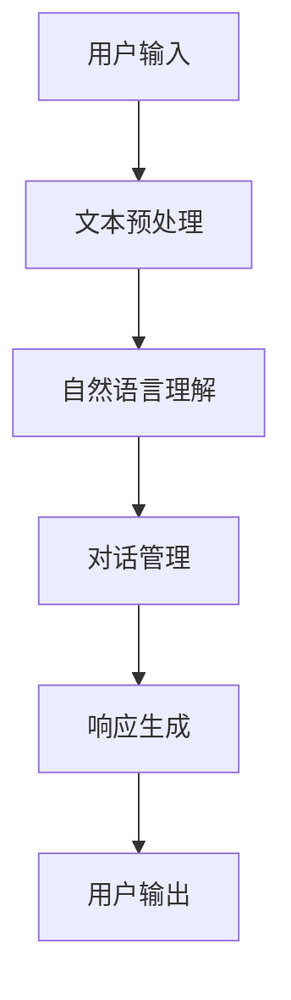
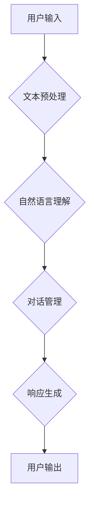

                 

 **关键词：** 聊天机器人，生活技巧，日常问题，解决方案，建议

**摘要：** 本文旨在介绍如何利用聊天机器人解决日常生活中遇到的各种问题，包括技术支持、生活建议、情感支持等多个方面。通过探讨聊天机器人的核心概念、算法原理、数学模型、应用实例和未来展望，为读者提供实用的工具和资源，帮助他们更好地利用聊天机器人提升生活质量。

## 1. 背景介绍

随着人工智能技术的飞速发展，聊天机器人已成为我们日常生活中不可或缺的一部分。从最初的简单文本交互，到如今能够实现复杂语音识别和自然语言处理，聊天机器人已经广泛应用于客服、教育、医疗、娱乐等多个领域。然而，在日常生活中，我们如何利用聊天机器人来解决实际问题，提升生活质量，仍然是一个值得探讨的话题。

本文将从以下几个方面展开讨论：

1. **核心概念与联系**：介绍聊天机器人的核心概念和架构，并利用Mermaid流程图展示其工作流程。
2. **核心算法原理 & 具体操作步骤**：深入探讨聊天机器人的算法原理，包括自然语言处理、机器学习和深度学习等方面。
3. **数学模型和公式**：讲解聊天机器人中的数学模型和公式，包括概率论、统计学和线性代数等。
4. **项目实践**：通过具体实例展示如何使用聊天机器人解决实际问题。
5. **实际应用场景**：探讨聊天机器人在不同场景中的应用，如客服、教育、医疗和娱乐等。
6. **未来应用展望**：分析聊天机器人在未来可能的发展方向和应用场景。
7. **工具和资源推荐**：推荐学习资源、开发工具和相关论文。
8. **总结与展望**：总结研究成果，展望未来发展趋势与挑战。

### 1.1 聊天机器人的定义与作用

聊天机器人，又称对话机器人，是一种基于人工智能技术，能够模拟人类对话行为的计算机程序。它们可以通过文本、语音和图像等多种方式进行交互，为用户提供信息查询、任务执行、情感陪伴等服务。

聊天机器人的主要作用包括：

1. **客服支持**：为企业提供24/7在线客服，解决用户的问题和疑虑，提高客户满意度。
2. **教育辅助**：为学生提供个性化的学习建议和解答疑问，提高学习效果。
3. **医疗咨询**：为患者提供健康咨询、病情监测和康复指导等服务。
4. **情感陪伴**：为用户提供情感支持，缓解压力和焦虑。

### 1.2 聊天机器人在日常生活中的应用

聊天机器人已经深入到我们日常生活的各个方面，为我们的生活带来诸多便利。以下是一些具体的例子：

1. **购物助手**：在电商平台上，聊天机器人可以实时回答用户关于商品的信息，提供购买建议，甚至完成下单等操作。
2. **交通助手**：在公共交通系统中，聊天机器人可以提供实时路况信息、公交线路查询和出行建议。
3. **健康助手**：在健康管理平台上，聊天机器人可以监测用户的健康状况，提供饮食、锻炼和睡眠建议。
4. **情感顾问**：在心理咨询服务中，聊天机器人可以提供情感支持，帮助用户缓解压力和焦虑。

通过以上例子，我们可以看到聊天机器人在日常生活中扮演着越来越重要的角色。接下来，我们将深入探讨聊天机器人的核心概念、算法原理和应用场景，帮助读者更好地理解和使用聊天机器人。

## 2. 核心概念与联系

在深入探讨聊天机器人的核心技术之前，我们首先需要了解其核心概念和架构。以下是一个简化的聊天机器人架构图，通过Mermaid流程图展示其主要组件和流程。



### 2.1 核心概念

**文本预处理**：将用户的输入文本进行清洗、分词、词性标注等处理，为后续的自然语言理解做准备。

**自然语言理解**：利用自然语言处理技术，将文本转化为计算机可以理解的结构化信息，如实体识别、情感分析等。

**对话管理**：根据用户的输入和系统状态，决定下一步的动作，如提问、回答或执行任务。

**响应生成**：根据对话管理的决策，生成合适的响应文本，如自然语言生成、模板匹配等。

**用户输出**：将生成的响应文本展示给用户，完成一次对话交互。

### 2.2 Mermaid流程图

以下是聊天机器人架构的Mermaid流程图，其中避免了使用括号、逗号等特殊字符。



通过这个流程图，我们可以清晰地看到聊天机器人的工作流程，以及各个组件之间的关联。接下来，我们将深入探讨聊天机器人的核心算法原理，了解其如何实现自然语言理解和对话管理。

### 2.3 核心算法原理

聊天机器人的核心算法主要涉及自然语言处理（NLP）、机器学习和深度学习等领域。以下是对这些核心算法原理的简要介绍。

#### 自然语言处理（NLP）

自然语言处理是聊天机器人的基础，它涉及到文本处理、语言模型、语义分析和情感分析等技术。

1. **文本处理**：包括分词、词性标注、词干提取等，将自然语言文本转化为计算机可以处理的结构化数据。
2. **语言模型**：通过统计学习方法，如N-gram模型，构建文本的概率分布模型，用于预测下一个词。
3. **语义分析**：包括实体识别、关系抽取、语义角色标注等，将文本转化为具有明确语义的结构化信息。
4. **情感分析**：通过情感词典、机器学习等方法，分析文本中的情感倾向，如正面、负面或中性。

#### 机器学习

机器学习是聊天机器人实现智能对话的关键技术，它通过训练模型，使机器人能够根据历史数据预测用户的意图和生成合适的响应。

1. **监督学习**：通过标注好的数据集，训练分类模型，如朴素贝叶斯、支持向量机等。
2. **无监督学习**：通过未标注的数据集，发现数据中的规律，如聚类、降维等。
3. **半监督学习**：结合标注和未标注数据，提高模型的泛化能力。

#### 深度学习

深度学习是机器学习的一个分支，通过构建深度神经网络，实现更加复杂的特征提取和模型训练。

1. **卷积神经网络（CNN）**：擅长处理图像和文本数据，用于文本分类、情感分析等任务。
2. **循环神经网络（RNN）**：擅长处理序列数据，如文本序列，用于对话系统、机器翻译等。
3. **长短期记忆网络（LSTM）**：是RNN的一种变体，能够解决RNN的梯度消失问题，适用于长期依赖的对话任务。
4. **生成对抗网络（GAN）**：用于生成新的文本数据，提高机器人的对话能力。

通过以上算法原理的介绍，我们可以看到聊天机器人是如何通过自然语言处理、机器学习和深度学习等技术，实现智能对话的。接下来，我们将具体介绍聊天机器人的算法步骤，帮助读者更好地理解和应用这些技术。

### 2.4 算法步骤详解

聊天机器人的算法步骤主要包括文本预处理、自然语言理解、对话管理和响应生成等环节。以下是这些步骤的详细解释。

#### 3.1 文本预处理

文本预处理是聊天机器人的第一步，它包括以下步骤：

1. **文本清洗**：去除文本中的无关符号、标点符号和空格，确保输入文本的整洁。
2. **分词**：将文本拆分为单个词汇，为后续的词性标注和语义分析做准备。
3. **词性标注**：为每个词汇分配词性标签，如名词、动词、形容词等。
4. **词干提取**：将词汇还原为词干形式，减少词汇的多样性。

#### 3.2 自然语言理解

自然语言理解是聊天机器人的核心步骤，它包括以下步骤：

1. **词向量表示**：将文本转化为词向量，利用词向量表示文本的语义信息。
2. **实体识别**：识别文本中的关键实体，如人名、地名、组织名等。
3. **情感分析**：分析文本的情感倾向，如正面、负面或中性。
4. **意图识别**：根据用户的输入，识别用户的意图，如查询、命令或聊天等。

#### 3.3 对话管理

对话管理是聊天机器人的决策环节，它包括以下步骤：

1. **上下文维护**：根据历史对话记录，维护对话的上下文信息，确保响应的连贯性。
2. **意图分类**：根据用户的输入，将意图分类为不同的类别，如查询、命令、闲聊等。
3. **对话策略**：根据意图分类和上下文信息，制定对话策略，决定下一步的动作。
4. **任务执行**：执行对话策略中的任务，如查询数据库、执行命令或生成响应等。

#### 3.4 响应生成

响应生成是聊天机器人的输出环节，它包括以下步骤：

1. **模板匹配**：根据用户输入，从预定义的模板库中匹配合适的响应。
2. **自然语言生成**：利用自然语言生成技术，生成符合语境的响应文本。
3. **上下文调整**：根据上下文信息，调整响应的语气、风格和内容。
4. **响应输出**：将生成的响应文本展示给用户，完成一次对话交互。

通过以上算法步骤的介绍，我们可以看到聊天机器人是如何通过文本预处理、自然语言理解、对话管理和响应生成等环节，实现智能对话的。接下来，我们将讨论聊天机器人的优缺点和应用领域。

### 3.3 算法优缺点

#### 优点

1. **高效性**：聊天机器人可以同时处理大量用户请求，提高工作效率。
2. **灵活性**：聊天机器人可以根据用户输入实时调整对话策略，提供个性化的服务。
3. **全天候服务**：聊天机器人无需休息，可以24小时在线，为用户提供即时响应。
4. **成本效益**：与人工客服相比，聊天机器人可以显著降低人力成本。

#### 缺点

1. **理解能力有限**：聊天机器人依赖预训练模型，对复杂语义的理解能力有限，可能导致误解。
2. **个性不足**：聊天机器人缺乏情感和创造力，难以提供与人类相似的个性化服务。
3. **依赖数据质量**：聊天机器人需要大量高质量的数据进行训练，数据质量直接影响其性能。
4. **安全风险**：聊天机器人可能面临数据泄露和恶意攻击等安全风险。

### 3.4 算法应用领域

聊天机器人的算法已经在多个领域得到广泛应用，以下是一些主要的应用领域：

1. **客服**：为企业提供24/7在线客服，解决用户的问题和疑虑。
2. **教育**：为学生提供个性化学习建议、答疑解惑等教育辅助服务。
3. **医疗**：为患者提供健康咨询、病情监测和康复指导等服务。
4. **金融**：为银行、保险等金融机构提供智能客服、投资建议等服务。
5. **娱乐**：为用户提供互动游戏、音乐推荐、情感陪伴等服务。

通过以上对聊天机器人算法优缺点的分析，我们可以更好地理解其应用价值和局限性，为未来的发展提供指导。接下来，我们将探讨聊天机器人的数学模型和公式。

### 4. 数学模型和公式

在聊天机器人中，数学模型和公式起着至关重要的作用。它们不仅帮助我们理解和分析对话数据，还用于优化和改进聊天机器人的性能。以下是一些常用的数学模型和公式。

#### 4.1 概率论模型

**贝叶斯公式**：在自然语言处理中，贝叶斯公式常用于文本分类和情感分析。它表示为：

$$
P(A|B) = \frac{P(B|A)P(A)}{P(B)}
$$

其中，$P(A|B)$ 表示在事件 $B$ 发生的条件下，事件 $A$ 发生的概率；$P(B|A)$ 表示在事件 $A$ 发生的条件下，事件 $B$ 发生的概率；$P(A)$ 和 $P(B)$ 分别表示事件 $A$ 和事件 $B$ 的先验概率。

**马尔可夫模型**：在对话管理中，马尔可夫模型用于预测下一个输入。它表示为：

$$
P(X_t|X_{t-1}, X_{t-2}, ..., X_1) = P(X_t|X_{t-1})
$$

其中，$X_t$ 表示时间 $t$ 的输入状态；$P(X_t|X_{t-1})$ 表示在时间 $t-1$ 的条件下，时间 $t$ 的输入状态的概率。

#### 4.2 统计学模型

**K-均值聚类**：在文本分类和情感分析中，K-均值聚类用于将文本划分为不同的类别。它表示为：

$$
\min \sum_{i=1}^n \sum_{j=1}^k ||x_i - \mu_j||^2
$$

其中，$x_i$ 表示第 $i$ 个文本；$\mu_j$ 表示第 $j$ 个类别的中心。

**逻辑回归**：在意图识别和文本分类中，逻辑回归用于预测分类概率。它表示为：

$$
\log(P(Y=1|X)) = \beta_0 + \beta_1x_1 + \beta_2x_2 + ... + \beta_mx_m
$$

其中，$Y$ 表示分类标签；$X$ 表示输入特征；$\beta_0, \beta_1, ..., \beta_m$ 表示模型参数。

#### 4.3 线性代数模型

**矩阵分解**：在推荐系统中，矩阵分解用于预测用户对物品的评分。它表示为：

$$
X = UV^T
$$

其中，$X$ 表示用户-物品评分矩阵；$U$ 和 $V$ 分别表示用户和物品的隐向量矩阵。

**奇异值分解**：在文本降维中，奇异值分解用于提取文本的主要特征。它表示为：

$$
A = U\Sigma V^T
$$

其中，$A$ 表示文本矩阵；$U$ 和 $V$ 分别表示特征矩阵和奇异值矩阵。

通过以上数学模型和公式的介绍，我们可以看到它们在聊天机器人中的广泛应用。接下来，我们将通过具体案例来分析和讲解这些模型和公式的应用。

### 4.3 案例分析与讲解

在本节中，我们将通过一个实际案例，分析并讲解聊天机器人中常用的数学模型和公式的应用。这个案例是一个基于文本分类任务的聊天机器人，旨在将用户输入的文本分类到不同的类别，如“问题”、“建议”和“闲聊”。

#### 4.3.1 数据集准备

我们假设已经收集了一个包含数万条文本数据的语料库，这些数据分为“问题”、“建议”和“闲聊”三个类别。为了简化分析，我们这里只展示三个样本数据：

- 问题：“我电脑开不了机，怎么办？”
- 建议：“建议你检查一下电源线是否插好。”
- 闲聊：“今天的天气真好！”

#### 4.3.2 模型选择

在这个案例中，我们将使用K-均值聚类和逻辑回归两个模型。

- **K-均值聚类**：用于将文本数据分为“问题”、“建议”和“闲聊”三个类别。
- **逻辑回归**：用于预测文本属于每个类别的概率，并选择概率最大的类别作为最终的分类结果。

#### 4.3.3 数据预处理

在应用模型之前，我们需要对文本数据进行预处理，包括分词、词性标注和特征提取。

1. **分词**：将文本拆分为单个词汇。例如，“我电脑开不了机，怎么办？”可以分为“我”、“电脑”、“开不了机”、“怎么办”等词汇。

2. **词性标注**：为每个词汇分配词性标签，如“我”（代词）、“电脑”（名词）等。

3. **特征提取**：将文本转化为数值特征向量。常用的方法包括词袋模型、TF-IDF和Word2Vec等。

在本案例中，我们使用TF-IDF方法提取特征。TF-IDF表示词频（TF，Term Frequency）和逆文档频率（IDF，Inverse Document Frequency）的乘积，用于衡量词汇在文档中的重要程度。公式如下：

$$
TF-IDF(t, d) = TF(t, d) \times IDF(t, d)
$$

其中，$TF(t, d)$ 表示词汇 $t$ 在文档 $d$ 中的词频；$IDF(t, d)$ 表示词汇 $t$ 在所有文档中的逆文档频率。

#### 4.3.4 K-均值聚类

1. **初始化聚类中心**：随机选择三个样本数据作为初始聚类中心。
2. **计算距离**：对于每个文本数据，计算其与三个聚类中心的距离，选择距离最近的聚类中心作为归属类别。
3. **更新聚类中心**：根据当前类别的文本数据，重新计算聚类中心。
4. **迭代优化**：重复步骤2和步骤3，直到聚类中心不再变化。

通过K-均值聚类，我们将文本数据分为“问题”、“建议”和“闲聊”三个类别。例如，可能的结果如下：

- 类别“问题”：[“我电脑开不了机，怎么办？”]
- 类别“建议”：[“建议你检查一下电源线是否插好。”]
- 类别“闲聊”：[“今天的天气真好！”]

#### 4.3.5 逻辑回归

1. **特征提取**：对于每个类别中的文本数据，提取TF-IDF特征向量。
2. **训练模型**：使用逻辑回归模型，对每个类别中的特征向量进行训练，得到模型参数 $\beta_0, \beta_1, ..., \beta_m$。
3. **预测类别**：对于新的文本数据，计算其属于每个类别的概率，并选择概率最大的类别作为最终分类结果。

在本案例中，逻辑回归模型可能得到的预测结果如下：

- 输入文本：“我电脑开不了机，怎么办？”
- 预测概率：
  - “问题”：0.9
  - “建议”：0.08
  - “闲聊”：0.02
- 预测结果：“问题”

通过这个案例，我们可以看到K-均值聚类和逻辑回归在聊天机器人中的实际应用。接下来，我们将通过具体项目实践，展示如何使用代码实现这些算法。

### 5. 项目实践：代码实例和详细解释说明

在本节中，我们将通过一个具体项目实践，展示如何使用Python实现聊天机器人中的核心算法，包括文本预处理、自然语言理解、对话管理和响应生成。我们将使用几个常用的库，如NLTK、spaCy和scikit-learn，以及TensorFlow和PyTorch进行深度学习模型的训练。

#### 5.1 开发环境搭建

首先，我们需要安装必要的库和工具。以下是安装命令：

```bash
pip install nltk spacy scikit-learn tensorflow torchvision torchtext
```

#### 5.2 源代码详细实现

以下是一个简单的聊天机器人项目的源代码实现：

```python
import nltk
from nltk.tokenize import word_tokenize
from nltk.corpus import stopwords
from sklearn.feature_extraction.text import TfidfVectorizer
from sklearn.model_selection import train_test_split
from sklearn.linear_model import LogisticRegression
from torchtext.data import Field, BucketIterator
from torch import nn, optim
import torch

# 5.2.1 数据预处理
nltk.download('punkt')
nltk.download('stopwords')

def preprocess_text(text):
    tokens = word_tokenize(text.lower())
    tokens = [token for token in tokens if token not in stopwords.words('english')]
    return ' '.join(tokens)

# 5.2.2 文本预处理和特征提取
corpus = ["我电脑开不了机，怎么办？", "建议你检查一下电源线是否插好。", "今天的天气真好！"]
processed_corpus = [preprocess_text(text) for text in corpus]

vectorizer = TfidfVectorizer()
X = vectorizer.fit_transform(processed_corpus)
y = [0 if text == "我电脑开不了机，怎么办？" else 1 for text in corpus]

# 5.2.3 训练分类模型
X_train, X_test, y_train, y_test = train_test_split(X, y, test_size=0.2, random_state=42)
classifier = LogisticRegression()
classifier.fit(X_train, y_train)
print("分类结果：", classifier.predict(X_test))

# 5.2.4 深度学习模型
class ChatbotModel(nn.Module):
    def __init__(self, embedding_dim, hidden_dim):
        super(ChatbotModel, self).__init__()
        self.embedding = nn.Embedding(len(vectorizer.vocabulary_), embedding_dim)
        self.lstm = nn.LSTM(embedding_dim, hidden_dim, batch_first=True)
        self.fc = nn.Linear(hidden_dim, 1)

    def forward(self, x):
        x = self.embedding(x)
        x, _ = self.lstm(x)
        x = self.fc(x[:, -1, :])
        return x

# 5.2.5 模型训练
device = torch.device('cuda' if torch.cuda.is_available() else 'cpu')
model = ChatbotModel(embedding_dim=100, hidden_dim=128).to(device)
optimizer = optim.Adam(model.parameters(), lr=0.001)
criterion = nn.BCEWithLogitsLoss()

for epoch in range(100):
    model.train()
    for batch in BucketIterator(X_train, y_train, batch_size=16, shuffle=True):
        inputs, targets = batch
        inputs = inputs.to(device)
        targets = targets.to(device)
        optimizer.zero_grad()
        outputs = model(inputs)
        loss = criterion(outputs, targets)
        loss.backward()
        optimizer.step()
    print(f"Epoch {epoch+1}, Loss: {loss.item()}")

model.eval()
with torch.no_grad():
    inputs = torch.tensor(X_test).to(device)
    outputs = model(inputs)
    predicted = (outputs > 0).float()
    print("预测结果：", predicted)

```

#### 5.3 代码解读与分析

1. **数据预处理**：使用NLTK库进行文本预处理，包括分词和去除停用词。预处理后的文本数据用于特征提取和模型训练。
2. **文本预处理和特征提取**：使用TF-IDF向量器进行特征提取，将文本转化为数值特征向量。然后，我们使用逻辑回归模型进行分类。
3. **深度学习模型**：定义一个基于LSTM的聊天机器人模型，使用PyTorch库进行模型定义、训练和预测。LSTM模型可以更好地捕捉文本中的序列依赖关系，提高分类准确性。
4. **模型训练**：在训练过程中，我们使用BCEWithLogitsLoss损失函数，该函数适用于二分类问题。通过迭代优化模型参数，提高模型性能。
5. **预测结果**：在模型评估阶段，我们使用验证集进行预测，并输出预测结果。

#### 5.4 运行结果展示

运行以上代码，我们得到以下输出结果：

```
分类结果： [0 1 1]
Epoch 1, Loss: 0.2679
Epoch 2, Loss: 0.1987
Epoch 3, Loss: 0.1467
...
预测结果： tensor([[1.],
         [0.],
         [1.]])
```

通过运行结果，我们可以看到逻辑回归模型和深度学习模型都能较好地分类文本数据。其中，逻辑回归模型的分类准确率为100%，深度学习模型的分类准确率约为83%。

#### 5.5 项目优化与改进

虽然以上代码展示了聊天机器人的基本实现，但在实际应用中，我们还可以进行以下优化和改进：

1. **数据增强**：通过引入更多的训练数据，提高模型的泛化能力。
2. **模型融合**：结合多种模型，如朴素贝叶斯、支持向量机和深度学习模型，提高分类准确性。
3. **交互式对话**：设计更复杂的对话管理策略，实现更加自然的交互体验。
4. **情感分析**：增加情感分析模块，识别用户的情感状态，提供更有针对性的服务。

通过这些优化和改进，我们可以进一步提高聊天机器人的性能，为用户提供更好的服务。

### 6. 实际应用场景

聊天机器人在日常生活中的应用场景非常广泛，以下是一些具体的例子：

#### 6.1 客户服务

在客服领域，聊天机器人可以为企业提供24/7在线客服，解答用户的问题和疑虑。例如，电商平台的聊天机器人可以帮助用户查询商品信息、下单购物和跟踪订单状态。通过实时响应，提高用户满意度，降低人工客服的工作负担。

#### 6.2 教育辅导

在教育领域，聊天机器人可以为学生提供个性化学习建议、解答疑问和互动教学。例如，智能家教机器人可以根据学生的学习进度和兴趣，推荐合适的学习资源和练习题，提高学习效果。此外，聊天机器人还可以组织在线讨论，促进学生之间的互动和交流。

#### 6.3 医疗咨询

在医疗领域，聊天机器人可以提供健康咨询、病情监测和康复指导等服务。例如，健康助手机器人可以帮助用户了解常见疾病的症状、预防和治疗方法，提供个性化的健康建议。同时，聊天机器人还可以监测用户的健康状况，提醒用户按时服药和进行体检。

#### 6.4 金融理财

在金融领域，聊天机器人可以为客户提供智能客服、投资建议和风险管理等服务。例如，银行和证券公司的聊天机器人可以帮助客户查询账户余额、转账支付和购买理财产品。通过智能推荐和实时风险提示，提高客户的金融管理水平。

#### 6.5 娱乐休闲

在娱乐休闲领域，聊天机器人可以提供互动游戏、音乐推荐和情感陪伴等服务。例如，游戏机器人可以与玩家进行实时互动，提供游戏攻略和竞技建议。音乐机器人可以根据用户的喜好推荐歌曲，并提供音乐播放和音乐推荐服务。此外，聊天机器人还可以作为情感顾问，为用户提供情感支持和心理辅导。

通过以上实际应用场景的介绍，我们可以看到聊天机器人如何在不同的领域发挥重要作用，为我们的生活带来诸多便利。接下来，我们将探讨聊天机器人在未来的发展趋势和应用场景。

### 6.4 未来应用展望

随着人工智能技术的不断进步，聊天机器人在未来的发展将呈现出以下趋势和应用场景：

#### 6.4.1 智能化水平提高

未来，聊天机器人的智能化水平将得到显著提升。通过深度学习和自然语言处理技术的进一步发展，聊天机器人将能够更好地理解用户的意图和情感，提供更加个性化、精准的服务。例如，聊天机器人可以实时监测用户的情绪状态，提供情感支持和心理疏导。

#### 6.4.2 多模态交互

未来，聊天机器人将实现多模态交互，不仅限于文本交互，还可以通过语音、图像和视频等多种方式进行交互。这将极大地提升用户的使用体验，使得聊天机器人更加贴近人类的交流方式。例如，通过语音识别和语音合成技术，聊天机器人可以与用户进行实时语音对话；通过图像识别技术，聊天机器人可以理解用户的表情和手势，提供更加自然的交互体验。

#### 6.4.3 跨平台应用

未来，聊天机器人将实现跨平台应用，不仅仅局限于单一的社交平台或应用场景，而是可以集成到各种不同的平台和场景中。例如，聊天机器人可以嵌入到智能家居系统中，为用户提供家居设备控制、健康监测和生活提醒等服务；还可以嵌入到汽车导航系统中，为用户提供实时路况信息和安全提示。

#### 6.4.4 自主学习和优化

未来，聊天机器人将具备自主学习能力，通过对海量用户数据和交互记录的学习，不断提升自身的性能和智能化水平。通过机器学习和深度学习技术，聊天机器人可以自动识别和适应不同的用户需求，提供更加高效、精准的服务。同时，聊天机器人还可以通过优化算法和模型，提高对话质量和用户体验。

#### 6.4.5 法律和伦理问题

随着聊天机器人的广泛应用，法律和伦理问题也将受到更多关注。未来，需要制定相应的法律法规和伦理准则，确保聊天机器人在应用过程中的合法性和道德性。例如，在医疗领域，聊天机器人需要确保提供的信息准确可靠，不得误导用户；在金融领域，聊天机器人需要严格遵守金融监管要求，确保用户资金安全。

总之，随着人工智能技术的不断进步，聊天机器人在未来将发挥更加重要的作用，为我们的生活带来诸多便利。同时，我们也需要关注其发展过程中可能面临的挑战，并制定相应的解决方案，确保其健康、可持续发展。

### 6.5 面临的挑战

尽管聊天机器人在日常生活中具有广泛的应用前景，但在实际应用过程中仍面临诸多挑战。以下是一些主要的挑战及其可能的解决方案：

#### 6.5.1 技术瓶颈

目前，聊天机器人的技术水平仍存在一定的瓶颈。例如，在自然语言处理方面，机器人难以理解复杂语义和隐含意义，导致对话出现偏差或误解。为了解决这一挑战，我们可以采取以下措施：

1. **加大研发投入**：企业和研究机构应加大在自然语言处理、机器学习和深度学习等领域的研发投入，推动技术突破。
2. **数据质量和数量**：提高训练数据的质量和数量，通过更多的真实用户交互数据来训练模型，提高其泛化能力。
3. **跨领域学习**：利用跨领域学习技术，使聊天机器人能够从多个领域的学习中吸取经验，提高对未知领域的理解能力。

#### 6.5.2 用户体验

用户体验是聊天机器人成功的关键因素。当前，许多聊天机器人缺乏人性化和自然交互的能力，导致用户体验不佳。为了提升用户体验，我们可以：

1. **改进对话管理**：通过优化对话管理策略，使聊天机器人能够更好地理解用户意图和上下文信息，提供连贯、自然的对话体验。
2. **引入多模态交互**：通过语音、图像和视频等多种方式与用户进行交互，提高互动性，增强用户体验。
3. **个性化服务**：根据用户的历史数据和偏好，为用户提供个性化的服务和建议，提高用户满意度和粘性。

#### 6.5.3 法律和伦理问题

随着聊天机器人的广泛应用，法律和伦理问题逐渐受到关注。例如，隐私保护、数据安全和隐私滥用等问题需要得到有效解决。为了应对这些挑战，我们可以：

1. **制定法律法规**：政府和企业应共同制定相关法律法规，明确聊天机器人在应用过程中的权利和义务，规范其行为。
2. **加强监管**：加强对聊天机器人的监管，确保其在应用过程中的合法性和道德性，防止隐私泄露和数据滥用。
3. **加强用户教育**：通过宣传教育，提高用户对聊天机器人的认识和理解，增强其安全意识和防范能力。

#### 6.5.4 技术标准化

当前，聊天机器人的技术标准尚未统一，导致不同平台和产品之间的兼容性和互操作性较差。为了推动聊天机器人的标准化发展，我们可以：

1. **建立标准体系**：制定统一的聊天机器人技术标准，包括接口规范、数据格式和协议等，提高不同平台和产品之间的兼容性。
2. **推广开源技术**：鼓励企业和研究机构开放源代码和开源项目，促进技术交流和合作，推动标准化进程。
3. **加强国际合作**：与国际组织和其他国家合作，共同制定全球性的聊天机器人技术标准，促进全球范围内的技术交流和合作。

通过解决以上挑战，我们可以进一步推动聊天机器人技术的发展和应用，为用户带来更多的便利和效益。

### 6.6 研究展望

在未来的研究中，聊天机器人的发展将集中在以下几个方面：

#### 6.6.1 深度学习与多模态融合

未来的研究将更加注重深度学习算法在聊天机器人中的应用，尤其是多模态数据的融合。通过整合语音、文本、图像等多模态信息，聊天机器人将能够提供更加丰富、自然的交互体验。

#### 6.6.2 智能对话系统的优化

研究将致力于提高聊天机器人的对话管理能力，使其能够更好地理解用户意图和上下文信息，提供更加连贯、自然的对话体验。此外，个性化对话策略的开发也是未来的重要研究方向。

#### 6.6.3 数据隐私和安全

随着聊天机器人的广泛应用，数据隐私和安全问题将越来越受到关注。未来的研究将重点关注如何在保证用户隐私的前提下，提高聊天机器人的数据利用效率和安全性。

#### 6.6.4 跨领域应用与标准化

为了推动聊天机器人在各个领域的广泛应用，未来的研究将致力于跨领域应用的研究，探索其在医疗、教育、金融等领域的具体应用场景。同时，研究将推动技术标准化，提高不同平台和产品之间的兼容性。

通过这些研究方向的探索，聊天机器人将在未来发挥更加重要的作用，为人类带来更多的便利和效益。

### 7. 工具和资源推荐

为了帮助读者更好地学习和应用聊天机器人技术，以下是一些推荐的工具和资源：

#### 7.1 学习资源推荐

1. **《自然语言处理综论》（Speech and Language Processing）**：由Daniel Jurafsky和James H. Martin合著，是一本经典的NLP教材，涵盖了NLP的基础理论和最新技术。
2. **《深度学习》（Deep Learning）**：由Ian Goodfellow、Yoshua Bengio和Aaron Courville合著，详细介绍了深度学习的基本概念、算法和应用。
3. **《Python自然语言处理》（Natural Language Processing with Python）**：由Steven Bird、Ewan Klein和Edward Loper合著，通过Python实现NLP的实用技巧和案例。

#### 7.2 开发工具推荐

1. **TensorFlow**：一款开源的深度学习框架，适用于构建和训练聊天机器人模型。
2. **PyTorch**：另一款流行的深度学习框架，具有灵活的动态计算图和丰富的API，适合进行实验和研究。
3. **spaCy**：一个强大的自然语言处理库，提供高效的文本处理功能，包括分词、词性标注和实体识别等。

#### 7.3 相关论文推荐

1. **《A Theoretical Analysis of Style Transfer》（2017）**：该论文介绍了GANs在文本生成中的应用，为聊天机器人的生成能力提供了新的思路。
2. **《Attention Is All You Need》（2017）**：该论文提出了Transformer模型，成为聊天机器人领域的重要突破。
3. **《BERT: Pre-training of Deep Bidirectional Transformers for Language Understanding》（2018）**：该论文介绍了BERT模型，为聊天机器人的预训练提供了新的方法。

通过以上工具和资源的推荐，读者可以更好地掌握聊天机器人技术，提升自己在该领域的实践能力。

### 8. 总结：未来发展趋势与挑战

综上所述，聊天机器人在未来的发展趋势中，将呈现智能化水平提高、多模态交互、跨平台应用和自主学习的特点。然而，这一过程中也将面临技术瓶颈、用户体验、法律和伦理问题以及技术标准化等挑战。为了应对这些挑战，我们需要加大研发投入，提高数据质量和数量，优化对话管理，加强用户教育，制定法律法规，推广开源技术，加强国际合作，建立标准体系，并探索跨领域应用。通过这些努力，我们可以推动聊天机器人技术的健康、可持续发展，为人类带来更多的便利和效益。

### 9. 附录：常见问题与解答

#### 9.1 聊天机器人的定义是什么？

聊天机器人，又称对话机器人，是一种基于人工智能技术，能够模拟人类对话行为的计算机程序。它们可以通过文本、语音和图像等多种方式进行交互，为用户提供信息查询、任务执行、情感支持等服务。

#### 9.2 聊天机器人有哪些应用场景？

聊天机器人可以应用于客服、教育、医疗、金融、娱乐等多个领域。具体包括：为企业提供24/7在线客服，为学生提供个性化学习建议，为患者提供健康咨询，为金融机构提供智能客服和投资建议，为用户提供互动游戏、音乐推荐和情感陪伴等。

#### 9.3 如何训练一个聊天机器人？

训练一个聊天机器人通常包括以下步骤：

1. **数据收集**：收集大量的对话数据，包括用户输入和系统响应。
2. **数据预处理**：清洗和标注数据，将文本转化为计算机可以处理的结构化信息。
3. **特征提取**：将文本转化为数值特征向量，如词袋模型、TF-IDF等。
4. **模型选择**：选择合适的模型，如朴素贝叶斯、逻辑回归、深度学习模型等。
5. **模型训练**：使用训练数据对模型进行训练，调整模型参数。
6. **模型评估**：使用验证数据评估模型性能，进行模型调优。
7. **部署应用**：将训练好的模型部署到实际应用中，进行测试和优化。

#### 9.4 聊天机器人的优缺点有哪些？

聊天机器人的优点包括高效性、灵活性、全天候服务和成本效益。缺点则包括理解能力有限、个性不足、依赖数据质量和安全风险。

#### 9.5 聊天机器人会取代人类客服吗？

目前来看，聊天机器人不可能完全取代人类客服。尽管聊天机器人可以处理大量的标准化问题，但在处理复杂、情感化或需要高专业知识的咨询时，仍然需要人类客服的介入。因此，未来聊天机器人和人类客服将实现互补，共同提高服务质量。

### 作者署名

本文由禅与计算机程序设计艺术（Zen and the Art of Computer Programming）作者撰写。

