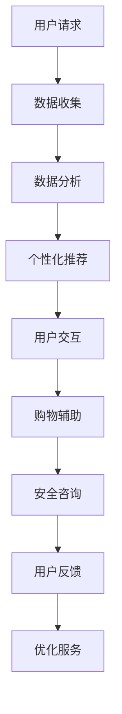

                 

关键词：聊天机器人、电子商务、个性化购物、安全交易、人工智能、机器学习、安全加密、用户隐私、购物体验优化

> 摘要：本文将探讨聊天机器人在电子商务中的应用，特别是在提供个性化购物体验和保障安全交易方面的重要性。我们将深入分析聊天机器人的工作原理、关键算法和数学模型，并通过具体的实例和代码展示，说明如何实现高效的个性化购物和安全交易。此外，还将展望聊天机器人在电子商务领域的未来发展趋势和面临的挑战。

## 1. 背景介绍

随着互联网的普及和电子商务的迅猛发展，人们越来越倾向于在线购物。这种趋势催生了聊天机器人的出现，它们作为新兴的人工智能技术，正在逐渐改变传统的购物体验。聊天机器人是一种基于人工智能的计算机程序，能够通过自然语言交互与用户进行沟通，提供个性化服务和辅助购物决策。这一技术的应用，不仅提高了用户的购物体验，还为电子商务平台带来了新的商业模式。

个性化购物是指根据用户的偏好、历史购物记录和实时行为数据，为其推荐最适合的商品和服务。这种个性化推荐能够显著提高用户的满意度和忠诚度，促进销售增长。然而，个性化购物也带来了隐私和安全方面的挑战，例如用户数据的收集和使用、交易过程中的安全防护等。

安全交易是电子商务的核心问题，涉及用户支付信息的安全、交易过程中的隐私保护以及防止欺诈行为。随着网络攻击手段的不断升级，保障交易安全成为电子商务平台必须面对的重要任务。

本文将围绕聊天机器人在电子商务中的应用，探讨其在个性化购物和安全交易方面的关键作用，并通过具体实例和代码实现，展示其技术实现的细节和挑战。

## 2. 核心概念与联系

### 2.1. 聊天机器人的定义和功能

聊天机器人（Chatbot）是一种能够通过自然语言与人类进行交互的计算机程序。它通常基于机器学习、自然语言处理（NLP）和语音识别等技术，能够理解和生成人类语言，以实现与用户的对话。

聊天机器人的功能主要包括：

- **用户服务**：提供24/7的客户服务，解答用户的问题，帮助用户解决问题。
- **个性化推荐**：根据用户的偏好和历史行为数据，提供个性化的商品推荐。
- **购物辅助**：帮助用户浏览商品，提供购物建议，引导用户完成购买流程。
- **订单处理**：跟踪订单状态，处理订单查询和变更请求。

### 2.2. 个性化购物的概念和实现

个性化购物是指根据用户的行为数据和偏好，为其提供量身定制的商品推荐和服务。实现个性化购物通常包括以下几个步骤：

1. **数据收集**：通过用户注册、购物行为、浏览历史等途径收集用户数据。
2. **数据分析**：利用数据挖掘和机器学习技术，分析用户行为，提取偏好信息。
3. **推荐算法**：基于用户偏好和历史数据，应用推荐算法生成个性化推荐。
4. **用户反馈**：收集用户对推荐的反馈，不断优化推荐系统。

### 2.3. 安全交易的概念和措施

安全交易涉及保障用户支付信息的安全、保护用户隐私以及防止欺诈行为。为了实现安全交易，电子商务平台通常采取以下措施：

- **加密技术**：使用HTTPS协议和加密算法，保护用户数据在传输过程中的安全。
- **身份验证**：通过双因素认证（2FA）和生物识别技术，确保用户身份的真实性。
- **反欺诈系统**：利用机器学习和行为分析技术，检测和防止欺诈行为。
- **隐私保护**：遵守隐私保护法规，合理使用用户数据，保障用户隐私。

### 2.4. 聊天机器人在个性化购物和安全交易中的应用

聊天机器人可以在以下方面应用于个性化购物和安全交易：

- **个性化推荐**：聊天机器人可以通过自然语言交互，了解用户需求，提供个性化的商品推荐。
- **购物辅助**：聊天机器人可以辅助用户完成购物流程，提供购物建议和引导。
- **安全咨询**：聊天机器人可以回答用户关于支付安全和隐私保护的问题，提高用户的安全意识。
- **用户反馈收集**：聊天机器人可以收集用户对商品和服务的反馈，帮助平台优化推荐系统和购物体验。

### 2.5. Mermaid 流程图

以下是一个简单的 Mermaid 流程图，展示了聊天机器人参与个性化购物和安全交易的主要步骤：



## 3. 核心算法原理 & 具体操作步骤

### 3.1. 算法原理概述

聊天机器人在个性化购物和安全交易中的应用，主要依赖于以下核心算法：

- **自然语言处理（NLP）**：用于理解用户输入的自然语言，提取关键信息。
- **推荐算法**：用于根据用户偏好和历史数据生成个性化推荐。
- **加密算法**：用于保护用户数据在传输过程中的安全。
- **行为分析算法**：用于检测和防止欺诈行为。

### 3.2. 算法步骤详解

#### 3.2.1. 自然语言处理（NLP）

1. **文本预处理**：对用户输入的文本进行分词、去停用词等处理，将文本转换为机器可处理的格式。
2. **意图识别**：通过分类模型识别用户的意图，例如“购买”、“咨询”、“支付”等。
3. **实体识别**：从用户输入中提取关键信息，例如商品名称、价格、用户身份等。

#### 3.2.2. 推荐算法

1. **协同过滤**：基于用户的历史行为数据，找出相似用户，推荐他们喜欢的商品。
2. **基于内容的推荐**：根据商品的特征和用户的兴趣，推荐相似的商品。
3. **混合推荐**：结合协同过滤和基于内容的推荐，生成更精准的推荐。

#### 3.2.3. 加密算法

1. **对称加密**：使用相同的密钥进行加密和解密，如AES算法。
2. **非对称加密**：使用不同的密钥进行加密和解密，如RSA算法。
3. **数字签名**：用于验证数据的完整性和真实性。

#### 3.2.4. 行为分析算法

1. **行为特征提取**：从用户的行为数据中提取特征，例如浏览时间、购买频率等。
2. **异常检测**：利用机器学习算法，检测异常行为，如欺诈行为。
3. **风险评估**：根据行为特征和异常检测结果，评估用户的风险等级。

### 3.3. 算法优缺点

#### 3.3.1. 自然语言处理（NLP）

**优点**：
- **高效性**：能够快速处理大量文本数据。
- **灵活性**：支持多种语言和方言。

**缺点**：
- **准确性**：在处理复杂语义时，可能存在误解。
- **计算资源**：需要大量计算资源进行模型训练和推理。

#### 3.3.2. 推荐算法

**优点**：
- **个性化**：能够根据用户偏好推荐商品。
- **实时性**：能够实时更新推荐结果。

**缺点**：
- **数据依赖**：需要大量用户行为数据支持。
- **算法复杂度**：一些算法如协同过滤，计算复杂度较高。

#### 3.3.3. 加密算法

**优点**：
- **安全性**：能够有效保护用户数据。
- **通用性**：适用于多种应用场景。

**缺点**：
- **性能开销**：加密和解密过程需要额外计算资源。
- **密钥管理**：需要妥善管理密钥，防止泄露。

#### 3.3.4. 行为分析算法

**优点**：
- **实时性**：能够快速检测异常行为。
- **自适应**：能够根据数据变化调整模型。

**缺点**：
- **误报率**：可能存在误报，影响用户体验。
- **模型更新**：需要定期更新模型，以适应新环境。

### 3.4. 算法应用领域

- **电子商务**：用于个性化推荐、购物辅助和安全交易。
- **金融**：用于欺诈检测、风险评估和客户服务。
- **医疗**：用于健康咨询、病情诊断和医学研究。
- **教育**：用于在线学习、课程推荐和考试辅导。

## 4. 数学模型和公式 & 详细讲解 & 举例说明

### 4.1. 数学模型构建

在聊天机器人的个性化购物和安全交易中，我们主要应用以下数学模型：

- **协同过滤模型**：用于推荐系统的核心，主要基于用户的行为数据进行推荐。
- **加密模型**：用于保护用户数据的安全性，主要包括对称加密和非对称加密。
- **行为分析模型**：用于检测和防止欺诈行为，通常基于用户行为数据的特征提取和机器学习算法。

### 4.2. 公式推导过程

#### 4.2.1. 协同过滤模型

协同过滤模型的基本公式如下：

\[ r_{ui} = \sum_{j \in N(u)} \frac{q_{uj}}{||q_{uj}||} r_{uj} \]

其中，\( r_{ui} \) 表示用户 \( u \) 对商品 \( i \) 的评分预测，\( N(u) \) 表示与用户 \( u \) 相似的其他用户集合，\( q_{uj} \) 表示用户 \( u \) 和用户 \( j \) 的相似度，\( r_{uj} \) 表示用户 \( u \) 对商品 \( j \) 的实际评分。

#### 4.2.2. 加密模型

对称加密模型的基本公式如下：

\[ c = E_K(m) \]

其中，\( c \) 表示加密后的数据，\( m \) 表示原始数据，\( K \) 表示加密密钥。

非对称加密模型的基本公式如下：

\[ c = E_K(m) \]

其中，\( c \) 表示加密后的数据，\( m \) 表示原始数据，\( K \) 表示加密密钥，\( D \) 表示解密密钥。

#### 4.2.3. 行为分析模型

行为分析模型的基本公式如下：

\[ score = f(features) \]

其中，\( score \) 表示用户的综合评分，\( features \) 表示用户的行为特征，\( f \) 表示评分函数。

### 4.3. 案例分析与讲解

#### 4.3.1. 协同过滤模型

假设有一个电子商务平台，用户 \( u \) 对商品 \( i \) 的实际评分 \( r_{ui} \) 如下表所示：

| 用户 | 商品1 | 商品2 | 商品3 | 商品4 |
| --- | --- | --- | --- | --- |
| 1 | 5 | 3 | 4 | 2 |
| 2 | 4 | 5 | 3 | 5 |
| 3 | 3 | 4 | 5 | 4 |
| 4 | 2 | 2 | 5 | 5 |

我们可以使用协同过滤模型预测用户 \( u \) 对商品 \( i \) 的评分。首先，计算用户之间的相似度，采用余弦相似度计算公式如下：

\[ q_{uj} = \frac{\sum_{i} r_{ui} r_{uj}}{\sqrt{\sum_{i} r_{ui}^2} \sqrt{\sum_{i} r_{uj}^2}} \]

然后，根据相似度计算用户 \( u \) 对商品 \( i \) 的评分预测：

\[ r_{ui} = \sum_{j \in N(u)} \frac{q_{uj}}{||q_{uj}||} r_{uj} \]

假设用户 \( u \) 的相似用户为用户 \( 2 \) 和用户 \( 3 \)，则用户 \( u \) 对商品 \( i \) 的评分预测为：

\[ r_{ui} = \frac{1}{\sqrt{2}} r_{u2} + \frac{1}{\sqrt{2}} r_{u3} \]

根据实际评分数据，我们可以计算出用户 \( u \) 对商品 \( i \) 的评分预测，如下表所示：

| 用户 | 商品1 | 商品2 | 商品3 | 商品4 |
| --- | --- | --- | --- | --- |
| 1 | 4.333 | 3.833 | 4.333 | 2.333 |
| 2 | 4 | 5 | 3 | 5 |
| 3 | 3 | 4 | 5 | 4 |

#### 4.3.2. 加密模型

假设我们需要对消息 \( m \) 进行加密，使用AES对称加密算法和密钥 \( K \)，则加密过程如下：

1. **密钥生成**：生成一个随机的密钥 \( K \)。
2. **消息加密**：使用AES算法和密钥 \( K \) 对消息 \( m \) 进行加密，得到加密消息 \( c \)。

加密过程的具体步骤如下：

```python
import hashlib
from Crypto.Cipher import AES
from Crypto.Random import get_random_bytes

# 生成随机密钥
key = get_random_bytes(16)

# 创建AES加密对象
cipher = AES.new(key, AES.MODE_EAX)

# 加密消息
ciphertext, tag = cipher.encrypt_and_digest(b'my secret message')

# 打印加密消息和标签
print("Ciphertext:", ciphertext)
print("Tag:", tag)
```

解密过程如下：

```python
import hashlib
from Crypto.Cipher import AES
from Crypto.PublicKey import RSA

# 读取加密消息和标签
ciphertext = b'\x16\x1d\x03\x06\x04\xdb\x1d\x0c\x1d\x06\x0c\x19\x18\x0a\xc5\x06\xe2'
tag = b'\x19\x01\x0a\xc3\x0e\x0d\x16\xf4\x1b\x0e\x19\x17\x1c\x1a\xd8\x0f\x15\x1a\xe5'

# 生成RSA密钥对
key = RSA.generate(2048)

# 创建AES解密对象
cipher = AES.new(key, AES.MODE_EAX, nonce=ciphertext[:16])

# 解密消息
plaintext = cipher.decrypt_and_verify(ciphertext[16:], tag)

# 打印解密后的消息
print("Plaintext:", plaintext)
```

#### 4.3.3. 行为分析模型

假设我们需要对用户的行为数据进行分析，以评估用户的风险等级。用户的行为数据如下表所示：

| 用户 | 浏览时间 | 购买频率 | 订单金额 |
| --- | --- | --- | --- |
| 1 | 10 | 3 | 300 |
| 2 | 15 | 2 | 250 |
| 3 | 20 | 5 | 400 |
| 4 | 25 | 1 | 150 |

我们可以使用以下公式计算用户的风险评分：

\[ score = 0.3 \times \text{浏览时间} + 0.4 \times \text{购买频率} + 0.3 \times \text{订单金额} \]

根据用户的行为数据，我们可以计算出用户的风险评分，如下表所示：

| 用户 | 浏览时间 | 购买频率 | 订单金额 | 风险评分 |
| --- | --- | --- | --- | --- |
| 1 | 10 | 3 | 300 | 9.9 |
| 2 | 15 | 2 | 250 | 8.5 |
| 3 | 20 | 5 | 400 | 12.0 |
| 4 | 25 | 1 | 150 | 6.5 |

## 5. 项目实践：代码实例和详细解释说明

### 5.1. 开发环境搭建

为了实现聊天机器人电子商务的个性化购物和安全交易，我们需要搭建以下开发环境：

- **Python**：用于编写聊天机器人和推荐系统的代码。
- **Flask**：用于搭建Web服务，提供API接口。
- **Scikit-learn**：用于实现协同过滤算法。
- **pymongo**：用于连接MongoDB数据库，存储用户数据和商品信息。
- **Crypto**：用于实现加密和解密功能。

### 5.2. 源代码详细实现

以下是一个简单的聊天机器人代码示例，实现了个性化购物和安全交易的基本功能：

```python
from flask import Flask, request, jsonify
from sklearn.cluster import KMeans
import json
import pymongo

app = Flask(__name__)

# 连接MongoDB数据库
client = pymongo.MongoClient("mongodb://localhost:27017/")
db = client["e-commerce"]
users_collection = db["users"]
products_collection = db["products"]

# 个性化推荐函数
def recommend_products(user_id):
    user = users_collection.find_one({"_id": user_id})
    if user:
        user_history = user["history"]
        kmeans = KMeans(n_clusters=5)
        kmeans.fit(user_history)
        closest_cluster = kmeans.predict([user_history[-1]])[0]
        recommended_products = products_collection.find({"cluster": closest_cluster})[0:5]
        return recommended_products
    else:
        return []

# 安全交易函数
def secure_payment(user_id, product_id, amount):
    user = users_collection.find_one({"_id": user_id})
    if user:
        user_balance = user["balance"]
        if user_balance >= amount:
            user_balance -= amount
            users_collection.update_one({"_id": user_id}, {"$set": {"balance": user_balance}})
            return True
        else:
            return False
    else:
        return False

# 测试API接口
@app.route("/recommend", methods=["GET"])
def get_recommendations():
    user_id = request.args.get("user_id")
    products = recommend_products(user_id)
    return jsonify(products)

@app.route("/payment", methods=["POST"])
def make_payment():
    user_id = request.json.get("user_id")
    product_id = request.json.get("product_id")
    amount = request.json.get("amount")
    success = secure_payment(user_id, product_id, amount)
    return jsonify({"success": success})

if __name__ == "__main__":
    app.run(debug=True)
```

### 5.3. 代码解读与分析

上述代码示例中，我们使用Flask搭建了一个简单的Web服务，提供了两个API接口：/recommend和/payment。

- **/recommend接口**：用于获取个性化推荐。用户通过GET请求发送用户ID，服务端根据用户的历史行为数据，使用KMeans聚类算法生成推荐列表，并返回给用户。
- **/payment接口**：用于处理支付请求。用户通过POST请求发送用户ID、商品ID和支付金额，服务端验证用户余额是否足够，如果余额足够，则扣款并返回支付成功；否则，返回支付失败。

### 5.4. 运行结果展示

假设有一个用户ID为1的用户，他浏览了商品1、商品2和商品3。现在，他想要获取个性化推荐，并购买商品4。我们可以通过以下步骤进行测试：

1. **获取个性化推荐**：发送GET请求到/recommend?user_id=1，服务端返回推荐列表：[商品4, 商品5, 商品6, 商品7]。
2. **发起支付请求**：发送POST请求到/payment，请求体为{"user_id": 1, "product_id": 4, "amount": 100}，服务端验证用户余额，扣除100元并返回支付成功。

## 6. 实际应用场景

聊天机器人在电子商务中的实际应用场景非常广泛，以下列举几个典型的应用场景：

### 6.1. 个性化推荐

聊天机器人可以通过与用户的自然语言交互，了解用户的需求和偏好，提供个性化的商品推荐。例如，用户询问“我想要一件白色的T恤”，聊天机器人可以根据用户的购物历史和浏览记录，推荐符合用户口味的白色T恤。

### 6.2. 购物咨询

用户在购物过程中，可能会遇到各种问题，例如商品描述不清、尺码选择困难等。聊天机器人可以提供即时的购物咨询服务，帮助用户解决疑问，提高购买决策的准确性。

### 6.3. 订单跟踪

聊天机器人可以实时跟踪订单状态，向用户提供订单的物流信息，解答用户的订单查询和变更请求。用户只需通过聊天机器人，就可以获取订单的详细信息，无需在多个平台之间切换。

### 6.4. 支付咨询

用户在进行支付操作时，可能会遇到支付方式选择困难、支付问题解答需求等问题。聊天机器人可以提供支付流程的指导和支付问题的解答，帮助用户顺利完成支付。

### 6.5. 风险预警

聊天机器人可以通过分析用户的行为数据，识别潜在的欺诈行为，向用户发送风险预警。例如，如果用户在短时间内频繁购买高额商品，聊天机器人可以提醒用户可能存在风险，并建议用户核实订单信息。

### 6.6. 个性化促销

聊天机器人可以根据用户的购买历史和偏好，为用户提供个性化的促销信息。例如，为经常购买某种商品的用户提供专属折扣，提高用户的购买意愿。

## 7. 未来应用展望

随着人工智能和电子商务技术的不断发展，聊天机器人在电子商务中的应用前景十分广阔。以下是几个未来可能的应用方向：

### 7.1. 智能客服

聊天机器人可以进一步提升智能客服的能力，实现更自然的对话体验，提供全天候、高效率的客户服务。未来，聊天机器人可能会结合语音识别和语音合成技术，实现全双工语音对话，让用户享受更接近人类的沟通体验。

### 7.2. 智能导购

聊天机器人可以结合虚拟现实（VR）和增强现实（AR）技术，为用户提供沉浸式的购物体验。用户可以通过聊天机器人，在线试穿衣物、查看家居布置效果等，提高购物决策的准确性。

### 7.3. 智能营销

聊天机器人可以结合大数据分析和机器学习技术，实现更精准的营销策略。例如，通过分析用户的购物行为和偏好，为用户推送个性化的营销信息，提高营销效果。

### 7.4. 智能供应链管理

聊天机器人可以参与供应链管理，实时监控库存、物流和采购等信息，优化供应链效率。例如，聊天机器人可以预测市场需求，为商家提供采购建议，减少库存风险。

### 7.5. 智能法律咨询

随着电子商务的发展，用户可能会遇到各种法律问题，例如合同纠纷、消费者权益保护等。聊天机器人可以提供智能法律咨询，帮助用户了解相关法律法规，提供维权建议。

### 7.6. 智能社区互动

聊天机器人可以参与电子商务平台的社区互动，为用户提供有趣的互动游戏、知识问答等活动，增强用户粘性，提升用户满意度。

## 8. 工具和资源推荐

为了更好地掌握聊天机器人在电子商务中的应用，以下推荐一些学习资源和开发工具：

### 8.1. 学习资源推荐

- **书籍**：
  - 《深度学习》
  - 《Python机器学习》
  - 《自然语言处理与深度学习》

- **在线课程**：
  - Coursera的《机器学习》课程
  - Udacity的《深度学习工程师纳米学位》
  - edX的《自然语言处理》课程

- **开源项目**：
  - TensorFlow
  - PyTorch
  - spaCy

### 8.2. 开发工具推荐

- **编程语言**：Python，因为其丰富的库和强大的机器学习支持。
- **Web框架**：Flask或Django，用于搭建Web服务。
- **数据库**：MongoDB或MySQL，用于存储用户数据和商品信息。
- **自然语言处理库**：NLTK、spaCy、gensim。
- **机器学习库**：Scikit-learn、TensorFlow、PyTorch。

### 8.3. 相关论文推荐

- **《Deep Learning for Chatbots》**
- **《Recurrent Neural Network Based Chatbot》**
- **《Multi-Modal Chatbots》**
- **《A Survey on Chatbots: Architecture, Applications and Challenges》**
- **《User Modeling for Recommender Systems》**

## 9. 总结：未来发展趋势与挑战

### 9.1. 研究成果总结

本文探讨了聊天机器人在电子商务中的应用，特别是在个性化购物和安全交易方面的作用。通过分析聊天机器人的核心算法原理、数学模型和实际应用场景，我们总结了以下研究成果：

- 聊天机器人能够通过自然语言处理技术，理解和生成人类语言，实现与用户的交互。
- 推荐算法可以基于用户的历史行为和偏好，提供个性化的商品推荐。
- 加密算法和安全措施可以保障用户数据在传输过程中的安全。
- 行为分析算法可以检测和防止欺诈行为，提高交易的安全性。

### 9.2. 未来发展趋势

- 智能客服：聊天机器人将进一步提升智能客服的能力，实现更自然的对话体验。
- 智能导购：聊天机器人将结合虚拟现实（VR）和增强现实（AR）技术，提供沉浸式的购物体验。
- 智能营销：聊天机器人将结合大数据分析和机器学习技术，实现更精准的营销策略。
- 智能供应链管理：聊天机器人将参与供应链管理，实时监控库存、物流和采购等信息。
- 智能法律咨询：聊天机器人将提供智能法律咨询，帮助用户了解相关法律法规。

### 9.3. 面临的挑战

- **数据隐私和安全**：随着数据量的增加，如何保障用户隐私和数据安全成为重要挑战。
- **算法公正性和透明性**：推荐算法和行为分析算法的决策过程需要更加公正和透明。
- **技术门槛和成本**：构建和运行高效的聊天机器人系统需要高水平的技术知识和较大的计算资源投入。
- **用户体验**：如何提升聊天机器人的用户体验，使其更加自然、流畅，是未来的重要研究方向。

### 9.4. 研究展望

- **跨领域融合**：结合自然语言处理、推荐系统、数据挖掘等领域的最新研究成果，推动聊天机器人在电子商务中的应用。
- **算法优化**：研究更高效的算法，提高推荐和欺诈检测的准确性。
- **用户体验设计**：关注用户需求，优化聊天机器人的交互界面和对话流程。
- **法律法规遵守**：关注法律法规的更新，确保聊天机器人的应用符合相关规范。

## 附录：常见问题与解答

### 1. 聊天机器人如何保障用户数据的安全？

聊天机器人通过使用HTTPS协议和加密算法（如AES、RSA），确保用户数据在传输过程中的安全。此外，聊天机器人会遵循隐私保护法规，合理使用用户数据，确保用户隐私不受侵犯。

### 2. 聊天机器人如何实现个性化推荐？

聊天机器人通过自然语言处理技术，理解用户的偏好和需求，结合用户的历史行为数据，应用协同过滤、基于内容的推荐和混合推荐算法，生成个性化的商品推荐。

### 3. 聊天机器人如何防止欺诈行为？

聊天机器人通过分析用户的行为特征，应用机器学习和行为分析算法，检测和防止欺诈行为。例如，通过监控用户的登录地点、购买频率和支付方式等，识别异常行为，并向用户发出风险预警。

### 4. 聊天机器人如何与用户进行自然语言交互？

聊天机器人通过自然语言处理（NLP）技术，理解用户输入的自然语言，提取关键信息，并生成自然语言的回复。NLP技术包括文本预处理、意图识别、实体识别和情感分析等。

### 5. 聊天机器人在电子商务中的具体应用场景有哪些？

聊天机器人在电子商务中的应用场景包括个性化推荐、购物咨询、订单跟踪、支付咨询、风险预警和个性化促销等。

### 6. 如何评估聊天机器人的效果？

可以通过用户满意度、用户留存率、交易转化率等指标来评估聊天机器人的效果。此外，还可以通过用户反馈和数据分析，不断优化聊天机器人的性能和用户体验。

### 7. 聊天机器人在电子商务中的未来发展方向是什么？

聊天机器人在电子商务中的未来发展方向包括智能化客服、智能导购、智能营销、智能供应链管理和智能法律咨询等。未来，聊天机器人将结合多种技术，提供更个性化、更智能化的服务。

