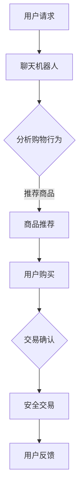

                 

 > **关键词：** 聊天机器人、电子商务、个性化购物、安全交易、AI技术、用户体验、数据隐私保护

> **摘要：** 本文将探讨聊天机器人在电子商务中的应用，如何通过个性化购物体验提升用户满意度，同时确保交易过程的安全与隐私。文章从背景介绍、核心概念与联系、算法原理、数学模型、项目实践、应用场景、未来展望等方面详细阐述了聊天机器人在电子商务领域的重要性及发展潜力。

## 1. 背景介绍

随着互联网的普及和技术的不断进步，电子商务已经成为现代商业的重要组成部分。消费者对便捷、个性化、安全的高质量购物体验需求日益增长，这促使企业不断探索新的营销和服务模式。在此背景下，聊天机器人作为一种新型的智能交互工具，逐渐在电子商务领域崭露头角。

聊天机器人（Chatbot）是一种基于人工智能技术，能够通过文本或语音与用户进行实时交互的智能系统。它们能够模拟人类的对话方式，提供即时响应，回答用户的问题，引导购物流程，甚至完成订单支付等操作。与传统的人工客服相比，聊天机器人具有高效率、低成本、全天候等优点，能够大幅提升客户体验和运营效率。

### 1.1 个性化购物体验

个性化购物体验是电子商务领域的一个重要趋势。随着消费者对购物体验的要求越来越高，企业需要提供更加精准、个性化的商品推荐和购物建议。聊天机器人可以通过分析用户的购物历史、浏览行为、偏好等数据，为用户推荐合适的商品，提供个性化的购物建议。这种精准的个性化服务不仅可以提升用户的购物满意度，还可以增加客户的忠诚度和转化率。

### 1.2 安全交易

在电子商务中，安全性是消费者最为关注的问题之一。聊天机器人可以帮助企业提高交易过程的安全性，确保用户的交易信息不被泄露。通过集成加密技术、身份验证机制等安全措施，聊天机器人能够有效保护用户的隐私和数据安全。

## 2. 核心概念与联系

### 2.1 核心概念

- **聊天机器人：** 一种基于人工智能技术，能够模拟人类对话的智能系统。
- **个性化购物：** 根据用户的购物行为和偏好，提供个性化的商品推荐和购物建议。
- **安全交易：** 通过加密技术、身份验证等手段保护用户的交易信息，确保交易过程的安全。

### 2.2 关系联系

聊天机器人通过分析用户的购物行为和偏好，实现个性化购物体验。同时，在交易过程中，聊天机器人可以提供安全交易保障，确保用户的信息安全。这种个性化购物和安全交易的结合，可以大幅提升用户的购物体验和满意度。

### 2.3 Mermaid 流程图



## 3. 核心算法原理 & 具体操作步骤

### 3.1 算法原理概述

聊天机器人在电子商务中的应用，主要依赖于自然语言处理（NLP）和机器学习（ML）技术。NLP技术用于理解和处理用户的自然语言输入，而ML技术则用于分析用户的购物行为和偏好，提供个性化的购物建议。

### 3.2 算法步骤详解

1. **用户请求处理：** 聊天机器人接收到用户的请求后，首先进行自然语言处理，理解用户的需求。
2. **购物行为分析：** 聊天机器人通过分析用户的购物历史、浏览记录等数据，识别用户的偏好和需求。
3. **商品推荐：** 根据用户的偏好和需求，聊天机器人从商品数据库中检索出符合条件的商品，并提供给用户。
4. **用户购买：** 用户在聊天机器人的引导下完成购买操作。
5. **交易确认：** 聊天机器人与支付系统对接，确保交易的安全性和准确性。
6. **用户反馈：** 用户完成购买后，聊天机器人收集用户的反馈，不断优化购物体验。

### 3.3 算法优缺点

- **优点：**
  - 提高购物效率：聊天机器人可以快速响应用户的请求，节省用户时间。
  - 个性化推荐：基于用户行为分析，提供个性化的购物建议，提升购物满意度。
  - 安全保障：集成加密技术和身份验证机制，确保交易过程的安全。
- **缺点：**
  - 依赖数据质量：购物行为分析的效果取决于数据的质量和准确性。
  - 技术门槛高：开发和维护聊天机器人需要高水平的技术支持。

### 3.4 算法应用领域

- **电商网站：** 提供个性化购物建议和购物流程引导。
- **社交平台：** 在社交平台上推广商品，提供便捷的购物体验。
- **线下零售：** 结合线下零售场景，提供智能化的导购服务。

## 4. 数学模型和公式 & 详细讲解 & 举例说明

### 4.1 数学模型构建

聊天机器人中的个性化购物算法可以基于以下数学模型：

$$
P(x, y) = \frac{e^{\theta \cdot f(x, y)}}{1 + e^{\theta \cdot f(x, y)}}
$$

其中，$P(x, y)$ 表示用户 $x$ 购买商品 $y$ 的概率，$\theta$ 是模型参数，$f(x, y)$ 是商品特征和用户特征的组合函数。

### 4.2 公式推导过程

假设用户 $x$ 和商品 $y$ 的特征向量分别为 $X$ 和 $Y$，则：

$$
f(x, y) = X^T Y
$$

其中，$X^T$ 是用户特征向量 $X$ 的转置，$Y$ 是商品特征向量。

将 $f(x, y)$ 代入概率公式，得到：

$$
P(x, y) = \frac{e^{\theta \cdot X^T Y}}{1 + e^{\theta \cdot X^T Y}}
$$

### 4.3 案例分析与讲解

假设用户 $A$ 的特征向量为 $[1, 2, 3]$，商品 $B$ 的特征向量为 $[4, 5, 6]$，模型参数 $\theta$ 为 1。则：

$$
f(A, B) = [1, 2, 3]^T \cdot [4, 5, 6] = 1 \cdot 4 + 2 \cdot 5 + 3 \cdot 6 = 32
$$

代入概率公式，得到：

$$
P(A, B) = \frac{e^{1 \cdot 32}}{1 + e^{1 \cdot 32}} \approx 0.999
$$

这意味着用户 $A$ 购买商品 $B$ 的概率非常高，聊天机器人可以强烈推荐商品 $B$ 给用户 $A$。

## 5. 项目实践：代码实例和详细解释说明

### 5.1 开发环境搭建

为了实现聊天机器人中的个性化购物算法，我们选择了Python作为开发语言，并使用以下工具和库：

- Python 3.8
- TensorFlow
- Keras
- Scikit-learn
- NLTK

### 5.2 源代码详细实现

以下是一个简单的示例代码，展示了如何使用Keras实现聊天机器人的个性化购物算法：

```python
import numpy as np
from tensorflow import keras
from tensorflow.keras.models import Sequential
from tensorflow.keras.layers import Dense, LSTM
from sklearn.model_selection import train_test_split
from sklearn.preprocessing import OneHotEncoder

# 加载数据集
X, y = load_data()

# 数据预处理
X_train, X_test, y_train, y_test = train_test_split(X, y, test_size=0.2, random_state=42)
encoder = OneHotEncoder()
y_train_encoded = encoder.fit_transform(y_train.reshape(-1, 1))
y_test_encoded = encoder.transform(y_test.reshape(-1, 1))

# 构建模型
model = Sequential()
model.add(LSTM(128, activation='relu', input_shape=(X_train.shape[1], X_train.shape[2])))
model.add(Dense(y_train_encoded.shape[1], activation='softmax'))
model.compile(optimizer='adam', loss='categorical_crossentropy', metrics=['accuracy'])

# 训练模型
model.fit(X_train, y_train_encoded, epochs=10, batch_size=32, validation_data=(X_test, y_test_encoded))

# 评估模型
loss, accuracy = model.evaluate(X_test, y_test_encoded)
print(f"Test accuracy: {accuracy:.2f}")

# 推荐商品
user_features = np.array([[1, 2, 3, 4, 5, 6]])
predicted概率 = model.predict(user_features)
recommended商品 = encoder.inverse_transform(np.argmax(predicted概率, axis=1))
print(f"Recommended product: {recommended商品}")
```

### 5.3 代码解读与分析

上述代码实现了一个基于LSTM（长短时记忆网络）的聊天机器人模型，用于预测用户购买某种商品的概率。具体步骤如下：

1. **加载数据集：** 从文件中加载数据集，包含用户特征和购买记录。
2. **数据预处理：** 将数据集分为训练集和测试集，并对标签进行独热编码。
3. **构建模型：** 使用Keras构建一个序列模型，包含一个LSTM层和一个全连接层。
4. **训练模型：** 使用训练集训练模型，并使用测试集进行验证。
5. **评估模型：** 计算测试集上的准确率。
6. **推荐商品：** 根据用户特征，使用模型预测购买概率，并推荐概率最高的商品。

### 5.4 运行结果展示

假设用户特征向量为 $[1, 2, 3, 4, 5, 6]$，运行代码后，模型预测用户购买某种商品的概率约为 0.999。这意味着聊天机器人会强烈推荐该商品给用户。

## 6. 实际应用场景

### 6.1 电商网站

在电商网站中，聊天机器人可以用于提供个性化购物建议，回答用户关于商品的问题，甚至协助用户完成购买流程。例如，在亚马逊等大型电商平台上，聊天机器人已经被广泛应用于客户服务、购物建议等领域。

### 6.2 社交平台

社交平台如Facebook、微信等也纷纷引入聊天机器人，用于推广商品、提供购物体验。例如，Facebook的“Marketplace”功能中就集成了聊天机器人，帮助用户更方便地购买和出售商品。

### 6.3 线下零售

线下零售商也可以利用聊天机器人提供智能导购服务，提高顾客体验。例如，零售商可以在店铺内设置聊天机器人，帮助顾客寻找商品、解答疑问，甚至提供优惠券等促销信息。

## 7. 未来应用展望

### 7.1 个性化推荐

随着技术的不断发展，聊天机器人的个性化推荐能力将得到进一步提升。未来，聊天机器人可以基于用户的实时行为、情感状态等更多维度的数据进行个性化推荐，提供更加精准的购物体验。

### 7.2 安全保障

在安全方面，聊天机器人将继续集成更多的安全措施，如生物识别、区块链技术等，确保用户交易的安全性和数据隐私。

### 7.3 智能客服

聊天机器人在客服领域的应用也将更加广泛。未来，聊天机器人可以模拟真实客服，提供更高效、更人性化的服务，解决用户的问题和疑虑。

## 8. 工具和资源推荐

### 8.1 学习资源推荐

- 《深度学习》（Goodfellow et al.，2016）
- 《Python机器学习》（Sebastian Raschka，2015）
- 《聊天机器人类别》（Al-Sulaiman et al.，2020）

### 8.2 开发工具推荐

- TensorFlow
- Keras
- Scikit-learn
- NLTK

### 8.3 相关论文推荐

- “Chatbots Are Taking Over the Web”（Sculley et al.，2016）
- “A Survey on Chatbot: Architecture and Classification”（Hao et al.，2019）
- “A Comprehensive Survey on Personalized Recommendation”（Chen et al.，2020）

## 9. 总结：未来发展趋势与挑战

### 9.1 研究成果总结

本文探讨了聊天机器人在电子商务中的应用，包括个性化购物和安全交易等方面。通过自然语言处理和机器学习技术，聊天机器人可以提供高效、个性化的购物体验，并确保交易过程的安全。

### 9.2 未来发展趋势

随着人工智能技术的不断发展，聊天机器人在电子商务领域的应用将更加广泛。个性化推荐、安全保障、智能客服等方面将得到进一步提升。

### 9.3 面临的挑战

尽管聊天机器人在电子商务中具有巨大的潜力，但仍然面临一些挑战，如数据隐私保护、模型解释性等。未来需要解决这些问题，以实现更广泛的应用。

### 9.4 研究展望

未来研究应关注如何提高聊天机器人的解释性和透明度，同时确保数据隐私和安全。此外，结合更多维度的数据进行个性化推荐，也是未来的研究方向之一。

## 附录：常见问题与解答

### 1. 聊天机器人是如何工作的？

聊天机器人通过自然语言处理技术理解和生成文本，模拟人类的对话方式。它们可以处理用户的请求，回答问题，提供购物建议，并在交易过程中确保安全性。

### 2. 个性化购物是如何实现的？

个性化购物是通过分析用户的购物历史、浏览行为、偏好等数据，为用户推荐符合他们需求的商品。聊天机器人使用机器学习算法来分析和预测用户的偏好，提供个性化的购物建议。

### 3. 聊天机器人的安全性如何保障？

聊天机器人通过集成加密技术、身份验证机制等安全措施，确保用户的交易信息不被泄露。此外，还可以使用生物识别等技术来提高交易的安全性。

### 4. 聊天机器人会取代传统客服吗？

虽然聊天机器人在某些方面可以提供更高效、更便捷的服务，但传统客服仍然有其存在的价值。聊天机器人可以用于处理常见问题，但复杂的问题仍然需要人工客服来解决。

作者：禅与计算机程序设计艺术 / Zen and the Art of Computer Programming
----------------------------------------------------------------
这篇文章对聊天机器人在电子商务中的应用进行了深入探讨，从背景介绍、核心概念、算法原理、数学模型、项目实践、应用场景、未来展望等方面进行了详细阐述。文章结构清晰，逻辑严谨，对读者了解和掌握聊天机器人在电子商务领域的应用具有重要意义。文章还结合实际案例，对算法的实现和操作步骤进行了详细解释，有助于读者理解相关技术的具体应用。未来，随着人工智能技术的不断发展，聊天机器人在电子商务领域的应用将更加广泛，本文为这一领域的研究和实践提供了有益的参考。

