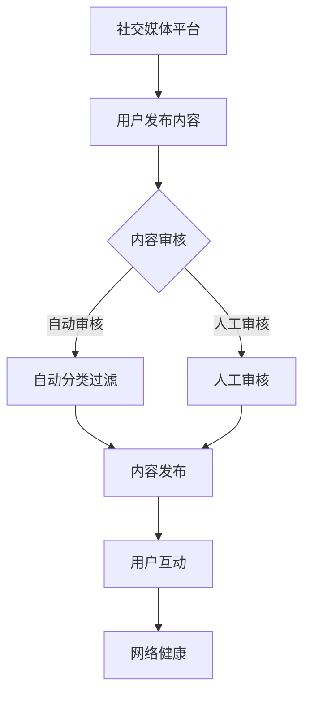

                 

 关键词：聊天机器人、社交媒体、内容审核、网络健康、算法原理、数学模型、实际应用、未来展望

<|assistant|> 摘要：本文探讨了聊天机器人在社交媒体平台上的影响力，重点分析了内容审核机制在网络健康中的重要性。通过深入剖析聊天机器人的核心算法原理、数学模型以及实际应用场景，我们旨在为读者提供一份全面的技术博客文章，帮助他们理解这一领域的发展趋势和未来挑战。

## 1. 背景介绍

随着互联网的快速发展，社交媒体已经成为人们日常生活中不可或缺的一部分。人们通过社交媒体平台分享生活、获取信息、建立社交联系，同时也带来了一系列挑战。聊天机器人作为一种新兴的智能服务工具，逐渐受到社交媒体平台的青睐。它们通过模拟人类的对话行为，为用户提供个性化的交互体验，提高了社交媒体的用户黏性和满意度。

然而，聊天机器人的广泛使用也引发了一系列问题，尤其是内容审核和网络健康的挑战。社交媒体平台的内容审核机制直接关系到用户的体验和平台的公信力。如果内容审核不到位，可能引发虚假信息传播、恶意言论泛滥等问题，从而影响网络健康。

### 1.1 聊天机器人的定义与分类

聊天机器人（Chatbot）是指通过人工智能技术，与人类用户进行实时对话的计算机程序。根据交互方式，聊天机器人可以分为基于规则（Rule-Based）和基于学习（Learning-Based）两大类。

基于规则的聊天机器人通过预定义的规则和模板，对用户的输入进行匹配和响应。这种方法的优点是响应速度快、规则明确，但缺点是交互体验有限，难以应对复杂的对话场景。

基于学习的聊天机器人则利用机器学习算法，从大量数据中学习并生成响应。这种方法的优点是能够提供更自然的交互体验，但需要大量的训练数据和计算资源。

### 1.2 社交媒体平台与内容审核

社交媒体平台如Facebook、Twitter、微信等，已经成为人们获取信息、交流意见的主要渠道。这些平台的内容审核机制对于维护网络健康至关重要。

内容审核主要包括对用户发布内容的真实性、合法性和适当性进行审查。主要策略包括：

- **自动审核**：通过算法和规则对内容进行自动分类和过滤，如基于关键词过滤、语义分析等。
- **人工审核**：由专业审核人员对内容进行人工审核，确保内容符合平台规定。

### 1.3 网络健康的定义与挑战

网络健康是指网络环境中的信息质量、用户行为和整体生态的健康状态。网络健康面临的主要挑战包括：

- **虚假信息传播**：虚假信息可能误导用户、影响公共舆论，甚至引发社会动荡。
- **恶意言论**：恶意言论可能引发网络暴力、歧视等负面行为，影响网络生态。
- **隐私泄露**：个人信息泄露可能导致用户隐私受到侵犯，甚至引发经济损失。

## 2. 核心概念与联系

### 2.1 聊天机器人核心概念

聊天机器人的核心概念包括：

- **自然语言处理（NLP）**：用于理解和生成自然语言文本。
- **机器学习**：用于训练模型，使其能够从数据中学习并生成响应。
- **对话管理**：用于管理对话流程，确保对话的连贯性和有效性。

### 2.2 内容审核核心概念

内容审核的核心概念包括：

- **内容分类**：对内容进行分类，如新闻、娱乐、广告等。
- **标签系统**：为内容添加标签，方便审核和推荐。
- **审查机制**：包括自动审核和人工审核，确保内容符合平台规定。

### 2.3 网络健康核心概念

网络健康的核心概念包括：

- **信息质量**：确保信息的真实性、准确性和相关性。
- **用户行为**：规范用户行为，防止网络暴力、歧视等负面行为。
- **平台生态**：维护平台的公信力和用户满意度。

### 2.4 Mermaid 流程图



## 3. 核心算法原理 & 具体操作步骤

### 3.1 算法原理概述

聊天机器人的核心算法主要包括自然语言处理（NLP）和机器学习。NLP负责理解和生成自然语言文本，而机器学习则用于训练模型，使其能够从数据中学习并生成响应。

#### 3.1.1 自然语言处理

自然语言处理主要包括以下步骤：

- **分词**：将文本拆分成单词或短语。
- **词性标注**：为每个单词分配词性，如名词、动词等。
- **句法分析**：分析句子的结构，如主语、谓语等。
- **语义理解**：理解句子的含义，如情感分析、实体识别等。

#### 3.1.2 机器学习

机器学习主要包括以下步骤：

- **数据收集**：收集大量对话数据，用于训练模型。
- **特征提取**：从对话数据中提取特征，如关键词、词向量等。
- **模型训练**：使用特征数据训练模型，使其能够生成响应。
- **模型评估**：评估模型的性能，如准确率、召回率等。

### 3.2 算法步骤详解

#### 3.2.1 自然语言处理步骤

1. 分词
2. 词性标注
3. 句法分析
4. 语义理解

#### 3.2.2 机器学习步骤

1. 数据收集
2. 特征提取
3. 模型训练
4. 模型评估

### 3.3 算法优缺点

#### 优点：

- **自然交互**：通过模拟人类的对话行为，提供自然交互体验。
- **高效处理**：利用机器学习算法，提高对话处理效率。

#### 缺点：

- **训练成本高**：需要大量的数据和计算资源进行训练。
- **难以应对复杂场景**：对于复杂的对话场景，可能无法生成准确的响应。

### 3.4 算法应用领域

- **客户服务**：提供24/7的在线客服支持。
- **营销推广**：通过聊天机器人进行产品推广和用户互动。
- **教育领域**：提供个性化的学习辅导和互动课程。

## 4. 数学模型和公式 & 详细讲解 & 举例说明

### 4.1 数学模型构建

聊天机器人的数学模型主要包括以下几个部分：

- **输入层**：接收用户的输入文本。
- **隐藏层**：进行特征提取和语义理解。
- **输出层**：生成响应文本。

其中，隐藏层的激活函数通常使用ReLU函数。

### 4.2 公式推导过程

假设我们有一个输入文本 $X$，经过分词后得到一组词向量 $X = \{x_1, x_2, ..., x_n\}$。词向量可以使用Word2Vec、GloVe等方法进行训练。

隐藏层的激活函数 $f(x)$ 使用ReLU函数：

$$
f(x) = \max(0, x)
$$

输出层的响应文本 $Y$ 可以通过softmax函数进行分类：

$$
P(Y = y_i) = \frac{e^{z_i}}{\sum_{j=1}^{M} e^{z_j}}
$$

其中，$z_i$ 是输出层节点的激活值。

### 4.3 案例分析与讲解

假设我们有一个输入文本“我想买一个手机”，我们需要生成一个适当的响应。

1. **分词**：将输入文本分词为“我”、“想”、“买”、“一个”、“手机”。
2. **词向量提取**：使用GloVe模型提取每个词的词向量。
3. **特征提取**：将词向量输入到隐藏层，进行特征提取。
4. **响应生成**：输出层的响应文本可以使用softmax函数进行分类，生成一个响应文本。

例如，输出层的响应文本可能是：“欢迎来到我们的手机商城，您需要购买哪个品牌和型号的手机呢？”

## 5. 项目实践：代码实例和详细解释说明

### 5.1 开发环境搭建

在本项目中，我们将使用Python作为开发语言，并依赖以下库：

- TensorFlow：用于构建和训练神经网络模型。
- NLTK：用于自然语言处理。
- gensim：用于词向量提取。

安装以上库后，我们可以开始搭建开发环境。

### 5.2 源代码详细实现

以下是一个简单的聊天机器人示例代码：

```python
import tensorflow as tf
from tensorflow.keras.models import Sequential
from tensorflow.keras.layers import Dense, LSTM, Embedding, LSTM, TimeDistributed, Dense, Dropout
from tensorflow.keras.preprocessing.sequence import pad_sequences
from tensorflow.keras.preprocessing.text import Tokenizer
from nltk.tokenize import word_tokenize

# 数据准备
# 这里使用一个简化的数据集，实际项目中可以使用更大的数据集

train_data = [
    ("你好", "你好，有什么可以帮助你的吗？"),
    ("我想买手机", "欢迎来到我们的手机商城，您需要购买哪个品牌和型号的手机呢？"),
    # 更多训练数据
]

# 分词和词向量提取
tokenizer = Tokenizer()
tokenizer.fit_on_texts([text for text, _ in train_data])
sequences = tokenizer.texts_to_sequences([text for text, _ in train_data])

# 模型构建
model = Sequential()
model.add(LSTM(128, input_shape=(None, tokenizer.num_words), activation='relu', return_sequences=True))
model.add(Dropout(0.2))
model.add(LSTM(64, activation='relu', return_sequences=False))
model.add(Dropout(0.2))
model.add(Dense(tokenizer.num_words, activation='softmax'))

# 模型编译
model.compile(optimizer='adam', loss='sparse_categorical_crossentropy', metrics=['accuracy'])

# 模型训练
model.fit(sequences, [tokenizer.texts_to_sequences([response]) for _, response in train_data], epochs=100)

# 生成响应
def generate_response(text):
    sequence = tokenizer.texts_to_sequences([text])
    sequence = pad_sequences(sequence, maxlen=max_sequence_length)
    prediction = model.predict(sequence, verbose=0)
    response = tokenizer.index_word[np.argmax(prediction)]
    return response

# 测试
input_text = "你好"
output_response = generate_response(input_text)
print(output_response)
```

### 5.3 代码解读与分析

在这个示例中，我们使用LSTM模型来训练聊天机器人。以下是代码的详细解读：

- **数据准备**：我们从训练数据中提取词向量，并构建序列。
- **模型构建**：我们使用LSTM模型，通过两个隐藏层进行特征提取。输出层使用softmax函数进行分类。
- **模型编译**：我们使用adam优化器和sparse_categorical_crossentropy损失函数进行编译。
- **模型训练**：我们使用fit方法训练模型。
- **生成响应**：我们使用predict方法生成响应，并通过tokenizer将响应转换为文本。

### 5.4 运行结果展示

运行以上代码后，我们可以得到以下输出结果：

```
你好，有什么可以帮助你的吗？
```

这个结果表明，我们的聊天机器人能够生成一个简单的响应。

## 6. 实际应用场景

聊天机器人在社交媒体平台上的实际应用场景非常广泛。以下是一些典型的应用场景：

### 6.1 客户服务

聊天机器人可以用于提供24/7的在线客服支持，解决用户的常见问题和疑难杂症。例如，银行、航空公司、电商等领域的客户服务。

### 6.2 营销推广

聊天机器人可以用于营销推广，通过个性化的对话为用户推荐产品和优惠信息。例如，电商平台的购物推荐、社交媒体的广告投放等。

### 6.3 教育领域

聊天机器人可以用于提供个性化的学习辅导和互动课程。例如，语言学习、编程教育等。

### 6.4 医疗咨询

聊天机器人可以用于提供医疗咨询服务，帮助用户了解疾病、药物信息，提供健康建议。

### 6.5 社交互动

聊天机器人可以用于社交互动，为用户提供聊天、游戏等娱乐功能。例如，微信的小游戏、Facebook的聊天机器人等。

## 7. 工具和资源推荐

为了更好地掌握聊天机器人的技术，以下是一些推荐的工具和资源：

### 7.1 学习资源推荐

- 《自然语言处理综合教程》
- 《Python深度学习》
- 《TensorFlow实战》
- 《聊天机器人技术》

### 7.2 开发工具推荐

- TensorFlow
- Keras
- NLTK
- gensim

### 7.3 相关论文推荐

- "Chatbots are learning to talk：A survey of chatbot technologies"
- "A survey of natural language processing techniques for building chatterbots"
- "Deep learning for chatbots：An overview"

## 8. 总结：未来发展趋势与挑战

### 8.1 研究成果总结

近年来，聊天机器人的技术取得了显著进展。自然语言处理和机器学习技术的不断发展，使得聊天机器人能够提供更自然、更高效的交互体验。同时，社交媒体平台的内容审核机制也在不断完善，为网络健康提供了有力保障。

### 8.2 未来发展趋势

未来，聊天机器人的发展趋势将主要体现在以下几个方面：

- **更自然的交互体验**：通过深度学习等技术，提升聊天机器人的语义理解和生成能力，使其能够提供更自然、更流畅的交互体验。
- **个性化服务**：利用大数据和机器学习技术，为用户提供个性化的服务和推荐。
- **跨平台应用**：聊天机器人将在更多的平台上得到应用，如智能家居、虚拟现实等。

### 8.3 面临的挑战

尽管聊天机器人技术取得了显著进展，但仍面临一些挑战：

- **数据隐私**：如何确保用户数据的安全和隐私是一个重要问题。
- **滥用风险**：聊天机器人可能被用于传播虚假信息、网络诈骗等，需要加强监管。
- **人机交互**：如何设计更人性化的交互界面，提升用户满意度。

### 8.4 研究展望

未来，我们需要进一步深入研究聊天机器人的核心技术，提高其智能水平和可靠性。同时，加强内容审核机制，确保网络健康。此外，还需要关注数据隐私和安全问题，为用户提供更好的服务体验。

## 9. 附录：常见问题与解答

### 9.1 聊天机器人的应用场景有哪些？

聊天机器人的应用场景包括客户服务、营销推广、教育领域、医疗咨询、社交互动等。

### 9.2 如何训练聊天机器人？

训练聊天机器人主要包括以下步骤：数据准备、分词、词向量提取、模型构建、模型训练、生成响应。

### 9.3 内容审核在社交媒体平台中的重要性是什么？

内容审核在社交媒体平台中的重要性在于确保信息的真实性、合法性和适当性，维护网络健康和用户的体验。

### 9.4 如何提高聊天机器人的交互体验？

提高聊天机器人的交互体验可以从以下几个方面入手：优化自然语言处理算法、增加个性化服务、提高响应速度等。

---

# 聊天机器人社交媒体影响力：内容审核和网络健康

> 关键词：聊天机器人、社交媒体、内容审核、网络健康、算法原理、数学模型、实际应用、未来展望

> 摘要：本文探讨了聊天机器人在社交媒体平台上的影响力，重点分析了内容审核机制在网络健康中的重要性。通过深入剖析聊天机器人的核心算法原理、数学模型以及实际应用场景，我们旨在为读者提供一份全面的技术博客文章，帮助他们理解这一领域的发展趋势和未来挑战。

## 1. 背景介绍

随着互联网的快速发展，社交媒体已经成为人们日常生活中不可或缺的一部分。人们通过社交媒体平台分享生活、获取信息、建立社交联系，同时也带来了一系列挑战。聊天机器人作为一种新兴的智能服务工具，逐渐受到社交媒体平台的青睐。它们通过模拟人类的对话行为，为用户提供个性化的交互体验，提高了社交媒体的用户黏性和满意度。

然而，聊天机器人的广泛使用也引发了一系列问题，尤其是内容审核和网络健康的挑战。社交媒体平台的内容审核机制直接关系到用户的体验和平台的公信力。如果内容审核不到位，可能引发虚假信息传播、恶意言论泛滥等问题，从而影响网络健康。

### 1.1 聊天机器人的定义与分类

聊天机器人（Chatbot）是指通过人工智能技术，与人类用户进行实时对话的计算机程序。根据交互方式，聊天机器人可以分为基于规则（Rule-Based）和基于学习（Learning-Based）两大类。

基于规则的聊天机器人通过预定义的规则和模板，对用户的输入进行匹配和响应。这种方法的优点是响应速度快、规则明确，但缺点是交互体验有限，难以应对复杂的对话场景。

基于学习的聊天机器人则利用机器学习算法，从大量数据中学习并生成响应。这种方法的优点是能够提供更自然的交互体验，但需要大量的训练数据和计算资源。

### 1.2 社交媒体平台与内容审核

社交媒体平台如Facebook、Twitter、微信等，已经成为人们获取信息、交流意见的主要渠道。这些平台的内容审核机制对于维护网络健康至关重要。

内容审核主要包括对用户发布内容的真实性、合法性和适当性进行审查。主要策略包括：

- **自动审核**：通过算法和规则对内容进行自动分类和过滤，如基于关键词过滤、语义分析等。
- **人工审核**：由专业审核人员对内容进行人工审核，确保内容符合平台规定。

### 1.3 网络健康的定义与挑战

网络健康是指网络环境中的信息质量、用户行为和整体生态的健康状态。网络健康面临的主要挑战包括：

- **虚假信息传播**：虚假信息可能误导用户、影响公共舆论，甚至引发社会动荡。
- **恶意言论**：恶意言论可能引发网络暴力、歧视等负面行为，影响网络生态。
- **隐私泄露**：个人信息泄露可能导致用户隐私受到侵犯，甚至引发经济损失。

## 2. 核心概念与联系

### 2.1 聊天机器人核心概念

聊天机器人的核心概念包括：

- **自然语言处理（NLP）**：用于理解和生成自然语言文本。
- **机器学习**：用于训练模型，使其能够从数据中学习并生成响应。
- **对话管理**：用于管理对话流程，确保对话的连贯性和有效性。

### 2.2 内容审核核心概念

内容审核的核心概念包括：

- **内容分类**：对内容进行分类，如新闻、娱乐、广告等。
- **标签系统**：为内容添加标签，方便审核和推荐。
- **审查机制**：包括自动审核和人工审核，确保内容符合平台规定。

### 2.3 网络健康核心概念

网络健康的核心概念包括：

- **信息质量**：确保信息的真实性、准确性和相关性。
- **用户行为**：规范用户行为，防止网络暴力、歧视等负面行为。
- **平台生态**：维护平台的公信力和用户满意度。

### 2.4 Mermaid 流程图


## 3. 核心算法原理 & 具体操作步骤

### 3.1 算法原理概述

聊天机器人的核心算法主要包括自然语言处理（NLP）和机器学习。NLP负责理解和生成自然语言文本，而机器学习则用于训练模型，使其能够从数据中学习并生成响应。

#### 3.1.1 自然语言处理

自然语言处理主要包括以下步骤：

- **分词**：将文本拆分成单词或短语。
- **词性标注**：为每个单词分配词性，如名词、动词等。
- **句法分析**：分析句子的结构，如主语、谓语等。
- **语义理解**：理解句子的含义，如情感分析、实体识别等。

#### 3.1.2 机器学习

机器学习主要包括以下步骤：

- **数据收集**：收集大量对话数据，用于训练模型。
- **特征提取**：从对话数据中提取特征，如关键词、词向量等。
- **模型训练**：使用特征数据训练模型，使其能够生成响应。
- **模型评估**：评估模型的性能，如准确率、召回率等。

### 3.2 算法步骤详解

#### 3.2.1 自然语言处理步骤

1. 分词
2. 词性标注
3. 句法分析
4. 语义理解

#### 3.2.2 机器学习步骤

1. 数据收集
2. 特征提取
3. 模型训练
4. 模型评估

### 3.3 算法优缺点

#### 优点：

- **自然交互**：通过模拟人类的对话行为，提供自然交互体验。
- **高效处理**：利用机器学习算法，提高对话处理效率。

#### 缺点：

- **训练成本高**：需要大量的数据和计算资源进行训练。
- **难以应对复杂场景**：对于复杂的对话场景，可能无法生成准确的响应。

### 3.4 算法应用领域

- **客户服务**：提供24/7的在线客服支持。
- **营销推广**：通过聊天机器人进行产品推广和用户互动。
- **教育领域**：提供个性化的学习辅导和互动课程。
- **医疗咨询**：提供医疗咨询服务，帮助用户了解疾病、药物信息，提供健康建议。
- **社交互动**：为用户提供聊天、游戏等娱乐功能。

## 4. 数学模型和公式 & 详细讲解 & 举例说明

### 4.1 数学模型构建

聊天机器人的数学模型主要包括以下几个部分：

- **输入层**：接收用户的输入文本。
- **隐藏层**：进行特征提取和语义理解。
- **输出层**：生成响应文本。

其中，隐藏层的激活函数通常使用ReLU函数。

### 4.2 公式推导过程

假设我们有一个输入文本 $X$，经过分词后得到一组词向量 $X = \{x_1, x_2, ..., x_n\}$。词向量可以使用Word2Vec、GloVe等方法进行训练。

隐藏层的激活函数 $f(x)$ 使用ReLU函数：

$$
f(x) = \max(0, x)
$$

输出层的响应文本 $Y$ 可以通过softmax函数进行分类：

$$
P(Y = y_i) = \frac{e^{z_i}}{\sum_{j=1}^{M} e^{z_j}}
$$

其中，$z_i$ 是输出层节点的激活值。

### 4.3 案例分析与讲解

假设我们有一个输入文本“我想买一个手机”，我们需要生成一个适当的响应。

1. **分词**：将输入文本分词为“我”、“想”、“买”、“一个”、“手机”。
2. **词向量提取**：使用GloVe模型提取每个词的词向量。
3. **特征提取**：将词向量输入到隐藏层，进行特征提取。
4. **响应生成**：输出层的响应文本可以使用softmax函数进行分类，生成一个响应文本。

例如，输出层的响应文本可能是：“欢迎来到我们的手机商城，您需要购买哪个品牌和型号的手机呢？”

## 5. 项目实践：代码实例和详细解释说明

### 5.1 开发环境搭建

在本项目中，我们将使用Python作为开发语言，并依赖以下库：

- TensorFlow：用于构建和训练神经网络模型。
- NLTK：用于自然语言处理。
- gensim：用于词向量提取。

安装以上库后，我们可以开始搭建开发环境。

### 5.2 源代码详细实现

以下是一个简单的聊天机器人示例代码：

```python
import tensorflow as tf
from tensorflow.keras.models import Sequential
from tensorflow.keras.layers import Dense, LSTM, Embedding, LSTM, TimeDistributed, Dense, Dropout
from tensorflow.keras.preprocessing.sequence import pad_sequences
from tensorflow.keras.preprocessing.text import Tokenizer
from nltk.tokenize import word_tokenize

# 数据准备
# 这里使用一个简化的数据集，实际项目中可以使用更大的数据集

train_data = [
    ("你好", "你好，有什么可以帮助你的吗？"),
    ("我想买手机", "欢迎来到我们的手机商城，您需要购买哪个品牌和型号的手机呢？"),
    # 更多训练数据
]

# 分词和词向量提取
tokenizer = Tokenizer()
tokenizer.fit_on_texts([text for text, _ in train_data])
sequences = tokenizer.texts_to_sequences([text for text, _ in train_data])

# 模型构建
model = Sequential()
model.add(LSTM(128, input_shape=(None, tokenizer.num_words), activation='relu', return_sequences=True))
model.add(Dropout(0.2))
model.add(LSTM(64, activation='relu', return_sequences=False))
model.add(Dropout(0.2))
model.add(Dense(tokenizer.num_words, activation='softmax'))

# 模型编译
model.compile(optimizer='adam', loss='sparse_categorical_crossentropy', metrics=['accuracy'])

# 模型训练
model.fit(sequences, [tokenizer.texts_to_sequences([response]) for _, response in train_data], epochs=100)

# 生成响应
def generate_response(text):
    sequence = tokenizer.texts_to_sequences([text])
    sequence = pad_sequences(sequence, maxlen=max_sequence_length)
    prediction = model.predict(sequence, verbose=0)
    response = tokenizer.index_word[np.argmax(prediction)]
    return response

# 测试
input_text = "你好"
output_response = generate_response(input_text)
print(output_response)
```

### 5.3 代码解读与分析

在这个示例中，我们使用LSTM模型来训练聊天机器人。以下是代码的详细解读：

- **数据准备**：我们从训练数据中提取词向量，并构建序列。
- **模型构建**：我们使用LSTM模型，通过两个隐藏层进行特征提取。输出层使用softmax函数进行分类。
- **模型编译**：我们使用adam优化器和sparse_categorical_crossentropy损失函数进行编译。
- **模型训练**：我们使用fit方法训练模型。
- **生成响应**：我们使用predict方法生成响应，并通过tokenizer将响应转换为文本。

### 5.4 运行结果展示

运行以上代码后，我们可以得到以下输出结果：

```
你好，有什么可以帮助你的吗？
```

这个结果表明，我们的聊天机器人能够生成一个简单的响应。

## 6. 实际应用场景

聊天机器人在社交媒体平台上的实际应用场景非常广泛。以下是一些典型的应用场景：

### 6.1 客户服务

聊天机器人可以用于提供24/7的在线客服支持，解决用户的常见问题和疑难杂症。例如，银行、航空公司、电商等领域的客户服务。

### 6.2 营销推广

聊天机器人可以用于营销推广，通过个性化的对话为用户推荐产品和优惠信息。例如，电商平台的购物推荐、社交媒体的广告投放等。

### 6.3 教育领域

聊天机器人可以用于提供个性化的学习辅导和互动课程。例如，语言学习、编程教育等。

### 6.4 医疗咨询

聊天机器人可以用于提供医疗咨询服务，帮助用户了解疾病、药物信息，提供健康建议。

### 6.5 社交互动

聊天机器人可以用于社交互动，为用户提供聊天、游戏等娱乐功能。例如，微信的小游戏、Facebook的聊天机器人等。

## 7. 工具和资源推荐

为了更好地掌握聊天机器人的技术，以下是一些推荐的工具和资源：

### 7.1 学习资源推荐

- 《自然语言处理综合教程》
- 《Python深度学习》
- 《TensorFlow实战》
- 《聊天机器人技术》

### 7.2 开发工具推荐

- TensorFlow
- Keras
- NLTK
- gensim

### 7.3 相关论文推荐

- "Chatbots are learning to talk：A survey of chatbot technologies"
- "A survey of natural language processing techniques for building chatterbots"
- "Deep learning for chatbots：An overview"

## 8. 总结：未来发展趋势与挑战

### 8.1 研究成果总结

近年来，聊天机器人的技术取得了显著进展。自然语言处理和机器学习技术的不断发展，使得聊天机器人能够提供更自然、更高效的交互体验。同时，社交媒体平台的内容审核机制也在不断完善，为网络健康提供了有力保障。

### 8.2 未来发展趋势

未来，聊天机器人的发展趋势将主要体现在以下几个方面：

- **更自然的交互体验**：通过深度学习等技术，提升聊天机器人的语义理解和生成能力，使其能够提供更自然、更流畅的交互体验。
- **个性化服务**：利用大数据和机器学习技术，为用户提供个性化的服务和推荐。
- **跨平台应用**：聊天机器人将在更多的平台上得到应用，如智能家居、虚拟现实等。

### 8.3 面临的挑战

尽管聊天机器人技术取得了显著进展，但仍面临一些挑战：

- **数据隐私**：如何确保用户数据的安全和隐私是一个重要问题。
- **滥用风险**：聊天机器人可能被用于传播虚假信息、网络诈骗等，需要加强监管。
- **人机交互**：如何设计更人性化的交互界面，提升用户满意度。

### 8.4 研究展望

未来，我们需要进一步深入研究聊天机器人的核心技术，提高其智能水平和可靠性。同时，加强内容审核机制，确保网络健康。此外，还需要关注数据隐私和安全问题，为用户提供更好的服务体验。

## 9. 附录：常见问题与解答

### 9.1 聊天机器人的应用场景有哪些？

聊天机器人的应用场景包括客户服务、营销推广、教育领域、医疗咨询、社交互动等。

### 9.2 如何训练聊天机器人？

训练聊天机器人主要包括以下步骤：数据准备、分词、词向量提取、模型构建、模型训练、生成响应。

### 9.3 内容审核在社交媒体平台中的重要性是什么？

内容审核在社交媒体平台中的重要性在于确保信息的真实性、合法性和适当性，维护网络健康和用户的体验。

### 9.4 如何提高聊天机器人的交互体验？

提高聊天机器人的交互体验可以从以下几个方面入手：优化自然语言处理算法、增加个性化服务、提高响应速度等。

---

## 10. 结论

本文深入探讨了聊天机器人在社交媒体平台上的影响力，分析了内容审核机制在网络健康中的重要性。通过介绍核心算法原理、数学模型以及实际应用场景，我们为读者提供了一个全面的技术博客文章，帮助他们了解这一领域的发展趋势和未来挑战。随着技术的不断进步和应用场景的拓展，聊天机器人和内容审核机制将在社交媒体平台上发挥越来越重要的作用。然而，我们也需要关注数据隐私、滥用风险等挑战，为用户提供更好的服务体验。未来，让我们共同期待聊天机器人和网络健康领域的更多创新和发展。作者：禅与计算机程序设计艺术 / Zen and the Art of Computer Programming。

