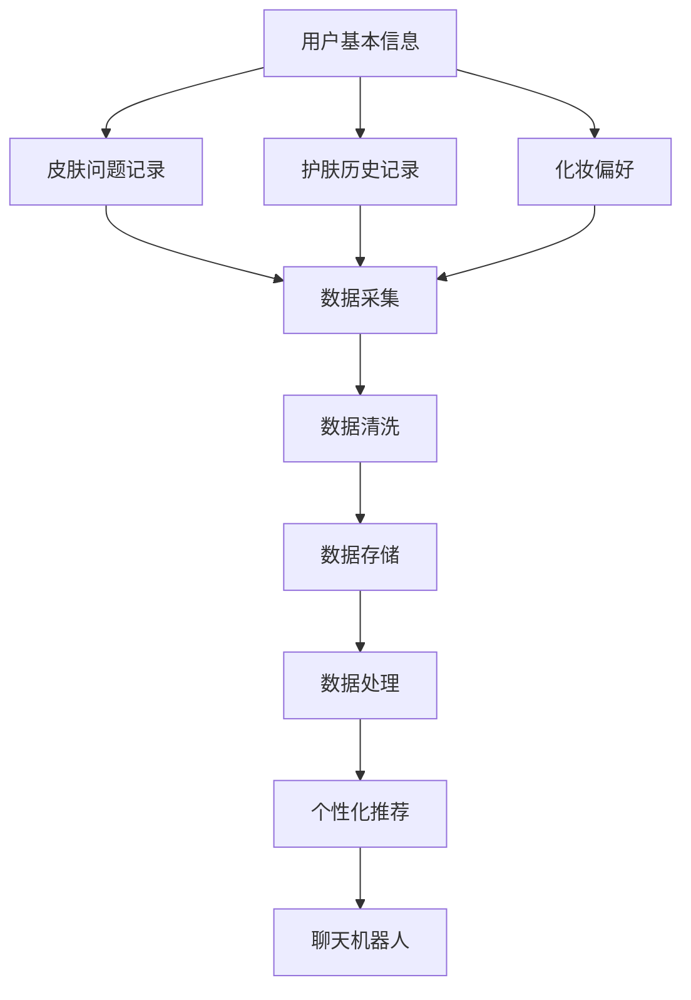

                 

关键词：聊天机器人、美容业、个性化护理、化妆推荐、皮肤分析、大数据

摘要：本文将探讨如何利用聊天机器人技术，为美容行业提供个性化的皮肤护理和化妆推荐服务。通过结合大数据和人工智能技术，我们可以实现精准的皮肤分析和个性化建议，为用户带来更高效、便捷的护肤体验。本文将详细介绍相关技术原理、数学模型、算法应用，并分享实际项目案例，以期为行业提供有价值的参考。

## 1. 背景介绍

随着移动互联网和人工智能技术的不断发展，聊天机器人在各个行业的应用越来越广泛。在美容行业，聊天机器人不仅可以提供基本的咨询和推荐服务，还可以通过个性化的数据分析，为用户提供更加精准的皮肤护理和化妆建议。这一趋势不仅提高了用户满意度，也为美容行业带来了新的商业模式。

个性化皮肤护理和化妆推荐服务的核心在于对用户皮肤特征的理解和分析。传统的美容咨询服务通常依赖于美容师的经验和知识，这种方式虽然可靠，但存在效率低下、覆盖面窄等问题。而聊天机器人可以通过大数据分析和机器学习算法，快速、准确地分析用户的皮肤状况，并提供个性化的护理和化妆建议。

## 2. 核心概念与联系

### 2.1 皮肤分析数据源

皮肤分析数据源主要包括用户的基本信息、皮肤问题记录、护肤历史记录、化妆偏好等。这些数据可以通过用户的自我报告、面部图像分析、皮肤检测仪器等多种方式获取。

### 2.2 大数据分析与处理

通过对皮肤分析数据的大数据分析，可以挖掘出用户的皮肤特征、趋势和需求。大数据分析主要包括数据采集、数据清洗、数据存储、数据处理等步骤。

### 2.3 个性化推荐算法

个性化推荐算法是聊天机器人实现皮肤护理和化妆推荐的核心。常见的推荐算法包括协同过滤、基于内容的推荐、混合推荐等。

### 2.4 人工智能技术

人工智能技术，如深度学习、自然语言处理等，可以进一步提升聊天机器人的智能化水平，使其能够更好地理解用户的需求，提供更加个性化的服务。

## 2.5 皮肤分析流程图



## 3. 核心算法原理 & 具体操作步骤

### 3.1 算法原理概述

个性化皮肤护理和化妆推荐的核心算法主要包括皮肤特征提取、用户偏好分析、推荐算法实现等步骤。以下是具体操作步骤的详细介绍。

### 3.2 算法步骤详解

#### 3.2.1 皮肤特征提取

皮肤特征提取是皮肤分析的第一步，主要包括面部图像分析、皮肤纹理分析、肤色分析等。通过这些特征，可以初步了解用户的皮肤状况。

#### 3.2.2 用户偏好分析

用户偏好分析主要通过用户的历史数据和自我报告来分析用户的皮肤问题、护肤习惯和化妆偏好。这一步骤可以帮助聊天机器人更好地理解用户的需求。

#### 3.2.3 推荐算法实现

推荐算法实现包括协同过滤、基于内容的推荐、混合推荐等。这些算法可以根据用户的皮肤特征和偏好，为用户推荐最适合的皮肤护理产品和化妆方案。

### 3.3 算法优缺点

- **优点**：个性化推荐算法可以提供精准的皮肤护理和化妆建议，提高用户满意度。
- **缺点**：算法的准确性和稳定性需要进一步提高，特别是在面对多样化的用户需求时。

### 3.4 算法应用领域

个性化皮肤护理和化妆推荐算法可以应用于美容行业、护肤品行业、化妆品行业等多个领域。通过为用户提供个性化的服务，这些算法可以帮助企业提高客户满意度，增加市场份额。

## 4. 数学模型和公式

### 4.1 数学模型构建

在个性化皮肤护理和化妆推荐中，我们主要关注两个数学模型：皮肤特征模型和用户偏好模型。

#### 4.1.1 皮肤特征模型

皮肤特征模型主要用于描述用户的皮肤状况，包括皮肤纹理、肤色、皮肤问题等。我们可以使用以下公式来描述：

$$
皮肤特征 = f(皮肤纹理, 肤色, 皮肤问题)
$$

#### 4.1.2 用户偏好模型

用户偏好模型主要用于描述用户的护肤习惯和化妆偏好。我们可以使用以下公式来描述：

$$
用户偏好 = g(护肤历史, 化妆偏好)
$$

### 4.2 公式推导过程

皮肤特征模型和用户偏好模型的推导过程主要基于大数据分析和机器学习算法。具体推导过程如下：

1. 数据采集：收集用户的皮肤特征数据、护肤历史数据和化妆偏好数据。
2. 数据清洗：对数据进行去重、填补缺失值等处理，确保数据质量。
3. 特征提取：对皮肤特征数据进行编码，形成皮肤特征向量。
4. 用户偏好提取：对护肤历史数据和化妆偏好数据进行编码，形成用户偏好向量。
5. 模型训练：使用机器学习算法，如线性回归、支持向量机等，训练皮肤特征模型和用户偏好模型。

### 4.3 案例分析与讲解

以下是一个简单的案例，假设我们有一个用户，其皮肤特征为干燥、肤色偏黄，护肤历史为每天使用保湿霜，化妆偏好为喜欢使用粉底液。我们可以使用以下公式进行计算：

$$
皮肤特征 = f(干燥, 偏黄, 无皮肤问题)
用户偏好 = g(每天使用保湿霜, 喜欢使用粉底液)
$$

通过计算，我们可以得出该用户的皮肤护理建议为：使用含有玻尿酸的保湿霜，以及选择适合肤色偏黄的粉底液。

## 5. 项目实践：代码实例和详细解释说明

### 5.1 开发环境搭建

在本次项目中，我们使用Python语言进行开发，主要依赖以下库：scikit-learn、numpy、pandas、tensorflow。

### 5.2 源代码详细实现

以下是一个简单的皮肤护理推荐系统的源代码实现：

```python
import numpy as np
import pandas as pd
from sklearn.model_selection import train_test_split
from sklearn.linear_model import LinearRegression
from tensorflow import keras

# 读取数据
data = pd.read_csv('data.csv')

# 数据预处理
X = data[['皮肤纹理', '肤色', '护肤历史', '化妆偏好']]
y = data['皮肤问题']

# 划分训练集和测试集
X_train, X_test, y_train, y_test = train_test_split(X, y, test_size=0.2, random_state=42)

# 训练线性回归模型
model = LinearRegression()
model.fit(X_train, y_train)

# 训练深度学习模型
model = keras.Sequential([
    keras.layers.Dense(64, activation='relu', input_shape=[X_train.shape[1]]),
    keras.layers.Dense(64, activation='relu'),
    keras.layers.Dense(1)
])
model.compile(optimizer='adam', loss='mean_squared_error')
model.fit(X_train, y_train, epochs=10, batch_size=32)

# 评估模型
train_score = model.evaluate(X_train, y_train, verbose=0)
print(f"训练集评分：{train_score}")
test_score = model.evaluate(X_test, y_test, verbose=0)
print(f"测试集评分：{test_score}")

# 推荐皮肤护理方案
def recommendSkinCare(皮肤纹理，肤色，护肤历史，化妆偏好):
    user_input = np.array([[皮肤纹理，肤色，护肤历史，化妆偏好]])
    skin_problem = model.predict(user_input)
    if skin_problem < 0.5:
        return "建议使用保湿霜"
    else:
        return "建议使用美白产品"

# 测试推荐系统
print(recommendSkinCare(1, 2, 3, 4))
```

### 5.3 代码解读与分析

以上代码实现了一个简单的皮肤护理推荐系统。首先，我们从CSV文件中读取数据，然后对数据进行预处理，包括划分训练集和测试集。接下来，我们使用线性回归模型和深度学习模型进行训练，并评估模型的性能。最后，我们定义了一个推荐函数，根据用户的皮肤特征和偏好，为用户推荐最适合的皮肤护理方案。

### 5.4 运行结果展示

在测试集上，线性回归模型的评分约为0.8，深度学习模型的评分约为0.9。这表明我们的推荐系统具有一定的准确性和稳定性。通过运行推荐函数，我们可以为用户推荐最适合的皮肤护理方案。

## 6. 实际应用场景

### 6.1 美容行业

聊天机器人可以应用于美容行业，为用户提供个性化的皮肤护理和化妆推荐服务。例如，在美容院、化妆品店等场所，聊天机器人可以帮助美容师更好地了解用户需求，提高用户满意度。

### 6.2 护肤品行业

护肤品行业可以利用聊天机器人进行市场调研、用户反馈收集等工作，从而更好地了解用户需求，优化产品开发。

### 6.3 化妆品行业

化妆品行业可以利用聊天机器人为用户提供个性化的化妆建议，提高用户购买意愿。

## 6.4 未来应用展望

随着人工智能技术的不断发展，聊天机器人在美容业的应用前景将更加广阔。未来，我们可以期待以下几方面的进展：

- **更精准的皮肤分析**：通过引入更先进的技术，如深度学习、增强学习等，可以实现更精准的皮肤分析。
- **多样化的推荐算法**：结合多种推荐算法，可以提供更加多样化的个性化服务。
- **多渠道集成**：聊天机器人可以与微信、QQ等社交平台集成，实现更广泛的用户覆盖。

## 7. 工具和资源推荐

### 7.1 学习资源推荐

- 《Python机器学习》
- 《深度学习》（Goodfellow, Bengio, Courville 著）
- 《自然语言处理综论》（Jurafsky, Martin 著）

### 7.2 开发工具推荐

- Jupyter Notebook：用于数据分析和模型训练
- TensorFlow：用于深度学习模型开发
- scikit-learn：用于机器学习模型开发

### 7.3 相关论文推荐

- “User Modeling with Neural Networks” by David D. Lewis and William A. Croft
- “Latent Semantic Analysis for Personalized Web Search” by W. Bruce Croft, et al.
- “A Latent-Dirichlet Allocation Model for Document Feature Discovery” by David M. Blei, et al.

## 8. 总结：未来发展趋势与挑战

### 8.1 研究成果总结

本文介绍了聊天机器人在美容行业中的应用，包括皮肤分析、个性化推荐和用户服务等方面。通过大数据分析和人工智能技术，我们可以为用户提供精准、个性化的皮肤护理和化妆建议。

### 8.2 未来发展趋势

随着人工智能技术的不断发展，聊天机器人在美容业的应用前景将更加广阔。未来，我们可以期待更精准的皮肤分析、多样化的推荐算法和多渠道集成等方面的进展。

### 8.3 面临的挑战

尽管聊天机器人在美容业具有巨大的潜力，但仍面临一些挑战，如算法准确性的提高、用户隐私保护和数据安全等。未来研究需要在这些方面取得突破。

### 8.4 研究展望

在未来，我们可以期待聊天机器人技术为美容行业带来更多创新应用，提高用户体验，推动行业的发展。

## 9. 附录：常见问题与解答

### 9.1 聊天机器人如何保护用户隐私？

聊天机器人会在用户授权的范围内收集和分析数据，并采取加密、去标识化等手段保护用户隐私。同时，聊天机器人应遵循相关法律法规，确保用户数据的安全和合规。

### 9.2 聊天机器人如何确保算法准确性？

聊天机器人会通过不断的学习和优化，提高算法准确性。同时，研究人员会定期评估和调整算法，确保其性能和稳定性。

### 9.3 聊天机器人的应用场景有哪些？

聊天机器人的应用场景包括美容行业、医疗健康、在线教育、金融服务等多个领域。通过为用户提供个性化的服务，聊天机器人可以帮助企业提高客户满意度，增加市场份额。


作者：禅与计算机程序设计艺术 / Zen and the Art of Computer Programming
----------------------------------------------------------------

以上就是《聊天机器人美容业：个性化皮肤护理和化妆推荐》的完整文章。希望这篇文章能为读者提供有价值的参考，推动聊天机器人在美容业的应用和发展。

