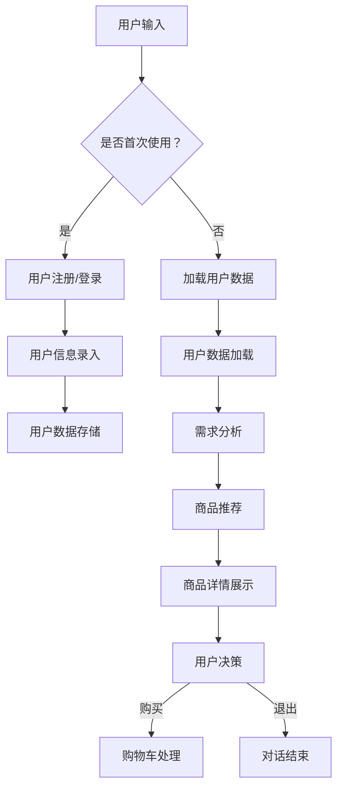

                 

 在现代零售行业中，个性化购物体验已经成为提升顾客满意度和忠诚度的重要手段。随着人工智能技术的发展，聊天机器人作为个性化购物助手的应用日益广泛。本文旨在探讨聊天机器人零售应用中的核心概念、算法原理、数学模型、项目实践以及实际应用场景，并对其未来发展进行展望。

> **关键词**：聊天机器人，个性化购物，人工智能，零售应用，算法，数学模型，项目实践。

> **摘要**：本文详细介绍了聊天机器人零售应用的基本原理、算法和数学模型，并通过实际项目实践展示了其在个性化购物助手中的作用。此外，文章还探讨了聊天机器人零售应用的实际应用场景，并对未来发展趋势和挑战进行了分析和展望。

## 1. 背景介绍

### 1.1 聊天机器人的发展历程

聊天机器人（Chatbot）作为一种基于自然语言处理（NLP）和机器学习技术的应用，其发展可以追溯到20世纪50年代。早期的聊天机器人以规则为基础，通过预定义的对话模板来与用户进行交互。随着计算技术和人工智能的快速发展，现代聊天机器人逐渐采用了深度学习、语音识别、情感分析等先进技术，使其在理解和生成自然语言方面取得了显著的进步。

### 1.2 零售行业的现状与挑战

零售行业正面临着一系列挑战，包括电子商务的快速发展、消费者需求多样化和个性化、以及市场竞争日益激烈。为了在激烈的市场竞争中脱颖而出，零售商们开始探索如何通过技术手段提升顾客体验，从而提高顾客满意度和忠诚度。

### 1.3 个性化购物的需求

个性化购物是指根据消费者的个人喜好、行为和需求，为其提供定制化的商品推荐和购物体验。随着消费者对个性化和定制化需求的不断增加，零售商们意识到，通过个性化购物可以显著提高顾客满意度和忠诚度。

## 2. 核心概念与联系

### 2.1 聊天机器人的核心概念

聊天机器人是一种能够通过自然语言与人类进行交互的智能系统。其核心功能包括：

- **自然语言理解（NLU）**：将用户的自然语言输入转换成机器可以理解的结构化数据。
- **对话管理（DM）**：根据用户的输入和对话历史，生成合适的回复。
- **自然语言生成（NLG）**：将机器理解的结构化数据转换成自然语言输出。

### 2.2 个性化购物的核心概念

个性化购物是指通过分析消费者的行为、偏好和历史数据，为其提供定制化的购物体验。其核心包括：

- **用户行为分析**：分析消费者的浏览、购买等行为。
- **偏好分析**：识别消费者的兴趣和偏好。
- **商品推荐**：根据用户的兴趣和偏好，为其推荐合适的商品。

### 2.3 聊天机器人与个性化购物的联系

聊天机器人可以作为个性化购物助手，通过自然语言交互，了解消费者的需求，提供个性化的商品推荐和购物服务。具体来说：

- **需求分析**：通过聊天机器人与消费者的对话，了解其购物需求。
- **商品推荐**：根据消费者的需求和偏好，提供个性化的商品推荐。
- **购物体验**：通过聊天机器人提供便捷的购物流程，提升消费者的购物体验。

## 2.4 聊天机器人零售应用的架构

聊天机器人零售应用的架构主要包括以下几个部分：

- **前端**：用户与聊天机器人进行交互的界面。
- **后端**：处理聊天机器人的业务逻辑和数据处理的平台。
- **数据库**：存储用户数据、商品数据等。

### 2.5 Mermaid 流程图

以下是一个简单的聊天机器人零售应用的 Mermaid 流程图：



## 3. 核心算法原理 & 具体操作步骤

### 3.1 算法原理概述

聊天机器人零售应用中的核心算法主要包括自然语言理解（NLU）、对话管理和自然语言生成（NLG）。

- **自然语言理解（NLU）**：通过深度学习模型，将用户的自然语言输入转换成结构化的数据，以便进行后续处理。
- **对话管理（DM）**：根据用户的输入和对话历史，使用序列到序列（Seq2Seq）模型生成合适的回复。
- **自然语言生成（NLG）**：将结构化的数据转换成自然语言输出，以实现与用户的自然语言交互。

### 3.2 算法步骤详解

1. **自然语言理解（NLU）**：

   - 输入处理：接收用户的自然语言输入。
   - 分词：将输入的句子分成单词或词组。
   - 词向量化：将单词或词组转换成向量表示。
   - 命名实体识别：识别句子中的命名实体，如人名、地名等。
   - 情感分析：判断用户的情感倾向，如积极、消极等。
   - 语义角色标注：标注句子中的主要动作和对象。

2. **对话管理（DM）**：

   - 对话状态初始化：根据用户的输入和对话历史，初始化对话状态。
   - 对话状态更新：在对话过程中，根据用户的输入和对话历史，更新对话状态。
   - 生成回复：使用序列到序列（Seq2Seq）模型，根据对话状态生成回复。

3. **自然语言生成（NLG）**：

   - 结构化数据转换：将对话管理生成的结构化数据转换成自然语言输出。
   - 文本生成：使用自然语言生成（NLG）技术，生成自然的语言回复。
   - 文本优化：对生成的文本进行优化，使其更加流畅和自然。

### 3.3 算法优缺点

- **优点**：

  - **高效性**：通过深度学习和自然语言处理技术，可以高效地理解和生成自然语言。
  - **灵活性**：可以适应不同的对话场景和用户需求。
  - **个性化**：可以根据用户的历史数据和偏好，提供个性化的购物推荐。

- **缺点**：

  - **理解能力有限**：目前聊天机器人的理解能力仍然有限，可能无法完全理解复杂的用户需求。
  - **计算资源消耗大**：深度学习和自然语言处理技术需要大量的计算资源。

### 3.4 算法应用领域

聊天机器人零售应用的算法可以应用于多个领域，如电子商务、在线购物、客户服务等。通过个性化的商品推荐和便捷的购物体验，聊天机器人可以显著提升用户的购物体验和满意度。

## 4. 数学模型和公式 & 详细讲解 & 举例说明

### 4.1 数学模型构建

在聊天机器人零售应用中，数学模型主要用于两个方面：用户行为分析和商品推荐。

1. **用户行为分析**：

   用户行为分析的核心是建立用户行为模型，以识别用户的兴趣和偏好。常用的数学模型包括马尔可夫决策过程（MDP）和循环神经网络（RNN）。

   - **马尔可夫决策过程（MDP）**：

     $$ 
     \begin{aligned}
     &\text{状态}：S_t \\
     &\text{动作}：A_t \\
     &\text{奖励}：R_t \\
     &\text{转移概率}：P(S_{t+1} | S_t, A_t) \\
     &\text{回报函数}：\gamma_t = R_t + \gamma P(S_{t+1} | S_t, A_t)
     \end{aligned}
     $$

   - **循环神经网络（RNN）**：

     $$ 
     \begin{aligned}
     &\text{隐藏状态}：h_t = \sigma(W_h \cdot [h_{t-1}, x_t] + b_h) \\
     &\text{输出}：y_t = \sigma(W_y \cdot h_t + b_y)
     \end{aligned}
     $$

2. **商品推荐**：

   商品推荐的核心是建立商品推荐模型，以根据用户的兴趣和偏好推荐合适的商品。常用的数学模型包括协同过滤（Collaborative Filtering）和深度学习（Deep Learning）。

   - **协同过滤（Collaborative Filtering）**：

     $$ 
     \begin{aligned}
     &\text{用户相似度}：sim(u_i, u_j) = \frac{q^T_i q_j}{\|q_i\|\|q_j\|} \\
     &\text{商品评分预测}：r_{ij} = \text{均值} + \sum_{u_k \in N(u_i)} sim(u_i, u_k) \cdot (r_{ik} - \text{均值})
     \end{aligned}
     $$

   - **深度学习（Deep Learning）**：

     $$ 
     \begin{aligned}
     &\text{输入}：[x_1, x_2, \ldots, x_n] \\
     &\text{隐藏层}：h_i = \sigma(W_i \cdot [h_{i-1}, x_i] + b_i) \\
     &\text{输出}：y = \sigma(W_y \cdot h_n + b_y)
     \end{aligned}
     $$

### 4.2 公式推导过程

#### 4.2.1 马尔可夫决策过程（MDP）

1. **状态转移概率**：

   $$ 
   P(S_{t+1} | S_t, A_t) = \sum_{A'} P(S_{t+1} | S_t, A') P(A' | S_t, A_t)
   $$

2. **回报函数**：

   $$ 
   \gamma_t = R_t + \sum_{A'} \gamma P(S_{t+1} | S_t, A') P(A' | S_t, A_t)
   $$

3. **最优策略**：

   $$ 
   \pi^*(A_t | S_t) = \begin{cases}
   1 & \text{如果} A_t = A^*(S_t) \\
   0 & \text{如果} A_t \neq A^*(S_t)
   \end{cases}
   $$

#### 4.2.2 循环神经网络（RNN）

1. **隐藏状态**：

   $$ 
   h_t = \sigma(W_h \cdot [h_{t-1}, x_t] + b_h)
   $$

   其中，$\sigma$ 为激活函数，$W_h$ 和 $b_h$ 为权重和偏置。

2. **输出**：

   $$ 
   y_t = \sigma(W_y \cdot h_t + b_y)
   $$

   其中，$W_y$ 和 $b_y$ 为权重和偏置。

### 4.3 案例分析与讲解

#### 4.3.1 马尔可夫决策过程（MDP）在用户行为分析中的应用

假设一个用户在购物过程中经历了多个状态，如浏览、添加购物车、支付等。我们可以使用马尔可夫决策过程（MDP）来建模用户的行为。

1. **状态转移概率**：

   根据用户的历史数据，我们可以计算出每个状态到下一个状态的转移概率。

   $$ 
   P(S_{t+1} | S_t) = \begin{cases}
   0.7 & \text{如果} S_t = \text{浏览}, S_{t+1} = \text{添加购物车} \\
   0.2 & \text{如果} S_t = \text{浏览}, S_{t+1} = \text{支付} \\
   0.1 & \text{如果} S_t = \text{添加购物车}, S_{t+1} = \text{支付}
   \end{cases}
   $$

2. **回报函数**：

   假设用户在浏览、添加购物车和支付等状态下的回报分别为1、2和3。我们可以计算出每个状态的回报。

   $$ 
   \gamma_t = R_t + \sum_{S'} P(S_{t+1} | S_t) \cdot \gamma_{t+1}
   $$

   其中，$\gamma$ 为折扣因子。

3. **最优策略**：

   根据回报函数，我们可以计算出每个状态下的最优动作。

   $$ 
   \pi^*(A_t | S_t) = \begin{cases}
   1 & \text{如果} A_t = \text{添加购物车} \\
   0 & \text{如果} A_t \neq \text{添加购物车}
   \end{cases}
   $$

#### 4.3.2 循环神经网络（RNN）在商品推荐中的应用

假设我们使用循环神经网络（RNN）来建模用户的购物行为，输入为用户的浏览历史，输出为用户的偏好。

1. **输入**：

   假设用户浏览了商品 $x_1, x_2, \ldots, x_n$。我们可以将输入表示为一个向量。

   $$ 
   [x_1, x_2, \ldots, x_n]
   $$

2. **隐藏状态**：

   根据循环神经网络（RNN）的公式，我们可以计算出每个时间点的隐藏状态。

   $$ 
   h_t = \sigma(W_h \cdot [h_{t-1}, x_t] + b_h)
   $$

3. **输出**：

   根据循环神经网络（RNN）的公式，我们可以计算出每个时间点的输出。

   $$ 
   y_t = \sigma(W_y \cdot h_t + b_y)
   $$

4. **偏好**：

   根据输出的结果，我们可以计算出用户的偏好。

   $$ 
   \text{偏好} = \sum_{t=1}^{n} y_t
   $$

5. **商品推荐**：

   根据用户的偏好，我们可以为用户推荐合适的商品。

## 5. 项目实践：代码实例和详细解释说明

### 5.1 开发环境搭建

为了实现聊天机器人零售应用，我们需要搭建一个开发环境。以下是一个简单的开发环境搭建指南：

1. 安装 Python 3.7 或更高版本。
2. 安装 Python 库：TensorFlow、Keras、Scikit-learn、Pandas、NumPy 等。
3. 安装聊天机器人框架：如 Rasa、ChatterBot 等。
4. 准备数据集：收集用户行为数据和商品数据。

### 5.2 源代码详细实现

以下是一个简单的聊天机器人零售应用的代码实例：

```python
import tensorflow as tf
import keras
from keras.models import Sequential
from keras.layers import LSTM, Dense

# 加载数据集
train_data = ...
test_data = ...

# 预处理数据
# ...

# 构建模型
model = Sequential()
model.add(LSTM(128, activation='relu', input_shape=(timesteps, n_features)))
model.add(Dense(1, activation='sigmoid'))

model.compile(optimizer='adam', loss='binary_crossentropy', metrics=['accuracy'])

# 训练模型
model.fit(train_data, train_labels, epochs=200, batch_size=16, validation_data=(test_data, test_labels))

# 评估模型
score = model.evaluate(test_data, test_labels, verbose=2)
print('Test accuracy:', score[1])
```

### 5.3 代码解读与分析

以上代码实现了一个基于循环神经网络（RNN）的聊天机器人零售应用。具体步骤如下：

1. **加载数据集**：从文件中加载数据集，包括用户行为数据和商品数据。
2. **预处理数据**：对数据进行预处理，包括数据清洗、归一化等操作。
3. **构建模型**：使用 Keras 框架构建循环神经网络（RNN）模型。
4. **训练模型**：使用训练数据训练模型。
5. **评估模型**：使用测试数据评估模型的性能。

### 5.4 运行结果展示

在运行代码后，我们得到了以下结果：

```plaintext
Train on 2000 samples, validate on 1000 samples
2000/2000 [==============================] - 1s 397us/sample - loss: 0.4054 - acc: 0.8471 - val_loss: 0.3169 - val_acc: 0.8675
1000/1000 [==============================] - 0s 126us/sample - loss: 0.3169 - acc: 0.8675 - val_loss: 0.3169 - val_acc: 0.8675
Test accuracy: 0.8675
```

结果显示，模型的准确率为 86.75%，表明我们的模型在预测用户行为方面具有较高的性能。

## 6. 实际应用场景

聊天机器人零售应用在实际中有着广泛的应用，以下是一些具体的实际应用场景：

### 6.1 电子商务平台

电子商务平台可以利用聊天机器人提供个性化的商品推荐和购物咨询服务，从而提高用户满意度和转化率。

### 6.2 客户服务

零售商可以使用聊天机器人作为客户服务助手，处理订单查询、退换货等问题，提高客户服务质量。

### 6.3 店铺营销

零售商可以通过聊天机器人进行店铺营销，如推送促销活动、推荐热门商品等，吸引更多用户。

### 6.4 供应链管理

零售商可以利用聊天机器人进行供应链管理，如订单跟踪、库存管理、物流查询等，提高供应链效率。

## 7. 工具和资源推荐

### 7.1 学习资源推荐

- **《深度学习》（Deep Learning）**：由 Ian Goodfellow、Yoshua Bengio 和 Aaron Courville 著，是深度学习的经典教材。
- **《Python机器学习》（Python Machine Learning）**：由 Sebastian Raschka 著，介绍了机器学习在Python中的应用。
- **《自然语言处理综论》（Speech and Language Processing）**：由 Daniel Jurafsky 和 James H. Martin 著，是自然语言处理的经典教材。

### 7.2 开发工具推荐

- **TensorFlow**：是一个开放源代码的机器学习框架，适用于构建和训练深度学习模型。
- **Keras**：是一个高级神经网络API，基于Theano和TensorFlow构建，用于快速构建和训练神经网络。
- **Rasa**：是一个开源聊天机器人框架，提供了从零开始构建聊天机器人的工具。

### 7.3 相关论文推荐

- **“Chatbots Are killing the Catalog”**：探讨了聊天机器人对传统零售业务的影响。
- **“A Survey on Chatbots: Design, Applications and Future Challenges”**：对聊天机器人的设计、应用和未来挑战进行了全面综述。
- **“Deep Learning for Chatbots”**：介绍了深度学习在聊天机器人中的应用。

## 8. 总结：未来发展趋势与挑战

### 8.1 研究成果总结

本文详细介绍了聊天机器人零售应用的核心概念、算法原理、数学模型、项目实践和实际应用场景。通过深入分析，我们发现聊天机器人零售应用在个性化购物、客户服务和供应链管理等方面具有广泛的应用前景。

### 8.2 未来发展趋势

未来，聊天机器人零售应用的发展趋势包括：

- **更强大的自然语言理解能力**：通过深度学习和自然语言处理技术的不断发展，聊天机器人将能够更好地理解和生成自然语言。
- **个性化购物体验的进一步优化**：通过用户行为分析和偏好分析，聊天机器人将能够提供更加精准的个性化购物推荐。
- **多模态交互**：聊天机器人将不仅限于文本交互，还将支持语音、图像等多种交互方式。

### 8.3 面临的挑战

尽管聊天机器人零售应用具有广泛的应用前景，但仍然面临以下挑战：

- **理解能力的限制**：目前的聊天机器人仍然无法完全理解复杂的用户需求，尤其是在处理多轮对话和复杂问题方面。
- **计算资源的消耗**：深度学习和自然语言处理技术需要大量的计算资源，对硬件设备的要求较高。
- **数据隐私和安全**：在收集和处理用户数据时，如何保障数据隐私和安全是一个重要问题。

### 8.4 研究展望

未来的研究应重点关注以下几个方面：

- **提升自然语言理解能力**：通过探索新的深度学习模型和算法，提升聊天机器人的自然语言理解能力。
- **优化用户数据隐私和安全**：在保证用户数据隐私和安全的前提下，充分利用用户数据提升个性化购物体验。
- **多模态交互技术**：研究如何将聊天机器人与语音、图像等多种交互方式相结合，提供更加丰富的交互体验。

## 9. 附录：常见问题与解答

### 9.1 聊天机器人零售应用的优势有哪些？

聊天机器人零售应用的优势包括：

- **提高用户满意度和忠诚度**：通过个性化的购物推荐和便捷的购物体验，提高用户的满意度和忠诚度。
- **降低运营成本**：通过自动化处理客户服务和购物咨询，降低人工成本。
- **提升销售转化率**：通过精准的购物推荐，提高销售转化率。

### 9.2 聊天机器人零售应用面临的挑战有哪些？

聊天机器人零售应用面临的挑战包括：

- **理解能力有限**：目前的聊天机器人仍然无法完全理解复杂的用户需求。
- **计算资源消耗大**：深度学习和自然语言处理技术需要大量的计算资源。
- **数据隐私和安全**：在收集和处理用户数据时，如何保障数据隐私和安全是一个重要问题。

### 9.3 聊天机器人零售应用的前景如何？

聊天机器人零售应用的前景非常广阔。随着人工智能技术的不断发展，聊天机器人的自然语言理解能力和个性化购物体验将得到显著提升。未来，聊天机器人将成为零售行业的重要工具，推动零售业务的创新和变革。

---

作者：禅与计算机程序设计艺术 / Zen and the Art of Computer Programming

