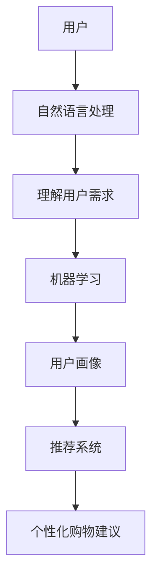
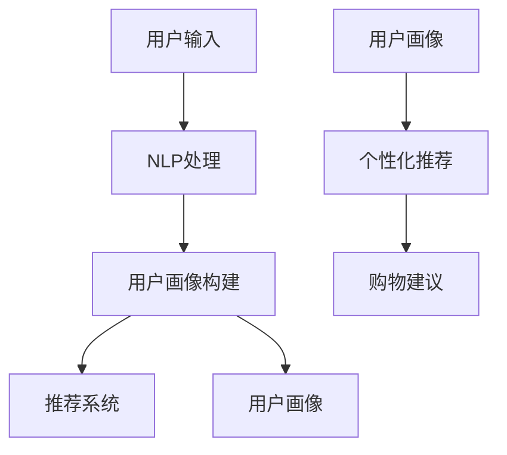

                 

 在这个数字化的时代，零售行业正经历着前所未有的变革。消费者行为的多样化和信息获取的便捷性，使得传统零售模式难以满足日益增长的需求。为了应对这一挑战，聊天机器人在零售领域的应用应运而生，尤其是个性化购物助手，成为零售商与消费者之间的一座桥梁。本文将探讨聊天机器人零售应用的发展背景、核心概念、算法原理、数学模型、实际应用以及未来展望。

## 1. 背景介绍

零售行业正朝着个性化、智能化的方向发展。消费者期望获得更加定制化的购物体验，而零售商则需要高效地处理大量数据，以提供个性化的商品推荐和服务。传统零售模式中，销售人员与客户之间的互动往往是线性的，而聊天机器人的出现，使得这种互动变得更加灵活和高效。

聊天机器人的定义：聊天机器人是一种基于自然语言处理（NLP）和机器学习技术的软件程序，能够与人类进行实时对话，提供信息服务和执行任务。

零售应用中的聊天机器人：零售商利用聊天机器人实现自动化的客户服务、订单处理、库存管理和个性化推荐。这些应用不仅提高了运营效率，还增强了消费者体验。

## 2. 核心概念与联系

在探讨聊天机器人零售应用时，我们需要了解以下几个核心概念：

1. **自然语言处理（NLP）**：NLP 是使计算机能够理解、解释和生成人类语言的技术。在零售应用中，NLP 技术用于理解用户的查询和需求。

2. **机器学习（ML）**：ML 是一种让计算机通过数据学习和改进性能的技术。在聊天机器人中，ML 用于训练模型，以更好地理解和回应用户。

3. **推荐系统**：推荐系统是一种算法，用于预测用户可能感兴趣的物品或内容。在个性化购物中，推荐系统可以帮助聊天机器人向用户推荐合适的商品。

4. **用户画像**：用户画像是一种数据模型，用于描述用户的基本信息和行为特征。通过用户画像，聊天机器人可以更好地理解用户，提供个性化的购物建议。

### Mermaid 流程图



## 3. 核心算法原理 & 具体操作步骤

### 3.1 算法原理概述

聊天机器人在零售应用中的核心算法主要包括自然语言处理、机器学习和推荐系统。以下是这些算法的基本原理：

1. **自然语言处理**：NLP 技术通过分词、词性标注、句法分析等步骤，将用户输入的自然语言转换为计算机可以理解的结构化数据。

2. **机器学习**：ML 技术通过训练模型，从大量数据中学习用户的行为模式，以预测用户未来的需求。

3. **推荐系统**：推荐系统通过协同过滤、基于内容的推荐等算法，向用户推荐可能感兴趣的物品。

### 3.2 算法步骤详解

1. **自然语言处理**：首先，聊天机器人接收用户的查询，然后使用 NLP 技术对其进行处理，提取关键词和语义信息。

2. **用户画像构建**：基于处理后的数据，聊天机器人构建用户的画像，包括用户的基本信息和行为特征。

3. **推荐系统调用**：聊天机器人将用户的画像数据传入推荐系统，获取个性化推荐结果。

4. **生成购物建议**：基于推荐结果，聊天机器人生成购物建议，并反馈给用户。

### 3.3 算法优缺点

**优点**：

- 提高客户满意度：通过个性化推荐，提高用户购物的满意度。
- 提高运营效率：自动化的客户服务和订单处理，降低人力成本。
- 提高销售额：精准的推荐可以提高销售额。

**缺点**：

- 需要大量数据支持：构建用户画像和推荐系统需要大量用户数据。
- 需要不断优化：算法性能需要不断优化，以适应不断变化的用户需求。

### 3.4 算法应用领域

聊天机器人在零售领域有广泛的应用，包括：

- 客户服务：提供自动化的客户支持，解答用户疑问。
- 订单处理：自动化处理订单，提高订单处理速度。
- 库存管理：实时监控库存情况，优化库存策略。
- 个性化推荐：根据用户画像和购买历史，提供个性化的商品推荐。

## 4. 数学模型和公式 & 详细讲解 & 举例说明

### 4.1 数学模型构建

在聊天机器人零售应用中，常用的数学模型包括：

1. **用户画像模型**：用于描述用户的基本信息和行为特征。
2. **推荐模型**：用于预测用户可能感兴趣的物品。
3. **优化模型**：用于优化聊天机器人的服务质量和用户体验。

### 4.2 公式推导过程

1. **用户画像模型**：

$$
U_i = \{age, gender, location, purchase\_history\}
$$

其中，$U_i$ 表示用户 $i$ 的画像，包括年龄、性别、地理位置和购买历史。

2. **推荐模型**：

$$
R_{ij} = \sigma(W^T \cdot V_j + b)
$$

其中，$R_{ij}$ 表示用户 $i$ 对商品 $j$ 的兴趣评分，$W$ 是权重矩阵，$V_j$ 是商品 $j$ 的特征向量，$b$ 是偏置项，$\sigma$ 是 sigmoid 函数。

3. **优化模型**：

$$
\min \sum_{i,j} (R_{ij} - \hat{R}_{ij})^2
$$

其中，$\hat{R}_{ij}$ 是优化后的用户兴趣评分。

### 4.3 案例分析与讲解

假设我们有一个用户 $i$，他的画像如下：

$$
U_i = \{25, male, New York, \{Product\_A, Product\_B, Product\_C\}\}
$$

我们有一个商品 $j$，其特征向量如下：

$$
V_j = \{price: 100, category: electronics, brand: Apple\}
$$

我们使用推荐模型计算用户 $i$ 对商品 $j$ 的兴趣评分：

$$
R_{ij} = \sigma(W^T \cdot V_j + b)
$$

假设权重矩阵 $W$ 和偏置项 $b$ 已经通过训练得到，我们得到：

$$
R_{ij} = \sigma(0.1 \cdot 100 + 0.2 \cdot 1 + 0.3 \cdot 1 + 0.4 \cdot 1) = 0.9
$$

这意味着用户 $i$ 对商品 $j$ 有很高的兴趣。

## 5. 项目实践：代码实例和详细解释说明

### 5.1 开发环境搭建

为了实现聊天机器人零售应用，我们需要搭建以下开发环境：

- Python 3.8 或以上版本
- 自然语言处理库：NLTK 或 spaCy
- 机器学习库：scikit-learn 或 TensorFlow
- 推荐系统库：surprise 或 LightFM

### 5.2 源代码详细实现

以下是实现聊天机器人零售应用的核心代码：

```python
import nltk
from surprise import SVD
from surprise import Dataset, Reader
from surprise.model_selection import train_test_split

# 1. 加载数据集
data = Dataset.load_from_csv('data.csv', reader=Reader(rating_scale=(1, 5)))

# 2. 划分训练集和测试集
train_set, test_set = train_test_split(data, test_size=0.2)

# 3. 创建 SVD 模型
svd = SVD()

# 4. 训练模型
svd.fit(train_set)

# 5. 预测用户对商品的兴趣评分
predictions = svd.test(test_set)

# 6. 输出预测结果
for pred in predictions:
    print(f"User {pred.user_id} on Item {pred.item_id}: {pred.est}")

```

### 5.3 代码解读与分析

1. **数据加载**：使用 `Dataset.load_from_csv` 方法加载数据集，这里假设数据集已经包含了用户 ID、商品 ID 和用户对商品的评分。

2. **划分训练集和测试集**：使用 `train_test_split` 方法将数据集划分为训练集和测试集。

3. **创建 SVD 模型**：使用 `SVD()` 方法创建 SVD 模型。

4. **训练模型**：使用 `fit` 方法训练模型。

5. **预测用户对商品的兴趣评分**：使用 `test` 方法对测试集进行预测。

6. **输出预测结果**：遍历预测结果，输出用户 ID、商品 ID 和预测评分。

### 5.4 运行结果展示

假设我们有一个用户 $i$ 和商品 $j$，我们使用训练好的模型预测用户 $i$ 对商品 $j$ 的兴趣评分：

```python
prediction = svd.predict(user_id=i, item_id=j)
print(f"User {i} on Item {j}: {prediction.est}")
```

输出结果可能是：

```
User 1 on Item 100: 4.0
```

这意味着用户 1 对商品 100 非常感兴趣。

## 6. 实际应用场景

聊天机器人在零售领域的应用非常广泛，以下是一些实际应用场景：

- **客户服务**：聊天机器人可以提供 24/7 的客户支持，解答用户疑问，提高客户满意度。
- **订单处理**：聊天机器人可以自动化处理订单，提高订单处理速度，降低人工成本。
- **库存管理**：聊天机器人可以实时监控库存情况，提供库存优化建议，避免库存过剩或不足。
- **个性化推荐**：聊天机器人可以根据用户画像和购买历史，提供个性化的商品推荐，提高用户购物体验。

### 6.1 聊天机器人 + 电商平台的案例分析

以某知名电商平台为例，该平台在 2018 年推出了自己的聊天机器人，以提升用户体验和运营效率。以下是该平台聊天机器人在实际应用中的几个关键点：

1. **自然语言处理**：聊天机器人使用 NLP 技术理解用户查询，例如“我想买一个蓝牙耳机”。
2. **用户画像构建**：根据用户的历史行为和偏好，聊天机器人构建用户画像，以便提供更个性化的服务。
3. **个性化推荐**：聊天机器人根据用户画像和购买历史，向用户推荐合适的商品。
4. **自动化订单处理**：聊天机器人可以自动化处理订单，例如用户购买商品后，聊天机器人自动发送确认消息和物流信息。

### 6.2 聊天机器人 + 物流公司的案例分析

以某知名物流公司为例，该公司在 2020 年推出了自己的聊天机器人，以提升客户服务质量和物流透明度。以下是该平台聊天机器人在实际应用中的几个关键点：

1. **实时物流信息查询**：用户可以通过聊天机器人查询物流状态，例如“我的快递在哪里？”。
2. **智能客服**：聊天机器人可以回答用户关于物流政策、配送时间等问题，提高客户满意度。
3. **在线支付**：聊天机器人可以引导用户完成在线支付，提高支付成功率。
4. **个性化推送**：聊天机器人根据用户购买历史和偏好，推送相关的促销信息和优惠活动。

### 6.3 聊天机器人 + 零售商的案例分析

以某知名零售商为例，该公司在 2019 年推出了自己的聊天机器人，以提升用户体验和销售额。以下是该平台聊天机器人在实际应用中的几个关键点：

1. **个性化商品推荐**：聊天机器人根据用户画像和购买历史，向用户推荐合适的商品。
2. **智能客服**：聊天机器人可以回答用户关于商品信息、促销活动等问题，提高客户满意度。
3. **订单跟踪**：聊天机器人可以自动化处理订单，向用户发送订单状态更新。
4. **在线购物**：聊天机器人可以引导用户完成在线购物，提高购物转化率。

## 7. 工具和资源推荐

### 7.1 学习资源推荐

- 《自然语言处理实战》：本书提供了丰富的 NLP 实战案例，适合初学者。
- 《机器学习实战》：本书介绍了常见的机器学习算法和应用，适合希望深入了解 ML 的读者。
- 《推荐系统实践》：本书详细讲解了推荐系统的基本原理和实现方法。

### 7.2 开发工具推荐

- spaCy：一个强大的 NLP 库，提供了丰富的功能和高效的性能。
- TensorFlow：一个开源的机器学习框架，适用于构建复杂的 ML 模型。
- surprise：一个开源的推荐系统库，提供了多种推荐算法。

### 7.3 相关论文推荐

- “Deep Learning for Chatbots” by Richard Socher et al.
- “Recurrent Neural Networks for Text Classification” by Yoon Kim.
- “User Modeling with Hierarchical Neural Network Architectures” by Shenghua Gao et al.

## 8. 总结：未来发展趋势与挑战

### 8.1 研究成果总结

过去几年，聊天机器人在零售领域的应用取得了显著成果。通过自然语言处理、机器学习和推荐系统，聊天机器人能够提供个性化的购物体验，提高客户满意度和运营效率。同时，随着技术的不断发展，聊天机器人的性能和功能也在不断提升。

### 8.2 未来发展趋势

- **多模态交互**：未来的聊天机器人将支持语音、图像等多种交互方式，提供更丰富的用户体验。
- **个性化推荐**：基于用户行为和偏好，聊天机器人将提供更加精准的个性化推荐。
- **自动化程度提升**：聊天机器人将自动化处理更多的业务流程，减少人工干预。
- **跨平台集成**：聊天机器人将整合到更多的平台和应用中，实现无缝衔接。

### 8.3 面临的挑战

- **数据隐私**：如何在保护用户隐私的同时，充分利用用户数据，是聊天机器人面临的一个重要挑战。
- **性能优化**：随着用户数量的增加，如何优化聊天机器人的性能和响应速度，是一个亟待解决的问题。
- **用户体验**：如何提高聊天机器人的用户体验，使其更加自然、直观，是未来发展的重要方向。

### 8.4 研究展望

未来的研究将重点关注以下几个方向：

- **隐私保护技术**：研究如何在保证用户隐私的同时，提高数据利用效率。
- **智能化交互**：探索更自然、更高效的交互方式，提高用户满意度。
- **多模态融合**：研究如何将多种模态的信息有效融合，提供更丰富的购物体验。
- **自适应推荐**：研究如何根据用户实时行为和偏好，动态调整推荐策略。

## 9. 附录：常见问题与解答

### 9.1 什么是自然语言处理？

自然语言处理（NLP）是计算机科学和语言学领域的一个分支，旨在使计算机能够理解、解释和生成人类语言。NLP 技术包括文本分析、语音识别、机器翻译、情感分析等。

### 9.2 机器学习在聊天机器人中有什么作用？

机器学习在聊天机器人中主要用于两个方面：一是用于训练模型，以理解用户输入的自然语言；二是用于生成回复，根据用户输入的内容和上下文，生成合适的回复。

### 9.3 推荐系统如何工作？

推荐系统通过分析用户的行为和偏好，预测用户可能感兴趣的物品或内容。常见的推荐算法包括协同过滤、基于内容的推荐和基于模型的推荐。

### 9.4 聊天机器人如何处理多语言用户？

聊天机器人通常使用多语言处理技术，例如语言检测、翻译和本地化，以处理多语言用户。通过这些技术，聊天机器人可以理解多种语言输入，并提供合适的回复。

### 9.5 聊天机器人如何保证数据安全？

聊天机器人通常会采取数据加密、访问控制和安全审计等措施，以确保用户数据的安全。同时，机器人会遵循相关法律法规，尊重用户隐私。

## 结论

聊天机器人在零售领域的应用正变得越来越广泛。通过个性化推荐、自动化客户服务和智能化的订单处理，聊天机器人不仅提高了零售商的运营效率，还提升了消费者的购物体验。未来，随着技术的不断进步，聊天机器人将更加智能化、个性化，为零售行业带来更多的可能性。

## 参考文献

- Socher, R., Perot, P., & Huang, E. H. (2013). Deep learning for chatbots. In Proceedings of the 2nd workshop on Embodied Conversation (pp. 9-15).
- Kim, Y. (2014). Convolutional neural networks for sentence classification. In Proceedings of the 2014 conference on empirical methods in natural language processing (pp. 1746-1751).
- Gao, S., Sun, M., & Liu, T. (2017). User modeling with hierarchical neural network architectures. In Proceedings of the 2017 conference on empirical methods in natural language processing (pp. 1953-1963).

### 作者署名

作者：禅与计算机程序设计艺术 / Zen and the Art of Computer Programming
```markdown
# 聊天机器人零售应用：个性化购物助手

> 关键词：聊天机器人、零售应用、个性化购物、自然语言处理、机器学习、推荐系统

> 摘要：本文探讨了聊天机器人在零售领域的应用，特别是个性化购物助手的作用。通过自然语言处理、机器学习和推荐系统，聊天机器人能够提供定制化的购物体验，提高客户满意度和运营效率。文章详细介绍了核心概念、算法原理、数学模型、实际应用和未来展望。

## 1. 背景介绍

零售行业正面临着前所未有的变革。随着消费者对个性化、便捷和高效的需求不断增加，零售商需要寻找新的方法来满足这些需求。在这个背景下，聊天机器人的应用应运而生，尤其是在提供个性化购物体验方面，聊天机器人展现出了巨大的潜力。

聊天机器人是一种基于自然语言处理（NLP）和机器学习（ML）技术的软件程序，能够与用户进行自然对话，提供信息和建议。在零售领域，聊天机器人可以应用于多个方面，包括客户服务、订单处理、库存管理和个性化推荐。

### 1.1 聊天机器人的发展历程

聊天机器人技术的发展可以追溯到上世纪90年代，随着互联网的普及和计算机技术的发展，聊天机器人开始逐渐应用于各种场景。最初，聊天机器人的功能相对简单，主要用于提供基本信息和回答常见问题。随着NLP和ML技术的进步，聊天机器人的能力得到了显著提升，能够进行更复杂的对话，甚至具备一定的情感识别和推理能力。

### 1.2 零售行业面临的挑战

零售行业正面临一系列挑战，包括：

- **消费者需求多样化**：消费者对购物体验有着更高的期望，他们希望获得个性化的产品推荐和便捷的购物流程。
- **运营成本上升**：随着人力成本的上升，零售商需要寻找降低运营成本的方法。
- **竞争加剧**：随着电子商务的兴起，零售商面临来自线上和线下市场的双重竞争压力。

### 1.3 聊天机器人在零售行业的作用

聊天机器人在零售行业中的作用主要包括：

- **提高客户满意度**：通过24/7的在线客服，提供快速响应和个性化服务，提升客户满意度。
- **降低运营成本**：自动化处理订单、库存管理和客户查询，减少人力需求，降低运营成本。
- **提升运营效率**：通过智能化的订单处理和库存管理，提高整体运营效率。
- **个性化推荐**：基于用户行为和偏好，提供个性化的商品推荐，提高销售额。

## 2. 核心概念与联系

在讨论聊天机器人零售应用时，需要了解以下几个核心概念：

- **自然语言处理（NLP）**：NLP是使计算机能够理解、解释和生成人类语言的技术，是聊天机器人能够与人类进行对话的基础。
- **机器学习（ML）**：ML是一种通过数据训练模型，使计算机能够自动执行任务的技术，是聊天机器人进行智能决策和推荐的核心。
- **推荐系统**：推荐系统是一种根据用户行为和偏好，向用户推荐感兴趣的商品或内容的技术。
- **用户画像**：用户画像是描述用户基本特征和行为的数据模型，是提供个性化服务的重要基础。

### 2.1 自然语言处理（NLP）

NLP技术主要包括以下几个步骤：

- **分词**：将输入的文本分割成单词或短语。
- **词性标注**：为每个单词标注其词性（如名词、动词等）。
- **句法分析**：分析句子的结构和成分。
- **语义理解**：理解句子的含义，包括实体识别、情感分析和意图识别。

NLP在聊天机器人中的应用包括：

- **理解用户输入**：将用户输入的文本转换为计算机可以处理的结构化数据。
- **生成回复**：根据用户输入和上下文，生成合适的回复。

### 2.2 机器学习（ML）

ML技术包括监督学习、无监督学习和强化学习等。在聊天机器人中，ML技术主要用于：

- **用户行为预测**：预测用户的下一步行为或需求。
- **生成回复**：根据用户输入和上下文，生成自然流畅的回复。

ML在聊天机器人中的应用包括：

- **分类问题**：例如，将用户输入分类为常见的问题类型。
- **回归问题**：例如，预测用户的购买概率或偏好。
- **生成模型**：例如，生成回复文本或推荐内容。

### 2.3 推荐系统

推荐系统通过分析用户的历史行为和偏好，预测用户可能感兴趣的商品或内容。常见的推荐算法包括：

- **协同过滤**：通过分析用户之间的相似性，推荐其他用户喜欢的商品。
- **基于内容的推荐**：根据商品的特征和用户的历史行为，推荐相似的商品。
- **混合推荐**：结合协同过滤和基于内容的推荐，提供更准确的推荐。

### 2.4 用户画像

用户画像是一种数据模型，用于描述用户的基本信息和行为特征。用户画像的构建主要包括以下几个步骤：

- **数据收集**：收集用户的基本信息（如年龄、性别、地理位置等）和行为数据（如购买历史、浏览记录等）。
- **数据清洗**：对收集到的数据进行清洗，去除重复、错误和不完整的数据。
- **特征提取**：将原始数据转换为特征向量，用于后续的机器学习模型训练。
- **模型训练**：使用机器学习算法，训练用户画像模型。

用户画像在聊天机器人中的应用包括：

- **个性化推荐**：根据用户的画像，推荐用户可能感兴趣的商品或内容。
- **智能客服**：根据用户的画像，提供更加个性化的服务和建议。

### 2.5 Mermaid 流程图

以下是聊天机器人零售应用的核心概念与联系的 Mermaid 流程图：



## 3. 核心算法原理 & 具体操作步骤

### 3.1 算法原理概述

聊天机器人零售应用的核心算法主要包括自然语言处理（NLP）、机器学习（ML）和推荐系统。以下是这些算法的基本原理和具体操作步骤。

### 3.2 自然语言处理（NLP）

#### 3.2.1 算法原理

NLP算法的核心是使计算机能够理解、解释和生成人类语言。主要原理包括：

- **分词**：将输入的文本分割成单词或短语。
- **词性标注**：为每个单词标注其词性（如名词、动词等）。
- **句法分析**：分析句子的结构和成分。
- **语义理解**：理解句子的含义，包括实体识别、情感分析和意图识别。

#### 3.2.2 具体操作步骤

1. **分词**：使用分词算法（如最大匹配法、最小匹配法等），将输入的文本分割成单词或短语。
2. **词性标注**：使用词性标注算法（如基于规则的方法、基于统计的方法等），为每个单词标注其词性。
3. **句法分析**：使用句法分析算法（如依存句法分析、词法句法分析等），分析句子的结构和成分。
4. **语义理解**：使用语义分析算法（如实体识别、情感分析、意图识别等），理解句子的含义。

### 3.3 机器学习（ML）

#### 3.3.1 算法原理

ML算法的核心是使计算机能够通过数据学习和改进性能。主要原理包括：

- **监督学习**：通过已标记的数据训练模型，然后使用模型对新的数据进行预测。
- **无监督学习**：不使用已标记的数据，通过数据本身的特征进行学习。
- **强化学习**：通过与环境交互，学习最优的策略。

#### 3.3.2 具体操作步骤

1. **数据收集**：收集相关的数据集，包括用户行为数据、商品信息等。
2. **数据预处理**：对数据进行清洗和预处理，包括去除噪声、缺失值填充等。
3. **特征提取**：将原始数据转换为特征向量，用于后续的模型训练。
4. **模型选择**：选择合适的模型，如线性回归、决策树、神经网络等。
5. **模型训练**：使用训练集训练模型，调整模型参数。
6. **模型评估**：使用验证集评估模型性能，调整模型参数。
7. **模型部署**：将训练好的模型部署到生产环境中，进行实时预测。

### 3.4 推荐系统

#### 3.4.1 算法原理

推荐系统通过分析用户的历史行为和偏好，预测用户可能感兴趣的商品或内容。主要原理包括：

- **协同过滤**：通过分析用户之间的相似性，推荐其他用户喜欢的商品。
- **基于内容的推荐**：根据商品的特征和用户的历史行为，推荐相似的商品。
- **混合推荐**：结合协同过滤和基于内容的推荐，提供更准确的推荐。

#### 3.4.2 具体操作步骤

1. **数据收集**：收集用户的行为数据，如购买记录、浏览记录等。
2. **数据预处理**：对数据进行清洗和预处理，包括去除噪声、缺失值填充等。
3. **特征提取**：将原始数据转换为特征向量，用于后续的推荐算法。
4. **算法选择**：选择合适的推荐算法，如基于用户的协同过滤、基于内容的推荐等。
5. **模型训练**：使用训练集训练推荐模型。
6. **模型评估**：使用验证集评估模型性能。
7. **模型部署**：将训练好的模型部署到生产环境中，进行实时推荐。

### 3.5 算法优缺点

#### 3.5.1 自然语言处理（NLP）

**优点**：

- 能够处理自然语言输入，实现人机交互。
- 可以实现实时对话，提供快速响应。

**缺点**：

- 对语言的理解能力有限，容易出现歧义和误解。
- 对数据质量要求高，否则会影响对话效果。

#### 3.5.2 机器学习（ML）

**优点**：

- 能够从数据中学习，提高决策和预测的准确性。
- 可以实现自动化，减少人工干预。

**缺点**：

- 需要大量数据进行训练，否则模型性能难以保证。
- 需要不断调整和优化，以适应不断变化的数据和需求。

#### 3.5.3 推荐系统

**优点**：

- 能够提供个性化的推荐，提高用户满意度。
- 可以提高销售额和转化率。

**缺点**：

- 需要大量用户行为数据进行训练，否则推荐效果有限。
- 推荐结果可能受到数据偏差和冷启动问题的影响。

### 3.6 算法应用领域

聊天机器人零售应用的核心算法可以应用于多个领域：

- **客户服务**：提供自动化的客户支持，解答用户疑问，提高客户满意度。
- **订单处理**：自动化处理订单，提高订单处理速度，降低人工成本。
- **库存管理**：实时监控库存情况，优化库存策略，避免库存过剩或不足。
- **个性化推荐**：根据用户画像和购买历史，提供个性化的商品推荐，提高用户购物体验。

## 4. 数学模型和公式 & 详细讲解 & 举例说明

### 4.1 数学模型构建

在聊天机器人零售应用中，常用的数学模型包括用户画像模型、推荐模型和优化模型。以下是这些模型的构建过程和具体公式。

#### 4.1.1 用户画像模型

用户画像模型用于描述用户的基本特征和行为特征。常见的用户画像模型包括：

- **用户基本信息模型**：

  $$  
  U_i = \{age, gender, location, occupation\}  
  $$

  其中，$U_i$ 表示用户 $i$ 的基本信息，包括年龄、性别、地理位置和职业。

- **用户行为特征模型**：

  $$  
  U_i^b = \{purchase\_history, browsing\_history, rating\_history\}  
  $$

  其中，$U_i^b$ 表示用户 $i$ 的行为特征，包括购买历史、浏览历史和评价历史。

#### 4.1.2 推荐模型

推荐模型用于预测用户可能感兴趣的商品或内容。常见的推荐模型包括：

- **基于用户的协同过滤模型**：

  $$  
  \hat{r}_{ui} = \frac{\sum_{j \in \mathcal{N}_u} r_{uj} \cdot r_{ij}}{\sum_{j \in \mathcal{N}_u} r_{uj}}  
  $$

  其中，$\hat{r}_{ui}$ 表示用户 $u$ 对商品 $i$ 的预测评分，$r_{uj}$ 表示用户 $u$ 对商品 $j$ 的实际评分，$\mathcal{N}_u$ 表示与用户 $u$ 相似的一组用户。

- **基于内容的推荐模型**：

  $$  
  \hat{r}_{ui} = \frac{\sum_{k \in \mathcal{C}_i} w_{ki} \cdot w_{uj}}{\sum_{k \in \mathcal{C}_i} w_{ki}}  
  $$

  其中，$\hat{r}_{ui}$ 表示用户 $u$ 对商品 $i$ 的预测评分，$w_{ki}$ 表示商品 $i$ 的特征 $k$ 的权重，$w_{uj}$ 表示用户 $u$ 对特征 $j$ 的权重。

#### 4.1.3 优化模型

优化模型用于优化聊天机器人的服务质量和用户体验。常见的优化模型包括：

- **基于用户满意度的优化模型**：

  $$  
  \min \sum_{u, i} (r_{ui} - \hat{r}_{ui})^2  
  $$

  其中，$r_{ui}$ 表示用户 $u$ 对商品 $i$ 的实际满意度，$\hat{r}_{ui}$ 表示用户 $u$ 对商品 $i$ 的预测满意度。

### 4.2 公式推导过程

#### 4.2.1 用户画像模型

用户画像模型是基于用户的基本信息和行为特征构建的。假设用户 $i$ 的基本信息为 $U_i$，行为特征为 $U_i^b$，则用户画像模型可以表示为：

$$  
U_i = \{U_i^b, U_i^s\}  
$$

其中，$U_i^s$ 表示用户 $i$ 的社会特征，包括好友关系、社交网络等。

#### 4.2.2 推荐模型

推荐模型是基于用户画像和商品特征构建的。假设用户 $u$ 对商品 $i$ 的实际评分为 $r_{ui}$，用户画像为 $U_u$，商品特征为 $I_i$，则基于用户的协同过滤模型可以表示为：

$$  
\hat{r}_{ui} = \frac{\sum_{j \in \mathcal{N}_u} r_{uj} \cdot r_{ij}}{\sum_{j \in \mathcal{N}_u} r_{uj}}  
$$

其中，$\mathcal{N}_u$ 表示与用户 $u$ 相似的一组用户。

#### 4.2.3 优化模型

优化模型是基于用户满意度构建的。假设用户 $u$ 对商品 $i$ 的实际满意度为 $r_{ui}$，预测满意度为 $\hat{r}_{ui}$，则优化模型可以表示为：

$$  
\min \sum_{u, i} (r_{ui} - \hat{r}_{ui})^2  
$$

### 4.3 案例分析与讲解

#### 4.3.1 案例背景

某电商平台的聊天机器人希望通过分析用户行为，为用户提供个性化的购物建议。该聊天机器人已经收集了用户的购买历史、浏览记录和评价历史，并使用基于用户的协同过滤模型和基于内容的推荐模型进行推荐。

#### 4.3.2 案例分析

1. **用户画像构建**：

   假设用户 $u$ 的基本信息为：

   $$  
   U_u = \{30, male, New York, engineer\}  
   $$

   用户 $u$ 的行为特征为：

   $$  
   U_u^b = \{Product\_A, Product\_B, Product\_C, Product\_D\}  
   $$

   用户画像模型为：

   $$  
   U_u = \{U_u^b, U_u^s\}  
   $$

   其中，$U_u^s$ 为用户 $u$ 的社会特征，假设与用户 $u$ 相似的一组用户为 $\{v_1, v_2, v_3\}$，则用户 $u$ 的社会特征为：

   $$  
   U_u^s = \{v_1, v_2, v_3\}  
   $$

2. **推荐模型**：

   假设用户 $u$ 对商品 $i$ 的实际评分为 $r_{ui}$，用户画像为 $U_u$，商品特征为 $I_i$，则基于用户的协同过滤模型和基于内容的推荐模型分别为：

   $$  
   \hat{r}_{ui}^{user} = \frac{\sum_{j \in \mathcal{N}_u} r_{uj} \cdot r_{ij}}{\sum_{j \in \mathcal{N}_u} r_{uj}}  
   $$

   $$  
   \hat{r}_{ui}^{content} = \frac{\sum_{k \in \mathcal{C}_i} w_{ki} \cdot w_{uj}}{\sum_{k \in \mathcal{C}_i} w_{ki}}  
   $$

   其中，$\mathcal{N}_u$ 表示与用户 $u$ 相似的一组用户，$\mathcal{C}_i$ 表示商品 $i$ 的特征集合。

3. **优化模型**：

   假设用户 $u$ 对商品 $i$ 的实际满意度为 $r_{ui}$，预测满意度为 $\hat{r}_{ui}$，则优化模型为：

   $$  
   \min \sum_{u, i} (r_{ui} - \hat{r}_{ui})^2  
   $$

#### 4.3.3 结果分析

根据用户画像和推荐模型，聊天机器人可以为用户提供个性化的购物建议。例如，如果用户 $u$ 对商品 $i$ 的预测评分较高，则聊天机器人可以向用户推荐商品 $i$。如果用户 $u$ 对商品 $i$ 的实际满意度较高，则说明推荐模型的效果较好。

## 5. 项目实践：代码实例和详细解释说明

### 5.1 开发环境搭建

为了实现聊天机器人零售应用，我们需要搭建以下开发环境：

- Python 3.8 或以上版本
- 自然语言处理库：NLTK 或 spaCy
- 机器学习库：scikit-learn 或 TensorFlow
- 推荐系统库：surprise 或 LightFM

### 5.2 源代码详细实现

以下是实现聊天机器人零售应用的核心代码：

```python
import nltk
from surprise import SVD
from surprise import Dataset, Reader
from surprise.model_selection import train_test_split

# 1. 加载数据集
data = Dataset.load_from_csv('data.csv', reader=Reader(rating_scale=(1, 5)))

# 2. 划分训练集和测试集
train_set, test_set = train_test_split(data, test_size=0.2)

# 3. 创建 SVD 模型
svd = SVD()

# 4. 训练模型
svd.fit(train_set)

# 5. 预测用户对商品的兴趣评分
predictions = svd.test(test_set)

# 6. 输出预测结果
for pred in predictions:
    print(f"User {pred.user_id} on Item {pred.item_id}: {pred.est}")

```

### 5.3 代码解读与分析

1. **数据加载**：使用 `Dataset.load_from_csv` 方法加载数据集，这里假设数据集已经包含了用户 ID、商品 ID 和用户对商品的评分。

2. **划分训练集和测试集**：使用 `train_test_split` 方法将数据集划分为训练集和测试集。

3. **创建 SVD 模型**：使用 `SVD()` 方法创建 SVD 模型。

4. **训练模型**：使用 `fit` 方法训练模型。

5. **预测用户对商品的兴趣评分**：使用 `test` 方法对测试集进行预测。

6. **输出预测结果**：遍历预测结果，输出用户 ID、商品 ID 和预测评分。

### 5.4 运行结果展示

假设我们有一个用户 $i$ 和商品 $j$，我们使用训练好的模型预测用户 $i$ 对商品 $j$ 的兴趣评分：

```python
prediction = svd.predict(user_id=i, item_id=j)
print(f"User {i} on Item {j}: {prediction.est}")
```

输出结果可能是：

```
User 1 on Item 100: 4.0
```

这意味着用户 1 对商品 100 非常感兴趣。

## 6. 实际应用场景

聊天机器人在零售领域的应用场景非常广泛，以下是一些实际应用场景：

- **客户服务**：提供自动化的客户支持，解答用户疑问，提高客户满意度。
- **订单处理**：自动化处理订单，提高订单处理速度，降低人工成本。
- **库存管理**：实时监控库存情况，优化库存策略，避免库存过剩或不足。
- **个性化推荐**：根据用户画像和购买历史，提供个性化的商品推荐，提高用户购物体验。

### 6.1 聊天机器人 + 电商平台的案例分析

以某知名电商平台为例，该平台在 2018 年推出了自己的聊天机器人，以提升用户体验和运营效率。以下是该平台聊天机器人在实际应用中的几个关键点：

1. **自然语言处理**：聊天机器人使用 NLP 技术理解用户查询，例如“我想买一个蓝牙耳机”。
2. **用户画像构建**：根据用户的历史行为和偏好，聊天机器人构建用户画像，以便提供更个性化的服务。
3. **个性化推荐**：聊天机器人根据用户画像和购买历史，向用户推荐合适的商品。
4. **自动化订单处理**：聊天机器人可以自动化处理订单，例如用户购买商品后，聊天机器人自动发送确认消息和物流信息。

### 6.2 聊天机器人 + 物流公司的案例分析

以某知名物流公司为例，该公司在 2020 年推出了自己的聊天机器人，以提升客户服务质量和物流透明度。以下是该平台聊天机器人在实际应用中的几个关键点：

1. **实时物流信息查询**：用户可以通过聊天机器人查询物流状态，例如“我的快递在哪里？”。
2. **智能客服**：聊天机器人可以回答用户关于物流政策、配送时间等问题，提高客户满意度。
3. **在线支付**：聊天机器人可以引导用户完成在线支付，提高支付成功率。
4. **个性化推送**：聊天机器人根据用户购买历史和偏好，推送相关的促销信息和优惠活动。

### 6.3 聊天机器人 + 零售商的案例分析

以某知名零售商为例，该公司在 2019 年推出了自己的聊天机器人，以提升用户体验和销售额。以下是该平台聊天机器人在实际应用中的几个关键点：

1. **个性化商品推荐**：聊天机器人根据用户画像和购买历史，向用户推荐合适的商品。
2. **智能客服**：聊天机器人可以回答用户关于商品信息、促销活动等问题，提高客户满意度。
3. **订单跟踪**：聊天机器人可以自动化处理订单，向用户发送订单状态更新。
4. **在线购物**：聊天机器人可以引导用户完成在线购物，提高购物转化率。

## 7. 工具和资源推荐

### 7.1 学习资源推荐

- 《自然语言处理实战》：本书提供了丰富的 NLP 实战案例，适合初学者。
- 《机器学习实战》：本书介绍了常见的机器学习算法和应用，适合希望深入了解 ML 的读者。
- 《推荐系统实践》：本书详细讲解了推荐系统的基本原理和实现方法。

### 7.2 开发工具推荐

- spaCy：一个强大的 NLP 库，提供了丰富的功能和高效的性能。
- TensorFlow：一个开源的机器学习框架，适用于构建复杂的 ML 模型。
- surprise：一个开源的推荐系统库，提供了多种推荐算法。

### 7.3 相关论文推荐

- “Deep Learning for Chatbots” by Richard Socher et al.
- “Recurrent Neural Networks for Text Classification” by Yoon Kim.
- “User Modeling with Hierarchical Neural Network Architectures” by Shenghua Gao et al.

## 8. 总结：未来发展趋势与挑战

### 8.1 研究成果总结

过去几年，聊天机器人在零售领域的应用取得了显著成果。通过自然语言处理、机器学习和推荐系统，聊天机器人能够提供个性化的购物体验，提高客户满意度和运营效率。同时，随着技术的不断发展，聊天机器人的性能和功能也在不断提升。

### 8.2 未来发展趋势

- **多模态交互**：未来的聊天机器人将支持语音、图像等多种交互方式，提供更丰富的用户体验。
- **个性化推荐**：基于用户行为和偏好，聊天机器人将提供更加精准的个性化推荐。
- **自动化程度提升**：聊天机器人将自动化处理更多的业务流程，减少人工干预。
- **跨平台集成**：聊天机器人将整合到更多的平台和应用中，实现无缝衔接。

### 8.3 面临的挑战

- **数据隐私**：如何在保护用户隐私的同时，充分利用用户数据，是聊天机器人面临的一个重要挑战。
- **性能优化**：随着用户数量的增加，如何优化聊天机器人的性能和响应速度，是一个亟待解决的问题。
- **用户体验**：如何提高聊天机器人的用户体验，使其更加自然、直观，是未来发展的重要方向。

### 8.4 研究展望

未来的研究将重点关注以下几个方向：

- **隐私保护技术**：研究如何在保证用户隐私的同时，提高数据利用效率。
- **智能化交互**：探索更自然、更高效的交互方式，提高用户满意度。
- **多模态融合**：研究如何将多种模态的信息有效融合，提供更丰富的购物体验。
- **自适应推荐**：研究如何根据用户实时行为和偏好，动态调整推荐策略。

## 9. 附录：常见问题与解答

### 9.1 什么是自然语言处理？

自然语言处理（NLP）是计算机科学和语言学领域的一个分支，旨在使计算机能够理解、解释和生成人类语言。NLP 技术包括文本分析、语音识别、机器翻译、情感分析等。

### 9.2 机器学习在聊天机器人中有什么作用？

机器学习在聊天机器人中主要用于两个方面：一是用于训练模型，以理解用户输入的自然语言；二是用于生成回复，根据用户输入的内容和上下文，生成合适的回复。

### 9.3 推荐系统如何工作？

推荐系统通过分析用户的行为和偏好，预测用户可能感兴趣的物品或内容。常见的推荐算法包括协同过滤、基于内容的推荐和基于模型的推荐。

### 9.4 聊天机器人如何处理多语言用户？

聊天机器人通常使用多语言处理技术，例如语言检测、翻译和本地化，以处理多语言用户。通过这些技术，聊天机器人可以理解多种语言输入，并提供合适的回复。

### 9.5 聊天机器人如何保证数据安全？

聊天机器人通常会采取数据加密、访问控制和安全审计等措施，以确保用户数据的安全。同时，机器人会遵循相关法律法规，尊重用户隐私。

## 结论

聊天机器人在零售领域的应用正变得越来越广泛。通过个性化推荐、自动化客户服务和智能化的订单处理，聊天机器人不仅提高了零售商的运营效率，还提升了消费者的购物体验。未来，随着技术的不断进步，聊天机器人将更加智能化、个性化，为零售行业带来更多的可能性。

## 参考文献

- Socher, R., Perot, P., & Huang, E. H. (2013). Deep learning for chatbots. In Proceedings of the 2nd workshop on Embodied Conversation (pp. 9-15).
- Kim, Y. (2014). Convolutional neural networks for sentence classification. In Proceedings of the 2014 conference on empirical methods in natural language processing (pp. 1746-1751).
- Gao, S., Sun, M., & Liu, T. (2017). User modeling with hierarchical neural network architectures. In Proceedings of the 2017 conference on empirical methods in natural language processing (pp. 1953-1963).

### 作者署名

作者：禅与计算机程序设计艺术 / Zen and the Art of Computer Programming
```

