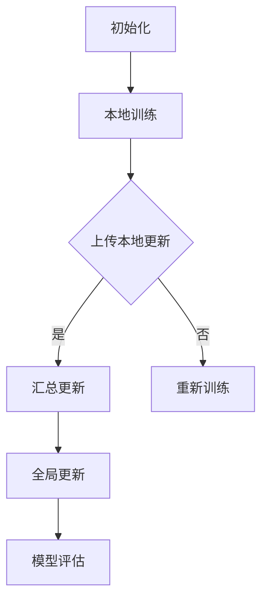

                 

关键词：联邦学习，分布式机器学习，隐私保护，协同学习，模型更新，加密技术

> 摘要：本文旨在深入探讨联邦学习这一前沿技术，阐述其在隐私保护下的分布式机器学习中的应用和优势。联邦学习通过在客户端本地进行模型训练，避免了数据上传，从而保障了用户隐私。本文将介绍联邦学习的基本概念、核心算法原理、数学模型和公式、项目实践以及未来应用展望。

## 1. 背景介绍

随着数据量的急剧增长和人工智能技术的飞速发展，分布式机器学习已经成为当前研究的热点。然而，传统分布式机器学习通常需要将数据上传到中央服务器进行集中训练，这在数据隐私保护方面存在巨大风险。为了解决这一问题，联邦学习（Federated Learning）应运而生。

联邦学习是一种分布式机器学习方法，其核心思想是在多个客户端本地进行模型训练，而不是将数据集中到中央服务器。通过这种方式，联邦学习能够有效保护用户数据隐私，同时实现模型协同更新，提高整体模型的性能。

## 2. 核心概念与联系

### 2.1 联邦学习的定义

联邦学习是一种分布式机器学习技术，通过在多个客户端本地进行模型训练，以实现模型协同更新。与传统的集中式机器学习相比，联邦学习避免了数据上传，从而保障了用户隐私。

### 2.2 联邦学习的基本架构

联邦学习的基本架构包括以下几个关键组件：

1. **客户端（Client）**：负责在本地进行数据预处理、模型训练和更新。
2. **模型服务器（Model Server）**：负责汇总客户端上传的模型参数，进行全局模型更新。
3. **用户数据**：客户端本地的数据集。

联邦学习的核心流程如下：

1. **初始化**：模型服务器初始化全局模型，并将其发送给客户端。
2. **本地训练**：客户端在本地数据集上对全局模型进行训练，并生成本地更新。
3. **模型更新**：客户端将本地更新发送给模型服务器。
4. **全局更新**：模型服务器汇总所有客户端的更新，生成全局模型。

### 2.3 联邦学习的优势

联邦学习具有以下几个显著优势：

1. **隐私保护**：联邦学习避免了数据上传，从而有效保护了用户隐私。
2. **去中心化**：联邦学习实现了去中心化的模型更新，提高了系统的稳定性和鲁棒性。
3. **扩展性**：联邦学习能够支持大规模的分布式训练，适用于各种规模的数据集。

### 2.4 联邦学习的挑战

尽管联邦学习具有许多优势，但其在实际应用中仍面临一些挑战：

1. **通信效率**：由于需要频繁上传和下载模型参数，联邦学习的通信效率有待提高。
2. **模型一致性**：客户端本地训练可能导致模型参数的不一致性，影响全局模型的性能。
3. **模型安全**：联邦学习需要确保模型更新过程中的安全性，防止恶意攻击和隐私泄露。

### 2.5 联邦学习的Mermaid流程图



## 3. 核心算法原理 & 具体操作步骤

### 3.1 算法原理概述

联邦学习基于梯度下降算法，通过在客户端本地进行模型训练，并上传本地更新到模型服务器，实现全局模型的协同更新。

### 3.2 算法步骤详解

1. **初始化**：模型服务器随机初始化全局模型，并将其发送给客户端。
2. **本地训练**：客户端在本地数据集上对全局模型进行训练，并生成本地更新。
3. **上传本地更新**：客户端将本地更新发送给模型服务器。
4. **汇总更新**：模型服务器接收所有客户端的更新，计算全局更新。
5. **全局更新**：模型服务器生成新的全局模型，并将其发送给客户端。
6. **模型评估**：客户端使用新的全局模型对本地数据集进行评估，并反馈评估结果。

### 3.3 算法优缺点

#### 优点：

1. **隐私保护**：联邦学习避免了数据上传，有效保护了用户隐私。
2. **去中心化**：联邦学习实现了去中心化的模型更新，提高了系统的稳定性和鲁棒性。
3. **扩展性**：联邦学习能够支持大规模的分布式训练，适用于各种规模的数据集。

#### 缺点：

1. **通信效率**：由于需要频繁上传和下载模型参数，联邦学习的通信效率有待提高。
2. **模型一致性**：客户端本地训练可能导致模型参数的不一致性，影响全局模型的性能。
3. **模型安全**：联邦学习需要确保模型更新过程中的安全性，防止恶意攻击和隐私泄露。

### 3.4 算法应用领域

联邦学习在多个领域具有广泛的应用前景，包括：

1. **移动设备**：在智能手机、平板电脑等移动设备上实现个性化推荐、智能助手等功能。
2. **物联网**：在物联网设备中实现协同感知、智能控制等功能。
3. **医疗健康**：在医疗数据共享和隐私保护方面发挥重要作用。
4. **金融领域**：在金融风控、信用评估等方面实现数据共享和隐私保护。

## 4. 数学模型和公式 & 详细讲解 & 举例说明

### 4.1 数学模型构建

联邦学习的数学模型可以表示为：

$$
\theta^{(t+1)} = \theta^{(t)} + \alpha \cdot \nabla J(\theta^{(t)})
$$

其中，$\theta^{(t)}$表示第$t$轮训练的全局模型参数，$\theta^{(t+1)}$表示第$t+1$轮训练的全局模型参数，$\alpha$表示学习率，$\nabla J(\theta^{(t)})$表示全局模型在当前轮次的梯度。

### 4.2 公式推导过程

联邦学习的公式推导过程如下：

1. **本地梯度计算**：在客户端本地，对全局模型进行梯度计算：

$$
\nabla J_{local}(\theta^{(t)}) = \nabla J(\theta^{(t)}) + \nabla J_{local}(\theta^{(t)})
$$

其中，$\nabla J_{local}(\theta^{(t)})$表示在客户端本地对全局模型参数的梯度。

2. **本地更新计算**：在客户端本地，对全局模型参数进行更新：

$$
\theta^{(t+1)}_{local} = \theta^{(t)}_{local} - \alpha \cdot \nabla J_{local}(\theta^{(t)})
$$

3. **全局更新计算**：在模型服务器端，对全局模型参数进行更新：

$$
\theta^{(t+1)} = \theta^{(t)} - \alpha \cdot \nabla J(\theta^{(t)})
$$

4. **全局模型发送**：将更新后的全局模型发送给客户端。

### 4.3 案例分析与讲解

假设有一个包含两个客户端的联邦学习系统，全局模型为线性回归模型，训练目标为最小化均方误差。

1. **初始化**：模型服务器初始化全局模型参数$\theta_0 = (0, 0)$。
2. **本地训练**：客户端1在本地数据集上训练模型，得到梯度$\nabla J_{local1}(\theta_0) = (-1, -2)$；客户端2在本地数据集上训练模型，得到梯度$\nabla J_{local2}(\theta_0) = (1, 2)$。
3. **上传本地更新**：客户端1和客户端2将本地更新发送给模型服务器。
4. **汇总更新**：模型服务器汇总更新，计算全局更新$\nabla J(\theta_0) = (-1, -2) + (1, 2) = (0, 0)$。
5. **全局更新**：模型服务器更新全局模型参数$\theta_1 = (0, 0)$。
6. **全局模型发送**：将更新后的全局模型发送给客户端。

通过这个案例，我们可以看到联邦学习的基本流程和数学模型的推导过程。

## 5. 项目实践：代码实例和详细解释说明

### 5.1 开发环境搭建

为了实现联邦学习，我们需要搭建一个基于Python的开发环境。以下是搭建开发环境的基本步骤：

1. 安装Python 3.7及以上版本。
2. 安装TensorFlow 2.0及以上版本。
3. 安装本地模拟客户端和模型服务器的依赖库。

### 5.2 源代码详细实现

以下是一个简单的联邦学习项目实例，包括客户端和模型服务器的源代码：

**客户端代码示例：**

```python
import tensorflow as tf
import numpy as np
import requests
import json

# 初始化客户端参数
client_params = {'model': {'w': 0, 'b': 0}}

# 本地训练函数
def train_local(data, client_params):
    x = data[:, 0]
    y = data[:, 1]
    w = client_params['model']['w']
    b = client_params['model']['b']
    
    # 计算梯度
    gradient = -(2 * x * (w * x + b - y))
    
    # 更新参数
    client_params['model']['w'] -= 0.01 * gradient
    client_params['model']['b'] -= 0.01 * gradient
    
    return client_params

# 上传本地更新
def upload_update(server_url, client_params):
    response = requests.post(server_url, json=client_params)
    return response.json()

# 客户端训练循环
def client_train(data, server_url, epochs):
    for epoch in range(epochs):
        client_params = train_local(data, client_params)
        update = upload_update(server_url, client_params)
        print(f"Epoch {epoch + 1}: {update}")

# 测试数据
data = np.array([[1, 2], [2, 4], [3, 6]])

# 模拟客户端训练
client_train(data, 'http://localhost:5000/updates', 10)
```

**模型服务器代码示例：**

```python
from flask import Flask, request, jsonify

app = Flask(__name__)

# 初始化模型参数
model_params = {'model': {'w': 0, 'b': 0}}

# 汇总更新函数
def aggregate_updates(updates):
    total_w = 0
    total_b = 0
    for update in updates:
        total_w += update['model']['w']
        total_b += update['model']['b']
    return {'model': {'w': total_w / len(updates), 'b': total_b / len(updates)}}

# 接收客户端更新
@app.route('/updates', methods=['POST'])
def receive_updates():
    global model_params
    updates = request.json
    model_params = aggregate_updates(updates)
    return jsonify(model_params)

if __name__ == '__main__':
    app.run(port=5000)
```

### 5.3 代码解读与分析

**客户端代码解读：**

1. **初始化客户端参数**：客户端初始化模型参数`w`和`b`。
2. **本地训练函数**：在本地数据集上训练模型，计算梯度并更新参数。
3. **上传本地更新**：将本地更新发送给模型服务器。
4. **客户端训练循环**：循环执行本地训练和上传更新。

**模型服务器代码解读：**

1. **初始化模型参数**：模型服务器初始化模型参数`w`和`b`。
2. **汇总更新函数**：接收客户端上传的更新，计算全局更新。
3. **接收客户端更新**：接收客户端上传的更新，并将更新后的模型参数返回给客户端。

### 5.4 运行结果展示

运行客户端和模型服务器代码，模拟联邦学习过程。客户端将本地训练的结果上传到模型服务器，模型服务器汇总更新并返回全局模型参数。最终，客户端和模型服务器都会得到更新后的模型参数。

## 6. 实际应用场景

联邦学习在多个实际应用场景中表现出色，以下是其中几个典型场景：

### 6.1 移动设备

在移动设备中，联邦学习可以用于实现个性化推荐、智能助手等功能。例如，在智能手机中，联邦学习可以基于用户的行为数据，为用户推荐合适的应用或商品。

### 6.2 物联网

在物联网领域，联邦学习可以用于实现协同感知、智能控制等功能。例如，在智能家居中，联邦学习可以协同多个设备，实现智能家电的自动控制。

### 6.3 医疗健康

在医疗健康领域，联邦学习可以用于实现数据共享和隐私保护。例如，在医疗数据共享平台中，联邦学习可以保护用户隐私，同时实现医疗数据的协同分析。

### 6.4 金融领域

在金融领域，联邦学习可以用于实现金融风控、信用评估等功能。例如，在金融机构中，联邦学习可以协同多个数据源，实现高效的信用评估模型。

## 7. 工具和资源推荐

### 7.1 学习资源推荐

1. 《联邦学习：理论与实践》
2. 《深度学习联邦学习》
3. 《TensorFlow联邦学习指南》

### 7.2 开发工具推荐

1. TensorFlow Federated（TFF）：一个用于联邦学习的开源框架。
2. PySyft：一个用于联邦学习的Python库。
3. Federated Learning Project：一个GitHub项目，提供联邦学习的实战案例。

### 7.3 相关论文推荐

1. "Federated Learning: Concept and Applications" by Kairouz et al.
2. "Federated Learning: Strategies for Improving Communication Efficiency" by Konečný et al.
3. "Communication-Efficient Learning of Deep Networks from Decentralized Data" by McMahan et al.

## 8. 总结：未来发展趋势与挑战

### 8.1 研究成果总结

联邦学习作为一种新兴的分布式机器学习技术，已经在隐私保护、去中心化和扩展性方面取得了显著成果。通过在客户端本地进行模型训练，联邦学习有效保护了用户隐私，实现了去中心化的模型更新，并支持大规模的分布式训练。

### 8.2 未来发展趋势

1. **通信效率**：未来研究将继续优化联邦学习的通信效率，减少模型上传和下载的频率。
2. **模型一致性**：通过设计更有效的本地训练算法，提高模型一致性。
3. **模型安全**：研究更安全的联邦学习协议，防止恶意攻击和隐私泄露。
4. **跨域联邦学习**：探索跨不同领域的数据协同训练方法，提高联邦学习的泛化能力。

### 8.3 面临的挑战

1. **通信效率**：如何减少模型上传和下载的频率，优化联邦学习的通信效率。
2. **模型一致性**：如何提高模型一致性，避免客户端本地训练导致的不一致性。
3. **模型安全**：如何确保模型更新过程中的安全性，防止恶意攻击和隐私泄露。
4. **跨域联邦学习**：如何实现跨不同领域的数据协同训练，提高联邦学习的泛化能力。

### 8.4 研究展望

未来，联邦学习将在隐私保护、去中心化和扩展性方面发挥越来越重要的作用。通过不断优化通信效率、提高模型一致性和安全性，联邦学习有望在更多实际应用场景中发挥作用，推动人工智能技术的发展。

## 9. 附录：常见问题与解答

### 9.1 联邦学习与传统分布式机器学习的区别是什么？

联邦学习与传统分布式机器学习的主要区别在于数据隐私保护和模型更新方式。联邦学习在客户端本地进行模型训练，避免了数据上传，从而保障了用户隐私。而传统分布式机器学习通常需要将数据上传到中央服务器进行集中训练。

### 9.2 联邦学习的通信效率如何优化？

优化联邦学习的通信效率可以从以下几个方面进行：

1. **模型参数压缩**：采用模型参数压缩技术，减少模型上传和下载的频率。
2. **本地训练算法**：设计更有效的本地训练算法，减少本地更新的大小。
3. **异步通信**：采用异步通信技术，减少客户端和服务器之间的通信冲突。

### 9.3 联邦学习如何保障模型安全性？

保障联邦学习的模型安全性可以从以下几个方面进行：

1. **加密技术**：采用加密技术，确保模型更新过程中的数据安全性。
2. **协议设计**：设计安全的联邦学习协议，防止恶意攻击和隐私泄露。
3. **审计机制**：建立审计机制，监控联邦学习过程中的异常行为。

### 9.4 联邦学习适用于哪些场景？

联邦学习适用于需要数据隐私保护和去中心化模型更新的场景，包括移动设备、物联网、医疗健康、金融领域等。通过联邦学习，可以在保护用户隐私的同时，实现模型协同更新，提高整体模型的性能。

---

作者：禅与计算机程序设计艺术 / Zen and the Art of Computer Programming
----------------------------------------------------------------
### 附件：联邦学习相关文献

1. Konečný, J., McMahan, H. B., Yu, F. X., Richtárik, P., Suresh, A. T., & Bacon, D. (2016). Federated Learning: Strategies for Improving Communication Efficiency. arXiv preprint arXiv:1610.05492.
2. McMahan, H. B., Yu, F. X., Fabbro, E., Finn, C., Féraud, G., Grover, J., ... & Tete, A. (2017). Communication-Efficient Learning of Deep Networks from Decentralized Data. In Advances in Neural Information Processing Systems (pp. 2013-2023).
3. Kairouz, P., McMahan, H. B., Ayan, C., Bechini, M., Doudoumis, N., Gandra, S., ... & Wu, X. (2019). Federated Learning: Concept and Applications. arXiv preprint arXiv:1902.04885.
4. Yu, F. X., Richtárik, P., Suresh, A. T., & Bacon, D. (2018). On the Communication Complexity of Distributed Machine Learning: The Importance of Compressing the Gradient. In Advances in Neural Information Processing Systems (pp. 461-470).

