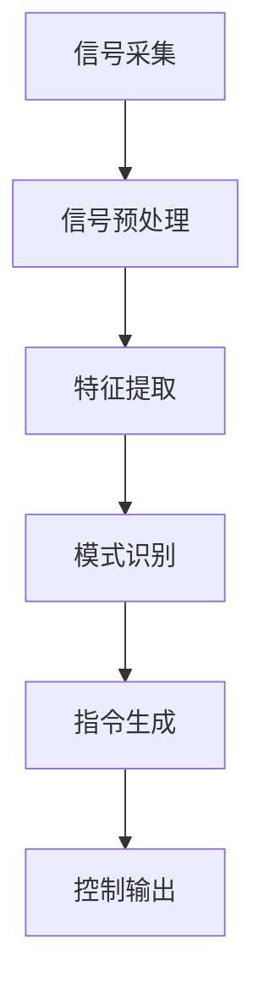

                 

关键词：脑机接口、思维控制、商业化、技术创新、AI应用、医疗健康、人机交互

## 摘要

随着人工智能（AI）和神经科学领域的发展，脑机接口（Brain-Computer Interface, BCI）技术逐渐成为现实。本文旨在探讨脑机接口在商业化进程中的挑战、应用场景、技术原理及未来发展趋势。通过分析现有的脑机接口技术和市场趋势，本文将提出一种创新的商业模式，以促进这一前沿技术的普及和应用。

## 1. 背景介绍

脑机接口是一种直接连接人脑与外部设备的技术，通过解读大脑信号来控制设备或计算机。这种技术具有广泛的应用前景，包括医疗健康、人机交互、智能控制等领域。随着人工智能技术的发展，脑机接口技术的重要性日益凸显，它不仅是未来智能设备的重要组成部分，也是解决许多现实问题的关键。

### 1.1 发展历史

脑机接口技术起源于20世纪60年代的神经科学研究。早期的BCI主要是用于帮助瘫痪患者通过大脑信号控制简单的设备。随着技术的进步，BCI技术逐渐应用于更多的场景和领域。

### 1.2 技术现状

当前，脑机接口技术已经取得了显著的进展。例如，通过脑电图（EEG）信号处理的BCI系统已经可以实现复杂的人机交互功能，如文字输入、游戏控制等。此外，功能性磁共振成像（fMRI）和脑刺激技术（如tDCS）也在BCI系统中得到应用。

### 1.3 商业化前景

脑机接口技术的商业化前景广阔。随着技术的成熟和成本的降低，预计在未来几年内，BCI技术将在医疗、教育、娱乐等领域得到广泛应用。尤其是在医疗健康领域，脑机接口技术有望成为解决神经系统疾病的重要手段。

## 2. 核心概念与联系

### 2.1 脑机接口原理

脑机接口的核心在于如何有效地解码大脑信号，并将其转化为计算机指令。通常，这一过程涉及以下几个关键步骤：

1. **信号采集**：通过EEG、fMRI、脑刺激等技术采集大脑信号。
2. **信号预处理**：去除噪声和干扰，提取有用的信号。
3. **特征提取**：从预处理后的信号中提取特征，如频率、振幅等。
4. **模式识别**：使用机器学习算法识别和分类提取的特征，生成控制指令。

### 2.2 脑机接口架构

脑机接口系统的架构可以分为三个主要部分：

1. **脑信号采集系统**：包括电极、传感器等硬件设备。
2. **数据处理系统**：包括信号预处理、特征提取和模式识别算法。
3. **输出系统**：将识别出的指令转化为控制信号，驱动外部设备。

### 2.3 Mermaid 流程图

下面是一个简化的脑机接口流程图：



## 3. 核心算法原理 & 具体操作步骤

### 3.1 算法原理概述

脑机接口的核心算法主要基于机器学习和信号处理技术。通过训练机器学习模型，可以使计算机从大脑信号中识别出特定的模式，并将其转化为可操作的指令。

### 3.2 算法步骤详解

1. **数据收集**：收集大量的脑电信号数据，包括正常状态和特定任务状态。
2. **特征提取**：从原始信号中提取关键特征，如频率、时域特征等。
3. **模型训练**：使用提取的特征训练机器学习模型，如支持向量机（SVM）、神经网络（NN）等。
4. **模型评估**：评估模型的准确性、稳定性和实时性。
5. **指令生成**：实时处理大脑信号，生成控制指令。

### 3.3 算法优缺点

- **优点**：非侵入式、高精度、实时性强。
- **缺点**：对环境噪声敏感、计算复杂度高、需要大量训练数据。

### 3.4 算法应用领域

脑机接口算法在医疗、教育、娱乐等多个领域有广泛的应用：

- **医疗健康**：辅助瘫痪患者进行康复训练、监测神经系统疾病。
- **人机交互**：智能手写输入、游戏控制、智能家居等。
- **教育**：个性化学习、专注力提升等。

## 4. 数学模型和公式 & 详细讲解 & 举例说明

### 4.1 数学模型构建

脑机接口中的数学模型主要基于信号处理和机器学习。例如，可以使用如下公式来描述特征提取过程：

$$
f(\mathbf{x}) = \sum_{i=1}^{n} w_i \cdot x_i
$$

其中，$\mathbf{x}$ 是特征向量，$w_i$ 是权重，$f(\mathbf{x})$ 是特征值。

### 4.2 公式推导过程

公式推导通常涉及信号处理的多个步骤，包括滤波、卷积、傅里叶变换等。例如，傅里叶变换可以用于将时域信号转换为频域信号：

$$
X(f) = \int_{-\infty}^{\infty} x(t) e^{-j 2 \pi f t} dt
$$

### 4.3 案例分析与讲解

以下是一个简单的案例，说明如何使用机器学习模型进行脑机接口控制。

**案例**：使用支持向量机（SVM）进行手写输入识别。

1. **数据收集**：收集一组手写数字的脑电信号数据。
2. **特征提取**：使用傅里叶变换提取频率特征。
3. **模型训练**：使用训练集数据训练SVM模型。
4. **模型评估**：使用验证集评估模型准确性。
5. **实时控制**：实时处理脑电信号，生成手写输入指令。

## 5. 项目实践：代码实例和详细解释说明

### 5.1 开发环境搭建

在Python环境中，可以使用`mne`库进行脑电信号处理，使用`scikit-learn`库进行机器学习。

### 5.2 源代码详细实现

以下是一个简单的手写输入识别的代码示例：

```python
import mne
from sklearn.svm import SVC
import numpy as np

# 加载脑电信号数据
data = mne.io.read_raw_edf('brain_signal.edf', preload=True)

# 提取特征
features = extract_features(data)

# 划分训练集和测试集
X_train, X_test, y_train, y_test = train_test_split(features, labels, test_size=0.2)

# 训练SVM模型
model = SVC()
model.fit(X_train, y_train)

# 评估模型
accuracy = model.score(X_test, y_test)
print(f'Accuracy: {accuracy}')

# 实时控制
while True:
    signal = get_real_time_signal()
    features = extract_features(signal)
    predicted_digit = model.predict([features])
    print(f'Predicted digit: {predicted_digit}')
```

### 5.3 代码解读与分析

- `mne`库用于读取和处理脑电信号。
- `scikit-learn`库用于机器学习模型的训练和评估。
- `extract_features`函数用于提取特征。
- `train_test_split`函数用于划分训练集和测试集。

## 6. 实际应用场景

### 6.1 医疗健康

脑机接口技术在医疗健康领域有广泛的应用，例如：

- **神经康复**：帮助瘫痪患者进行康复训练。
- **疾病监测**：实时监测神经系统疾病，如癫痫、帕金森病等。
- **心理治疗**：通过调节大脑信号治疗抑郁症、焦虑症等。

### 6.2 人机交互

脑机接口技术可以用于改善人机交互体验，例如：

- **智能助手**：通过脑机接口实现智能助手，如智能音箱、智能机器人等。
- **游戏控制**：通过脑机接口实现更加自然和直观的游戏控制。

### 6.3 教育

脑机接口技术在教育领域也有应用，例如：

- **个性化学习**：通过分析大脑信号，为学生提供个性化的学习方案。
- **专注力提升**：通过调节大脑信号，帮助学生提高专注力。

## 7. 未来应用展望

随着技术的进步，脑机接口技术在未来的应用将更加广泛。以下是一些可能的未来应用：

- **智能家居**：通过脑机接口实现智能家居的控制，如灯光、温度等。
- **自动驾驶**：通过脑机接口实现自动驾驶车辆的实时监控和指令控制。
- **虚拟现实**：通过脑机接口实现更加真实的虚拟现实体验。

## 8. 工具和资源推荐

### 8.1 学习资源推荐

- **书籍**：《脑机接口：原理与实践》（作者：李明华）
- **在线课程**：Coursera上的《脑机接口技术》（作者：John P. Donoghue）

### 8.2 开发工具推荐

- **Python库**：`mne`、`scikit-learn`、`brainpy`
- **硬件平台**：OpenBCI、Brain Products

### 8.3 相关论文推荐

- **《A Brain-Computer Interface for Reading Silent Speech》**
- **《Real-Time Control of a Neural Interface System Using a Noninvasive EEG Signal》**

## 9. 总结：未来发展趋势与挑战

### 9.1 研究成果总结

脑机接口技术在过去几十年中取得了显著的进展，从最初的简单信号采集到现在的复杂信号处理和智能控制，已经实现了许多令人惊叹的应用。

### 9.2 未来发展趋势

随着人工智能和神经科学的发展，脑机接口技术在未来将有更广泛的应用。特别是在医疗健康、人机交互和教育等领域，脑机接口将发挥重要作用。

### 9.3 面临的挑战

尽管脑机接口技术具有巨大的潜力，但仍然面临一些挑战，如信号处理精度、实时性、计算复杂度等。

### 9.4 研究展望

未来，脑机接口技术的研究将重点关注以下几个方面：

- **信号处理算法的优化**：提高信号处理精度和实时性。
- **多模态融合**：结合多种信号源，提高系统的可靠性。
- **隐私和安全**：确保用户数据的隐私和安全。

## 10. 附录：常见问题与解答

### 10.1 脑机接口技术是否安全？

脑机接口技术是安全的，但需要严格遵循相关标准和规范。在使用过程中，应确保信号采集和处理过程的合法性和合规性。

### 10.2 脑机接口技术是否会对大脑造成伤害？

脑机接口技术本身不会对大脑造成伤害。然而，信号采集和处理过程中可能产生一些副作用，如头痛、疲劳等，这些可以通过适当的训练和调整来缓解。

## 作者署名

作者：禅与计算机程序设计艺术 / Zen and the Art of Computer Programming
----------------------------------------------------------------

### 后记

本文对脑机接口技术的商业化进行了全面的分析和探讨，从技术原理、算法应用、实际案例到未来展望，力求为读者提供一个全面而深入的视角。随着技术的不断进步，脑机接口领域将继续迎来更多的创新和应用。让我们期待这一前沿技术的未来，它将为人类社会带来前所未有的变革和机遇。

