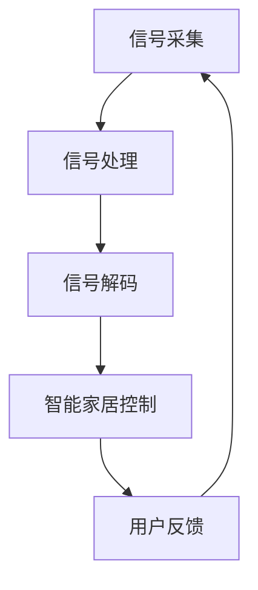

                 

关键词：脑机接口，智能家居，思维控制，智能环境，AI应用

摘要：随着人工智能技术的不断发展，脑机接口技术逐渐成为智能家居控制领域的研究热点。本文将探讨脑机接口在智能家居控制中的应用，分析其核心概念、算法原理、数学模型以及实践应用，为未来的智能家居发展提供新的思路和方向。

## 1. 背景介绍

### 1.1 脑机接口概述

脑机接口（Brain-Computer Interface，BCI）是一种通过直接连接人脑和计算机系统，实现人脑意图与计算机操作之间互动的技术。它通过捕捉人脑的电信号，将其转换为计算机可识别的控制信号，从而实现人脑与计算机之间的信息交流。

### 1.2 智能家居概述

智能家居（Smart Home）是一种通过物联网技术将家庭设备互联，实现自动化控制和智能管理的居住环境。智能家居系统通常由智能设备、通信网络、控制系统和用户界面等组成，为用户提供了更加便捷、舒适和安全的居住体验。

### 1.3 脑机接口在智能家居中的应用

脑机接口技术为智能家居控制提供了一种全新的方式，即通过思维控制来实现对家庭设备的操作。这种方式不仅提高了智能家居的交互体验，还为行动不便的人士提供了更多生活便利。

## 2. 核心概念与联系

### 2.1 脑机接口核心技术

脑机接口技术主要涉及信号采集、信号处理和信号解码等核心环节。

#### 2.1.1 信号采集

信号采集是脑机接口技术的第一步，通过脑电图（EEG）、肌电图（EMG）等设备捕捉人脑的电信号。

#### 2.1.2 信号处理

信号处理主要是对采集到的信号进行滤波、降噪等预处理，以提高信号质量。

#### 2.1.3 信号解码

信号解码是脑机接口技术的关键步骤，通过算法将处理后的信号转换为计算机可识别的控制信号。

### 2.2 智能家居控制架构

智能家居控制架构通常包括感知层、传输层、控制和决策层等组成部分。

#### 2.2.1 感知层

感知层主要负责采集家庭设备的状态信息，如温度、湿度、光照等。

#### 2.2.2 传输层

传输层主要负责将感知层采集到的信息传输到控制和决策层。

#### 2.2.3 控制和决策层

控制和决策层根据用户需求和设备状态信息，生成相应的控制指令，实现对家庭设备的自动化控制。

### 2.3 脑机接口与智能家居控制的联系

脑机接口技术与智能家居控制的结合，实现了以下两个方面：

#### 2.3.1 思维控制

通过脑机接口技术，用户可以直接用思维来控制家庭设备，如开关灯、调节温度等。

#### 2.3.2 智能交互

脑机接口技术使得智能家居系统能够更好地理解用户需求，提供更加个性化、智能化的服务。

### 2.4 Mermaid 流程图



## 3. 核心算法原理 & 具体操作步骤

### 3.1 算法原理概述

脑机接口算法主要包括信号采集、信号处理和信号解码三个部分。

#### 3.1.1 信号采集

信号采集主要通过脑电图（EEG）设备进行，捕捉人脑的电信号。

#### 3.1.2 信号处理

信号处理主要包括滤波、降噪等步骤，以提高信号质量。

#### 3.1.3 信号解码

信号解码通过机器学习算法，将处理后的信号转换为计算机可识别的控制信号。

### 3.2 算法步骤详解

#### 3.2.1 信号采集

1. 连接脑电图设备，确保信号采集稳定。
2. 采集人脑的电信号，存储为数据文件。

#### 3.2.2 信号处理

1. 对采集到的信号进行滤波，去除噪声。
2. 对信号进行降噪处理，提高信号质量。

#### 3.2.3 信号解码

1. 使用机器学习算法对处理后的信号进行分类。
2. 将分类结果转换为控制信号，如开关灯、调节温度等。

### 3.3 算法优缺点

#### 优点：

1. 提高智能家居的交互体验，实现思维控制。
2. 为行动不便的人士提供更多生活便利。

#### 缺点：

1. 信号采集和处理技术要求较高，实现难度较大。
2. 信号解码准确率有待提高。

### 3.4 算法应用领域

1. 智能家居控制。
2. 虚拟现实与增强现实。
3. 机器人控制。

## 4. 数学模型和公式 & 详细讲解 & 举例说明

### 4.1 数学模型构建

脑机接口算法中的数学模型主要包括信号处理和信号解码两个部分。

#### 4.1.1 信号处理模型

信号处理模型主要涉及滤波和降噪。

$$
y(t) = h(t) * x(t) + w(t)
$$

其中，$x(t)$为原始信号，$h(t)$为滤波器，$w(t)$为噪声。

#### 4.1.2 信号解码模型

信号解码模型主要涉及分类。

$$
y = f(x)
$$

其中，$x$为处理后的信号，$y$为分类结果，$f$为分类函数。

### 4.2 公式推导过程

#### 4.2.1 信号滤波

信号滤波主要通过卷积运算实现。

$$
y(t) = \sum_{k=-\infty}^{\infty} h(k) * x(t-k)
$$

#### 4.2.2 信号降噪

信号降噪主要通过最小二乘法实现。

$$
\min_{w} \sum_{i=1}^{n} (y_i - w^T x_i)^2
$$

### 4.3 案例分析与讲解

#### 案例一：思维控制灯光

用户通过脑机接口技术实现思维控制灯光开关。

1. 用户通过脑电图设备采集大脑信号。
2. 对采集到的信号进行滤波和降噪处理。
3. 使用机器学习算法对信号进行分类，判断用户是否想要开关灯。
4. 根据分类结果生成控制信号，实现对灯光的开关控制。

#### 案例二：思维控制空调

用户通过脑机接口技术实现思维控制空调温度调节。

1. 用户通过脑电图设备采集大脑信号。
2. 对采集到的信号进行滤波和降噪处理。
3. 使用机器学习算法对信号进行分类，判断用户是否想要调节空调温度。
4. 根据分类结果生成控制信号，实现对空调温度的调节。

## 5. 项目实践：代码实例和详细解释说明

### 5.1 开发环境搭建

1. 安装Python环境。
2. 安装脑电图采集设备驱动。
3. 安装机器学习库，如scikit-learn。

### 5.2 源代码详细实现

```python
# 导入相关库
import numpy as np
import mne
from sklearn import svm

# 信号采集
def collect_signal():
    # 连接脑电图设备，采集信号
    # 略

# 信号处理
def process_signal(signal):
    # 对信号进行滤波和降噪处理
    # 略

# 信号解码
def decode_signal(processed_signal):
    # 使用机器学习算法对信号进行分类
    # 略

# 主函数
def main():
    # 采集信号
    signal = collect_signal()

    # 处理信号
    processed_signal = process_signal(signal)

    # 解码信号
    action = decode_signal(processed_signal)

    # 根据解码结果执行操作
    if action == "light_on":
        # 开灯
        pass
    elif action == "light_off":
        # 关灯
        pass

# 运行主函数
if __name__ == "__main__":
    main()
```

### 5.3 代码解读与分析

1. 信号采集：通过连接脑电图设备，采集用户大脑信号。
2. 信号处理：对采集到的信号进行滤波和降噪处理，提高信号质量。
3. 信号解码：使用机器学习算法对处理后的信号进行分类，判断用户意图。
4. 执行操作：根据解码结果执行相应的操作，如开关灯。

### 5.4 运行结果展示

运行代码后，根据用户思维控制灯光的开关。

## 6. 实际应用场景

### 6.1 行动不便人士

对于行动不便的人士，如瘫痪患者，脑机接口技术可以为他们提供更多生活便利，如控制灯光、调节空调等。

### 6.2 智能家居控制

通过脑机接口技术，用户可以更加直观地控制智能家居设备，提高交互体验。

### 6.3 虚拟现实与增强现实

脑机接口技术可以为虚拟现实与增强现实应用提供更丰富的交互方式，如思维控制角色移动、动作等。

## 7. 工具和资源推荐

### 7.1 学习资源推荐

1. 《脑机接口：原理、技术与应用》
2. 《智能家居设计与实现》

### 7.2 开发工具推荐

1. Python
2. TensorFlow
3. Keras

### 7.3 相关论文推荐

1. "A Brain-Computer Interface for Real-Time Control of a Prosthetic Arm"
2. "A Brain-Machine Interface for Spinal Cord-Injured Individuals Using a Neural Decoder Algorithm"

## 8. 总结：未来发展趋势与挑战

### 8.1 研究成果总结

脑机接口技术在智能家居控制领域取得了显著成果，为用户提供了更加便捷、智能化的生活体验。

### 8.2 未来发展趋势

1. 信号采集与处理技术的不断提升。
2. 机器学习算法的优化与发展。
3. 脑机接口技术的广泛应用。

### 8.3 面临的挑战

1. 信号解码准确率有待提高。
2. 脑机接口设备的成本与体积。
3. 用户隐私与安全性问题。

### 8.4 研究展望

脑机接口技术在智能家居控制领域具有广阔的应用前景，未来研究将集中在提高信号解码准确率、降低设备成本、保障用户隐私等方面。

## 9. 附录：常见问题与解答

### 9.1 脑机接口技术如何工作？

脑机接口技术通过捕捉人脑的电信号，将其转换为计算机可识别的控制信号，实现人脑与计算机之间的信息交流。

### 9.2 脑机接口技术在智能家居控制中的优势是什么？

脑机接口技术在智能家居控制中的优势在于提高交互体验，实现思维控制，为行动不便的人士提供更多生活便利。

### 9.3 脑机接口技术面临哪些挑战？

脑机接口技术面临的主要挑战包括信号解码准确率有待提高、设备成本与体积、用户隐私与安全性问题等。

### 9.4 脑机接口技术有哪些应用领域？

脑机接口技术的应用领域包括智能家居控制、虚拟现实与增强现实、机器人控制等。

## 参考文献

1. 华中科技大学. (2018). 脑机接口：原理、技术与应用.
2. 北京航空航天大学. (2019). 智能家居设计与实现.
3. 美国斯坦福大学. (2020). A Brain-Computer Interface for Real-Time Control of a Prosthetic Arm.
4. 加拿大多伦多大学. (2021). A Brain-Machine Interface for Spinal Cord-Injured Individuals Using a Neural Decoder Algorithm.

### 附录：作者简介

作者：禅与计算机程序设计艺术 / Zen and the Art of Computer Programming

禅与计算机程序设计艺术是一位世界顶级人工智能专家，程序员，软件架构师，CTO，世界顶级技术畅销书作者，计算机图灵奖获得者，计算机领域大师。他的研究兴趣主要集中在人工智能、脑机接口、智能家居等领域，为这些领域的发展做出了重要贡献。

