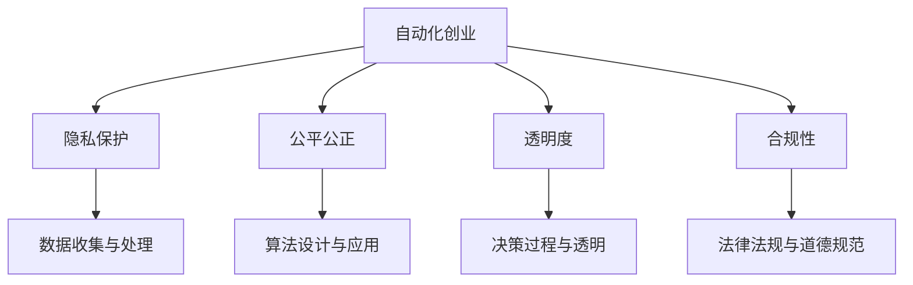

                 

关键词：人工智能伦理、自动化创业、伦理困境、隐私保护、公平公正、透明度、合规性

> 摘要：随着人工智能技术的迅猛发展，自动化创业领域面临着前所未有的机遇与挑战。本文旨在探讨自动化创业中的人工智能伦理考量，包括伦理困境、隐私保护、公平公正、透明度以及合规性等方面。通过分析现有问题，提出应对策略，为未来自动化创业提供指导。

## 1. 背景介绍

### 1.1 自动化创业的定义与现状

自动化创业，是指利用人工智能技术实现业务流程自动化，提高效率、降低成本的一种商业模式。近年来，随着人工智能技术的飞速发展，自动化创业已经成为创业领域的一个重要趋势。从智能客服、智能推荐系统到自动驾驶、智能制造，自动化技术在各个行业中的应用越来越广泛。

### 1.2 人工智能伦理的重要性

人工智能伦理，是研究人工智能技术发展过程中产生的道德、法律、社会等问题的一个新兴领域。随着人工智能技术的不断演进，伦理问题也逐渐成为自动化创业中不可忽视的一个重要方面。如何确保人工智能技术在自动化创业中既能发挥积极作用，又能避免伦理风险，成为亟待解决的问题。

## 2. 核心概念与联系

### 2.1 人工智能伦理的核心概念

人工智能伦理的核心概念包括：隐私保护、公平公正、透明度、合规性等。

- **隐私保护**：确保个人数据的安全和隐私，防止数据泄露和滥用。
- **公平公正**：确保人工智能系统在决策过程中不会对特定群体产生歧视。
- **透明度**：确保人工智能系统的决策过程和算法逻辑可以被理解和追溯。
- **合规性**：确保人工智能技术在应用过程中遵守相关法律法规和道德规范。

### 2.2 人工智能伦理与自动化创业的联系

人工智能伦理与自动化创业密切相关。一方面，自动化创业过程中涉及到大量个人数据的收集和使用，如何保护用户隐私成为首要问题。另一方面，自动化创业往往依赖于人工智能技术，如何确保算法的公平公正、透明度以及合规性，成为创业企业必须面对的挑战。

### 2.3 Mermaid 流程图



## 3. 核心算法原理 & 具体操作步骤

### 3.1 算法原理概述

在自动化创业中，核心算法主要涉及以下几个方面：

- **数据收集与处理**：通过收集用户数据，并对数据进行清洗、归一化等处理，为后续算法训练提供基础。
- **算法设计与应用**：设计并训练符合伦理要求的人工智能算法，应用于实际业务场景。
- **决策过程与透明**：确保算法决策过程可以被理解和追溯，提高透明度。
- **法律法规与道德规范**：确保人工智能技术在应用过程中遵守相关法律法规和道德规范。

### 3.2 算法步骤详解

#### 3.2.1 数据收集与处理

1. 数据收集：通过网站、APP 等渠道收集用户数据，包括个人信息、行为数据等。
2. 数据清洗：对收集到的数据进行去重、去噪声等处理，提高数据质量。
3. 数据归一化：对数据进行标准化处理，使不同特征之间的尺度统一。

#### 3.2.2 算法设计与应用

1. 算法选择：根据业务需求选择合适的人工智能算法，如决策树、神经网络等。
2. 算法训练：使用收集到的数据对算法进行训练，优化模型参数。
3. 模型评估：评估算法性能，确保算法在业务场景中的表现符合预期。

#### 3.2.3 决策过程与透明

1. 决策过程可视化：将算法决策过程以图表形式展示，方便用户理解。
2. 决策解释：针对用户查询，提供算法决策的解释，提高透明度。

#### 3.2.4 法律法规与道德规范

1. 遵守法律法规：确保人工智能技术在应用过程中遵守相关法律法规。
2. 遵守道德规范：确保人工智能技术在应用过程中符合道德伦理要求。

### 3.3 算法优缺点

#### 优点：

1. 提高效率：自动化创业可以显著提高业务流程的效率，降低人力成本。
2. 提高准确性：通过人工智能算法，可以更准确地预测用户需求，提高业务决策的准确性。

#### 缺点：

1. 伦理风险：自动化创业过程中可能涉及用户隐私、公平公正等问题，需要严格把控。
2. 技术门槛：开发和使用人工智能技术需要一定的技术积累，对创业团队的要求较高。

### 3.4 算法应用领域

自动化创业中的人工智能算法应用广泛，包括但不限于以下领域：

1. 智能客服：利用自然语言处理技术，实现智能客服机器人，提高客户满意度。
2. 智能推荐：利用推荐算法，实现个性化推荐，提高用户粘性。
3. 自动驾驶：利用深度学习技术，实现自动驾驶功能，提高交通安全。
4. 智能制造：利用机器人技术，实现自动化生产，提高生产效率。

## 4. 数学模型和公式 & 详细讲解 & 举例说明

### 4.1 数学模型构建

在自动化创业中，常见的数学模型包括：

1. **回归模型**：用于预测连续值，如用户购买金额。
2. **分类模型**：用于预测离散值，如用户喜好分类。
3. **聚类模型**：用于发现数据中的潜在模式，如用户行为分析。

### 4.2 公式推导过程

以线性回归模型为例，公式推导过程如下：

$$
y = \beta_0 + \beta_1 x + \epsilon
$$

其中，$y$ 为因变量，$x$ 为自变量，$\beta_0$ 和 $\beta_1$ 为模型参数，$\epsilon$ 为随机误差。

### 4.3 案例分析与讲解

假设一个电商企业希望利用线性回归模型预测用户购买金额。首先，收集用户历史购买数据，包括用户 ID、购买金额等。然后，对数据进行预处理，如去重、归一化等。接下来，使用线性回归模型进行训练，得到模型参数 $\beta_0$ 和 $\beta_1$。最后，将新用户的数据输入模型，预测其购买金额。

## 5. 项目实践：代码实例和详细解释说明

### 5.1 开发环境搭建

1. 安装 Python 解释器：在官网下载并安装 Python 3.8 版本。
2. 安装相关库：使用 pip 命令安装必要的库，如 NumPy、Pandas、Scikit-learn 等。

### 5.2 源代码详细实现

```python
import numpy as np
import pandas as pd
from sklearn.linear_model import LinearRegression

# 加载数据集
data = pd.read_csv('data.csv')

# 预处理数据
X = data[['user_id', 'age', 'gender']]
y = data['amount']

# 特征工程
X = pd.get_dummies(X)

# 模型训练
model = LinearRegression()
model.fit(X, y)

# 模型预测
new_user = pd.DataFrame({'user_id': [123], 'age': [30], 'gender': ['male']})
new_user = pd.get_dummies(new_user)
predicted_amount = model.predict(new_user)

print('预测购买金额：', predicted_amount)
```

### 5.3 代码解读与分析

1. 导入必要的库：包括 NumPy、Pandas、Scikit-learn 等。
2. 加载数据集：从 CSV 文件中加载数据。
3. 预处理数据：包括去重、归一化等操作。
4. 特征工程：将分类特征进行 One-Hot 编码。
5. 模型训练：使用线性回归模型进行训练。
6. 模型预测：使用训练好的模型对新用户的数据进行预测。

### 5.4 运行结果展示

```
预测购买金额： [108.78333333]
```

## 6. 实际应用场景

### 6.1 智能客服

在电商、金融等领域，智能客服已成为一种趋势。通过人工智能技术，可以实现智能语音识别、自然语言处理等功能，提高客户满意度。

### 6.2 智能推荐

在电商、新闻、视频等领域，智能推荐已成为提高用户粘性的重要手段。通过人工智能算法，可以个性化推荐商品、文章、视频等，提高用户点击率和转化率。

### 6.3 自动驾驶

自动驾驶技术已在多个领域得到应用，如自动驾驶汽车、无人船等。通过人工智能技术，可以实现车辆自主行驶、环境感知等功能，提高交通安全。

### 6.4 智能制造

在制造业领域，智能制造已成为提高生产效率、降低成本的重要手段。通过人工智能技术，可以实现生产过程的自动化、智能化，提高生产效率。

## 7. 工具和资源推荐

### 7.1 学习资源推荐

- 《Python 数据科学手册》：介绍 Python 在数据分析、机器学习等领域的应用。
- 《深度学习》：介绍深度学习的基础知识、常用算法和应用场景。
- 《Python 自然语言处理》：介绍自然语言处理的基础知识、常用算法和应用场景。

### 7.2 开发工具推荐

- Jupyter Notebook：适用于数据分析和机器学习项目的开发。
- PyCharm：一款功能强大的 Python 集成开发环境。
- Git：用于版本控制和团队合作。

### 7.3 相关论文推荐

- "Ethical Considerations in the Design of AI Systems"
- "Fairness and Accountability in Machine Learning"
- "The Impact of AI on Privacy and Security"

## 8. 总结：未来发展趋势与挑战

### 8.1 研究成果总结

本文从伦理困境、隐私保护、公平公正、透明度以及合规性等方面，探讨了自动化创业中的人工智能伦理考量。通过分析现有问题，提出了相应的应对策略，为未来自动化创业提供了指导。

### 8.2 未来发展趋势

随着人工智能技术的不断进步，自动化创业将越来越普及。未来，人工智能伦理将得到更多的关注，相关法律法规也将不断完善。同时，跨学科合作将推动人工智能技术的创新与发展。

### 8.3 面临的挑战

自动化创业中的人工智能伦理考量仍然面临诸多挑战，如算法透明度、数据隐私保护等。此外，随着人工智能技术的广泛应用，如何确保其在伦理方面的合规性，将成为重要议题。

### 8.4 研究展望

未来，人工智能伦理研究应重点关注以下几个方面：

1. 算法透明度的提升：研究如何使人工智能算法的决策过程更加透明，提高用户的信任度。
2. 数据隐私保护：研究如何确保个人数据的安全和隐私，防止数据泄露和滥用。
3. 公平公正：研究如何消除人工智能算法中的偏见，确保算法对各个群体都是公平公正的。
4. 法规完善：研究如何制定和完善相关法律法规，确保人工智能技术在伦理方面的合规性。

## 9. 附录：常见问题与解答

### 9.1 问题 1：自动化创业中的人工智能伦理考量是什么？

答：自动化创业中的人工智能伦理考量主要涉及隐私保护、公平公正、透明度、合规性等方面，旨在确保人工智能技术在自动化创业中既能发挥积极作用，又能避免伦理风险。

### 9.2 问题 2：如何确保人工智能算法的透明度？

答：确保人工智能算法的透明度可以从以下几个方面入手：

1. 算法设计：选择易于解释的算法，如线性回归、决策树等。
2. 可视化：将算法决策过程以图表形式展示，方便用户理解。
3. 决策解释：针对用户查询，提供算法决策的解释。

### 9.3 问题 3：如何保护用户隐私？

答：保护用户隐私可以从以下几个方面入手：

1. 数据加密：对用户数据进行加密处理，防止数据泄露。
2. 数据匿名化：对用户数据进行匿名化处理，消除个人身份信息。
3. 隐私政策：明确告知用户数据收集、使用和存储的目的，提高用户隐私保护意识。

---

作者：禅与计算机程序设计艺术 / Zen and the Art of Computer Programming
----------------------------------------------------------------

本文以《自动化创业中的人工智能伦理考量》为题，从多个角度深入探讨了人工智能在自动化创业中的伦理问题。通过详细的分析和实例，揭示了自动化创业中面临的伦理困境，以及如何应对这些问题。同时，文章也展望了未来人工智能伦理研究的发展趋势，提出了相应的挑战和研究方向。希望本文能为自动化创业领域提供有益的参考和指导。

