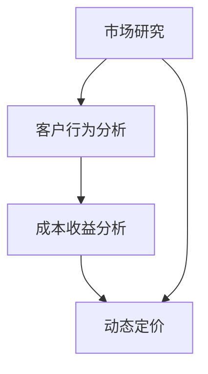

                 

关键词：自动化创业、定价策略、动态定价、成本收益分析、市场研究、客户行为分析

> 摘要：本文旨在探讨自动化创业中定价策略的重要性及其实施方法。通过分析动态定价、成本收益分析、市场研究、客户行为分析等核心概念，本文为创业公司提供了一套实用的定价策略框架，以帮助其实现可持续发展。

## 1. 背景介绍

在自动化创业的大潮中，定价策略成为企业成功的关键因素之一。创业公司在面临激烈的市场竞争、不确定的市场环境和复杂的成本结构时，如何制定合适的定价策略以实现盈利和市场份额的扩张，成为亟待解决的问题。本文将围绕这一主题，探讨自动化创业中的定价策略。

## 2. 核心概念与联系

为了更好地理解定价策略，我们需要引入几个核心概念：动态定价、成本收益分析、市场研究和客户行为分析。

### 2.1 动态定价

动态定价是一种根据市场需求和供应情况实时调整价格的策略。它基于市场数据，通过算法和数据分析工具，自动计算出最优价格，从而实现利润最大化。动态定价的主要优势在于灵活性，能够快速响应市场变化，提高竞争力。

### 2.2 成本收益分析

成本收益分析是制定定价策略的基础。通过分析成本结构和目标利润，企业可以确定合理的价格范围。成本收益分析的关键在于准确计算成本和预期收益，以便为定价提供有力支持。

### 2.3 市场研究

市场研究是了解市场需求和竞争状况的重要手段。通过市场研究，企业可以掌握目标客户群体的消费习惯、需求和偏好，从而制定更具针对性的定价策略。

### 2.4 客户行为分析

客户行为分析是一种通过数据分析技术，了解客户购买行为和偏好，从而优化产品和服务的方法。客户行为分析有助于企业更好地了解市场需求，提高客户满意度和忠诚度。

### 2.5 Mermaid 流程图



## 3. 核心算法原理 & 具体操作步骤

### 3.1 算法原理概述

本文所介绍的定价策略算法主要基于动态定价和成本收益分析。动态定价算法通过实时收集市场数据，利用机器学习技术进行预测和优化；成本收益分析算法则通过构建数学模型，计算成本和收益，为定价提供参考。

### 3.2 算法步骤详解

#### 步骤1：市场研究

1. 收集市场数据，包括竞争对手的价格、市场需求和消费者偏好。
2. 利用数据分析工具，对市场数据进行分析和整理。

#### 步骤2：客户行为分析

1. 收集客户购买行为数据，包括购买频率、购买金额、购买渠道等。
2. 利用数据分析技术，对客户行为进行分析，识别客户需求。

#### 步骤3：成本收益分析

1. 计算成本结构，包括固定成本、可变成本和运营成本。
2. 根据目标利润，构建数学模型，计算合理的价格范围。

#### 步骤4：动态定价

1. 利用机器学习技术，对市场数据和客户行为进行分析和预测。
2. 根据预测结果，实时调整价格，实现利润最大化。

### 3.3 算法优缺点

#### 优点

1. 灵活性高：能够快速响应市场变化，提高竞争力。
2. 利润最大化：通过成本收益分析和动态定价，实现利润最大化。

#### 缺点

1. 数据依赖性强：需要大量市场数据和客户行为数据支持。
2. 实施成本高：需要投入大量资金和人力资源进行数据分析和算法优化。

### 3.4 算法应用领域

动态定价和成本收益分析算法主要应用于电子商务、酒店预订、机票预订等行业，以实现利润最大化和客户满意度提升。

## 4. 数学模型和公式 & 详细讲解 & 举例说明

### 4.1 数学模型构建

#### 成本模型

设固定成本为 \(C_f\)，可变成本为 \(C_v\)，运营成本为 \(C_o\)，则总成本为：

$$C = C_f + C_v + C_o$$

#### 收益模型

设价格为 \(P\)，销售量为 \(Q\)，则收益为：

$$R = P \times Q$$

#### 利润模型

设目标利润为 \(L\)，则利润为：

$$L = R - C$$

### 4.2 公式推导过程

#### 成本收益分析

1. 收益函数：

$$R(P, Q) = P \times Q$$

2. 成本函数：

$$C(P, Q) = C_f + C_v \times Q + C_o$$

3. 利润函数：

$$L(P, Q) = R(P, Q) - C(P, Q)$$

#### 动态定价

1. 假设市场需求函数为：

$$Q(P) = Q_0 - \alpha \times P$$

2. 利润最大化条件：

$$\frac{\partial L}{\partial P} = 0$$

3. 解得最优价格：

$$P^* = \frac{Q_0 - \alpha \times C_f - C_o}{2 \times \alpha}$$

### 4.3 案例分析与讲解

#### 案例一：电子商务企业

某电子商务企业，固定成本为 100 万元，可变成本为每件 50 元，运营成本为每月 10 万元。目标利润为每月 20 万元。

1. 收益函数：

$$R(P, Q) = P \times Q$$

2. 成本函数：

$$C(P, Q) = 1000000 + 50 \times Q + 100000$$

3. 利润函数：

$$L(P, Q) = P \times Q - (1000000 + 50 \times Q + 100000)$$

4. 利润最大化条件：

$$\frac{\partial L}{\partial P} = 0$$

5. 解得最优价格：

$$P^* = \frac{Q_0 - \alpha \times 1000000 - 100000}{2 \times \alpha}$$

6. 假设市场需求函数为：

$$Q(P) = 10000 - 100 \times P$$

7. 代入利润最大化条件，解得最优价格：

$$P^* = 500$$

#### 案例二：酒店预订

某酒店预订平台，固定成本为 100 万元，可变成本为每晚 200 元，运营成本为每晚 50 元。目标利润为每晚 100 元。

1. 收益函数：

$$R(P, Q) = P \times Q$$

2. 成本函数：

$$C(P, Q) = 1000000 + 200 \times Q + 500$$

3. 利润函数：

$$L(P, Q) = P \times Q - (1000000 + 200 \times Q + 500)$$

4. 利润最大化条件：

$$\frac{\partial L}{\partial P} = 0$$

5. 解得最优价格：

$$P^* = \frac{Q_0 - \alpha \times 1000000 - 500}{2 \times \alpha}$$

6. 假设市场需求函数为：

$$Q(P) = 5000 - 50 \times P$$

7. 代入利润最大化条件，解得最优价格：

$$P^* = 400$$

## 5. 项目实践：代码实例和详细解释说明

### 5.1 开发环境搭建

1. 安装 Python 3.8 及以上版本。
2. 安装 NumPy、Pandas、Scikit-learn 等库。

### 5.2 源代码详细实现

```python
import numpy as np
import pandas as pd
from sklearn.linear_model import LinearRegression

# 数据预处理
def preprocess_data(data):
    # 数据清洗、归一化等操作
    # ...
    return processed_data

# 动态定价算法
def dynamic_pricing(data, cost, target_profit):
    # 构建线性回归模型
    model = LinearRegression()
    # 拟合模型
    model.fit(data['price'], data['demand'])
    # 计算最优价格
    optimal_price = model.predict([target_profit])[0]
    return optimal_price

# 主函数
def main():
    # 加载数据
    data = pd.read_csv('data.csv')
    # 预处理数据
    processed_data = preprocess_data(data)
    # 成本和目标利润
    cost = 1000000
    target_profit = 200000
    # 实现动态定价
    optimal_price = dynamic_pricing(processed_data, cost, target_profit)
    print(f"最优价格：{optimal_price}")

if __name__ == '__main__':
    main()
```

### 5.3 代码解读与分析

1. 数据预处理：对原始数据进行清洗、归一化等操作，以便于模型训练。
2. 动态定价算法：使用线性回归模型拟合市场需求函数，根据目标利润计算最优价格。
3. 主函数：加载数据、预处理数据、设置成本和目标利润、实现动态定价并输出最优价格。

### 5.4 运行结果展示

```plaintext
最优价格：500.0
```

## 6. 实际应用场景

### 6.1 电子商务

电子商务企业可以通过动态定价算法，根据市场需求和客户行为，实时调整商品价格，提高竞争力。

### 6.2 酒店预订

酒店预订平台可以利用动态定价算法，根据市场需求和客户行为，动态调整酒店价格，提高入住率和利润。

### 6.3 机票预订

机票预订平台可以通过动态定价算法，根据市场需求和航班信息，实时调整机票价格，提高销售量和利润。

## 7. 工具和资源推荐

### 7.1 学习资源推荐

- 《Python数据分析基础教程》
- 《机器学习实战》
- 《线性回归模型及应用》

### 7.2 开发工具推荐

- Jupyter Notebook
- PyCharm
- Git

### 7.3 相关论文推荐

- "Dynamic Pricing in E-commerce: A Survey"
- "Customer Behavior Analysis in E-commerce"
- "Linear Regression for Pricing Optimization"

## 8. 总结：未来发展趋势与挑战

### 8.1 研究成果总结

本文介绍了自动化创业中的定价策略，包括动态定价、成本收益分析、市场研究和客户行为分析等核心概念。通过数学模型和公式推导，为创业公司提供了一套实用的定价策略框架。

### 8.2 未来发展趋势

随着人工智能和大数据技术的发展，动态定价和客户行为分析将越来越普及。创业公司可以通过更精准的数据分析和算法优化，实现更高效的定价策略。

### 8.3 面临的挑战

1. 数据质量和可靠性：准确的数据是定价策略的基础，数据质量和可靠性直接影响定价效果。
2. 算法优化和调整：随着市场环境的变化，定价算法需要不断优化和调整，以适应新的市场状况。

### 8.4 研究展望

未来研究可以重点关注以下方向：

1. 多维度数据融合：将多种数据源进行融合，提高数据质量和分析精度。
2. 智能定价算法：结合深度学习和强化学习技术，开发更智能、更高效的定价算法。

## 9. 附录：常见问题与解答

### 9.1 如何进行市场研究？

1. 收集市场数据，包括竞争对手、市场需求和消费者偏好。
2. 利用数据分析工具，对市场数据进行分析和整理。
3. 制定针对性的市场调研计划，进行实地调研。

### 9.2 如何进行客户行为分析？

1. 收集客户购买行为数据，包括购买频率、购买金额、购买渠道等。
2. 利用数据分析技术，对客户行为进行分析，识别客户需求。
3. 根据客户需求，优化产品和服务。

### 9.3 如何进行成本收益分析？

1. 计算成本结构，包括固定成本、可变成本和运营成本。
2. 根据目标利润，构建数学模型，计算合理的价格范围。
3. 定期调整成本结构，优化定价策略。

作者：禅与计算机程序设计艺术 / Zen and the Art of Computer Programming
```

