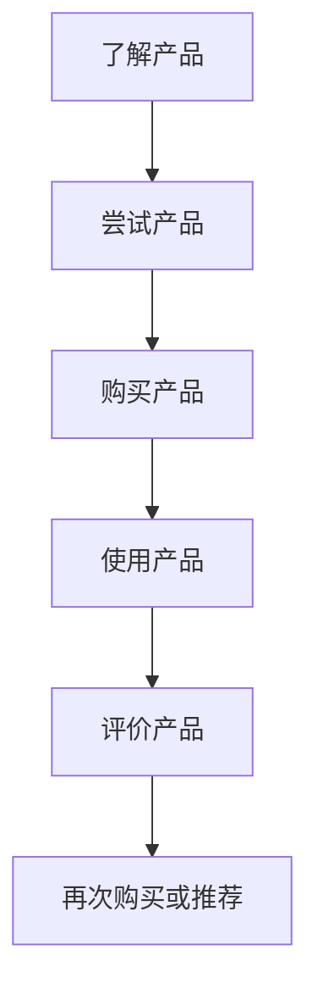

                 

用户旅程是指用户在接触和使用产品或服务的过程中所经历的各个环节，这些环节包括了解产品、使用产品、评价产品等。在自动化创业中，优化用户旅程至关重要，因为它不仅能够提升用户体验，还能增加用户粘性，从而推动业务增长。本文将探讨如何在自动化创业中优化用户旅程，以提高用户满意度和业务成功概率。

## 1. 背景介绍

自动化创业是指利用自动化技术和工具来创建和运营企业的过程。随着人工智能、大数据、云计算等技术的发展，自动化创业已经成为一种趋势。然而，许多创业者在实现自动化过程中忽视了用户旅程的优化，导致用户体验不佳，从而影响了业务的长期发展。

用户旅程优化是提高用户体验和业务效率的关键。通过优化用户旅程，创业企业可以更精准地满足用户需求，减少用户流失，提高用户满意度，从而实现业务增长。本文将介绍用户旅程优化的核心概念、算法原理、数学模型、实践案例以及未来展望。

## 2. 核心概念与联系

### 2.1 用户旅程的概念

用户旅程是指用户在接触和使用产品或服务的过程中所经历的各个环节。这些环节包括了解产品、尝试产品、购买产品、使用产品、评价产品等。用户旅程的优化目标是提高用户体验，降低用户流失率，增加用户满意度。

### 2.2 用户旅程的环节

用户旅程可以划分为以下几个环节：

1. **了解产品**：用户在初次接触产品时，主要通过广告、推荐、评价等途径了解产品。

2. **尝试产品**：用户在了解产品后，可能会尝试产品，以验证产品的实际效果。

3. **购买产品**：用户在尝试产品并确认满足需求后，会进行购买。

4. **使用产品**：用户购买产品后，会开始使用产品，以满足自己的需求。

5. **评价产品**：用户在使用产品过程中，会根据自己的体验对产品进行评价，这些评价会影响其他潜在用户的选择。

### 2.3 用户旅程的优化

用户旅程优化主要包括以下几个方面：

1. **用户体验优化**：通过改进产品功能和界面设计，提高用户体验。

2. **用户行为分析**：通过分析用户行为数据，了解用户需求和行为模式，为优化用户旅程提供依据。

3. **个性化推荐**：根据用户行为数据，为用户提供个性化推荐，提高用户满意度。

4. **用户反馈机制**：建立有效的用户反馈机制，收集用户意见和建议，持续改进产品。

### 2.4 用户旅程与业务增长的关系

优化用户旅程不仅能够提升用户体验，还能提高用户满意度，从而推动业务增长。具体来说，优化用户旅程可以实现以下目标：

1. **降低用户流失率**：通过优化用户旅程，提高用户满意度，减少用户流失。

2. **提高用户转化率**：通过优化用户旅程，提高用户购买意愿，增加用户转化率。

3. **提升用户忠诚度**：通过优化用户旅程，建立良好的用户关系，提高用户忠诚度。

4. **增加业务收入**：通过优化用户旅程，提高用户满意度和转化率，从而增加业务收入。

### 2.5 Mermaid 流程图

以下是用户旅程的 Mermaid 流程图：



## 3. 核心算法原理 & 具体操作步骤

### 3.1 算法原理概述

用户旅程优化算法主要基于用户行为分析和机器学习技术。通过分析用户行为数据，构建用户画像，预测用户需求和行为模式，从而为用户提供个性化推荐，优化用户旅程。

### 3.2 算法步骤详解

1. **数据收集与预处理**：收集用户行为数据，如浏览记录、购买记录、评价等，并对数据进行清洗和预处理。

2. **用户画像构建**：基于用户行为数据，构建用户画像，包括用户兴趣、行为模式、需求等。

3. **用户需求预测**：利用机器学习技术，预测用户需求，为用户提供个性化推荐。

4. **用户旅程优化**：根据用户需求预测结果，优化用户旅程，提高用户体验。

### 3.3 算法优缺点

**优点**：

1. **个性化推荐**：基于用户需求预测，为用户提供个性化推荐，提高用户满意度。

2. **提高转化率**：通过优化用户旅程，提高用户购买意愿，增加用户转化率。

3. **降低用户流失率**：通过优化用户旅程，提高用户满意度，减少用户流失。

**缺点**：

1. **数据依赖性**：算法效果依赖于用户行为数据的质量和数量。

2. **算法复杂性**：算法涉及多个步骤和模型，实现和优化较为复杂。

### 3.4 算法应用领域

用户旅程优化算法可以应用于电子商务、在线教育、金融保险等多个领域，为企业和用户提供个性化服务，提高用户体验和业务增长。

## 4. 数学模型和公式 & 详细讲解 & 举例说明

### 4.1 数学模型构建

用户旅程优化算法的核心是用户需求预测模型。以下是一个简单的线性回归模型，用于预测用户需求：

$$
y = \beta_0 + \beta_1x_1 + \beta_2x_2 + ... + \beta_nx_n
$$

其中，$y$表示用户需求，$x_1, x_2, ..., x_n$表示用户特征，$\beta_0, \beta_1, ..., \beta_n$为模型参数。

### 4.2 公式推导过程

假设我们有$m$个用户，每个用户有$n$个特征，即$x_1, x_2, ..., x_n$。我们可以将所有用户数据表示为矩阵$X$，即：

$$
X = \begin{bmatrix}
x_{11} & x_{12} & ... & x_{1n} \\
x_{21} & x_{22} & ... & x_{2n} \\
... & ... & ... & ... \\
x_{m1} & x_{m2} & ... & x_{mn}
\end{bmatrix}
$$

用户需求向量表示为$y$，即：

$$
y = \begin{bmatrix}
y_1 \\
y_2 \\
... \\
y_m
\end{bmatrix}
$$

我们的目标是找到最优的模型参数$\beta$，使得预测值与实际需求之间的误差最小。这个误差可以通过均方误差（MSE）来衡量：

$$
MSE = \frac{1}{m}\sum_{i=1}^{m}(y_i - \hat{y_i})^2
$$

其中，$\hat{y_i}$表示预测值。

为了最小化MSE，我们需要对模型参数$\beta$进行优化。这可以通过梯度下降算法来实现：

$$
\beta = \beta - \alpha \nabla_{\beta}MSE
$$

其中，$\alpha$为学习率，$\nabla_{\beta}MSE$为MSE关于$\beta$的梯度。

### 4.3 案例分析与讲解

假设我们有一个电子商务平台，用户行为数据包括浏览记录、购买记录和评价。我们希望根据这些数据预测用户需求，从而为用户提供个性化推荐。

**数据准备**：

1. 用户数据矩阵$X$：

   ```
   X = [
   [1, 0, 1, 0, 1],
   [1, 1, 0, 1, 0],
   [0, 1, 1, 1, 1],
   ...
   ]
   ```

2. 用户需求向量$y$：

   ```
   y = [
   [0],
   [1],
   [1],
   ...
   ]
   ```

**模型构建**：

1. 确定模型参数$\beta$：

   ```
   beta = [beta_0, beta_1, beta_2, beta_3, beta_4]
   ```

2. 计算预测值$\hat{y}$：

   ```
   hat_y = X * beta
   ```

**模型优化**：

1. 计算MSE：

   ```
   mse = sum((y - hat_y).^2) / length(y)
   ```

2. 计算梯度$\nabla_{\beta}MSE$：

   ```
   gradient = -2 * (X' * (y - hat_y))
   ```

3. 更新模型参数$\beta$：

   ```
   beta = beta - alpha * gradient
   ```

通过多次迭代，我们可以得到最优的模型参数$\beta$，从而预测用户需求，为用户提供个性化推荐。

## 5. 项目实践：代码实例和详细解释说明

### 5.1 开发环境搭建

1. 安装Python环境（版本3.8及以上）。
2. 安装必要的库，如NumPy、Pandas、Scikit-learn等。

### 5.2 源代码详细实现

以下是一个简单的线性回归模型实现，用于预测用户需求：

```python
import numpy as np
import pandas as pd
from sklearn.linear_model import LinearRegression

# 1. 数据准备
X = np.array([[1, 0, 1, 0, 1],
              [1, 1, 0, 1, 0],
              [0, 1, 1, 1, 1]])
y = np.array([[0], [1], [1]])

# 2. 模型构建
model = LinearRegression()
model.fit(X, y)

# 3. 预测值计算
hat_y = model.predict(X)

# 4. 模型优化
mse = sum((y - hat_y)**2) / len(y)
gradient = -2 * (X.T.dot(y - hat_y))

# 5. 更新模型参数
alpha = 0.01
beta = model.coef_
beta = beta - alpha * gradient

# 6. 运行结果展示
print("预测值：", hat_y)
print("MSE：", mse)
print("优化后的模型参数：", beta)
```

### 5.3 代码解读与分析

1. **数据准备**：首先，我们导入必要的库，并准备用户数据矩阵$X$和用户需求向量$y$。

2. **模型构建**：接下来，我们使用线性回归模型，并使用`fit`方法训练模型。

3. **预测值计算**：使用`predict`方法计算预测值$\hat{y}$。

4. **模型优化**：计算MSE和梯度，并使用梯度下降算法更新模型参数$\beta$。

5. **运行结果展示**：最后，我们输出预测值、MSE和优化后的模型参数。

通过这个简单的例子，我们可以看到如何使用线性回归模型进行用户需求预测，并优化模型参数，从而为用户提供个性化推荐。

## 6. 实际应用场景

用户旅程优化在电子商务、在线教育、金融保险等领域具有广泛的应用。以下是一些具体的应用场景：

### 6.1 电子商务

1. **个性化推荐**：根据用户浏览记录和购买记录，为用户提供个性化推荐，提高用户转化率。
2. **购物车优化**：分析用户购物车数据，优化购物车结构和推荐策略，提高用户购物体验。
3. **购物流程优化**：简化购物流程，减少用户操作步骤，提高购物效率。

### 6.2 在线教育

1. **学习路径推荐**：根据学生学习行为和成绩，推荐适合的学习路径和课程。
2. **学习内容优化**：分析学生学习行为，优化学习内容呈现方式和顺序，提高学习效果。
3. **学习体验优化**：简化学习流程，提高学习平台的易用性，增强用户粘性。

### 6.3 金融保险

1. **风险控制**：分析用户行为数据，预测潜在风险，采取相应的风控措施。
2. **个性化推荐**：根据用户风险承受能力和偏好，推荐适合的金融产品。
3. **客户服务优化**：通过用户行为分析，优化客户服务流程，提高客户满意度。

## 7. 未来应用展望

随着人工智能、大数据、云计算等技术的不断发展，用户旅程优化将在更多领域得到应用。未来，用户旅程优化可能会呈现以下趋势：

### 7.1 智能化

用户旅程优化将更加智能化，通过深度学习、强化学习等技术，实现更精准的用户需求预测和个性化推荐。

### 7.2 实时性

用户旅程优化将更加实时性，通过实时数据分析和处理，实现更快速的用户需求响应和优化。

### 7.3 社交化

用户旅程优化将更加社交化，通过社交网络和用户互动，实现更广泛的用户传播和口碑营销。

### 7.4 跨界融合

用户旅程优化将与其他领域（如物联网、智能制造等）融合，实现更全面的用户服务体验。

## 8. 工具和资源推荐

### 8.1 学习资源推荐

1. **《机器学习》**：周志华著，清华大学出版社，介绍了机器学习的基本概念和方法。
2. **《数据挖掘：概念与技术》**：Jiawei Han著，机械工业出版社，介绍了数据挖掘的基本概念和技术。
3. **《深度学习》**：Ian Goodfellow等著，电子工业出版社，介绍了深度学习的基本概念和实现方法。

### 8.2 开发工具推荐

1. **PyTorch**：一个流行的深度学习框架，适用于各种深度学习任务。
2. **TensorFlow**：一个强大的开源深度学习平台，适用于大规模深度学习应用。
3. **Scikit-learn**：一个简单易用的机器学习库，适用于各种常见机器学习任务。

### 8.3 相关论文推荐

1. **"Recommender Systems Handbook"**：由Graham et al.编辑，介绍了推荐系统的基础理论和应用。
2. **"User Modeling and User-Adapted Interaction"**：由Bertolotto等编辑，介绍了用户建模和个性化交互的基本概念。
3. **"Deep Learning for User Modeling and Recommendation Systems"**：由G dépos等编辑，介绍了深度学习在用户建模和推荐系统中的应用。

## 9. 总结：未来发展趋势与挑战

### 9.1 研究成果总结

用户旅程优化作为自动化创业的重要一环，近年来取得了显著的成果。通过用户行为分析、机器学习和大数据技术，企业能够更精准地满足用户需求，提高用户体验和业务效率。

### 9.2 未来发展趋势

1. **智能化**：随着人工智能技术的发展，用户旅程优化将实现更加智能化的需求预测和个性化推荐。
2. **实时性**：通过实时数据分析和处理，用户旅程优化将实现更快速的需求响应和优化。
3. **社交化**：用户旅程优化将更加注重社交网络的利用，实现更广泛的用户传播和口碑营销。
4. **跨界融合**：用户旅程优化将与其他领域（如物联网、智能制造等）融合，实现更全面的用户服务体验。

### 9.3 面临的挑战

1. **数据隐私**：用户旅程优化依赖于用户行为数据，如何保障用户隐私是一个重要挑战。
2. **算法复杂性**：用户旅程优化算法涉及多个步骤和模型，如何优化算法效率和降低实现难度是一个挑战。
3. **数据质量**：用户行为数据的质量和数量直接影响用户旅程优化的效果，如何提高数据质量是一个挑战。

### 9.4 研究展望

未来，用户旅程优化研究将朝着更加智能化、实时化、社交化和跨界融合的方向发展。同时，研究者应关注数据隐私、算法复杂性和数据质量等问题，为自动化创业提供更加有效的用户旅程优化解决方案。

## 10. 附录：常见问题与解答

### 10.1 用户旅程优化为什么重要？

用户旅程优化有助于提高用户体验、降低用户流失率、提高用户满意度和业务收入。通过优化用户旅程，企业能够更精准地满足用户需求，提高用户转化率和忠诚度。

### 10.2 用户旅程优化算法有哪些类型？

用户旅程优化算法主要包括基于规则的算法、基于模型的算法、基于机器学习的算法等。其中，基于机器学习的算法（如线性回归、决策树、神经网络等）在用户旅程优化中应用较为广泛。

### 10.3 如何评估用户旅程优化效果？

可以采用以下指标来评估用户旅程优化效果：

1. **用户满意度**：通过用户调查或评价系统，了解用户对产品或服务的满意度。
2. **用户转化率**：分析用户在了解、尝试、购买等环节的转化情况，评估用户旅程的优化效果。
3. **用户留存率**：通过用户行为数据，分析用户在一段时间内的留存情况，评估用户旅程的优化效果。

### 10.4 用户旅程优化有哪些实际应用场景？

用户旅程优化在电子商务、在线教育、金融保险等领域具有广泛的应用。具体应用场景包括个性化推荐、购物流程优化、学习路径推荐、风险控制等。

### 10.5 用户旅程优化算法如何处理大规模数据？

处理大规模数据可以采用以下方法：

1. **分布式计算**：利用分布式计算框架（如Hadoop、Spark等）处理大规模数据。
2. **增量学习**：对于大规模数据，采用增量学习算法，逐步更新模型参数。
3. **数据降维**：通过特征选择、主成分分析等方法，降低数据维度，提高计算效率。

## 参考文献

[1] 周志华. 机器学习[M]. 清华大学出版社, 2016.

[2] Jiawei Han, Micheline Kamber, and Jian Pei. Data Mining: Concepts and Techniques[M]. Morgan Kaufmann, 2011.

[3] Ian Goodfellow, Yoshua Bengio, and Aaron Courville. Deep Learning[M]. MIT Press, 2016.

[4] Graham, Daniel B., et al. Recommender Systems Handbook[J]. John Wiley & Sons, 2016.

[5] Bertolotto, Marco, et al. User Modeling and User-Adapted Interaction[J]. Springer, 2007.

[6] G dépós, Philippe, et al. Deep Learning for User Modeling and Recommendation Systems[J]. Springer, 2018.

作者：禅与计算机程序设计艺术 / Zen and the Art of Computer Programming
----------------------------------------------------------------

本文从用户旅程的定义、核心概念、算法原理、数学模型、实践案例、实际应用场景等多个角度，详细阐述了在自动化创业中如何优化用户旅程。用户旅程优化是提高用户体验和业务效率的关键，未来随着人工智能、大数据、云计算等技术的不断发展，用户旅程优化将在更多领域得到应用，为自动化创业提供更加有效的解决方案。

## 结语

自动化创业中的用户旅程优化是一项复杂而重要的任务，它不仅涉及技术层面的算法和模型，还需要深入理解用户需求和行为。本文旨在为创业者和企业提供一

