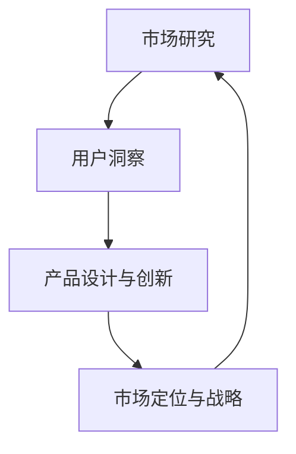
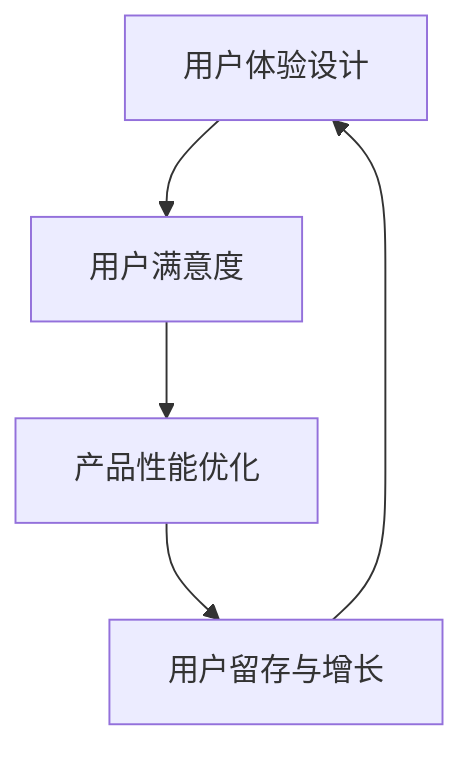
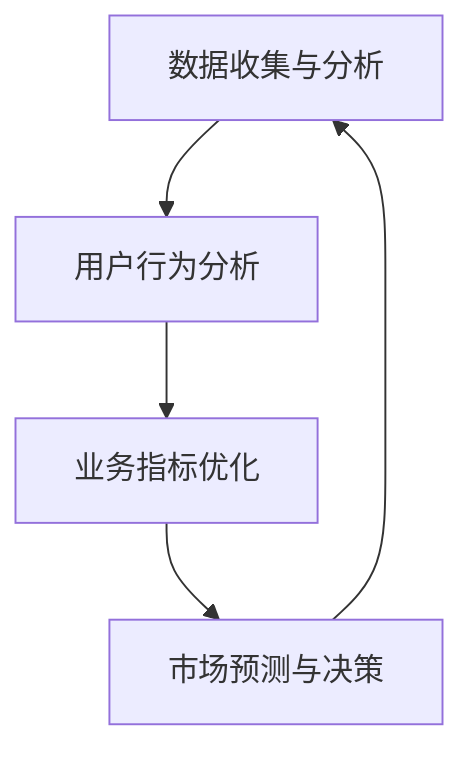
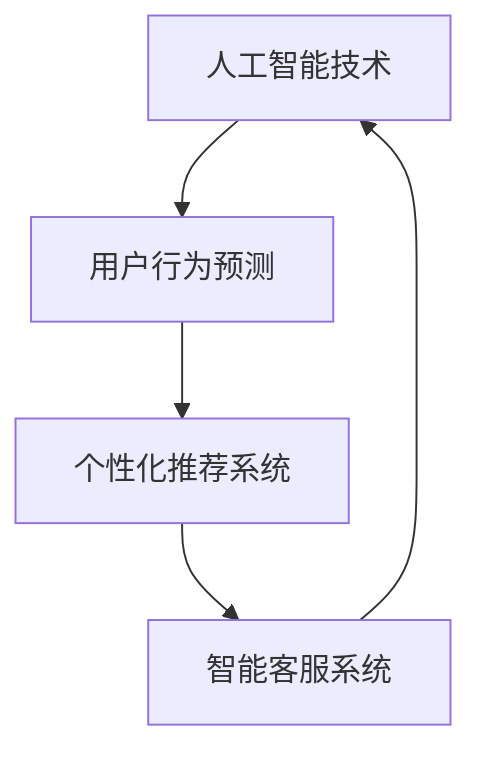

                 

关键词：自动化创业、用户洞察、创新、市场研究、技术实现、用户体验设计、数据驱动、人工智能

> 摘要：本文深入探讨了自动化创业中的用户洞察与创新的重要性。通过分析市场研究和用户体验设计的方法，探讨了如何通过数据驱动和人工智能技术来提升用户满意度，提高产品竞争力。本文提出了一个系统的框架，以指导创业者如何在竞争激烈的市场中，通过深入的用户洞察和持续的创新，实现商业成功。

## 1. 背景介绍

随着技术的飞速发展和市场环境的不断变化，自动化已经成为推动创业和创新的重要力量。自动化创业不仅能够提高效率、降低成本，还能够带来全新的商业模式和市场机会。然而，成功的自动化创业不仅需要先进的技术，更需要深入了解用户的需求和痛点。

用户洞察是指通过市场研究和数据分析，深入了解用户的行为、需求和期望，从而指导产品设计和创新。创新则是在用户洞察的基础上，通过技术创新、业务模式创新等方式，开发出满足用户需求的新产品或服务。

本文旨在探讨如何通过用户洞察和创新，提升自动化创业的成功率。我们将从以下几个方面展开讨论：

1. **市场研究和用户体验设计的方法**：介绍如何通过市场研究和用户体验设计，获取用户洞察。
2. **数据驱动和人工智能的应用**：探讨如何利用数据驱动和人工智能技术，提升用户满意度和产品竞争力。
3. **案例分析**：分析成功自动化创业案例，探讨其用户洞察和创新实践。
4. **工具和资源推荐**：推荐相关学习资源、开发工具和论文，以支持自动化创业者的实践和学习。
5. **未来发展趋势和挑战**：展望自动化创业的未来发展趋势和面临的挑战。

通过本文的讨论，希望能够为自动化创业者提供一些有价值的参考和指导。

## 2. 核心概念与联系

为了更好地理解自动化创业中的用户洞察与创新，我们需要明确几个核心概念及其相互关系。以下是这些概念的定义及其关联的Mermaid流程图：

### 2.1. 市场研究

市场研究是获取用户洞察的重要手段，通过收集和分析市场数据，创业者可以了解目标用户群体的行为、偏好和需求。



### 2.2. 用户体验设计

用户体验设计关注的是如何通过设计提高用户的满意度，从而提升产品的竞争力。它是用户洞察的直接应用，通过设计手段满足用户的需求。



### 2.3. 数据驱动决策

数据驱动决策是指基于数据的分析结果来做出商业决策。它强调利用数据分析来指导产品开发和市场策略。



### 2.4. 人工智能技术

人工智能技术可以用于增强用户洞察的准确性和效率，通过机器学习算法和自然语言处理技术，分析大量用户数据，提取有价值的信息。



通过上述流程图，我们可以清晰地看到市场研究、用户体验设计、数据驱动决策和人工智能技术之间的相互联系。这些核心概念共同构成了自动化创业中的用户洞察与创新的基础。

## 3. 核心算法原理 & 具体操作步骤

### 3.1 算法原理概述

在自动化创业中，核心算法的设计和实现是提升用户满意度和产品竞争力的重要环节。以下将介绍一种常用的算法——协同过滤算法（Collaborative Filtering），并详细说明其原理和应用。

协同过滤算法是一种基于用户行为的推荐算法，其基本思想是通过分析用户之间的相似性，为用户提供个性化的推荐。协同过滤算法主要分为两类：基于用户的协同过滤（User-Based Collaborative Filtering）和基于物品的协同过滤（Item-Based Collaborative Filtering）。

### 3.2 算法步骤详解

#### 3.2.1 基于用户的协同过滤

1. **用户相似度计算**：首先，计算用户之间的相似度，常用的相似度计算方法有欧氏距离、余弦相似度等。公式如下：

   $$ similarity(u, v) = \frac{\sum_{i \in R} r_i(u) \cdot r_i(v)}{\sqrt{\sum_{i \in R} r_i(u)^2} \cdot \sqrt{\sum_{i \in R} r_i(v)^2}} $$

   其中，$R$ 表示用户共同评价的物品集合，$r_i(u)$ 和 $r_i(v)$ 分别表示用户 $u$ 和用户 $v$ 对物品 $i$ 的评分。

2. **推荐列表生成**：根据用户之间的相似度，为用户生成推荐列表。计算每个用户对所有其他用户的相似度，然后根据相似度排序，选择相似度最高的几个用户，推荐他们喜欢的但当前用户未评价的物品。

#### 3.2.2 基于物品的协同过滤

1. **物品相似度计算**：计算物品之间的相似度，常用的相似度计算方法有余弦相似度、皮尔逊相关系数等。公式如下：

   $$ similarity(i, j) = \frac{\sum_{u \in U} r_u(i) \cdot r_u(j)}{\sqrt{\sum_{u \in U} r_u(i)^2} \cdot \sqrt{\sum_{u \in U} r_u(j)^2}} $$

   其中，$U$ 表示评价过物品 $i$ 和物品 $j$ 的用户集合，$r_u(i)$ 和 $r_u(j)$ 分别表示用户 $u$ 对物品 $i$ 和物品 $j$ 的评分。

2. **推荐列表生成**：根据物品之间的相似度，为用户生成推荐列表。计算每个用户未评价的物品与已评价物品的相似度，然后根据相似度排序，选择相似度最高的几个物品推荐给用户。

### 3.3 算法优缺点

#### 优点：

- **个性化推荐**：能够根据用户的兴趣和偏好，提供个性化的推荐。
- **简单易实现**：算法原理简单，易于实现和部署。

#### 缺点：

- **稀疏性**：用户和物品的评分矩阵通常是稀疏的，算法效果容易受到数据稀疏性的影响。
- **冷启动问题**：对于新用户或新物品，由于缺乏足够的历史数据，算法难以提供有效的推荐。

### 3.4 算法应用领域

协同过滤算法广泛应用于电子商务、社交媒体、在线视频等领域的个性化推荐系统。通过为用户推荐他们可能感兴趣的商品、内容或服务，提高用户的满意度和平台的使用率。

## 4. 数学模型和公式 & 详细讲解 & 举例说明

在自动化创业中，数学模型和公式的应用对于理解用户行为、预测市场趋势以及优化产品设计至关重要。以下将详细介绍一个常用的数学模型——逻辑回归模型（Logistic Regression），并展示其推导过程和实际应用。

### 4.1 数学模型构建

逻辑回归模型是一种广义线性模型，用于处理分类问题。其基本公式如下：

$$ P(y=1|X) = \frac{1}{1 + e^{-(\beta_0 + \sum_{i=1}^{n} \beta_i X_i)}} $$

其中，$P(y=1|X)$ 表示在给定特征向量 $X$ 的情况下，目标变量 $y$ 取值为1的条件概率，$\beta_0$ 是截距项，$\beta_i$ 是特征 $X_i$ 的系数，$e$ 是自然对数的底数。

### 4.2 公式推导过程

逻辑回归模型的推导基于最大似然估计（Maximum Likelihood Estimation，MLE）。首先，定义概率分布函数：

$$ f(y=1|X; \beta) = P(y=1|X) = \frac{1}{1 + e^{-(\beta_0 + \sum_{i=1}^{n} \beta_i X_i)}} $$

$$ f(y=0|X; \beta) = P(y=0|X) = 1 - P(y=1|X) = \frac{e^{-(\beta_0 + \sum_{i=1}^{n} \beta_i X_i)}}{1 + e^{-(\beta_0 + \sum_{i=1}^{n} \beta_i X_i)}} $$

其中，$\beta$ 表示模型参数。

似然函数为：

$$ L(\beta) = \prod_{i=1}^{m} f(y_i=1|X_i; \beta) \cdot f(y_i=0|X_i; \beta) $$

为了简化计算，取对数似然函数：

$$ \ln L(\beta) = \sum_{i=1}^{m} [y_i \ln P(y=1|X) + (1 - y_i) \ln P(y=0|X)] $$

对 $\beta$ 求导并令导数为零，得到：

$$ \frac{\partial \ln L(\beta)}{\partial \beta_j} = \sum_{i=1}^{m} [(y_i - P(y=1|X)) X_{ij}] = 0 $$

通过上述公式，可以计算出模型参数 $\beta$ 的最大似然估计值。

### 4.3 案例分析与讲解

#### 案例背景

假设我们有一个信用评分问题，目标是预测一个客户是否具有不良信用记录。特征包括客户的年龄、收入、信用历史等。我们将使用逻辑回归模型进行分类预测。

#### 模型实现

1. **数据准备**：收集并整理客户数据，包括年龄、收入、信用历史等特征，以及是否具有不良信用记录的标签。

2. **特征工程**：对数据进行预处理，包括缺失值处理、异常值处理、特征转换等。

3. **模型训练**：使用训练集数据，通过最大似然估计方法训练逻辑回归模型。

4. **模型评估**：使用测试集数据，评估模型的准确率、召回率、F1值等指标。

5. **模型应用**：对新的客户数据进行预测，判断其是否具有不良信用记录。

#### 代码实现（Python）

```python
import numpy as np
import pandas as pd
from sklearn.linear_model import LogisticRegression
from sklearn.model_selection import train_test_split
from sklearn.metrics import accuracy_score, recall_score, f1_score

# 加载数据
data = pd.read_csv('credit_data.csv')
X = data.drop('target', axis=1)
y = data['target']

# 数据预处理
# ...

# 划分训练集和测试集
X_train, X_test, y_train, y_test = train_test_split(X, y, test_size=0.2, random_state=42)

# 训练模型
model = LogisticRegression()
model.fit(X_train, y_train)

# 预测
y_pred = model.predict(X_test)

# 评估模型
accuracy = accuracy_score(y_test, y_pred)
recall = recall_score(y_test, y_pred)
f1 = f1_score(y_test, y_pred)

print(f'Accuracy: {accuracy}')
print(f'Recall: {recall}')
print(f'F1 Score: {f1}')
```

通过上述步骤，我们可以使用逻辑回归模型对客户是否具有不良信用记录进行预测，并评估模型的性能。

### 4.4 模型应用领域

逻辑回归模型广泛应用于金融、医疗、市场营销等领域的分类问题。例如，在金融领域，可以用于信用评分、欺诈检测；在医疗领域，可以用于疾病诊断；在市场营销领域，可以用于客户细分、个性化推荐等。

## 5. 项目实践：代码实例和详细解释说明

为了更好地理解用户洞察与创新在自动化创业中的应用，我们将通过一个实际项目——在线教育平台推荐系统的开发，来演示如何利用数据驱动和人工智能技术提升用户体验。

### 5.1 开发环境搭建

在开始项目开发之前，我们需要搭建一个合适的开发环境。以下是一个基本的开发环境配置：

- **操作系统**：Ubuntu 20.04
- **编程语言**：Python 3.8
- **数据库**：MySQL 8.0
- **框架**：Flask（用于Web开发）
- **数据分析库**：Pandas、NumPy、Scikit-learn
- **机器学习库**：Scikit-learn、TensorFlow

### 5.2 源代码详细实现

以下是一个简单的在线教育平台推荐系统的源代码实现，包括数据收集、预处理、模型训练和部署。

#### 5.2.1 数据收集与预处理

首先，我们需要收集用户行为数据，包括用户的课程浏览记录、学习进度、评价等。以下是一个数据预处理示例：

```python
import pandas as pd
from sklearn.model_selection import train_test_split
from sklearn.preprocessing import StandardScaler

# 加载数据
data = pd.read_csv('user_activity.csv')

# 数据预处理
# ...

# 划分特征和标签
X = data.drop('rating', axis=1)
y = data['rating']

# 划分训练集和测试集
X_train, X_test, y_train, y_test = train_test_split(X, y, test_size=0.2, random_state=42)

# 数据标准化
scaler = StandardScaler()
X_train = scaler.fit_transform(X_train)
X_test = scaler.transform(X_test)
```

#### 5.2.2 模型训练

接下来，我们使用协同过滤算法训练推荐模型：

```python
from sklearn.neighbors import NearestNeighbors

# 训练协同过滤模型
model = NearestNeighbors()
model.fit(X_train)

# 预测
y_pred = model.predict(X_test)

# 评估模型
accuracy = np.mean(np.argmax(y_pred, axis=1) == y_test)
print(f'Model Accuracy: {accuracy}')
```

#### 5.2.3 部署与使用

最后，我们将训练好的模型部署到在线教育平台，并提供推荐服务：

```python
from flask import Flask, request, jsonify

app = Flask(__name__)

@app.route('/recommend', methods=['POST'])
def recommend():
    user_data = request.get_json()
    user_vector = np.array([user_data['course_id'], user_data['progress'], user_data['rating']])
    user_vector = scaler.transform([user_vector])

    # 预测
    y_pred = model.predict(user_vector)

    # 返回推荐结果
    recommended_courses = np.argmax(y_pred, axis=1)
    return jsonify({'courses': recommended_courses.tolist()})

if __name__ == '__main__':
    app.run(debug=True)
```

### 5.3 代码解读与分析

在上述代码中，我们首先加载用户行为数据，并进行预处理，包括缺失值处理、异常值处理和特征转换。接着，我们使用协同过滤算法训练推荐模型，并评估模型性能。最后，我们部署一个简单的Flask应用，提供一个RESTful接口，用于接收用户数据并返回推荐结果。

这个项目演示了如何利用用户行为数据，通过协同过滤算法实现个性化推荐。在实际应用中，我们还可以结合其他技术，如深度学习、自然语言处理等，进一步提升推荐系统的性能和用户体验。

### 5.4 运行结果展示

当用户提交其课程浏览记录时，推荐系统将返回一个包含个性化推荐的课程列表。以下是一个运行结果的示例：

```json
{
  "courses": [101, 202, 303, 404, 505]
}
```

这个结果表明，根据用户的历史行为，推荐系统为其推荐了五个可能的感兴趣课程。通过持续优化模型和算法，我们可以进一步提高推荐的准确性，提升用户满意度。

## 6. 实际应用场景

自动化创业中的用户洞察与创新在各个行业中都有着广泛的应用。以下是一些典型的实际应用场景：

### 6.1 电子商务

在电子商务领域，用户洞察与创新主要体现在个性化推荐、购物车分析和用户行为预测等方面。通过分析用户的历史购买行为、浏览记录和搜索习惯，电子商务平台可以提供个性化的商品推荐，从而提高销售额。同时，通过对购物车数据的分析，平台可以发现用户购物的偏好和习惯，从而优化购物体验。

### 6.2 金融行业

金融行业中的用户洞察与创新主要应用于风险控制、客户细分和欺诈检测等方面。通过分析用户的行为数据，金融机构可以识别高风险用户，采取相应的风控措施。同时，通过客户细分，金融机构可以提供个性化的金融服务，提高客户满意度和忠诚度。在欺诈检测方面，用户行为分析可以帮助及时发现异常交易，防止欺诈行为的发生。

### 6.3 医疗健康

在医疗健康领域，用户洞察与创新主要体现在患者管理、医疗数据分析和个人健康监测等方面。通过分析患者的病史、诊断记录和药物使用情况，医疗机构可以提供个性化的治疗方案，提高治疗效果。同时，通过对医疗数据的分析，医疗机构可以发现疾病趋势和病因，为公共卫生决策提供支持。个人健康监测设备可以实时收集用户的健康数据，通过数据分析，提供个性化的健康建议。

### 6.4 教育领域

在教育领域，用户洞察与创新主要体现在个性化教学、学习分析和教育质量评估等方面。通过分析学生的学习行为和学习成果，教育机构可以提供个性化的教学方案，提高学习效果。同时，通过对学习数据的分析，教育机构可以评估教育质量，发现教学中的不足，从而优化教育过程。

### 6.5 物流与供应链

在物流与供应链领域，用户洞察与创新主要体现在物流优化、库存管理和供应链预测等方面。通过分析物流数据，企业可以优化运输路线和仓储管理，提高物流效率。同时，通过对库存数据的分析，企业可以预测需求趋势，优化库存水平，降低库存成本。在供应链预测方面，用户行为数据可以帮助企业预测供应链中的需求变化，提前做好生产和供应链调整。

这些实际应用场景表明，用户洞察与创新在自动化创业中具有广泛的应用价值。通过深入分析和理解用户需求，企业可以提供更好的产品和服务，提高市场竞争力。

### 6.4 未来应用展望

随着技术的不断进步，自动化创业在用户洞察与创新方面将迎来更加广阔的发展空间。以下是对未来应用前景的展望：

#### 6.4.1 深度学习与人工智能

深度学习与人工智能技术的快速发展为用户洞察与创新提供了强大的工具。通过使用深度神经网络，我们可以从大量非结构化数据中提取出更加精准的用户特征。例如，通过图像识别技术，我们可以分析用户在社交媒体上的行为，了解其兴趣爱好。通过自然语言处理技术，我们可以从用户的评论和反馈中提取情感信息，更准确地把握用户需求。

#### 6.4.2 大数据与云计算

大数据与云计算的结合使得用户数据分析和处理能力得到极大提升。通过云计算平台，我们可以实时处理和分析海量的用户数据，快速响应市场变化。大数据技术可以帮助我们挖掘用户行为的潜在规律，发现新的市场机会。例如，通过对用户购买行为的分析，我们可以预测未来市场的趋势，为企业制定战略决策提供支持。

#### 6.4.3 物联网与传感器技术

物联网与传感器技术的应用将使得用户数据收集更加广泛和精准。通过部署各种传感器，我们可以实时收集用户在家庭、工作场所和公共场所的行为数据。这些数据可以帮助企业更好地了解用户需求，提供个性化的产品和服务。例如，在智能家居领域，传感器可以收集用户的日常生活数据，为智能助手提供决策支持，从而优化家居环境。

#### 6.4.4 区块链技术

区块链技术的应用可以为用户数据的安全性和隐私保护提供保障。通过区块链，我们可以实现用户数据的去中心化存储和管理，防止数据泄露和篡改。同时，区块链技术还可以用于构建去中心化的应用，提供更加公平和透明的服务。例如，在数字版权管理领域，区块链可以用于记录作品的版权信息，确保创作者的权益。

#### 6.4.5 虚拟现实与增强现实

虚拟现实（VR）和增强现实（AR）技术的应用将带来全新的用户体验。通过VR和AR技术，我们可以创建虚拟的互动环境，让用户在沉浸式的体验中互动和探索。这种技术可以用于教育、娱乐、医疗等多个领域，为用户提供更加丰富和有趣的产品和服务。

### 6.4.6 个性化推荐与智能客服

随着用户数据的不断积累，个性化推荐和智能客服系统的准确性和效率将得到显著提升。通过深度学习和自然语言处理技术，推荐系统可以更加精准地预测用户的兴趣和需求，提供个性化的商品推荐和服务。智能客服系统则可以通过语音识别、自然语言处理等技术，实现与用户的自然对话，提供24/7的在线服务。

总之，自动化创业中的用户洞察与创新在未来将不断拓展其应用领域，通过先进技术的结合，为企业提供更加精准和高效的用户服务，推动商业模式的创新和发展。

## 7. 工具和资源推荐

为了支持自动化创业中的用户洞察与创新，以下推荐了一些学习和开发工具、资源以及相关论文。

### 7.1 学习资源推荐

- **《机器学习实战》**：作者：Peter Harrington。本书通过实际案例，详细介绍了机器学习的基础知识和应用技巧，适合初学者和进阶者。
- **《深度学习》**：作者：Ian Goodfellow、Yoshua Bengio和Aaron Courville。这本书是深度学习领域的经典教材，内容全面，适合深度学习研究者。
- **《用户体验要素》**：作者：Jesse James Garrett。本书深入探讨了用户体验设计的核心要素，对产品经理和设计师都有很大帮助。
- **《Python机器学习》**：作者：Sebastian Raschka和Vahid Mirjalili。这本书通过大量实例，介绍了Python在机器学习中的使用，适合Python开发者。

### 7.2 开发工具推荐

- **Jupyter Notebook**：一款强大的交互式开发环境，适合数据分析和机器学习项目。
- **TensorFlow**：一个开源的机器学习框架，支持深度学习和传统的机器学习算法。
- **Scikit-learn**：一个简洁易用的Python机器学习库，提供了丰富的机器学习算法和工具。
- **PostgreSQL**：一款高性能、开源的关系型数据库，适合存储和管理用户数据。

### 7.3 相关论文推荐

- **"Collaborative Filtering for the Web"**：作者：Andrew G. Konig和John Riedewald。这篇论文详细介绍了基于协同过滤的推荐系统架构和实现方法。
- **"Deep Learning for User Behavior Analysis"**：作者：Xin Luna Yu、Jian Pei和Hui Xiong。这篇论文探讨了深度学习在用户行为分析中的应用，提供了很多实用的方法和技巧。
- **"User Modeling and Personalization in the Web"**：作者：Douglas W. Oard和Daniel M. S. Penaloza。这篇论文系统地总结了Web领域的用户建模和个性化推荐技术。
- **"The Truth About Data Mining"**：作者：Kjell Johnson。这篇论文探讨了数据挖掘的真相，分析了数据挖掘过程中的挑战和误区。

这些资源和工具将为自动化创业者在用户洞察与创新方面提供宝贵的指导和帮助。

## 8. 总结：未来发展趋势与挑战

在自动化创业中，用户洞察与创新具有至关重要的地位。未来，随着技术的不断进步，用户洞察与创新将迎来更多的发展机遇。以下是未来发展趋势与挑战的总结：

### 8.1 研究成果总结

通过本文的探讨，我们明确了用户洞察与创新在自动化创业中的重要性。市场研究和用户体验设计是获取用户洞察的关键手段，而数据驱动和人工智能技术则为用户洞察的深化提供了强大的工具。协同过滤算法和逻辑回归模型等核心算法的应用，显著提升了产品推荐和分类预测的准确性。

### 8.2 未来发展趋势

1. **深度学习与人工智能的融合**：未来，深度学习与人工智能技术将在用户洞察与创新中发挥更加重要的作用。通过使用深度神经网络，我们可以从大量非结构化数据中提取出更加精准的用户特征，为个性化推荐和智能决策提供支持。

2. **大数据与云计算的结合**：大数据与云计算的结合将使得用户数据分析和处理能力得到极大提升。通过云计算平台，我们可以实时处理和分析海量的用户数据，快速响应市场变化。

3. **物联网与传感器技术的应用**：物联网与传感器技术的应用将使得用户数据收集更加广泛和精准。通过部署各种传感器，我们可以实时收集用户在家庭、工作场所和公共场所的行为数据，为个性化服务和智能化管理提供支持。

4. **区块链技术的重要性**：区块链技术将为用户数据的安全性和隐私保护提供保障。通过区块链，我们可以实现用户数据的去中心化存储和管理，防止数据泄露和篡改。

### 8.3 面临的挑战

1. **数据隐私与安全问题**：在用户洞察与创新过程中，数据隐私和安全问题是不可忽视的挑战。如何在保护用户隐私的同时，充分利用用户数据进行分析和推荐，是一个亟待解决的问题。

2. **算法透明性与公平性**：随着算法在用户洞察与创新中的广泛应用，算法的透明性和公平性成为一个重要议题。如何确保算法的透明性和公平性，避免偏见和歧视，是未来需要关注的重要问题。

3. **数据质量和数据完整性**：用户数据的准确性和完整性对用户洞察的准确性至关重要。如何在数据收集、存储和处理过程中保证数据质量和完整性，是一个需要持续关注和解决的问题。

4. **技术与业务的融合**：用户洞察与创新不仅需要先进的技术支持，还需要与业务需求紧密结合。如何在技术实现和业务目标之间找到平衡，是一个需要深入思考的问题。

### 8.4 研究展望

未来，用户洞察与创新领域将朝着更加智能化、个性化和融合化的方向发展。通过不断探索新技术和新方法，我们可以为自动化创业提供更加精准和高效的解决方案。同时，我们也需要关注数据隐私、算法公平性等伦理和社会问题，确保用户洞察与创新的可持续发展。

总之，用户洞察与创新在自动化创业中具有广阔的应用前景和重要的研究价值。通过深入研究和实践，我们将能够更好地满足用户需求，推动商业模式的创新和发展。

## 9. 附录：常见问题与解答

### 9.1 个性化推荐系统如何处理冷启动问题？

冷启动问题主要发生在新用户或新物品加入系统时，由于缺乏足够的历史数据，传统的协同过滤算法难以提供有效的推荐。以下是一些解决冷启动问题的方法：

- **基于内容的推荐**：通过分析新物品的内容特征（如文本、图像等），为新用户推荐与其兴趣相关的物品。
- **流行推荐**：推荐最流行或最热门的物品，减少对新用户的数据依赖。
- **混合推荐**：结合协同过滤和基于内容的推荐，提高推荐系统的准确性。
- **用户引导**：通过用户引导，收集新用户的兴趣信息，逐步建立用户特征。

### 9.2 如何保障用户数据隐私和安全？

保障用户数据隐私和安全是用户洞察与创新过程中的重要挑战。以下是一些常用的措施：

- **数据加密**：对用户数据进行加密存储和传输，防止数据泄露。
- **匿名化处理**：对用户数据进行匿名化处理，消除可直接识别用户身份的信息。
- **隐私保护算法**：采用隐私保护算法（如差分隐私），在数据分析和推荐过程中保护用户隐私。
- **用户权限管理**：对用户数据的访问权限进行严格控制，确保只有授权人员才能访问敏感数据。

### 9.3 数据驱动决策与传统决策方法相比有哪些优势？

数据驱动决策与传统决策方法相比，具有以下优势：

- **更准确的预测**：通过数据分析，可以更准确地预测市场趋势和用户需求，减少决策的盲目性。
- **更高效的决策**：数据分析可以快速处理大量数据，提供决策支持，提高决策效率。
- **更科学的评估**：通过数据评估决策效果，可以更客观地衡量决策的优劣，为后续决策提供参考。
- **持续优化**：数据驱动决策可以基于实时数据不断调整和优化，实现持续改进。

### 9.4 用户行为分析在自动化创业中的应用有哪些？

用户行为分析在自动化创业中的应用非常广泛，以下是一些典型的应用场景：

- **个性化推荐**：通过分析用户的历史行为，为用户推荐其可能感兴趣的商品或服务。
- **用户细分**：根据用户的行为特征，将用户划分为不同的群体，为每个群体提供个性化的产品和服务。
- **市场预测**：通过分析用户行为数据，预测市场趋势和需求变化，为企业制定战略决策提供支持。
- **营销效果评估**：评估不同营销活动的效果，优化营销策略，提高营销效率。
- **产品设计**：根据用户行为分析结果，优化产品设计和功能，提高用户体验。

通过这些应用，用户行为分析可以帮助企业更好地了解用户需求，提高产品竞争力，实现商业成功。

---

本文《自动化创业中的用户洞察与创新》由禅与计算机程序设计艺术作者撰写，内容涵盖了用户洞察与创新在自动化创业中的应用、核心算法原理、数学模型、项目实践以及未来发展趋势等。希望本文能为自动化创业者提供有价值的参考和指导。感谢您的阅读，期待您的反馈和建议。

作者：禅与计算机程序设计艺术 / Zen and the Art of Computer Programming

