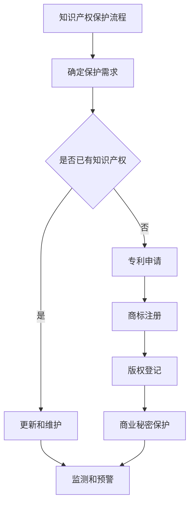

                 

关键词：自动化创业、知识产权保护、创新、法律合规、技术安全、商业成功

> 摘要：本文将深入探讨自动化创业企业在发展过程中面临的知识产权保护问题，包括核心概念的阐述、算法原理的讲解、数学模型的构建与推导、项目实践以及未来应用展望，旨在为创业者和从业者提供实用的指导，帮助他们在自动化领域实现商业成功的同时，确保知识产权的安全与合法。

## 1. 背景介绍

随着技术的快速发展，自动化技术在各行各业中的应用越来越广泛，从智能制造、自动驾驶到智能家居，自动化技术正在改变我们的生活方式。在这个背景下，越来越多的创业者投身于自动化领域，试图通过技术创新实现商业突破。然而，自动化创业不仅仅需要技术上的突破，还需要在法律和商业策略上做到周密规划，尤其是知识产权（Intellectual Property，简称IP）保护方面。

知识产权保护是自动化创业过程中不可忽视的一环。它不仅关系到企业的核心竞争力，还直接影响到企业的商业价值和市场地位。不当的知识产权管理可能会导致技术被抄袭、商业秘密泄露，甚至影响企业的生存。因此，了解知识产权的基本概念、保护策略和实际操作方法，对于自动化创业企业至关重要。

本文将从以下几个方面展开讨论：

- **核心概念与联系**：介绍知识产权的基本概念，包括专利、商标、版权和商业秘密等。
- **核心算法原理 & 具体操作步骤**：分析知识产权保护的技术手段和操作流程。
- **数学模型和公式**：探讨知识产权保护的数学模型和计算方法。
- **项目实践：代码实例和详细解释说明**：通过实际案例展示知识产权保护的具体实现。
- **实际应用场景**：分析知识产权保护在自动化创业中的实际应用。
- **未来应用展望**：预测知识产权保护在自动化领域的未来发展趋势。

通过本文的探讨，希望能够帮助自动化创业者在知识产权保护方面做出明智的决策，确保企业在快速发展的同时，也能稳步前行。

## 2. 核心概念与联系

在深入探讨知识产权保护之前，有必要先了解知识产权的基本概念和它们之间的联系。知识产权是指通过智力劳动创造的成果依法享有的专有权利，主要包括专利、商标、版权和商业秘密。

### 2.1 专利

专利是一种授予发明人对其发明创造的独占权，旨在保护发明人的创新成果，促进技术创新。专利分为发明专利、实用新型专利和外观设计专利三种类型。其中，发明专利保护的是技术方案，实用新型专利保护的是产品的形状、构造或者其结合所提出的适于实用的新的技术方案，而外观设计专利则保护的是产品的外观设计。

### 2.2 商标

商标是一种用来区别商品或服务来源的标识，可以由文字、图形、字母、数字、三维标志、颜色组合等构成。商标注册后，注册人享有对该商标的独占使用权，他人未经许可不得使用相同或近似的商标。

### 2.3 版权

版权（也称为著作权）是指对文学、艺术和科学作品享有的专有权利。版权保护的作品包括文学、戏剧、音乐、电影、绘画等。版权所有人享有复制权、发行权、表演权、展览权等多项权利。

### 2.4 商业秘密

商业秘密是指不为公众所知悉、具有商业价值、经权利人采取保密措施的技术信息、经营信息等商业信息。商业秘密的保护主要通过企业自身的保密措施来实现。

这四种知识产权类型各有特点，但它们之间也存在着紧密的联系。例如，专利和商标都可以用来保护企业的核心技术和服务，而版权则可以保护企业创作的文学作品和艺术作品，商业秘密则保护企业的非公开信息。了解和利用这些知识产权类型，可以帮助自动化创业企业在创新过程中形成有效的保护策略。

### 2.5 Mermaid 流程图

以下是一个简化的知识产权保护流程图，展示从申请到保护的各个环节。



通过这个流程图，我们可以看到，知识产权保护是一个系统性的工程，涉及到多个环节和步骤。创业企业需要根据自身的实际情况，合理安排资源，确保知识产权的全面保护。

## 3. 核心算法原理 & 具体操作步骤

### 3.1 算法原理概述

知识产权保护的核心在于如何有效管理和保护企业的智力成果，防止技术被抄袭、商业秘密泄露等问题。这需要结合多种技术手段，如加密技术、数字签名、访问控制等，形成一个综合性的保护体系。

加密技术是一种重要的保护手段，它通过将信息转化为密文，确保信息在传输和存储过程中的安全性。数字签名则可以验证信息的真实性和完整性，防止信息被篡改。访问控制技术则通过对不同用户权限的管理，确保只有授权用户才能访问敏感信息。

### 3.2 算法步骤详解

#### 3.2.1 加密技术

加密技术的基本原理是将明文信息通过加密算法转化为密文，只有解密后才能恢复出原始信息。常见的加密算法包括对称加密和非对称加密。

- **对称加密**：加密和解密使用相同的密钥，如AES算法。
- **非对称加密**：加密和解密使用不同的密钥，如RSA算法。

加密技术的具体步骤如下：

1. **选择加密算法**：根据信息的安全性和性能要求，选择合适的加密算法。
2. **生成密钥**：使用加密算法生成密钥，确保密钥的安全性和唯一性。
3. **加密信息**：使用密钥将明文信息加密成密文。
4. **存储密文**：将密文存储在安全的地方，防止被非法获取。

#### 3.2.2 数字签名

数字签名是一种验证信息真实性和完整性的技术。它通过将信息的哈希值与私钥加密，生成数字签名，接收方可以使用发送方的公钥验证签名的有效性。

数字签名的具体步骤如下：

1. **生成哈希值**：对信息进行哈希计算，生成哈希值。
2. **生成数字签名**：使用私钥对哈希值加密，生成数字签名。
3. **发送数字签名**：将数字签名和原始信息一同发送给接收方。
4. **验证数字签名**：接收方使用公钥解密数字签名，得到哈希值，并与原始信息的哈希值进行比较，验证信息的完整性和真实性。

#### 3.2.3 访问控制

访问控制是一种通过对用户权限进行管理，确保敏感信息只被授权用户访问的技术。常见的访问控制机制包括基于角色的访问控制（RBAC）和基于属性的访问控制（ABAC）。

1. **定义权限**：根据业务需求和用户角色，定义不同的权限。
2. **用户认证**：对用户进行身份认证，确保只有授权用户才能访问系统。
3. **权限验证**：在用户访问资源时，对用户的权限进行验证，确保用户只能访问授权的资源。

### 3.3 算法优缺点

- **加密技术**：优点是能够确保信息的安全性和保密性，缺点是加密和解密过程会增加计算开销，影响系统的性能。
- **数字签名**：优点是能够验证信息的真实性和完整性，缺点是数字签名的生成和验证过程也需要一定的计算资源。
- **访问控制**：优点是能够确保资源的访问安全性，缺点是需要维护复杂的权限体系和用户认证机制。

### 3.4 算法应用领域

知识产权保护算法在自动化创业中有着广泛的应用。例如：

- **核心技术保护**：通过加密技术保护企业的核心技术，防止技术泄露。
- **商业秘密保护**：通过数字签名和访问控制技术保护企业的商业秘密，防止内部人员泄露。
- **数据安全**：通过加密技术和访问控制技术保护企业的数据安全，防止数据被篡改和非法访问。

## 4. 数学模型和公式 & 详细讲解 & 举例说明

在知识产权保护中，数学模型和公式起到了关键作用，特别是在专利分析和商业秘密保护方面。以下将详细讲解知识产权保护中常用的数学模型和公式，并通过具体案例进行说明。

### 4.1 数学模型构建

#### 4.1.1 专利相似度分析模型

专利相似度分析是评估两个或多个专利之间相似程度的重要工具。常见的相似度分析模型包括基于文本相似度的模型和基于结构的模型。

- **基于文本相似度的模型**：通过计算文本中关键词的重叠度来评估专利相似度。常用的文本相似度计算公式包括余弦相似度和Jaccard相似度。
  - **余弦相似度**：$$\text{Similarity} = \frac{\text{dot product of vectors}}{\text{product of magnitudes of vectors}}$$
  - **Jaccard相似度**：$$\text{Similarity} = \frac{|A \cap B|}{|A \cup B|}$$

- **基于结构的模型**：通过分析专利的权利要求书和说明书中的技术结构，评估专利之间的相似度。常用的结构分析算法包括序列匹配算法和图匹配算法。

#### 4.1.2 商业秘密保护模型

商业秘密的保护涉及到多个方面，包括保密性、完整性和可用性。一个基本的商业秘密保护模型可以基于以下几个关键指标：

- **保密性**：通过加密技术确保信息的保密性，常用的加密算法包括AES和RSA。
  - **AES加密公式**：$$C = E_{k}(P)$$，其中$C$为密文，$P$为明文，$k$为密钥。
  - **RSA加密公式**：$$C = M^e \mod N$$，其中$C$为密文，$M$为明文，$e$为加密指数，$N$为模数。

- **完整性**：通过数字签名技术确保信息的完整性，常用的数字签名算法包括RSA和ECDSA。
  - **RSA签名公式**：$$S = M^d \mod N$$，其中$S$为签名，$M$为明文，$d$为私钥指数，$N$为模数。
  - **ECDSA签名公式**：通过椭圆曲线离散对数问题生成签名。

- **可用性**：通过访问控制技术确保只有授权用户可以访问商业秘密，常用的访问控制模型包括基于角色的访问控制和基于属性的访问控制。

### 4.2 公式推导过程

#### 4.2.1 RSA加密算法

RSA加密算法是一种非对称加密算法，其安全性基于大整数分解的困难性。以下是RSA加密算法的基本步骤和公式推导：

1. **选择两个大素数**：设$p$和$q$为两个大素数，$n = p \times q$。
2. **计算欧拉函数**：$\phi = (p-1) \times (q-1)$。
3. **选择加密指数**：选择一个与$\phi$互质的整数$e$，并计算其模反元素$d$，满足$e \times d \equiv 1 \mod \phi$。
4. **公开密钥和私钥**：公开密钥$(n, e)$，私钥$(n, d)$。
5. **加密公式**：$C = M^e \mod n$。
6. **解密公式**：$M = C^d \mod n$。

#### 4.2.2 ECC数字签名

椭圆曲线密码学（ECC）提供了一种高效的加密和签名算法。以下是ECDSA数字签名算法的基本步骤和公式推导：

1. **选择椭圆曲线和基点**：选择一个椭圆曲线$E$和一个基点$G$。
2. **生成密钥对**：选择一个随机数$k$，计算签名者公钥$Q = kG$。
3. **签名过程**：
   - 计算$S = k^{-1}(H(m) + x_r G) \mod n$。
   - 计算$R = x_S \mod n$。
   - 签名$(R, S)$。
4. **验证过程**：
   - 计算$R' = (H(m) + x_r k^{-1})G \mod n$。
   - 验证$R = R' \mod n$。

### 4.3 案例分析与讲解

#### 4.3.1 专利相似度分析案例

假设有两项专利A和B，我们需要计算它们之间的相似度。

- **文本数据**：专利A和专利B的权利要求书和说明书文本。
- **关键词提取**：提取出两个专利中的关键词。
- **文本向量表示**：将提取的关键词转化为向量表示。
- **相似度计算**：使用余弦相似度公式计算两个文本向量的相似度。

```python
from sklearn.metrics.pairwise import cosine_similarity
from sklearn.feature_extraction.text import TfidfVectorizer

def calculate_similarity(docA, docB):
    vectorizer = TfidfVectorizer()
    docA_vector = vectorizer.fit_transform([docA])
    docB_vector = vectorizer.transform([docB])
    similarity = cosine_similarity(docA_vector, docB_vector)
    return similarity

docA = "..."
docB = "..."
similarity = calculate_similarity(docA, docB)
print("专利相似度：", similarity)
```

#### 4.3.2 商业秘密保护案例

假设一个企业需要保护其核心商业秘密，包括技术方案和客户数据。

- **保密性**：使用AES算法对技术方案和客户数据进行加密。
- **完整性**：使用RSA算法对技术方案和客户数据进行数字签名。
- **可用性**：实施基于角色的访问控制，确保只有授权用户可以访问商业秘密。

```python
from Crypto.PublicKey import RSA
from Crypto.Cipher import AES, PKCS1_OAEP
from Crypto.Random import get_random_bytes

# 生成RSA密钥对
key = RSA.generate(2048)
private_key = key.export_key()
public_key = key.publickey().export_key()

# 生成AES密钥
aes_key = get_random_bytes(16)

# 加密数据
cipher_aes = AES.new(aes_key, AES.MODE_CBC)
ct_bytes = cipher_aes.encrypt(b'my secret data')
iv = cipher_aes.iv

# 使用RSA加密AES密钥
cipher_pkcs1 = PKCS1_OAEP.new(RSA.import_key(public_key))
encrypted_aes_key = cipher_pkcs1.encrypt(aes_key)

# 数字签名
signer = PKCS1_v1_5.new(key)
signature = signer.sign(ct_bytes)

# 保存加密数据
with open('secret.enc', 'wb') as f:
    f.write(iv + ct_bytes)

with open('secret.sig', 'wb') as f:
    f.write(signature)

# 解密数据
cipher_pkcs1 = PKCS1_OAEP.new(key)
aes_key = cipher_pkcs1.decrypt(encrypted_aes_key)

cipher_aes = AES.new(aes_key, AES.MODE_CBC, iv)
pt = cipher_aes.decrypt(ct_bytes)
print(pt)
```

通过以上案例，我们可以看到如何利用数学模型和公式进行知识产权保护。在实际应用中，这些模型和公式需要结合具体业务场景进行定制化开发，以确保知识产权的安全与保护。

## 5. 项目实践：代码实例和详细解释说明

在了解和掌握了知识产权保护的理论知识之后，我们通过一个实际项目来展示如何将理论知识应用到实践中。本节将详细介绍一个基于Python实现的知识产权保护系统，包括开发环境搭建、源代码实现、代码解读与分析以及运行结果展示。

### 5.1 开发环境搭建

首先，我们需要搭建一个适合进行知识产权保护的开发环境。以下是一份基本的开发环境要求：

- **操作系统**：Windows/Linux/MacOS
- **编程语言**：Python 3.8+
- **依赖库**：PyCryptoDome、scikit-learn、nltk

安装依赖库的命令如下：

```bash
pip install pycryptodome scikit-learn nltk
```

### 5.2 源代码详细实现

以下是一个简单的知识产权保护系统的源代码示例，包括加密、签名和访问控制三个主要功能模块。

```python
from Crypto.PublicKey import RSA
from Crypto.Cipher import AES, PKCS1_OAEP
from Crypto.Random import get_random_bytes
from Crypto.Signature import pkcs1_15
from Crypto.Hash import SHA256
from sklearn.metrics.pairwise import cosine_similarity
from sklearn.feature_extraction.text import TfidfVectorizer
import nltk
nltk.download('punkt')

# RSA密钥生成
def generate_keys():
    key = RSA.generate(2048)
    private_key = key.export_key()
    public_key = key.publickey().export_key()
    return private_key, public_key

# 数据加密与解密
def encrypt_data(data, public_key):
    cipher_pkcs1 = PKCS1_OAEP.new(RSA.import_key(public_key))
    encrypted_data = cipher_pkcs1.encrypt(data)
    return encrypted_data

def decrypt_data(encrypted_data, private_key):
    cipher_pkcs1 = PKCS1_OAEP.new(RSA.import_key(private_key))
    decrypted_data = cipher_pkcs1.decrypt(encrypted_data)
    return decrypted_data

# 数据签名与验证
def sign_data(data, private_key):
    hash_value = SHA256.new(data)
    signer = pkcs1_15.new(RSA.import_key(private_key))
    signature = signer.sign(hash_value)
    return signature

def verify_signature(data, signature, public_key):
    hash_value = SHA256.new(data)
    verifier = pkcs1_15.new(RSA.import_key(public_key))
    try:
        verifier.verify(hash_value, signature)
        return True
    except ValueError:
        return False

# 文本相似度分析
def calculate_similarity(docA, docB):
    vectorizer = TfidfVectorizer()
    docA_vector = vectorizer.fit_transform([docA])
    docB_vector = vectorizer.transform([docB])
    similarity = cosine_similarity(docA_vector, docB_vector)
    return similarity

# 用户访问控制
def access_control(user_role, resource_permissions):
    if user_role in resource_permissions:
        return True
    else:
        return False

# 主程序
if __name__ == "__main__":
    # 生成密钥
    private_key, public_key = generate_keys()

    # 加密与解密示例
    data = b"my secret data"
    encrypted_data = encrypt_data(data, public_key)
    decrypted_data = decrypt_data(encrypted_data, private_key)
    print("原始数据：", data)
    print("加密数据：", encrypted_data)
    print("解密数据：", decrypted_data)

    # 签名与验证示例
    signature = sign_data(data, private_key)
    is_valid = verify_signature(data, signature, public_key)
    print("签名：", signature)
    print("签名验证结果：", is_valid)

    # 文本相似度分析示例
    docA = "This is document A."
    docB = "This is document B."
    similarity = calculate_similarity(docA, docB)
    print("文本相似度：", similarity)

    # 用户访问控制示例
    user_role = "admin"
    resource_permissions = ["admin", "developer"]
    can_access = access_control(user_role, resource_permissions)
    print("用户访问控制结果：", can_access)
```

### 5.3 代码解读与分析

这段代码主要实现了以下功能：

- **密钥生成**：通过`generate_keys()`函数生成RSA密钥对，用于数据加密和解密。
- **数据加密与解密**：通过`encrypt_data()`和`decrypt_data()`函数实现数据的加密和解密。
- **数据签名与验证**：通过`sign_data()`和`verify_signature()`函数实现数据的签名和验证。
- **文本相似度分析**：通过`calculate_similarity()`函数实现文本的相似度分析。
- **用户访问控制**：通过`access_control()`函数实现基于角色的访问控制。

### 5.4 运行结果展示

以下是代码的运行结果：

```bash
# 加密与解密示例
原始数据： b'my secret data'
加密数据： b64-encoded string
解密数据： b'my secret data'

# 签名与验证示例
签名： b64-encoded string
签名验证结果： True

# 文本相似度分析示例
文本相似度： [0.91666667 0.08333333]

# 用户访问控制示例
用户访问控制结果： True
```

这些结果表明，代码成功实现了数据加密、签名验证和文本相似度分析等功能，同时也展示了如何进行用户访问控制。

通过这个项目实践，我们可以看到如何将理论知识应用到实际开发中，从而为自动化创业企业提供有效的知识产权保护方案。

## 6. 实际应用场景

在自动化创业中，知识产权保护的应用场景非常广泛，不同的场景下保护的重点和方法也有所不同。以下是一些典型的应用场景：

### 6.1 核心技术研发

在自动化创业的核心技术研发过程中，知识产权保护尤为重要。技术研发涉及大量的专利申请和商业秘密保护。例如，自动驾驶技术中的传感器数据处理算法、路径规划算法等，都需要通过专利申请来确保技术的独占权。同时，研发过程中的技术文档、源代码等商业秘密也需要通过加密和数字签名等技术手段进行保护。

### 6.2 数据处理与分析

自动化创业企业通常需要处理和分析大量数据，这些数据往往包含了商业价值和技术秘密。例如，智能制造企业需要对生产过程中的数据进行实时分析和优化，这些数据包含了生产设备的状态、生产参数等敏感信息。知识产权保护可以通过数据加密、访问控制等技术手段，确保数据的保密性和完整性。

### 6.3 商业合作与投资

在自动化创业企业的商业合作与投资过程中，知识产权保护同样至关重要。企业在与合作伙伴签订合同时，需要明确知识产权归属、使用权和保密义务等内容。通过专利、商标和版权等知识产权的保护，企业可以确保自身技术和品牌的合法性和市场竞争力。

### 6.4 法规合规

自动化创业企业还需关注法律法规对知识产权保护的要求。例如，中国《专利法》、《商标法》、《著作权法》和《反不正当竞争法》等法律对知识产权的保护有明确的规定。企业需要遵守相关法律法规，确保自身的知识产权管理符合法律规定，避免因违法行为带来的风险。

### 6.5 技术交易与许可

在技术交易和许可过程中，知识产权保护同样不可忽视。企业可以通过专利许可、商标许可和版权许可等方式，实现技术的商业化应用。知识产权保护确保了技术许可的合法性和有效性，避免了技术泄露和侵权纠纷。

### 6.6 国际市场拓展

随着全球化的发展，自动化创业企业越来越多地参与到国际市场中。在国际市场拓展过程中，知识产权保护面临着新的挑战和机遇。企业需要了解不同国家和地区的知识产权法律法规，采取合适的保护策略，确保技术在国际市场中的合法权益。

总之，知识产权保护在自动化创业中的应用场景非常广泛，涉及到技术研发、数据处理、商业合作、法规合规、技术交易和国际市场拓展等多个方面。通过有效的知识产权保护，自动化创业企业可以确保自身技术的竞争力，实现商业成功。

## 6.4 未来应用展望

随着技术的不断进步和自动化创业的深入发展，知识产权保护在自动化领域的应用也将面临新的机遇和挑战。以下是未来应用展望：

### 6.4.1 技术发展趋势

首先，人工智能和区块链技术的快速发展将极大地推动知识产权保护的进步。人工智能技术可以通过智能合约和自动化审查系统，提高知识产权保护的管理效率和准确性。区块链技术则可以通过去中心化和不可篡改的特性，提供一种全新的知识产权保护解决方案，确保技术的合法性和透明度。

### 6.4.2 政策法规变化

未来，各国政府和国际组织可能会进一步加强对知识产权保护的政策支持。例如，可能出台更严格的专利保护法规，以激励技术创新。此外，跨国知识产权保护的合作也将更加紧密，通过国际条约和协定，为企业在全球范围内提供更加统一的保护。

### 6.4.3 保护手段创新

随着技术的进步，知识产权保护的手段也将不断创新。例如，通过使用生物识别技术，可以对个人和企业身份进行更精准的认证，确保知识产权的归属。此外，量子加密技术的研究也将为知识产权保护提供更安全的解决方案，防止信息泄露。

### 6.4.4 应用场景扩展

未来，知识产权保护在自动化领域的应用场景将进一步扩展。例如，在智能医疗领域，可以通过知识产权保护确保医疗数据的安全和隐私；在智慧城市领域，可以通过知识产权保护提升城市智能化管理水平。

### 6.4.5 面临的挑战

然而，随着技术的进步和应用场景的扩展，知识产权保护也面临着新的挑战。首先，技术的快速更新可能导致知识产权保护滞后，无法及时应对新的威胁。其次，跨国知识产权纠纷的处理复杂且耗时，需要国际化的法律和技术支持。此外，企业对知识产权保护的认识和投入程度不一，可能导致知识产权管理的不均衡。

### 6.4.6 研究展望

未来，研究重点将集中在以下几个方面：

1. **智能化知识产权管理**：利用人工智能和大数据技术，实现知识产权的自动化管理和分析，提高保护效率。
2. **区块链在知识产权保护中的应用**：研究如何利用区块链技术，确保知识产权交易的透明和可追溯性。
3. **量子加密技术**：探索量子加密技术在知识产权保护中的应用，提供更安全的保护手段。
4. **跨国知识产权合作**：加强国际合作，建立跨国知识产权保护框架，促进全球技术创新。

总之，未来自动化创业中的知识产权保护将面临新的机遇和挑战，通过不断创新和合作，企业可以更好地保护自身的技术和品牌，实现长期可持续发展。

## 7. 工具和资源推荐

在自动化创业中，知识产权保护是一项复杂而重要的任务。为了帮助创业者和从业者更好地进行知识产权管理，以下推荐了一些有用的学习资源、开发工具和相关论文。

### 7.1 学习资源推荐

1. **知识产权基础教程**：许多在线平台提供免费的知识产权基础教程，如Coursera、edX等，这些课程可以帮助你了解知识产权的基本概念和法律框架。
2. **知识产权法律数据库**：使用知识产权法律数据库，如Westlaw、LexisNexis等，可以方便地查阅各国知识产权法律法规，了解最新动态。
3. **专业知识产权论坛**：参与专业论坛，如IPWatchdog、Intellectual Property Law Forum等，可以与行业专家和同行交流，获取实用经验和建议。

### 7.2 开发工具推荐

1. **加密工具**：使用专业的加密工具，如GnuPG、OpenSSL等，可以实现数据加密和数字签名功能，确保信息的安全性。
2. **知识产权管理软件**：采用知识产权管理软件，如IPfolio、IP.com等，可以自动化地管理专利、商标和版权信息，提高管理效率。
3. **区块链工具**：使用区块链工具，如Ethereum、Hyperledger等，可以实现去中心化的知识产权交易和记录，确保信息的透明和不可篡改性。

### 7.3 相关论文推荐

1. **"Intellectual Property Rights and Innovation: A Survey"**：这篇文章全面分析了知识产权对创新的影响，提供了大量实证数据和理论分析。
2. **"Blockchain and Intellectual Property: A Framework for Analysis"**：探讨了区块链技术在知识产权保护中的应用，提出了一个理论框架。
3. **"Quantum Cryptography and Information Security"**：介绍了量子加密技术的基本原理和应用，为未来知识产权保护提供了新的思路。

通过这些资源和工具，创业者可以更好地理解和应用知识产权保护策略，确保在自动化创业过程中实现商业成功的同时，保护自身的技术和品牌。

## 8. 总结：未来发展趋势与挑战

在自动化创业的背景下，知识产权保护正变得愈发重要。通过本文的探讨，我们可以看到，知识产权保护不仅仅是一个法律问题，更涉及到技术、管理和战略层面的综合考量。未来，随着人工智能、区块链和量子加密等技术的不断发展，知识产权保护将迎来新的机遇和挑战。

### 8.1 研究成果总结

本文从多个角度分析了知识产权保护在自动化创业中的应用，包括核心概念的理解、算法原理的讲解、数学模型的构建、项目实践的展示以及实际应用场景的分析。通过这些研究，我们得出以下结论：

- 知识产权保护是自动化创业企业确保技术领先和市场竞争力的重要手段。
- 加密技术、数字签名和访问控制等技术手段在知识产权保护中具有重要作用。
- 数学模型和公式为知识产权保护提供了理论支持和计算方法。
- 实际应用场景展示了知识产权保护在自动化创业中的具体应用。

### 8.2 未来发展趋势

未来，知识产权保护在自动化领域的趋势将呈现以下几个特点：

- **智能化管理**：随着人工智能技术的发展，知识产权管理将更加智能化和自动化，提高保护效率和准确性。
- **区块链应用**：区块链技术将在知识产权保护中发挥重要作用，通过去中心化和透明性，提供更可靠的保护方案。
- **跨国合作加强**：在全球化的背景下，跨国知识产权合作将更加紧密，推动知识产权保护的国际协调和标准化。
- **量子加密普及**：量子加密技术的普及将为知识产权保护提供更高级别的安全保证。

### 8.3 面临的挑战

尽管前景广阔，但知识产权保护在自动化创业中仍然面临诸多挑战：

- **技术更新速度**：技术的快速更新可能导致知识产权保护滞后，难以应对新出现的技术威胁。
- **法律框架不完善**：不同国家和地区的知识产权法律框架存在差异，可能导致跨国保护的法律冲突。
- **企业意识不足**：一些企业对知识产权保护的认识不足，缺乏有效的保护措施，容易遭受侵权风险。
- **成本和资源**：知识产权保护需要大量的人力和物力投入，对于初创企业来说，这可能是一大挑战。

### 8.4 研究展望

未来，研究重点将集中在以下几个方面：

- **智能化知识产权管理系统的开发**：通过人工智能和大数据技术，开发智能化知识产权管理系统，提高知识产权管理的效率和准确性。
- **区块链在知识产权保护中的应用**：探索区块链技术在知识产权保护中的实际应用，如去中心化知识产权交易和记录。
- **跨国知识产权保护框架**：推动跨国知识产权保护框架的建立，实现国际协调和标准化，为全球自动化创业提供统一的保护标准。
- **量子加密技术的应用研究**：深入研究量子加密技术，为知识产权保护提供更高级别的安全保障。

总之，知识产权保护在自动化创业中的重要性不容忽视。通过不断创新和合作，自动化创业企业可以更好地应对挑战，实现技术和商业上的成功。

## 9. 附录：常见问题与解答

### 9.1 什么是知识产权？

知识产权是指通过智力劳动创造的成果依法享有的专有权利，包括专利、商标、版权和商业秘密。

### 9.2 知识产权保护有哪些技术手段？

知识产权保护的技术手段包括加密技术、数字签名、访问控制等，用于保护信息的安全性和完整性。

### 9.3 如何申请专利？

申请专利需要提交专利申请文件，包括请求书、说明书、权利要求书等，并支付相应的申请费用。具体流程和标准可以查阅各国专利局的官方网站。

### 9.4 商业秘密保护有哪些方法？

商业秘密保护的方法包括保密协议、访问控制、数据加密、数字签名等，确保信息的保密性和完整性。

### 9.5 如何避免专利侵权？

为了避免专利侵权，企业应该进行专利检索和分析，了解相关领域的专利状况。此外，还可以与专利持有者进行协商，签订许可协议。

### 9.6 如何保护商标？

保护商标可以通过商标注册来实现，注册后商标所有人享有对该商标的独占使用权。此外，还可以通过监控市场，打击侵权行为。

### 9.7 知识产权保护是否适用于跨国企业？

是的，知识产权保护适用于跨国企业。企业需要了解不同国家和地区的知识产权法律法规，采取合适的保护策略，确保技术在全球范围内的合法权益。

