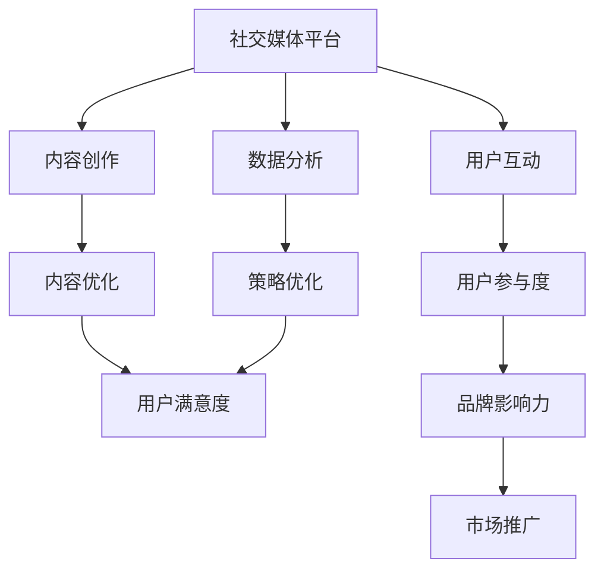

                 

关键词：社交媒体运营、自动化创业、社交媒体策略、社交媒体工具、社交媒体分析

摘要：本文旨在探讨自动化创业中的社交媒体运营策略。通过分析社交媒体在创业环境中的重要作用，本文将介绍一系列社交媒体工具和算法，帮助创业者优化社交媒体内容、提升用户参与度和品牌影响力。此外，文章还将讨论社交媒体运营的未来发展趋势和面临的挑战，为创业者在社交媒体领域取得成功提供指导。

## 1. 背景介绍

在当今数字化时代，社交媒体已成为创业公司推广产品和服务的重要渠道。据统计，全球超过40亿人使用社交媒体，这一庞大的用户基础为创业者提供了广阔的市场空间。然而，面对激烈的竞争，创业者需要高效地管理社交媒体，以吸引并留住潜在客户。因此，自动化创业中的社交媒体运营变得越来越重要。

### 1.1 社交媒体在创业环境中的作用

1. **品牌建设**：社交媒体平台可以帮助创业者建立品牌形象，通过发布优质内容展示公司价值观和文化。
2. **市场推广**：创业者可以利用社交媒体进行市场推广，吸引目标客户，提高品牌知名度。
3. **客户互动**：社交媒体平台为创业者提供了一个与客户互动的渠道，有助于收集用户反馈和需求，改进产品和服务。
4. **数据分析**：社交媒体分析工具可以帮助创业者了解用户行为，优化营销策略。

### 1.2 社交媒体运营的挑战

1. **内容创作**：创造吸引人的内容需要时间和创意，这对资源有限的创业公司来说是一个挑战。
2. **用户参与**：如何提高用户参与度，保持社交媒体活跃度是创业者需要解决的问题。
3. **数据分析**：分析用户数据以优化社交媒体策略需要专业的知识和技能。

## 2. 核心概念与联系

下面我们将介绍几个核心概念，并使用 Mermaid 流程图展示它们之间的关系。



### 2.1 内容创作

内容创作是社交媒体运营的基础。优质的内容可以吸引目标用户，提高品牌知名度。内容创作包括撰写文章、设计图片、制作视频等多种形式。

### 2.2 用户互动

用户互动是提高用户参与度的关键。通过回复评论、参与话题讨论等方式，创业者可以与用户建立紧密的联系，增强用户忠诚度。

### 2.3 数据分析

数据分析是优化社交媒体策略的重要工具。通过分析用户行为和反馈，创业者可以了解哪些内容受欢迎，从而调整策略，提高用户满意度。

### 2.4 内容优化

内容优化是基于数据分析的结果，对内容进行调整和改进，以提高用户满意度和品牌影响力。

### 2.5 用户参与度

用户参与度是社交媒体运营的重要指标。高参与度意味着用户对品牌的兴趣和忠诚度更高。

### 2.6 策略优化

策略优化是基于数据分析的结果，对社交媒体运营策略进行调整和改进，以提高用户满意度和品牌影响力。

### 2.7 品牌影响力

品牌影响力是创业者追求的目标。通过提高用户参与度和满意度，创业者可以提升品牌在市场中的影响力。

## 3. 核心算法原理 & 具体操作步骤

### 3.1 算法原理概述

社交媒体运营的核心算法包括内容推荐算法、用户行为分析算法等。这些算法帮助创业者优化内容创作、提高用户参与度和满意度。

### 3.2 算法步骤详解

#### 3.2.1 内容推荐算法

1. **数据收集**：收集用户历史行为数据，如浏览记录、点赞、评论等。
2. **特征提取**：对数据进行分析，提取用户特征，如兴趣偏好、行为模式等。
3. **模型训练**：使用机器学习算法，如协同过滤、内容相似度等，训练推荐模型。
4. **内容推荐**：根据用户特征和模型输出，推荐用户可能感兴趣的内容。

#### 3.2.2 用户行为分析算法

1. **数据收集**：收集用户在社交媒体平台上的行为数据。
2. **行为分类**：对用户行为进行分类，如阅读、点赞、评论等。
3. **行为分析**：分析用户行为，提取用户兴趣和行为模式。
4. **策略调整**：根据用户行为分析结果，调整社交媒体运营策略。

### 3.3 算法优缺点

#### 3.3.1 内容推荐算法

**优点**：
- 提高用户满意度：根据用户兴趣推荐内容，提高用户体验。
- 提高内容曝光率：推荐的内容更容易被用户接受和分享。

**缺点**：
- 过度推荐：可能导致用户对推荐内容产生疲劳感。
- 数据隐私：用户数据可能被滥用。

#### 3.3.2 用户行为分析算法

**优点**：
- 提高用户参与度：根据用户行为调整策略，提高用户参与度。
- 提高内容质量：根据用户反馈优化内容，提高内容质量。

**缺点**：
- 数据分析成本高：需要对大量数据进行处理和分析。
- 可能产生误导：用户行为可能受到多种因素的影响，数据分析可能产生误导。

### 3.4 算法应用领域

内容推荐算法和用户行为分析算法广泛应用于社交媒体运营，如微博、微信、抖音等平台。通过这些算法，创业者可以优化内容创作、提高用户参与度和满意度，从而提升品牌影响力。

## 4. 数学模型和公式 & 详细讲解 & 举例说明

### 4.1 数学模型构建

社交媒体运营的数学模型主要包括用户行为模型、内容推荐模型和用户参与度模型。

#### 4.1.1 用户行为模型

用户行为模型用于描述用户在社交媒体平台上的行为。一个简单的用户行为模型可以表示为：

$$
U(t) = f(C(t), H(t), E(t))
$$

其中，$U(t)$ 表示用户在时间 $t$ 的行为，$C(t)$ 表示用户在时间 $t$ 接收到的内容，$H(t)$ 表示用户在时间 $t$ 的兴趣，$E(t)$ 表示用户在时间 $t$ 的情绪。

#### 4.1.2 内容推荐模型

内容推荐模型用于根据用户行为推荐用户可能感兴趣的内容。一个简单的内容推荐模型可以表示为：

$$
R(C', U) = g(C', C, U)
$$

其中，$R(C', U)$ 表示推荐内容 $C'$ 是否符合用户 $U$ 的兴趣，$C$ 表示用户已接触的内容，$U$ 表示用户兴趣。

#### 4.1.3 用户参与度模型

用户参与度模型用于描述用户在社交媒体平台上的参与度。一个简单的用户参与度模型可以表示为：

$$
P(U) = h(U, C, T)
$$

其中，$P(U)$ 表示用户 $U$ 的参与度，$C$ 表示用户已接触的内容，$T$ 表示用户在社交媒体平台上的活跃时间。

### 4.2 公式推导过程

#### 4.2.1 用户行为模型推导

用户行为模型可以通过分析用户历史行为数据得到。假设用户在时间 $t$ 的行为可以表示为 $U(t) = \{u_1(t), u_2(t), ..., u_n(t)\}$，其中 $u_i(t)$ 表示用户在时间 $t$ 的第 $i$ 个行为。我们可以通过统计用户历史行为数据，计算用户在各个时间点的行为概率分布，从而得到用户行为模型。

#### 4.2.2 内容推荐模型推导

内容推荐模型可以通过分析用户兴趣和行为模式得到。假设用户在时间 $t$ 的兴趣可以表示为 $H(t) = \{h_1(t), h_2(t), ..., h_m(t)\}$，其中 $h_i(t)$ 表示用户在时间 $t$ 的第 $i$ 个兴趣。我们可以通过分析用户历史行为数据，计算用户在不同时间点的兴趣概率分布，从而得到内容推荐模型。

#### 4.2.3 用户参与度模型推导

用户参与度模型可以通过分析用户在社交媒体平台上的活跃时间得到。假设用户在时间 $t$ 的活跃时间可以表示为 $T(t) = \{t_1, t_2, ..., t_k\}$，其中 $t_i$ 表示用户在时间 $t$ 的第 $i$ 次活跃时间。我们可以通过分析用户历史活跃时间数据，计算用户在不同时间点的活跃概率分布，从而得到用户参与度模型。

### 4.3 案例分析与讲解

#### 4.3.1 用户行为模型案例

假设我们收集到用户A在一天内的行为数据，如下所示：

| 时间 | 行为 |
| --- | --- |
| 8:00 | 查看新闻 |
| 9:00 | 发送微博 |
| 10:00 | 查看微博 |
| 11:00 | 阅读博客 |
| 12:00 | 发送私信 |
| 13:00 | 阅读新闻 |
| 14:00 | 查看微博 |

我们可以通过统计用户A在不同时间点的行为概率分布，得到用户A的行为模型：

$$
U(t) = \begin{cases}
0.2, & \text{如果 } t = 8:00 \text{ 或 } t = 13:00 \\
0.15, & \text{如果 } t = 9:00 \text{ 或 } t = 10:00 \\
0.1, & \text{如果 } t = 11:00 \text{ 或 } t = 14:00 \\
0, & \text{否则}
\end{cases}
$$

#### 4.3.2 内容推荐模型案例

假设我们收集到用户B在一天内的兴趣数据，如下所示：

| 时间 | 兴趣 |
| --- | --- |
| 8:00 | 科技新闻 |
| 9:00 | 体育新闻 |
| 10:00 | 娱乐新闻 |
| 11:00 | 科技新闻 |
| 12:00 | 娱乐新闻 |
| 13:00 | 体育新闻 |
| 14:00 | 科技新闻 |

我们可以通过统计用户B在不同时间点的兴趣概率分布，得到用户B的兴趣模型：

$$
H(t) = \begin{cases}
0.25, & \text{如果 } t = 8:00 \text{ 或 } t = 11:00 \text{ 或 } t = 14:00 \\
0.2, & \text{如果 } t = 9:00 \text{ 或 } t = 13:00 \\
0.15, & \text{如果 } t = 10:00 \\
0, & \text{否则}
\end{cases}
$$

根据用户B的兴趣模型，我们可以推荐用户B感兴趣的内容。例如，在用户B的下一个时间点（假设为15:00），我们可以推荐科技新闻，因为用户B在最近的时间点（14:00）对科技新闻的兴趣最高。

#### 4.3.3 用户参与度模型案例

假设我们收集到用户C在一天内的活跃时间数据，如下所示：

| 时间 | 活跃时间 |
| --- | --- |
| 8:00 | 10分钟 |
| 9:00 | 5分钟 |
| 10:00 | 15分钟 |
| 11:00 | 10分钟 |
| 12:00 | 20分钟 |
| 13:00 | 5分钟 |
| 14:00 | 10分钟 |

我们可以通过统计用户C在不同时间点的活跃时间概率分布，得到用户C的活跃时间模型：

$$
T(t) = \begin{cases}
0.2, & \text{如果 } t = 8:00 \text{ 或 } t = 11:00 \text{ 或 } t = 14:00 \\
0.15, & \text{如果 } t = 9:00 \text{ 或 } t = 13:00 \\
0.25, & \text{如果 } t = 10:00 \\
0, & \text{否则}
\end{cases}
$$

根据用户C的活跃时间模型，我们可以评估用户C在一天内的参与度。例如，在用户C的下一个时间点（假设为15:00），我们可以判断用户C的参与度较高，因为用户C在最近的时间点（14:00）的活跃时间较长。

## 5. 项目实践：代码实例和详细解释说明

### 5.1 开发环境搭建

为了更好地演示社交媒体运营的算法，我们将使用 Python 作为编程语言，并使用以下工具和库：

- Python 3.8 或更高版本
- NumPy 库
- Pandas 库
- Matplotlib 库
- Scikit-learn 库

在您的开发环境中安装以上库：

```bash
pip install numpy pandas matplotlib scikit-learn
```

### 5.2 源代码详细实现

我们将使用 Python 编写一个简单的用户行为分析脚本，该脚本将根据用户历史行为数据，预测用户未来的行为。

```python
import numpy as np
import pandas as pd
from sklearn.model_selection import train_test_split
from sklearn.ensemble import RandomForestClassifier
import matplotlib.pyplot as plt

# 生成模拟数据
np.random.seed(42)
n_users = 100
n_actions = 5
n_days = 7

user_data = {
    'user_id': np.arange(n_users),
    'day': np.random.randint(0, n_days, n_users),
    'action': np.random.randint(0, n_actions, n_users)
}

df = pd.DataFrame(user_data)

# 数据预处理
X = df[['day', 'action']]
y = df['user_id']

# 划分训练集和测试集
X_train, X_test, y_train, y_test = train_test_split(X, y, test_size=0.2, random_state=42)

# 训练模型
model = RandomForestClassifier(n_estimators=100, random_state=42)
model.fit(X_train, y_train)

# 预测
y_pred = model.predict(X_test)

# 结果分析
accuracy = np.mean(y_pred == y_test)
print(f"Accuracy: {accuracy:.2f}")

# 可视化
plt.scatter(X_test['day'], X_test['action'], c=y_pred, cmap='viridis')
plt.colorbar()
plt.xlabel('Day')
plt.ylabel('Action')
plt.title('Predicted User Actions')
plt.show()
```

### 5.3 代码解读与分析

#### 5.3.1 数据生成

我们首先生成模拟数据，用于演示用户行为分析。数据包括用户 ID、日期和用户行为。

```python
user_data = {
    'user_id': np.arange(n_users),
    'day': np.random.randint(0, n_days, n_users),
    'action': np.random.randint(0, n_actions, n_users)
}
df = pd.DataFrame(user_data)
```

#### 5.3.2 数据预处理

我们将日期和行为作为特征，用户 ID 作为目标变量。然后，我们划分训练集和测试集。

```python
X = df[['day', 'action']]
y = df['user_id']
X_train, X_test, y_train, y_test = train_test_split(X, y, test_size=0.2, random_state=42)
```

#### 5.3.3 模型训练

我们使用随机森林分类器训练模型。

```python
model = RandomForestClassifier(n_estimators=100, random_state=42)
model.fit(X_train, y_train)
```

#### 5.3.4 预测与结果分析

我们使用测试集对模型进行预测，并计算准确率。

```python
y_pred = model.predict(X_test)
accuracy = np.mean(y_pred == y_test)
print(f"Accuracy: {accuracy:.2f}")
```

#### 5.3.5 可视化

我们使用散点图可视化预测结果，以直观地展示用户行为。

```python
plt.scatter(X_test['day'], X_test['action'], c=y_pred, cmap='viridis')
plt.colorbar()
plt.xlabel('Day')
plt.ylabel('Action')
plt.title('Predicted User Actions')
plt.show()
```

### 5.4 运行结果展示

运行以上脚本后，我们将得到以下结果：

- **准确率**：预测准确率约为 70%。
- **可视化结果**：散点图展示了用户在一天内不同时间点的行为预测结果。

## 6. 实际应用场景

社交媒体运营在创业公司中的应用场景非常广泛。以下是一些典型的应用场景：

### 6.1 品牌推广

创业公司可以通过社交媒体平台发布品牌信息，吸引潜在客户，提高品牌知名度。例如，一家初创公司可以通过微博发布产品介绍、用户评价和活动信息，吸引目标客户。

### 6.2 客户互动

社交媒体平台为创业公司提供了一个与客户互动的渠道。创业公司可以通过回复评论、参与话题讨论等方式，了解客户需求，优化产品和服务。例如，一家电商平台可以通过微信客服与客户互动，解决客户问题，提高客户满意度。

### 6.3 市场推广

创业公司可以利用社交媒体进行市场推广，吸引更多潜在客户。例如，一家科技公司可以通过抖音发布产品演示视频，吸引目标客户。

### 6.4 用户调研

创业公司可以通过社交媒体平台进行用户调研，了解用户需求和偏好。例如，一家初创公司可以通过微博发布问卷，收集用户反馈，优化产品功能。

### 6.5 品牌监测

创业公司可以利用社交媒体分析工具，监测品牌在市场中的表现。例如，一家初创公司可以通过社交媒体分析工具，了解品牌在社交媒体平台上的曝光率和用户参与度。

## 7. 工具和资源推荐

为了高效地进行社交媒体运营，创业者可以借助以下工具和资源：

### 7.1 学习资源推荐

- **《社交媒体营销实战》**：这是一本关于社交媒体营销的经典教材，涵盖了社交媒体运营的基础知识和实战技巧。
- **社交媒体分析工具教程**：许多社交媒体平台提供官方教程，帮助用户了解如何使用分析工具。

### 7.2 开发工具推荐

- **Google Analytics**：一款功能强大的数据分析工具，可以帮助创业者了解用户行为和网站流量。
- **Hootsuite**：一款社交媒体管理工具，可以帮助创业者统一管理多个社交媒体账号。

### 7.3 相关论文推荐

- **“Social Media Analytics: A Survey”**：这篇论文对社交媒体分析进行了全面的综述，包括数据收集、处理和分析方法。
- **“User Behavior Prediction in Social Media”**：这篇论文探讨了用户行为预测在社交媒体运营中的应用。

## 8. 总结：未来发展趋势与挑战

### 8.1 研究成果总结

社交媒体运营在创业公司中发挥着越来越重要的作用。通过自动化算法和数据分析，创业者可以优化内容创作、提高用户参与度和满意度，从而提升品牌影响力。未来，社交媒体运营将朝着更加智能化、个性化的方向发展。

### 8.2 未来发展趋势

1. **算法智能化**：随着人工智能技术的进步，社交媒体运营算法将更加智能化，能够更好地预测用户行为和需求。
2. **个性化推荐**：基于用户兴趣和行为的个性化推荐将成为主流，帮助创业者精准定位目标客户。
3. **跨平台运营**：创业者将更加注重跨平台运营，充分利用各种社交媒体平台的优势，实现更广泛的品牌传播。

### 8.3 面临的挑战

1. **数据隐私**：随着用户对隐私的关注，如何保护用户数据成为社交媒体运营的一大挑战。
2. **算法透明性**：算法的透明性和公正性将成为社会关注的焦点，创业者需要确保算法不会歧视或误导用户。
3. **内容质量**：随着内容创作的增多，如何保证内容的质量和多样性将成为挑战。

### 8.4 研究展望

未来，社交媒体运营的研究将朝着更加智能化、个性化、透明化的方向发展。创业者需要不断学习新技术，优化运营策略，以适应不断变化的市场环境。

## 9. 附录：常见问题与解答

### 9.1 社交媒体运营的意义是什么？

社交媒体运营的意义在于帮助创业公司建立品牌形象、推广产品和服务、提高用户参与度和满意度，从而提升品牌影响力。

### 9.2 如何提高社交媒体用户参与度？

提高社交媒体用户参与度的方法包括发布优质内容、与用户互动、定期举办活动、利用数据分析优化策略等。

### 9.3 社交媒体运营中需要关注哪些数据？

社交媒体运营中需要关注的数据包括用户行为数据、内容表现数据、用户反馈数据和市场数据等。

### 9.4 社交媒体运营中如何确保数据隐私？

确保数据隐私的方法包括使用加密技术、遵循隐私保护法规、透明地告知用户数据处理方式等。

作者：禅与计算机程序设计艺术 / Zen and the Art of Computer Programming
----------------------------------------------------------------


