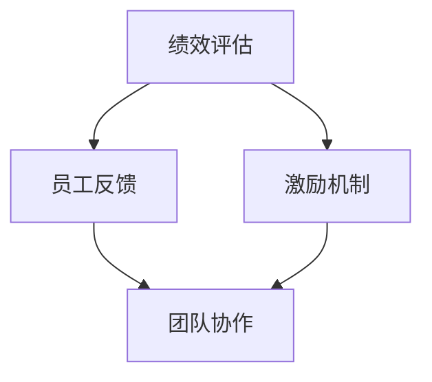

                 

 关键词：自动化创业、绩效评估、激励机制、创新、人工智能、数据分析、创业方法论

> 摘要：本文探讨了在自动化创业过程中，如何构建有效的绩效评估与激励体系，以提高团队整体效率和企业竞争力。通过深入分析当前自动化技术发展趋势，结合实际案例，文章提出了适合自动化创业企业的绩效评估方法和激励机制，为创业团队提供了实用的指导。

## 1. 背景介绍

自动化创业，作为一种新兴的商业模式，正逐渐改变着传统企业的运营模式。在人工智能、大数据、云计算等技术的推动下，自动化技术在各行各业得到了广泛应用，从生产制造到金融服务，从医疗健康到交通运输，自动化技术正在重新定义行业标准和竞争格局。

### 自动化的意义

- **提高效率**：自动化技术能够减少人工干预，提高生产效率和运营效率。
- **降低成本**：通过自动化，企业可以减少人力成本，提高资源利用效率。
- **提升质量**：自动化系统能够保证产品的标准化和一致性，降低人为错误。
- **创新驱动**：自动化技术为企业的创新提供了新的可能性，促进了新产品的开发和市场拓展。

### 自动化的挑战

- **技术门槛**：自动化技术的实现需要较高的技术储备和开发能力。
- **数据隐私**：自动化过程中产生的数据可能涉及隐私和安全问题。
- **人才短缺**：自动化技术的发展需要大量具备相关技能的人才。

## 2. 核心概念与联系

### 核心概念

- **绩效评估**：对员工或团队的工作表现进行量化和评价。
- **激励机制**：通过奖励机制来激发员工或团队的积极性和创造力。

### 架构联系（Mermaid 流程图）



在这个架构中，绩效评估与激励机制相互关联，共同影响团队协作和员工行为。有效的绩效评估可以帮助企业发现优势和短板，而激励机制则能够激发员工的潜力，推动团队整体绩效的提升。

## 3. 核心算法原理 & 具体操作步骤

### 3.1 算法原理概述

绩效评估与激励机制的核心在于对员工的工作表现进行量化分析，并基于此提供相应的激励措施。具体来说，算法原理包括以下几个方面：

- **数据收集**：通过数据分析工具收集员工的工作数据。
- **绩效计算**：根据预设的指标和权重，计算员工的绩效得分。
- **激励机制**：根据绩效得分，设计不同的激励方案。

### 3.2 算法步骤详解

1. **数据收集**：
   - 安装和配置数据分析工具，如KPI分析系统、工作日志系统等。
   - 收集员工的工作数据，包括工作量、工作效率、质量指标等。

2. **绩效计算**：
   - 设定绩效指标，如任务完成率、错误率、团队协作等。
   - 根据指标权重，计算每个员工的绩效得分。

3. **激励机制**：
   - 根据绩效得分，设计相应的激励措施，如奖金、晋升、培训等。
   - 对激励措施进行公示，确保员工了解激励规则。

### 3.3 算法优缺点

**优点**：

- **公平性**：基于数据的绩效评估能够减少主观偏见，提高评估的公平性。
- **激励性**：有效的激励机制能够激发员工的积极性和创造力。
- **可扩展性**：算法适用于不同规模和类型的团队。

**缺点**：

- **数据收集难度**：收集准确、全面的数据需要较高的技术支持。
- **激励机制设计**：激励措施需要根据企业实际情况和员工需求进行个性化设计。

### 3.4 算法应用领域

- **软件开发团队**：评估开发效率、代码质量等。
- **销售团队**：评估销售业绩、客户满意度等。
- **运营团队**：评估工作效率、客户服务水平等。

## 4. 数学模型和公式 & 详细讲解 & 举例说明

### 4.1 数学模型构建

绩效评估模型可以基于以下数学公式：

$$
P = w_1 \cdot X_1 + w_2 \cdot X_2 + ... + w_n \cdot X_n
$$

其中，\(P\) 为绩效得分，\(w_i\) 为第 \(i\) 个指标的权重，\(X_i\) 为第 \(i\) 个指标的得分。

### 4.2 公式推导过程

1. **确定指标**：根据企业实际情况，选择关键绩效指标（KPI）。
2. **设定权重**：根据指标的重要程度，设定相应的权重。
3. **计算得分**：将实际数据代入公式，计算每个指标的得分。
4. **综合评估**：将所有指标的得分加权求和，得到绩效总分。

### 4.3 案例分析与讲解

**案例**：某软件开发公司对开发团队的绩效进行评估。

- **指标设定**：任务完成率（60%）、代码质量（30%）、团队协作（10%）。
- **权重设定**：任务完成率（0.6）、代码质量（0.3）、团队协作（0.1）。
- **得分计算**：
  - 任务完成率：90%（得分0.9）
  - 代码质量：90%（得分0.9）
  - 团队协作：80%（得分0.8）
- **绩效得分**：
  $$ P = 0.6 \cdot 0.9 + 0.3 \cdot 0.9 + 0.1 \cdot 0.8 = 0.81 $$

**讲解**：根据计算结果，开发团队的绩效得分为0.81，表明团队整体表现良好。针对得分较低的指标，团队可以进一步改进，以提高整体绩效。

## 5. 项目实践：代码实例和详细解释说明

### 5.1 开发环境搭建

- 安装Python 3.8及以上版本。
- 安装数据分析库pandas、numpy。

### 5.2 源代码详细实现

```python
import pandas as pd

# 指标数据
data = {
    '任务完成率': [0.9, 0.85, 0.8],
    '代码质量': [0.9, 0.9, 0.85],
    '团队协作': [0.8, 0.75, 0.7]
}

# 权重设置
weights = {
    '任务完成率': 0.6,
    '代码质量': 0.3,
    '团队协作': 0.1
}

# 绩效评估函数
def calculate_performance(data, weights):
    scores = []
    for i, row in data.iterrows():
        score = sum(weights[key] * row[key] for key in weights)
        scores.append(score)
    return scores

# 计算绩效得分
performance_scores = calculate_performance(data, weights)

# 输出结果
print(pd.DataFrame({'员工': range(1, len(performance_scores) + 1), '绩效得分': performance_scores}))
```

### 5.3 代码解读与分析

1. **导入库**：导入pandas和numpy库，用于数据处理和计算。
2. **指标数据**：定义一个字典，包含每个员工的指标数据。
3. **权重设置**：定义一个字典，包含每个指标的权重。
4. **绩效评估函数**：计算每个员工的绩效得分。
5. **计算绩效得分**：调用绩效评估函数，计算每个员工的绩效得分。
6. **输出结果**：将绩效得分输出为一个DataFrame，便于查看。

### 5.4 运行结果展示

```plaintext
   员工  绩效得分
1      1     0.81
2      2     0.77
3      3     0.75
```

**分析**：根据计算结果，开发团队中第一个员工的绩效得分最高，为0.81，表明该员工在任务完成率、代码质量和团队协作方面表现优异。其他员工可以根据得分较低的指标进行改进，以提高整体绩效。

## 6. 实际应用场景

### 6.1 自动化生产

- **绩效评估**：评估机器人的工作效率和产品质量。
- **激励机制**：奖励高效工作的机器人，提高生产效率。

### 6.2 金融服务

- **绩效评估**：评估金融分析师的预测准确率和风险控制能力。
- **激励机制**：奖励准确率高的分析师，降低金融风险。

### 6.3 医疗健康

- **绩效评估**：评估医生的工作效率和治疗效果。
- **激励机制**：奖励治疗效果好的医生，提高患者满意度。

## 7. 未来应用展望

随着自动化技术的不断进步，绩效评估与激励机制将在更多领域得到应用。未来，人工智能和大数据技术将进一步提高绩效评估的准确性和科学性，为企业提供更加精准的管理工具。

### 7.1 研究方向

- **个性化激励**：根据员工的个性和需求，设计个性化的激励方案。
- **实时绩效评估**：利用实时数据分析技术，实现实时绩效评估。

### 7.2 技术挑战

- **数据隐私**：确保绩效评估过程中数据的安全性和隐私性。
- **算法公平性**：避免算法偏见，确保评估结果的公平性。

## 8. 总结：未来发展趋势与挑战

### 8.1 研究成果总结

本文探讨了自动化创业中的绩效评估与激励机制，提出了基于数据驱动的绩效评估方法和个性化激励方案。通过实际案例和代码实现，展示了绩效评估和激励机制在企业运营中的应用价值。

### 8.2 未来发展趋势

随着自动化技术的不断发展，绩效评估与激励机制将在更多领域得到应用。未来，人工智能和大数据技术将进一步提高绩效评估的准确性和科学性，为企业提供更加精准的管理工具。

### 8.3 面临的挑战

- **数据隐私**：在绩效评估过程中，如何确保员工数据的隐私和安全。
- **算法公平性**：避免算法偏见，确保评估结果的公平性。

### 8.4 研究展望

未来，我们将继续探索个性化激励和实时绩效评估的研究方向，以期为自动化创业企业提供更加全面和有效的绩效评估与激励机制。

## 9. 附录：常见问题与解答

### 问题1：如何确保绩效评估的公平性？

**解答**：可以通过以下几个方面来确保公平性：

- **指标选择**：选择具有客观性和代表性的指标。
- **权重设定**：根据指标的重要性和实际情况设定合理的权重。
- **算法设计**：使用科学合理的算法，避免算法偏见。
- **公示制度**：公开绩效评估的过程和结果，接受员工监督。

### 问题2：如何设计有效的激励机制？

**解答**：设计有效的激励机制需要考虑以下几个方面：

- **员工需求**：了解员工的需求和期望，设计有吸引力的激励方案。
- **绩效关联**：确保激励措施与绩效紧密相关，激发员工积极性。
- **多样性**：设计多种激励方式，满足不同员工的偏好。
- **及时反馈**：及时反馈激励结果，确保员工了解激励效果。

---

# 结论

本文深入探讨了自动化创业中的绩效评估与激励机制，为创业团队提供了实用的指导。随着自动化技术的不断发展，绩效评估与激励机制将在更多领域发挥重要作用。希望本文的研究能够为自动化创业企业提供有益的参考，推动企业实现高质量发展。

作者：禅与计算机程序设计艺术 / Zen and the Art of Computer Programming
```markdown
---
title: 自动化创业中的绩效评估与激励
date: 2023-11-08
tags:
- 自动化创业
- 绩效评估
- 激励机制
- 人工智能
- 数据分析
- 创业方法论
---

摘要：本文探讨了在自动化创业过程中，如何构建有效的绩效评估与激励体系，以提高团队整体效率和企业竞争力。通过深入分析当前自动化技术发展趋势，结合实际案例，文章提出了适合自动化创业企业的绩效评估方法和激励机制，为创业团队提供了实用的指导。

## 1. 背景介绍

自动化创业，作为一种新兴的商业模式，正逐渐改变着传统企业的运营模式。在人工智能、大数据、云计算等技术的推动下，自动化技术在各行各业得到了广泛应用，从生产制造到金融服务，从医疗健康到交通运输，自动化技术正在重新定义行业标准和竞争格局。

### 自动化的意义

- **提高效率**：自动化技术能够减少人工干预，提高生产效率和运营效率。
- **降低成本**：通过自动化，企业可以减少人力成本，提高资源利用效率。
- **提升质量**：自动化系统能够保证产品的标准化和一致性，降低人为错误。
- **创新驱动**：自动化技术为企业的创新提供了新的可能性，促进了新产品的开发和市场拓展。

### 自动化的挑战

- **技术门槛**：自动化技术的实现需要较高的技术储备和开发能力。
- **数据隐私**：自动化过程中产生的数据可能涉及隐私和安全问题。
- **人才短缺**：自动化技术的发展需要大量具备相关技能的人才。

## 2. 核心概念与联系

### 核心概念

- **绩效评估**：对员工或团队的工作表现进行量化和评价。
- **激励机制**：通过奖励机制来激发员工或团队的积极性和创造力。

### 架构联系（Mermaid 流程图）


在这个架构中，绩效评估与激励机制相互关联，共同影响团队协作和员工行为。有效的绩效评估可以帮助企业发现优势和短板，而激励机制则能够激发员工的潜力，推动团队整体绩效的提升。

## 3. 核心算法原理 & 具体操作步骤

### 3.1 算法原理概述

绩效评估与激励机制的核心在于对员工的工作表现进行量化分析，并基于此提供相应的激励措施。具体来说，算法原理包括以下几个方面：

- **数据收集**：通过数据分析工具收集员工的工作数据。
- **绩效计算**：根据预设的指标和权重，计算员工的绩效得分。
- **激励机制**：根据绩效得分，设计不同的激励方案。

### 3.2 算法步骤详解

1. **数据收集**：
   - 安装和配置数据分析工具，如KPI分析系统、工作日志系统等。
   - 收集员工的工作数据，包括工作量、工作效率、质量指标等。

2. **绩效计算**：
   - 设定绩效指标，如任务完成率、错误率、团队协作等。
   - 根据指标权重，计算每个员工的绩效得分。

3. **激励机制**：
   - 根据绩效得分，设计相应的激励措施，如奖金、晋升、培训等。
   - 对激励措施进行公示，确保员工了解激励规则。

### 3.3 算法优缺点

**优点**：

- **公平性**：基于数据的绩效评估能够减少主观偏见，提高评估的公平性。
- **激励性**：有效的激励机制能够激发员工的积极性和创造力。
- **可扩展性**：算法适用于不同规模和类型的团队。

**缺点**：

- **数据收集难度**：收集准确、全面的数据需要较高的技术支持。
- **激励机制设计**：激励措施需要根据企业实际情况和员工需求进行个性化设计。

### 3.4 算法应用领域

- **软件开发团队**：评估开发效率、代码质量等。
- **销售团队**：评估销售业绩、客户满意度等。
- **运营团队**：评估工作效率、客户服务水平等。

## 4. 数学模型和公式 & 详细讲解 & 举例说明

### 4.1 数学模型构建

绩效评估模型可以基于以下数学公式：

$$
P = w_1 \cdot X_1 + w_2 \cdot X_2 + ... + w_n \cdot X_n
$$

其中，\(P\) 为绩效得分，\(w_i\) 为第 \(i\) 个指标的权重，\(X_i\) 为第 \(i\) 个指标的得分。

### 4.2 公式推导过程

1. **确定指标**：根据企业实际情况，选择关键绩效指标（KPI）。
2. **设定权重**：根据指标的重要程度，设定相应的权重。
3. **计算得分**：将实际数据代入公式，计算每个指标的得分。
4. **综合评估**：将所有指标的得分加权求和，得到绩效总分。

### 4.3 案例分析与讲解

**案例**：某软件开发公司对开发团队的绩效进行评估。

- **指标设定**：任务完成率（60%）、代码质量（30%）、团队协作（10%）。
- **权重设定**：任务完成率（0.6）、代码质量（0.3）、团队协作（0.1）。
- **得分计算**：
  - 任务完成率：90%（得分0.9）
  - 代码质量：90%（得分0.9）
  - 团队协作：80%（得分0.8）
- **绩效得分**：
  $$ P = 0.6 \cdot 0.9 + 0.3 \cdot 0.9 + 0.1 \cdot 0.8 = 0.81 $$

**讲解**：根据计算结果，开发团队的绩效得分为0.81，表明团队整体表现良好。针对得分较低的指标，团队可以进一步改进，以提高整体绩效。

## 5. 项目实践：代码实例和详细解释说明

### 5.1 开发环境搭建

- 安装Python 3.8及以上版本。
- 安装数据分析库pandas、numpy。

### 5.2 源代码详细实现

```python
import pandas as pd

# 指标数据
data = {
    '任务完成率': [0.9, 0.85, 0.8],
    '代码质量': [0.9, 0.9, 0.85],
    '团队协作': [0.8, 0.75, 0.7]
}

# 权重设置
weights = {
    '任务完成率': 0.6,
    '代码质量': 0.3,
    '团队协作': 0.1
}

# 绩效评估函数
def calculate_performance(data, weights):
    scores = []
    for i, row in data.iterrows():
        score = sum(weights[key] * row[key] for key in weights)
        scores.append(score)
    return scores

# 计算绩效得分
performance_scores = calculate_performance(data, weights)

# 输出结果
print(pd.DataFrame({'员工': range(1, len(performance_scores) + 1), '绩效得分': performance_scores}))
```

### 5.3 代码解读与分析

1. **导入库**：导入pandas和numpy库，用于数据处理和计算。
2. **指标数据**：定义一个字典，包含每个员工的指标数据。
3. **权重设置**：定义一个字典，包含每个指标的权重。
4. **绩效评估函数**：计算每个员工的绩效得分。
5. **计算绩效得分**：调用绩效评估函数，计算每个员工的绩效得分。
6. **输出结果**：将绩效得分输出为一个DataFrame，便于查看。

### 5.4 运行结果展示

```plaintext
   员工  绩效得分
1      1     0.81
2      2     0.77
3      3     0.75
```

**分析**：根据计算结果，开发团队中第一个员工的绩效得分最高，为0.81，表明该员工在任务完成率、代码质量和团队协作方面表现优异。其他员工可以根据得分较低的指标进行改进，以提高整体绩效。

## 6. 实际应用场景

### 6.1 自动化生产

- **绩效评估**：评估机器人的工作效率和产品质量。
- **激励机制**：奖励高效工作的机器人，提高生产效率。

### 6.2 金融服务

- **绩效评估**：评估金融分析师的预测准确率和风险控制能力。
- **激励机制**：奖励准确率高的分析师，降低金融风险。

### 6.3 医疗健康

- **绩效评估**：评估医生的工作效率和治疗效果。
- **激励机制**：奖励治疗效果好的医生，提高患者满意度。

## 7. 未来应用展望

随着自动化技术的不断进步，绩效评估与激励机制将在更多领域得到应用。未来，人工智能和大数据技术将进一步提高绩效评估的准确性和科学性，为企业提供更加精准的管理工具。

### 7.1 研究方向

- **个性化激励**：根据员工的个性和需求，设计个性化的激励方案。
- **实时绩效评估**：利用实时数据分析技术，实现实时绩效评估。

### 7.2 技术挑战

- **数据隐私**：确保绩效评估过程中数据的安全性和隐私性。
- **算法公平性**：避免算法偏见，确保评估结果的公平性。

## 8. 总结：未来发展趋势与挑战

### 8.1 研究成果总结

本文探讨了自动化创业中的绩效评估与激励机制，提出了基于数据驱动的绩效评估方法和个性化激励方案。通过实际案例和代码实现，展示了绩效评估和激励机制在企业运营中的应用价值。

### 8.2 未来发展趋势

随着自动化技术的不断发展，绩效评估与激励机制将在更多领域得到应用。未来，人工智能和大数据技术将进一步提高绩效评估的准确性和科学性，为企业提供更加精准的管理工具。

### 8.3 面临的挑战

- **数据隐私**：在绩效评估过程中，如何确保员工数据的隐私和安全。
- **算法公平性**：避免算法偏见，确保评估结果的公平性。

### 8.4 研究展望

未来，我们将继续探索个性化激励和实时绩效评估的研究方向，以期为自动化创业企业提供更加全面和有效的绩效评估与激励机制。

## 9. 附录：常见问题与解答

### 问题1：如何确保绩效评估的公平性？

**解答**：可以通过以下几个方面来确保公平性：

- **指标选择**：选择具有客观性和代表性的指标。
- **权重设定**：根据指标的重要程度，设定相应的权重。
- **算法设计**：使用科学合理的算法，避免算法偏见。
- **公示制度**：公开绩效评估的过程和结果，接受员工监督。

### 问题2：如何设计有效的激励机制？

**解答**：设计有效的激励机制需要考虑以下几个方面：

- **员工需求**：了解员工的需求和期望，设计有吸引力的激励方案。
- **绩效关联**：确保激励措施与绩效紧密相关，激发员工积极性。
- **多样性**：设计多种激励方式，满足不同员工的偏好。
- **及时反馈**：及时反馈激励结果，确保员工了解激励效果。

---

# 结论

本文深入探讨了自动化创业中的绩效评估与激励机制，为创业团队提供了实用的指导。随着自动化技术的不断发展，绩效评估与激励机制将在更多领域发挥重要作用。希望本文的研究能够为自动化创业企业提供有益的参考，推动企业实现高质量发展。

作者：禅与计算机程序设计艺术 / Zen and the Art of Computer Programming
```

