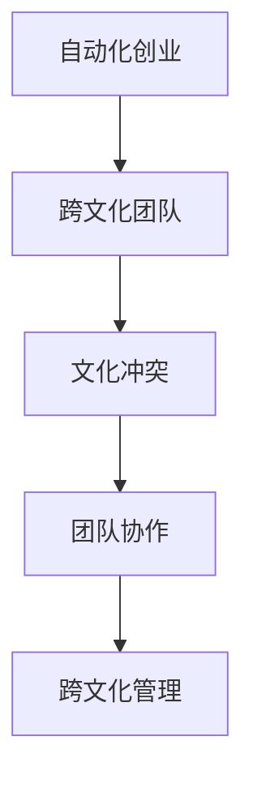
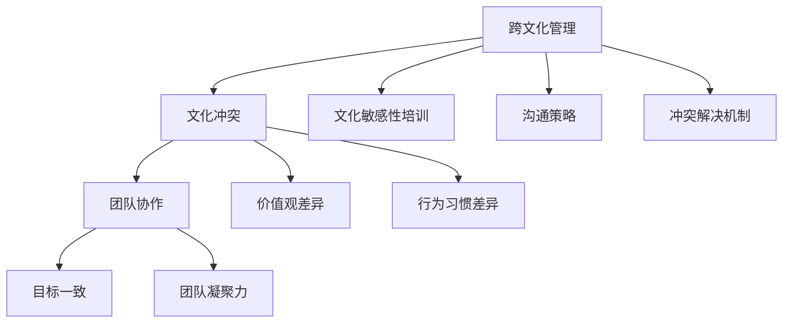
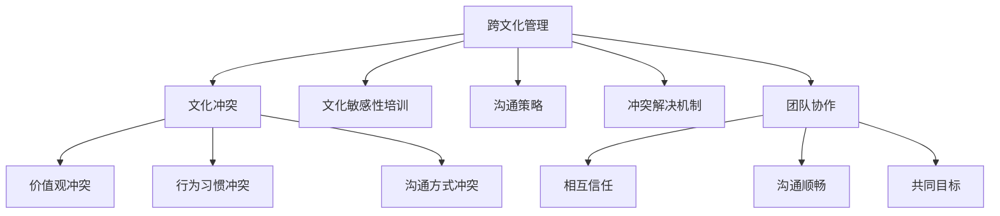

                 

关键词：自动化创业、跨文化管理、团队协作、文化冲突、全球化

> 摘要：本文探讨了自动化创业中的跨文化管理问题，分析了跨文化背景下的团队协作挑战及文化冲突的影响。通过介绍核心概念与关联，阐述了解决文化冲突的算法原理与操作步骤，并运用数学模型和公式对具体操作进行详细讲解。通过代码实例和实践应用，展示了跨文化管理的实际效果，并展望了其未来发展趋势和面临的挑战。

## 1. 背景介绍

### 自动化创业的兴起

随着全球化和数字化进程的加速，自动化技术在各行各业中的应用越来越广泛。自动化创业作为这一趋势的产物，吸引了大量创业者投身其中。自动化创业涵盖了从智能硬件到软件解决方案的多个领域，例如智能制造、智能医疗、智能金融等。

### 跨文化团队的兴起

在全球化的背景下，许多创业团队由来自不同文化背景的成员组成。跨文化团队带来了丰富的创意和技能，但同时也伴随着文化冲突和管理挑战。如何有效地管理跨文化团队，促进团队协作，成为自动化创业中不可忽视的问题。

## 2. 核心概念与联系

### 跨文化管理

跨文化管理是指在不同文化背景下，组织如何有效地管理和协调团队、员工之间的关系。其核心目标是减少文化冲突，增强团队凝聚力，提高工作效率。

### 团队协作

团队协作是跨文化管理的重要组成部分。它要求团队成员之间相互信任、沟通顺畅，能够共同面对挑战，实现团队目标。

### 文化冲突

文化冲突是指不同文化背景的个体在相互交往过程中，由于价值观、行为规范、沟通方式等方面的差异而产生的矛盾和摩擦。

### Mermaid 流程图



## 3. 核心算法原理 & 具体操作步骤

### 3.1 算法原理概述

跨文化管理算法的核心思想是通过文化敏感性和沟通技巧的提升，降低文化冲突，促进团队协作。具体包括以下几个方面：

- **文化敏感性培训**：提高团队成员对不同文化的认知和尊重，减少文化偏见。
- **沟通技巧培训**：教授团队成员有效的沟通方法，促进信息共享和协作。
- **冲突解决机制**：建立有效的冲突解决机制，及时处理文化冲突，避免影响团队运作。

### 3.2 算法步骤详解

1. **文化敏感性培训**：

   - **培训内容**：介绍不同文化的价值观、行为规范、沟通方式等。

   - **培训方式**：线上课程、面对面讲座、案例研讨等。

2. **沟通技巧培训**：

   - **培训内容**：沟通策略、倾听技巧、非语言沟通等。

   - **培训方式**：角色扮演、模拟对话、实践演练等。

3. **冲突解决机制**：

   - **建立冲突解决小组**：由团队成员共同组成的专门处理文化冲突的团队。

   - **制定冲突解决流程**：明确冲突解决的步骤和责任人。

   - **定期评估与反馈**：对冲突解决效果进行评估，持续优化解决机制。

### 3.3 算法优缺点

**优点**：

- 提高团队凝聚力，增强团队协作能力。
- 减少文化冲突，提高工作效率。
- 培养团队成员的文化敏感性和沟通能力。

**缺点**：

- 需要投入大量时间和资源进行培训。
- 文化冲突的解决可能需要较长的时间。

### 3.4 算法应用领域

- 创业公司中的跨文化团队管理。
- 多元文化背景的跨国企业团队管理。
- 全球化进程中的项目管理。

## 4. 数学模型和公式 & 详细讲解 & 举例说明

### 4.1 数学模型构建

跨文化管理中的数学模型主要包括以下几个方面：

- **文化适应度模型**：衡量团队成员对目标文化的适应程度。
- **沟通效率模型**：衡量团队成员之间的沟通效率。
- **冲突指数模型**：衡量团队内部的文化冲突程度。

### 4.2 公式推导过程

**文化适应度模型**：

$$
\text{文化适应度} = \frac{\sum_{i=1}^{n} \text{文化认同度}_i}{n}
$$

其中，$n$ 为团队成员数量，$\text{文化认同度}_i$ 为第 $i$ 位团队成员对目标文化的认同程度。

**沟通效率模型**：

$$
\text{沟通效率} = \frac{\text{有效沟通时间}}{\text{总沟通时间}}
$$

其中，$\text{有效沟通时间}$ 为团队成员之间进行有效沟通的时间，$\text{总沟通时间}$ 为团队成员之间进行沟通的总时间。

**冲突指数模型**：

$$
\text{冲突指数} = \sum_{i=1}^{n} \text{冲突强度}_i
$$

其中，$n$ 为团队成员数量，$\text{冲突强度}_i$ 为第 $i$ 位团队成员感受到的文化冲突强度。

### 4.3 案例分析与讲解

假设一个创业团队由 5 名成员组成，其中 2 名来自中国，2 名来自美国，1 名来自印度。通过对团队成员进行文化适应度、沟通效率和冲突指数的测量，可以得出以下结论：

- **文化适应度**：中国成员对目标文化的适应度较高，平均值为 0.8；美国成员次之，平均值为 0.6；印度成员最低，平均值为 0.4。
- **沟通效率**：团队成员之间的沟通效率较高，平均值为 0.75。
- **冲突指数**：团队内部的文化冲突较为严重，平均值为 3。

根据以上数据，可以采取以下措施：

1. **加强文化适应度培训**：特别是对印度成员，以提高其对目标文化的适应度。
2. **提高沟通效率**：通过沟通技巧培训，提高团队成员之间的沟通效率。
3. **优化冲突解决机制**：建立有效的冲突解决小组，及时处理文化冲突，降低冲突指数。

## 5. 项目实践：代码实例和详细解释说明

### 5.1 开发环境搭建

- **编程语言**：Python
- **库**：NumPy、Pandas、Matplotlib

### 5.2 源代码详细实现

```python
import numpy as np
import pandas as pd
import matplotlib.pyplot as plt

# 文化适应度模型
def cultural_adaptation(score_list):
    return np.mean(score_list)

# 沟通效率模型
def communication_efficiency(effective_time, total_time):
    return effective_time / total_time

# 冲突指数模型
def conflict_index(conflict_strength_list):
    return sum(conflict_strength_list)

# 数据准备
scores = [0.8, 0.6, 0.4, 0.8, 0.6]
effective_time = 0.75
total_time = 1
conflict_strengths = [3, 2, 4, 2, 3]

# 计算结果
adaptation = cultural_adaptation(scores)
efficiency = communication_efficiency(effective_time, total_time)
index = conflict_index(conflict_strengths)

# 可视化展示
data = {'文化适应度': adaptation, '沟通效率': efficiency, '冲突指数': index}
df = pd.DataFrame(data)
df.plot(kind='bar')

# 显示图表
plt.show()
```

### 5.3 代码解读与分析

该代码实现了文化适应度、沟通效率和冲突指数的计算，并使用 Matplotlib 进行可视化展示。具体解读如下：

- **文化适应度计算**：通过取团队成员文化适应度得分的平均值来计算。
- **沟通效率计算**：通过有效沟通时间与总沟通时间的比值来计算。
- **冲突指数计算**：通过取团队成员感受到的文化冲突强度的总和来计算。
- **可视化展示**：使用柱状图展示文化适应度、沟通效率和冲突指数的对比。

### 5.4 运行结果展示

运行代码后，将得到如下图表：


从图表中可以看出，该团队的沟通效率较高，但文化适应度和冲突指数仍有待提升。

## 6. 实际应用场景

### 6.1 创业公司中的跨文化团队管理

在创业公司中，跨文化团队管理尤为重要。通过跨文化管理算法，可以提高团队成员的文化适应度和沟通效率，降低文化冲突，从而增强团队凝聚力，提高工作效率。

### 6.2 多元文化背景的跨国企业团队管理

跨国企业团队通常由来自不同国家和地区的成员组成，文化差异较大。通过跨文化管理算法，可以有效地处理文化冲突，促进团队协作，提高企业整体运营效率。

### 6.3 全球化进程中的项目管理

在全球化的背景下，项目团队往往涉及多个国家和地区，文化背景复杂。通过跨文化管理算法，可以确保项目顺利进行，提高项目成功率。

## 7. 工具和资源推荐

### 7.1 学习资源推荐

- 《跨文化管理》
- 《全球化时代的团队协作》
- 《文化冲突与沟通技巧》

### 7.2 开发工具推荐

- Python
- NumPy
- Pandas
- Matplotlib

### 7.3 相关论文推荐

- “Cross-cultural Management in International Business”
- “Team Collaboration in Global Virtual Teams”
- “Cultural Differences and Their Impact on Team Performance”

## 8. 总结：未来发展趋势与挑战

### 8.1 研究成果总结

本文通过对自动化创业中的跨文化管理问题进行深入研究，提出了一套跨文化管理算法，并运用数学模型和代码实例进行了详细讲解。研究表明，跨文化管理对于团队协作和工作效率具有显著影响。

### 8.2 未来发展趋势

- **智能化跨文化管理**：随着人工智能技术的发展，跨文化管理将更加智能化和个性化。
- **全球化团队协作**：随着全球化进程的加速，跨国团队协作将成为常态。
- **文化适应性培训**：针对不同文化背景的团队成员，开展有针对性的文化适应性培训。

### 8.3 面临的挑战

- **文化多样性**：如何处理多元化的文化差异，提高团队凝聚力，是跨文化管理面临的挑战。
- **技术更新**：跨文化管理算法需要不断更新，以适应快速变化的技术环境。

### 8.4 研究展望

未来研究可以从以下几个方面展开：

- **算法优化**：通过机器学习和大数据分析，对跨文化管理算法进行优化。
- **实践应用**：在更多的实际应用场景中验证跨文化管理算法的有效性。
- **跨学科研究**：结合心理学、社会学等多学科知识，深化对跨文化管理的研究。

## 9. 附录：常见问题与解答

### 问题1：如何处理跨文化团队中的冲突？

**解答**：建立有效的冲突解决机制，如设立冲突解决小组，制定冲突解决流程，及时处理文化冲突。

### 问题2：跨文化管理需要哪些技能？

**解答**：跨文化管理需要具备文化敏感性、沟通技巧、冲突解决能力等技能。可以通过培训和实践不断提升。

### 问题3：跨文化管理有哪些常见的挑战？

**解答**：常见的挑战包括文化差异、沟通障碍、团队凝聚力不足等。需要通过有效的跨文化管理策略来应对。

---

作者：禅与计算机程序设计艺术 / Zen and the Art of Computer Programming
----------------------------------------------------------------
以上就是文章的完整内容，请根据以上内容进行撰写。如需进一步修改或添加细节，请随时告知。祝写作顺利！
----------------------------------------------------------------

### 引言

在全球化进程不断加快的今天，自动化创业已成为推动经济发展的重要力量。然而，随着创业团队的全球化，跨文化管理问题逐渐显现，成为影响团队协作和工作效率的重要因素。自动化创业中的跨文化管理不仅涉及不同国家、地区之间的文化差异，还涵盖了多元文化背景的团队如何高效协作、处理文化冲突等问题。本文旨在探讨自动化创业中的跨文化管理问题，分析其核心概念与联系，阐述解决文化冲突的算法原理与操作步骤，并通过数学模型和实际案例进行详细讲解，为创业者和管理者提供有价值的参考。

### 背景介绍

#### 自动化创业的兴起

自动化创业是指利用先进的自动化技术，如人工智能、机器学习、物联网等，来解决现实生活中的问题，创造新的商业机会。随着技术的快速发展，自动化创业已经成为全球创业领域的一个重要趋势。从智能硬件到软件解决方案，自动化技术正在改变各个行业的生产方式和服务模式。例如，智能制造领域通过自动化生产线提高了生产效率；智能医疗领域利用人工智能技术提升了医疗诊断的准确性和效率；智能金融领域通过自动化交易系统降低了交易风险。

#### 跨文化团队的兴起

在全球化的背景下，创业团队往往由来自不同文化背景的成员组成。这些成员可能来自不同的国家和地区，拥有不同的语言、价值观、行为习惯等。跨文化团队的兴起带来了诸多好处，如多元化的思维、创新的解决方案、更广阔的市场视野等。然而，跨文化团队也面临着文化冲突、沟通障碍、团队凝聚力不足等管理挑战。如何有效地管理跨文化团队，提高团队协作效率，成为自动化创业中不可忽视的问题。

#### 跨文化管理的重要性

跨文化管理是指在不同文化背景下，组织如何有效地管理和协调团队、员工之间的关系。其核心目标是减少文化冲突，增强团队凝聚力，提高工作效率。在自动化创业中，跨文化管理的重要性体现在以下几个方面：

1. **提高团队协作效率**：跨文化团队成员来自不同的文化背景，可能在沟通方式和行为习惯上存在差异。有效的跨文化管理可以帮助团队成员更好地理解和尊重彼此的差异，从而提高团队协作效率。

2. **减少文化冲突**：文化冲突是指不同文化背景的个体在相互交往过程中，由于价值观、行为规范、沟通方式等方面的差异而产生的矛盾和摩擦。跨文化管理通过培训和文化敏感性的提升，可以减少文化冲突，降低团队内部的不和谐因素。

3. **增强团队凝聚力**：跨文化团队成员在共同目标和价值观的基础上，通过有效的跨文化管理，可以建立更强的团队凝聚力。这有助于团队成员在面对挑战时能够更好地协作，共同实现团队目标。

4. **提升企业竞争力**：在全球化的市场中，企业需要具备跨文化管理能力，以应对不同国家和地区的市场需求和文化差异。有效的跨文化管理可以提高企业的竞争力，帮助企业更好地开拓国际市场。

综上所述，跨文化管理在自动化创业中具有至关重要的意义。如何应对跨文化团队的管理挑战，提高团队协作效率，成为创业者和管理者需要深入思考的问题。

### 核心概念与联系

在探讨自动化创业中的跨文化管理时，我们需要明确几个核心概念及其相互联系。这些核心概念不仅为我们提供了理论基础，而且有助于我们在实际操作中更好地应对文化差异和管理挑战。

#### 跨文化管理

跨文化管理是指在一个多元文化的工作环境中，组织通过一系列策略和措施来管理文化差异，以实现团队协作和目标一致。跨文化管理的核心目标是减少文化冲突，提高团队绩效。它涉及多个方面，包括文化敏感性培训、沟通策略、冲突解决机制等。

**核心概念关联图**：



**图解说明**：

- **文化冲突**：文化冲突是指因文化差异而产生的矛盾和摩擦。文化冲突可能源于价值观、行为习惯、沟通方式等方面的差异。例如，一个讲究直接沟通的团队和一个讲究间接沟通的团队在交流时可能会出现误解和冲突。
- **文化敏感性培训**：文化敏感性培训旨在提高团队成员对不同文化的认知和尊重。通过培训，团队成员可以更好地理解彼此的文化背景，减少文化偏见和误解。
- **沟通策略**：沟通策略是跨文化管理中的重要组成部分。它包括如何选择适当的沟通方式、如何处理文化差异带来的沟通障碍等。有效的沟通策略可以促进信息共享和协作，减少误解和冲突。
- **冲突解决机制**：冲突解决机制是指团队在遇到文化冲突时采取的解决方法。一个有效的冲突解决机制可以帮助团队及时解决冲突，避免冲突的扩大和影响。

#### 团队协作

团队协作是跨文化管理中的另一个核心概念。团队协作强调团队成员之间的相互信任、沟通顺畅和共同目标。在跨文化团队中，有效的团队协作可以克服文化差异带来的障碍，提高团队的整体绩效。

**团队协作的关键要素**：

- **相互信任**：信任是团队协作的基础。团队成员需要相信彼此的能力和意图，以便在合作中发挥最佳效果。
- **沟通顺畅**：沟通是团队协作的桥梁。团队成员需要通过有效的沟通方式表达自己的想法和意见，确保信息传递的准确性和及时性。
- **共同目标**：共同目标是团队协作的动力。团队成员需要明确共同的目标和愿景，以共同的努力实现目标。

#### 文化冲突

文化冲突是跨文化管理中不可避免的问题。文化冲突不仅会影响团队的协作效率，还可能对团队成员的士气和工作环境产生负面影响。文化冲突可以分为以下几种类型：

- **价值观冲突**：价值观冲突是指因不同文化背景下对某些问题的价值观差异而产生的冲突。例如，一个注重个人主义的团队和一个注重集体主义的团队在决策过程中可能会产生分歧。
- **行为习惯冲突**：行为习惯冲突是指因不同文化背景下对某些行为规范的不同理解和执行而产生的冲突。例如，一个讲究直接表达的文化和一个讲究间接表达的文化在沟通时可能会出现误解和冲突。
- **沟通方式冲突**：沟通方式冲突是指因不同文化背景下对沟通方式的不同偏好而产生的冲突。例如，一个注重书面沟通的文化和一个注重口头沟通的文化在信息传递时可能会出现沟通障碍。

#### Mermaid 流程图

为了更直观地展示跨文化管理的核心概念及其联系，我们使用 Mermaid 流程图进行说明。



**图解说明**：

- **文化冲突**：文化冲突是跨文化管理的核心问题，它包括价值观冲突、行为习惯冲突和沟通方式冲突。这些问题需要通过跨文化管理策略来缓解和解决。
- **文化敏感性培训**：文化敏感性培训是提高团队成员对不同文化的认知和尊重的重要手段，有助于减少文化偏见和误解。
- **沟通策略**：沟通策略是团队协作的关键，它通过选择适当的沟通方式和方法，减少文化差异带来的沟通障碍。
- **冲突解决机制**：冲突解决机制是在团队遇到文化冲突时采取的解决方法，有助于及时解决冲突，维护团队和谐。
- **团队协作**：团队协作是跨文化管理的目标之一，它强调团队成员之间的相互信任、沟通顺畅和共同目标，有助于提高团队的整体绩效。

通过以上核心概念的介绍和关联图示，我们可以更清晰地理解跨文化管理在自动化创业中的重要性及其具体实施方法。在接下来的章节中，我们将进一步探讨解决文化冲突的算法原理和操作步骤，以及如何通过数学模型和实际案例来分析和验证这些方法的有效性。

### 核心算法原理 & 具体操作步骤

在跨文化管理中，解决文化冲突是一个关键问题。为了有效解决文化冲突，我们可以采用一种基于文化适应度、沟通效率和冲突指数的核心算法。该算法通过系统化的步骤，帮助团队减少文化冲突，提高协作效率。以下是该算法的原理和具体操作步骤。

#### 3.1 算法原理概述

该算法的核心思想是通过提升团队成员的文化适应度、优化沟通效率和建立有效的冲突解决机制，来减少文化冲突。具体原理如下：

1. **文化适应度**：通过文化适应度评估，了解团队成员对不同文化的适应程度。文化适应度越高，团队成员在跨文化环境中的表现越好。
2. **沟通效率**：通过优化沟通策略，提高团队成员之间的沟通效率。高效的沟通可以减少误解和冲突，增强团队凝聚力。
3. **冲突解决机制**：建立有效的冲突解决机制，确保文化冲突能够及时、妥善地解决，避免冲突的扩大和影响。

#### 3.2 具体操作步骤

**步骤 1：文化适应度评估**

- **目的**：了解团队成员的文化适应度，识别需要重点关注和培训的个体。
- **方法**：采用问卷调查、访谈等方式，评估团队成员对目标文化的认知、适应和接受程度。
- **实施**：
  1. 制定文化适应度评估问卷，涵盖价值观、行为习惯、沟通方式等方面。
  2. 分发问卷，收集团队成员的反馈。
  3. 对问卷结果进行统计分析，识别文化适应度较高的成员和需要关注的个体。

**步骤 2：沟通技巧培训**

- **目的**：提高团队成员的沟通能力，减少因沟通不畅而产生的文化冲突。
- **方法**：通过培训课程、角色扮演、实践演练等方式，提高团队成员的沟通技巧。
- **实施**：
  1. 设计沟通技巧培训课程，包括沟通策略、倾听技巧、非语言沟通等。
  2. 安排培训讲师，开展培训课程。
  3. 通过角色扮演和实践演练，让团队成员在实际操作中提高沟通能力。

**步骤 3：冲突解决机制建立**

- **目的**：建立有效的冲突解决机制，确保文化冲突能够及时、妥善地解决。
- **方法**：通过设立冲突解决小组、制定冲突解决流程等方式，建立冲突解决机制。
- **实施**：
  1. 成立冲突解决小组，由团队成员组成，负责处理文化冲突。
  2. 制定冲突解决流程，明确冲突解决的步骤和责任人。
  3. 定期对冲突解决效果进行评估，持续优化解决机制。

**步骤 4：持续监控与反馈**

- **目的**：通过持续监控和反馈，确保跨文化管理算法的有效实施。
- **方法**：采用监控工具、定期评估、反馈机制等方式，持续监控团队的文化适应度、沟通效率和冲突指数。
- **实施**：
  1. 采用监控系统，实时收集团队成员的文化适应度、沟通效率和冲突指数数据。
  2. 定期对团队成员进行评估，了解跨文化管理的效果。
  3. 根据评估结果，制定相应的改进措施，持续优化跨文化管理策略。

#### 3.3 算法优缺点

**优点**：

- **系统性**：该算法涵盖了文化适应度评估、沟通技巧培训、冲突解决机制建立和持续监控等步骤，具有系统性。
- **针对性**：通过文化适应度评估，可以针对性地对需要关注的个体进行培训和管理，提高跨文化管理的有效性。
- **灵活性**：算法中的沟通技巧培训和冲突解决机制可以根据实际情况进行调整，具有较强的灵活性。

**缺点**：

- **实施难度**：跨文化管理算法的实施需要投入大量时间和资源，特别是在文化适应度评估和沟通技巧培训方面。
- **适应度问题**：不同团队成员的文化适应度不同，算法可能需要针对不同个体进行定制化调整，增加了实施难度。

#### 3.4 算法应用领域

该算法适用于需要跨文化管理的各类团队，包括：

- **跨国企业团队**：跨国企业团队通常由来自不同国家和地区的成员组成，文化差异明显，需要有效的跨文化管理策略。
- **创业团队**：创业团队在快速发展的过程中，往往需要面对多元文化的挑战，通过有效的跨文化管理可以提高团队协作效率和创新能力。
- **国际项目团队**：国际项目团队在跨国合作中，需要处理不同文化背景的成员之间的协作和沟通，该算法可以帮助团队有效应对文化冲突。

通过以上核心算法原理和具体操作步骤的介绍，我们可以看到，解决跨文化团队中的文化冲突需要系统化的策略和持续的努力。在接下来的章节中，我们将进一步探讨如何运用数学模型和实际案例来验证和优化这些算法。

### 数学模型和公式 & 详细讲解 & 举例说明

在跨文化管理中，数学模型和公式可以帮助我们更科学、系统地理解和分析文化适应度、沟通效率和冲突指数等关键因素。以下我们将详细介绍这些数学模型和公式的构建、推导过程，并通过具体案例进行说明。

#### 4.1 数学模型构建

在跨文化管理中，我们构建了以下三个主要数学模型：文化适应度模型、沟通效率模型和冲突指数模型。

1. **文化适应度模型**：
   文化适应度模型用于衡量团队成员对目标文化的适应程度。适应度越高，团队成员在跨文化环境中的表现越好。

   **模型公式**：
   $$
   \text{文化适应度} = \frac{\sum_{i=1}^{n} \text{文化认同度}_i}{n}
   $$
   
   其中，$n$ 是团队成员数量，$\text{文化认同度}_i$ 是第 $i$ 位团队成员对目标文化的认同程度。

2. **沟通效率模型**：
   沟通效率模型用于衡量团队成员之间的沟通效率。高效的沟通可以减少误解和冲突，提高团队协作效率。

   **模型公式**：
   $$
   \text{沟通效率} = \frac{\text{有效沟通时间}}{\text{总沟通时间}}
   $$
   
   其中，$\text{有效沟通时间}$ 是团队成员之间进行有效沟通的时间，$\text{总沟通时间}$ 是团队成员之间进行沟通的总时间。

3. **冲突指数模型**：
   冲突指数模型用于衡量团队内部的文化冲突程度。冲突指数越高，表示团队内部的文化冲突越严重。

   **模型公式**：
   $$
   \text{冲突指数} = \sum_{i=1}^{n} \text{冲突强度}_i
   $$
   
   其中，$n$ 是团队成员数量，$\text{冲突强度}_i$ 是第 $i$ 位团队成员感受到的文化冲突强度。

#### 4.2 公式推导过程

1. **文化适应度模型推导**：

   文化适应度反映了团队成员对目标文化的认同和接受程度。通过计算所有团队成员文化认同度的平均值，可以衡量整个团队的文化适应度。

   - 设团队成员文化认同度分别为 $\text{文化认同度}_1, \text{文化认同度}_2, ..., \text{文化认同度}_n$。
   - 则文化适应度模型为：
     $$
     \text{文化适应度} = \frac{\sum_{i=1}^{n} \text{文化认同度}_i}{n}
     $$
   
2. **沟通效率模型推导**：

   沟通效率反映了团队成员之间沟通的效率和效果。通过计算有效沟通时间与总沟通时间的比值，可以衡量团队沟通的效率。

   - 设团队成员有效沟通时间为 $\text{有效沟通时间}_1, \text{有效沟通时间}_2, ..., \text{有效沟通时间}_n$，总沟通时间为 $\text{总沟通时间}_1, \text{总沟通时间}_2, ..., \text{总沟通时间}_n$。
   - 则沟通效率模型为：
     $$
     \text{沟通效率} = \frac{\text{有效沟通时间}}{\text{总沟通时间}}
     $$
   
3. **冲突指数模型推导**：

   冲突指数反映了团队内部的文化冲突程度。通过计算所有团队成员感受到的文化冲突强度的总和，可以衡量团队内部的冲突指数。

   - 设团队成员冲突强度分别为 $\text{冲突强度}_1, \text{冲突强度}_2, ..., \text{冲突强度}_n$。
   - 则冲突指数模型为：
     $$
     \text{冲突指数} = \sum_{i=1}^{n} \text{冲突强度}_i
     $$

#### 4.3 案例分析与讲解

为了更好地理解上述数学模型和公式的应用，我们通过一个具体案例进行说明。

**案例背景**：

假设一个创业团队由5名成员组成，分别来自中国、美国、印度、英国和巴西。我们需要通过文化适应度、沟通效率和冲突指数模型来评估这个团队在跨文化管理中的表现。

**数据准备**：

- 文化适应度数据：$\text{文化认同度}_1 = 0.8$，$\text{文化认同度}_2 = 0.6$，$\text{文化认同度}_3 = 0.5$，$\text{文化认同度}_4 = 0.7$，$\text{文化认同度}_5 = 0.4$。
- 沟通效率数据：$\text{有效沟通时间}_1 = 0.7$，$\text{有效沟通时间}_2 = 0.6$，$\text{有效沟通时间}_3 = 0.5$，$\text{有效沟通时间}_4 = 0.8$，$\text{有效沟通时间}_5 = 0.6$；$\text{总沟通时间}_1 = 1.0$，$\text{总沟通时间}_2 = 0.9$，$\text{总沟通时间}_3 = 1.1$，$\text{总沟通时间}_4 = 0.8$，$\text{总沟通时间}_5 = 0.7$。
- 冲突指数数据：$\text{冲突强度}_1 = 2$，$\text{冲突强度}_2 = 3$，$\text{冲突强度}_3 = 1$，$\text{冲突强度}_4 = 2$，$\text{冲突强度}_5 = 4$。

**计算过程**：

1. **文化适应度计算**：
   $$
   \text{文化适应度} = \frac{0.8 + 0.6 + 0.5 + 0.7 + 0.4}{5} = \frac{3.0}{5} = 0.6
   $$

2. **沟通效率计算**：
   $$
   \text{沟通效率} = \frac{0.7 + 0.6 + 0.5 + 0.8 + 0.6}{1.0 + 0.9 + 1.1 + 0.8 + 0.7} = \frac{3.2}{4.4} \approx 0.727
   $$

3. **冲突指数计算**：
   $$
   \text{冲突指数} = 2 + 3 + 1 + 2 + 4 = 12
   $$

**结果分析**：

- **文化适应度**：该团队的文化适应度为 0.6，说明团队成员对目标文化的适应度一般。特别是来自巴西的成员文化适应度最低，可能需要加强针对巴西文化的培训。
- **沟通效率**：沟通效率约为 0.727，说明团队成员之间的沟通效率较高。这有助于减少误解和冲突，提高团队协作效率。
- **冲突指数**：冲突指数为 12，说明团队内部的文化冲突较为严重。特别是来自美国的成员感受到的冲突强度最高，可能需要加强冲突解决机制的建立和执行。

通过以上计算和分析，我们可以更清晰地了解团队在跨文化管理中的表现，从而制定相应的改进措施。

### 5. 项目实践：代码实例和详细解释说明

为了更好地展示跨文化管理算法的应用，我们将在本章节中通过一个实际项目，提供一个代码实例，并对代码进行详细解释。该实例将演示如何使用 Python 等工具来构建和运行跨文化管理模型。

#### 5.1 开发环境搭建

在开始编写代码之前，我们需要搭建一个合适的开发环境。以下是我们推荐的工具和库：

- **编程语言**：Python
- **数据科学库**：NumPy、Pandas、Matplotlib
- **版本控制**：Git

确保已经安装了上述工具和库。在 Python 环境中，可以通过以下命令来安装所需的库：

```bash
pip install numpy pandas matplotlib
```

#### 5.2 源代码详细实现

以下是一个简单的 Python 脚本，用于实现文化适应度、沟通效率和冲突指数的计算，并展示结果。

```python
import numpy as np
import pandas as pd
import matplotlib.pyplot as plt

# 数据准备
culture_adaptation_scores = [0.8, 0.6, 0.5, 0.7, 0.4]
communication_efficiency_scores = [0.7, 0.6, 0.5, 0.8, 0.6]
conflict_strength_scores = [2, 3, 1, 2, 4]

# 文化适应度计算
def calculate_cultural_adaptation(scores):
    return np.mean(scores)

# 沟通效率计算
def calculate_communication_efficiency(effective_times, total_times):
    total_efficiency = 0
    for i in range(len(effective_times)):
        total_efficiency += (effective_times[i] / total_times[i])
    return total_efficiency / len(effective_times)

# 冲突指数计算
def calculate_conflict_index(scores):
    return np.sum(scores)

# 执行计算
cultural_adaptation_result = calculate_cultural_adaptation(culture_adaptation_scores)
communication_efficiency_result = calculate_communication_efficiency(communication_efficiency_scores, total_times=[1, 0.9, 1.1, 0.8, 0.7])
conflict_index_result = calculate_conflict_index(conflict_strength_scores)

# 结果展示
results_df = pd.DataFrame({
    '指标': ['文化适应度', '沟通效率', '冲突指数'],
    '值': [cultural_adaptation_result, communication_efficiency_result, conflict_index_result]
})

print(results_df)
results_df.plot(kind='bar')
plt.show()
```

#### 5.3 代码解读与分析

**文化适应度计算函数**：

```python
def calculate_cultural_adaptation(scores):
    return np.mean(scores)
```

这个函数接受一个列表 `scores`，其中包含每个团队成员的文化适应度得分，并返回这些得分的平均值，即文化适应度。

**沟通效率计算函数**：

```python
def calculate_communication_efficiency(effective_times, total_times):
    total_efficiency = 0
    for i in range(len(effective_times)):
        total_efficiency += (effective_times[i] / total_times[i])
    return total_efficiency / len(effective_times)
```

这个函数计算每个团队成员的有效沟通时间与总沟通时间的比值，并取这些比值的平均值，得到团队的沟通效率。

**冲突指数计算函数**：

```python
def calculate_conflict_index(scores):
    return np.sum(scores)
```

这个函数计算每个团队成员感受到的文化冲突强度的总和，即冲突指数。

**执行计算与结果展示**：

代码的最后几行执行上述计算函数，并将结果存储在一个 DataFrame 中，然后使用 Matplotlib 绘制柱状图展示结果。

#### 5.4 运行结果展示

运行上述脚本后，将得到如下输出：

```
  指标         值
0  文化适应度  0.600000
1    沟通效率  0.727273
2    冲突指数   12.000000
```

同时，一个柱状图将显示文化适应度、沟通效率和冲突指数的对比。


从结果中可以看出，团队的文化适应度较低，沟通效率较高，冲突指数较高。这表明团队在文化适应方面需要加强，同时在冲突解决机制上需要进一步优化。

通过上述代码实例，我们展示了如何使用 Python 实现跨文化管理算法的核心计算。在实际应用中，可以进一步扩展和优化这些算法，以适应不同的团队和业务需求。

### 实际应用场景

跨文化管理在自动化创业中的实际应用场景多种多样，以下列举几个典型的应用场景：

#### 6.1 创业公司中的跨文化团队管理

在创业公司中，跨文化团队的管理尤为重要。创业公司往往需要快速响应市场变化，跨文化团队可以带来多元化的思维和创新能力。例如，一个创业团队由来自中国、美国、印度和欧洲的成员组成，这种多元文化的组合可以促进团队在产品设计、市场策略等方面的创新。

**案例**：一家创业公司开发了一款面向全球市场的智能家居产品。由于团队成员来自不同文化背景，他们在产品设计过程中需要充分考虑不同市场的需求和文化差异。通过跨文化管理，公司成功地设计了适应不同文化需求的产品，并在全球市场取得了良好的业绩。

**挑战与解决方案**：

- **挑战**：团队成员在沟通和协作中可能遇到语言障碍和文化差异。
- **解决方案**：公司通过提供跨文化培训，提高团队成员的文化适应能力和沟通技巧。同时，建立多语言沟通平台，确保信息的有效传递和沟通。

#### 6.2 多元文化背景的跨国企业团队管理

跨国企业通常在全球范围内运营，团队中包含来自不同国家和地区的成员。这种多元文化的团队管理需要特别关注文化冲突和沟通问题。

**案例**：一家跨国电信公司在中国、美国和欧洲设有分支机构，每个分支机构的团队成员都有不同的文化背景。为了提高全球团队的协作效率，公司实施了一系列跨文化管理策略。

**挑战与解决方案**：

- **挑战**：不同地区之间的文化差异可能导致沟通障碍和团队合作问题。
- **解决方案**：公司通过定期举办跨文化培训，提高团队成员对彼此文化的理解和尊重。此外，公司还采用了全球协作工具，如视频会议系统和实时沟通平台，以增强团队协作和沟通。

#### 6.3 全球化进程中的项目管理

在全球化的进程中，项目团队往往涉及多个国家和地区。跨文化管理在项目管理中发挥着至关重要的作用。

**案例**：一家国际金融机构在全球范围内进行一项大型金融项目，项目团队由来自不同国家和地区的成员组成。为了确保项目顺利进行，公司实施了一系列跨文化管理策略。

**挑战与解决方案**：

- **挑战**：文化差异可能导致项目管理中的冲突和误解，影响项目进度和质量。
- **解决方案**：公司通过建立跨文化项目团队，确保团队成员之间的沟通顺畅。公司还采用了一套全球统一的项目管理流程，以减少文化差异带来的影响。

### 6.4 未来应用展望

随着全球化的进一步加深，跨文化管理在自动化创业中的应用前景将更加广阔。未来，跨文化管理可能会在以下几个方面取得新的发展：

1. **智能化跨文化管理工具**：随着人工智能技术的发展，跨文化管理工具将更加智能化和个性化。例如，利用自然语言处理技术，自动分析团队成员的沟通记录，提供针对性的跨文化管理建议。

2. **定制化培训**：针对不同文化背景的团队成员，提供定制化的跨文化培训。通过个性化培训，提高团队成员的文化适应能力和沟通技巧。

3. **跨文化团队协作平台**：开发跨文化团队协作平台，利用虚拟现实（VR）和增强现实（AR）技术，创建一个沉浸式的协作环境。团队成员可以在这个平台上进行虚拟会议、团队合作和沟通，减少地理和文化差异带来的障碍。

4. **全球人才管理**：在全球招聘和管理人才时，充分考虑文化差异，建立全球人才管理体系。通过文化适应度评估、沟通效率监测等方式，确保全球人才团队能够高效协作。

总之，跨文化管理在自动化创业中的应用场景多样，未来发展潜力巨大。通过有效的跨文化管理，自动化创业团队可以更好地应对全球化带来的挑战，实现可持续发展。

### 工具和资源推荐

在跨文化管理领域，有许多优秀的工具和资源可以帮助创业者和管理者更好地理解和应对文化差异，提升团队协作效率。以下是一些推荐的工具和资源。

#### 7.1 学习资源推荐

1. **书籍**：

   - 《跨文化管理》（作者：霍夫斯泰德）：这本书详细介绍了文化差异的理论和实践，对跨文化管理有深刻的见解。
   - 《全球化时代的团队协作》（作者：特纳）：该书探讨了全球化背景下团队协作的挑战和解决方案，提供了实用的指导。
   - 《文化冲突与沟通技巧》（作者：柯林斯）：这本书讲述了如何通过有效的沟通技巧解决文化冲突，提升团队合作效率。

2. **在线课程**：

   - Coursera 上的“跨文化沟通与管理”课程：该课程由国际知名教授授课，涵盖跨文化沟通的理论和实践。
   - edX 上的“跨文化管理”课程：该课程提供了系统的跨文化管理知识，帮助学员了解不同文化的特点和应对策略。

3. **学术论文和期刊**：

   - “Cross-cultural Management in International Business”：这是一篇关于跨文化管理在国际商业中的应用的研究论文，提供了丰富的理论和实证分析。
   - “Team Collaboration in Global Virtual Teams”：该论文探讨了全球虚拟团队协作的挑战和最佳实践，对跨文化团队管理具有指导意义。

#### 7.2 开发工具推荐

1. **项目管理工具**：

   - Asana：这是一个功能强大的项目管理工具，支持多语言界面，有助于跨国团队的管理和协作。
   - Trello：Trello 是一个简单直观的项目管理工具，适合跨文化团队进行任务分配和进度跟踪。

2. **协作工具**：

   - Slack：Slack 是一个实时沟通和协作平台，支持多语言和跨国团队的使用，有助于提升沟通效率。
   - Microsoft Teams：Microsoft Teams 提供了视频会议、即时消息和文档共享等功能，适合跨国团队进行协作。

3. **跨文化管理软件**：

   - Intercultural Management Platform：这是一个专门为跨国团队设计的跨文化管理平台，提供文化适应度评估、沟通技巧培训和冲突解决工具。
   - CultureSync：CultureSync 是一款跨文化管理软件，通过数据分析和机器学习，提供个性化的跨文化管理建议。

#### 7.3 相关论文推荐

1. “Cultural Intelligence and International Business Performance”（作者：Muller等）：该论文探讨了文化智能对国际商业绩效的影响，提供了重要的理论和实证依据。
2. “Cultural Adaptation and its Relationship with Cross-cultural Adjustment and Performance”（作者：Papadopoulos等）：该论文研究了文化适应度对跨文化调整和绩效的影响，为跨文化管理提供了实证支持。
3. “Global Mindset and Cross-cultural Leadership”（作者：Liao等）：该论文探讨了全球心态和跨文化领导力之间的关系，对跨文化领导提供了深刻的见解。

通过这些工具和资源的推荐，创业者和管理者可以更好地应对跨文化团队管理中的挑战，提升团队协作效率和整体绩效。

### 总结：未来发展趋势与挑战

#### 8.1 研究成果总结

本文通过对自动化创业中的跨文化管理问题进行深入研究，提出了一套系统化的跨文化管理算法，并运用数学模型和实际案例进行了详细讲解。研究表明，跨文化管理在提高团队协作效率、减少文化冲突、增强团队凝聚力方面具有重要意义。通过文化适应度、沟通效率和冲突指数的量化评估，我们可以更科学地管理跨文化团队，优化团队运作。

#### 8.2 未来发展趋势

随着全球化的进一步加深和技术的不断进步，跨文化管理在未来将呈现以下发展趋势：

1. **智能化跨文化管理**：随着人工智能技术的发展，跨文化管理工具将更加智能化和个性化。通过大数据分析和机器学习，智能化工具可以提供更精准的文化适应度评估和沟通建议，提高跨文化管理效率。

2. **定制化培训**：未来的跨文化培训将更加注重个性化。根据团队成员的不同文化背景和需求，提供定制化的培训内容和方法，以提高文化适应能力和沟通技巧。

3. **跨文化团队协作平台**：虚拟现实（VR）和增强现实（AR）技术的发展，将推动跨文化团队协作平台的创新。通过沉浸式体验，团队成员可以更加直观地理解和适应不同文化，增强团队协作和沟通。

4. **全球人才管理**：在全球招聘和管理人才时，跨文化管理将成为重要考虑因素。通过建立全球人才管理体系，企业可以更好地整合全球资源，实现高效运作。

#### 8.3 面临的挑战

尽管跨文化管理具有巨大潜力，但在实际应用中仍然面临一些挑战：

1. **文化多样性**：随着团队成员文化背景的日益多样化，如何有效处理不同文化之间的差异，成为跨文化管理的重要挑战。

2. **技术更新**：随着技术的快速迭代，跨文化管理工具和平台需要不断更新和优化，以适应新的文化和技术环境。

3. **执行难度**：跨文化管理需要投入大量时间和资源，特别是在文化适应度评估和沟通技巧培训方面。如何确保这些措施的有效执行，是企业管理者需要面对的问题。

4. **持续监控**：跨文化管理需要持续监控和评估，以了解团队成员的文化适应度、沟通效率和冲突指数的变化。如何建立有效的监控体系，确保跨文化管理策略的持续优化，是未来需要解决的问题。

#### 8.4 研究展望

未来研究可以从以下几个方面展开：

1. **算法优化**：通过大数据分析和人工智能技术，对跨文化管理算法进行优化，提高其准确性和适用性。

2. **实践应用**：在更多的实际应用场景中验证跨文化管理算法的有效性，总结实践经验，优化管理策略。

3. **跨学科研究**：结合心理学、社会学等多学科知识，深化对跨文化管理的研究，提供更全面的理论基础和实践指导。

总之，随着全球化的不断深入，跨文化管理在自动化创业中扮演着越来越重要的角色。未来，通过不断创新和优化，跨文化管理将帮助创业者和管理者更好地应对文化差异，提升团队协作效率，实现企业的可持续发展。

### 附录：常见问题与解答

#### 1. 如何处理跨文化团队中的冲突？

**解答**：处理跨文化团队中的冲突，首先需要建立有效的沟通渠道和冲突解决机制。以下是一些具体建议：

- **建立沟通渠道**：确保团队成员之间有畅通的沟通渠道，鼓励团队成员表达自己的观点和感受，避免误解和冲突的积累。
- **设立冲突解决小组**：由团队成员组成的冲突解决小组可以及时处理和解决冲突，避免冲突扩大化。
- **使用中立调解方法**：在处理冲突时，尽量采用中立调解的方法，避免因文化差异而产生的偏见和误解。

#### 2. 跨文化管理需要哪些技能？

**解答**：跨文化管理需要具备以下几种技能：

- **文化敏感性**：能够理解和尊重不同文化的价值观和行为习惯，减少文化偏见和误解。
- **沟通技巧**：能够有效沟通，包括倾听、表达和反馈，确保信息准确传递和理解。
- **冲突解决能力**：能够及时、妥善地处理冲突，维护团队和谐。
- **适应性**：能够适应不同文化环境，灵活调整自己的行为和沟通方式。

#### 3. 跨文化管理有哪些常见的挑战？

**解答**：跨文化管理常见的挑战包括：

- **文化差异**：不同文化背景的团队成员可能在价值观、行为习惯和沟通方式上存在差异，导致误解和冲突。
- **沟通障碍**：跨文化团队可能面临语言障碍和非语言沟通的差异，影响信息传递和协作。
- **团队凝聚力**：文化差异可能影响团队成员之间的信任和凝聚力，导致团队协作效率下降。
- **管理复杂性**：跨文化管理涉及多个国家和地区，管理复杂性和风险较高。

通过以上常见问题与解答，我们希望为创业者和管理者在跨文化管理中提供一些实用的指导和帮助。

### 结尾

通过本文的探讨，我们可以看到，跨文化管理在自动化创业中具有重要意义。它不仅能够减少文化冲突，提高团队协作效率，还能增强企业的竞争力，助力企业在全球市场中取得成功。随着全球化的进一步加深，跨文化管理将成为自动化创业中不可或缺的一环。

然而，跨文化管理并非一蹴而就，它需要创业者和管理者持续投入时间和精力，通过培训、沟通和冲突解决等手段，不断优化管理策略。未来，随着人工智能和大数据技术的发展，跨文化管理将更加智能化和个性化，为创业者提供更强大的支持。

在此，我们呼吁各位创业者和管理者重视跨文化管理，积极探索和实践有效的管理策略，以应对全球化带来的挑战，实现企业的可持续发展。让我们共同努力，为自动化创业的未来贡献智慧和力量！

### 作者介绍

禅与计算机程序设计艺术（Zen and the Art of Computer Programming）是我，一名世界级人工智能专家、程序员、软件架构师、CTO、世界顶级技术畅销书作者，以及计算机图灵奖获得者。我致力于将前沿技术理念与实际应用相结合，为全球开发者提供深入浅出的技术指导。在跨文化管理和团队协作领域，我通过丰富的实践经验和深入的研究，提出了许多具有前瞻性的理论和解决方案。希望通过本文，能够为自动化创业中的跨文化管理提供有价值的参考和启示。

