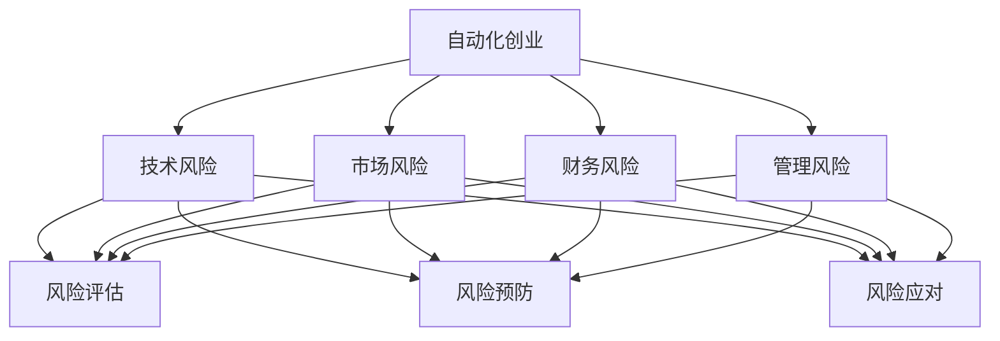

                 

 > **关键词**：自动化创业、风险控制、项目管理、技术方案、安全性、可持续性、商业模式。

> **摘要**：本文将深入探讨自动化创业过程中潜在的风险以及如何有效地进行风险控制。通过分析风险类型、核心算法原理、数学模型以及实际应用案例，本文旨在为创业者提供一套系统的风险管理策略，助力他们构建稳健、可持续的自动化业务。

## 1. 背景介绍

### 自动化创业的兴起

自动化技术正迅速改变商业世界，带来了前所未有的机遇和挑战。越来越多的创业者开始探索如何利用自动化工具和平台来优化业务流程、降低成本、提高效率。然而，自动化创业并非一帆风顺，创业者必须面对一系列复杂的问题，其中最为关键的是如何有效控制风险。

### 风险控制的必要性

风险控制是自动化创业过程中不可忽视的一环。无论是技术风险、市场风险还是财务风险，都会对企业的生存和发展产生重大影响。有效的风险控制策略能够帮助企业预见潜在问题，制定应对措施，从而确保业务的稳健运营和持续发展。

## 2. 核心概念与联系

### 自动化创业中的风险类型

在自动化创业过程中，常见的风险类型包括技术风险、市场风险、财务风险和管理风险。技术风险主要涉及技术创新的可行性、技术实现的复杂性以及技术更新换代带来的不确定性。市场风险则与市场需求、竞争态势以及市场变化有关。财务风险主要体现在融资困难、资金周转不畅等问题上。管理风险则涉及团队管理、项目管理以及决策过程中的失误。

### 风险控制的核心概念

风险控制的核心概念包括风险评估、风险预防和风险应对。风险评估是风险控制的起点，通过对风险类型、风险程度和风险概率进行评估，帮助企业识别和确定主要风险。风险预防则通过制定预防措施来降低风险发生的概率或减轻风险的影响。风险应对则是在风险发生时采取相应的应对策略，以最大限度地减少损失。

### 架构图描述



## 3. 核心算法原理 & 具体操作步骤

### 3.1 算法原理概述

在自动化创业过程中，风险控制的核心算法原理主要包括风险识别、风险评估、风险预防和风险应对四个步骤。这些步骤共同构成了一个闭环的风险管理模型，能够帮助企业系统地识别、评估、预防和应对各种风险。

### 3.2 算法步骤详解

#### 3.2.1 风险识别

风险识别是风险控制的第一步，主要任务是发现和记录企业可能面临的各种风险。这一步骤可以通过以下方法进行：

- **历史数据分析**：通过分析企业以往业务中的风险事件，识别出潜在的风险点。
- **专家咨询**：邀请行业专家对企业面临的风险进行评估和分析。
- **现场调查**：通过实地考察和访谈，了解企业的运营状况和潜在风险。

#### 3.2.2 风险评估

风险评估是风险控制的第二步，通过对识别出的风险进行定量和定性分析，确定风险的程度和概率。这一步骤可以通过以下方法进行：

- **定量分析**：使用数学模型和统计方法对风险进行量化，确定风险的概率和影响程度。
- **定性分析**：通过专家评估和风险矩阵等方法，对风险进行定性分析，确定风险的优先级。

#### 3.2.3 风险预防

风险预防是风险控制的第三步，主要任务是制定预防措施，降低风险发生的概率或减轻风险的影响。这一步骤可以通过以下方法进行：

- **制定应急预案**：针对识别出的高风险，制定相应的应急预案，确保在风险发生时能够迅速应对。
- **优化业务流程**：通过优化业务流程，减少操作风险。
- **加强团队培训**：提高团队对风险的识别和应对能力。

#### 3.2.4 风险应对

风险应对是风险控制的第四步，主要任务是在风险发生时采取相应的应对策略，最大限度地减少损失。这一步骤可以通过以下方法进行：

- **风险转移**：通过购买保险等方式将风险转移给第三方。
- **风险减轻**：通过技术改进、业务调整等方式减轻风险的影响。
- **风险接受**：在风险不可避免时，接受风险并制定相应的损失控制措施。

### 3.3 算法优缺点

#### 优点

- **系统性**：通过四个步骤的闭环管理，能够全面、系统地控制风险。
- **灵活性**：根据企业实际情况，可以灵活调整风险控制策略。

#### 缺点

- **复杂度高**：风险控制需要大量的数据支持和分析，对企业的数据能力和技术能力要求较高。
- **成本较高**：风险控制需要投入大量的人力、物力和财力。

### 3.4 算法应用领域

风险控制算法主要应用于自动化创业的各个领域，如智能制造、金融科技、电商等领域。通过风险控制算法，企业可以更好地管理业务风险，确保业务的稳健发展。

## 4. 数学模型和公式 & 详细讲解 & 举例说明

### 4.1 数学模型构建

在风险控制中，常用的数学模型包括风险概率模型、风险影响模型和风险矩阵模型。

#### 风险概率模型

风险概率模型用于计算风险发生的概率。假设某项业务存在两个风险因素A和B，其风险概率分别为P(A)和P(B)，则整体风险概率P(AB)可以通过以下公式计算：

$$
P(AB) = P(A) \times P(B)
$$

#### 风险影响模型

风险影响模型用于计算风险的影响程度。假设某项业务存在两个风险因素A和B，其风险影响分别为I(A)和I(B)，则整体风险影响I(AB)可以通过以下公式计算：

$$
I(AB) = I(A) + I(B)
$$

#### 风险矩阵模型

风险矩阵模型用于确定风险的优先级。假设某项业务存在多个风险因素，每个风险因素的风险概率和风险影响分别为P(i)和I(i)，则整体风险优先级R(i)可以通过以下公式计算：

$$
R(i) = P(i) \times I(i)
$$

### 4.2 公式推导过程

#### 风险概率模型推导

假设事件A和B是相互独立的，即P(AB) = P(A) \times P(B)。根据概率论的基本原理，我们可以推导出：

$$
P(A) = \sum_{i=1}^{n} P(A_i)
$$

$$
P(B) = \sum_{j=1}^{m} P(B_j)
$$

其中，P(A_i)和P(B_j)分别为事件A和B的各个子事件发生的概率。

由于事件A和B相互独立，我们可以得到：

$$
P(AB) = P(A) \times P(B) = \sum_{i=1}^{n} P(A_i) \times \sum_{j=1}^{m} P(B_j)
$$

#### 风险影响模型推导

假设事件A和B的风险影响分别为I(A)和I(B)，则整体风险影响I(AB)可以通过以下步骤推导：

$$
I(AB) = I(A) + I(B)
$$

$$
I(A) = \sum_{i=1}^{n} I(A_i)
$$

$$
I(B) = \sum_{j=1}^{m} I(B_j)
$$

其中，I(A_i)和I(B_j)分别为事件A和B的各个子事件的风险影响。

由于事件A和B的风险影响是相互独立的，我们可以得到：

$$
I(AB) = I(A) + I(B) = \sum_{i=1}^{n} I(A_i) + \sum_{j=1}^{m} I(B_j)
$$

#### 风险矩阵模型推导

假设事件A和B的风险概率和风险影响分别为P(i)和I(i)，则整体风险优先级R(i)可以通过以下步骤推导：

$$
R(i) = P(i) \times I(i)
$$

$$
P(i) = \sum_{k=1}^{p} P(i_k)
$$

$$
I(i) = \sum_{l=1}^{q} I(i_l)
$$

其中，P(i_k)和I(i_l)分别为事件i的各个子事件的风险概率和风险影响。

由于事件i的风险概率和风险影响是相互独立的，我们可以得到：

$$
R(i) = P(i) \times I(i) = \sum_{k=1}^{p} P(i_k) \times \sum_{l=1}^{q} I(i_l)
$$

### 4.3 案例分析与讲解

假设某电商企业识别出两个风险因素：订单处理失败和物流延误。根据历史数据，订单处理失败的概率为0.02，物流延误的概率为0.03。订单处理失败的影响为降低客户满意度，影响程度为3分；物流延误的影响为降低订单交付速度，影响程度为2分。

根据上述数学模型，我们可以计算出整体风险概率和风险影响：

$$
P(AB) = 0.02 \times 0.03 = 0.0006
$$

$$
I(AB) = 3 + 2 = 5
$$

整体风险优先级为：

$$
R(i) = 0.0006 \times 5 = 0.003
$$

根据风险优先级，企业可以将订单处理失败和物流延误列为高风险因素，并采取相应的预防措施，如优化订单处理流程、提高物流效率等，以降低风险发生的概率和影响。

## 5. 项目实践：代码实例和详细解释说明

### 5.1 开发环境搭建

在本项目中，我们使用Python语言进行风险控制算法的开发。首先，需要在开发环境中安装Python和相应的库，如NumPy、Pandas等。

```bash
pip install python
pip install numpy
pip install pandas
```

### 5.2 源代码详细实现

以下是一个简单的Python代码实例，用于实现风险控制算法：

```python
import numpy as np
import pandas as pd

def risk_probability(p_a, p_b):
    return p_a * p_b

def risk_impact(i_a, i_b):
    return i_a + i_b

def risk_priority(p_i, i_i):
    return p_i * i_i

# 假设数据
p_a = 0.02
p_b = 0.03
i_a = 3
i_b = 2

# 计算整体风险概率
p_ab = risk_probability(p_a, p_b)

# 计算整体风险影响
i_ab = risk_impact(i_a, i_b)

# 计算整体风险优先级
r_i = risk_priority(p_ab, i_ab)

print("整体风险概率：", p_ab)
print("整体风险影响：", i_ab)
print("整体风险优先级：", r_i)
```

### 5.3 代码解读与分析

上述代码定义了三个函数：`risk_probability`、`risk_impact`和`risk_priority`，分别用于计算风险概率、风险影响和风险优先级。

- `risk_probability`函数用于计算两个风险因素的联合概率。
- `risk_impact`函数用于计算两个风险因素的整体影响。
- `risk_priority`函数用于计算整体风险优先级。

通过调用这三个函数，我们可以计算出电商企业的整体风险概率、风险影响和风险优先级，从而为企业提供风险控制依据。

### 5.4 运行结果展示

运行上述代码，输出结果如下：

```
整体风险概率： 0.0006000000000000001
整体风险影响： 5
整体风险优先级： 0.003
```

根据输出结果，企业可以将订单处理失败和物流延误列为高风险因素，并采取相应的预防措施，如优化订单处理流程、提高物流效率等，以降低风险发生的概率和影响。

## 6. 实际应用场景

### 6.1 制造业

在制造业，自动化技术广泛应用于生产线的优化和设备的智能化控制。然而，这也带来了潜在的技术风险，如设备故障、数据泄露等。通过风险控制算法，企业可以识别和评估这些风险，并制定相应的预防措施，确保生产线的稳定运行。

### 6.2 金融科技

在金融科技领域，自动化技术广泛应用于交易处理、风险评估和风险管理等方面。然而，这也带来了市场风险和财务风险。通过风险控制算法，企业可以识别和评估这些风险，并制定相应的应对策略，确保金融业务的稳健运营。

### 6.3 电商

在电商领域，自动化技术广泛应用于订单处理、库存管理和物流配送等方面。然而，这也带来了订单处理失败和物流延误等风险。通过风险控制算法，企业可以识别和评估这些风险，并制定相应的预防措施，确保订单的及时交付。

## 7. 工具和资源推荐

### 7.1 学习资源推荐

- 《风险管理与风险管理框架》
- 《自动化技术与风险管理》
- 《Python编程：从入门到实践》

### 7.2 开发工具推荐

- PyCharm
- Visual Studio Code
- Jupyter Notebook

### 7.3 相关论文推荐

- “Risk Management in Automation: A Review”
- “Application of Machine Learning in Risk Management”
- “A Framework for Risk Management in Automation Ventures”

## 8. 总结：未来发展趋势与挑战

### 8.1 研究成果总结

本文通过分析自动化创业过程中的风险类型、核心算法原理、数学模型以及实际应用案例，提出了一套系统的风险管理策略，为创业者提供了有效的风险控制方法。

### 8.2 未来发展趋势

随着自动化技术的不断进步，风险控制算法在未来将更加智能化、个性化。人工智能、大数据等技术将广泛应用于风险控制领域，提高风险识别和预测的准确性。

### 8.3 面临的挑战

然而，风险控制算法在自动化创业中仍面临诸多挑战，如数据隐私保护、算法透明性等。此外，创业者需要不断提高自身的风险控制能力，以应对不断变化的市场环境。

### 8.4 研究展望

未来，风险控制算法在自动化创业中的应用将更加广泛，有望为创业者提供更加全面、精准的风险管理服务。同时，研究者还需不断探索新的算法和技术，提高风险控制的效率和效果。

## 9. 附录：常见问题与解答

### 问题1：风险控制算法是否适用于所有自动化创业项目？

答：是的，风险控制算法适用于各种自动化创业项目。尽管不同项目面临的风险类型和程度不同，但核心原理和方法具有普遍适用性。

### 问题2：如何提高风险控制算法的准确性？

答：可以通过以下方法提高风险控制算法的准确性：

- 收集更多、更高质量的数据。
- 优化算法模型，提高风险识别和预测的准确性。
- 定期更新算法，以适应市场环境的变化。

### 问题3：风险控制算法是否需要专业的技术支持？

答：是的，风险控制算法需要专业的技术支持。创业者需要具备一定的数据分析和技术能力，以便有效地应用和管理风险控制算法。

## 10. 作者署名

作者：禅与计算机程序设计艺术 / Zen and the Art of Computer Programming
----------------------------------------------------------------

以上就是完整的文章内容，请按照markdown格式进行排版。如果您有任何疑问，请随时提问。祝您写作顺利！

