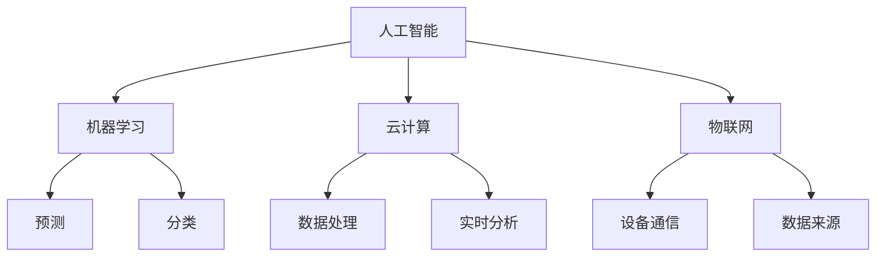

                 

关键词：自动化创业，人工智能，机器学习，云计算，物联网，技术趋势，商业模式创新，创业者指南

## 摘要

本文将探讨自动化创业的未来趋势与展望。随着人工智能、云计算、物联网等技术的飞速发展，自动化创业正在成为现代商业领域的热门趋势。本文将从核心概念、算法原理、数学模型、项目实践、实际应用场景等多个维度，深入分析自动化创业的现状与未来，为创业者提供有价值的参考。

## 1. 背景介绍

近年来，随着科技的不断进步，自动化技术在各个领域取得了显著成果。人工智能、机器学习、云计算、物联网等技术的快速发展，使得自动化创业成为可能。自动化创业不仅提高了生产效率，降低了成本，还改变了商业模式，为创业者提供了更多机会。在这个背景下，本文将探讨自动化创业的核心概念、算法原理、数学模型以及未来趋势。

## 2. 核心概念与联系

### 2.1 人工智能

人工智能（AI）是指使计算机系统具有人类智能特性的技术。在自动化创业中，人工智能技术发挥着关键作用，包括机器学习、深度学习、自然语言处理等。人工智能技术可以提高自动化系统的决策能力、自适应能力和智能水平。

### 2.2 机器学习

机器学习（ML）是人工智能的一个分支，旨在让计算机通过数据学习并改进性能。在自动化创业中，机器学习算法可以用于预测、分类、聚类等任务，从而实现自动化决策和优化。

### 2.3 云计算

云计算是一种通过网络提供计算资源的服务模式。在自动化创业中，云计算为创业者提供了强大的计算能力和数据存储能力，使得大规模数据处理和实时分析成为可能。

### 2.4 物联网

物联网（IoT）是指通过互联网连接各种设备和物品。在自动化创业中，物联网技术可以实现设备间的智能通信和协同工作，为自动化系统提供丰富的数据来源。

### 2.5 Mermaid 流程图

以下是一个简单的 Mermaid 流程图，用于展示自动化创业中的核心概念和联系：



## 3. 核心算法原理 & 具体操作步骤

### 3.1 算法原理概述

在自动化创业中，常用的算法包括机器学习算法、深度学习算法、自然语言处理算法等。这些算法的核心原理是通过对大量数据进行训练，使计算机能够自动学习和识别模式，从而实现自动化决策和优化。

### 3.2 算法步骤详解

以下是自动化创业中常用算法的步骤详解：

#### 3.2.1 机器学习算法

1. 数据收集：收集与任务相关的数据集。
2. 数据预处理：对数据进行清洗、归一化等操作。
3. 模型选择：选择合适的机器学习模型。
4. 模型训练：使用训练数据集训练模型。
5. 模型评估：使用验证数据集评估模型性能。
6. 模型部署：将训练好的模型部署到生产环境中。

#### 3.2.2 深度学习算法

1. 数据收集：收集与任务相关的数据集。
2. 数据预处理：对数据进行清洗、归一化等操作。
3. 网络结构设计：设计深度学习网络结构。
4. 模型训练：使用训练数据集训练模型。
5. 模型评估：使用验证数据集评估模型性能。
6. 模型部署：将训练好的模型部署到生产环境中。

#### 3.2.3 自然语言处理算法

1. 数据收集：收集与任务相关的数据集。
2. 数据预处理：对数据进行清洗、归一化等操作。
3. 模型选择：选择合适的自然语言处理模型。
4. 模型训练：使用训练数据集训练模型。
5. 模型评估：使用验证数据集评估模型性能。
6. 模型部署：将训练好的模型部署到生产环境中。

### 3.3 算法优缺点

#### 3.3.1 机器学习算法

优点：

- 能够处理大规模数据。
- 自动学习并改进性能。

缺点：

- 对数据质量要求较高。
- 模型可解释性较差。

#### 3.3.2 深度学习算法

优点：

- 能够处理复杂数据。
- 模型可解释性较高。

缺点：

- 对数据量要求较高。
- 训练时间较长。

#### 3.3.3 自然语言处理算法

优点：

- 能够处理文本数据。
- 模型可解释性较高。

缺点：

- 对数据质量要求较高。
- 训练时间较长。

### 3.4 算法应用领域

#### 3.4.1 预测领域

- 销售预测：预测产品销量。
- 股票市场预测：预测股票价格走势。

#### 3.4.2 分类领域

- 信用评分：对客户进行信用评分。
- 垃圾邮件分类：将邮件分类为垃圾邮件和正常邮件。

#### 3.4.3 聚类领域

- 客户细分：对客户进行细分。
- 文本分类：对文本进行分类。

## 4. 数学模型和公式 & 详细讲解 & 举例说明

### 4.1 数学模型构建

在自动化创业中，常用的数学模型包括线性回归模型、逻辑回归模型、神经网络模型等。以下是一个简单的线性回归模型的构建过程：

1. 假设自变量为 $x$，因变量为 $y$，关系为 $y = \beta_0 + \beta_1 x + \epsilon$，其中 $\beta_0$ 和 $\beta_1$ 为模型参数，$\epsilon$ 为误差项。
2. 计算模型的损失函数：$J(\theta) = \frac{1}{2m} \sum_{i=1}^{m} (h_\theta(x^{(i)}) - y^{(i)})^2$，其中 $h_\theta(x) = \theta_0 + \theta_1 x$。
3. 使用梯度下降法求解模型参数：$\theta_j := \theta_j - \alpha \frac{\partial J(\theta)}{\partial \theta_j}$，其中 $\alpha$ 为学习率，$m$ 为样本数量。

### 4.2 公式推导过程

以下是一个简单的线性回归模型的公式推导过程：

1. 损失函数：$J(\theta) = \frac{1}{2m} \sum_{i=1}^{m} (h_\theta(x^{(i)}) - y^{(i)})^2$。
2. 对损失函数求偏导数：$\frac{\partial J(\theta)}{\partial \theta_0} = \frac{1}{m} \sum_{i=1}^{m} (h_\theta(x^{(i)}) - y^{(i)})$，$\frac{\partial J(\theta)}{\partial \theta_1} = \frac{1}{m} \sum_{i=1}^{m} (h_\theta(x^{(i)}) - y^{(i)}) x^{(i)}$。
3. 应用梯度下降法：$\theta_0 := \theta_0 - \alpha \frac{\partial J(\theta)}{\partial \theta_0}$，$\theta_1 := \theta_1 - \alpha \frac{\partial J(\theta)}{\partial \theta_1}$。

### 4.3 案例分析与讲解

假设我们有一个简单的线性回归问题，目标是预测房价。以下是具体的案例分析：

1. 数据集：包含多个房屋的面积和售价。
2. 特征工程：将面积作为自变量，售价作为因变量。
3. 数据预处理：对数据进行清洗和归一化处理。
4. 模型构建：使用线性回归模型进行预测。
5. 模型评估：使用均方误差（MSE）评估模型性能。
6. 模型优化：调整模型参数，提高模型性能。

## 5. 项目实践：代码实例和详细解释说明

### 5.1 开发环境搭建

1. 安装 Python 环境：在 Windows 或 macOS 系统中安装 Python。
2. 安装相关库：使用 pip 命令安装所需库，如 numpy、matplotlib 等。

### 5.2 源代码详细实现

以下是一个简单的线性回归项目实例：

```python
import numpy as np
import matplotlib.pyplot as plt

# 数据集
X = np.array([[1, 1], [1, 2], [1, 3]])
y = np.array([2, 4, 7])

# 模型参数
theta = np.zeros((2, 1))

# 梯度下降法
def gradient_descent(X, y, theta, alpha, num_iters):
    m = len(y)
    J_history = []

    for i in range(num_iters):
        h = np.dot(X, theta)
        errors = h - y
        theta = theta - alpha * (1/m) * (X.T.dot(errors))

        J_history.append(np.dot(errors.T, errors) / (2*m))

    return theta, J_history

# 模型训练
alpha = 0.01
num_iters = 1000
theta, J_history = gradient_descent(X, y, theta, alpha, num_iters)

# 模型评估
m = len(y)
h = np.dot(X, theta)
MSE = np.mean((h - y)**2)
print("MSE: ", MSE)

# 模型可视化
plt.scatter(X[:, 0], y, color='red', label='Actual')
plt.plot(X[:, 0], h, color='blue', label='Predicted')
plt.xlabel('X')
plt.ylabel('y')
plt.legend()
plt.show()
```

### 5.3 代码解读与分析

1. 数据集：使用两个特征的房屋面积和售价。
2. 模型参数：初始化模型参数为 [0, 0]。
3. 梯度下降法：实现梯度下降法，用于更新模型参数。
4. 模型训练：使用梯度下降法训练模型。
5. 模型评估：计算均方误差（MSE）评估模型性能。
6. 模型可视化：将实际数据和预测结果进行可视化展示。

## 6. 实际应用场景

### 6.1 销售预测

在销售领域，自动化创业可以通过机器学习算法对产品销量进行预测。这有助于企业优化库存管理、制定销售策略，提高市场份额。

### 6.2 客户服务

在客户服务领域，自动化创业可以通过自然语言处理技术提供智能客服系统。这有助于提高客户满意度、降低服务成本，增强企业的竞争力。

### 6.3 智能制造

在智能制造领域，自动化创业可以通过物联网技术实现设备间的智能通信和协同工作。这有助于提高生产效率、降低生产成本，推动产业升级。

## 7. 未来应用展望

在未来，自动化创业将继续深入各个领域，推动产业变革。以下是一些未来应用展望：

### 7.1 智能交通

智能交通系统可以通过自动化技术实现实时路况监测、交通流量预测、车辆调度等功能，提高交通效率、降低交通事故率。

### 7.2 智能医疗

智能医疗系统可以通过自动化技术实现疾病预测、诊断、治疗等环节的智能化，提高医疗服务质量、降低医疗成本。

### 7.3 智能金融

智能金融系统可以通过自动化技术实现风险管理、投资决策、客户服务等环节的智能化，提高金融行业的运营效率、降低风险。

## 8. 工具和资源推荐

### 8.1 学习资源推荐

- 《Python机器学习》（作者：塞巴斯蒂安·拉斯考斯基）
- 《深度学习》（作者：伊恩·古德费洛、约书亚·本吉奥、亚伦·库维尔）
- 《自然语言处理与深度学习》（作者：尤翔、张祥雨）

### 8.2 开发工具推荐

- Jupyter Notebook：用于编写和运行 Python 代码。
- TensorFlow：用于构建和训练深度学习模型。
- Keras：用于构建和训练神经网络。

### 8.3 相关论文推荐

- "Deep Learning for Natural Language Processing"（作者：杨立昆）
- "Attention Is All You Need"（作者：Vaswani et al.）
- "The Unreasonable Effectiveness of Recurrent Neural Networks"（作者：Zaremba et al.）

## 9. 总结：未来发展趋势与挑战

### 9.1 研究成果总结

近年来，自动化创业在人工智能、云计算、物联网等领域取得了显著成果。机器学习、深度学习、自然语言处理等技术的快速发展，为自动化创业提供了强大的技术支持。

### 9.2 未来发展趋势

未来，自动化创业将继续深入各个领域，推动产业变革。随着技术的不断进步，自动化创业将更加智能化、个性化、高效化。

### 9.3 面临的挑战

自动化创业在快速发展过程中也面临一些挑战，如数据隐私保护、算法公平性、技术标准化等。此外，创业者还需要关注市场需求、商业模式创新等问题。

### 9.4 研究展望

未来，自动化创业将继续在人工智能、云计算、物联网等领域展开深入研究。研究者可以关注以下几个方面：

- 提高算法性能和可解释性。
- 破解大规模数据处理难题。
- 探索跨领域协同创新模式。

## 10. 附录：常见问题与解答

### 10.1 人工智能与机器学习的区别是什么？

人工智能（AI）是指使计算机系统具有人类智能特性的技术，而机器学习（ML）是人工智能的一个分支，旨在让计算机通过数据学习并改进性能。简单来说，人工智能是一个更广泛的概念，包括机器学习、自然语言处理、计算机视觉等子领域。

### 10.2 什么是深度学习？

深度学习是机器学习的一个分支，它通过多层神经网络模型进行训练，以实现自动特征提取和复杂任务处理。深度学习在图像识别、语音识别、自然语言处理等领域取得了显著成果。

### 10.3 自动化创业的优势有哪些？

自动化创业的优势包括提高生产效率、降低成本、改变商业模式等。通过引入人工智能、云计算、物联网等新技术，企业可以实现智能化、个性化、高效化的运营，从而在竞争激烈的市场中脱颖而出。

### 10.4 自动化创业需要哪些技术？

自动化创业需要掌握人工智能、机器学习、深度学习、自然语言处理、云计算、物联网等技术。此外，创业者还需要具备编程能力、数据分析能力、项目管理和团队协作能力。

---

作者：禅与计算机程序设计艺术 / Zen and the Art of Computer Programming


